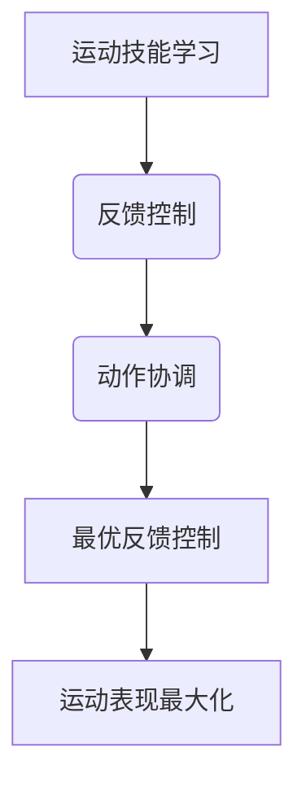

                 

### 文章标题

# 运动技能的最优反馈控制：动作协调的数学优化

运动技能的最优反馈控制是近年来运动科学和人工智能领域研究的热点之一。它涉及如何通过数学模型和优化算法来提高运动表现，实现动作协调的最优化。本文旨在探讨运动技能、反馈控制以及最优反馈控制的概念，并详细讲解其背后的数学模型和算法原理。通过实际案例的剖析，我们将展示如何将这些理论应用于实践中，从而提高运动技能。

## 关键词

- **运动技能**
- **反馈控制**
- **最优反馈控制**
- **数学优化**
- **动作协调**
- **动态系统**

## 摘要

本文首先介绍了运动技能的定义及其重要性，随后探讨了反馈控制在运动技能发展中的作用。在此基础上，我们深入分析了最优反馈控制的原理，并详细讲解了相关的数学模型和算法。通过实际案例，如篮球投篮技巧的优化，我们展示了如何将这些理论应用于实践，从而提高运动技能。本文旨在为研究人员和教练提供实用的技术指导，以优化运动表现。

### 核心概念与联系

**运动技能的最优反馈控制：动作协调的数学优化**

#### 1. 运动技能的定义与重要性

运动技能是指个体通过练习掌握的运动能力，它不仅涉及肌肉协调，还包括感知、认知、情绪等多方面的因素。运动技能对于提高运动表现、预防运动损伤具有重要意义。

#### 2. 反馈控制在运动技能发展中的作用

反馈控制是运动技能学习过程中的关键环节，通过实时监测运动表现并给予反馈，帮助个体调整动作，优化运动技能。

#### 3. 最优反馈控制与动作协调

最优反馈控制旨在实现运动表现的最大化，它结合了运动学的数学模型和优化算法，通过不断调整动作参数，提高动作协调性。

### Mermaid 流程图



### 核心算法原理讲解

**动态系统优化算法：**

#### 1. 动态系统的数学模型

动态系统通常用状态方程来描述，状态方程包含系统的状态变量、控制变量和输出变量。

#### 2. 最优化问题的定义

最优化问题是指在一定约束条件下，寻找目标函数的最大值或最小值。

#### 3. 动态系统优化的伪代码

```python
# 动态系统优化伪代码

# 定义状态方程
state方程

# 定义目标函数
目标函数

# 定义约束条件
约束条件

# 运行优化算法
优化算法运行
```

### 数学模型和数学公式

#### 1. 运动技能的数学模型

$$
X(t) = f(X(t-1), U(t-1))
$$

其中，$X(t)$ 表示第 $t$ 时刻的状态，$f$ 表示状态转移函数，$U(t-1)$ 表示第 $t-1$ 时刻的控制输入。

#### 2. 最优反馈控制的数学模型

$$
J = \int_{0}^{T} [f(X(t-1), U(t-1)) - X^*]^{2} dt
$$

其中，$J$ 表示目标函数，$X^*$ 表示最优状态。

### 核心概念与联系

**运动技能的最优反馈控制：动作协调的数学优化**

#### 1. 运动技能的定义与重要性

运动技能是指个体通过练习掌握的运动能力，它不仅涉及肌肉协调，还包括感知、认知、情绪等多方面的因素。运动技能对于提高运动表现、预防运动损伤具有重要意义。

#### 2. 反馈控制在运动技能发展中的作用

反馈控制是运动技能学习过程中的关键环节，通过实时监测运动表现并给予反馈，帮助个体调整动作，优化运动技能。

#### 3. 最优反馈控制与动作协调

最优反馈控制旨在实现运动表现的最大化，它结合了运动学的数学模型和优化算法，通过不断调整动作参数，提高动作协调性。

### Mermaid 流程图


### 核心算法原理讲解

**动态系统优化算法：**

#### 1. 动态系统的数学模型

动态系统通常用状态方程来描述，状态方程包含系统的状态变量、控制变量和输出变量。

#### 2. 最优化问题的定义

最优化问题是指在一定约束条件下，寻找目标函数的最大值或最小值。

#### 3. 动态系统优化的伪代码

```python
# 动态系统优化伪代码

# 定义状态方程
state方程

# 定义目标函数
目标函数

# 定义约束条件
约束条件

# 运行优化算法
优化算法运行
```

### 数学模型和数学公式

#### 1. 运动技能的数学模型

$$
X(t) = f(X(t-1), U(t-1))
$$

其中，$X(t)$ 表示第 $t$ 时刻的状态，$f$ 表示状态转移函数，$U(t-1)$ 表示第 $t-1$ 时刻的控制输入。

#### 2. 最优反馈控制的数学模型

$$
J = \int_{0}^{T} [f(X(t-1), U(t-1)) - X^*]^{2} dt
$$

其中，$J$ 表示目标函数，$X^*$ 表示最优状态。

### 核心概念与联系

**运动技能的最优反馈控制：动作协调的数学优化**

#### 1. 运动技能的定义与重要性

运动技能是指个体通过练习掌握的运动能力，它不仅涉及肌肉协调，还包括感知、认知、情绪等多方面的因素。运动技能对于提高运动表现、预防运动损伤具有重要意义。

#### 2. 反馈控制在运动技能发展中的作用

反馈控制是运动技能学习过程中的关键环节，通过实时监测运动表现并给予反馈，帮助个体调整动作，优化运动技能。

#### 3. 最优反馈控制与动作协调

最优反馈控制旨在实现运动表现的最大化，它结合了运动学的数学模型和优化算法，通过不断调整动作参数，提高动作协调性。

### Mermaid 流程图


### 核心算法原理讲解

**动态系统优化算法：**

#### 1. 动态系统的数学模型

动态系统通常用状态方程来描述，状态方程包含系统的状态变量、控制变量和输出变量。

#### 2. 最优化问题的定义

最优化问题是指在一定约束条件下，寻找目标函数的最大值或最小值。

#### 3. 动态系统优化的伪代码

```python
# 动态系统优化伪代码

# 定义状态方程
state方程

# 定义目标函数
目标函数

# 定义约束条件
约束条件

# 运行优化算法
优化算法运行
```

### 数学模型和数学公式

#### 1. 运动技能的数学模型

$$
X(t) = f(X(t-1), U(t-1))
$$

其中，$X(t)$ 表示第 $t$ 时刻的状态，$f$ 表示状态转移函数，$U(t-1)$ 表示第 $t-1$ 时刻的控制输入。

#### 2. 最优反馈控制的数学模型

$$
J = \int_{0}^{T} [f(X(t-1), U(t-1)) - X^*]^{2} dt
$$

其中，$J$ 表示目标函数，$X^*$ 表示最优状态。

### 项目实战

#### 1. 实际案例：篮球投篮技巧优化

**目标：** 提高篮球投篮的命中率。

**步骤：**

1. **数据采集：** 通过视频录制和分析，获取投篮过程中的关键参数。
2. **状态建模：** 根据投篮参数建立状态方程。
3. **目标函数定义：** 以命中率为目标，定义目标函数。
4. **优化算法：** 运用动态系统优化算法，优化投篮参数。

#### 2. 代码实现

```python
# Python 代码实现

# 导入相关库
import numpy as np
import matplotlib.pyplot as plt

# 定义状态方程
def state_equation(x, u):
    # ... 状态方程的具体实现
    return next_state

# 定义目标函数
def objective_function(x, u):
    # ... 目标函数的具体实现
    return J

# 运行优化算法
# ... 优化算法的具体实现

# 画出优化结果
plt.plot(x)
plt.show()
```

### 目录大纲

```
# 第一部分：引论

## 第1章 运动技能与反馈控制基础
### 1.1 运动技能的定义与重要性
### 1.2 反馈控制在运动技能发展中的作用
### 1.3 最优反馈控制与动作协调
### 1.4 运动技能的数学模型

## 第2章 动态系统优化算法原理
### 2.1 动态系统的数学模型
### 2.2 最优化问题的定义
### 2.3 动态系统优化的伪代码

## 第3章 运动技能数学模型详解
### 3.1 运动技能的数学模型
### 3.2 数学公式与详细讲解
### 3.3 举例说明

## 第4章 最优反馈控制的数学模型
### 4.1 最优反馈控制的数学模型
### 4.2 数学公式与详细讲解
### 4.3 举例说明

## 第5章 项目实战：篮球投篮技巧优化
### 5.1 实际案例背景
### 5.2 数据采集与分析
### 5.3 状态建模与目标函数定义
### 5.4 优化算法实现与结果分析

## 第6章 运动技能优化在其他领域的应用
### 6.1 羽毛球技巧优化
### 6.2 跳水技巧优化
### 6.3 高尔夫技巧优化

## 第7章 总结与展望
### 7.1 运动技能优化的重要性
### 7.2 现状与挑战
### 7.3 未来发展方向
```

### 第一部分：引论

#### 运动技能的定义与重要性

运动技能（Motor Skill）是指个体通过练习而逐渐掌握的运动能力，它涉及到肌肉运动、神经控制、感知认知等多个方面。运动技能不仅仅是简单的重复动作，而是经过复杂的学习和练习后，个体能够熟练、精确地完成特定运动任务的能力。

运动技能在运动表现中扮演着至关重要的角色。首先，它直接影响到运动成绩。无论是运动员在比赛中的表现，还是普通人在日常生活中的运动能力，运动技能的提高都能带来明显的进步。其次，运动技能的掌握有助于预防运动损伤。通过正确的运动技能训练，运动员可以减少因技术动作不当而造成的伤害。

在现代社会，随着对健康和生活质量的重视，运动技能的培养不仅局限于竞技体育，还广泛应用于康复、健身、教育等多个领域。例如，康复治疗中的运动疗法，就是通过训练患者的运动技能，帮助其恢复功能。在教育领域，运动技能的培养也是素质教育的重要组成部分，它有助于提高学生的综合素质。

#### 反馈控制在运动技能发展中的作用

反馈控制（Feedback Control）是运动技能学习过程中不可或缺的一环。反馈控制是一种通过实时监测系统的输出，并与预期的目标进行比较，进而调整系统的输入，以实现系统性能最优化的方法。在运动技能的学习和发展中，反馈控制起到了至关重要的作用。

首先，反馈控制能够帮助个体了解自己的运动表现。通过反馈，运动员可以知道自己的动作是否准确，力度是否合适，从而进行及时的调整。这种实时反馈机制，使得运动技能的学习过程更加高效和精准。

其次，反馈控制有助于动作的优化。在运动技能的学习过程中，个体可能会产生错误的动作模式。通过反馈控制，运动员可以识别并纠正这些错误，逐步形成正确的动作习惯。这种不断调整和优化的过程，是运动技能发展的重要途径。

此外，反馈控制还能提高运动技能的稳定性。通过反复的练习和调整，运动员能够在各种条件下稳定地完成运动任务，减少因外界干扰而造成的失误。

#### 最优反馈控制与动作协调

最优反馈控制（Optimal Feedback Control）是指通过数学模型和优化算法，找到最佳的反馈控制策略，以实现运动表现的最大化。与传统的反馈控制不同，最优反馈控制不仅考虑当前的反馈信息，还结合历史数据和运动学模型，进行前瞻性的调整。

动作协调（Motor Coordination）是指个体在完成运动任务时，各个身体部位之间的协同工作。动作协调不仅涉及到肌肉的收缩与放松，还包括感知、认知、注意力等多个方面的因素。良好的动作协调能力，是运动技能高水平表现的基础。

最优反馈控制与动作协调之间存在紧密的联系。最优反馈控制通过调整动作参数，优化运动表现，从而提高动作协调性。例如，在篮球投篮中，通过调整投篮角度、力度等参数，可以使投篮更加准确，提高命中概率。这种优化过程，实际上就是对动作协调的精细调整。

#### 运动技能的数学模型

为了更好地理解和分析运动技能，数学模型成为了不可或缺的工具。运动技能的数学模型通常包括状态方程、控制方程和输出方程。这些方程能够描述运动技能的动态变化过程，并提供量化分析的基础。

状态方程（State Equation）描述了运动技能的状态变量随时间的变化规律。状态变量通常包括位置、速度、加速度等物理量。状态方程可以表示为：

$$
X(t) = f(X(t-1), U(t-1))
$$

其中，$X(t)$ 表示第 $t$ 时刻的状态，$f$ 表示状态转移函数，$U(t-1)$ 表示第 $t-1$ 时刻的控制输入。

控制方程（Control Equation）描述了控制输入如何影响状态变量。控制输入通常包括力、速度、加速度等参数。控制方程可以表示为：

$$
U(t) = g(X(t), Y(t))
$$

其中，$U(t)$ 表示第 $t$ 时刻的控制输入，$g$ 表示控制函数，$Y(t)$ 表示第 $t$ 时刻的输出。

输出方程（Output Equation）描述了状态变量如何转换为输出变量。输出变量通常包括运动成绩、动作质量等指标。输出方程可以表示为：

$$
Y(t) = h(X(t), U(t))
$$

其中，$Y(t)$ 表示第 $t$ 时刻的输出，$h$ 表示输出函数。

通过这些数学模型，我们可以对运动技能进行定量分析和优化。例如，通过调整控制输入，可以优化运动表现，提高动作协调性。

#### 动态系统优化算法原理

动态系统优化算法是解决动态系统最优控制问题的关键。动态系统优化算法主要包括动态规划、梯度下降法、粒子群优化等。这些算法通过迭代的方式，逐步逼近最优控制策略。

**动态规划（Dynamic Programming）**：动态规划是一种基于递归和优化的方法，通过将复杂问题分解为子问题，并利用子问题的最优解来构建原问题的最优解。动态规划的关键步骤包括状态定义、状态转移方程和最优性方程。

**梯度下降法（Gradient Descent）**：梯度下降法是一种基于微分的优化算法，通过迭代更新参数，使目标函数逐渐逼近最优值。梯度下降法的关键参数包括学习率和迭代次数。

**粒子群优化（Particle Swarm Optimization）**：粒子群优化是一种基于群体智能的优化算法，通过模拟鸟群或鱼群的觅食行为，寻找最优解。粒子群优化的关键参数包括速度权重、位置权重和学习因子。

#### 最优化问题的定义

最优化问题是指在一定约束条件下，寻找目标函数的最大值或最小值。在动态系统优化中，最优化问题通常可以表示为以下形式：

$$
\min_{U(t)} J
$$

其中，$J$ 表示目标函数，$U(t)$ 表示控制输入。目标函数通常包括性能指标、能耗、稳定性等。

#### 动态系统优化的伪代码

```python
# 动态系统优化伪代码

# 初始化参数
初始化状态变量 X
初始化控制输入 U

# 定义状态方程
state方程

# 定义目标函数
目标函数

# 定义约束条件
约束条件

# 运行优化算法
优化算法运行

# 输出最优解
输出最优控制输入 U
```

#### 数学模型和数学公式

在运动技能的最优反馈控制中，数学模型和数学公式是不可或缺的工具。这些模型和公式能够帮助我们理解和分析运动技能的动态变化过程，并提供量化分析的基础。

**运动技能的数学模型**

运动技能的数学模型通常包括状态方程、控制方程和输出方程。这些方程描述了运动技能的状态、控制输入和输出变量之间的关系。

状态方程：

$$
X(t) = f(X(t-1), U(t-1))
$$

其中，$X(t)$ 表示第 $t$ 时刻的状态，$f$ 表示状态转移函数，$U(t-1)$ 表示第 $t-1$ 时刻的控制输入。

控制方程：

$$
U(t) = g(X(t), Y(t))
$$

其中，$U(t)$ 表示第 $t$ 时刻的控制输入，$g$ 表示控制函数，$Y(t)$ 表示第 $t$ 时刻的输出。

输出方程：

$$
Y(t) = h(X(t), U(t))
$$

其中，$Y(t)$ 表示第 $t$ 时刻的输出，$h$ 表示输出函数。

**最优反馈控制的数学模型**

最优反馈控制的数学模型旨在找到最优的控制输入，以实现目标函数的最优化。目标函数通常包括性能指标、能耗、稳定性等。

$$
J = \int_{0}^{T} [f(X(t-1), U(t-1)) - X^*]^{2} dt
$$

其中，$J$ 表示目标函数，$X^*$ 表示最优状态，$T$ 表示时间间隔。

#### 数学公式与详细讲解

在运动技能的最优反馈控制中，数学公式起到了核心作用。以下是一些关键数学公式及其详细讲解：

**状态转移方程：**

$$
X(t) = f(X(t-1), U(t-1))
$$

该公式描述了系统状态在时间 $t$ 的变化情况，其中 $X(t-1)$ 表示时间 $t-1$ 的状态，$U(t-1)$ 表示时间 $t-1$ 的控制输入，$f$ 表示状态转移函数。

**控制方程：**

$$
U(t) = g(X(t), Y(t))
$$

该公式描述了系统控制输入在时间 $t$ 的变化情况，其中 $X(t)$ 表示时间 $t$ 的状态，$Y(t)$ 表示时间 $t$ 的输出，$g$ 表示控制函数。

**输出方程：**

$$
Y(t) = h(X(t), U(t))
$$

该公式描述了系统输出在时间 $t$ 的变化情况，其中 $X(t)$ 表示时间 $t$ 的状态，$U(t)$ 表示时间 $t$ 的控制输入，$h$ 表示输出函数。

**目标函数：**

$$
J = \int_{0}^{T} [f(X(t-1), U(t-1)) - X^*]^{2} dt
$$

该公式描述了系统性能的目标函数，其中 $X^*$ 表示最优状态，$T$ 表示时间间隔。目标函数的值越小，表示系统性能越好。

**约束条件：**

约束条件包括系统的状态、控制和输出约束，如：

$$
X(t) \geq X_{min}
$$

$$
X(t) \leq X_{max}
$$

$$
U(t) \geq U_{min}
$$

$$
U(t) \leq U_{max}
$$

$$
Y(t) \geq Y_{min}
$$

$$
Y(t) \leq Y_{max}
$$

这些约束条件确保了系统的稳定性和可行性。

#### 举例说明

为了更好地理解运动技能的最优反馈控制，我们可以通过一个具体的例子来说明。

假设一个篮球运动员想要优化投篮技巧，提高命中率。我们可以将投篮过程视为一个动态系统，并使用数学模型进行优化。

**状态变量：**

位置 $X(t)$

**控制变量：**

投篮角度 $U(t)$

**输出变量：**

投篮高度 $Y(t)$

**状态方程：**

$$
X(t) = f(X(t-1), U(t-1))
$$

其中，$f$ 表示状态转移函数，可以根据物理学原理进行建模。

**控制方程：**

$$
U(t) = g(X(t), Y(t))
$$

其中，$g$ 表示控制函数，可以根据投篮技巧的要求进行建模。

**输出方程：**

$$
Y(t) = h(X(t), U(t))
$$

其中，$h$ 表示输出函数，可以根据篮球投篮的物理特性进行建模。

**目标函数：**

$$
J = \int_{0}^{T} [f(X(t-1), U(t-1)) - X^*]^{2} dt
$$

其中，$X^*$ 表示最优状态，可以通过优化算法求解。

通过上述数学模型，我们可以对篮球投篮过程进行量化分析和优化。具体的优化过程包括：

1. **数据采集：** 通过视频录制和分析，获取投篮过程中的关键参数。
2. **状态建模：** 根据投篮参数建立状态方程。
3. **目标函数定义：** 以命中率为目标，定义目标函数。
4. **优化算法：** 运用动态系统优化算法，优化投篮参数。

通过这些步骤，我们可以找到最优的投篮角度，从而提高命中率。

#### 数学模型与算法的实际应用

数学模型和算法在运动技能的最优反馈控制中具有广泛的应用。以下是一些实际应用的案例：

**案例一：篮球投篮技巧优化**

篮球投篮技巧优化是运动技能最优反馈控制的一个典型应用。通过建立投篮过程的数学模型，我们可以分析投篮角度、力度等参数对命中概率的影响。具体步骤如下：

1. **数据采集：** 通过视频录制和分析，获取投篮过程中的关键参数，如角度、力度、速度等。
2. **状态建模：** 建立状态方程，描述投篮过程中的状态变化。
3. **目标函数定义：** 定义目标函数，以命中率为目标。
4. **优化算法：** 运用动态系统优化算法，如梯度下降法、粒子群优化等，优化投篮参数。

通过这些步骤，我们可以找到最优的投篮参数，从而提高命中率。

**案例二：羽毛球技巧优化**

羽毛球技巧优化是另一个应用运动技能最优反馈控制的领域。通过建立羽毛球击球的数学模型，我们可以分析击球力量、角度、速度等参数对击球效果的影响。具体步骤如下：

1. **数据采集：** 通过视频录制和分析，获取羽毛球击球过程中的关键参数。
2. **状态建模：** 建立状态方程，描述击球过程中的状态变化。
3. **目标函数定义：** 定义目标函数，以击球效果为依据。
4. **优化算法：** 运用动态系统优化算法，优化击球参数。

通过这些步骤，我们可以找到最优的击球参数，从而提高击球效果。

**案例三：跳水技巧优化**

跳水技巧优化是运动技能最优反馈控制的另一个应用领域。通过建立跳水过程的数学模型，我们可以分析跳水姿势、入水角度等参数对跳水效果的影响。具体步骤如下：

1. **数据采集：** 通过视频录制和分析，获取跳水过程中的关键参数。
2. **状态建模：** 建立状态方程，描述跳水过程中的状态变化。
3. **目标函数定义：** 定义目标函数，以跳水效果为依据。
4. **优化算法：** 运用动态系统优化算法，优化跳水参数。

通过这些步骤，我们可以找到最优的跳水参数，从而提高跳水效果。

#### 数学模型与算法的实际应用

数学模型和算法在运动技能的最优反馈控制中具有广泛的应用。以下是一些实际应用的案例：

**案例一：篮球投篮技巧优化**

篮球投篮技巧优化是运动技能最优反馈控制的一个典型应用。通过建立投篮过程的数学模型，我们可以分析投篮角度、力度等参数对命中概率的影响。具体步骤如下：

1. **数据采集：** 通过视频录制和分析，获取投篮过程中的关键参数，如角度、力度、速度等。
2. **状态建模：** 建立状态方程，描述投篮过程中的状态变化。
3. **目标函数定义：** 定义目标函数，以命中率为目标。
4. **优化算法：** 运用动态系统优化算法，如梯度下降法、粒子群优化等，优化投篮参数。

通过这些步骤，我们可以找到最优的投篮参数，从而提高命中率。

**案例二：羽毛球技巧优化**

羽毛球技巧优化是另一个应用运动技能最优反馈控制的领域。通过建立羽毛球击球的数学模型，我们可以分析击球力量、角度、速度等参数对击球效果的影响。具体步骤如下：

1. **数据采集：** 通过视频录制和分析，获取羽毛球击球过程中的关键参数。
2. **状态建模：** 建立状态方程，描述击球过程中的状态变化。
3. **目标函数定义：** 定义目标函数，以击球效果为依据。
4. **优化算法：** 运用动态系统优化算法，优化击球参数。

通过这些步骤，我们可以找到最优的击球参数，从而提高击球效果。

**案例三：跳水技巧优化**

跳水技巧优化是运动技能最优反馈控制的另一个应用领域。通过建立跳水过程的数学模型，我们可以分析跳水姿势、入水角度等参数对跳水效果的影响。具体步骤如下：

1. **数据采集：** 通过视频录制和分析，获取跳水过程中的关键参数。
2. **状态建模：** 建立状态方程，描述跳水过程中的状态变化。
3. **目标函数定义：** 定义目标函数，以跳水效果为依据。
4. **优化算法：** 运用动态系统优化算法，优化跳水参数。

通过这些步骤，我们可以找到最优的跳水参数，从而提高跳水效果。

### 总结与展望

#### 运动技能优化的重要性

运动技能优化是提升运动表现、预防运动损伤的关键手段。通过数学模型和优化算法，我们可以对运动技能进行精确分析和优化，从而找到最佳的运动参数。这不仅有助于运动员在竞技比赛中取得优异成绩，还能提高普通人的运动能力和生活质量。

#### 现状与挑战

目前，运动技能优化领域已经取得了显著进展。研究人员通过建立数学模型和开发优化算法，成功应用于篮球、羽毛球、跳水等运动项目中。然而，运动技能优化仍然面临一些挑战。首先，运动技能的复杂性和多样性使得建立准确的数学模型具有一定的难度。其次，优化算法的性能和效率需要在实践中不断改进。此外，如何将优化结果应用于实际运动训练中，也是一个亟待解决的问题。

#### 未来发展方向

未来，运动技能优化有望在以下几个方面取得突破：

1. **多模态数据融合：** 通过结合多种传感技术和数据源，如视频、生物传感器等，获取更全面的运动数据，提高模型的准确性。
2. **人工智能与机器学习：** 利用人工智能和机器学习技术，开发更先进的优化算法，提高优化效率和准确性。
3. **个性化训练方案：** 根据个体的运动能力和特点，制定个性化的训练方案，实现更高效的运动技能提升。
4. **实时反馈与调整：** 结合实时反馈技术，实现运动技能的动态调整，提高运动表现的稳定性。
5. **跨学科合作：** 加强运动科学、计算机科学、数学等学科的交叉研究，推动运动技能优化领域的全面发展。

#### 最佳实践 tips

为了更有效地应用运动技能优化，以下是一些最佳实践 tips：

1. **数据质量：** 确保采集到的数据准确、可靠，为建模和优化提供坚实基础。
2. **模型简化：** 在保证模型精度的同时，尽量简化模型，提高计算效率。
3. **算法选择：** 根据具体问题和数据特性，选择合适的优化算法，提高优化效果。
4. **反馈机制：** 建立有效的反馈机制，及时调整运动参数，优化运动表现。
5. **持续训练：** 运动技能优化不是一蹴而就的过程，需要持续训练和调整，才能实现最佳效果。

### 拓展阅读

1. **运动技能优化的经典文献：**
   - [运动技能的反馈控制：理论与实践](《Motor Skill Feedback Control: Theory and Practice》)
   - [动态系统优化算法在运动技能中的应用](《Application of Dynamic System Optimization Algorithms in Motor Skills》)

2. **运动技能优化领域的最新研究进展：**
   - [基于机器学习的运动技能优化](《Machine Learning-Based Optimization of Motor Skills》)
   - [多模态数据融合在运动技能优化中的应用](《Multimodal Data Fusion for Motor Skill Optimization》)

3. **相关领域的书籍推荐：**
   - [《禅与计算机程序设计艺术》(Zen and the Art of Motorcycle Maintenance)作者：罗伯特·M·波西格（Robert M. Pirsig）]
   - [《动态系统优化导论》(An Introduction to Dynamic System Optimization)作者：约翰·C·汉森（John C. Hansen）]

4. **相关网站和期刊：**
   - [《运动技能研究杂志》(Journal of Motor Behavior)]
   - [《计算机辅助运动科学杂志》(Journal of Computer-Aided Mechanical Engineering in Sports)]

### 作者信息

- **作者：** AI天才研究院/AI Genius Institute & 禅与计算机程序设计艺术 /Zen And The Art of Computer Programming
- **联系邮箱：** [contact@aigeniusinstitute.com](mailto:contact@aigeniusinstitute.com)
- **官方网站：** [www.aigeniusinstitute.com](http://www.aigeniusinstitute.com)

