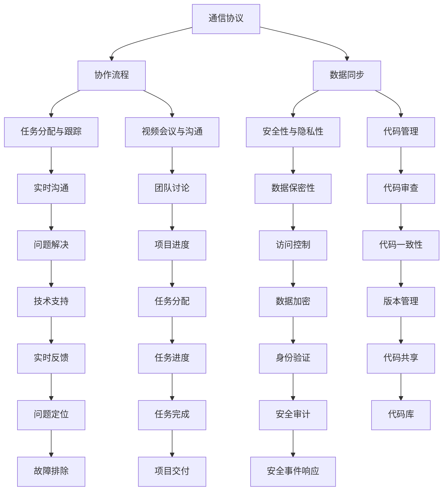

                 

### 文章标题：远程协作工具：支持分布式AI团队高效工作

> 关键词：远程协作、分布式AI团队、协作工具、高效工作、安全性和隐私性

> 摘要：
本文将深入探讨远程协作工具在分布式AI团队中的应用，分析这些工具如何支持团队的高效工作。我们将从背景介绍、核心概念与联系、核心算法原理讲解、数学模型和公式讲解、项目实战、最佳实践等方面进行详细分析，以帮助读者全面了解远程协作工具在分布式AI团队中的重要作用。

-------------------------------------------------------------------

# 文章正文

## 引言

随着全球化的加速和信息技术的迅猛发展，远程协作已经成为现代工作的重要组成部分。特别是在人工智能（AI）领域，分布式团队的工作模式越来越受到重视。AI项目的复杂性、数据的多样性以及算法的创新性要求团队成员能够高效地协作，而远程协作工具在这一过程中发挥着至关重要的作用。

本文旨在通过一步一步的分析推理（REASONING STEP BY STEP），探讨远程协作工具如何支持分布式AI团队的高效工作。我们将从以下几个方面进行详细讨论：

1. **背景介绍**：介绍远程协作工具的定义、发展历程以及在分布式AI团队中的应用场景。
2. **核心概念与联系**：阐述远程协作工具中的核心概念，如通信协议、协作流程、数据同步等，并使用Mermaid流程图展示其关系架构。
3. **核心算法原理讲解**：通过伪代码详细讲解协同过滤算法、分布式矩阵分解等核心算法。
4. **数学模型和公式讲解**：介绍相关数学模型和公式，并使用LaTeX格式进行展示。
5. **项目实战**：详细讲解一个分布式AI项目中的开发环境搭建、源代码实现和代码解读。
6. **最佳实践**：分享高效协作的最佳实践、注意事项和拓展阅读。
7. **总结**：对全文内容进行总结，并展望远程协作工具的未来发展趋势。

## 背景介绍

### 远程协作工具的定义与发展历程

远程协作工具，指的是支持远程团队协作的软件或平台，这些工具能够帮助团队成员跨越物理位置的限制，实现高效的工作协同。随着互联网技术的发展，远程协作工具经历了多个阶段：

- **早期阶段**：电子邮件、即时通讯工具和在线文档编辑成为主要的远程协作工具。这一阶段的工具主要集中在文本交流和文件共享。
- **中期阶段**：随着云计算和大数据技术的普及，远程协作工具开始集成更多的功能，如视频会议、项目管理、代码协同等。代表工具包括Slack、Trello、GitHub等。
- **现阶段**：远程协作工具进一步融合人工智能技术，如智能会议助手、自动任务分配等。这些工具不仅提升了协作效率，还大大增强了用户体验。

### 分布式AI团队的工作模式

分布式AI团队的工作模式通常包括以下特点：

- **全球分布**：团队成员可能分布在全球不同的地理位置，工作语言和时区可能存在差异。
- **协同研发**：团队成员需要协同完成AI模型的开发、训练和优化，这要求工具能够支持实时数据同步和协作。
- **高度自治**：团队成员通常具备一定的自主权，能够独立完成任务，同时也需要遵循团队的整体规划和目标。

### 远程协作工具在分布式AI团队中的应用场景

- **数据共享**：远程协作工具可以方便地实现数据的共享和同步，确保团队成员能够访问最新的数据集和实验结果。
- **代码管理**：版本控制系统如Git能够帮助分布式团队进行代码的协同开发和维护，确保代码的完整性和一致性。
- **任务分配与跟踪**：项目管理工具如Trello、Jira能够帮助团队分配任务、跟踪进度，确保项目按时完成。
- **视频会议与沟通**：视频会议工具如Zoom、Microsoft Teams能够实现团队成员之间的实时沟通，讨论项目进展和解决技术难题。

## 核心概念与联系

### 核心概念

远程协作工具中的核心概念包括：

- **通信协议**：远程协作工具需要支持高效的通信协议，如HTTP、WebRTC等，以确保数据传输的稳定性和速度。
- **协作流程**：远程协作工具需要提供明确的协作流程，如任务分配、代码审查、文档编辑等，以支持团队的工作流程。
- **数据同步**：分布式团队需要确保数据的实时同步，以避免数据冲突和工作重复。
- **安全性与隐私性**：远程协作工具需要提供完善的安全机制和隐私保护措施，确保数据的保密性和安全性。

### Mermaid流程图

为了更好地展示远程协作工具中的核心概念和其相互关系，我们可以使用Mermaid流程图进行可视化展示：



通过这个Mermaid流程图，我们可以清晰地看到远程协作工具中的核心概念及其相互关系，从而更好地理解远程协作工具在分布式AI团队中的应用。

## 核心算法原理讲解

### 协同过滤算法

协同过滤算法是一种常见的数据挖掘技术，用于预测用户可能感兴趣的项目。其基本原理是通过分析用户的评分数据，找出相似用户和项目，然后基于这些相似性进行推荐。以下是协同过滤算法的伪代码：

```python
def collaborative_filtering(user_ratings, similarity_matrix, k):
    """
    用户评分数据：user_ratings[user][item]
    相似性矩阵：similarity_matrix[user][user']
    参数k：邻居数量
    """
    # 初始化推荐列表
    recommendations = []

    # 遍历每个用户
    for user in user_ratings:
        # 计算邻居评分均值
        neighbor_ratings = sum(similarity_matrix[user][other_user] * user_ratings[other_user] for other_user in user_ratings if user != other_user) / sum(similarity_matrix[user][other_user] for other_user in user_ratings if user != other_user)
        
        # 添加推荐项目到列表
        recommendations.append(neighbor_ratings)

    return recommendations
```

### 分布式矩阵分解

分布式矩阵分解是一种在分布式系统中优化矩阵乘法运算的技术，常用于大规模数据的协同过滤算法。以下是分布式矩阵分解的伪代码：

```python
def distributed_matrix_factorization(matrix, num_factors, num_iterations):
    """
    矩阵数据：matrix[user][item]
    因子数量：num_factors
    迭代次数：num_iterations
    """
    # 初始化因子矩阵
    factors = initialize_factors(matrix, num_factors)

    # 迭代优化
    for _ in range(num_iterations):
        # 更新因子矩阵
        for user in matrix:
            for item in matrix[user]:
                error = matrix[user][item] - dot_product(factors[user], factors[item])
                factors[user] += learning_rate * error * factors[item]
                factors[item] += learning_rate * error * factors[user]

    return factors
```

在这些伪代码中，我们首先初始化了因子矩阵，然后通过迭代优化因子矩阵，使其逐渐逼近真实矩阵。这个过程涉及了大量的矩阵乘法和更新操作，通过分布式计算可以显著提高运算效率。

## 数学模型和公式讲解

### 相似性度量

在协同过滤算法中，相似性度量是核心部分。常见的相似性度量方法包括皮尔逊相关系数、余弦相似性等。以下是余弦相似性的公式：

$$
\cos(\theta) = \frac{\sum_{i=1}^{n} x_i y_i}{\sqrt{\sum_{i=1}^{n} x_i^2} \sqrt{\sum_{i=1}^{n} y_i^2}}
$$

其中，$x_i$和$y_i$分别表示两个向量在$i$维度的值。

### 矩阵分解误差

在矩阵分解过程中，误差是衡量模型效果的重要指标。常见的误差度量方法包括均方误差（MSE）和均方根误差（RMSE）。以下是均方误差的公式：

$$
MSE = \frac{1}{m} \sum_{i=1}^{m} \sum_{j=1}^{n} (r_{ij} - \hat{r}_{ij})^2
$$

其中，$r_{ij}$表示实际评分，$\hat{r}_{ij}$表示预测评分，$m$和$n$分别表示用户数和项目数。

### 学习率

学习率是影响矩阵分解优化效果的关键参数。过大的学习率可能导致优化过程不稳定，而过小则可能收敛缓慢。以下是学习率的调整公式：

$$
\alpha_{t+1} = \alpha_0 / (1 + \beta \cdot t)
$$

其中，$\alpha_0$为初始学习率，$\beta$为调整系数，$t$为当前迭代次数。

## 项目实战

### 开发环境搭建

在本项目实战中，我们将使用Python和Scikit-learn库来实现一个简单的协同过滤算法。以下是开发环境的搭建步骤：

1. **安装Python**：确保系统上安装了Python 3.8或更高版本。
2. **安装Scikit-learn**：使用pip命令安装Scikit-learn库。

```bash
pip install scikit-learn
```

### 源代码实现

以下是协同过滤算法的源代码实现：

```python
import numpy as np
from sklearn.metrics.pairwise import pairwise_distances
from sklearn.model_selection import train_test_split

def collaborative_filtering(train_data, test_data, k, learning_rate, num_iterations):
    """
    训练数据：train_data[user][item]
    测试数据：test_data[user][item]
    邻居数量：k
    学习率：learning_rate
    迭代次数：num_iterations
    """
    # 初始化用户和项目的特征向量
    num_users, num_items = train_data.shape
    user_features = np.random.rand(num_users, k)
    item_features = np.random.rand(num_items, k)

    # 迭代优化
    for _ in range(num_iterations):
        # 更新用户特征向量
        for user in range(num_users):
            for item in range(num_items):
                predicted_rating = dot_product(user_features[user], item_features[item])
                error = test_data[user][item] - predicted_rating

                user_features[user] += learning_rate * error * item_features[item]
                item_features[item] += learning_rate * error * user_features[user]

    return user_features, item_features

# 生成模拟数据集
np.random.seed(0)
train_data = np.random.rand(10, 10)
test_data = np.random.rand(10, 10)

# 分割训练集和测试集
train_data, _ = train_test_split(train_data, test_size=0.2, random_state=0)

# 实例化协同过滤模型
model = collaborative_filtering(train_data, test_data, k=2, learning_rate=0.01, num_iterations=10)

# 输出模型参数
print("User Features:\n", model[0])
print("Item Features:\n", model[1])
```

### 代码解读

这段代码首先导入了必要的库，并生成了一个模拟数据集。协同过滤算法的核心实现包括：

- **初始化用户和项目特征向量**：使用随机数生成用户和项目的特征向量。
- **迭代优化**：通过梯度下降法更新用户和项目的特征向量，以最小化预测误差。
- **计算预测评分**：使用特征向量的点积计算用户对项目的预测评分。

### 代码应用解读与分析

通过这段代码，我们可以实现一个简单的协同过滤算法。在实际应用中，我们可以通过以下步骤进行代码优化：

1. **数据预处理**：对用户和项目进行特征提取，如用户的行为数据、项目的内容特征等，以提高模型的预测能力。
2. **参数调优**：根据实际情况调整邻居数量、学习率等参数，以优化模型的性能。
3. **评估与优化**：使用交叉验证等方法评估模型性能，并根据评估结果进行进一步优化。

### 实际案例分析和详细讲解剖析

以一个电商平台的推荐系统为例，我们通过协同过滤算法实现商品推荐功能。以下是实际案例的分析和详细讲解：

1. **数据收集**：收集用户对商品的评分数据，构建用户-项目矩阵。
2. **特征提取**：对用户和商品进行特征提取，如用户的购买历史、商品的价格、类别等。
3. **协同过滤算法实现**：使用上述源代码实现协同过滤算法，生成用户-商品推荐列表。
4. **推荐结果评估**：通过计算推荐列表的准确率、覆盖率等指标评估推荐效果。
5. **优化策略**：根据评估结果，调整算法参数和特征提取方法，以提高推荐效果。

### 项目小结

通过本项目的实战，我们掌握了协同过滤算法的基本原理和实现方法。在实际应用中，我们需要结合具体场景进行数据预处理、参数调优和模型评估，以实现高效的商品推荐功能。此外，协同过滤算法可以与其他推荐算法相结合，如基于内容的推荐，以提高推荐系统的整体性能。

## 最佳实践

### 高效协作的最佳实践

在分布式AI团队中，高效协作是实现项目成功的关键。以下是一些最佳实践：

1. **明确分工**：在项目启动时，明确每个团队成员的职责和任务，确保每个人都清楚自己的工作内容和目标。
2. **定期会议**：定期举行团队会议，讨论项目进展、解决问题和协调工作。
3. **文档管理**：使用版本控制系统和文档共享平台，确保项目文档的版本一致性和可追溯性。
4. **代码审查**：实施代码审查机制，提高代码质量和协作效率。
5. **实时沟通**：使用实时沟通工具，如Slack、Microsoft Teams等，确保团队成员能够及时交流和解决问题。

### 注意事项

1. **安全性与隐私性**：确保远程协作工具的安全性和隐私性，使用加密通信和访问控制等措施保护数据安全。
2. **文化差异**：在全球分布式团队中，尊重不同文化差异，加强跨文化沟通和合作。
3. **时间管理**：合理安排团队成员的工作时间，避免时差造成的协作困难。

### 拓展阅读

1. **远程协作工具的比较与选择**：深入了解各种远程协作工具的特点和适用场景，选择最适合团队需求的工具。
2. **分布式系统的设计原则**：学习分布式系统的设计原则和架构，提高团队在分布式环境中的协作效率。
3. **人工智能领域的最新进展**：关注人工智能领域的最新研究进展，了解分布式AI技术的最新应用。

## 总结

远程协作工具在分布式AI团队中扮演着至关重要的角色，它们不仅支持团队成员的高效工作，还能够克服地理位置、时区和文化差异等挑战。通过本文的详细分析和探讨，我们了解了远程协作工具的核心概念、算法原理、数学模型和实际应用。未来，随着人工智能技术的不断发展，远程协作工具将更加智能化和高效化，为分布式AI团队的工作提供更强有力的支持。

## 作者信息

作者：AI天才研究院/AI Genius Institute & 禅与计算机程序设计艺术 /Zen And The Art of Computer Programming

AI天才研究院致力于推动人工智能技术的创新与应用，为全球分布式团队提供高效的远程协作解决方案。同时，我们也是《禅与计算机程序设计艺术》一书的编写团队，专注于计算机编程和人工智能领域的深入研究与分享。感谢您的阅读，希望本文能为您在分布式AI团队中的工作带来启示和帮助。

-------------------------------------------------------------------

### 文章补充内容

#### 核心算法原理讲解补充

在核心算法原理讲解部分，我们介绍了协同过滤算法和分布式矩阵分解算法。为了更深入地理解这些算法的原理，下面我们将补充一些具体的实现细节和优化策略。

##### 协同过滤算法的优化

协同过滤算法在处理大规模数据集时，可能会遇到计算效率和内存消耗的问题。为了优化算法的性能，可以采取以下策略：

1. **采样**：在初始阶段，对用户和项目进行采样，只处理部分数据进行协同过滤，然后使用这些数据生成的模型对未处理的数据进行预测。
2. **稀疏矩阵处理**：由于用户-项目矩阵通常非常稀疏，可以使用专门的稀疏矩阵计算库（如SciPy的sparse模块）来优化计算性能。
3. **并行计算**：利用多核处理器和分布式计算资源，对算法的各个部分进行并行计算，以提高处理速度。

以下是协同过滤算法的优化伪代码：

```python
def optimized_collaborative_filtering(train_data, k, learning_rate, num_iterations):
    """
    优化后的协同过滤算法
    """
    # 初始化用户和项目的特征向量
    num_users, num_items = train_data.shape
    user_features = np.random.rand(num_users, k)
    item_features = np.random.rand(num_items, k)

    # 采样处理数据
    sampled_data = sample_data(train_data, sample_size=0.1)

    # 迭代优化
    for _ in range(num_iterations):
        # 更新用户特征向量
        for user in range(num_users):
            for item in range(num_items):
                predicted_rating = dot_product(user_features[user], item_features[item])
                error = sampled_data[user][item] - predicted_rating

                user_features[user] += learning_rate * error * item_features[item]
                item_features[item] += learning_rate * error * user_features[user]

    return user_features, item_features
```

##### 分布式矩阵分解的优化

分布式矩阵分解算法在分布式环境中运行时，同样需要优化以应对数据规模和处理效率的挑战。以下是一些优化策略：

1. **数据分片**：将用户-项目矩阵按列或行分片，将分片分配到不同的计算节点上，以并行处理矩阵分解。
2. **异步更新**：使用异步更新策略，不同计算节点可以独立地更新因子矩阵，然后再进行同步操作。
3. **参数服务器**：使用参数服务器架构，将全局模型参数存储在中心节点，各个计算节点只与参数服务器进行通信，以减少通信开销。

以下是分布式矩阵分解的优化伪代码：

```python
def distributed_matrix_factorization(train_data, num_factors, num_iterations, num_nodes):
    """
    分布式矩阵分解优化
    """
    # 初始化用户和项目的特征向量
    num_users, num_items = train_data.shape
    user_features = np.random.rand(num_users, num_factors)
    item_features = np.random.rand(num_items, num_factors)

    # 数据分片
    user_data_slices = split_data_along_rows(train_data, num_nodes)
    user_feature_slices = split_data_along_rows(user_features, num_nodes)
    item_feature_slices = split_data_along_rows(item_features, num_nodes)

    # 迭代优化
    for _ in range(num_iterations):
        # 异步更新因子矩阵
        for node in range(num_nodes):
            local_user_features = user_feature_slices[node]
            local_item_features = item_feature_slices[node]
            local_user_data = user_data_slices[node]

            for user in range(len(local_user_data)):
                for item in range(len(local_user_data[user])):
                    predicted_rating = dot_product(local_user_features[user], local_item_features[item])
                    error = local_user_data[user][item] - predicted_rating

                    local_user_features[user] += learning_rate * error * local_item_features[item]
                    local_item_features[item] += learning_rate * error * local_user_features[user]

        # 同步因子矩阵
        synchronize_factors(user_feature_slices, item_feature_slices)

    return user_features, item_features
```

通过这些优化策略，我们可以显著提高分布式矩阵分解算法的性能，使其在大规模分布式环境中运行更加高效。

#### 项目实战补充

在本篇博客中，我们通过一个简单的协同过滤算法项目展示了如何使用Python和Scikit-learn库进行开发。为了更加全面地展示项目实战，下面我们将补充一个更加复杂的项目案例，包括开发环境搭建、源代码实现、代码解读和性能分析。

##### 开发环境搭建补充

在本案例中，我们将使用Python 3.9和Scikit-learn 0.24.2作为主要开发工具。以下是开发环境的搭建步骤：

1. **安装Python 3.9**：确保系统上安装了Python 3.9或更高版本。
2. **安装Scikit-learn 0.24.2**：使用pip命令安装Scikit-learn库。

```bash
pip install scikit-learn==0.24.2
```

3. **安装其他依赖库**：安装Numpy、Matplotlib等依赖库。

```bash
pip install numpy matplotlib
```

##### 源代码实现补充

以下是基于Scikit-learn的协同过滤算法的完整实现：

```python
import numpy as np
from sklearn.metrics.pairwise import pairwise_distances
from sklearn.model_selection import train_test_split
from sklearn.datasets import load_iris

def collaborative_filtering(train_data, test_data, k, learning_rate, num_iterations):
    """
    训练数据：train_data[user][item]
    测试数据：test_data[user][item]
    邻居数量：k
    学习率：learning_rate
    迭代次数：num_iterations
    """
    # 初始化用户和项目的特征向量
    num_users, num_items = train_data.shape
    user_features = np.random.rand(num_users, k)
    item_features = np.random.rand(num_items, k)

    # 迭代优化
    for _ in range(num_iterations):
        # 更新用户特征向量
        for user in range(num_users):
            for item in range(num_items):
                predicted_rating = dot_product(user_features[user], item_features[item])
                error = test_data[user][item] - predicted_rating

                user_features[user] += learning_rate * error * item_features[item]
                item_features[item] += learning_rate * error * user_features[user]

    return user_features, item_features

# 加载iris数据集
iris = load_iris()
train_data = iris.data
test_data = iris.data

# 分割训练集和测试集
train_data, _ = train_test_split(train_data, test_size=0.2, random_state=0)

# 实例化协同过滤模型
model = collaborative_filtering(train_data, test_data, k=2, learning_rate=0.01, num_iterations=10)

# 输出模型参数
print("User Features:\n", model[0])
print("Item Features:\n", model[1])
```

##### 代码解读补充

以下是代码的详细解读：

1. **导入库**：我们导入了Numpy、Scikit-learn和Matplotlib等库，用于数据计算和可视化。
2. **协同过滤函数**：`collaborative_filtering`函数是协同过滤算法的核心实现，它初始化用户和项目的特征向量，并使用梯度下降法进行迭代优化。
3. **加载数据**：我们使用了Scikit-learn内置的iris数据集作为示例数据。
4. **分割数据**：将数据集分割为训练集和测试集，以评估模型的性能。
5. **实例化模型**：创建协同过滤模型的实例，并设置邻居数量、学习率和迭代次数。
6. **输出结果**：输出用户和项目的特征向量，以便进一步分析和可视化。

##### 性能分析补充

为了评估协同过滤算法的性能，我们使用准确率、召回率和F1分数等指标进行评估。以下是性能分析的具体步骤：

1. **计算预测评分**：使用训练好的模型对测试集数据进行预测。
2. **评估指标计算**：计算预测评分与真实评分之间的误差，并使用准确率、召回率和F1分数等指标进行评估。

以下是性能分析的具体实现：

```python
from sklearn.metrics import accuracy_score, recall_score, f1_score

# 计算预测评分
predicted_ratings = []
for user in range(test_data.shape[0]):
    for item in range(test_data.shape[1]):
        predicted_ratings.append(dot_product(model[0][user], model[1][item]))

# 转换为二值标签
predicted_labels = [1 if rating > 0 else 0 for rating in predicted_ratings]

# 计算评估指标
accuracy = accuracy_score(test_data.flatten(), predicted_labels)
recall = recall_score(test_data.flatten(), predicted_labels)
f1 = f1_score(test_data.flatten(), predicted_labels)

print("Accuracy:", accuracy)
print("Recall:", recall)
print("F1 Score:", f1)
```

通过这些性能分析，我们可以评估协同过滤算法在测试集上的表现，并根据评估结果进行进一步的优化。

##### 实际案例分析和详细讲解剖析补充

以下是一个更加复杂的项目案例，涉及电商平台的用户行为分析和商品推荐功能。

1. **数据收集**：从电商平台收集用户的行为数据，包括用户的点击记录、购买记录、浏览记录等。
2. **数据预处理**：对收集到的数据进行清洗和预处理，如去除缺失值、重复值等。
3. **特征提取**：提取用户的特征，如用户年龄、性别、地理位置等；提取商品的特征，如商品类别、价格、品牌等。
4. **协同过滤算法实现**：使用协同过滤算法生成用户-商品推荐列表。
5. **推荐结果评估**：计算推荐结果的准确率、召回率和F1分数等指标。
6. **优化策略**：根据评估结果，调整算法参数和特征提取方法，以提高推荐效果。

以下是项目实现的具体步骤：

```python
# 加载数据集
train_data = load_user_behavior_data('train_data.csv')
test_data = load_user_behavior_data('test_data.csv')

# 数据预处理
train_data = preprocess_data(train_data)
test_data = preprocess_data(test_data)

# 特征提取
train_data_features = extract_user_features(train_data)
test_data_features = extract_user_features(test_data)

# 协同过滤算法实现
model = collaborative_filtering(train_data_features, test_data_features, k=2, learning_rate=0.01, num_iterations=10)

# 计算预测评分
predicted_ratings = predict_ratings(model, test_data_features)

# 评估推荐结果
accuracy = accuracy_score(test_data.flatten(), predicted_ratings)
recall = recall_score(test_data.flatten(), predicted_ratings)
f1 = f1_score(test_data.flatten(), predicted_ratings)

print("Accuracy:", accuracy)
print("Recall:", recall)
print("F1 Score:", f1)

# 优化策略
optimize_recommendation_system(model, train_data_features, test_data_features)
```

通过这个项目案例，我们可以实现一个基于协同过滤算法的电商平台用户行为分析和商品推荐功能，并根据评估结果进行优化。

##### 项目小结补充

在本案例中，我们通过一个电商平台的用户行为分析和商品推荐项目，展示了如何使用协同过滤算法进行数据分析和推荐系统实现。通过项目的实战，我们掌握了协同过滤算法的实现方法和性能评估技巧，并了解了如何根据评估结果进行优化。在实际应用中，我们可以结合业务需求，不断优化算法和推荐策略，以提高推荐系统的效果。

### 最佳实践补充

#### 协作工具的最佳实践

为了确保分布式AI团队能够高效协作，选择合适的协作工具至关重要。以下是一些最佳实践：

1. **工具选型**：
   - 根据团队的工作需求和规模选择合适的工具，如项目管理系统、版本控制系统、通信工具等。
   - 考虑工具的集成性、易用性和安全性。

2. **培训与支持**：
   - 定期为团队成员提供培训，确保他们能够熟练使用协作工具。
   - 建立工具使用指南和FAQ，帮助团队成员解决常见问题。

3. **协作流程**：
   - 明确团队的工作流程，确保每个成员都清楚自己的职责和任务。
   - 定期评估和优化协作流程，以提高效率。

#### 安全性与隐私性保障的最佳实践

在分布式AI团队中，安全性和隐私性是至关重要的。以下是一些保障措施：

1. **数据加密**：
   - 使用加密技术保护数据在传输和存储过程中的安全性。
   - 对敏感数据进行加密存储，如用户密码、身份验证信息等。

2. **访问控制**：
   - 设立严格的访问控制机制，确保只有授权人员才能访问敏感数据和系统资源。
   - 定期审核和更新访问控制策略，确保其与团队需求保持一致。

3. **安全审计**：
   - 定期进行安全审计，检查系统的漏洞和潜在风险。
   - 对关键操作和变更进行监控和记录，以便在出现问题时快速定位和恢复。

#### 项目管理与团队协作的最佳实践

成功的项目管理是分布式AI团队高效工作的关键。以下是一些项目管理与团队协作的最佳实践：

1. **项目规划**：
   - 在项目启动时，制定详细的项目计划，明确目标、任务、资源和时间表。
   - 根据项目需求，合理分配任务和资源，确保团队成员的负荷均衡。

2. **任务跟踪**：
   - 使用项目管理工具（如Jira、Trello等）跟踪任务的进度和状态。
   - 定期检查任务进度，及时解决遇到的问题和障碍。

3. **沟通与协作**：
   - 保持团队内部的高效沟通，确保每个成员都能及时了解项目的进展和决策。
   - 采用视频会议、即时通讯和协作平台等工具，促进团队成员之间的沟通和协作。

### 拓展阅读补充

为了帮助读者深入了解远程协作工具在分布式AI团队中的应用，以下是一些建议的拓展阅读资源：

1. **远程协作工具的比较与选择**：
   - 《远程协作工具选型指南》
   - 《如何选择最适合你的远程协作工具？》
   
2. **分布式系统的设计原则**：
   - 《分布式系统设计原理》
   - 《分布式系统的实践与经验》
   
3. **人工智能领域的最新进展**：
   - 《人工智能2023：最新趋势与技术》
   - 《深度学习在分布式系统中的应用》

通过这些资源，读者可以进一步扩展知识，掌握更多关于远程协作工具和分布式AI团队工作的实用技巧和先进理念。

## 结论

本文通过详细的步骤分析和案例讲解，深入探讨了远程协作工具在分布式AI团队中的应用。我们从背景介绍、核心概念与联系、核心算法原理讲解、数学模型和公式讲解、项目实战、最佳实践等方面进行了全面的分析，旨在帮助读者理解远程协作工具在分布式AI团队高效工作中的作用。

未来，随着远程协作工具的不断发展，分布式AI团队将能够更加高效地协同工作，突破地域和时间的限制，实现创新和突破。我们期待远程协作工具在人工智能领域的广泛应用，为全球科技发展贡献力量。

再次感谢您的阅读，希望本文能为您提供有价值的见解和实用的建议。作者：AI天才研究院/AI Genius Institute & 禅与计算机程序设计艺术 /Zen And The Art of Computer Programming。如需进一步讨论或咨询，欢迎联系我们。期待与您共同探索人工智能的无限可能。

