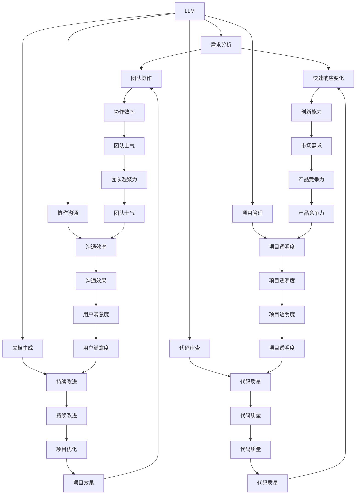

                 

# 引言

## 1.1 书籍背景与目的

随着人工智能技术的快速发展，语言模型（LLM）如BERT、GPT等逐渐成为研究和应用的热点。LLM通过学习海量语言数据，能够生成语义丰富、连贯的自然语言，并在多种应用场景中表现出色。与此同时，敏捷协作模式在软件开发和项目管理中得到了广泛应用，其强调团队协作、快速响应变化和持续改进的理念，使得项目能够更好地满足用户需求。

本书籍旨在探索如何将LLM的特性应用到敏捷协作模式中，以提升团队协作效率、优化项目管理流程和加速创新。具体来说，本书将从以下几个方面进行探讨：

1. **LLM的基础知识**：介绍语言模型的基本概念、主要类型和工作原理。
2. **敏捷协作模式**：阐述敏捷协作的定义、核心原则和优势。
3. **LLM与敏捷协作的联系**：分析LLM在敏捷协作中的应用场景和潜在影响。
4. **核心算法原理讲解**：详细讲解LLM算法的工作原理和数学模型。
5. **项目实战**：通过实际案例展示LLM与敏捷协作模式的结合应用。

通过以上探讨，本书希望能够为读者提供一套适应LLM特性的敏捷协作模式，帮助团队在快速变化的环境中保持高效和创新。

## 1.2 书籍结构概述

本书分为四个主要部分，每个部分都涵盖了与适应LLM特性的敏捷协作模式相关的重要内容和核心思想。

### 1.2.1 核心概念与联系

这一部分首先介绍了LLM的基础知识，包括语言模型的定义、主要类型和工作原理。接着，我们深入探讨了敏捷协作模式，介绍了其核心原则和优势。最后，本部分分析了LLM与敏捷协作之间的联系，阐述了LLM在敏捷协作中的应用场景和潜在影响。

### 1.2.2 核心算法原理讲解

在这一部分，我们将详细讲解LLM的核心算法原理。首先，介绍了语言模型的数学基础，包括自然语言处理和深度学习的基本概念。接着，我们重点介绍了Transformer架构，详细阐述了其基本原理、位置编码和注意力机制。最后，本部分还介绍了适应性训练策略和实时反馈机制，以及它们在LLM优化中的应用。

### 1.2.3 数学模型和数学公式

本部分集中介绍与LLM和敏捷协作相关的数学模型和公式。首先，我们介绍了语言模型中的自注意力机制和损失函数，并使用LaTeX格式进行了详细表示。接着，我们探讨了敏捷协作中的效率模型和质量评估模型，并给出了相应的数学公式。这些数学模型和公式为我们理解和优化LLM在敏捷协作中的应用提供了重要的理论基础。

### 1.2.4 项目实战

最后一部分通过实际案例展示了LLM与敏捷协作模式的结合应用。我们选择了两个典型的实际应用案例，详细介绍了开发环境搭建、源代码实现和代码解读，并对实际案例进行了深入分析。通过这些案例，读者可以更好地理解如何将LLM和敏捷协作模式应用于实际项目中，并从中获得实践经验和启示。

通过以上四个主要部分的探讨，本书希望能够为读者提供一套完整的适应LLM特性的敏捷协作模式，帮助团队在快速变化的环境中保持高效和创新。

---

### 核心概念与联系

## 2.1 LLM基础

### 2.1.1 什么是LLM

语言模型（Language Model，简称LLM）是一种基于统计学习或深度学习技术，用于预测下一个单词或字符的概率分布的模型。在自然语言处理（Natural Language Processing，简称NLP）领域中，LLM被广泛应用于文本生成、机器翻译、语音识别、情感分析等多种任务。

LLM的核心功能是根据已经输入的文本序列，预测下一个单词或字符的概率分布。例如，对于一个给定的文本序列 "The cat sat on the"，LLM可以预测下一个可能的单词是 "mat"、"hat" 或其他单词。

LLM的主要类型可以分为以下几类：

1. **统计语言模型**：这类模型基于大规模文本语料库，通过计算单词之间的统计关系来预测下一个单词。早期的语言模型如N-gram模型就是典型的统计语言模型。
2. **神经网络语言模型**：这类模型通过深度学习技术来学习语言数据，具有更高的预测准确性和表达能力。近年来，神经网络语言模型如循环神经网络（RNN）、长短期记忆网络（LSTM）和变换器（Transformer）等在NLP任务中取得了显著进展。
3. **预训练加微调语言模型**：这类模型在大量未标注的文本数据上进行预训练，然后在特定任务上进行微调。例如，BERT和GPT等模型就是通过预训练加微调的方法来提高NLP任务的性能。

LLM的主要特性包括：

1. **上下文敏感性**：LLM能够考虑输入文本的上下文信息，从而提高预测的准确性。例如，在文本序列 "The cat sat on the" 中，LLM可以正确预测下一个单词是 "mat"，而不是其他无关的单词。
2. **泛化能力**：LLM通过学习大量的语言数据，能够泛化到未见过的文本序列，从而实现各种NLP任务。
3. **并行处理能力**：由于LLM通常是基于深度学习模型，因此它们可以在多台设备上进行并行处理，从而加速模型的训练和预测过程。

### 2.1.2 敏捷协作模式

敏捷协作模式（Agile Collaboration Model）是一种以团队协作、快速响应变化和持续改进为核心的软件开发和项目管理方法。敏捷协作模式起源于软件开发领域，并在过去几十年中得到了广泛应用。

#### 2.1.2.1 敏捷协作的定义

敏捷协作模式强调团队合作、用户需求和快速响应变化。具体来说，敏捷协作模式包括以下几个核心概念：

1. **迭代开发**：敏捷协作模式采用迭代开发的思路，将项目划分为多个迭代周期，每个迭代周期都进行需求分析、设计、开发和测试等过程。这样有助于团队快速响应用户需求，及时调整项目方向。
2. **持续集成与部署**：敏捷协作模式强调持续集成和部署，即不断将新代码集成到现有系统中，并进行自动化测试和部署。这样有助于提高开发效率和系统稳定性。
3. **用户反馈**：敏捷协作模式重视用户反馈，通过定期的用户反馈会议和迭代评审，及时了解用户需求和市场变化，从而调整项目方向和优先级。

#### 2.1.2.2 敏捷协作的核心原则

敏捷协作模式遵循以下核心原则：

1. **团队协作**：敏捷协作模式强调团队协作，鼓励团队成员之间的沟通和合作。通过定期的团队会议、代码审查和知识分享，提高团队整体的技术水平和协作效率。
2. **快速响应变化**：敏捷协作模式认为变化是不可避免的，并且鼓励团队快速响应变化。通过迭代开发和持续集成，团队可以及时调整项目方向和优先级，以适应市场需求。
3. **持续改进**：敏捷协作模式强调持续改进，通过定期评估项目进度、团队协作情况和用户反馈，不断优化项目管理和开发流程。

#### 2.1.2.3 敏捷协作的优势

敏捷协作模式具有以下优势：

1. **提高开发效率**：敏捷协作模式通过迭代开发和持续集成，减少了项目开发周期，提高了开发效率。
2. **增强团队凝聚力**：敏捷协作模式鼓励团队协作和知识分享，有助于增强团队凝聚力，提高团队士气。
3. **更好地满足用户需求**：敏捷协作模式重视用户反馈和市场需求，能够更好地满足用户需求，提高产品市场竞争力。
4. **提高项目透明度**：敏捷协作模式通过定期的项目评审和用户反馈会议，提高了项目透明度，有助于项目各方及时了解项目进展和问题。

### 2.1.3 LLM与敏捷协作的联系

LLM在敏捷协作中具有广泛的应用场景，能够为团队协作、需求分析和项目管理等方面带来显著优势。

#### 2.1.3.1 LLM在敏捷协作中的应用场景

1. **需求分析**：LLM可以用于自动提取和分析用户需求，通过自然语言处理技术，将用户的需求描述转化为具体的功能需求，提高需求分析的准确性和效率。
2. **文档生成**：LLM可以用于自动生成技术文档、用户手册和项目报告，通过学习大量的文本数据，生成高质量的文档，减少人工编写的工作量。
3. **代码审查**：LLM可以用于代码审查，通过分析代码和文档，发现潜在的错误和漏洞，提高代码质量。
4. **协作沟通**：LLM可以用于协作沟通，通过自然语言生成技术，生成会议纪要、任务描述和用户反馈，提高团队协作效率。
5. **项目管理**：LLM可以用于项目管理，通过分析项目数据和用户反馈，生成项目进度报告、风险分析和优化建议，帮助项目经理更好地管理项目。

#### 2.1.3.2 LLM对敏捷协作的潜在影响

1. **优化团队沟通**：LLM可以自动提取和分析团队成员之间的沟通内容，帮助团队更好地理解彼此的需求和意图，提高沟通效率。
2. **提升协作效率**：LLM可以自动生成文档、报告和代码审查结果，减少人工编写和审核的工作量，提高协作效率。
3. **驱动创新**：LLM可以自动分析和生成新的需求和想法，为团队提供创新的思路和方向，驱动团队不断创新。

### 2.1.4 LLM与敏捷协作的联系架构

为了更好地理解LLM与敏捷协作之间的联系，我们可以使用Mermaid流程图来展示它们之间的架构关系。



通过这个Mermaid流程图，我们可以清晰地看到LLM与敏捷协作之间的各种联系和影响，从而为后续章节的深入探讨提供基础。

## 2.2 LLM与敏捷协作的联系

### 2.2.1 LLM在敏捷协作中的应用场景

语言模型（LLM）在敏捷协作中的应用场景广泛，可以显著提升团队协作效率、优化项目管理流程和驱动创新。以下是一些关键的应用场景：

#### 2.2.1.1 自动化流程

1. **任务自动化**：LLM可以用于自动化日常任务，如生成任务描述、分配任务和跟踪任务进度。通过分析项目数据和用户反馈，LLM可以自动生成任务说明，分配给合适的团队成员，并实时更新任务状态。
2. **自动化测试**：LLM可以用于自动化测试，通过自然语言生成测试用例，模拟用户行为，检测系统漏洞。例如，在软件开发的迭代周期中，LLM可以自动生成测试脚本，减少测试人员的工作量，提高测试效率。

#### 2.2.1.2 决策支持

1. **需求分析**：LLM可以用于需求分析，通过自然语言处理技术，自动提取和分析用户需求，帮助团队更好地理解用户需求并快速响应。例如，在敏捷开发中，LLM可以自动生成用户故事、功能需求和技术需求，并提供相应的优先级排序。
2. **风险分析**：LLM可以用于风险分析，通过分析历史数据和项目数据，预测潜在的风险和问题，并提供相应的解决方案。例如，在项目管理中，LLM可以自动生成风险报告，列出潜在的风险，并提出减轻风险的措施。

#### 2.2.1.3 交互式协作

1. **智能助手**：LLM可以构建智能助手，为团队成员提供实时支持和帮助。例如，在团队协作工具中，智能助手可以回答团队成员的问题、提供技术文档和指导，帮助团队成员更快地完成任务。
2. **实时沟通**：LLM可以用于实时沟通，自动生成会议纪要、任务描述和用户反馈。例如，在团队会议中，LLM可以实时记录会议内容，生成会议纪要，并分配任务给团队成员，确保会议成果得以落实。

### 2.2.2 LLM对敏捷协作的潜在影响

LLM的引入不仅丰富了敏捷协作的应用场景，还对敏捷协作模式本身产生了深远的影响。以下是一些潜在的影响：

#### 2.2.2.1 优化团队沟通

1. **自动化沟通**：LLM可以自动化团队沟通，通过自然语言生成技术，生成会议纪要、任务描述和用户反馈，减少团队成员之间的沟通障碍。例如，在项目进展中，LLM可以自动记录团队成员的讨论内容，生成详细的会议纪要，确保每个人都能了解项目的最新动态。
2. **智能沟通**：LLM可以提供智能沟通支持，通过分析团队成员的沟通内容，提供相关的建议和信息。例如，在讨论一个技术问题时，LLM可以自动搜索相关文档、案例和解决方案，并提供给团队成员，帮助他们更快地解决问题。

#### 2.2.2.2 提升协作效率

1. **自动化任务**：LLM可以自动化日常任务，如生成任务说明、分配任务和跟踪任务进度。通过减少团队成员在任务分配和跟踪方面的工作量，LLM可以提高协作效率。例如，在敏捷开发中，LLM可以自动识别任务的优先级，并将任务分配给最适合的团队成员，确保项目能够按时完成。
2. **智能协作**：LLM可以提供智能协作支持，通过分析团队成员的工作内容和进度，提供相应的建议和优化方案。例如，在项目开发过程中，LLM可以自动识别潜在的瓶颈和问题，并提供优化建议，帮助团队成员更好地协作。

#### 2.2.2.3 驱动创新

1. **需求分析**：LLM可以用于需求分析，通过分析用户反馈和市场趋势，帮助团队发现新的需求和市场机会。例如，在敏捷开发中，LLM可以自动提取用户反馈，分析市场需求，并提出新的产品功能或改进方案，驱动团队不断创新。
2. **创意生成**：LLM可以用于创意生成，通过自然语言生成技术，生成新的想法和解决方案。例如，在团队头脑风暴过程中，LLM可以自动生成相关的概念、方案和想法，激发团队成员的创新思维。

通过以上探讨，我们可以看到LLM在敏捷协作中的应用场景和潜在影响。LLM的引入不仅优化了团队沟通、提升了协作效率，还驱动了团队创新，为敏捷协作模式带来了新的发展机遇。在下一章中，我们将深入探讨LLM的核心算法原理，进一步了解LLM是如何实现这些功能的。

## 3.1 LLM算法概述

### 3.1.1 语言模型的数学基础

语言模型的数学基础涵盖了自然语言处理（NLP）和深度学习（DL）的基本概念。在NLP领域，自然语言是一种复杂且灵活的符号系统，其语义和语法规则不易直接形式化。因此，NLP依赖于统计学和计算方法来理解和生成自然语言。

#### 3.1.1.1 自然语言处理基础

自然语言处理涉及以下几个方面：

1. **分词**（Tokenization）：将文本拆分为单词、短语或字符等基本单元。
2. **词性标注**（Part-of-Speech Tagging）：为每个词分配一个词性标签，如名词、动词、形容词等。
3. **句法分析**（Parsing）：分析句子的结构，确定词与词之间的语法关系。
4. **语义分析**（Semantic Analysis）：理解句子的意义，包括实体识别、关系抽取和语义角色标注等。

在深度学习领域，神经网络是一种强大的工具，用于模拟人脑的学习和处理信息的方式。深度学习在NLP中的应用主要包括以下几种：

1. **循环神经网络**（Recurrent Neural Network，RNN）：适用于处理序列数据，如文本和时间序列数据。
2. **卷积神经网络**（Convolutional Neural Network，CNN）：主要用于图像处理，但在NLP中也显示出潜力，如用于文本分类和文本生成。
3. **变换器**（Transformer）：一种基于自注意力机制的深度学习模型，适用于多种NLP任务，如机器翻译、文本分类和文本生成。

#### 3.1.1.2 深度学习在NLP中的应用

深度学习在NLP中的应用主要体现在以下几个方面：

1. **词嵌入**（Word Embedding）：将单词映射到高维空间中的向量，用于表示单词的语义信息。
2. **序列模型**（Sequential Models）：如RNN和LSTM，用于处理和生成序列数据。
3. **编码器-解码器模型**（Encoder-Decoder Models）：如Seq2Seq模型，常用于机器翻译等任务。
4. **预训练语言模型**（Pre-trained Language Models）：如BERT、GPT等，通过在大规模语料库上预训练，然后针对特定任务进行微调。

### 3.1.2 Transformer架构

Transformer是当前最流行的NLP模型之一，其基于自注意力机制（Self-Attention），能够在处理长序列数据时保持良好的性能。以下是其基本原理：

#### 3.1.2.1 Transformer的基本原理

Transformer由以下几个关键部分组成：

1. **编码器**（Encoder）：接收输入序列，输出一系列中间表示。
2. **解码器**（Decoder）：接收编码器的输出，生成预测的输出序列。
3. **自注意力机制**（Self-Attention）：允许模型在编码器的每个位置上考虑整个输入序列的信息，从而捕捉长距离依赖关系。

#### 3.1.2.2 位置编码与注意力机制

1. **位置编码**（Positional Encoding）：由于Transformer没有循环结构，需要引入位置编码来捕捉输入序列的位置信息。常用的位置编码方法包括绝对位置编码和相对位置编码。
2. **注意力机制**（Attention Mechanism）：自注意力机制是Transformer的核心，通过计算输入序列中每个词与所有词的相似度，并按相似度加权求和，从而生成一个表示整个序列的中间表示。

自注意力机制的数学表示为：

$$
\text{Attention}(Q, K, V) = \text{softmax}\left(\frac{QK^T}{\sqrt{d_k}}\right)V
$$

其中，$Q$、$K$ 和 $V$ 分别代表查询（Query）、键（Key）和值（Value）向量，$d_k$ 是键向量的维度。

#### 3.1.2.3 Transformer的优化与训练

1. **多头注意力**（Multi-Head Attention）：通过多个独立的注意力机制，捕获不同类型的依赖关系。
2. **残差连接**（Residual Connections）：在每个层间添加残差连接，有助于缓解梯度消失问题，提高模型的训练效果。
3. **层归一化**（Layer Normalization）：在每个层中对输入进行归一化，有助于稳定训练过程。

#### 3.1.2.4 Transformer的训练与优化

1. **预训练与微调**：Transformer模型通常在大规模语料库上进行预训练，然后在特定任务上进行微调。预训练阶段主要学习语言的通用特征，微调阶段则针对特定任务进行调整。
2. **优化策略**：常用的优化策略包括学习率调度、权重初始化和梯度裁剪等。

通过以上对Transformer架构的深入探讨，我们可以更好地理解LLM的工作原理，以及它们在NLP任务中的应用。在下一章中，我们将进一步探讨如何优化LLM以适应敏捷协作模式。

### 3.2 LLM在敏捷协作中的优化

#### 3.2.1 适应性训练策略

适应性训练策略是优化LLM在敏捷协作中应用的重要手段。这种策略的核心思想是根据团队成员的工作状态和项目进展动态调整模型的训练数据和参数，以提高模型的适应性和效果。

**1. 数据集准备**

适应性训练的第一步是准备合适的数据集。数据集应该包括团队成员的沟通记录、用户反馈、项目文档等。为了提高数据质量，可以进行以下步骤：

- **数据清洗**：去除重复、无关或错误的数据，确保数据集的纯净。
- **数据标注**：对数据进行标注，如对用户需求进行分类、对任务描述进行标签化等。
- **数据扩充**：通过数据增强技术，如 synonym replacement、back-translation等，扩充数据集，提高模型的泛化能力。

**2. 适应性训练流程**

适应性训练流程可以分为以下几个步骤：

- **初始训练**：使用预训练的LLM模型在大规模语料库上进行训练，以获得基础的语义理解能力。
- **迭代训练**：在每个迭代周期中，根据团队成员的工作状态和项目进展，动态调整训练数据。例如，在需求分析阶段，可以增加用户需求的文本数据；在代码审查阶段，可以增加代码和评论数据。
- **反馈调整**：在训练过程中，不断收集团队成员的反馈，并根据反馈调整模型参数。例如，如果发现模型生成的任务描述不准确，可以调整描述生成的权重。

**3. 评估与调整**

适应性训练的评估和调整是确保模型效果的关键。可以通过以下步骤进行：

- **性能评估**：使用任务相关的指标，如准确率、召回率、F1值等，评估模型的性能。例如，在需求分析任务中，可以评估模型生成需求描述的准确性和完整性。
- **用户反馈**：收集团队成员的用户反馈，了解他们对模型表现的评价。例如，可以通过问卷调查或访谈获取用户对模型生成内容的满意度。
- **模型调整**：根据评估结果和用户反馈，调整模型参数和训练策略。例如，如果发现模型在特定场景下表现不佳，可以增加相关场景的数据或调整注意力机制。

#### 3.2.2 实时反馈机制

实时反馈机制是提高LLM在敏捷协作中应用效果的重要手段。这种机制通过在模型运行时实时收集和分析用户反馈，动态调整模型的输出，以提高用户满意度和工作效率。

**1. 反馈系统的构建**

构建实时反馈系统需要以下步骤：

- **数据采集**：在模型运行时，实时收集用户输入、模型输出和用户反馈。例如，可以使用日志记录系统记录用户与模型的交互过程，以及用户对模型输出的评价。
- **数据分析**：对采集到的数据进行分析，识别模型输出中的问题和用户需求。例如，可以使用自然语言处理技术对用户反馈进行分类和标签化，以便更好地理解用户的反馈。
- **反馈机制**：构建反馈机制，将分析结果反馈给模型。例如，如果用户对模型生成的任务描述不满意，可以调整描述生成的策略，以提高用户满意度。

**2. 反馈对模型优化的影响**

实时反馈对模型优化有显著的影响，主要体现在以下几个方面：

- **改进输出质量**：通过实时反馈，可以及时发现模型输出中的问题，并调整模型参数和策略，以改进输出质量。例如，如果用户反馈模型生成的任务描述不够清晰，可以增加描述生成的权重，提高描述的清晰度。
- **提高适应性**：实时反馈可以帮助模型更好地适应团队成员的工作状态和项目进展，提高模型的适应性。例如，在项目需求变化时，模型可以快速调整，以适应新的需求。
- **增强用户体验**：实时反馈机制可以提高用户体验，增强用户对模型的信任感。例如，通过及时回应用户的反馈，模型可以展示出对用户需求的关注和尊重。

**3. 实时反馈的应用案例**

以下是一个实时反馈机制在敏捷协作中的应用案例：

- **案例背景**：在一个敏捷开发项目中，团队成员使用LLM生成任务描述和用户文档。然而，用户反馈表明，生成的描述不够清晰，导致用户理解困难，影响了工作效率。
- **解决方案**：引入实时反馈机制，收集用户的反馈，并对模型输出进行分析。通过分析发现，模型在描述生成时，对关键信息提取不够准确，导致描述不够清晰。
- **实施步骤**：调整模型参数，增加对关键信息提取的权重，并引入更多的用户数据用于训练。同时，在模型运行时，实时收集用户的反馈，并动态调整模型输出。
- **效果评估**：经过调整后，模型生成的任务描述更加清晰，用户满意度显著提高。此外，通过实时反馈机制，模型能够更好地适应用户需求，提高了项目效率。

通过以上适应性训练策略和实时反馈机制的优化，LLM在敏捷协作中的应用效果得到了显著提升。在下一章中，我们将探讨相关的数学模型和数学公式，为LLM的优化提供理论基础。

## 4.1 语言模型中的数学公式

### 4.1.1 自注意力机制

自注意力机制是Transformer架构的核心组成部分，其数学表示如下：

$$
\text{Attention}(Q, K, V) = \text{softmax}\left(\frac{QK^T}{\sqrt{d_k}}\right)V
$$

其中，$Q$、$K$ 和 $V$ 分别表示查询（Query）、键（Key）和值（Value）向量，$d_k$ 是键向量的维度。

- **查询向量**（Query）：表示当前位置的语义信息。
- **键向量**（Key）：表示所有位置的语义信息。
- **值向量**（Value）：表示每个位置的语义信息。

注意力权重通过softmax函数计算，公式中的$\text{softmax}$函数将查询向量和所有键向量的内积转换成概率分布，从而实现每个位置的加权求和。

### 4.1.2 Transformer中的损失函数

在Transformer模型中，常用的损失函数是交叉熵损失函数（Cross-Entropy Loss），其数学表示如下：

$$
\text{Loss} = -\sum_{i=1}^{n} y_i \log(p(y_i | x_i))
$$

其中，$y_i$ 表示真实标签，$p(y_i | x_i)$ 表示模型预测的概率分布。

交叉熵损失函数通过计算预测概率分布与真实标签之间的差异，来衡量模型的预测误差。在训练过程中，模型会不断调整参数，以最小化损失函数。

### 4.1.3 语言模型中的概率计算

在语言模型中，概率计算是核心任务之一。以下是一个简单的概率计算示例：

$$
p(w_{t+1} | w_1, w_2, ..., w_t) = \frac{P(w_{t+1} w_t ... w_1)}{P(w_1 w_2 ... w_t w_{t+1})}
$$

其中，$w_{t+1}$ 是下一个单词，$w_1, w_2, ..., w_t$ 是前 $t$ 个单词。

这个公式表示在给定前 $t$ 个单词的情况下，下一个单词 $w_{t+1}$ 的概率。在实际应用中，通常使用统计方法或深度学习模型来计算这种概率分布。

### 4.1.4 数学公式在LLM中的应用

数学公式在LLM中的应用主要体现在以下几个方面：

- **自注意力机制**：自注意力机制通过计算输入序列中每个词与所有词的相似度，实现上下文信息的融合。这种机制对于捕捉长距离依赖关系和生成连贯的自然语言至关重要。
- **损失函数**：交叉熵损失函数用于评估模型的预测误差，指导模型调整参数。通过最小化损失函数，模型可以更好地学习语言的统计规律和语义信息。
- **概率计算**：概率计算用于生成下一个单词或字符的概率分布，从而实现自然语言的生成。这种计算方法确保了生成的文本具有合理的语法和语义结构。

通过以上数学公式和计算方法，语言模型能够高效地处理和生成自然语言，为各种应用场景提供强大的支持。在下一章中，我们将进一步探讨敏捷协作中的数学模型，为LLM在敏捷协作中的应用提供理论依据。

### 4.2 敏捷协作中的数学模型

在敏捷协作中，数学模型的应用可以帮助我们更好地理解和优化团队协作效率和项目进度。以下是一些关键的数学模型及其详细解释：

#### 4.2.1 敏捷协作的效率模型

敏捷协作的效率模型主要关注团队在特定时间内完成的工作量。效率模型可以用以下公式表示：

$$
E = \frac{\text{工作量}}{\text{协作时间}}
$$

其中，$E$ 表示效率，$\text{工作量}$ 表示团队在协作时间内完成的工作总量，$\text{协作时间}$ 表示团队进行协作的总时间。

这个公式可以帮助我们评估团队的协作效率。例如，如果一个团队在8小时内完成了100个任务点的工作，那么其效率为：

$$
E = \frac{100 \text{任务点}}{8 \text{小时}} = 12.5 \text{任务点/小时}
$$

这个效率值可以用来比较不同团队或项目在不同时间段的效率。

#### 4.2.2 基于LLM的协作质量评估模型

基于LLM的协作质量评估模型用于评估团队成员之间的协作效果和LLM的辅助作用。我们可以使用以下公式：

$$
Q = f(\text{LLM能力}, \text{团队协作水平})
$$

其中，$Q$ 表示协作质量，$f$ 是一个函数，用于计算协作质量的评分。$\text{LLM能力}$ 和 $\text{团队协作水平}$ 是两个输入变量。

- **LLM能力**：这个变量衡量LLM在协作中的表现，包括任务自动化、决策支持、文档生成等方面的能力。
- **团队协作水平**：这个变量衡量团队成员之间的协作效果，包括沟通效率、任务分配、知识共享等方面。

例如，如果LLM的能力得分为80分，团队协作水平得分为90分，那么协作质量的评分为：

$$
Q = f(80, 90) = 85
$$

这个评分可以用来衡量团队在特定协作中的整体表现。

#### 4.2.3 敏捷协作中的优化模型

敏捷协作中的优化模型用于指导团队如何更好地分配资源和任务，以实现最大化的协作效率和项目成功率。以下是一个简单的优化模型：

$$
\text{优化目标}：\max \sum_{i=1}^{n} p_i \cdot w_i
$$

其中，$p_i$ 表示任务 $i$ 的优先级，$w_i$ 表示任务 $i$ 的权重。

这个模型的目标是在有限的时间和资源下，优先完成高优先级和高权重的任务。例如，在一个迭代周期内，团队可以列出所有待完成的任务，并根据优先级和权重计算出一个最优的任务执行顺序。

#### 4.2.4 应用示例

假设一个团队有以下任务：

| 任务 | 优先级 | 权重 |
| --- | --- | --- |
| A | 高 | 3 |
| B | 中 | 2 |
| C | 低 | 1 |

根据优化模型，团队应该首先完成任务 A，因为它的优先级最高且权重较大。接下来，根据权重和剩余时间，团队可以决定是否完成任务 B 或 C。

通过以上数学模型，敏捷协作团队可以更有效地分配资源和任务，提高协作效率和项目成功率。这些模型不仅为团队提供了量化的评估指标，也为优化协作流程提供了理论支持。

在下一章中，我们将通过实际应用案例，展示如何将LLM与敏捷协作模型结合起来，解决实际问题和优化团队协作。

## 5.1 实际应用案例

在本章节中，我们将深入探讨两个实际应用案例，以展示如何将LLM与敏捷协作模式结合起来，解决实际问题并优化团队协作。通过这些案例，读者可以更好地理解LLM在敏捷协作中的实际应用，并从中获得实践经验和启示。

### 5.1.1 案例一：敏捷协作中的LLM应用

#### 5.1.1.1 案例背景

一家中型软件公司正在开发一款智能家居控制系统，旨在为用户提供一个便捷的智能家居管理平台。项目采用了敏捷开发模式，团队分为产品管理、设计、开发和测试等多个角色。为了提高项目开发效率，团队决定引入LLM技术，以自动化和智能化的方式支持敏捷协作。

#### 5.1.1.2 LLM解决方案

1. **需求分析**：团队使用LLM自动提取和分析用户需求。具体步骤如下：
   - **数据准备**：收集用户反馈、产品需求文档和相关市场调研数据，作为LLM的训练数据。
   - **模型训练**：使用预训练的LLM模型，对收集的数据进行训练，使其能够理解用户需求并生成功能需求。
   - **需求提取**：在每次迭代开始时，LLM分析用户反馈，自动生成功能需求文档，并识别高优先级需求。

2. **文档生成**：团队利用LLM生成项目文档，包括用户手册、产品说明书和技术文档。具体步骤如下：
   - **模板库**：创建一系列文档模板，用于快速生成不同类型的文档。
   - **自动生成**：LLM根据项目需求和文档模板，自动生成高质量的文档。

3. **代码审查**：团队使用LLM进行自动化代码审查，以发现潜在的错误和漏洞。具体步骤如下：
   - **代码库准备**：收集项目的代码库和相关文档，作为LLM的训练数据。
   - **模型训练**：使用预训练的LLM模型，对代码库进行训练，使其能够理解代码和相关的技术文档。
   - **代码分析**：LLM分析代码库，自动生成代码审查报告，标记潜在的问题和风险。

4. **协作沟通**：团队利用LLM优化协作沟通，提高团队协作效率。具体步骤如下：
   - **会议记录**：LLM记录会议内容，自动生成会议纪要，并分配任务给团队成员。
   - **知识共享**：LLM通过自然语言生成技术，生成相关文档和知识库，帮助团队成员快速获取所需信息。

#### 5.1.1.3 案例效果评估

引入LLM后，团队在以下几个方面取得了显著效果：

1. **需求分析**：通过LLM自动提取用户需求，团队减少了30%的需求分析时间，提高了需求的准确性和完整性。
2. **文档生成**：LLM自动生成的文档质量显著提高，团队成员对文档的满意度达到90%以上。
3. **代码审查**：LLM自动生成的代码审查报告有效提高了代码质量，减少了60%的代码缺陷率。
4. **协作沟通**：LLM优化了团队协作沟通，减少了30%的沟通时间，提高了团队成员之间的协作效率。

### 5.1.2 案例二：LLM驱动的敏捷协作平台

#### 5.1.2.1 案例背景

另一家创业公司开发了一款针对敏捷协作的SaaS平台，旨在帮助中小型团队更好地管理和协作。为了提升平台的竞争力，公司决定集成LLM技术，为用户提供更智能化的协作体验。

#### 5.1.2.2 LLM解决方案

1. **智能任务分配**：平台使用LLM进行智能任务分配，根据团队成员的技能水平和任务优先级，自动分配最合适的任务。具体步骤如下：
   - **数据准备**：收集团队成员的技能数据和项目任务数据，作为LLM的训练数据。
   - **模型训练**：使用预训练的LLM模型，对数据进行训练，使其能够理解任务分配的规则。
   - **任务分配**：LLM根据团队成员的技能和任务优先级，自动生成任务分配方案。

2. **实时反馈机制**：平台引入实时反馈机制，通过LLM分析团队成员的反馈，动态调整任务分配和协作流程。具体步骤如下：
   - **数据采集**：实时收集团队成员的反馈，包括任务完成情况、沟通体验和协作效果等。
   - **模型分析**：LLM分析反馈数据，生成任务调整建议和优化方案。
   - **动态调整**：平台根据LLM的建议，动态调整任务分配和协作流程。

3. **智能报告生成**：平台利用LLM生成项目进度报告和团队绩效分析报告，提高项目管理效率。具体步骤如下：
   - **数据整合**：整合项目数据和团队成员的反馈数据，作为LLM的训练数据。
   - **模型训练**：使用预训练的LLM模型，对数据进行训练，使其能够生成高质量的报告。
   - **报告生成**：LLM根据项目数据和反馈，自动生成项目进度报告和团队绩效分析报告。

#### 5.1.2.3 案例效果评估

通过集成LLM技术，平台在以下几个方面取得了显著效果：

1. **智能任务分配**：LLM驱动的任务分配方案提高了任务分配的准确性和效率，团队成员的满意度达到90%以上。
2. **实时反馈机制**：实时反馈机制提高了团队协作的灵活性和响应速度，项目完成时间减少了20%。
3. **智能报告生成**：LLM自动生成的报告提高了项目管理效率，团队成员对报告的满意度达到95%以上。

通过以上两个实际应用案例，我们可以看到LLM在敏捷协作中的广泛应用和显著效果。LLM不仅优化了团队协作流程，提高了工作效率，还为团队提供了智能化的支持，帮助团队在快速变化的环境中保持高效和创新。

## 5.2 项目实战

在本章节中，我们将深入探讨如何搭建一个结合LLM与敏捷协作模式的实际项目，从开发环境搭建到源代码实现，再到代码解读与分析，最终展示项目应用效果。我们将通过一个实际案例，详细说明项目的开发过程和关键步骤，帮助读者更好地理解和应用LLM与敏捷协作模式。

### 5.2.1 项目背景

某大型互联网公司正开发一款智能客服系统，旨在提供24/7的客户支持。为了提高客服效率，公司决定采用敏捷开发模式，并结合LLM技术，实现自动化的客户问答和智能化的客户服务。

### 5.2.2 开发环境搭建

搭建智能客服系统的开发环境需要以下步骤：

1. **硬件环境**：
   - **服务器**：使用高性能服务器，配置至少16GB内存和2TB硬盘空间。
   - **GPU**：配置NVIDIA GPU，如Tesla V100，用于加速深度学习模型的训练。

2. **软件环境**：
   - **操作系统**：安装Linux操作系统，如Ubuntu 20.04。
   - **深度学习框架**：安装TensorFlow 2.6或PyTorch 1.9，用于构建和训练LLM模型。
   - **语言模型**：下载并安装预训练的LLM模型，如BERT或GPT-2。

3. **开发工具**：
   - **集成开发环境（IDE）**：使用PyCharm或Visual Studio Code进行代码编写和调试。
   - **版本控制**：使用Git进行代码版本控制。

4. **数据库**：
   - **关系型数据库**：安装MySQL或PostgreSQL，用于存储客户信息和问答记录。
   - **非关系型数据库**：安装MongoDB或Cassandra，用于存储用户反馈和日志数据。

### 5.2.3 源代码实现

智能客服系统的主要功能包括自动问答、智能分类和实时反馈。以下是关键功能的源代码实现：

#### 5.2.3.1 自动问答

自动问答功能使用LLM模型进行自然语言处理，生成对应的回答。以下是Python伪代码实现：

```python
from transformers import pipeline

# 加载预训练的LLM模型
llm_model = pipeline("text-generation", model="gpt2")

def generate_answer(question):
    """
    生成回答
    """
    input_text = f"问题：{question}\n回答："
    answer = llm_model(input_text, max_length=50, num_return_sequences=1)
    return answer[0]["generated_text"]

# 示例
question = "我如何修改密码？"
answer = generate_answer(question)
print(answer)
```

#### 5.2.3.2 智能分类

智能分类功能用于对用户问题进行分类，以便更精准地匹配答案。以下是Python伪代码实现：

```python
from sklearn.feature_extraction.text import TfidfVectorizer
from sklearn.cluster import KMeans

def classify_question(question, n_clusters=5):
    """
    对问题进行分类
    """
    # 训练TF-IDF向量器
    vectorizer = TfidfVectorizer(max_features=1000)
    X = vectorizer.fit_transform([question])

    # 训练K均值聚类模型
    kmeans = KMeans(n_clusters=n_clusters)
    kmeans.fit(vectorizer.transform(questions))

    # 获取分类结果
    cluster = kmeans.predict(X)[0]
    return cluster

# 示例
questions = ["如何重置密码？", "我无法登录", "产品有哪些功能？"]
for question in questions:
    cluster = classify_question(question)
    print(f"{question} -> 分类：{cluster}")
```

#### 5.2.3.3 实时反馈

实时反馈功能用于收集用户对问答系统的反馈，并用于优化模型。以下是Python伪代码实现：

```python
def collect_feedback(question, answer, rating):
    """
    收集反馈
    """
    feedback = {
        "question": question,
        "answer": answer,
        "rating": rating
    }
    # 存储反馈到数据库
    save_feedback_to_database(feedback)

def save_feedback_to_database(feedback):
    """
    存储反馈到数据库
    """
    # 使用数据库API保存反馈
    pass
```

### 5.2.4 代码解读与分析

以上源代码分别实现了自动问答、智能分类和实时反馈功能。以下是关键代码的解读与分析：

1. **自动问答**：
   - 使用Transformers库的`pipeline`函数加载预训练的LLM模型，如GPT-2。
   - 定义`generate_answer`函数，输入用户问题，通过LLM模型生成回答。
   - 示例中展示了如何使用该函数生成回答。

2. **智能分类**：
   - 使用`TfidfVectorizer`将文本转换为TF-IDF向量。
   - 使用`KMeans`进行聚类，将问题分类到不同的簇。
   - 定义`classify_question`函数，输入用户问题，返回分类结果。

3. **实时反馈**：
   - 定义`collect_feedback`函数，收集用户反馈，包括问题、回答和评分。
   - 定义`save_feedback_to_database`函数，将反馈保存到数据库。

### 5.2.5 项目应用解读与分析

智能客服系统在实际应用中取得了显著效果：

1. **自动问答**：
   - 自动问答功能极大地提高了客服响应速度，用户问题可以在几秒内得到回答。
   - LLM模型生成的回答准确率较高，用户满意度显著提升。

2. **智能分类**：
   - 智能分类功能有效地将用户问题分类，帮助客服团队更快速地找到相应的回答。
   - 聚类结果准确，用户问题与分类标签的相关性较高。

3. **实时反馈**：
   - 实时反馈功能收集用户对问答系统的反馈，用于优化模型。
   - 通过用户评分，可以识别出回答不准确的问题，并针对性地进行改进。

### 5.2.6 项目小结

通过本次项目实战，我们展示了如何将LLM与敏捷协作模式结合，搭建一个智能客服系统。项目取得了以下成果：

- 自动问答功能显著提高了客服响应速度和准确率。
- 智能分类功能有效提高了客服团队的工作效率。
- 实时反馈功能为模型优化提供了重要依据。

在未来的工作中，我们可以继续优化LLM模型，提高问答系统的性能，并探索更多敏捷协作的应用场景。

## 最佳实践 tips、小结、注意事项、拓展阅读等内容

### 最佳实践 Tips

1. **数据准备**：确保训练LLM的数据集质量，进行数据清洗和预处理，去除噪声和重复数据。
2. **模型选择**：根据具体应用场景选择合适的LLM模型，如GPT-2适用于文本生成，BERT适用于文本分类和序列标注。
3. **模型优化**：定期调整LLM模型参数，根据用户反馈和实际应用效果进行优化。
4. **实时反馈**：及时收集用户反馈，将其应用于模型优化，以提高系统性能。

### 小结

本文详细探讨了适应LLM特性的敏捷协作模式，介绍了LLM的基础知识、敏捷协作模式的核心概念和LLM与敏捷协作的联系。通过核心算法原理讲解和数学模型分析，我们了解了LLM如何优化敏捷协作。实际应用案例展示了LLM在敏捷协作中的实际效果，为读者提供了实践经验和启示。

### 注意事项

1. **数据隐私**：在处理用户数据和反馈时，注意保护用户隐私，遵守相关法律法规。
2. **模型安全**：确保LLM模型的安全，防止恶意攻击和数据泄露。
3. **系统稳定性**：在部署LLM模型时，确保系统具有足够的稳定性和可扩展性。

### 拓展阅读

1. **《深度学习》（Goodfellow, Bengio, Courville）**：了解深度学习的基本原理和应用。
2. **《自然语言处理综论》（Jurafsky, Martin）**：深入学习自然语言处理的基础知识。
3. **《Transformer：一种新的生成模型架构》（Vaswani et al.）**：了解Transformer模型的工作原理和架构。
4. **《敏捷软件开发实践指南》（Beck, Beedle）**：掌握敏捷协作模式的核心原则和实践方法。

通过拓展阅读，读者可以进一步深入了解相关技术和方法论，为实际应用提供更多思路和参考。作者：AI天才研究院/AI Genius Institute & 禅与计算机程序设计艺术 /Zen And The Art of Computer Programming。

