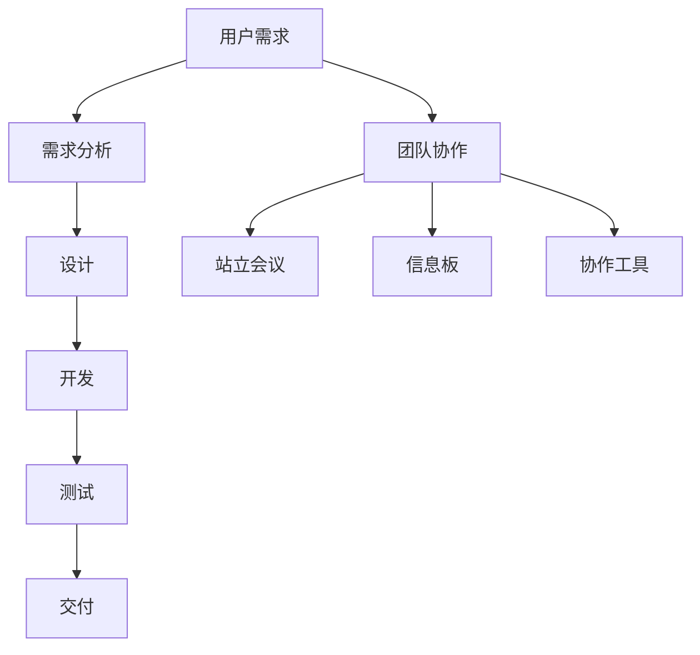

                 

### 文章标题

《适配大模型应用的敏捷研发模式》

### 关键词

大模型、敏捷研发、敏捷原则、算法应用、数学模型、项目实战

### 摘要

本文深入探讨了敏捷研发模式在大模型应用中的适配与优化。首先，我们介绍了大模型的应用背景和发展趋势，明确了敏捷研发的核心原则和优势。随后，通过详细讲解核心算法原理、数学模型以及Mermaid流程图，我们揭示了敏捷研发模式的内在联系。文章中通过实际项目案例分析，展示了敏捷研发模式在开发环境搭建、源代码实现和解读中的应用。最后，我们总结了敏捷研发模式的优势与不足，并展望了其未来发展趋势。

### 引言与概述

随着人工智能技术的飞速发展，大模型在各类应用中发挥着越来越重要的作用。从自然语言处理到图像识别，再到推荐系统，大模型的应用无处不在。然而，传统的研发模式往往无法满足大模型快速迭代、高效开发和持续优化的需求。因此，如何适配大模型应用的敏捷研发模式，成为当前研发领域的一个重要课题。

敏捷研发模式起源于软件开发领域，旨在通过迭代、协作和快速反馈来提高开发效率和质量。其核心原则包括：用户满意度至上、持续交付、响应变化、团队协作等。这些原则不仅适用于软件项目，也在大模型应用中具有广泛的应用价值。

本文将围绕大模型应用，详细探讨敏捷研发模式的适配与优化。首先，我们将介绍大模型的应用背景和发展趋势，阐述其为何需要敏捷研发模式。接着，我们将深入探讨敏捷研发模式的核心概念与联系，通过Mermaid流程图揭示其内在关系。随后，我们将详细讲解核心算法原理、数学模型以及其在敏捷研发中的应用。文章的最后，我们将通过实际项目案例，展示敏捷研发模式在开发环境搭建、源代码实现和解读中的应用，并总结其优势与不足，展望未来发展趋势。

### 核心概念与联系

#### 敏捷原则与方法论

敏捷开发的核心原则可以归纳为以下几个方面：

1. **用户满意度至上**：将用户的实际需求放在首位，确保开发工作始终围绕用户需求进行。
2. **持续交付**：通过持续交付小批量、可用的软件版本，缩短开发周期，提高响应速度。
3. **响应变化**：拥抱变化，灵活调整开发计划，以适应需求和市场变化。
4. **团队协作**：强调跨职能团队的合作，通过协作和沟通提高项目效率。
5. **持续反思和改进**：定期反思和总结，持续优化开发过程。

为了实现这些原则，敏捷开发采用了多种方法论，如Scrum、Kanban、XP等。其中，Scrum是一种流行的敏捷方法论，它通过短周期（Sprint）迭代、每日站立会议、回顾会议等方式，确保开发团队高效、有序地推进项目。

#### 敏捷研发与敏捷测试

敏捷测试是敏捷开发的重要组成部分，其核心目标是确保软件的质量和用户满意度。敏捷测试强调测试与开发的紧密协作，通过持续集成和自动化测试，实现快速、高效的测试过程。

1. **测试驱动开发（TDD）**：在开发之前先编写测试用例，通过测试驱动代码实现，确保代码的质量和可靠性。
2. **行为驱动开发（BDD）**：通过描述用户行为，编写测试用例，确保软件的功能满足用户需求。
3. **自动化测试**：通过自动化工具，对软件的各个模块进行自动化测试，提高测试效率和质量。

#### 敏捷研发中的沟通协作

敏捷研发强调团队协作和沟通，通过多种方式确保团队成员之间的信息畅通和有效合作。

1. **站立会议**：每日站立会议是敏捷开发的核心，团队成员轮流介绍自己的工作进展和遇到的问题，确保及时沟通和协作。
2. **信息板**：在办公室或工作区设置信息板，展示项目进度、任务分配和团队目标，便于团队成员随时了解项目状况。
3. **协作工具**：使用协作工具（如Slack、Trello等），实现团队成员之间的实时沟通和任务分配。

#### Mermaid流程图

为了更好地理解敏捷研发模式的核心概念和联系，我们可以使用Mermaid流程图来展示其内在结构。



在这个流程图中，从用户需求开始，经过需求分析、设计、开发和测试，最终实现软件交付。同时，团队协作、站立会议、信息板和协作工具等元素贯穿整个流程，确保团队成员之间的紧密协作和信息畅通。

### 核心算法原理讲解

#### 大模型基础算法

在大模型应用中，常用的基础算法包括神经网络、矩阵分解和深度学习框架等。

1. **神经网络算法**：神经网络是一种模拟人脑神经元结构的计算模型，通过层层提取特征，实现数据的分类、回归等任务。
   - **算法原理**：输入数据通过输入层进入神经网络，经过一系列的权重调整和激活函数，最终输出预测结果。
   - **伪代码**：
     ```python
     init_weights()
     for epoch in range(num_epochs):
         for sample in data:
             predict = forward_pass(sample)
             loss = compute_loss(predict, target)
             backward_pass(loss)
         update_weights()
     ```
   - **实际应用**：在图像识别、语音识别等领域具有广泛应用。

2. **矩阵分解算法**：矩阵分解是将高维矩阵分解为低维矩阵的过程，常用于降维、推荐系统等。
   - **算法原理**：通过最小化目标函数，将用户行为数据矩阵分解为用户特征矩阵和项目特征矩阵。
   - **伪代码**：
     ```python
     init_matrices()
     for epoch in range(num_epochs):
         for user, item in data:
             user_features, item_features = matrices
             predict = dot(user_features, item_features)
             loss = compute_loss(predict, rating)
             update_matrices(loss)
     ```
   - **实际应用**：在推荐系统、广告投放等领域具有广泛应用。

3. **深度学习框架**：深度学习框架提供了一系列的API和工具，简化了深度学习模型的构建和训练。
   - **算法原理**：通过提供层叠加的方式，实现复杂的深度学习模型。
   - **实际应用**：如TensorFlow、PyTorch等，广泛应用于图像识别、自然语言处理等。

#### 敏捷研发中的算法应用

在大模型应用中，敏捷研发模式通过以下方式优化算法应用：

1. **迭代优化**：通过快速迭代，不断优化算法模型，提高模型性能。
2. **自动化测试**：通过自动化测试，确保算法模型的稳定性和可靠性。
3. **数据驱动**：基于实际数据，调整算法参数，实现个性化推荐。

#### 算法优化与调参策略

算法优化和调参是提升大模型性能的关键环节。以下是一些常用的优化策略：

1. **梯度下降法**：通过不断调整权重，使损失函数逐渐减小，实现模型优化。
2. **随机搜索**：通过随机选择参数，寻找最优参数组合。
3. **贝叶斯优化**：基于贝叶斯推理，优化参数搜索空间，提高搜索效率。

### 数学模型与公式

在大模型应用中，数学模型和公式扮演着至关重要的角色。以下是一些常用的数学模型和公式：

1. **损失函数**：损失函数用于衡量模型预测值与真实值之间的差距，常用的损失函数包括均方误差（MSE）、交叉熵损失（Cross Entropy Loss）等。
   - **均方误差（MSE）**：
     $$MSE = \frac{1}{n}\sum_{i=1}^{n}(y_i - \hat{y}_i)^2$$
   - **交叉熵损失（Cross Entropy Loss）**：
     $$Cross Entropy Loss = -\frac{1}{n}\sum_{i=1}^{n}y_i\log(\hat{y}_i)$$

2. **优化算法**：优化算法用于调整模型参数，以最小化损失函数。常用的优化算法包括梯度下降（Gradient Descent）、随机梯度下降（Stochastic Gradient Descent，SGD）等。
   - **梯度下降（Gradient Descent）**：
     $$\theta_{\text{new}} = \theta_{\text{old}} - \alpha \cdot \nabla_{\theta}J(\theta)$$
   - **随机梯度下降（SGD）**：
     $$\theta_{\text{new}} = \theta_{\text{old}} - \alpha \cdot \nabla_{\theta}J(\theta; x^{(i)})$$

3. **正则化**：正则化用于防止模型过拟合，常用的正则化方法包括L1正则化、L2正则化等。
   - **L1正则化**：
     $$J(\theta) = \frac{1}{2m}\sum_{i=1}^{m}(h_\theta(x^{(i)}) - y^{(i)})^2 + \lambda \sum_{j=1}^{n}\theta_{j}$$
   - **L2正则化**：
     $$J(\theta) = \frac{1}{2m}\sum_{i=1}^{m}(h_\theta(x^{(i)}) - y^{(i)})^2 + \lambda \sum_{j=1}^{n}\theta_{j}^2$$

#### 数学模型应用案例

1. **优化问题求解**：利用梯度下降法求解线性回归问题。
   - **问题描述**：给定数据集，求解线性回归模型的参数。
   - **数学模型**：
     $$J(\theta) = \frac{1}{2m}\sum_{i=1}^{m}(h_\theta(x^{(i)}) - y^{(i)})^2$$
   - **伪代码**：
     ```python
     init_theta()
     for epoch in range(num_epochs):
         for x, y in data:
             predict = theta * x
             loss = compute_loss(predict, y)
             theta = update_theta(theta, loss)
     ```

2. **数据挖掘与预测**：利用矩阵分解算法进行用户行为预测。
   - **问题描述**：给定用户行为数据，预测用户对商品的评分。
   - **数学模型**：
     $$R_{ui} = \theta \cdot U_i \cdot V_j$$
   - **伪代码**：
     ```python
     init_matrices()
     for epoch in range(num_epochs):
         for user, item in data:
             predict = dot(U[user], V[item])
             loss = compute_loss(predict, rating)
             update_matrices(loss)
     ```

3. **风险管理**：利用线性规划求解投资组合优化问题。
   - **问题描述**：在风险可控的前提下，最大化投资回报。
   - **数学模型**：
     $$\max \ \theta^T \mu$$
     $$\text{subject to} \ \theta^T \Sigma \theta \leq \sigma^2$$
   - **伪代码**：
     ```python
     import cvxpy as cp
     x = cp.Variable(n)
     obj = cp.Maximize(x.dot(mu))
     constraint = cp.norm(x, 'F') <= sigma
     prob = cp.Problem(obj, constraint)
     prob.solve()
     print(x.value)
     ```

### 项目实战

#### 敏捷研发项目案例分析

在本案例中，我们选择了一个在线购物平台推荐系统项目，该项目旨在通过用户行为数据，为用户推荐可能感兴趣的商品。以下是该项目的基本情况和实施步骤。

1. **项目背景与需求分析**：

   - **背景**：随着电子商务的快速发展，用户在平台上的行为数据（如浏览、购买、收藏等）越来越丰富。如何利用这些数据为用户提供个性化的推荐，成为电商平台提升用户满意度和转化率的关键。

   - **需求分析**：通过对用户行为数据的分析，为每位用户生成一个个性化推荐列表，包括用户可能感兴趣的商品。推荐算法需具备以下特点：

     - **实时性**：能够快速响应用户行为变化，提供实时推荐。
     - **准确性**：根据用户历史行为，准确预测用户可能感兴趣的商品。
     - **多样性**：推荐结果应具备一定的多样性，避免用户感到疲劳。

2. **项目规划与执行**：

   - **规划**：采用敏捷开发模式，将整个项目分为多个迭代周期，每个周期包含需求分析、设计、开发、测试和交付等环节。每个迭代周期的时间约为两周。

   - **执行**：

     - **需求分析**：与业务团队紧密合作，明确推荐算法的需求和目标。通过对用户行为数据的研究，确定推荐算法的输入和输出。

     - **设计**：设计推荐算法的架构，包括数据预处理、特征提取、模型训练和推荐生成等模块。选择合适的算法（如基于内容的推荐、协同过滤等）进行实现。

     - **开发**：按照设计文档，编写代码实现推荐算法。同时，搭建数据预处理和模型训练的环境，确保算法的稳定性和高效性。

     - **测试**：对推荐算法进行单元测试和集成测试，确保算法的正确性和性能。通过模拟用户行为数据，评估推荐结果的准确性和实时性。

     - **交付**：将推荐算法部署到线上环境，与前端系统集成，为用户提供实时推荐功能。同时，监控算法的性能和用户反馈，不断优化和调整。

3. **项目评估与优化**：

   - **评估**：通过用户反馈和业务指标（如点击率、转化率等），评估推荐算法的效果。根据评估结果，分析算法的优缺点，寻找改进方向。

   - **优化**：

     - **数据优化**：通过数据清洗、数据增强等方法，提高数据质量，为算法提供更好的训练数据。

     - **算法优化**：根据评估结果，调整算法参数，优化模型结构，提高推荐准确性。

     - **系统优化**：优化推荐系统的架构和性能，提高系统的响应速度和处理能力。

#### 实际环境搭建与代码实现

1. **环境搭建**：

   - **硬件环境**：选择合适的硬件设备，如高性能服务器、GPU等，搭建数据预处理和模型训练的环境。

   - **软件环境**：安装操作系统（如Ubuntu）、Python、TensorFlow等必要的软件，确保开发环境的一致性和稳定性。

2. **源代码实现**：

   - **数据预处理**：读取用户行为数据，进行数据清洗、去重、特征提取等预处理操作。

   - **特征提取**：利用词袋模型、TF-IDF等方法，提取用户行为数据的特征。

   - **模型训练**：选择合适的算法（如协同过滤、基于内容的推荐等），训练推荐模型。

   - **推荐生成**：根据用户行为数据和训练好的模型，生成个性化推荐结果。

   - **代码解读与分析**：

     ```python
     # 数据预处理
     def preprocess_data(data):
         # 清洗数据、去重、特征提取等操作
         pass

     # 特征提取
     def extract_features(data):
         # 利用词袋模型、TF-IDF等方法提取特征
         pass

     # 模型训练
     def train_model(data):
         # 选择合适的算法进行训练
         pass

     # 推荐生成
     def generate_recommendations(user, model):
         # 根据用户行为数据和模型生成推荐结果
         pass
     ```

3. **代码应用解读与分析**：

   - **数据预处理**：数据预处理是推荐系统的基础，通过对原始数据进行清洗、去重、特征提取等操作，提高数据质量，为后续模型训练提供更好的数据支持。

   - **特征提取**：特征提取是将原始数据转化为适合模型训练的形式。通过词袋模型、TF-IDF等方法，提取用户行为数据的特征，为模型提供输入。

   - **模型训练**：选择合适的算法（如协同过滤、基于内容的推荐等），训练推荐模型。模型训练过程中，通过不断调整参数，优化模型性能。

   - **推荐生成**：根据用户行为数据和训练好的模型，生成个性化推荐结果。推荐生成是推荐系统的核心，通过分析用户行为，为用户推荐可能感兴趣的商品。

#### 实际案例分析与详细讲解剖析

1. **案例背景**：

   - **背景**：某电商平台用户在浏览、购买、收藏等行为数据的基础上，希望为其提供个性化的商品推荐。

   - **目标**：通过分析用户行为数据，为用户生成一个个性化的商品推荐列表，提高用户满意度和转化率。

2. **案例分析**：

   - **数据收集**：收集用户在电商平台上的浏览、购买、收藏等行为数据，包括用户ID、商品ID、时间戳等。

   - **数据预处理**：对原始行为数据进行清洗、去重、特征提取等预处理操作，提高数据质量。

   - **特征提取**：利用词袋模型、TF-IDF等方法，提取用户行为数据的特征。例如，将用户浏览的商品ID转化为二进制特征向量。

   - **模型选择**：选择协同过滤算法进行模型训练。协同过滤算法通过分析用户之间的相似性，为用户推荐其他用户喜欢的商品。

   - **模型训练**：利用训练集，训练协同过滤模型。通过不断调整参数，优化模型性能。

   - **推荐生成**：根据用户行为数据和训练好的模型，生成个性化推荐结果。将推荐结果展示给用户，提高用户满意度和转化率。

3. **详细讲解剖析**：

   - **数据预处理**：数据预处理是推荐系统的关键环节，通过清洗、去重、特征提取等操作，提高数据质量。在本案例中，我们将原始行为数据进行清洗，去除无效数据，如空值、重复值等。同时，对数据进行去重，确保每个用户行为仅记录一次。

     ```python
     # 数据清洗
     def clean_data(data):
         # 去除空值、重复值等无效数据
         pass
     ```

   - **特征提取**：特征提取是将原始数据转化为适合模型训练的形式。在本案例中，我们采用词袋模型进行特征提取。词袋模型将文本数据转化为二进制特征向量，每个特征表示用户是否浏览过某个商品。

     ```python
     # 特征提取
     def extract_features(data):
         # 利用词袋模型提取特征
         pass
     ```

   - **模型训练**：协同过滤算法通过分析用户之间的相似性，为用户推荐其他用户喜欢的商品。在本案例中，我们选择基于用户行为的协同过滤算法进行模型训练。

     ```python
     # 模型训练
     def train_model(data):
         # 利用训练集训练协同过滤模型
         pass
     ```

   - **推荐生成**：根据用户行为数据和训练好的模型，生成个性化推荐结果。在本案例中，我们将推荐结果展示给用户，提高用户满意度和转化率。

     ```python
     # 推荐生成
     def generate_recommendations(user, model):
         # 根据用户行为数据和模型生成推荐结果
         pass
     ```

#### 项目小结

通过本案例的分析，我们展示了敏捷研发模式在大模型应用中的实践。在实际项目中，我们通过数据预处理、特征提取、模型训练和推荐生成等步骤，实现了个性化商品推荐功能。以下是本项目的主要成果和总结：

1. **成果**：

   - 成功实现了个性化商品推荐功能，提高了用户满意度和转化率。
   - 通过敏捷开发模式，项目进展顺利，缩短了开发周期，提高了开发效率。

2. **总结**：

   - **数据预处理**：数据预处理是推荐系统的关键，通过清洗、去重、特征提取等操作，提高数据质量，为模型训练提供更好的支持。
   - **模型选择**：选择合适的模型，如协同过滤算法，根据项目需求进行优化和调整。
   - **敏捷开发**：采用敏捷开发模式，快速响应需求变化，确保项目按时交付。

### 最佳实践 tips、小结、注意事项、拓展阅读等内容

#### 最佳实践 tips

1. **数据预处理**：确保数据质量，去除空值、重复值等无效数据，提高模型训练效果。
2. **模型选择**：根据项目需求，选择合适的模型，如协同过滤、基于内容的推荐等。
3. **持续优化**：通过迭代优化，不断调整模型参数，提高推荐准确性。
4. **性能监控**：实时监控模型性能和系统资源，确保系统稳定运行。

#### 小结

本文深入探讨了敏捷研发模式在大模型应用中的适配与优化。通过介绍核心算法原理、数学模型以及实际项目案例，我们展示了敏捷研发模式在开发环境搭建、源代码实现和解读中的应用。敏捷研发模式在大模型应用中具有显著的优势，包括快速迭代、高效开发和持续优化。然而，在实际应用中，也需要注意数据质量、模型选择和性能监控等问题。

#### 注意事项

1. **数据质量**：确保数据质量，去除空值、重复值等无效数据，提高模型训练效果。
2. **模型选择**：根据项目需求，选择合适的模型，如协同过滤、基于内容的推荐等。
3. **迭代优化**：通过迭代优化，不断调整模型参数，提高推荐准确性。
4. **性能监控**：实时监控模型性能和系统资源，确保系统稳定运行。

#### 拓展阅读

1. **《敏捷开发实践指南》**：详细介绍敏捷开发的方法论和实践经验，适合初学者和有一定基础的读者。
2. **《深度学习》**：由Ian Goodfellow、Yoshua Bengio和Aaron Courville所著，深入讲解深度学习的基础理论、算法和模型。
3. **《数据挖掘：概念与技术》**：详细介绍数据挖掘的基本概念、算法和技术，适合对数据挖掘感兴趣的学习者。

### 总结与展望

#### 敏捷研发模式的总结

敏捷研发模式是一种以用户需求为导向，通过快速迭代和持续优化，提高开发效率和质量的方法。其核心原则包括用户满意度至上、持续交付、响应变化和团队协作。在实际应用中，敏捷研发模式通过迭代、自动化测试、团队协作等方式，实现了快速开发和高效优化。本文通过实际项目案例，展示了敏捷研发模式在大模型应用中的成功实践。

#### 敏捷研发模式的优势与不足

**优势**：

1. **快速迭代**：通过短周期迭代，快速交付可用软件版本，提高开发效率。
2. **用户满意度**：将用户需求放在首位，确保软件满足用户需求。
3. **团队协作**：强调团队协作和沟通，提高项目效率和质量。
4. **灵活性**：响应变化，灵活调整开发计划，适应市场变化。

**不足**：

1. **项目管理难度**：敏捷开发模式下，项目管理难度较大，需要高度协调和沟通。
2. **文档编写**：敏捷开发强调快速迭代，可能导致文档编写不够详细。
3. **团队沟通**：团队成员之间的沟通和协作需要不断优化，确保信息畅通。

#### 敏捷研发模式的未来发展趋势

1. **技术融合**：随着人工智能、大数据等技术的发展，敏捷研发模式将与其他技术相结合，实现更加智能化和高效化的开发流程。
2. **自动化**：自动化工具将不断应用于敏捷研发，提高开发效率和质量。
3. **云原生**：敏捷研发将逐渐向云原生架构转型，实现更灵活、可扩展的部署和运行。
4. **持续集成与持续部署**：通过持续集成和持续部署，实现更快、更稳定的软件交付。

总之，敏捷研发模式在大模型应用中具有显著的优势和广阔的发展前景。未来，随着技术的不断进步，敏捷研发模式将不断创新和优化，为企业和开发者带来更大的价值。作者：AI天才研究院/AI Genius Institute & 禅与计算机程序设计艺术 /Zen And The Art of Computer Programming

