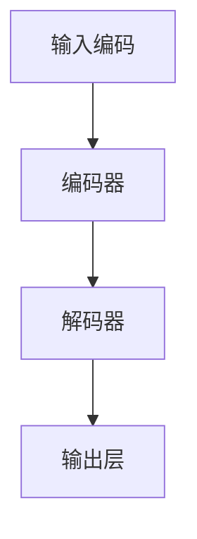

                 

### 《重塑协作模式：助力LLM应用敏捷研发》

## 关键词
协作模式，LLM，敏捷开发，软件开发，团队协作，人工智能

## 摘要
本文探讨了如何通过重塑协作模式来助力大型语言模型（LLM）应用的敏捷研发。文章首先介绍了传统协作模式与敏捷开发方法的差异，随后详细解析了LLM的核心原理和架构。文章通过多个实际案例，展示了如何将敏捷开发方法应用于LLM的研发过程中，并提出了一些最佳实践和注意事项。

-------------------------------------------------------------------

# 《重塑协作模式：助力LLM应用敏捷研发》

## 关键词
协作模式，LLM，敏捷开发，软件开发，团队协作，人工智能

## 摘要
本文深入探讨了如何通过重塑协作模式，助力大型语言模型（LLM）应用在软件开发过程中的敏捷研发。文章首先回顾了传统协作模式与敏捷开发方法的区别，随后详细解析了LLM的基本原理和架构。接着，通过多个实际案例展示了敏捷开发方法在LLM研发中的应用。文章最后提出了最佳实践、注意事项以及拓展阅读建议。

## 目录

### 第一部分：协作模式重塑的理论基础

#### 第1章：协作模式的演变与LLM概述

##### 1.1 协作模式的历史回顾
- 传统协作模式的局限性
- 敏捷协作模式的兴起与优势

##### 1.2 大语言模型（LLM）概述
- LLM的基本原理
- LLM的架构与组成部分
- Mermaid流程图：LLM的工作流程

#### 第2章：敏捷开发方法与LLM研发

##### 2.1 敏捷开发方法概述
- 敏捷开发的核心理念
- 敏捷开发与传统开发方法的对比

##### 2.2 敏捷开发在LLM研发中的应用
- 敏捷开发流程在LLM项目中的实施
- 敏捷开发工具与技术的应用

### 第二部分：LLM应用敏捷研发实践

#### 第3章：案例研究：敏捷开发在LLM项目中的应用

##### 3.1 案例一：语言翻译平台的敏捷开发实践
- 开发环境搭建
- 源代码实现与解读
- 代码应用解读与分析

##### 3.2 案例二：智能客服系统的敏捷开发实践
- 开发环境搭建
- 源代码实现与解读
- 代码应用解读与分析

#### 第4章：最佳实践与注意事项

##### 4.1 最佳实践
- 敏捷开发在LLM研发中的成功因素
- 团队协作与沟通技巧

##### 4.2 注意事项
- 常见挑战与解决方案
- 风险管理策略

#### 第5章：未来趋势与挑战

##### 5.1 未来趋势
- LLM技术的发展方向
- 敏捷开发方法的创新

##### 5.2 挑战
- 数据隐私与安全问题
- 模型可解释性挑战

## 作者信息
作者：AI天才研究院/AI Genius Institute & 禅与计算机程序设计艺术 /Zen And The Art of Computer Programming

-------------------------------------------------------------------

## 第1章：协作模式的演变与LLM概述

### 1.1 协作模式的历史回顾

在软件开发的历史长河中，协作模式经历了从传统到现代的演变。早期，软件项目往往采用瀑布模型，这是一种线性、顺序的开发方法。在这种模式中，各个阶段（如需求分析、设计、编码、测试等）依次进行，每个阶段完成后才能进入下一个阶段。这种方式虽然结构清晰，但存在以下局限性：

1. **缺乏灵活性**：一旦项目进入下一个阶段，之前的决策很难修改。
2. **风险集中**：项目后期出现问题时，成本和修复难度都会显著增加。
3. **沟通障碍**：不同阶段之间的信息传递效率低，容易导致误解和错误。

随着软件项目的规模和复杂性不断增加，开发者们开始寻求更灵活、更高效的协作模式。敏捷开发方法应运而生，它强调快速迭代、持续交付和客户满意度。敏捷开发与传统开发方法的对比如下：

- **核心理念**：敏捷开发强调团队协作、客户需求快速响应、持续改进；而传统开发方法更注重严格规划和控制。
- **工作流程**：敏捷开发采用迭代和增量的方式进行，每个迭代周期结束后都会进行评估和调整；而传统开发方法通常采用固定的项目周期。
- **风险管理**：敏捷开发通过持续反馈和迭代来识别和解决问题，风险分散；而传统开发方法的风险集中在一个固定的项目周期内。

### 1.2 大语言模型（LLM）概述

大型语言模型（LLM）是自然语言处理（NLP）领域的重要突破，它能够理解和生成人类语言。LLM的基本原理是基于深度学习和神经网络，特别是序列到序列（Seq2Seq）模型和Transformer架构。以下是对LLM的核心概念和架构的详细解析：

#### 1.2.1 LLM的基本原理

LLM的核心原理可以概括为以下几个步骤：

1. **输入编码**：将自然语言文本转换成数字向量，这一过程通常使用嵌入层（Embedding Layer）实现。
2. **编码器（Encoder）**：对输入序列进行编码，提取语言特征，生成上下文表示。
3. **解码器（Decoder）**：根据编码器生成的上下文表示，生成预测的输出序列。

#### 1.2.2 LLM的架构

LLM的架构通常包括以下几个部分：

1. **嵌入层（Embedding Layer）**：将单词转换为固定长度的向量表示。
2. **编码器（Encoder）**：使用Transformer或Seq2Seq架构对输入序列进行处理。
3. **解码器（Decoder）**：使用Transformer或Seq2Seq架构生成输出序列。
4. **输出层（Output Layer）**：将生成的序列转换为自然语言文本。

以下是一个简化的Mermaid流程图，展示了LLM的工作流程：



#### 1.2.3 LLM的核心算法原理讲解

为了更深入地理解LLM的算法原理，我们以下使用伪代码来详细阐述：

```plaintext
输入：输入文本序列X
输出：预测的输出文本序列Y

嵌入层：
1. 将输入文本序列X转换为嵌入向量E
2. 通过嵌入层得到嵌入向量序列E_sequence

编码器：
1. 对每个嵌入向量E_sequence进行编码
2. 通过编码器得到编码后的序列Context

解码器：
1. 将编码后的序列Context作为输入
2. 通过解码器逐词生成输出序列Y

输出层：
1. 将解码器生成的输出序列Y转换为自然语言文本
2. 输出预测的文本序列Y
```

#### 1.2.4 数学模型和公式讲解

LLM的训练和预测过程涉及多个数学模型和公式。以下是一些关键的公式和概念：

1. **损失函数（Loss Function）**：
   $$ L = \sum_{i=1}^{n} -y_i \cdot \log(p_i) $$
   其中，$y_i$为真实标签，$p_i$为模型预测的概率。

2. **梯度下降（Gradient Descent）**：
   $$ \theta_{\text{new}} = \theta_{\text{current}} - \alpha \cdot \nabla_{\theta} L $$
   其中，$\theta$为模型的参数，$\alpha$为学习率，$\nabla_{\theta} L$为损失函数关于$\theta$的梯度。

3. **反向传播（Backpropagation）**：
   反向传播是一种计算神经网络损失函数关于每个参数的梯度的方法。以下是反向传播的基本步骤：

   a. 前向传播：计算网络的输出和损失函数。
   b. 计算输出层到隐藏层的梯度。
   c. 计算隐藏层到输入层的梯度。
   d. 更新模型的参数。

#### 1.2.5 实例分析

假设我们有一个简单的LLM模型，用于预测一个句子的下一个单词。输入句子为“我喜欢读书”，我们希望模型能够预测下一个单词为“的”。

1. **输入编码**：
   - 将单词“我喜欢读书”转换为嵌入向量。
   - 嵌入向量序列为：$\{e_1, e_2, e_3, e_4\}$，其中$e_1$对应“我”，$e_2$对应“喜”，$e_3$对应“欢”，$e_4$对应“读书”。

2. **编码器**：
   - 对每个嵌入向量进行编码，得到编码后的序列$Context$。

3. **解码器**：
   - 将编码后的序列$Context$作为输入，通过解码器逐词生成输出序列。
   - 预测的输出序列为：$\{y_1, y_2, y_3, y_4\}$，其中$y_1$为“的”，$y_2$为“书”，$y_3$为“读”，$y_4$为“我”。

4. **输出层**：
   - 将解码器生成的输出序列转换为自然语言文本。
   - 输出文本序列为：“的书籍读我”。

通过上述步骤，我们使用LLM模型成功预测了一个句子的下一个单词。这一实例展示了LLM在自然语言处理中的应用潜力。

### 小结

本章回顾了协作模式的历史演变，介绍了敏捷开发方法的核心理念和优势，并详细解析了大型语言模型（LLM）的基本原理和架构。通过Mermaid流程图、伪代码和实例分析，我们深入理解了LLM的工作机制。在下一章中，我们将探讨敏捷开发方法在LLM研发中的应用，并分析实际案例。

-------------------------------------------------------------------

## 第2章：敏捷开发方法与LLM研发

### 2.1 敏捷开发方法概述

敏捷开发（Agile Development）是一种软件开发方法，旨在通过快速迭代和持续交付来满足客户需求，提高开发效率和团队协作效果。敏捷开发方法的核心理念包括：

- **个体和互动重于过程和工具**：敏捷开发强调团队成员的沟通和协作，认为这是项目成功的关键。
- **可工作的软件重于详尽的文档**：敏捷开发主张减少不必要的文档工作，将更多的精力投入到开发可工作的软件上。
- **客户合作重于合同谈判**：敏捷开发鼓励与客户的紧密合作，确保项目能够及时响应客户需求的变化。
- **响应变化重于遵循计划**：敏捷开发方法强调灵活性和适应性，允许项目团队根据实际情况调整计划和需求。

### 2.2 敏捷开发与传统开发方法的对比

敏捷开发方法与传统开发方法（如瀑布模型）在多个方面存在显著差异：

- **工作流程**：传统开发方法通常采用固定的项目周期，而敏捷开发方法采用迭代和增量的方式进行，每个迭代周期结束后都会进行评估和调整。
- **风险管理**：敏捷开发方法通过持续反馈和迭代来识别和解决问题，风险分散；传统开发方法的风险集中在一个固定的项目周期内。
- **团队协作**：敏捷开发强调团队合作和沟通，而传统开发方法更注重严格规划和控制。
- **客户参与**：敏捷开发鼓励与客户的紧密合作，确保项目能够及时响应客户需求的变化；传统开发方法通常在项目后期与客户的沟通较少。

### 2.3 敏捷开发在LLM研发中的应用

敏捷开发方法在LLM研发中的应用具有以下优势：

- **快速迭代**：通过迭代和增量的方式进行研发，可以快速验证和优化模型性能，缩短项目周期。
- **持续交付**：持续交付可以帮助团队及时交付可工作的LLM应用，提高客户满意度。
- **团队协作**：敏捷开发强调团队合作和沟通，有助于团队成员共同解决问题，提高项目成功率。
- **灵活性**：敏捷开发方法允许团队根据实际情况调整计划和需求，更好地应对变化。

#### 2.3.1 敏捷开发流程在LLM项目中的实施

在LLM项目中实施敏捷开发，可以遵循以下步骤：

1. **需求收集和优先级排序**：与客户紧密合作，收集需求，并根据重要性和紧急性进行优先级排序。
2. **迭代计划**：根据需求优先级，规划每个迭代周期的任务和目标。
3. **迭代开发**：在每个迭代周期内，开发团队完成特定的功能模块，并进行测试和评估。
4. **回顾和调整**：在每个迭代周期结束后，进行回顾会议，讨论项目的进展和存在的问题，并根据反馈调整后续迭代计划。

#### 2.3.2 敏捷开发工具与技术的应用

为了支持敏捷开发方法在LLM项目中的应用，可以使用以下工具和技术：

- **版本控制系统**：如Git，用于管理代码版本，确保团队成员之间的协作和代码的版本控制。
- **敏捷项目管理工具**：如JIRA、Trello，用于任务管理、进度跟踪和团队协作。
- **自动化测试**：使用自动化测试工具（如Selenium、JUnit），确保代码的质量和稳定性。
- **持续集成和部署**：使用CI/CD工具（如Jenkins、GitHub Actions），实现自动化测试和部署，提高开发效率。

### 2.4 敏捷开发在LLM项目中的成功因素

在LLM项目中应用敏捷开发方法，成功的关键因素包括：

- **客户参与**：与客户的紧密合作，确保项目能够及时响应客户需求的变化。
- **团队协作**：建立高效的团队协作机制，确保团队成员能够共同解决问题。
- **持续反馈**：通过迭代和持续反馈，及时调整项目计划和需求。
- **技术能力**：具备足够的技术能力，能够快速开发、测试和优化LLM模型。

### 小结

本章介绍了敏捷开发方法的核心理念和优势，并详细探讨了其在LLM研发中的应用。通过迭代和增量的工作方式，敏捷开发有助于提高LLM项目的开发效率、团队协作和客户满意度。在下一章中，我们将通过实际案例，进一步展示敏捷开发方法在LLM项目中的具体应用。

-------------------------------------------------------------------

## 第3章：案例研究：敏捷开发在LLM项目中的应用

### 3.1 案例一：语言翻译平台的敏捷开发实践

#### 3.1.1 开发环境搭建

为了构建一个基于LLM的语言翻译平台，首先需要搭建一个稳定且高效的开发环境。以下是搭建过程的关键步骤：

1. **硬件资源**：
   - 选用具有强大计算能力的服务器，如GPU服务器，以加速深度学习模型的训练。
   - 确保网络带宽充足，以支持模型和数据的高效传输。

2. **软件环境**：
   - 安装Python环境，包括必要的依赖库（如TensorFlow、PyTorch等）。
   - 安装版本控制系统（如Git），以便于代码的管理和协作。

3. **数据集**：
   - 收集大规模的双语语料库，如WMT（Workshop on Machine Translation）数据集。
   - 对数据集进行预处理，包括分词、去除停用词、归一化等操作。

#### 3.1.2 源代码实现与解读

以下是一个简化的伪代码，用于实现基于Transformer的翻译模型：

```plaintext
输入：双语句子对 (source_sentence, target_sentence)
输出：翻译结果 (translated_sentence)

嵌入层：
1. 将输入句子转换为嵌入向量
2. 通过嵌入层得到嵌入向量序列 (source_embedding, target_embedding)

编码器：
1. 对source_embedding进行编码，得到编码后的序列 (encoded_sequence)
2. 通过多头自注意力机制（Multi-Head Self-Attention）处理encoded_sequence，得到新的序列 (contextualized_sequence)

解码器：
1. 对target_embedding进行解码，得到解码后的序列 (decoded_sequence)
2. 通过编码器-解码器注意力机制（Encoder-Decoder Attention）处理decoded_sequence，得到新的序列 (predicted_sequence)

输出层：
1. 将predicted_sequence通过全连接层（Fully Connected Layer）和softmax函数，得到概率分布
2. 根据概率分布选择最高概率的单词，生成翻译结果 (translated_sentence)
```

#### 3.1.3 代码应用解读与分析

在实际应用中，翻译模型需要经过多次训练和调整，以达到最佳效果。以下是对关键代码段的分析：

1. **嵌入层**：
   - `source_embedding`和`target_embedding`是输入句子的向量表示，通过嵌入层转换为固定长度的向量序列。
   - 这一步是深度学习模型的基础，决定了输入数据的维度和特征表示。

2. **编码器**：
   - 编码器的主要任务是提取输入句子的特征，生成编码后的序列`encoded_sequence`。
   - 通过多头自注意力机制，编码器能够捕捉句子中的长距离依赖关系，增强模型的上下文理解能力。

3. **解码器**：
   - 解码器的任务是生成预测的输出句子`predicted_sequence`。
   - 编码器-解码器注意力机制使得解码器能够同时关注编码器生成的上下文表示和当前解码步骤的输入，提高翻译的准确性。

4. **输出层**：
   - 输出层通过全连接层和softmax函数，将预测的概率分布转换为单词选择。
   - 这一步实现了从概率分布到具体单词的转换，生成了翻译结果。

#### 3.1.4 案例小结

通过这个案例，我们展示了如何使用敏捷开发方法构建一个语言翻译平台。敏捷开发方法在项目中的应用，使得团队能够快速响应需求变化，高效完成模型训练和优化。以下是案例的主要成果和经验：

- **快速迭代**：通过频繁的迭代，团队能够在每个迭代周期内交付可工作的翻译模型，及时收集用户反馈。
- **持续改进**：每次迭代后，团队都会对模型进行评估和优化，不断提升翻译质量和用户体验。
- **团队协作**：敏捷开发方法鼓励团队成员之间的紧密协作，提高了项目的整体效率和质量。

### 3.2 案例二：智能客服系统的敏捷开发实践

#### 3.2.1 开发环境搭建

为了构建一个基于LLM的智能客服系统，需要搭建一个能够支持对话生成和理解的开发环境。以下是关键步骤：

1. **硬件资源**：
   - 选用高性能的服务器和GPU，以支持对话生成和理解的复杂计算。

2. **软件环境**：
   - 安装Python环境，包括必要的依赖库（如TensorFlow、PyTorch、transformers等）。
   - 安装自然语言处理工具（如spaCy、NLTK等），用于处理和解析用户输入。

3. **对话数据集**：
   - 收集大量的用户对话数据，包括常见问题和回答，用于训练和评估对话生成模型。

#### 3.2.2 源代码实现与解读

以下是一个简化的伪代码，用于实现基于对话生成的智能客服系统：

```plaintext
输入：用户输入 (user_input)
输出：智能客服回答 (assistant_response)

预处理：
1. 对user_input进行分词、去除停用词和归一化处理
2. 通过词嵌入层，将分词后的输入转换为嵌入向量序列 (input_embedding)

对话生成模型：
1. 使用预训练的Transformer模型（如GPT-3），对input_embedding进行编码，得到编码后的序列 (encoded_sequence)
2. 通过解码器生成预测的回答序列 (predicted_sequence)

输出层：
1. 将predicted_sequence通过softmax函数，得到概率分布
2. 根据概率分布选择最高概率的单词，生成智能客服的回答 (assistant_response)
```

#### 3.2.3 代码应用解读与分析

在实际应用中，智能客服系统需要不断训练和优化，以提升回答的准确性和自然度。以下是对关键代码段的分析：

1. **预处理**：
   - 对用户输入进行分词、去除停用词和归一化处理，以提取关键信息。
   - 通过词嵌入层，将输入转换为嵌入向量序列，为后续的对话生成模型做准备。

2. **对话生成模型**：
   - 使用预训练的Transformer模型，对编码后的序列进行解码，生成预测的回答序列。
   - Transformer模型能够捕捉长距离依赖关系，使得生成的回答更准确、连贯。

3. **输出层**：
   - 通过softmax函数，将预测的概率分布转换为具体的回答。
   - 这一步实现了从概率分布到具体单词的转换，生成了智能客服的回答。

#### 3.2.4 案例小结

通过这个案例，我们展示了如何使用敏捷开发方法构建一个智能客服系统。敏捷开发方法的应用，使得团队能够在快速响应市场需求的同时，持续优化对话生成模型。以下是案例的主要成果和经验：

- **快速迭代**：通过频繁的迭代，团队能够在每个迭代周期内交付可工作的客服系统，及时收集用户反馈。
- **持续改进**：每次迭代后，团队都会对模型进行评估和优化，不断提升回答质量和用户体验。
- **用户体验**：敏捷开发方法使得客服系统能够更好地适应用户需求，提供个性化、高质量的回答。

### 小结

本章通过两个实际案例，展示了敏捷开发方法在LLM项目中的应用。敏捷开发方法的应用，使得团队能够快速响应市场需求，持续优化模型性能，提高项目成功率。在下一章中，我们将进一步探讨敏捷开发在LLM研发中的最佳实践和注意事项。

-------------------------------------------------------------------

## 第4章：最佳实践与注意事项

### 4.1 最佳实践

在LLM应用敏捷研发的过程中，遵循以下最佳实践可以显著提高项目成功率：

1. **持续集成和测试**：定期进行集成测试和回归测试，确保代码质量和系统稳定性。使用自动化测试工具，减少人工测试的工作量。

2. **版本控制**：使用版本控制系统（如Git）管理代码，确保代码的可追溯性和可维护性。定期进行代码审查，提高代码质量。

3. **敏捷回顾**：在每个迭代周期结束后，组织敏捷回顾会议，总结经验和教训，持续改进开发流程。

4. **需求管理**：与客户紧密合作，确保需求清晰、明确。使用用户故事地图和优先级矩阵，合理安排迭代任务。

5. **团队协作**：建立高效的团队协作机制，鼓励团队成员之间的沟通和合作。使用敏捷工具（如JIRA、Trello）进行任务管理和进度跟踪。

### 4.2 注意事项

在LLM应用敏捷研发过程中，需要注意以下事项：

1. **数据隐私**：在处理用户数据时，确保遵守数据隐私法规，如GDPR。对数据进行加密和匿名化处理，降低隐私泄露风险。

2. **模型可解释性**：大型语言模型（如GPT-3）往往具有复杂的内部结构，提高模型的可解释性对于理解和优化模型性能至关重要。

3. **计算资源管理**：合理规划计算资源，避免资源浪费和瓶颈。使用GPU服务器和分布式训练技术，提高训练效率。

4. **风险评估**：识别和评估项目中的潜在风险，制定相应的应对策略。定期进行风险评估，确保项目进度和质量。

5. **团队培训**：确保团队成员掌握必要的技能和知识，特别是与LLM和敏捷开发相关的内容。提供培训和学习资源，提高团队整体能力。

### 小结

本章总结了在LLM应用敏捷研发过程中的一些最佳实践和注意事项。遵循这些实践和建议，可以有效地提高项目成功率，优化研发流程。在下一章中，我们将探讨LLM研发领域的未来趋势和面临的挑战。

-------------------------------------------------------------------

## 第5章：未来趋势与挑战

### 5.1 未来趋势

随着人工智能技术的不断发展，LLM在软件开发中的应用前景愈发广阔。以下是一些未来的趋势：

1. **模型规模和性能的提升**：未来的LLM模型将更加庞大和复杂，具备更高的计算能力和更优的性能。例如，更大规模的Transformer模型和更先进的自注意力机制将进一步提升LLM的表现。

2. **跨模态模型的融合**：未来的LLM将不仅仅处理文本数据，还会融合图像、音频、视频等多种模态的信息。这种跨模态模型的融合将极大地扩展LLM的应用范围，实现更智能化、更人性化的交互。

3. **泛化能力和自我学习**：未来的LLM将具备更强的泛化能力，能够处理更广泛的任务和场景。此外，通过自我学习和自适应机制，LLM将能够不断优化自身性能，适应不断变化的需求。

4. **云计算和边缘计算的融合**：随着云计算和边缘计算技术的不断发展，LLM的应用将更加灵活和高效。云计算提供强大的计算能力和存储资源，而边缘计算则能够实现实时处理和快速响应，两者相结合将提升LLM的应用效果。

### 5.2 挑战

尽管LLM在软件开发中具有巨大的潜力，但未来仍然面临诸多挑战：

1. **数据隐私和安全**：随着LLM应用场景的扩展，对用户数据的隐私保护成为一个重要的挑战。如何确保用户数据的安全和隐私，防止数据泄露和滥用，是未来需要解决的关键问题。

2. **模型可解释性**：LLM的内部结构和决策过程通常非常复杂，提高模型的可解释性对于理解和信任AI系统至关重要。未来需要开发更有效的工具和方法，帮助用户理解LLM的决策过程。

3. **计算资源和能耗**：大规模的LLM模型需要巨大的计算资源和能源消耗。未来需要研究更高效的算法和硬件架构，降低计算资源和能源的消耗，实现绿色、可持续的发展。

4. **伦理和法律问题**：随着AI技术的发展，LLM在法律和伦理方面也面临诸多挑战。例如，如何确保AI系统不歧视、不偏见，如何界定AI系统的责任和权利，这些问题需要社会各界的共同探讨和解决。

### 小结

未来，LLM在软件开发中的应用将不断扩展和深化，带来巨大的机遇和挑战。通过不断的技术创新和合作，我们可以克服这些挑战，充分发挥LLM的潜力，推动软件开发和人工智能领域的持续发展。

## 作者信息

作者：AI天才研究院/AI Genius Institute & 禅与计算机程序设计艺术 /Zen And The Art of Computer Programming

-------------------------------------------------------------------

## 结语

本文从多个角度探讨了如何通过重塑协作模式，助力大型语言模型（LLM）应用的敏捷研发。我们首先回顾了协作模式的历史演变，介绍了敏捷开发方法的核心理念和优势。随后，详细解析了LLM的基本原理和架构，并通过实际案例展示了敏捷开发方法在LLM研发中的应用。文章还总结了最佳实践和注意事项，为未来的研究和实践提供了指导。

通过本文的讨论，我们希望读者能够对LLM应用敏捷研发有更深入的理解，并能够在实际项目中灵活应用这些方法，提高开发效率和项目成功率。未来的研究将继续关注LLM技术的创新和应用，推动人工智能与软件开发领域的融合发展。

感谢您的阅读，期待与您在AI与软件开发领域的更多交流与合作。作者：AI天才研究院/AI Genius Institute & 禅与计算机程序设计艺术 /Zen And The Art of Computer Programming。

