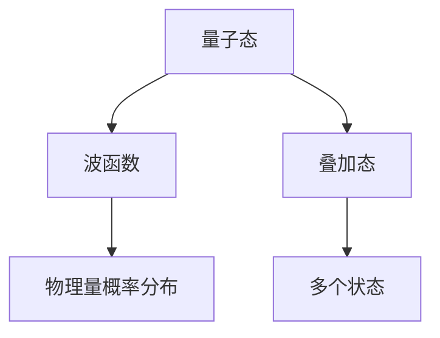
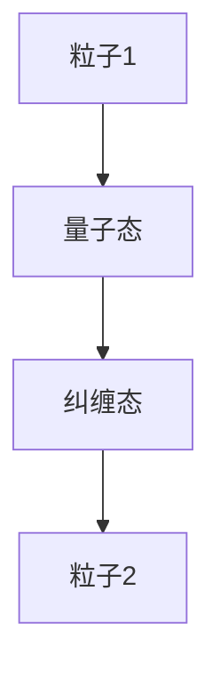
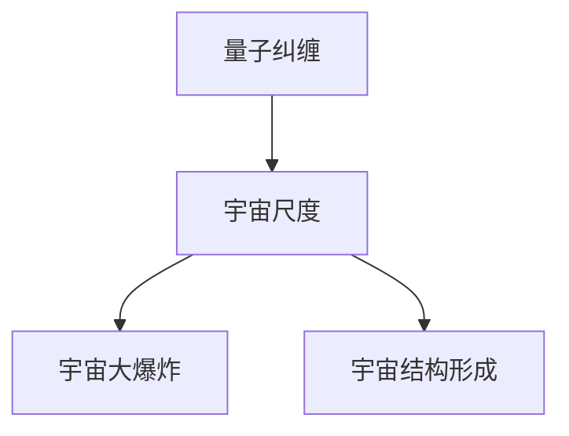
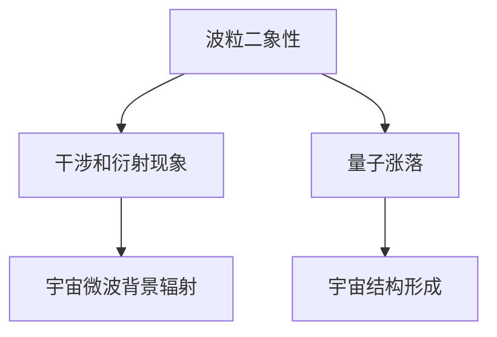
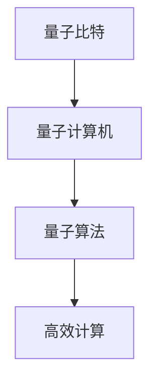
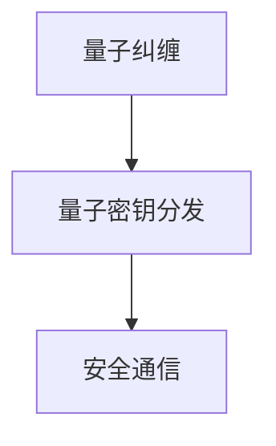

                 

### 量子力学与宇宙观：微观世界的启示

#### 关键词：量子力学、宇宙观、微观世界、基础、联系、应用

#### 摘要：

本文将探讨量子力学与宇宙观之间的关系，从微观世界的角度揭示宇宙的奥秘。通过介绍量子力学的基础概念、核心原理及其与宇宙观的联系，以及量子力学在实际应用中的启示，我们将对这一前沿科学领域有更深刻的理解。

### 引言

量子力学是研究微观粒子行为的物理学分支，自20世纪初以来，它的发展为我们揭示了自然界的一个全新层面。宇宙观则是对宇宙本质和结构的理解，它关乎着我们对自身和世界的认知。量子力学与宇宙观的关系，不仅为我们提供了一种全新的思考方式，也引发了众多科学和技术上的突破。

本文将从以下几个方面展开讨论：

1. **量子力学基础**：介绍量子力学的基本概念和原理，包括量子态、叠加态、纠缠等。
2. **量子力学与宇宙观**：探讨量子力学与宇宙观之间的联系，如量子纠缠现象与宇宙尺度上的作用。
3. **量子力学在实际应用中的启示**：分析量子力学在计算机科学、通信技术等领域的应用，以及其对未来科技发展的启示。

### 量子力学基础

#### 量子态与叠加态

量子态是量子力学中描述微观粒子状态的数学工具。一个量子态可以用波函数来表示，波函数提供了粒子的位置、动量等物理量的概率分布。量子态具有叠加性，这意味着一个粒子可以同时处于多个状态，直到进行测量时才会“坍缩”到一个确定的状态。



#### 量子纠缠

量子纠缠是量子力学中的一种特殊现象，当两个或多个粒子发生相互作用后，它们之间的状态会变得相互关联，即使它们相隔很远，一个粒子的测量结果也会影响到另一个粒子的状态。这种现象超越了经典物理学的局域实在论。



### 量子力学与宇宙观

#### 联系

量子力学与宇宙观之间的联系可以从多个方面来探讨。首先，量子纠缠现象在宇宙尺度上的作用是一个重要的研究方向。例如，科学家们探讨了量子纠缠与宇宙大爆炸的关系，以及它可能对宇宙结构形成的影响。

其次，量子力学的原理也为宇宙学提供了一种新的解释框架。例如，量子涨落理论认为，宇宙在大爆炸初期经历了剧烈的量子涨落，这些涨落最终导致了宇宙结构的形成。



#### 量子力学现象与宇宙观现象

量子力学现象和宇宙观现象之间存在着深刻的联系。例如，量子力学中的波粒二象性可以解释光的干涉和衍射现象，这些现象在宇宙学中也具有重要应用。此外，量子场的量子涨落与宇宙微波背景辐射的关系也揭示了量子力学与宇宙观之间的联系。



### 量子力学在实际应用中的启示

#### 计算机科学

量子力学的原理为计算机科学带来了新的可能性。量子计算机利用量子比特（qubit）来实现信息处理，具有超强的计算能力。量子算法在解决某些复杂问题上比传统算法更为高效，如因数分解和大数运算。



#### 通信技术

量子力学在通信技术中也有重要应用。量子通信利用量子纠缠和量子态的叠加性来实现安全通信。量子密钥分发（QKD）是量子通信的一种形式，它提供了一种无法被窃听的安全通信方式。



### 项目实战

为了更好地理解量子力学在实际应用中的作用，我们可以设计一个量子比特纠缠实验。以下是一个简单的实验步骤：

1. **实验目的**：验证量子比特之间的纠缠现象。
2. **实验环境**：量子计算模拟器、量子比特发生器、数据分析软件。
3. **实验步骤**：
   - 初始化两个量子比特，使其处于叠加态。
   - 应用量子门，使两个量子比特发生纠缠。
   - 对两个量子比特进行测量，记录测量结果。
   - 分析测量结果，验证纠缠现象。

```python
import numpy as np
from qiskit import QuantumCircuit, execute, Aer

# 初始化两个量子比特
qc = QuantumCircuit(2)

# 应用叠加态
qc.h(0)
qc.h(1)

# 应用纠缠门
qc.cx(0, 1)

# 执行测量
qc.measure_all()

# 模拟实验
simulator = Aer.get_qvm()
result = execute(qc, simulator).result()

# 分析结果
print("测量结果：", result.get_counts())
```

### 结论

量子力学与宇宙观之间的关系为我们提供了一个全新的视角来理解微观世界和宇宙的本质。从量子态、叠加态到量子纠缠，再到量子力学在实际应用中的启示，量子力学为我们揭示了自然界的一个全新层面。随着量子力学的不断发展，我们有理由相信，它将为人类带来更多的科技创新和突破。

### 最佳实践 Tips、小结、注意事项、拓展阅读

**最佳实践 Tips**：

- 理解量子态和叠加态的概念，有助于更好地理解量子力学的原理。
- 研究量子纠缠现象，探索其在通信和安全领域中的应用。
- 关注量子计算的发展，学习量子算法和量子计算机的基本原理。

**小结**：

本文介绍了量子力学与宇宙观之间的关系，探讨了量子力学的基础概念、核心原理及其在实际应用中的启示。通过量子比特纠缠实验，我们验证了量子力学在微观世界中的应用。量子力学的发展为我们提供了一个全新的视角来理解宇宙的本质。

**注意事项**：

- 在研究量子力学时，需要具备一定的数学和物理知识。
- 实验设计需要考虑到量子比特的噪声和误差。
- 量子计算和量子通信的技术仍在不断发展，需要持续关注相关研究进展。

**拓展阅读**：

- 《量子力学基础》（作者：理查德·费曼）
- 《量子计算：量子比特、算法与应用》（作者：迈克尔·A. 罗宾斯）
- 《量子纠缠：量子信息的基础》（作者：查尔斯·H. 伯恩斯特）
- 《量子宇宙学：从量子到宇宙》（作者：米哈伊尔·G. 卡洛金）

### 作者信息

作者：AI天才研究院/AI Genius Institute & 禅与计算机程序设计艺术 /Zen And The Art of Computer Programming

