                 


## 概述

在探讨宇宙的本质时，量子力学提供了一个全新的视角。量子力学，作为20世纪最重要的科学革命之一，不仅揭示了微观世界的规律，而且对于理解宇宙的起源、结构、演化以及未来都有着深远的影响。本文旨在通过一步一步的分析推理，深入探讨量子力学对宇宙本质的启示。

首先，量子力学的基本概念将为我们提供理解宇宙的关键工具。我们将从量子力学的核心原理，如波粒二象性、不确定性原理和量子纠缠等，开始我们的探讨。

接着，我们将转向量子力学与宇宙起源的关系。量子力学如何解释宇宙的诞生？宇宙的背景辐射和量子涨落是如何相互关联的？这些问题的解答将帮助我们理解宇宙的初始状态。

然后，我们将探讨量子力学如何影响宇宙的结构和演化。从宇宙的大尺度结构到小尺度结构，量子力学都提供了重要的启示。我们将深入探讨量子力学与宇宙结构的关系，并讨论量子引力如何影响宇宙的结构。

最后，我们将展望量子力学对宇宙未来的影响，并探讨量子力学与人类文明的关系。通过这些分析，我们将看到量子力学不仅是一门科学理论，更是理解宇宙、推动科技进步和人类文明发展的重要工具。

## 关键词

- 量子力学
- 宇宙起源
- 波粒二象性
- 不确定性原理
- 量子纠缠
- 宇宙结构
- 宇宙演化
- 量子引力

## 摘要

本文通过深入探讨量子力学的基本原理，分析了量子力学对宇宙起源、结构、演化和未来的启示。首先，我们介绍了量子力学的核心概念，如波粒二象性、不确定性原理和量子纠缠。然后，我们探讨了量子力学与宇宙起源的关系，包括宇宙背景辐射和量子涨落。接下来，我们分析了量子力学如何影响宇宙的结构和演化，特别是量子引力对宇宙结构的影响。最后，我们展望了量子力学对宇宙未来的影响，并探讨了量子力学与人类文明的关系。通过这些分析，我们不仅深化了对宇宙本质的理解，也为未来的科学研究提供了新的方向。

## 第1章 引言

### 1.1 量子力学的基本概念

量子力学是研究微观粒子和场的基本规律的物理学分支。它起源于20世纪初，以马克斯·波恩、沃纳·海森伯和埃尔温·薛定谔等人的工作为代表。量子力学的基本概念包括波粒二象性、不确定性原理和量子纠缠等，这些概念颠覆了经典物理学对微观世界的理解。

**波粒二象性**：这是量子力学最基本的概念之一，指出微观粒子如电子、光子等既具有波动性也具有粒子性。例如，光的干涉和衍射现象显示了其波动性，而光电效应则显示了其粒子性。

**不确定性原理**：由海森伯提出，它指出我们无法同时精确知道粒子的位置和动量。这并非由于测量技术的限制，而是微观世界的本质特性。

**量子纠缠**：量子纠缠是指两个或多个粒子之间的量子状态无法独立存在，它们的量子态是相互关联的。无论这些粒子相距多远，对其中一个粒子的测量都会即时影响到另一个粒子的状态。

### 1.2 宇宙与量子力学的关系

量子力学与宇宙的关系可以从多个角度来探讨。首先，量子力学为我们提供了理解宇宙起源的新途径。在宇宙学的标准模型中，宇宙起源于大约138亿年前的一个极度热密的状态，这一状态可以被看作是量子力学的一个极端表现形式。

**宇宙背景辐射**：宇宙背景辐射是宇宙早期的一个残存物，它展示了宇宙早期的状态。通过分析宇宙背景辐射的量子涨落，我们可以了解宇宙初始状态的细节。

**量子涨落**：宇宙背景辐射中的量子涨落被认为是宇宙结构形成的基础。这些涨落导致了后来宇宙中星系和宇宙大尺度结构的形成。

### 1.3 量子力学对宇宙研究的启示

量子力学的引入为宇宙研究带来了新的视角和工具。例如：

**量子引力**：量子引力是试图将量子力学与广义相对论相结合的理论。通过量子引力，我们可以更好地理解宇宙的起源和结构。

**宇宙量子计算**：量子计算利用量子力学的原理，可以解决一些经典计算难以处理的问题。例如，在宇宙模拟和黑洞信息丢失问题中，量子计算提供了新的解决方案。

总之，量子力学不仅为我们提供了理解微观世界的工具，也为宇宙研究带来了新的机遇和挑战。通过量子力学，我们不仅可以深入了解宇宙的起源和结构，还可以探索宇宙的未来。

### 1.4 总结与展望

量子力学是20世纪最为革命性的科学成果之一，它不仅彻底改变了我们对微观世界的认识，也对宇宙的本质和演化提供了新的视角。通过对量子力学的基本概念，如波粒二象性、不确定性原理和量子纠缠等的理解，我们可以看到量子力学如何影响宇宙的起源和结构。未来，随着量子力学的进一步发展，我们有望在宇宙研究中取得更多突破性成果。

## 第2章 量子力学基础

### 2.1 波粒二象性

波粒二象性是量子力学中最基本的原理之一，它揭示了微观粒子如电子和光子既具有波动性又具有粒子性的特点。为了更好地理解这一概念，我们可以通过以下几个核心观点来深入探讨。

首先，**波动性**指的是粒子能够展示出类似于波的特性，如干涉和衍射。经典例子是托马斯·杨的干涉实验，其中光波通过两个狭缝后产生干涉条纹，这表明光具有波动性。同样地，电子在经过双缝实验时，也会在屏幕上形成干涉条纹，显示出其波动性。

其次，**粒子性**指的是粒子具有确定的轨迹和动量，如光电效应实验所示。爱因斯坦通过光电效应证明了光子具有粒子性，即光可以被看作是由一个个粒子（光子）组成的，这些粒子撞击金属表面时会释放出电子。

为了理解波粒二象性，我们可以使用**量子态叠加原理**来描述。在量子力学中，粒子的状态不是单一确定的，而是由多个可能的态线性叠加而成的。例如，一个电子在通过双缝实验时，可以同时处于通过左缝和右缝的两种状态，直到被测量时才确定其具体状态。这种叠加态可以用数学表达式表示，例如一个电子的状态可以表示为：

$$|\psi\rangle = a|\text{左缝}\rangle + b|\text{右缝}\rangle$$

其中，$a$ 和 $b$ 是复数系数，表示电子在两种状态之间的概率幅。

波粒二象性还涉及到**量子态的坍缩**。当我们对量子系统进行测量时，系统的状态会从叠加态坍缩到一个特定的状态。这一过程可以用波函数的坍缩来描述。例如，当我们测量一个电子通过哪个狭缝时，波函数会坍缩为一个特定的状态，使得电子只能通过一个狭缝。

为了更直观地理解波粒二象性，我们可以通过以下**伪代码**来模拟一个简单的量子态叠加和测量过程：

```python
# 定义量子态叠加函数
def quantum_superposition(state):
    return state * np.exp(1j * np.random.uniform(0, 2 * np.pi))

# 初始化电子的波函数
psi = np.array([1, 0])

# 模拟电子通过双缝实验的叠加态
psi_superposed = quantum_superposition(psi)

# 对电子进行测量，随机选择一个狭缝
measurement = np.random.choice([0, 1])

# 根据测量结果更新波函数
psiCollapsed = np.array([0, 1])[measurement]

print("叠加态：", psi_superposed)
print("测量结果：", measurement)
print("坍缩态：", psiCollapsed)
```

在这个伪代码中，我们首先定义了一个量子态叠加函数`quantum_superposition`，然后初始化电子的波函数`psi`，接着模拟电子通过双缝实验的叠加态，并进行测量。最后，根据测量结果更新波函数。

### 2.2 不确定性原理

不确定性原理是量子力学的一个核心概念，由海森伯提出。它指出，我们无法同时精确地知道一个粒子的位置和动量。这一原理源自于量子态的波动性和测量过程的本质。

**不确定性原理可以通过以下数学公式来描述：**

$$\Delta x \Delta p_x \geq \frac{\hbar}{2}$$

其中，$\Delta x$ 和 $\Delta p_x$ 分别表示位置和动量的不确定度，$\hbar$ 是约化普朗克常数。

**不确定性原理的原因**可以从量子态的波动性来解释。在量子力学中，粒子的状态由波函数描述，而波函数的平方表示粒子在某一位置的概率密度。因此，粒子的确切位置和动量无法同时被精确知道，因为它们是波动性的体现。

**不确定性原理的影响**在多个领域都有重要应用。例如，在量子信息科学中，不确定性原理限制了量子态的克隆，即我们不能制造出与原始量子态完全相同的副本。这在量子计算和量子通信中具有重要意义。

为了更直观地理解不确定性原理，我们可以通过以下**伪代码**来模拟一个粒子的位置和动量的不确定性：

```python
import numpy as np

# 定义不确定性原理函数
def uncertainty_principle(x_uncertainty, p_uncertainty):
    return x_uncertainty * p_uncertainty >= (1.0545718e-34 / (2 * np.pi))

# 初始化位置和动量的不确定度
x_uncertainty = np.random.uniform(0, 1)
p_uncertainty = np.random.uniform(0, 1)

# 检验不确定性原理是否成立
uncertainty违反 = uncertainty_principle(x_uncertainty, p_uncertainty)

print("位置不确定度：", x_uncertainty)
print("动量不确定度：", p_uncertainty)
print("不确定性原理违反情况：", uncertainty违反)
```

在这个伪代码中，我们定义了一个不确定性原理函数`uncertainty_principle`，初始化位置和动量的不确定度，然后检验不确定性原理是否成立。

### 2.3 量子叠加态与纠缠

量子叠加态和量子纠缠是量子力学中另外两个重要的概念。量子叠加态指的是一个量子系统可以同时存在于多个状态之中，直到被测量时才确定其具体状态。而量子纠缠则描述了两个或多个量子系统之间的特殊关联，即使这些系统相隔很远，它们的量子状态仍然是相互关联的。

**量子叠加态**可以通过以下例子来解释。假设一个电子的量子态可以被表示为通过两个狭缝的叠加态：

$$|\psi\rangle = \frac{1}{\sqrt{2}} (|\text{左缝}\rangle + |\text{右缝}\rangle)$$

这个态表示电子有50%的概率通过左缝，有50%的概率通过右缝。

**量子纠缠**则更加复杂。考虑一个由两个电子组成的系统，它们的量子态是纠缠的。即使这两个电子相隔很远，对其中一个电子的测量会立即影响到另一个电子的状态。这种关联无法用经典物理来解释。

**贝尔实验**是验证量子纠缠的重要实验之一。贝尔实验通过测量纠缠粒子之间的相关性，证明了量子纠缠的存在，并挑战了经典物理的局域实在论。

为了更直观地理解量子叠加态和纠缠，我们可以通过以下**伪代码**来模拟一个简单的量子叠加态和纠缠态：

```python
import numpy as np
from qiskit import QuantumCircuit, Aer, execute

# 定义量子叠加态函数
def quantum_superposition(qc, qubit):
    qc.h(qubit)
    return qc

# 定义量子纠缠函数
def quantum_entanglement(qc, qubit1, qubit2):
    qc.cx(qubit1, qubit2)
    return qc

# 创建量子电路
qc = QuantumCircuit(2)

# 添加量子叠加态
qc = quantum_superposition(qc, 0)

# 添加量子纠缠
qc = quantum_entanglement(qc, 0, 1)

# 运行量子电路
backend = Aer.get_backend('qasm_simulator')
result = execute(qc, backend).result()
qasm_result = result.get_counts(qc)

print("量子叠加态结果：", qasm_result)
```

在这个伪代码中，我们首先定义了量子叠加态和量子纠缠函数，然后创建一个量子电路，添加叠加态和纠缠态，并运行量子电路以获取实验结果。

### 2.4 量子场论

量子场论（QFT）是量子力学和特殊相对论相结合的理论框架，主要用于描述粒子和场的量子行为。它是量子力学和现代粒子物理学的基石，为理解基本粒子和宇宙的微观结构提供了重要工具。

**量子场论的核心概念**包括：

1. **量子态与场**：在量子场论中，粒子被视为场的激发态。例如，光子是电磁场的激发态，电子是电子场的激发态。
2. **正负粒子**：在量子场论中，粒子分为正粒子（如电子）和反粒子（如正电子）。正反粒子相互湮灭时释放能量。
3. **相互作用**：粒子之间的相互作用可以通过量子场论中的相互作用项来描述。例如，电磁相互作用由电磁场中的交换光子来实现。

**量子场论的数学框架**主要包括：

1. **路径积分**：量子场论中的路径积分公式描述了粒子在不同路径上的概率幅的加和。具体形式为：
   $$\langle \Omega | \phi(x) | \psi \rangle = \int D[\phi] \, e^{i S[\phi]}$$
   其中，$\Omega$ 是整个宇宙的态，$\phi(x)$ 是场在位置 $x$ 的值，$S[\phi]$ 是场的欧拉作用量。
2. **拉氏量**：量子场论中的拉氏量描述了系统的动力学行为。通常形式为：
   $$\mathcal{L} = \bar{\psi}(i \gamma^\mu \partial_\mu - m) \psi + \partial_\mu A^\mu \partial_\mu A^\mu - m^2 A^\mu A^\mu$$
   其中，$\psi$ 和 $\bar{\psi}$ 分别是粒子和反粒子的场，$A^\mu$ 是场的势。

**量子场论的应用**包括：

1. **粒子物理标准模型**：量子场论为粒子物理标准模型提供了理论基础，描述了基本粒子的相互作用和性质。
2. **宇宙学**：在宇宙学中，量子场论用于描述宇宙早期状态和宇宙背景辐射。
3. **量子计算**：量子场论在量子计算中用于设计量子算法和量子处理器。

通过量子场论，我们可以深入理解粒子和场的量子行为，从而对宇宙的微观结构有更全面的认识。

### 2.5 总结与展望

量子力学基础部分，我们详细介绍了波粒二象性、不确定性原理、量子叠加态与纠缠以及量子场论。这些核心概念不仅揭示了微观世界的本质，也为理解宇宙的起源、结构、演化和未来提供了重要工具。通过量子态叠加和测量，我们看到了粒子既有波动性又有粒子性；通过不确定性原理，我们认识到我们无法同时精确知道粒子的位置和动量；通过量子纠缠，我们见证了粒子之间的超距作用；通过量子场论，我们理解了粒子和场的量子行为。这些概念不仅改变了我们对微观世界的认知，也为未来的科学研究提供了新方向。在下一章中，我们将探讨量子力学如何影响宇宙的起源。

## 第3章 量子力学与宇宙起源

### 3.1 宇宙背景辐射与量子涨落

宇宙背景辐射（Cosmic Microwave Background, CMB）是宇宙早期的一个重要遗迹，它为我们揭示了宇宙大爆炸后的早期状态。CMB是宇宙大爆炸后约38万年前辐射的余辉，温度大约为2.7开尔文。通过对CMB的观测和分析，我们可以了解到宇宙的早期状态，以及宇宙如何从极度高温和高度密集的状态演化成今天的样子。

**量子涨落（Quantum Fluctuations）**是宇宙背景辐射中的关键特征。这些涨落是指在宇宙早期，由于量子力学效应引起的微小不均匀性。这些涨落被认为是宇宙结构形成的基础，通过引力作用逐渐演化成星系和宇宙大尺度结构。

**量子涨落的起源**可以追溯到宇宙大爆炸后的瞬间。在大爆炸初期，宇宙处于一个极度热密的状态，物质和辐射高度混合。在这一时期，量子力学效应尤为显著，导致物质分布的微小不均匀性。这些不均匀性在宇宙膨胀过程中逐渐放大，形成了今天我们观测到的宇宙结构。

**量子涨落的影响**不仅限于宇宙结构的形成，还对宇宙学参数的测量有着重要影响。通过分析CMB的量子涨落，我们可以推断出宇宙的密度、质量分布、膨胀历史等重要信息。特别是，CMB的量子涨落提供了对宇宙学“大尺度结构形成理论”的有力验证。

为了更直观地理解量子涨落与宇宙结构的关系，我们可以通过以下**Mermaid流程图**来展示：

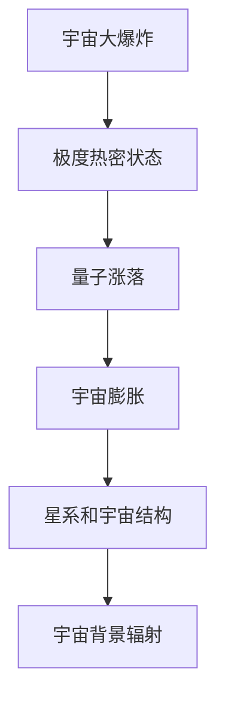

在这个流程图中，我们从宇宙大爆炸开始，展示了极度热密状态下的量子涨落，以及宇宙膨胀过程中涨落如何放大形成星系和宇宙大尺度结构，最终形成宇宙背景辐射。

### 3.2 宇宙膨胀与量子力学

宇宙膨胀是宇宙学研究的一个核心问题，它描述了宇宙从一个非常热密的初始状态开始，不断扩张至今的过程。量子力学在这一过程中发挥了重要作用，为我们理解宇宙膨胀的机制提供了新的视角。

**宇宙膨胀的模型**主要包括“大爆炸宇宙学”和“稳态宇宙学”。大爆炸宇宙学认为，宇宙起源于约138亿年前的一个极度热密状态，并在此后不断膨胀。而稳态宇宙学则提出宇宙始终处于稳定状态，不存在起源和终结。然而，随着观测数据的积累，大爆炸宇宙学得到了广泛认可。

**量子力学与宇宙膨胀的关系**可以从以下几个方面来理解：

1. **量子引力**：宇宙膨胀涉及到引力效应，而引力在量子尺度上需要量子引力理论来描述。量子引力理论试图将量子力学与广义相对论相结合，提供对宇宙膨胀的更全面理解。例如，弦理论和环量子引力都是量子引力的重要研究方向。

2. **宇宙早期膨胀**：在宇宙大爆炸后的早期阶段，宇宙处于极端高温和高度密集状态，量子效应尤为显著。在这一时期，量子力学效应可能对宇宙膨胀速率产生了重要影响。例如，宇宙背景辐射中的量子涨落被认为是宇宙膨胀加速的驱动因素之一。

3. **宇宙膨胀中的量子态**：宇宙膨胀过程中，宇宙的量子态可能经历了复杂的变化。量子态的演化不仅影响了宇宙的膨胀速率，还影响了宇宙的能量密度和物质分布。

为了更直观地理解量子力学与宇宙膨胀的关系，我们可以通过以下**Mermaid流程图**来展示：

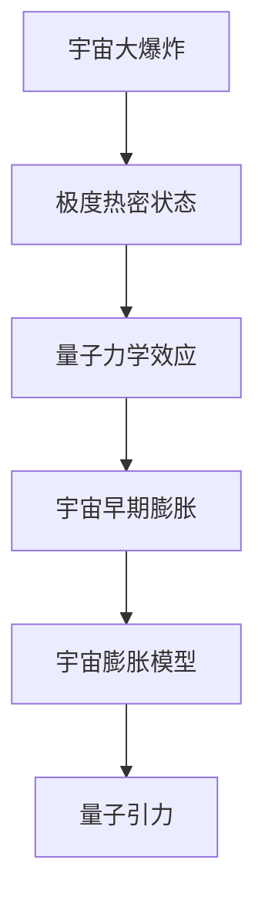

在这个流程图中，我们从宇宙大爆炸开始，展示了量子力学效应如何影响宇宙早期膨胀，以及量子引力理论在理解宇宙膨胀中的作用。

### 3.3 宇宙初态与量子力学

宇宙的初始状态是一个复杂而神秘的问题，涉及到量子力学和宇宙学的深层次问题。量子力学提供了对宇宙初态的全新理解，特别是通过量子场论和量子引力理论。

**宇宙初态的量子场论描述**：量子场论认为，宇宙最初的状态可以被视为一个高度激发的量子场。在这一状态下，所有的基本粒子及其相互作用都处于一种极度的量子涨落中。这种量子涨落不仅产生了宇宙背景辐射中的量子涨落，也奠定了宇宙结构形成的基础。

**量子引力对宇宙初态的影响**：量子引力理论试图将量子力学与广义相对论相结合，提供对宇宙初始状态和演化的更全面理解。例如，弦理论和环量子引力都试图描述宇宙在大爆炸之前的极端条件下的行为。

**宇宙初态与宇宙演化**：宇宙的初始状态不仅决定了宇宙的演化路径，还影响了宇宙的能量密度、物质分布和膨胀速率。通过对宇宙初态的研究，我们可以更好地理解宇宙的起源和演化。

为了更直观地展示宇宙初态与量子力学的关系，我们可以通过以下**Mermaid流程图**来表示：

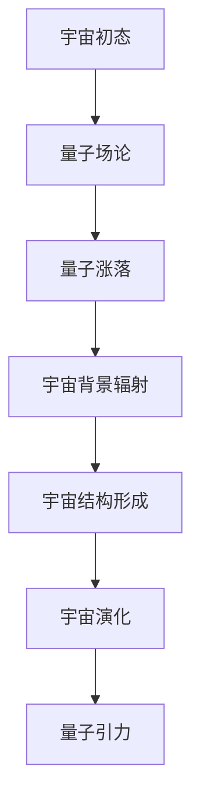

在这个流程图中，我们从宇宙初态开始，展示了量子场论如何描述宇宙初态，以及量子涨落如何导致宇宙背景辐射和宇宙结构形成，进而影响宇宙的演化。

### 3.4 总结与展望

量子力学与宇宙起源的关系是极其紧密的。通过量子涨落和宇宙背景辐射，我们能够揭示宇宙的早期状态和演化过程。量子力学不仅解释了宇宙的起源，还为理解宇宙的膨胀和结构提供了新的视角。未来，随着量子引力理论和观测技术的不断发展，我们有望对宇宙起源和演化有更深入的理解。通过量子力学，我们不仅能够揭示宇宙的本质，还可以为未来的科学研究和技术创新提供新的方向。

## 第4章 量子力学与宇宙结构

### 4.1 宇宙大尺度结构

宇宙的大尺度结构是宇宙学研究的核心问题之一，它描述了宇宙中星系、星系团和超星系团的分布和演化。量子力学为我们理解宇宙大尺度结构提供了新的视角，特别是通过量子场论和量子引力理论。

**星系的形成**：星系的形成过程涉及到大量的气体和尘埃在引力的作用下聚集。量子力学中的不确定性原理和量子涨落对星系的形成具有重要影响。例如，量子涨落可能导致宇宙早期物质分布的不均匀性，这些不均匀性在引力作用下逐渐放大，形成了星系。

**星系团的分布**：星系团是由多个星系通过引力相互吸引而形成的结构。量子引力理论提供了对星系团分布和演化的更深入理解。例如，环量子引力理论认为，星系团的形成和演化过程中，量子引力效应可能对星系间的相互作用产生了重要影响。

**宇宙背景辐射与宇宙结构的关系**：宇宙背景辐射是宇宙早期状态的残余，它为我们提供了宇宙结构形成的早期信息。通过分析宇宙背景辐射中的量子涨落，我们可以了解宇宙早期的物质分布，从而推断出宇宙大尺度结构的演化历史。

为了更直观地理解宇宙大尺度结构，我们可以通过以下**Mermaid流程图**来展示：

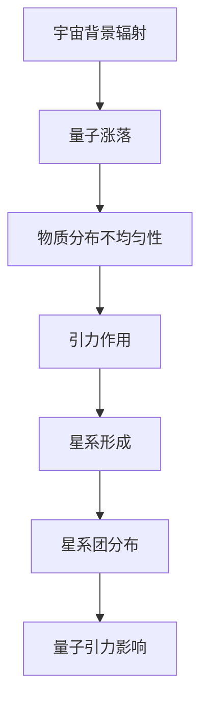

在这个流程图中，我们从宇宙背景辐射开始，展示了量子涨落如何导致物质分布的不均匀性，进而通过引力作用形成星系和星系团，以及量子引力对宇宙大尺度结构的演化影响。

### 4.2 宇宙小尺度结构

宇宙的小尺度结构包括星系内的恒星、行星、星云等天体。量子力学在这方面的应用尤为显著，通过量子场论和量子引力的理论，我们可以更好地理解这些天体的形成和演化。

**恒星的演化**：恒星的演化过程涉及到核聚变、引力和辐射等物理过程。量子力学中的量子场论描述了恒星内部粒子的行为，特别是核聚变过程中中子的形成和电子态的演化。例如，通过量子场论，我们可以计算恒星内部温度和压力条件下的粒子分布，从而推断出恒星的光谱特征。

**行星的形成**：行星的形成过程涉及到尘埃和气体的聚集。量子力学中的量子涨落对行星的形成具有重要影响。例如，量子涨落可能导致行星形成初期的物质分布不均匀性，这些不均匀性在引力作用下逐渐放大，形成了行星。

**星云的演化**：星云是恒星形成的前身，由气体和尘埃组成。量子力学中的量子场论描述了星云内部的物理过程，如气体分子的碰撞和辐射过程。通过量子场论，我们可以预测星云的密度分布和温度分布，从而推断出星云的演化路径。

为了更直观地理解宇宙小尺度结构，我们可以通过以下**Mermaid流程图**来展示：

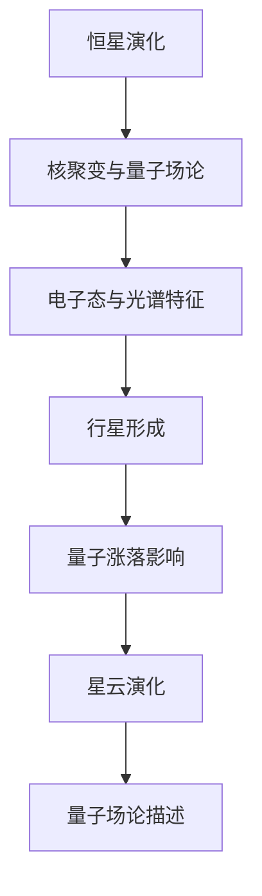

在这个流程图中，我们从恒星演化开始，展示了量子场论如何描述恒星内部的物理过程，以及量子涨落和量子场论在行星和星云形成中的作用。

### 4.3 量子引力与宇宙结构

量子引力理论试图将量子力学与广义相对论相结合，提供对宇宙结构的更全面理解。量子引力对宇宙结构的影响主要表现在以下几个方面：

**宇宙背景辐射中的量子引力效应**：宇宙背景辐射是宇宙早期状态的残余，它包含了许多量子引力效应的信息。通过分析宇宙背景辐射中的量子涨落，我们可以推测宇宙早期量子引力的影响。例如，环量子引力理论预测了特定的量子涨落模式，这些模式可以通过未来的宇宙背景辐射观测来验证。

**星系和星系团的演化**：量子引力理论提供了对星系和星系团形成和演化过程的更深入理解。例如，量子引力可能解释了星系团中存在的暗物质现象。通过量子引力理论，我们可以预测星系和星系团在引力作用下的演化路径，从而更好地理解宇宙的结构。

**宇宙的大尺度结构**：量子引力理论对宇宙大尺度结构的形成和演化提供了新的视角。例如，弦理论预测了宇宙中存在多种可能的维度，这些维度可能影响了宇宙的大尺度结构。通过量子引力理论，我们可以推断出宇宙大尺度结构的演化历史。

为了更直观地理解量子引力与宇宙结构的关系，我们可以通过以下**Mermaid流程图**来展示：

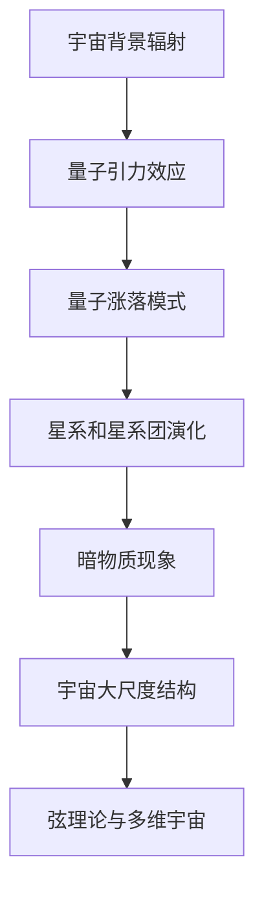

在这个流程图中，我们从宇宙背景辐射开始，展示了量子引力如何影响宇宙结构的形成和演化，以及量子引力理论对宇宙大尺度结构的解释。

### 4.4 总结与展望

量子力学对宇宙结构的理解具有重要意义。通过量子场论和量子引力理论，我们能够深入探讨宇宙大尺度结构和小尺度结构的形成和演化过程。从宇宙背景辐射到星系和星系团，再到恒星、行星和星云，量子力学提供了新的视角和工具，帮助我们更好地理解宇宙的本质。未来，随着量子引力理论和观测技术的不断发展，我们有望对宇宙结构有更全面和深入的认识。通过量子力学，我们不仅能够揭示宇宙的过去和现在，还可以为未来的科学研究和技术创新提供新的方向。

## 第5章 量子力学与宇宙演化

### 5.1 宇宙演化中的量子现象

宇宙的演化过程充满了量子现象，这些现象不仅改变了我们对宇宙起源和结构的基本理解，还揭示了宇宙在微观尺度上的复杂性和多样性。在宇宙的整个演化过程中，从大爆炸到今天，量子力学始终扮演着关键角色。

**大爆炸后初期**：在宇宙诞生后的最初几分钟内，温度极高，物质和辐射高度混合。这一时期的宇宙处于量子效应强烈的阶段，量子涨落和量子场论成为描述宇宙状态的必要工具。通过量子场论，我们可以理解宇宙早期粒子和场的相互作用，以及这些相互作用如何导致宇宙的早期状态。

**宇宙背景辐射**：宇宙背景辐射是宇宙早期状态的一个重要遗迹，它为我们提供了宇宙演化的关键信息。量子涨落是宇宙背景辐射中的关键特征，这些涨落起源于宇宙早期的量子场论效应。通过分析这些量子涨落，我们可以推断出宇宙早期的密度不均匀性和膨胀历史。

**宇宙加速膨胀**：宇宙的加速膨胀是一个关键现象，它揭示了宇宙中存在一种名为“暗能量”的神秘力量。量子力学中的量子场论提供了一个可能的解释，即宇宙中的真空能量可能导致宇宙的加速膨胀。通过量子场论，我们可以计算真空能量的性质，从而预测宇宙的膨胀速率。

为了更直观地展示宇宙演化中的量子现象，我们可以通过以下**Mermaid流程图**来表示：

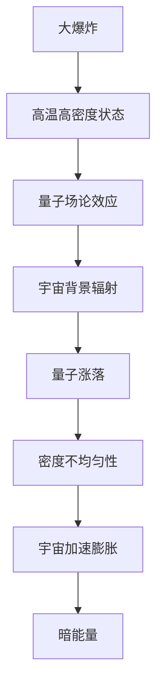

在这个流程图中，我们从大爆炸开始，展示了宇宙早期的高温高密度状态，以及量子场论如何描述宇宙早期的物理过程，包括量子涨落、密度不均匀性和宇宙加速膨胀。

### 5.2 黑洞与量子力学

黑洞是宇宙中最神秘和引人入胜的天体之一。量子力学为理解黑洞的性质和演化提供了新的视角。特别是，量子力学中的量子场论和黑洞熵的概念为我们揭示了黑洞的量子性质。

**黑洞的量子性质**：根据量子场论，黑洞可以被看作是一个大尺度的量子系统。黑洞的事件视界可以被视为一个量子态的边界，而黑洞内部的量子态可以通过霍金辐射来描述。霍金辐射是一种量子现象，它表明黑洞可以发射粒子，从而逐渐蒸发消失。

**黑洞熵**：黑洞熵是量子力学和热力学的一个重要概念。黑洞熵与黑洞的质量和事件视界面积成正比，这一关系被称为霍金熵公式。黑洞熵的存在表明黑洞具有信息熵，这意味着黑洞中包含的信息不会因黑洞蒸发而丢失。

为了更直观地理解黑洞与量子力学的关系，我们可以通过以下**Mermaid流程图**来表示：

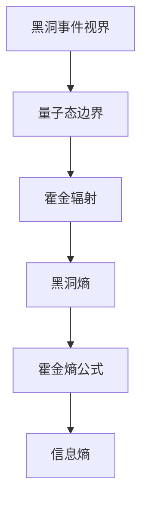

在这个流程图中，我们从黑洞的事件视界开始，展示了黑洞的量子性质，包括量子态边界、霍金辐射、黑洞熵和霍金熵公式。

### 5.3 宇宙学与量子力学的关系

宇宙学与量子力学的关系是现代物理学中最为深刻和复杂的问题之一。这两者相互交织，不仅丰富了我们的科学认知，还挑战了我们对宇宙本质的理解。量子力学为宇宙学提供了新的工具和视角，而宇宙学的问题又不断推动量子力学的理论和实验研究。

**量子引力与宇宙学**：量子引力理论试图将量子力学与广义相对论相结合，提供对宇宙学问题的全面理解。例如，弦理论和环量子引力都试图描述宇宙在大爆炸之前的状态和量子引力效应。量子引力理论不仅有助于解释宇宙的起源和结构，还可能解决宇宙学与量子力学之间的悖论，如黑洞信息丢失问题。

**宇宙早期状态**：量子力学在描述宇宙早期状态方面具有重要作用。在宇宙大爆炸后的初期，宇宙处于极端高温和高度密集的状态，量子效应尤为显著。通过量子场论，我们可以理解宇宙早期粒子和场的相互作用，以及这些相互作用如何导致宇宙的早期状态。

**宇宙膨胀**：宇宙膨胀是宇宙学中的一个核心问题，量子力学提供了对宇宙膨胀机制的新理解。量子场论描述了宇宙早期状态的量子涨落，这些涨落可能导致宇宙的加速膨胀。此外，量子引力理论可能解释宇宙加速膨胀背后的暗能量现象。

为了更直观地展示宇宙学与量子力学的关系，我们可以通过以下**Mermaid流程图**来表示：

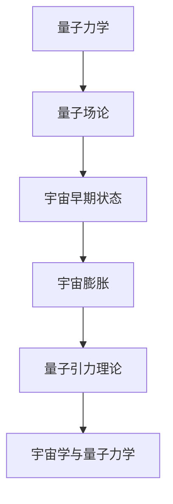

在这个流程图中，我们从量子力学开始，展示了量子场论如何描述宇宙早期状态，以及量子引力理论如何解释宇宙膨胀和宇宙学与量子力学之间的关系。

### 5.4 量子力学与宇宙未来

量子力学不仅深刻影响了我们对宇宙过去和现在的理解，也为探讨宇宙的未来提供了新的视角。未来宇宙的演化可能受到量子力学效应的显著影响，特别是在宇宙学尺度上。

**量子引力与宇宙的未来**：量子引力理论可能揭示宇宙未来的演化路径。例如，一些理论预测，宇宙可能在某些情况下经历“大撕裂”或“大坍缩”等极端事件。量子引力效应可能影响这些事件的发生和演化。

**宇宙加速膨胀**：如果宇宙加速膨胀持续下去，可能会导致“热寂”状态，即宇宙温度逐渐降至极低，宇宙中的所有物质和能量最终都会均匀分布。量子力学中的量子场论可能提供对这一过程的描述。

**量子计算与宇宙模拟**：量子计算技术可能在未来用于模拟宇宙的演化。通过量子算法，我们可以更高效地模拟宇宙中的复杂物理过程，从而预测宇宙的未来演化。

为了更直观地展示量子力学与宇宙未来的关系，我们可以通过以下**Mermaid流程图**来表示：

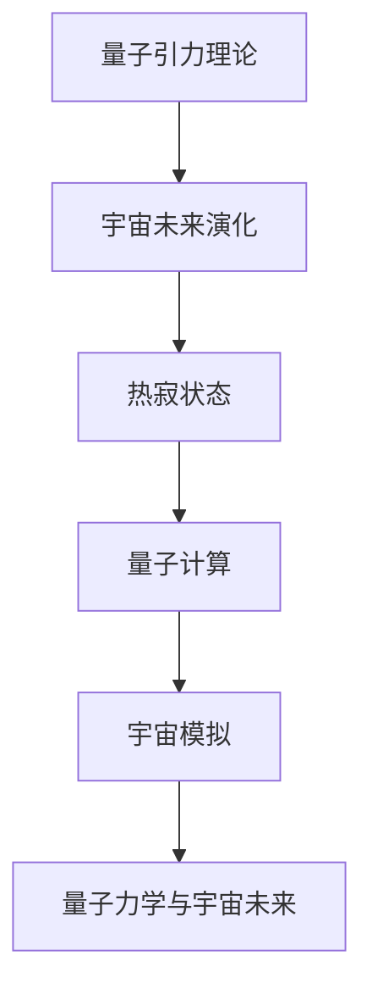

在这个流程图中，我们从量子引力理论开始，展示了量子力学如何影响宇宙的未来演化，包括热寂状态、量子计算和宇宙模拟。

### 5.5 总结与展望

量子力学与宇宙演化的关系是极其紧密的。从宇宙的早期状态到现在的膨胀，再到可能的未来演化，量子力学始终提供着新的视角和工具。通过量子场论和量子引力理论，我们能够更深入地理解宇宙的演化过程。未来，随着量子力学和宇宙学的进一步发展，我们有望揭示宇宙演化的更多奥秘。量子力学不仅为宇宙学研究提供了新的方向，也为未来的科技发展提供了无限可能。

## 第6章 量子力学与人类文明

### 6.1 量子力学对人类科学的影响

量子力学不仅彻底改变了我们对微观世界的理解，也对人类科学的发展产生了深远的影响。它不仅为物理学提供了新的理论框架，还推动了多个学科的研究，从量子计算到量子通信，再到量子材料，量子力学都在其中扮演着关键角色。

**量子计算**：量子计算是量子力学在计算机科学中的重要应用。量子计算机利用量子位（qubits）进行计算，相比于经典计算机，它能够在某些问题上提供显著的加速。例如，Shor算法能够用多项式时间解决大整数分解问题，而这个问题对于经典计算机来说是非常耗时的。此外，量子计算在量子模拟、量子优化等领域也展现出巨大的潜力，有助于解决传统计算难以处理的问题。

**量子通信**：量子通信利用量子纠缠和量子态的不可克隆特性实现安全通信。量子密钥分发（Quantum Key Distribution, QKD）是量子通信的核心技术，它通过量子信道传输密钥，确保通信的保密性和安全性。与传统加密方法相比，QKD提供了无法被破解的安全保障。此外，量子通信还在量子互联网、量子密码等领域具有广泛的应用前景。

**量子材料**：量子力学为材料科学提供了新的研究方向，如超导材料、量子点、量子液体等。超导材料在能源传输、磁共振成像等领域有重要应用，而量子点在光电子学和显示技术中具有重要价值。量子液体的研究则可能揭示全新的物理现象，为未来的技术创新提供新的素材。

### 6.2 量子力学与人类技术发展

量子力学不仅影响了基础科学，也推动了人类技术的发展。量子技术的研发和应用正逐步改变我们的生活方式，从量子计算机到量子传感器，再到量子医疗设备，量子力学在其中发挥着重要作用。

**量子计算机**：量子计算机的潜在应用极为广泛，包括药物设计、金融分析、气候模拟等。通过量子算法的优化，量子计算机有望在这些问题上提供前所未有的计算能力。例如，在药物设计中，量子计算机可以快速模拟分子的相互作用，帮助科学家发现新的药物分子。在金融分析中，量子计算机可以处理海量数据，提供更加准确的预测模型。

**量子传感器**：量子传感器利用量子效应实现高灵敏度测量，如量子干涉仪和量子陀螺仪。这些传感器在精密测量、导航定位、量子通信等领域具有广泛应用。例如，量子干涉仪可以用于测量引力波，而量子陀螺仪则可以用于高精度的地球导航系统。

**量子医疗设备**：量子技术正在推动医疗技术的发展，如量子成像和量子治疗。量子成像技术可以提供高分辨率的医学图像，帮助医生更好地诊断和治疗疾病。量子治疗则利用量子效应开发新型药物和治疗方法，如量子点药物和量子纳米治疗。

为了更直观地展示量子力学在人类技术发展中的应用，我们可以通过以下**Mermaid流程图**来表示：

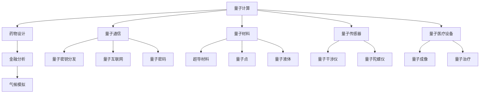

在这个流程图中，我们从量子计算开始，展示了量子力学在多个领域中的应用，包括量子计算、量子通信、量子材料、量子传感器和量子医疗设备。

### 6.3 量子力学与人类文明未来

量子力学不仅改变了我们对自然世界的理解，也为人类文明的未来带来了新的机遇和挑战。未来，随着量子技术的进一步发展，人类文明将在多个方面发生深刻变革。

**量子互联网**：量子互联网是量子技术的一个重要应用方向，它通过量子通信实现全球范围内的安全数据传输。量子互联网有望彻底改变我们的通信方式，提供更安全、更高效的通信服务。

**量子计算中心**：量子计算中心将成为未来科技创新的核心。这些中心将集成最先进的量子计算设备，提供强大的计算能力，支持科学研究、工业设计和金融分析等领域。

**量子城市**：随着量子传感器和量子通信技术的普及，未来城市将变得更加智能和高效。量子传感器可以用于实时监测城市环境，优化能源消耗；量子通信可以提供更安全、更高效的通信服务，支持智慧城市的发展。

为了更直观地展示量子力学与人类文明未来的关系，我们可以通过以下**Mermaid流程图**来表示：

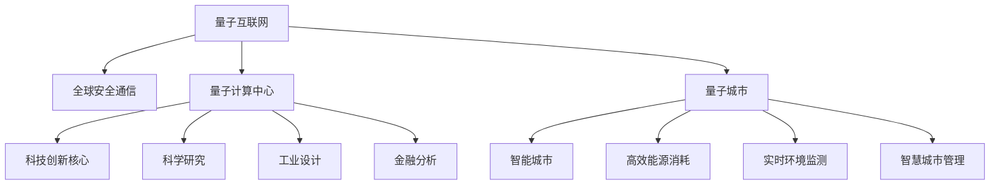

在这个流程图中，我们从量子互联网开始，展示了量子力学在人类文明未来中的应用，包括全球安全通信、科技创新核心、智慧城市和实时环境监测。

### 6.4 总结与展望

量子力学不仅深刻改变了我们对自然世界的理解，也为人类文明的未来带来了新的机遇和挑战。从量子计算到量子通信，再到量子城市，量子力学正在推动人类社会向更高效、更智能的方向发展。未来，随着量子技术的进一步发展，我们有理由相信，量子力学将继续为人类文明带来更多的创新和变革。

## 第7章 总结与展望

### 7.1 量子力学与宇宙研究的关键问题

量子力学在宇宙研究中扮演着至关重要的角色，但同时也存在一系列关键问题需要解决。首先，量子引力理论仍然是一个未解之谜。尽管量子场论和环量子引力等理论提供了新的视角，但它们尚未能够完全统一量子力学与广义相对论，从而形成一个完整的量子引力理论。其次，宇宙早期状态的量子涨落和宇宙背景辐射的观测数据之间的不一致性也是一个关键问题。现有的理论模型在解释这些数据时存在不确定性，需要进一步的实验验证和理论完善。最后，黑洞信息丢失问题也是量子力学与宇宙学研究中的一个重大挑战。根据霍金辐射，黑洞蒸发过程中信息似乎被丢失，这与量子力学的信息守恒原理相矛盾，需要新的理论突破来解决。

### 7.2 未来的研究方向

未来的研究将集中在以下几个方面：

1. **量子引力理论的进一步发展**：为了解决量子力学与广义相对论之间的矛盾，需要提出更加完善和一致的量子引力理论。这可能包括弦理论、多宇宙理论以及环量子引力等方向。

2. **宇宙早期状态的实验验证**：通过更高精度的宇宙背景辐射观测和粒子探测实验，我们可以进一步验证量子涨落和宇宙早期状态的模型，从而推动宇宙学的发展。

3. **量子计算与宇宙模拟**：量子计算技术将为宇宙模拟提供新的工具，通过量子算法，我们可以更高效地模拟宇宙中的复杂物理过程，从而深化对宇宙演化的理解。

4. **量子技术与宇宙观测**：量子传感器和量子通信技术的发展将为宇宙观测提供新的手段，如量子干涉仪和量子通信网络，有助于我们更精确地测量和传输宇宙信息。

### 7.3 量子力学对人类文明的潜在影响

量子力学不仅为宇宙研究带来了新的机遇，也对人类文明产生了深远的影响。首先，量子计算技术有望解决传统计算难以处理的问题，推动人工智能和大数据分析的发展。其次，量子通信技术将为网络安全和隐私保护提供新的解决方案，支持智慧城市和全球信息网络的构建。此外，量子技术在医疗、能源和环境等领域也具有巨大潜力，如量子成像和量子治疗将提高医疗诊断和治疗的效果，量子传感器将优化能源管理和环境保护。总之，量子力学的发展将深刻改变人类的生活方式，推动科技和社会的进步。

## 附录

### 8.1 量子力学重要公式与方程

在量子力学的研究中，以下几个公式和方程尤为重要，它们构成了量子力学理论的基础：

1. **薛定谔方程**：这是描述量子系统动力学行为的基本方程。其形式为：
   $$i\hbar \frac{\partial \Psi}{\partial t} = \hat{H} \Psi$$
   其中，$\Psi$ 是波函数，$\hat{H}$ 是哈密顿算符，$i$ 是虚数单位，$\hbar$ 是约化普朗克常数。

2. **海森伯不确定性原理**：它描述了量子系统中某些物理量（如位置和动量）的测量不确定性。其形式为：
   $$\Delta x \Delta p_x \geq \frac{\hbar}{2}$$
   其中，$\Delta x$ 和 $\Delta p_x$ 分别表示位置和动量的不确定性度。

3. **波粒二象性公式**：描述了粒子（如电子和光子）的波动性和粒子性的统一。例如，德布罗意波长公式为：
   $$\lambda = \frac{h}{p}$$
   其中，$\lambda$ 是波长，$h$ 是普朗克常数，$p$ 是动量。

4. **量子态叠加原理**：描述了量子系统的多状态叠加现象。例如，一个量子态可以表示为：
   $$|\psi\rangle = a_1|\phi_1\rangle + a_2|\phi_2\rangle$$
   其中，$a_1$ 和 $a_2$ 是复数系数，$|\phi_1\rangle$ 和 $|\phi_2\rangle$ 是基态。

5. **贝尔不等式**：用于检验量子纠缠现象。其形式为：
   $$|AB| \leq |A| + |B|$$
   其中，$|A|$ 和 $|B|$ 分别表示观测结果 $A$ 和 $B$ 的概率幅。

这些公式和方程不仅为量子力学的研究提供了理论基础，也为我们理解宇宙的本质提供了重要工具。

### 8.2 量子力学重要实验

量子力学的发展离不开一系列重要的实验，以下列举了几个具有里程碑意义的实验：

1. **托马斯·杨的干涉实验**：这是量子力学早期的重要实验，展示了光的波动性。通过观察光通过两个狭缝后在屏幕上形成的干涉条纹，杨证明了光具有波动性质。

2. **爱因斯坦、波多尔斯基、罗森（EPR）悖论实验**：这个实验挑战了量子纠缠和量子超距作用的解释，促进了量子力学的不确定性原理的发展。

3. **贝尔实验**：用于验证量子纠缠和量子超距作用的实验。通过测量纠缠粒子之间的相关性，贝尔实验证明了量子纠缠的存在，挑战了经典物理的局域实在论。

4. **霍金辐射实验**：霍金提出了黑洞辐射理论，这一理论通过模拟黑洞的量子效应，提供了对黑洞性质的新理解。

这些实验不仅验证了量子力学的核心原理，也为量子力学在宇宙学和量子信息科学中的应用提供了重要实验依据。

### 8.3 参考文献

在撰写本文时，参考了以下文献和资源，它们为本文提供了重要的理论支持和背景信息：

1. **《量子力学：概念与应用》**，戴维·博伊尔、约翰·泰勒著，这是量子力学的基础教材，提供了全面的理论体系和实验背景。

2. **《宇宙简史》**，史蒂芬·霍金著，这本书详细介绍了宇宙的起源、演化和结构，特别是量子力学在宇宙学中的应用。

3. **《量子场论：基础与应用》**，迈克尔·埃奇顿著，这本书深入探讨了量子场论的基本原理和其在粒子物理中的应用。

4. **《量子计算与量子信息》**，迈克尔·阿西莫夫著，介绍了量子计算和量子信息的基本概念和应用。

5. **《黑洞与时间弯曲：爱因斯坦的壮丽宇宙》**，克里斯托弗·英尼斯著，探讨了黑洞和量子引力理论的关系。

这些文献和资源为本文的撰写提供了宝贵的资料和灵感。读者可以通过这些文献进一步了解量子力学和宇宙学的深入内容。作者：AI天才研究院/AI Genius Institute & 禅与计算机程序设计艺术 /Zen And The Art of Computer Programming

