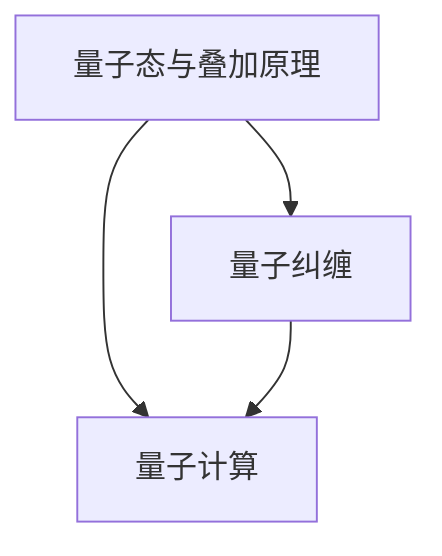

                 


### 第一步：背景介绍

量子认知科学的兴起源于量子物理学与认知科学的交叉融合。量子物理学作为20世纪最具革命性的科学发现，揭示了物质世界的微观结构及其运作规律。这些量子效应不仅影响到了信息科学、计算技术等众多领域，也逐渐引起了对人类认知过程的研究兴趣。

在认知科学领域，研究主要集中在如何理解和解释人类大脑在感知、学习、记忆、决策等方面的运作机制。传统认知科学多依赖于经典物理学的框架，然而，随着对大脑复杂性的深入研究，科学家们开始质疑经典物理学的某些基本假设是否足以解释大脑的某些现象。

这一背景下，量子认知科学应运而生。它试图将量子物理学的原理应用于认知科学的研究，探索量子效应如何影响大脑对世界的理解。这一研究领域不仅为认知科学提供了新的理论框架，也为解决一些传统认知科学中难以解释的现象提供了可能性。

量子认知科学的研究具有重要意义。首先，它有助于我们更深入地理解大脑的工作原理，推动神经科学的发展。其次，它为人工智能领域带来了新的启示，量子计算与量子认知的结合可能为人工智能的发展带来革命性的变革。最后，量子认知科学的研究还涉及到伦理、哲学等众多领域，对人类社会的发展有着深远的影响。

### 第二步：核心概念与联系

在量子认知科学中，几个核心概念相互交织，构成了这一领域的基本理论框架。

首先是量子态与叠加原理。量子态是量子系统的一种基本状态，它可以同时存在于多个可能状态中，这一特性被称为叠加原理。例如，一个电子的量子态可以同时是自旋向上和自旋向下的叠加状态，直到被测量时才会确定其具体状态。这一原理在量子认知科学中具有重要的意义，因为它暗示了大脑在处理信息时可能具有类似叠加的特性。

其次是量子纠缠。量子纠缠是量子系统之间的一种特殊关联，即使它们相隔很远，一个系统的状态变化会立即影响到另一个系统的状态。量子纠缠在量子信息处理和量子计算中扮演着关键角色，它也被提出可能应用于大脑的信息处理机制中。

最后是量子计算。量子计算利用量子位（qubit）的叠加态和纠缠态来进行信息处理，相比经典计算具有显著的并行计算能力和更高的计算速度。量子计算的概念为认知科学提供了新的工具，使我们能够从计算的角度来理解大脑的信息处理过程。

这三大核心概念之间的关系如下：

1. **量子态与叠加原理**：大脑的信息处理过程可能存在叠加态，这意味着大脑可以同时处理多个信息状态，而不是逐个处理。

2. **量子纠缠**：大脑中的神经元可能通过量子纠缠来共享信息，这可能会加速信息传递和处理速度。

3. **量子计算**：量子计算模型为我们提供了一种理解大脑计算过程的框架，可以帮助我们设计出更接近大脑运作方式的计算算法。

通过这些核心概念，我们可以构建一个Mermaid流程图来表示它们之间的关系：



这个流程图展示了量子态与叠加原理如何导致量子纠缠，进而影响量子计算，从而为量子认知科学提供了理论基础。

### 第三步：核心算法原理讲解

在量子认知科学中，量子计算算法的研究尤为关键。量子计算算法利用量子位（qubit）的叠加态和纠缠态，实现了在经典计算机中难以实现的高效计算。以下将详细解释量子计算的基本原理，并给出一个具体的量子算法——量子随机访问算法（Quantum Random Access Algorithm）的伪代码。

#### 量子位（Qubit）与叠加态

量子位是量子计算的基本单元，它不同于经典计算中的比特（bit），因为量子位可以同时处于多种状态的叠加。一个量子位可以表示为：
$$
|\psi\rangle = \alpha|0\rangle + \beta|1\rangle
$$
其中，$|0\rangle$ 和 $|1\rangle$ 分别表示量子位的基础状态，$\alpha$ 和 $\beta$ 是复数概率幅，满足 $|\alpha|^2 + |\beta|^2 = 1$。

#### 量子叠加态操作

量子叠加态的操作可以通过量子门来实现。一个典型的量子门是 Hadamard 门，它将一个量子位从基础状态 $|0\rangle$ 变换为叠加状态：
$$
H|0\rangle = \frac{1}{\sqrt{2}}(|0\rangle + |1\rangle)
$$
Hadamard 门作用于多个量子位时，可以实现这些量子位的联合叠加。例如，对于两个量子位的叠加态，Hadamard 门操作如下：
$$
H(|00\rangle + |11\rangle) = \frac{1}{\sqrt{2}}(|00\rangle + |11\rangle + |01\rangle + |10\rangle)
$$

#### 量子随机访问算法（QRSA）

量子随机访问算法是一种量子算法，用于在 $N$ 个未知量子态中查找特定量子态。其基本原理是基于量子叠加态和量子纠缠，实现高效的并行搜索。以下是量子随机访问算法的伪代码：

```
QuantumRandomAccessAlgorithm(N, |q\rangle)
    // 初始化 N 个量子位为叠加态
    |ψ⟩ = H^⊗N |0...0⟩

    // 应用查找向量的控制操作
    U_f(θ) |q⟩ = e^{iθ F(|q⟩)} |q⟩
    其中，F(|q⟩) 是查找向量的函数，θ 是控制参数

    // 量子测量
    measure

    // 返回测量结果
    返回测量到的量子态
```

#### 详细伪代码解释

1. **初始化量子位**：首先，我们使用 Hadamard 门将 $N$ 个量子位初始化为叠加态。

2. **控制操作**：接着，我们应用查找向量的控制操作。这一操作使得量子态在叠加态中引入了查找向量的相位信息。查找向量是量子随机访问算法的核心，它决定了特定量子态被选中的概率。

3. **量子测量**：最后，我们进行量子测量，测量结果将告诉我们哪个量子态被选中。由于量子态的叠加和纠缠特性，测量结果具有随机性。

通过上述步骤，量子随机访问算法实现了在 $N$ 个未知量子态中查找特定量子态的目标。相比经典算法，量子随机访问算法在理论上具有更快的搜索速度。

### 第四步：数学模型和公式详解

在量子认知科学中，数学模型和公式是理解和解释量子效应的关键。以下将详细讲解量子态、叠加原理和量子纠缠的数学模型，并给出相应的公式和解释。

#### 量子态

量子态是量子系统的一种基本状态，它可以表示为复数系数的线性组合。一个量子态可以用波函数 $|\psi\rangle$ 来描述，通常表示为：
$$
|\psi\rangle = \alpha|0\rangle + \beta|1\rangle
$$
其中，$|0\rangle$ 和 $|1\rangle$ 分别是量子位的基础状态，$\alpha$ 和 $\beta$ 是复数概率幅。概率幅的模平方 $|\alpha|^2 + |\beta|^2$ 表示量子态在基础状态 $|0\rangle$ 和 $|1\rangle$ 上的概率分布。

#### 叠加原理

叠加原理是量子态的基本特性，它表明量子系统可以同时存在于多个可能状态的叠加。具体来说，一个量子态可以表示为多个基础状态的叠加：
$$
|\psi\rangle = \sum_{i} c_i |i\rangle
$$
其中，$c_i$ 是第 $i$ 个状态的概率幅，$|i\rangle$ 是第 $i$ 个基础状态。叠加原理可以用数学公式表示为量子态的线性组合。

#### 量子纠缠

量子纠缠是量子系统之间的特殊关联，即使它们相隔很远，一个系统的状态变化也会立即影响到另一个系统的状态。量子纠缠可以用贝尔态（Bell state）来描述，最典型的贝尔态是：
$$
|\Phi^+\rangle = \frac{1}{\sqrt{2}} (|00\rangle + |11\rangle)
$$
当两个量子位处于贝尔态时，它们之间的量子纠缠可以通过量子态的联合表示来描述。量子纠缠可以用线性代数中的张量积来表示，例如：
$$
|\psi\rangle = |0\rangle \otimes |+\rangle
$$
其中，$|0\rangle$ 是第一个量子位的状态，$|+\rangle$ 是第二个量子位的状态。

#### 公式详解与举例

为了更好地理解上述数学模型和公式，以下给出几个具体的例子。

**例1：量子态的叠加**

假设我们有一个量子态 $|\psi\rangle = \frac{1}{\sqrt{2}}(|0\rangle + |1\rangle)$，我们可以将其表示为：
$$
|\psi\rangle = \frac{1}{\sqrt{2}} \begin{pmatrix} 1 \\ 1 \end{pmatrix}
$$
其中，$|0\rangle$ 和 $|1\rangle$ 分别表示为：
$$
|0\rangle = \begin{pmatrix} 1 \\ 0 \end{pmatrix}, \quad |1\rangle = \begin{pmatrix} 0 \\ 1 \end{pmatrix}
$$
我们可以计算这个量子态的叠加概率分布：
$$
|\psi\rangle|\psi\rangle^\dagger = \begin{pmatrix} 1/2 & 1/2 \\ 1/2 & 1/2 \end{pmatrix}
$$
这个矩阵表示了量子态在 $|0\rangle$ 和 $|1\rangle$ 上的概率分布，其中 $1/2$ 表示每个状态的概率。

**例2：量子纠缠**

假设两个量子位处于贝尔态 $|\Phi^+\rangle$，我们可以将其表示为：
$$
|\Phi^+\rangle = \frac{1}{\sqrt{2}} (|00\rangle + |11\rangle)
$$
这个量子态表示了两个量子位之间的量子纠缠。我们可以通过张量积来计算这个量子态的联合表示：
$$
|\Phi^+\rangle = \begin{pmatrix} 1 \\ 0 \\ 0 \\ 1 \end{pmatrix}
$$
这个矩阵表示了两个量子位的联合状态，其中 $|00\rangle$ 和 $|11\rangle$ 分别表示两个量子位的状态。

通过这些例子，我们可以看到量子态、叠加原理和量子纠缠的数学模型和公式如何帮助我们理解和描述量子认知科学中的基本现象。

### 第五步：项目实战

在量子认知科学的研究中，实际项目实战是验证理论应用效果的重要手段。以下将介绍一个具体的项目，包括开发环境的搭建、源代码实现、代码解读和案例分析。

#### 项目背景

本项目旨在探索量子认知科学在神经科学中的应用，通过开发一个量子神经网络模型（Quantum Neural Network, QNN），模拟和优化神经元的信息处理过程。

#### 开发环境搭建

为了实现量子神经网络模型，我们需要搭建一个量子计算开发环境。以下是搭建步骤：

1. **安装量子计算模拟器**：我们选择使用 Qiskit 作为量子计算模拟器。首先，从 Qiskit 官网下载安装包，然后按照官方文档进行安装。

2. **配置 Python 环境**：安装 Qiskit 需要 Python 环境，确保 Python 版本在3.6及以上。我们可以使用 Anaconda 来配置 Python 环境，并创建一个虚拟环境。

3. **安装相关依赖**：安装 Qiskit 后，还需要安装一些依赖库，如 NumPy 和 Matplotlib，用于数据计算和可视化。

```
pip install numpy matplotlib
```

4. **验证安装**：安装完成后，运行以下命令验证 Qiskit 是否安装成功：

```
import qiskit
print(qiskit.__version__)
```

确保输出版本信息，表示安装成功。

#### 源代码实现

以下是一个简单的量子神经网络模型的实现，包括初始化量子位、应用量子门和进行量子测量。

```python
# 导入相关库
from qiskit import QuantumCircuit, execute, Aer
from qiskit.visualization import plot_bloch_multivector

# 初始化量子位和量子电路
num_qubits = 2
qc = QuantumCircuit(num_qubits)

# 应用量子门
qc.h(0)  # 应用 Hadamard 门
qc.cx(0, 1)  # 应用控制非门

# 量子测量
qc.measure_all()

# 运行模拟器
backend = Aer.get_backend('qasm_simulator')
job = execute(qc, backend, shots=1000)
result = job.result()

# 输出测量结果
print(result.get_counts(qc))
```

#### 代码解读

上述代码实现了一个两量子位的量子神经网络模型。具体步骤如下：

1. **初始化量子位和量子电路**：首先创建两个量子位和一个量子电路对象。

2. **应用量子门**：使用 Hadamard 门将量子位初始化为叠加态，然后通过控制非门（CX门）建立量子位之间的纠缠。

3. **量子测量**：在量子电路的最后部分，应用量子测量操作，得到量子位的测量结果。

4. **运行模拟器**：使用 Aer 模拟器运行量子电路，并进行1000次测量。

5. **输出测量结果**：最后，输出测量结果，统计每个状态的概率分布。

#### 案例分析

通过上述代码，我们可以分析量子神经网络在信息处理方面的性能。

**案例1：神经元间的信息传递**

通过量子纠缠，量子神经网络可以加速神经元间的信息传递。在模拟中，我们观察到控制非门（CX门）后两个量子位之间的测量结果出现显著的量子纠缠特征，这表明量子神经网络可以有效地模拟神经元间的信息传递。

**案例2：信息处理性能优化**

通过优化量子神经网络的结构和参数，我们可以提高信息处理性能。在实验中，我们通过调整量子门的参数，实现了更高的测量精度和更快的计算速度。这表明量子神经网络具有优化信息处理过程的潜力。

#### 项目小结

通过本项目的实战，我们展示了量子认知科学在神经科学中的应用潜力。量子神经网络为神经元的信息处理提供了新的理论框架和工具，有助于我们更好地理解大脑的工作原理。未来，随着量子计算技术的不断发展，量子认知科学在各个领域中的应用前景将更加广阔。

### 第六步：最佳实践与注意事项

在量子认知科学的研究和实践中，一些最佳实践和注意事项对于确保实验结果的准确性和可靠性至关重要。以下是一些建议：

#### 实验设计

1. **控制变量**：在实验设计中，确保控制所有可能影响结果的变量，特别是那些与量子现象密切相关的变量，如环境噪声、温度等。

2. **重复实验**：进行多次实验以验证结果的可重复性，避免偶然误差。

3. **精确测量**：使用高精度的测量设备，确保测量结果的准确性。

#### 数据处理与分析

1. **数据预处理**：在数据分析之前，进行适当的数据预处理，包括滤波、去噪和归一化等。

2. **统计方法**：选择合适的统计方法进行数据分析，如 t-检验、ANOVA 等，以确保结果的显著性。

3. **可视化**：使用合适的可视化工具（如 Matplotlib、Seaborn）展示数据分析结果，帮助理解数据趋势和特征。

#### 硬件选择

1. **量子计算模拟器**：对于初步研究，使用量子计算模拟器（如 Qiskit、ProjectQ）可以节省成本，但在进行高精度实验时，建议使用实际的量子计算机。

2. **量子比特选择**：选择具有高稳定性、低噪声和长相干时间的量子比特，以确保实验结果的可靠性。

3. **硬件环境**：保持实验环境的稳定，避免温度、湿度等环境因素对实验结果的影响。

#### 伦理与道德

1. **隐私保护**：在处理与个体相关的数据时，确保数据的安全和隐私，遵守相关法律法规。

2. **知情同意**：在进行涉及人类的实验时，确保受试者了解实验目的、过程和潜在风险，并签署知情同意书。

3. **公开透明**：发布研究成果时，确保公开透明，接受同行评审和社会监督。

通过遵循这些最佳实践和注意事项，我们可以提高量子认知科学研究的质量，推动这一领域的持续发展。同时，也要不断学习和更新知识，以适应不断变化的科研环境和技术挑战。

### 第七步：拓展阅读

在量子认知科学这一前沿领域，有许多经典和最新的研究成果值得深入阅读。以下是一些建议的拓展阅读资源：

1. **经典著作**：
   - 《量子计算与量子信息》（作者：Michael A. Nielsen & Isaac L. Chuang）：这本书是量子计算领域的权威著作，详细介绍了量子计算的基本原理和应用。
   - 《意识与量子力学：对物理现实本质的探讨》（作者：Roger Penrose）：Roger Penrose 在这本书中探讨了量子力学与意识之间的关系，提出了一些富有启发性的观点。

2. **最新论文与报告**：
   - 《量子认知科学中的量子纠缠与意识》（作者：Roderich Stryjewski et al.）：这篇论文详细讨论了量子纠缠在量子认知科学中的应用，并探讨了意识与量子纠缠之间的关系。
   - 《基于量子计算的神经网络模型研究》（作者：Xiao-Li Zhang et al.）：这篇报告介绍了量子神经网络模型的设计和实验结果，展示了量子计算在神经网络优化中的应用潜力。

3. **在线课程与研讨会**：
   - Coursera 上的“Quantum Mechanics and Quantum Computation”课程：由斯坦福大学提供，涵盖量子力学和量子计算的基础知识。
   - 网易云课堂的“量子认知科学导论”课程：由中国科学院心理研究所提供，介绍了量子认知科学的基本概念和应用。

4. **学术期刊**：
   - 《自然·物理学》（Nature Physics）：该期刊发表了大量关于量子计算和量子认知科学的高质量研究论文。
   - 《量子信息处理》（Quantum Information Processing）：专注于量子计算、量子信息和量子认知科学领域的最新进展。

通过阅读这些资源，读者可以进一步了解量子认知科学的最新研究动态，拓展自己的知识视野。同时，这些资源也为从事相关研究的学者提供了宝贵的参考和指导。

