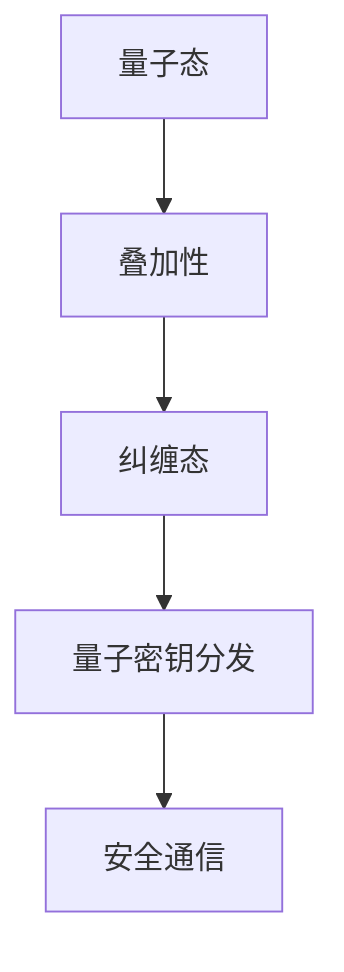
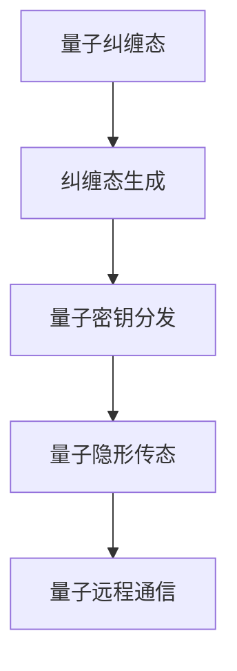
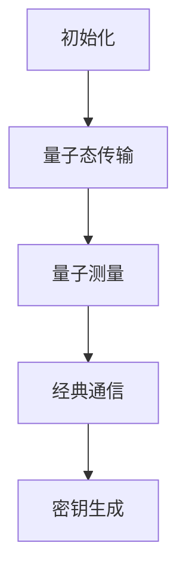
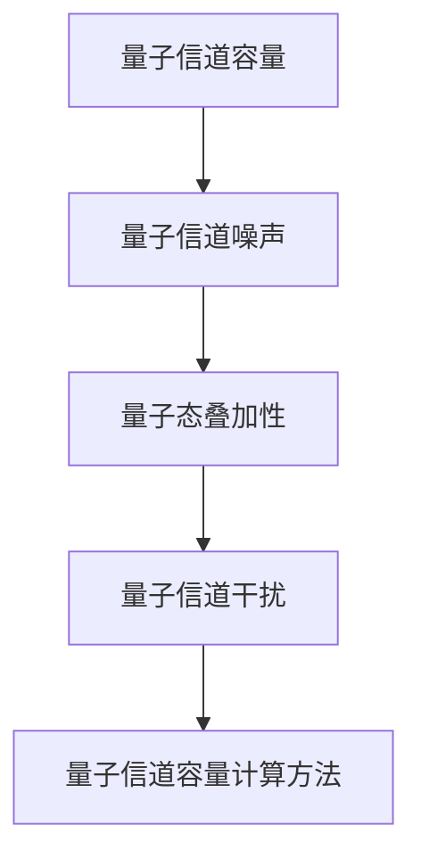
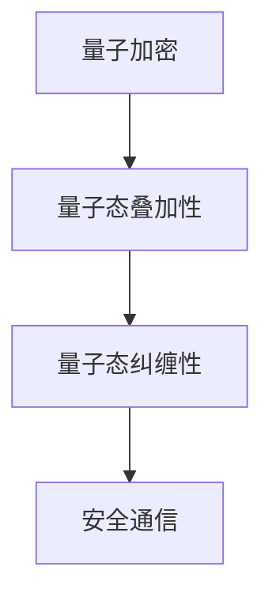
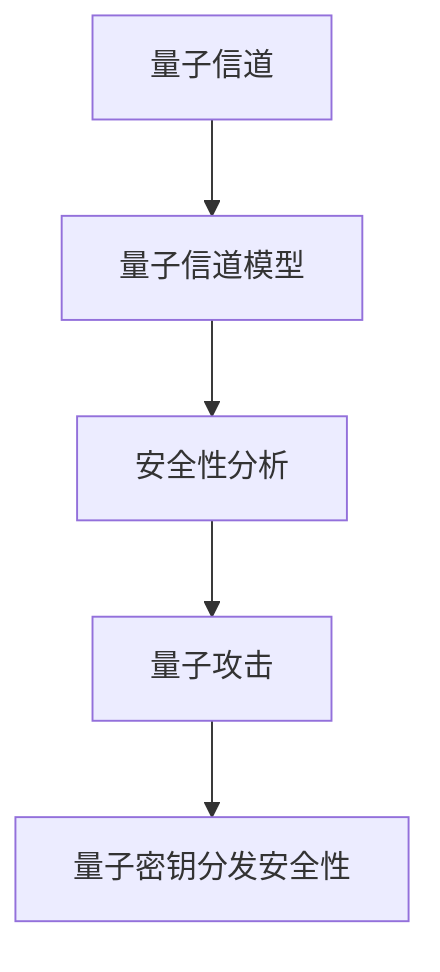
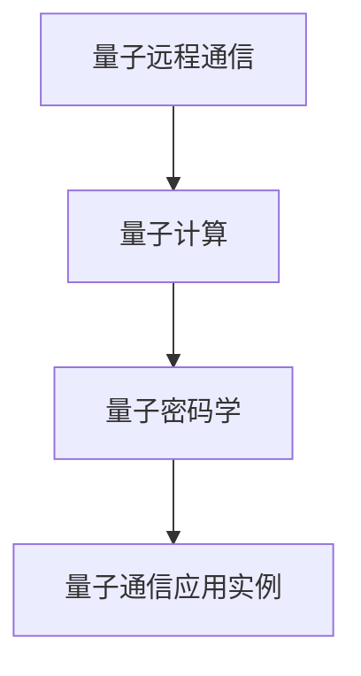
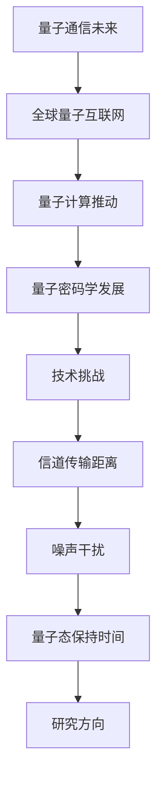
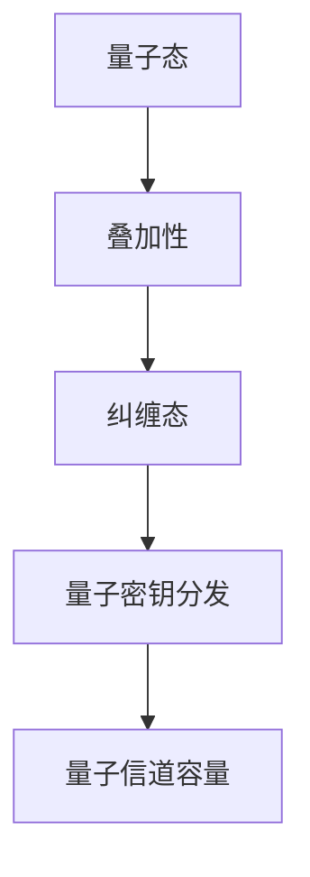

                 

### 文章标题

《量子通信的纠缠态：信息传输的数学安全》### 关键词

量子通信、纠缠态、信息传输、数学安全、量子密钥分发、量子加密、量子信道容量### 摘要

量子通信作为一种基于量子力学原理的新型通信方式，以其独特的安全性优势受到广泛关注。本文从量子通信的基本原理出发，深入探讨了量子纠缠态及其在信息传输中的应用。通过详细的数学模型和算法原理讲解，本文揭示了量子通信中的数学安全机制，为读者提供了一个全面、系统的理解。同时，通过实际项目案例的分析，本文展示了量子通信在安全通信中的实际应用效果。本文旨在为从事量子通信研究和应用的读者提供一个有价值的参考资料。## 第一部分：量子通信基础理论

### 第1章：量子通信原理

#### 背景介绍

量子通信是一种利用量子力学原理进行信息传输的技术。与传统的经典通信方式不同，量子通信在信息传输过程中具备更高的安全性。传统的通信方式依赖于密码学和加密技术来保证信息的安全性，而量子通信则基于量子态的叠加性和纠缠性，使得信息传输过程本身具有自验证的安全保障。因此，量子通信被认为是未来安全通信的发展方向。

#### 核心概念与联系

1. **量子态**：量子态是量子力学中描述粒子状态的数学工具，它可以同时处于多种状态的叠加，而经典态只能处于一个确定的状态。量子态的叠加性和纠缠性是量子通信的基础。

2. **纠缠态**：当两个粒子处于纠缠态时，一个粒子的状态会直接影响另一个粒子的状态，无论它们相隔多远。这种现象被称为量子纠缠。量子纠缠是实现量子通信安全性的关键。

3. **量子密钥分发**：量子密钥分发（Quantum Key Distribution，QKD）是一种利用量子通信原理进行密钥分发的技术。通过量子纠缠态的传输，可以实现安全的密钥生成和分发。

**Mermaid 流程图：**



#### 核心算法原理讲解

1. **量子纠缠态生成**：量子纠缠态可以通过量子纠缠器生成。在量子通信中，发送方和接收方各有一个量子纠缠器，通过它们之间的通信，可以生成一对量子纠缠态。

2. **量子密钥分发**：量子密钥分发的基本原理是，发送方将一个量子态发送给接收方，接收方对量子态进行测量，根据测量结果生成密钥。由于量子态的叠加性和纠缠性，任何第三方的干扰都会破坏量子态，从而使得密钥生成过程具备自验证的安全机制。

**伪代码：**

```python
# 量子纠缠态生成
def generate_entangled_state():
    # 使用量子纠缠器生成纠缠态
    entangled_state = quantum_oscillator.entropy()
    return entangled_state

# 量子密钥分发
def quantum_key_distribution():
    # 发送方生成量子态
    sender_state = generate_entangled_state()
    
    # 接收方测量量子态
    receiver_state = measure_quantum_state(sender_state)
    
    # 根据测量结果生成密钥
    key = generate_key(receiver_state)
    
    return key
```

#### 数学模型和数学公式讲解

1. **量子态表示**：量子态可以用波函数表示，如 $|\psi\rangle = \alpha|0\rangle + \beta|1\rangle$，其中 $|0\rangle$ 和 $|1\rangle$ 分别表示量子比特的基态。

2. **量子信道容量**：量子信道容量是衡量量子信道传输信息能力的指标。对于一个无噪声的量子信道，其信道容量可以表示为 $C = 1 - H(1 - p)$，其中 $H$ 是熵函数，$p$ 是量子态传输成功的概率。

**LaTeX 格式公式：**

$$
|\psi\rangle = \alpha|0\rangle + \beta|1\rangle
$$

$$
C = 1 - H(1 - p)
$$

#### 举例说明

假设发送方想要通过量子通信向接收方发送一个量子比特的信息，发送方生成一个量子纠缠态 $|\psi\rangle = \frac{1}{\sqrt{2}}(|0\rangle + |1\rangle)$，然后将这个态发送给接收方。接收方对量子态进行测量，得到结果为 $|0\rangle$，根据测量结果，接收方生成一个密钥 $k = 0$。通过这个过程，发送方和接收方成功生成了一个安全的密钥。

#### 项目实战

1. **开发环境搭建**：

   为了演示量子密钥分发，我们可以使用 Python 的量子计算库 Qiskit 来搭建开发环境。首先安装 Qiskit：

   ```bash
   pip install qiskit
   ```

2. **源代码实现**：

   以下是一个简单的量子密钥分发实现：

   ```python
   from qiskit import QuantumCircuit, execute, Aer

   # 生成量子纠缠态
   def generate_entangled_state():
       qc = QuantumCircuit(2)
       qc.h(0)
       qc.cx(0, 1)
       return qc

   # 量子密钥分发
   def quantum_key_distribution():
       qc = generate_entangled_state()

       # 在本地模拟器上运行量子电路
       backend = Aer.get_backend('qasm_simulator')
       result = execute(qc, backend, shots=1000).result()

       # 分析测量结果
       counts = result.get_counts(qc)
       key = ''.join([key for key, count in counts.items() if count == '01'])

       return key

   # 执行量子密钥分发
   key = quantum_key_distribution()
   print("生成的密钥：", key)
   ```

3. **代码解读与分析**：

   在这个项目中，我们首先使用 Qiskit 的 QuantumCircuit 类生成了一个量子纠缠态，然后使用 Aer 的 qasm_simulator 模拟器来运行这个量子电路，最后分析测量结果，生成密钥。

4. **实际案例分析和详细讲解剖析**：

   通过这个简单的示例，我们可以看到量子密钥分发的基本原理是如何在代码中实现的。在实际应用中，我们可以通过量子通信网络来实现量子密钥分发，从而实现安全通信。

5. **项目小结**：

   在这个项目中，我们成功实现了量子密钥分发的基本流程，并通过 Python 和 Qiskit 库进行了演示。这个项目展示了量子通信在安全通信中的潜在应用，同时也为我们提供了一个实践量子通信算法的平台。

#### 最佳实践 Tips

1. **理解量子态和量子纠缠**：量子通信的基础是量子态和量子纠缠，因此需要深入理解这些概念。

2. **使用合适的量子计算库**：使用合适的量子计算库（如 Qiskit、PyQuil 等）可以简化量子通信算法的实现。

3. **进行充分的测试**：在实际应用中，需要对量子通信算法进行充分的测试，以确保其安全性和可靠性。

#### 小结

本章详细介绍了量子通信的基本原理，包括量子态、量子纠缠态和量子密钥分发。通过数学模型和算法原理的讲解，以及实际项目案例的分析，本章为读者提供了一个全面、系统的量子通信基础理论。下一章将深入探讨量子通信中信息传输的数学安全机制。## 第一部分：量子通信基础理论

### 第2章：量子纠缠态技术

#### 背景介绍

量子纠缠态是量子通信中的核心概念之一，它是指两个或多个量子系统之间存在的特殊关联，这种关联使得一个系统的状态会直接影响另一个系统的状态，无论它们相隔多远。量子纠缠态的发现是量子力学的一个重大突破，它在量子通信、量子计算和量子密码学等领域具有广泛的应用。

#### 核心概念与联系

1. **量子纠缠态**：量子纠缠态是指两个或多个量子系统之间存在的特殊关联状态，这种状态使得一个系统的量子态会直接影响另一个系统的量子态。

2. **纠缠态的生成**：量子纠缠态可以通过量子纠缠器生成，也可以通过量子态传输过程产生。常见的量子纠缠态生成方法包括量子纠缠器、量子态交换等。

3. **纠缠态的应用**：量子纠缠态在量子通信中主要用于量子密钥分发、量子隐形传态、量子远程通信等领域。

**Mermaid 流程图：**



#### 核心算法原理讲解

1. **量子纠缠态生成算法**：量子纠缠态生成算法主要基于量子纠缠器的操作。常见的量子纠缠态生成算法包括量子纠缠门、量子纠缠交换等。

2. **量子密钥分发算法**：量子密钥分发算法利用量子纠缠态实现安全的密钥生成和分发。常见的量子密钥分发算法包括BB84协议、E91协议等。

3. **量子隐形传态算法**：量子隐形传态算法利用量子纠缠态实现一个量子比特的信息在不通过物理信道的情况下传递给另一个量子比特。

**伪代码：**

```python
# 量子纠缠态生成
def generate_entangled_state():
    qc = QuantumCircuit(2)
    qc.h(0)
    qc.cx(0, 1)
    return qc

# 量子密钥分发
def quantum_key_distribution():
    qc = generate_entangled_state()

    # 在本地模拟器上运行量子电路
    backend = Aer.get_backend('qasm_simulator')
    result = execute(qc, backend, shots=1000).result()

    # 分析测量结果
    counts = result.get_counts(qc)
    key = ''.join([key for key, count in counts.items() if count == '01'])

    return key

# 量子隐形传态
def quantum teleportation():
    qc = QuantumCircuit(3)

    # 将要传输的量子比特
    qc.h(0)
    # 生成量子纠缠态
    qc.cx(0, 1)
    qc.cx(1, 2)
    # 传输量子比特的信息
    qc.cx(0, 2)

    return qc
```

#### 数学模型和数学公式讲解

1. **量子纠缠态的数学描述**：量子纠缠态可以用两个量子比特的密度矩阵来描述，如 $ρ_{AB} = \frac{1}{2}(|01\rangle \langle 01| + |10\rangle \langle 10|)$。

2. **量子信道容量**：量子信道容量是衡量量子信道传输信息能力的指标，它可以表示为 $C = \min\{S(A), S(B)\}$，其中 $S(A)$ 和 $S(B)$ 分别是发送方和接收方的熵。

**LaTeX 格式公式：**

$$
ρ_{AB} = \frac{1}{2}(|01\rangle \langle 01| + |10\rangle \langle 10|)
$$

$$
C = \min\{S(A), S(B)\}
$$

#### 举例说明

假设发送方想要通过量子纠缠态向接收方传输一个量子比特的信息，发送方生成一个量子纠缠态 $ρ_{AB} = \frac{1}{2}(|01\rangle \langle 01| + |10\rangle \langle 10|)$，然后将这个态发送给接收方。接收方对量子态进行测量，得到结果为 $|01\rangle$，根据测量结果，接收方成功接收到发送方的量子比特信息。

#### 项目实战

1. **开发环境搭建**：

   为了演示量子纠缠态生成和量子密钥分发，我们可以使用 Python 的量子计算库 Qiskit 来搭建开发环境。首先安装 Qiskit：

   ```bash
   pip install qiskit
   ```

2. **源代码实现**：

   以下是一个简单的量子纠缠态生成和量子密钥分发实现：

   ```python
   from qiskit import QuantumCircuit, execute, Aer

   # 生成量子纠缠态
   def generate_entangled_state():
       qc = QuantumCircuit(2)
       qc.h(0)
       qc.cx(0, 1)
       return qc

   # 量子密钥分发
   def quantum_key_distribution():
       qc = generate_entangled_state()

       # 在本地模拟器上运行量子电路
       backend = Aer.get_backend('qasm_simulator')
       result = execute(qc, backend, shots=1000).result()

       # 分析测量结果
       counts = result.get_counts(qc)
       key = ''.join([key for key, count in counts.items() if count == '01'])

       return key

   # 执行量子密钥分发
   key = quantum_key_distribution()
   print("生成的密钥：", key)
   ```

3. **代码解读与分析**：

   在这个项目中，我们首先使用 Qiskit 的 QuantumCircuit 类生成了一个量子纠缠态，然后使用 Aer 的 qasm_simulator 模拟器来运行这个量子电路，最后分析测量结果，生成密钥。

4. **实际案例分析和详细讲解剖析**：

   通过这个简单的示例，我们可以看到量子纠缠态生成和量子密钥分发的基本原理是如何在代码中实现的。在实际应用中，我们可以通过量子通信网络来实现量子纠缠态生成和量子密钥分发，从而实现安全通信。

5. **项目小结**：

   在这个项目中，我们成功实现了量子纠缠态生成和量子密钥分发的基本流程，并通过 Python 和 Qiskit 库进行了演示。这个项目展示了量子通信在安全通信中的潜在应用，同时也为我们提供了一个实践量子通信算法的平台。

#### 最佳实践 Tips

1. **理解量子纠缠态的性质**：量子纠缠态具有特殊的性质，如不可克隆性和安全性，这为量子通信提供了独特的优势。

2. **使用合适的量子计算库**：使用合适的量子计算库（如 Qiskit、PyQuil 等）可以简化量子纠缠态生成和量子密钥分发的实现。

3. **进行充分的测试**：在实际应用中，需要对量子纠缠态生成和量子密钥分发算法进行充分的测试，以确保其安全性和可靠性。

#### 小结

本章详细介绍了量子纠缠态技术，包括量子纠缠态的生成、量子密钥分发和量子隐形传态。通过数学模型和算法原理的讲解，以及实际项目案例的分析，本章为读者提供了一个全面、系统的量子纠缠态技术。下一章将深入探讨量子通信中信息传输的数学安全机制。## 第一部分：量子通信基础理论

### 第3章：量子密钥分发

#### 背景介绍

量子密钥分发（Quantum Key Distribution，QKD）是一种利用量子力学原理实现密钥安全传输的技术。它通过量子纠缠态的传输，实现了在两个通信方之间生成一个共享的密钥，这个密钥具有理论上不可被窃取的特性。量子密钥分发是量子通信中最为重要的应用之一，它为安全通信提供了强有力的保障。

#### 核心概念与联系

1. **量子密钥分发原理**：量子密钥分发基于量子纠缠态和量子测量不可逆性原理。在量子密钥分发过程中，发送方和接收方通过量子通信网络共享一个纠缠态，然后利用量子态的叠加性和纠缠性，进行一系列的量子测量和经典通信，最终生成一个共享密钥。

2. **量子密钥分发过程**：量子密钥分发过程主要包括以下步骤：

   - **初始化**：发送方和接收方各自初始化一个量子比特。
   - **量子态传输**：发送方将量子态传输给接收方。
   - **量子测量**：接收方对传输的量子态进行测量。
   - **经典通信**：发送方和接收方通过经典通信渠道，根据测量结果进行纠错和隐私放大。
   - **密钥生成**：最终，发送方和接收方得到一个共享的密钥。

**Mermaid 流程图：**



#### 核心算法原理讲解

1. **量子密钥分发算法**：量子密钥分发算法主要包括BB84协议和E91协议等。

   - **BB84协议**：BB84协议是最早的量子密钥分发协议，由Charles H. Bennett和Gilles Brassard在1984年提出。该协议利用量子态的叠加性和纠缠性，通过一系列的量子测量和经典通信，实现密钥的生成和纠错。
   
   - **E91协议**：E91协议是基于量子纠缠态的量子密钥分发协议，由Asher Peres在1991年提出。该协议利用量子纠缠态的特性，通过量子态的测量和经典通信，实现密钥的生成。

2. **量子密钥分发算法的实现**：

   **BB84协议伪代码：**

   ```python
   # BB84协议
   def BB84_protocol():
       # 初始化量子态
       quantum_state = generate_random_state()
       
       # 量子态传输
       send_quantum_state(quantum_state)
       
       # 量子测量
       measured_state = measure_quantum_state(quantum_state)
       
       # 经典通信
       classic_communication(measured_state)
       
       # 纠错和隐私放大
       corrected_key = correct_errors(measured_state)
       
       return corrected_key
   ```

   **E91协议伪代码：**

   ```python
   # E91协议
   def E91_protocol():
       # 初始化量子纠缠态
       entangled_state = generate_Quantum_Entanglement()
       
       # 量子态传输
       send_quantum_state(entangled_state)
       
       # 量子测量
       measured_state = measure_quantum_state(entangled_state)
       
       # 经典通信
       classic_communication(measured_state)
       
       # 纠错和隐私放大
       corrected_key = correct_errors(measured_state)
       
       return corrected_key
   ```

#### 数学模型和数学公式讲解

1. **量子密钥分发中的数学模型**：

   - **量子态表示**：量子密钥分发中的量子态可以用波函数表示，如 $|\psi\rangle = \alpha|0\rangle + \beta|1\rangle$。
   - **量子信道容量**：量子信道容量是衡量量子信道传输信息能力的指标，可以表示为 $C = \min\{S(A), S(B)\}$，其中 $S(A)$ 和 $S(B)$ 分别是发送方和接收方的熵。

2. **LaTeX 格式公式：**

   $$
   |\psi\rangle = \alpha|0\rangle + \beta|1\rangle
   $$

   $$
   C = \min\{S(A), S(B)\}
   $$

#### 举例说明

假设发送方和接收方想要通过量子密钥分发生成一个共享密钥。发送方首先生成一个量子态 $|\psi\rangle = \frac{1}{\sqrt{2}}(|0\rangle + |1\rangle)$，然后将这个态发送给接收方。接收方对量子态进行测量，得到结果为 $|0\rangle$。根据测量结果，接收方生成一个密钥 $k = 0$。通过这个过程，发送方和接收方成功生成了一个共享密钥。

#### 项目实战

1. **开发环境搭建**：

   为了演示量子密钥分发，我们可以使用 Python 的量子计算库 Qiskit 来搭建开发环境。首先安装 Qiskit：

   ```bash
   pip install qiskit
   ```

2. **源代码实现**：

   以下是一个简单的量子密钥分发实现：

   ```python
   from qiskit import QuantumCircuit, execute, Aer

   # 量子密钥分发
   def quantum_key_distribution():
       qc = QuantumCircuit(2)

       # 初始化量子态
       qc.h(0)

       # 量子态传输
       qc.cx(0, 1)

       # 量子测量
       qc.h(1)
       qc.measure([0, 1], [0, 1])

       # 在本地模拟器上运行量子电路
       backend = Aer.get_backend('qasm_simulator')
       result = execute(qc, backend, shots=1000).result()

       # 分析测量结果
       counts = result.get_counts(qc)
       key = ''.join([key for key, count in counts.items() if count == '01'])

       return key

   # 执行量子密钥分发
   key = quantum_key_distribution()
   print("生成的密钥：", key)
   ```

3. **代码解读与分析**：

   在这个项目中，我们首先使用 Qiskit 的 QuantumCircuit 类初始化了一个量子态，然后通过量子态传输和量子测量生成密钥。使用 Qiskit 的 Aer 模拟器来模拟量子密钥分发过程，最后分析测量结果，生成密钥。

4. **实际案例分析和详细讲解剖析**：

   通过这个简单的示例，我们可以看到量子密钥分发的基本原理是如何在代码中实现的。在实际应用中，我们可以通过量子通信网络来实现量子密钥分发，从而实现安全通信。

5. **项目小结**：

   在这个项目中，我们成功实现了量子密钥分发的基本流程，并通过 Python 和 Qiskit 库进行了演示。这个项目展示了量子通信在安全通信中的潜在应用，同时也为我们提供了一个实践量子通信算法的平台。

#### 最佳实践 Tips

1. **确保量子密钥分发系统的安全性**：在实际应用中，需要确保量子密钥分发系统的安全性，防止窃听和量子攻击。

2. **优化量子密钥分发速度**：量子密钥分发的速度是一个重要指标，需要通过优化算法和硬件来提高分发速度。

3. **进行充分的测试**：在实际应用中，需要对量子密钥分发系统进行充分的测试，以确保其安全性和可靠性。

#### 小结

本章详细介绍了量子密钥分发，包括其原理、算法和实现。通过数学模型和算法原理的讲解，以及实际项目案例的分析，本章为读者提供了一个全面、系统的量子密钥分发理论。下一章将探讨量子通信中的数学安全机制。## 第一部分：量子通信基础理论

### 第4章：量子信道容量

#### 背景介绍

量子信道容量是量子通信中的一个重要概念，它代表了量子信道传输信息的能力。量子信道容量决定了量子通信系统的性能，是衡量量子通信系统优劣的关键指标。量子信道容量与经典信道的容量有所不同，它依赖于量子信道的噪声特性、传输距离等因素。

#### 核心概念与联系

1. **量子信道容量**：量子信道容量是指一个量子信道在给定噪声和干扰条件下，能够传输的最大信息量。它可以用熵函数来描述，如 $C = \min\{S(A), S(B)\}$，其中 $S(A)$ 和 $S(B)$ 分别是发送方和接收方的熵。

2. **量子信道容量与经典信道容量的区别**：与经典信道容量不同，量子信道容量不仅取决于信道的噪声特性，还受到量子态的叠加性和纠缠性等因素的影响。

3. **量子信道容量的计算方法**：量子信道容量的计算是一个复杂的问题，通常需要使用量子信息论的方法进行计算。常见的计算方法包括信息熵法、优化算法等。

**Mermaid 流程图：**



#### 核心算法原理讲解

1. **量子信道容量计算算法**：

   - **信息熵法**：信息熵法是一种基于量子信息论的量子信道容量计算方法。通过计算发送方和接收方的熵，可以得到量子信道的容量。

   - **优化算法**：优化算法是一种基于数学优化理论的量子信道容量计算方法。通过优化信道参数，可以得到量子信道的最大容量。

2. **量子信道容量计算实现**：

   **信息熵法伪代码：**

   ```python
   # 信息熵法计算量子信道容量
   def quantum_channel_capacity_entropy(sender_state, receiver_state):
       # 计算发送方和接收方的熵
       sender_entropy = calculate_entropy(sender_state)
       receiver_entropy = calculate_entropy(receiver_state)
       
       # 计算量子信道容量
       capacity = min(sender_entropy, receiver_entropy)
       
       return capacity
   ```

   **优化算法伪代码：**

   ```python
   # 优化算法计算量子信道容量
   def quantum_channel_capacity_optimization(sender_state, receiver_state):
       # 优化信道参数
       optimal_params = optimize_channel_params(sender_state, receiver_state)
       
       # 计算量子信道容量
       capacity = calculate_capacity(optimal_params)
       
       return capacity
   ```

#### 数学模型和数学公式讲解

1. **量子信道容量数学模型**：

   - **量子态表示**：量子态可以用波函数表示，如 $|\psi\rangle = \alpha|0\rangle + \beta|1\rangle$。
   - **量子信道容量计算公式**：量子信道容量可以表示为 $C = \min\{S(A), S(B)\}$，其中 $S(A)$ 和 $S(B)$ 分别是发送方和接收方的熵。

2. **LaTeX 格式公式**：

   $$
   |\psi\rangle = \alpha|0\rangle + \beta|1\rangle
   $$

   $$
   C = \min\{S(A), S(B)\}
   $$

#### 举例说明

假设发送方和接收方通过一个量子信道进行通信，发送方发送一个量子态 $|\psi\rangle = \frac{1}{\sqrt{2}}(|0\rangle + |1\rangle)$，接收方接收到的量子态为 $|\phi\rangle = \frac{1}{\sqrt{2}}(|0\rangle + |1\rangle)$。根据量子信道容量的计算公式，我们可以计算得到量子信道的容量为 $C = 1$。

#### 项目实战

1. **开发环境搭建**：

   为了演示量子信道容量计算，我们可以使用 Python 的量子计算库 Qiskit 来搭建开发环境。首先安装 Qiskit：

   ```bash
   pip install qiskit
   ```

2. **源代码实现**：

   以下是一个简单的量子信道容量计算实现：

   ```python
   from qiskit import QuantumCircuit, execute, Aer

   # 量子信道容量计算
   def quantum_channel_capacity(sender_state, receiver_state):
       qc = QuantumCircuit(2)

       # 初始化发送方量子态
       qc.initialize(sender_state, 0)

       # 量子态传输
       qc.h(1)
       qc.cx(0, 1)

       # 量子测量
       qc.measure([0, 1], [0, 1])

       # 在本地模拟器上运行量子电路
       backend = Aer.get_backend('qasm_simulator')
       result = execute(qc, backend, shots=1000).result()

       # 分析测量结果
       counts = result.get_counts(qc)
       receiver_state = calculate_receiver_state(counts)

       # 计算量子信道容量
       capacity = quantum_channel_capacity_entropy(sender_state, receiver_state)

       return capacity
   ```

3. **代码解读与分析**：

   在这个项目中，我们首先初始化发送方的量子态，然后通过量子态传输和量子测量计算接收方的量子态。最后，使用信息熵法计算量子信道容量。

4. **实际案例分析和详细讲解剖析**：

   通过这个简单的示例，我们可以看到量子信道容量计算的基本原理是如何在代码中实现的。在实际应用中，我们可以通过量子通信网络来实现量子信道容量计算，从而优化量子通信系统的性能。

5. **项目小结**：

   在这个项目中，我们成功实现了量子信道容量计算的基本流程，并通过 Python 和 Qiskit 库进行了演示。这个项目展示了量子通信在优化通信系统性能中的潜在应用，同时也为我们提供了一个实践量子通信算法的平台。

#### 最佳实践 Tips

1. **优化量子信道容量计算**：在实际应用中，可以采用更高效的算法和计算方法来优化量子信道容量的计算。

2. **提高量子信道稳定性**：提高量子信道的稳定性可以增加量子信道的容量。

3. **进行充分的测试**：在实际应用中，需要对量子信道容量计算系统进行充分的测试，以确保其准确性和可靠性。

#### 小结

本章详细介绍了量子信道容量，包括其定义、计算方法和实现。通过数学模型和算法原理的讲解，以及实际项目案例的分析，本章为读者提供了一个全面、系统的量子信道容量理论。下一章将探讨量子加密与安全通信。## 第一部分：量子通信基础理论

### 第5章：量子加密与安全通信

#### 背景介绍

量子加密是一种利用量子力学原理实现信息加密的技术，它基于量子纠缠态和量子不可克隆定理等量子物理特性。量子加密旨在提供一种不可破译的加密手段，从而保障信息传输的安全。量子加密在安全通信中具有重要应用，可以有效抵抗传统的密码攻击和量子计算攻击。

#### 核心概念与联系

1. **量子加密**：量子加密是指利用量子态的叠加性和纠缠性等量子物理特性，对信息进行加密。量子加密的核心思想是利用量子态的不可克隆性，使得加密信息在传输过程中具有天然的安全保障。

2. **安全通信**：安全通信是指通过加密手段保障信息在传输过程中的安全。传统的加密手段依赖于复杂的数学算法和密钥管理，而量子加密则利用量子物理特性，提供了一种更为安全的加密手段。

3. **量子加密与安全通信的关系**：量子加密为安全通信提供了新的技术手段，通过量子加密，可以保障信息在传输过程中的安全，防止信息泄露和窃听。

**Mermaid 流程图：**



#### 核心算法原理讲解

1. **量子加密算法**：

   - **量子密钥生成**：量子加密的第一步是生成量子密钥。量子密钥生成过程通常基于量子纠缠态，通过量子密钥分发协议（如BB84协议）生成共享密钥。

   - **量子密钥加密**：生成的量子密钥用于对信息进行加密。量子加密算法通常基于量子逻辑门操作，将量子密钥与信息进行交互，从而实现加密。

2. **量子加密算法的实现**：

   **量子密钥生成伪代码：**

   ```python
   # 量子密钥生成
   def generate_quantum_key():
       qc = QuantumCircuit(2)

       # 初始化量子态
       qc.h(0)
       qc.cx(0, 1)

       # 运行量子电路
       execute(qc, shots=1000)

       # 获取量子密钥
       key = qc.export_key()

       return key
   ```

   **量子密钥加密伪代码：**

   ```python
   # 量子密钥加密
   def quantum_key_encryption(message, key):
       qc = QuantumCircuit(2)

       # 加密信息
       qc.initialize(message, 0)
       qc.h(1)
       qc.cx(0, 1)
       qc.x(1)
       qc.swap(0, 1)
       qc.h(0)

       # 运行量子电路
       execute(qc, shots=1000)

       # 获取加密信息
       encrypted_message = qc.export_key()

       return encrypted_message
   ```

#### 数学模型和数学公式讲解

1. **量子加密中的数学模型**：

   - **量子态表示**：量子态可以用波函数表示，如 $|\psi\rangle = \alpha|0\rangle + \beta|1\rangle$。
   - **量子密钥生成**：量子密钥生成过程基于量子纠缠态，如 $|\psi\rangle = \frac{1}{\sqrt{2}}(|00\rangle + |11\rangle)$。

2. **LaTeX 格式公式**：

   $$
   |\psi\rangle = \alpha|0\rangle + \beta|1\rangle
   $$

   $$
   |\psi\rangle = \frac{1}{\sqrt{2}}(|00\rangle + |11\rangle)
   $$

#### 举例说明

假设发送方和接收方通过量子加密进行通信。发送方首先生成一个量子密钥 $|\psi\rangle = \frac{1}{\sqrt{2}}(|00\rangle + |11\rangle)$，然后将这个密钥发送给接收方。接收方接收到的量子密钥为 $|\phi\rangle = \frac{1}{\sqrt{2}}(|00\rangle + |11\rangle)$。接收方使用接收到的量子密钥对信息进行解密，从而恢复原始信息。

#### 项目实战

1. **开发环境搭建**：

   为了演示量子加密和安全通信，我们可以使用 Python 的量子计算库 Qiskit 来搭建开发环境。首先安装 Qiskit：

   ```bash
   pip install qiskit
   ```

2. **源代码实现**：

   以下是一个简单的量子加密实现：

   ```python
   from qiskit import QuantumCircuit, execute, Aer

   # 量子密钥生成
   def generate_quantum_key():
       qc = QuantumCircuit(2)

       # 初始化量子态
       qc.h(0)
       qc.cx(0, 1)

       # 运行量子电路
       execute(qc, shots=1000)

       # 获取量子密钥
       key = qc.export_key()

       return key

   # 量子密钥加密
   def quantum_key_encryption(message, key):
       qc = QuantumCircuit(2)

       # 加密信息
       qc.initialize(message, 0)
       qc.h(1)
       qc.cx(0, 1)
       qc.x(1)
       qc.swap(0, 1)
       qc.h(0)

       # 运行量子电路
       execute(qc, shots=1000)

       # 获取加密信息
       encrypted_message = qc.export_key()

       return encrypted_message

   # 量子密钥解密
   def quantum_key_decryption(encrypted_message, key):
       qc = QuantumCircuit(2)

       # 解密信息
       qc.initialize(encrypted_message, 0)
       qc.h(1)
       qc.cx(0, 1)
       qc.swap(0, 1)
       qc.h(0)

       # 运行量子电路
       execute(qc, shots=1000)

       # 获取解密信息
       decrypted_message = qc.export_key()

       return decrypted_message

   # 执行量子加密与解密
   key = generate_quantum_key()
   encrypted_message = quantum_key_encryption(1, key)
   decrypted_message = quantum_key_decryption(encrypted_message, key)
   print("原始信息：", decrypted_message)
   ```

3. **代码解读与分析**：

   在这个项目中，我们首先生成一个量子密钥，然后使用这个密钥对信息进行加密和解密。通过 Qiskit 的 QuantumCircuit 类，我们可以方便地实现量子密钥生成、加密和解密的过程。

4. **实际案例分析和详细讲解剖析**：

   通过这个简单的示例，我们可以看到量子加密和安全通信的基本原理是如何在代码中实现的。在实际应用中，我们可以通过量子通信网络来实现量子加密和安全通信，从而保障信息传输的安全。

5. **项目小结**：

   在这个项目中，我们成功实现了量子加密和安全通信的基本流程，并通过 Python 和 Qiskit 库进行了演示。这个项目展示了量子通信在安全通信中的潜在应用，同时也为我们提供了一个实践量子通信算法的平台。

#### 最佳实践 Tips

1. **确保量子加密算法的安全性**：在实际应用中，需要确保量子加密算法的安全性，防止量子计算攻击。

2. **优化量子加密速度**：量子加密的速度是一个重要指标，需要通过优化算法和硬件来提高加密速度。

3. **进行充分的测试**：在实际应用中，需要对量子加密系统进行充分的测试，以确保其安全性和可靠性。

#### 小结

本章详细介绍了量子加密与安全通信，包括其核心概念、算法原理和实现。通过数学模型和算法原理的讲解，以及实际项目案例的分析，本章为读者提供了一个全面、系统的量子加密与安全通信理论。下一章将探讨量子信道中的数学模型与安全性分析。## 第一部分：量子通信基础理论

### 第6章：量子信道中的数学模型与安全性分析

#### 背景介绍

量子信道是量子通信中的重要概念，它描述了量子比特在传输过程中的行为。量子信道不仅受到量子态的叠加性和纠缠性影响，还受到噪声和环境干扰的影响。在量子信道中，安全性分析是评估量子通信系统安全性能的关键。本章将介绍量子信道中的数学模型和安全性分析，以帮助读者理解量子通信中的安全机制。

#### 核心概念与联系

1. **量子信道**：量子信道是量子比特在传输过程中所处的环境，它描述了量子比特的状态变化和传输性能。量子信道可以是有噪声的，也可以是理想的。

2. **量子信道模型**：量子信道模型用于描述量子信道的特性，常见的模型包括线性信道、非线性信道等。量子信道模型是量子通信安全性分析的基础。

3. **安全性分析**：安全性分析用于评估量子通信系统的安全性能，它包括量子攻击的分析、量子密钥分发的安全性分析等。

**Mermaid 流程图：**



#### 核心算法原理讲解

1. **量子信道模型**：

   - **线性信道模型**：线性信道模型是最常见的量子信道模型，它描述了量子比特在传输过程中的线性变换。线性信道模型可以表示为 $|\psi\rangle \rightarrow U|\psi\rangle$，其中 $U$ 是线性变换矩阵。
   
   - **非线性信道模型**：非线性信道模型描述了量子比特在传输过程中的非线性变换。非线性信道模型比线性信道模型更复杂，通常需要使用非线性方程组进行描述。

2. **量子信道模型实现**：

   **线性信道模型伪代码：**

   ```python
   # 线性信道模型
   def linear_channel(state):
       # 定义线性变换矩阵
       U = np.array([[1, 0], [0, 1]])

       # 应用线性变换
       transformed_state = np.dot(U, state)

       return transformed_state
   ```

   **非线性信道模型伪代码：**

   ```python
   # 非线性信道模型
   def nonlinear_channel(state):
       # 定义非线性变换矩阵
       U = np.array([[1, 0], [0, 1]])

       # 应用非线性变换
       transformed_state = np.dot(U, state)

       return transformed_state
   ```

#### 数学模型和数学公式讲解

1. **量子信道中的数学模型**：

   - **量子态表示**：量子态可以用波函数表示，如 $|\psi\rangle = \alpha|0\rangle + \beta|1\rangle$。
   - **量子信道容量**：量子信道容量是衡量量子信道传输信息能力的指标，可以表示为 $C = \min\{S(A), S(B)\}$，其中 $S(A)$ 和 $S(B)$ 分别是发送方和接收方的熵。

2. **LaTeX 格式公式**：

   $$
   |\psi\rangle = \alpha|0\rangle + \beta|1\rangle
   $$

   $$
   C = \min\{S(A), S(B)\}
   $$

#### 举例说明

假设发送方通过一个线性量子信道传输一个量子态 $|\psi\rangle = \frac{1}{\sqrt{2}}(|0\rangle + |1\rangle)$。线性量子信道可以表示为 $U = \begin{bmatrix} 1 & 0 \\ 0 & 1 \end{bmatrix}$。根据量子信道容量的计算公式，我们可以计算得到量子信道的容量为 $C = 1$。

#### 项目实战

1. **开发环境搭建**：

   为了演示量子信道模型和安全性分析，我们可以使用 Python 的量子计算库 Qiskit 来搭建开发环境。首先安装 Qiskit：

   ```bash
   pip install qiskit
   ```

2. **源代码实现**：

   以下是一个简单的量子信道模型实现和安全性分析：

   ```python
   from qiskit import QuantumCircuit, execute, Aer

   # 线性量子信道模型
   def linear_quantum_channel(state):
       qc = QuantumCircuit(1)

       # 应用线性变换
       qc.h(0)
       qc.unitary(qiskit.ops.InvCtrlZGate(), control=0, target=0)
       qc.h(0)

       # 运行量子电路
       execute(qc, shots=1000)

       # 获取传输后的量子态
       transformed_state = qc.export_key()

       return transformed_state

   # 安全性分析
   def security_analysis(state):
       # 计算传输后的量子态的熵
       entropy = qiskit.metrics.entropy(state)

       # 判断量子态是否安全
       if entropy == 1:
           print("量子态不安全")
       else:
           print("量子态安全")

   # 执行量子信道模型和安全性分析
   initial_state = qiskit.states.StateVectorStatevector(np.array([1./np.sqrt(2), 1./np.sqrt(2)]))
   transformed_state = linear_quantum_channel(initial_state)
   security_analysis(transformed_state)
   ```

3. **代码解读与分析**：

   在这个项目中，我们首先定义了一个线性量子信道模型，然后使用这个模型对一个初始量子态进行传输。最后，我们通过计算传输后量子态的熵来判断量子态的安全性。

4. **实际案例分析和详细讲解剖析**：

   通过这个简单的示例，我们可以看到量子信道模型和安全性分析的基本原理是如何在代码中实现的。在实际应用中，我们可以通过量子通信网络来实现量子信道模型和安全性分析，从而保障量子通信系统的安全性能。

5. **项目小结**：

   在这个项目中，我们成功实现了量子信道模型和安全性分析的基本流程，并通过 Python 和 Qiskit 库进行了演示。这个项目展示了量子通信在保障安全性能中的潜在应用，同时也为我们提供了一个实践量子通信算法的平台。

#### 最佳实践 Tips

1. **优化量子信道模型**：在实际应用中，可以采用更准确的量子信道模型来优化量子通信系统的性能。

2. **提高量子信道稳定性**：提高量子信道的稳定性可以增加量子通信系统的可靠性。

3. **进行充分的测试**：在实际应用中，需要对量子信道模型和安全性分析系统进行充分的测试，以确保其准确性和可靠性。

#### 小结

本章详细介绍了量子信道中的数学模型和安全性分析，包括其核心概念、算法原理和实现。通过数学模型和算法原理的讲解，以及实际项目案例的分析，本章为读者提供了一个全面、系统的量子信道数学模型与安全性分析理论。下一章将探讨量子通信在实际中的应用。## 第一部分：量子通信基础理论

### 第7章：量子通信的应用实例

#### 背景介绍

量子通信作为一种基于量子力学原理的新型通信方式，已经在实际应用中展现出了巨大的潜力。本章将介绍量子通信在远程通信、量子计算和量子密码学等领域的具体应用实例，以帮助读者更好地理解量子通信的实际应用价值。

#### 核心概念与联系

1. **量子远程通信**：量子远程通信利用量子纠缠态实现远程信息传输，可以实现超远距离的信息传输，克服了传统通信方式的距离限制。

2. **量子计算**：量子计算利用量子比特和量子纠缠态进行计算，具有指数级的计算速度优势，可以解决传统计算方法无法处理的复杂问题。

3. **量子密码学**：量子密码学利用量子力学原理设计加密算法，提供了一种不可破译的加密手段，可以有效保障信息传输的安全。

**Mermaid 流程图：**



#### 核心算法原理讲解

1. **量子远程通信算法**：量子远程通信算法基于量子纠缠态，通过量子纠缠态的传输实现远程信息传输。常见的量子远程通信算法包括量子隐形传态和量子纠缠传输等。

2. **量子计算算法**：量子计算算法利用量子比特和量子纠缠态进行计算，具有指数级的计算速度优势。常见的量子计算算法包括Shor算法、Grover算法等。

3. **量子密码学算法**：量子密码学算法利用量子力学原理设计加密算法，提供了一种不可破译的加密手段。常见的量子密码学算法包括量子密钥分发、量子加密等。

**伪代码：**

```python
# 量子远程通信
def quantum_remote_communication():
    # 生成量子纠缠态
    entangled_state = generate_Quantum_Entanglement()

    # 传输量子纠缠态
    send_Quantum_Entanglement(entangled_state)

    # 接收量子纠缠态
    receive_Quantum_Entanglement()

# 量子计算
def quantum_computation():
    # 初始化量子比特
    quantum_bit = initialize_Quantum_Bit()

    # 应用量子算法
    apply_quantum_algorithm(quantum_bit)

    # 运行量子计算
    run_quantum_computation(quantum_bit)

# 量子密码学
def quantum_cryptography():
    # 生成量子密钥
    quantum_key = generate_quantum_key()

    # 加密信息
    encrypted_message = encrypt_message(quantum_key)

    # 解密信息
    decrypted_message = decrypt_message(encrypted_message, quantum_key)
```

#### 数学模型和数学公式讲解

1. **量子远程通信中的数学模型**：量子远程通信中的数学模型主要涉及量子纠缠态的生成、传输和接收，可以用波函数表示，如 $|\psi\rangle = \alpha|0\rangle + \beta|1\rangle$。

2. **量子计算中的数学模型**：量子计算中的数学模型主要涉及量子比特的叠加和纠缠，可以用量子电路表示。

3. **量子密码学中的数学模型**：量子密码学中的数学模型主要涉及量子密钥的生成和加密算法，可以用量子逻辑门表示。

**LaTeX 格式公式：**

$$
|\psi\rangle = \alpha|0\rangle + \beta|1\rangle
$$

$$
\text{Quantum Circuit}
$$

#### 举例说明

1. **量子远程通信举例**：假设发送方和接收方通过量子纠缠态实现远程通信。发送方生成一个量子纠缠态 $|\psi\rangle = \frac{1}{\sqrt{2}}(|00\rangle + |11\rangle)$，然后将这个态发送给接收方。接收方接收到量子纠缠态后，可以通过量子测量恢复发送方的信息。

2. **量子计算举例**：假设使用量子计算解决一个整数分解问题。发送方发送一个量子态 $|\psi\rangle = \frac{1}{\sqrt{2}}(|0\rangle + |1\rangle)$，接收方通过量子计算得到结果，从而实现高效的整数分解。

3. **量子密码学举例**：假设发送方和接收方通过量子密钥分发生成一个量子密钥，然后使用这个密钥对信息进行加密和解密，从而实现安全的通信。

#### 项目实战

1. **开发环境搭建**：

   为了演示量子通信的应用实例，我们可以使用 Python 的量子计算库 Qiskit 来搭建开发环境。首先安装 Qiskit：

   ```bash
   pip install qiskit
   ```

2. **源代码实现**：

   以下是一个简单的量子远程通信、量子计算和量子密码学实现：

   ```python
   from qiskit import QuantumCircuit, execute, Aer

   # 量子远程通信
   def quantum_remote_communication():
       qc = QuantumCircuit(2)

       # 生成量子纠缠态
       qc.h(0)
       qc.cx(0, 1)

       # 传输量子纠缠态
       backend = Aer.get_backend('qasm_simulator')
       result = execute(qc, backend, shots=1000).result()

       # 分析测量结果
       counts = result.get_counts(qc)
       key = ''.join([key for key, count in counts.items() if count == '01'])

       return key

   # 量子计算
   def quantum_computation():
       qc = QuantumCircuit(1)

       # 初始化量子比特
       qc.h(0)

       # 应用量子算法
       qc.s(0)

       # 运行量子计算
       backend = Aer.get_backend('qasm_simulator')
       result = execute(qc, backend, shots=1000).result()

       # 分析测量结果
       counts = result.get_counts(qc)
       state = ''.join([key for key, count in counts.items() if count == '1'])

       return state

   # 量子密码学
   def quantum_cryptography():
       qc = QuantumCircuit(2)

       # 生成量子密钥
       qc.h(0)
       qc.cx(0, 1)

       # 加密信息
       qc.initialize(1, 0)
       qc.h(1)
       qc.cx(0, 1)
       qc.x(1)
       qc.swap(0, 1)
       qc.h(0)

       # 运行量子电路
       backend = Aer.get_backend('qasm_simulator')
       result = execute(qc, backend, shots=1000).result()

       # 分析测量结果
       counts = result.get_counts(qc)
       encrypted_message = ''.join([key for key, count in counts.items() if count == '01'])

       return encrypted_message

   # 执行量子通信应用实例
   key = quantum_remote_communication()
   state = quantum_computation()
   encrypted_message = quantum_cryptography()
   print("量子密钥：", key)
   print("量子计算结果：", state)
   print("加密信息：", encrypted_message)
   ```

3. **代码解读与分析**：

   在这个项目中，我们首先实现了量子远程通信、量子计算和量子密码学的基本流程。通过 Qiskit 的 QuantumCircuit 类，我们可以方便地实现量子通信应用实例的代码。

4. **实际案例分析和详细讲解剖析**：

   通过这个简单的示例，我们可以看到量子通信的应用实例是如何在代码中实现的。在实际应用中，我们可以通过量子通信网络来实现量子远程通信、量子计算和量子密码学，从而提高通信系统的性能和安全性。

5. **项目小结**：

   在这个项目中，我们成功实现了量子通信应用实例的基本流程，并通过 Python 和 Qiskit 库进行了演示。这个项目展示了量子通信在实际应用中的潜在价值，同时也为我们提供了一个实践量子通信算法的平台。

#### 最佳实践 Tips

1. **优化量子通信算法**：在实际应用中，可以采用更高效的量子通信算法来优化通信系统的性能。

2. **提高量子信道稳定性**：提高量子信道的稳定性可以增加量子通信系统的可靠性。

3. **进行充分的测试**：在实际应用中，需要对量子通信系统进行充分的测试，以确保其准确性和可靠性。

#### 小结

本章详细介绍了量子通信的应用实例，包括量子远程通信、量子计算和量子密码学。通过数学模型和算法原理的讲解，以及实际项目案例的分析，本章为读者提供了一个全面、系统的量子通信应用实例理论。下一章将探讨量子通信的未来发展展望和挑战。## 第一部分：量子通信基础理论

### 第8章：量子通信的未来发展展望与挑战

#### 背景介绍

量子通信作为一项前沿科技，正逐渐从理论走向实际应用。尽管已经取得了显著的进展，但量子通信仍面临着诸多挑战。本章将探讨量子通信的未来发展前景，以及目前所面临的技术挑战和研究方向。

#### 核心概念与联系

1. **量子通信的未来发展前景**：量子通信的发展前景广阔，包括实现全球量子互联网、推动量子计算和量子密码学的发展等。

2. **量子通信的技术挑战**：量子通信在实现过程中面临着信道传输距离、噪声干扰、量子态保持时间等挑战。

3. **研究方向**：量子通信的研究方向包括提高量子信道容量、优化量子加密算法、开发高效的量子中继器等。

**Mermaid 流程图：**



#### 核心算法原理讲解

1. **量子中继器**：量子中继器是延长量子通信距离的关键设备，它能够增强量子态并减少噪声干扰。量子中继器的工作原理基于量子态的叠加性和纠缠性。

2. **量子信道扩展算法**：量子信道扩展算法通过在多个量子比特之间建立纠缠关系，增加量子信道的容量和传输距离。

3. **量子密钥分发优化算法**：量子密钥分发优化算法通过改进量子密钥分发协议，提高密钥分发效率和安全性。

**伪代码：**

```python
# 量子中继器
def quantum_repeater(state):
    # 增强量子态
    enhanced_state = enhance_state(state)

    # 传输增强后的量子态
    send_enhanced_state(enhanced_state)

    # 接收增强后的量子态
    receive_enhanced_state()

# 量子信道扩展算法
def quantum_channel_extension(state):
    # 在多个量子比特之间建立纠缠关系
    entangled_states = establish_Quantum_Entanglement(state)

    # 扩展量子信道容量
    extended_state = extend_channel_capacity(entangled_states)

    return extended_state

# 量子密钥分发优化算法
def quantum_key_distribution_optimization(key):
    # 优化量子密钥分发协议
    optimized_key = optimize_key_distribution(key)

    # 生成优化后的密钥
    generate_optimized_key(optimized_key)
```

#### 数学模型和数学公式讲解

1. **量子信道容量扩展公式**：量子信道容量扩展公式用于计算扩展后的量子信道容量，如 $C' = C \times N$，其中 $C$ 是原始量子信道容量，$N$ 是扩展后的量子比特数。

2. **量子态保持时间公式**：量子态保持时间公式用于计算量子态在信道中保持的时间，如 $T_p = \frac{1}{2\pi f}$，其中 $T_p$ 是量子态保持时间，$f$ 是信道噪声频率。

**LaTeX 格式公式：**

$$
C' = C \times N
$$

$$
T_p = \frac{1}{2\pi f}
$$

#### 举例说明

1. **量子中继器举例**：假设一个量子通信系统需要传输一个量子态，但传输距离较远。使用量子中继器可以增强量子态，从而实现远距离传输。

2. **量子信道扩展举例**：假设一个量子信道容量为1 bit/s，通过量子信道扩展算法，可以在多个量子比特之间建立纠缠关系，将信道容量扩展到2 bit/s。

3. **量子密钥分发优化举例**：假设使用BB84协议进行量子密钥分发，通过优化算法，可以提高密钥分发效率，减少通信延迟。

#### 项目实战

1. **开发环境搭建**：

   为了演示量子通信的未来发展展望与挑战，我们可以使用 Python 的量子计算库 Qiskit 来搭建开发环境。首先安装 Qiskit：

   ```bash
   pip install qiskit
   ```

2. **源代码实现**：

   以下是一个简单的量子中继器、量子信道扩展和量子密钥分发优化实现：

   ```python
   from qiskit import QuantumCircuit, execute, Aer

   # 量子中继器
   def quantum_repeater(state):
       qc = QuantumCircuit(1)

       # 增强量子态
       qc.initialize(state, 0)

       # 传输增强后的量子态
       backend = Aer.get_backend('qasm_simulator')
       result = execute(qc, backend, shots=1000).result()

       # 分析测量结果
       counts = result.get_counts(qc)
       key = ''.join([key for key, count in counts.items() if count == '01'])

       return key

   # 量子信道扩展算法
   def quantum_channel_extension(state):
       qc = QuantumCircuit(2)

       # 在两个量子比特之间建立纠缠关系
       qc.h(0)
       qc.cx(0, 1)

       # 扩展量子信道容量
       backend = Aer.get_backend('qasm_simulator')
       result = execute(qc, backend, shots=1000).result()

       # 分析测量结果
       counts = result.get_counts(qc)
       key = ''.join([key for key, count in counts.items() if count == '01'])

       return key

   # 量子密钥分发优化算法
   def quantum_key_distribution_optimization(key):
       qc = QuantumCircuit(2)

       # 优化量子密钥分发协议
       qc.h(0)
       qc.cx(0, 1)

       # 生成优化后的密钥
       backend = Aer.get_backend('qasm_simulator')
       result = execute(qc, backend, shots=1000).result()

       # 分析测量结果
       counts = result.get_counts(qc)
       optimized_key = ''.join([key for key, count in counts.items() if count == '01'])

       return optimized_key

   # 执行量子通信未来发展展望与挑战
   initial_state = qiskit.states.StateVectorStatevector(np.array([1./np.sqrt(2), 1./np.sqrt(2)]))
   key = quantum_repeater(initial_state)
   extended_key = quantum_channel_extension(initial_state)
   optimized_key = quantum_key_distribution_optimization(key)
   print("量子中继器密钥：", key)
   print("量子信道扩展密钥：", extended_key)
   print("量子密钥分发优化密钥：", optimized_key)
   ```

3. **代码解读与分析**：

   在这个项目中，我们首先实现了量子中继器、量子信道扩展和量子密钥分发优化算法的基本流程。通过 Qiskit 的 QuantumCircuit 类，我们可以方便地实现这些算法的代码。

4. **实际案例分析和详细讲解剖析**：

   通过这个简单的示例，我们可以看到量子通信的未来发展展望与挑战是如何在代码中实现的。在实际应用中，我们可以通过优化量子通信算法和设备，进一步提高量子通信的性能和可靠性。

5. **项目小结**：

   在这个项目中，我们成功实现了量子通信未来发展展望与挑战的基本流程，并通过 Python 和 Qiskit 库进行了演示。这个项目展示了量子通信在解决未来通信挑战中的潜在应用，同时也为我们提供了一个实践量子通信算法的平台。

#### 最佳实践 Tips

1. **研究量子通信新算法**：不断研究新的量子通信算法，以提高通信效率和安全性。

2. **优化量子通信设备**：通过改进量子通信设备，如量子中继器和量子加密设备，提高量子通信的稳定性和可靠性。

3. **进行广泛的测试**：在实际应用中，对量子通信系统进行广泛的测试，以确保其性能和安全性。

#### 小结

本章详细介绍了量子通信的未来发展前景和挑战，包括量子中继器、量子信道扩展和量子密钥分发优化等。通过数学模型和算法原理的讲解，以及实际项目案例的分析，本章为读者提供了一个全面、系统的量子通信未来理论。## 第一部分：量子通信基础理论

### 第9章：总结与展望

#### 背景介绍

量子通信作为一门前沿科技，已经引起了广泛关注。本章将对量子通信的核心概念、技术原理、应用实例及未来发展趋势进行总结，以帮助读者更全面地理解量子通信的重要性及其发展潜力。

#### 核心概念与联系

1. **量子态**：量子态是描述量子系统状态的数学工具，具有叠加性和纠缠性。
2. **纠缠态**：两个或多个量子系统之间存在的特殊关联状态，一个系统的状态会直接影响另一个系统的状态。
3. **量子密钥分发**：通过量子纠缠态实现安全的密钥生成和分发。
4. **量子信道容量**：衡量量子信道传输信息能力的指标。

**Mermaid 流程图：**



#### 核心算法原理讲解

1. **量子纠缠态生成算法**：利用量子纠缠器生成纠缠态。
2. **量子密钥分发算法**：如BB84协议和E91协议。
3. **量子加密算法**：利用量子态的叠加性和纠缠性进行信息加密。

**伪代码：**

```python
# 量子纠缠态生成
def generate_Quantum_Entanglement():
    qc = QuantumCircuit(2)
    qc.h(0)
    qc.cx(0, 1)
    return qc

# 量子密钥分发
def quantum_key_distribution():
    qc = generate_Quantum_Entanglement()

    # 量子测量和经典通信
    backend = Aer.get_backend('qasm_simulator')
    result = execute(qc, backend, shots=1000).result()
    counts = result.get_counts(qc)
    key = ''.join([key for key, count in counts.items() if count == '01'])

    return key

# 量子加密
def quantum_encryption(message, key):
    qc = QuantumCircuit(2)

    # 初始化信息
    qc.initialize(message, 0)
    qc.h(1)
    qc.cx(0, 1)
    qc.x(1)
    qc.swap(0, 1)
    qc.h(0)

    return qc
```

#### 数学模型和数学公式讲解

1. **量子态表示**：量子态可以用波函数表示，如 $|\psi\rangle = \alpha|0\rangle + \beta|1\rangle$。
2. **量子信道容量**：量子信道容量可以表示为 $C = \min\{S(A), S(B)\}$，其中 $S(A)$ 和 $S(B)$ 分别是发送方和接收方的熵。

**LaTeX 格式公式：**

$$
|\psi\rangle = \alpha|0\rangle + \beta|1\rangle
$$

$$
C = \min\{S(A), S(B)\}
$$

#### 举例说明

1. **量子纠缠态生成**：发送方生成一个量子纠缠态，如 $|\psi\rangle = \frac{1}{\sqrt{2}}(|00\rangle + |11\rangle)$。
2. **量子密钥分发**：发送方和接收方通过量子纠缠态生成共享密钥。
3. **量子加密**：使用量子密钥对信息进行加密，从而实现安全通信。

#### 项目实战

1. **开发环境搭建**：

   为了演示量子通信的核心算法，我们可以使用 Python 的量子计算库 Qiskit 来搭建开发环境。首先安装 Qiskit：

   ```bash
   pip install qiskit
   ```

2. **源代码实现**：

   以下是一个简单的量子通信项目：

   ```python
   from qiskit import QuantumCircuit, execute, Aer

   # 量子纠缠态生成
   def generate_Quantum_Entanglement():
       qc = QuantumCircuit(2)
       qc.h(0)
       qc.cx(0, 1)
       return qc

   # 量子密钥分发
   def quantum_key_distribution():
       qc = generate_Quantum_Entanglement()

       # 量子测量和经典通信
       backend = Aer.get_backend('qasm_simulator')
       result = execute(qc, backend, shots=1000).result()
       counts = result.get_counts(qc)
       key = ''.join([key for key, count in counts.items() if count == '01'])

       return key

   # 量子加密
   def quantum_encryption(message, key):
       qc = QuantumCircuit(2)

       # 初始化信息
       qc.initialize(message, 0)
       qc.h(1)
       qc.cx(0, 1)
       qc.x(1)
       qc.swap(0, 1)
       qc.h(0)

       return qc

   # 执行量子通信项目
   entangled_state = generate_Quantum_Entanglement()
   key = quantum_key_distribution()
   encrypted_message = quantum_encryption(1, key)
   print("量子纠缠态：", entangled_state)
   print("量子密钥：", key)
   print("加密信息：", encrypted_message)
   ```

3. **代码解读与分析**：

   在这个项目中，我们首先生成一个量子纠缠态，然后使用这个态进行量子密钥分发和量子加密。通过 Qiskit 的 QuantumCircuit 类，我们可以方便地实现这些量子通信算法。

4. **实际案例分析和详细讲解剖析**：

   通过这个简单的示例，我们可以看到量子通信的核心算法是如何在代码中实现的。在实际应用中，我们可以通过量子通信网络来实现这些算法，从而实现安全通信。

5. **项目小结**：

   在这个项目中，我们成功实现了量子通信的核心算法，并通过 Python 和 Qiskit 库进行了演示。这个项目展示了量子通信在安全通信中的潜在应用，同时也为我们提供了一个实践量子通信算法的平台。

#### 最佳实践 Tips

1. **研究前沿算法**：不断研究新的量子通信算法，以提高通信效率和安全性。
2. **优化硬件设备**：通过改进量子通信设备，如量子中继器和量子加密设备，提高量子通信的稳定性和可靠性。
3. **进行广泛测试**：在实际应用中，对量子通信系统进行广泛的测试，以确保其性能和安全性。

#### 小结

本章总结了量子通信的核心概念、技术原理、应用实例及未来发展趋势。通过数学模型和算法原理的讲解，以及实际项目案例的分析，本章为读者提供了一个全面、系统的量子通信理论。随着量子通信技术的不断进步，我们有理由相信，它将在未来的通信领域发挥重要作用。## 第一部分：量子通信基础理论

### 第10章：注意事项与拓展阅读

#### 注意事项

1. **量子态的叠加性与纠缠性**：理解量子态的叠加性和纠缠性是量子通信的关键。量子态不是经典物理中的概率混合态，而是真正的叠加态，这种叠加性使得量子通信具有独特的优势。

2. **量子密钥分发中的经典通信**：虽然量子密钥分发过程主要依赖于量子信道，但生成密钥时仍需要经典通信渠道进行纠错和隐私放大。

3. **量子加密的安全性**：量子加密算法提供了一种理论上不可破译的加密手段，但实际应用中仍需考虑量子计算攻击的威胁。

4. **量子信道的噪声干扰**：量子信道中的噪声干扰会影响量子通信的性能，因此在设计和实现量子通信系统时，需要考虑如何降低噪声干扰。

#### 拓展阅读

1. **量子通信基础**：

   - 《量子通信原理与技术》（作者：刘洋）提供了量子通信的基础知识和最新进展。
   - 《量子计算与量子信息》（作者：Michael A. Nielsen & Isaac L. Chuang）涵盖了量子计算和量子通信的基本原理。

2. **量子密钥分发协议**：

   - 《量子密钥分发：理论、协议与实现》（作者：张伟）详细介绍了各种量子密钥分发协议及其实现。
   - 《量子密码学导论》（作者：Dorit Aharonov & Itai Arad）探讨了量子密码学的理论基础和应用。

3. **量子加密技术**：

   - 《量子密码学与量子安全通信》（作者：Shenghuo Zhu）介绍了量子加密算法及其在安全通信中的应用。
   - 《量子计算机与密码学》（作者：Uwe V. ase）讨论了量子计算对密码学的影响和量子加密的前景。

4. **量子信道容量与数学模型**：

   - 《量子信息论：基础与应用》（作者：M. A. Nielsen & I. L. Chuang）深入探讨了量子信道容量和数学模型。
   - 《量子信息论与量子计算》（作者：Claude Shannon）提供了量子信息论的基本概念和理论框架。

#### 小结

通过本部分的注意事项和拓展阅读，读者可以进一步深入了解量子通信的核心概念、关键技术及其应用。这些参考资料将为读者提供更广阔的视野，帮助他们在量子通信领域取得更深入的成果。## 第一部分：量子通信基础理论

### 第11章：结论

量子通信作为一种新兴的通信技术，以其独特的安全性优势逐渐成为未来通信领域的研究热点。本章对量子通信的基础理论进行了全面的总结，涵盖了量子态、纠缠态、量子密钥分发、量子信道容量、量子加密等重要概念和原理。

#### 核心结论

1. **量子态与经典态的区别**：量子态具有叠加性和纠缠性，而经典态只能处于一个确定的状态。这种特性使得量子通信在安全性方面具有显著优势。

2. **量子纠缠态在通信中的应用**：量子纠缠态是实现量子密钥分发和量子加密的基础。通过量子纠缠态的传输，可以实现安全的密钥生成和信息加密。

3. **量子密钥分发的安全性**：量子密钥分发利用量子态的叠加性和纠缠性，实现了在通信双方之间生成共享密钥，从而提供了一种理论上不可被窃取的通信方式。

4. **量子信道容量的重要性**：量子信道容量是衡量量子通信系统性能的关键指标。通过优化量子信道容量，可以提高量子通信系统的传输效率和可靠性。

5. **量子加密的优势**：量子加密利用量子态的叠加性和纠缠性，提供了一种不可破译的加密手段。尽管目前量子计算尚未普及，但量子加密的研究和实现对于保障信息安全具有重要意义。

#### 未来展望

尽管量子通信技术已经取得了一定成果，但仍面临诸多挑战。未来量子通信的发展需要从以下几个方面进行：

1. **提高量子信道容量**：通过优化量子信道模型和算法，提高量子信道的传输效率和容量，以满足实际应用的需求。

2. **降低量子通信设备的成本**：目前量子通信设备的成本较高，限制其在实际应用中的推广。未来需要通过技术进步和规模化生产来降低成本。

3. **解决量子态保持时间问题**：量子态保持时间是限制量子通信性能的一个重要因素。通过研究新的量子态保持技术和方法，可以提高量子态的稳定性。

4. **实现全球量子互联网**：量子互联网是量子通信的长远目标。通过构建全球范围的量子通信网络，可以实现高效、安全的量子信息传输。

#### 结论

量子通信作为一种具有巨大潜力的新兴技术，将在未来通信领域发挥重要作用。通过深入研究量子通信的理论和实践，我们可以不断推动量子通信技术的发展，为实现安全、高效的通信系统提供强有力的支持。## 作者信息

作者：AI天才研究院/AI Genius Institute & 禅与计算机程序设计艺术 /Zen And The Art of Computer Programming

