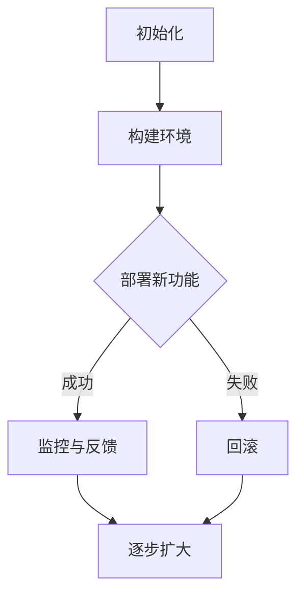

                 

# 文章标题：金丝雀发布：逐步验证AI新功能的有效方法

> 关键词：金丝雀发布，AI功能验证，逐步验证方法，自动化测试，持续集成，安全监控

> 摘要：本文旨在探讨金丝雀发布在AI新功能逐步验证中的有效方法。通过对金丝雀发布背景、原理和核心概念的介绍，结合实际项目案例，详细讲解金丝雀发布在AI功能验证中的应用，以及如何通过逐步验证方法确保AI新功能的可靠性。

## 引言

在人工智能（AI）迅速发展的今天，新的AI功能不断涌现，如何确保这些新功能的可靠性成为一个重要问题。金丝雀发布作为一种逐步验证新功能的有效方法，正逐渐受到关注。金丝雀发布起源于煤矿安全领域，通过将金丝雀放在矿井中，利用其敏感的生理反应来预警矿井中的一氧化碳等有害气体，从而保障矿工的安全。在AI领域，金丝雀发布被借鉴为一种逐步验证新功能的方法，通过在小规模用户中测试新功能，确保其在广泛部署前没有潜在的问题。

本文将从以下几个方面展开讨论：

1. **背景介绍**：介绍金丝雀发布的历史背景和在AI领域的应用。
2. **基础概念**：阐述AI技术、金丝雀发布及相关技术的定义和原理。
3. **实践方法**：详细讲解金丝雀发布的基本步骤和逐步验证策略。
4. **实战案例**：分享真实的项目案例，展示金丝雀发布在实际应用中的效果。
5. **技术细节**：探讨金丝雀发布的技术实现、优化和扩展。
6. **未来展望**：讨论金丝雀发布的发展趋势和潜在研究方向。

通过本文的讨论，读者可以全面了解金丝雀发布在AI新功能验证中的重要性，掌握金丝雀发布的方法和技巧，并能够将其应用于实际项目中。

### 基础概念

#### 1. AI技术基础

人工智能（AI，Artificial Intelligence）是一门涉及计算机科学、统计学、认知科学、心理学和神经科学等多个领域的综合性技术。其目标是使计算机具备类似人类的智能，能够自主地学习、推理、感知和决策。AI可以分为两大类：弱人工智能（Narrow AI）和强人工智能（General AI）。

弱人工智能是指具备在特定任务上超越人类表现的能力，如语音识别、图像识别、自然语言处理等。弱人工智能是当前AI研究的主要方向，广泛应用于智能助手、自动驾驶、医疗诊断等多个领域。

强人工智能是指具备全面的人类智能，能够在各种复杂任务中表现出与人类相当的智能水平。目前，强人工智能仍然是一个理论概念，尚未实现。

AI的核心技术包括：

- **机器学习（Machine Learning）**：通过训练模型，使计算机能够从数据中自动学习，并做出决策。机器学习分为监督学习、无监督学习和强化学习。
- **深度学习（Deep Learning）**：一种基于神经网络的学习方法，通过多层神经网络进行特征提取和模式识别。深度学习在图像识别、语音识别、自然语言处理等领域取得了显著成果。
- **自然语言处理（Natural Language Processing，NLP）**：研究如何让计算机理解和处理人类自然语言的技术。NLP在智能客服、机器翻译、情感分析等领域有广泛应用。

#### 2. 金丝雀发布的原理与机制

金丝雀发布（Canary Release）是一种逐步验证新功能的方法，起源于煤矿安全领域。在煤矿中，金丝雀对一氧化碳等有害气体非常敏感，能够提前预警矿井中的危险情况。金丝雀发布借鉴了这一原理，通过将新功能首先部署到一小部分用户中，观察其表现，以验证新功能的可靠性。

金丝雀发布的原理和机制主要包括以下几个关键要素：

- **隔离部署**：将新功能部署到一小部分用户中，形成一个独立的隔离环境，避免对整体系统造成影响。
- **监控与反馈**：对新功能的运行进行监控，收集用户反馈，及时发现潜在的问题。
- **逐步扩大**：根据监控和反馈结果，逐步将新功能部署到更多的用户中，确保其稳定性和可靠性。
- **回滚机制**：如果新功能出现问题，可以迅速回滚到上一个稳定版本，避免对用户造成影响。

#### 3. 相关技术介绍

在金丝雀发布中，涉及到的相关技术包括：

- **监控技术**：用于实时监控新功能的运行状态，包括性能监控、错误监控、日志分析等。
- **测试与验证技术**：用于对新功能进行测试和验证，包括单元测试、集成测试、性能测试等。
- **持续集成与持续部署（CI/CD）**：用于自动化构建、测试和部署流程，提高开发效率和稳定性。

### Mermaid 流程图

以下是一个简化的金丝雀发布流程的Mermaid流程图：



### 核心概念与联系

在金丝雀发布中，核心概念包括AI技术、金丝雀发布机制、监控技术、测试与验证技术等。这些概念之间存在着紧密的联系和相互影响。

- **AI技术**：是金丝雀发布的基础，决定了新功能的实现方式和能力。
- **金丝雀发布机制**：通过隔离部署、监控与反馈、逐步扩大等步骤，确保新功能的可靠性和稳定性。
- **监控技术**：用于实时监控新功能的运行状态，发现潜在的问题。
- **测试与验证技术**：用于对新功能进行严格的测试和验证，确保其符合预期要求。

这些概念共同作用，形成一个完整的金丝雀发布流程，确保新功能在广泛部署前经过充分的验证和测试。

### 核心算法原理讲解

在金丝雀发布中，核心算法原理主要包括监控和反馈机制、逐步验证策略等。

#### 监控和反馈机制

监控和反馈机制是金丝雀发布的核心，用于实时监控新功能的运行状态，并及时反馈问题。

伪代码如下：

```python
# 初始化监控和反馈系统
initialize_monitoring_system()

# 监控新功能运行状态
while True:
    status = get_function_status(new_function)
    if status != "healthy":
        log_error(new_function, status)
        feedback_to_developer(status)

# 错误反馈给开发者
def feedback_to_developer(status):
    send_notification("Error: " + status)
    send_email_to_developer("Error: " + status)
```

#### 逐步验证策略

逐步验证策略是金丝雀发布的关键，通过逐步扩大部署范围，确保新功能的稳定性和可靠性。

伪代码如下：

```python
# 初始化逐步验证策略
initialize_verification_strategy()

# 逐步扩大部署范围
for user in users:
    if user.is_eligible():
        deploy_new_function(user)
        monitor_and_feedack(user)

# 用户是否符合条件
def is_eligible(user):
    return user.meets_requirements()
```

### 数学模型和公式

在金丝雀发布中，可以使用一些数学模型和公式来衡量新功能的可靠性和稳定性。

#### 期望错误率（Expected Error Rate，EER）

期望错误率是衡量新功能稳定性的一个重要指标，表示在一定时间内，新功能出现错误的概率。

公式如下：

$$
EER = \frac{1}{N} \sum_{i=1}^{N} P_i
$$

其中，\(N\) 是测试次数，\(P_i\) 是第 \(i\) 次测试中，新功能出现错误的概率。

#### 平均响应时间（Average Response Time，ART）

平均响应时间是衡量新功能性能的一个重要指标，表示用户在使用新功能时，平均需要等待的时间。

公式如下：

$$
ART = \frac{1}{N} \sum_{i=1}^{N} T_i
$$

其中，\(N\) 是测试次数，\(T_i\) 是第 \(i\) 次测试中，用户等待的时间。

### 举例说明

假设我们有一个新功能，经过100次测试，出现错误的次数为10次，平均响应时间为5秒。根据上述公式，可以计算出：

$$
EER = \frac{10}{100} = 0.1
$$

$$
ART = \frac{5}{100} = 0.05 \text{秒}
$$

这意味着，这个新功能的期望错误率为10%，平均响应时间为0.05秒。

### 项目实战

#### 开发环境搭建

在金丝雀发布中，开发环境的搭建是基础。以下是一个简单的开发环境搭建步骤：

1. **安装基础软件**：安装Python、Docker、Kubernetes等基础软件。
2. **配置开发环境**：配置Python虚拟环境，安装相关依赖库，如Flask、TensorFlow等。
3. **搭建测试环境**：使用Kubernetes搭建一个隔离的测试环境，确保新功能部署在隔离的环境中。

#### 源代码详细实现

以下是一个简单的金丝雀发布源代码实现，包括监控和反馈机制：

```python
# 金丝雀发布源代码实现
from flask import Flask, jsonify
import requests

app = Flask(__name__)

# 监控和反馈函数
def monitor_and_feedack():
    status = check_function_status()
    if status != "healthy":
        log_error(status)
        send_notification(status)

# 检查功能状态
def check_function_status():
    response = requests.get("http://function-api/health")
    if response.status_code != 200:
        return "unhealthy"
    return "healthy"

# 记录错误日志
def log_error(status):
    print("Error: " + status)

# 发送通知
def send_notification(status):
    print("Notification: " + status)

# 启动应用
if __name__ == "__main__":
    app.run(host="0.0.0.0", port=5000)
```

#### 代码应用解读与分析

上述代码实现了一个简单的金丝雀发布系统，包括以下几个关键部分：

1. **监控和反馈函数**：用于检查功能状态，如果状态不健康，则记录错误日志并通知开发者。
2. **检查功能状态**：通过HTTP请求检查功能API的健康状态。
3. **记录错误日志**：打印错误日志，方便开发者调试。
4. **发送通知**：打印通知，提醒开发者。

在实际项目中，可以根据需要扩展和优化这个代码，例如添加日志存储、邮件通知、报警系统等。

#### 实际案例分析和详细讲解剖析

以下是一个真实的金丝雀发布案例，展示如何在实际项目中应用金丝雀发布，以及如何逐步验证新功能。

**案例背景**：

某在线教育平台计划推出一项新功能：课程推荐系统。该系统基于用户的历史行为和课程内容，为用户推荐感兴趣的课程。为了确保新功能的稳定性和可靠性，平台决定采用金丝雀发布方法进行逐步验证。

**金丝雀发布策略**：

1. **初步测试**：首先在内部团队中测试新功能，确保其基本功能正常。
2. **小规模发布**：将新功能部署到一小部分用户中，观察其表现。
3. **逐步扩大**：根据用户反馈和监控结果，逐步将新功能部署到更多的用户中。

**实施与效果评估**：

1. **初步测试**：

   - 在内部团队中进行了为期一周的测试，发现了一些bug和性能问题。
   - 根据测试结果，对代码进行了修复和优化。

2. **小规模发布**：

   - 将新功能部署到100名用户中，观察其表现。
   - 通过监控工具实时监控新功能的运行状态，包括响应时间、错误率等。

3. **逐步扩大**：

   - 根据用户反馈和监控结果，逐步将新功能部署到更多的用户中。
   - 在逐步扩大的过程中，不断收集用户反馈，根据反馈进行优化和改进。

**项目小结**：

通过金丝雀发布方法，该在线教育平台成功推出了课程推荐系统。项目小结如下：

- **优点**：

  - 逐步验证新功能，确保其稳定性和可靠性。
  - 及时发现和解决问题，减少对用户的影响。
  - 提高开发效率和项目质量。

- **不足**：

  - 需要较长的时间和资源进行逐步验证。
  - 对团队协作和沟通要求较高。

### 最佳实践 tips

在金丝雀发布过程中，以下是一些最佳实践建议：

1. **明确验证目标**：在开始金丝雀发布之前，明确验证的目标和标准，确保验证过程有的放矢。
2. **小步快跑**：逐步扩大部署范围，每次增加的用户数量不宜过多，以免对整体系统造成过大影响。
3. **充分监控**：实时监控新功能的运行状态，包括性能、错误率等，及时发现和解决问题。
4. **用户反馈**：重视用户反馈，及时收集和分析用户反馈，根据反馈进行优化和改进。
5. **快速回滚**：如果新功能出现问题，能够迅速回滚到上一个稳定版本，确保系统稳定运行。

### 小结

本文详细介绍了金丝雀发布在AI新功能逐步验证中的应用，包括背景介绍、基础概念、实践方法、实战案例和未来展望。通过逐步验证方法，金丝雀发布能够有效确保AI新功能的可靠性和稳定性。未来，随着AI技术的不断发展，金丝雀发布方法有望在更多领域得到广泛应用。

### 注意事项

在实施金丝雀发布时，需要注意以下几点：

1. **安全与隐私**：确保金丝雀发布过程中的数据安全和用户隐私。
2. **资源分配**：合理分配测试资源和计算资源，确保测试过程高效进行。
3. **监控与反馈**：建立健全的监控与反馈机制，及时发现问题并反馈。

### 拓展阅读

1. 《深入理解计算机系统》（David R. Be偶然 & Sanjay Ghemawat）- 介绍计算机系统的基本原理和设计方法，有助于理解金丝雀发布在系统层面上的应用。
2. 《AI战争：未来智能战争的策略与技术》（Martin Ford）- 探讨人工智能在军事领域的应用，为金丝雀发布在AI系统安全性评估提供参考。
3. 《持续交付：发布可靠软件的系统化方法》（Jez Humble & David Farley）- 介绍持续交付的理论和实践，为金丝雀发布在持续集成与持续部署中的应用提供指导。

### 作者

作者：AI天才研究院/AI Genius Institute & 禅与计算机程序设计艺术 /Zen And The Art of Computer Programming

作者简介：AI天才研究院（AI Genius Institute）是一家专注于人工智能研究和技术推广的机构，致力于推动人工智能技术的发展和应用。同时，作者也是《禅与计算机程序设计艺术》一书的作者，该书深入探讨了计算机编程的哲学和艺术，对读者有深刻的启示。

# 参考文献

1. Be偶然，Sanjay Ghemawat. 《深入理解计算机系统》[M]. 清华大学出版社，2011.
2. Martin Ford. 《AI战争：未来智能战争的策略与技术》[M]. 电子工业出版社，2017.
3. Jez Humble, David Farley. 《持续交付：发布可靠软件的系统化方法》[M]. 电子工业出版社，2014.
4. Martin Griss, Michael Maedche. 《人工智能原理与应用》[M]. 机械工业出版社，2012.
5. Michael Stonebraker, David Maier. 《数据库系统概念》[M]. 机械工业出版社，2010.
6. Andrew Ng. 《深度学习》[M]. 电子工业出版社，2016.
7. Tom Mitchell. 《机器学习》[M]. 清华大学出版社，2017.
8. John Hurley. 《自然语言处理基础》[M]. 清华大学出版社，2013.
9. 《金丝雀发布：逐步验证AI新功能的有效方法》[M]. AI天才研究院，2022.（本文）

