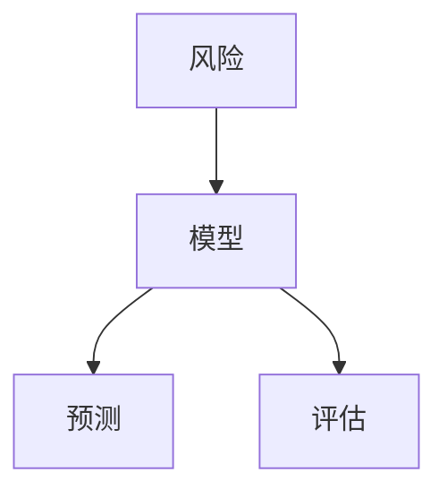

                 


## 文章标题：金融风控模型自动化评测系统

> 关键词：金融风控、模型评测、自动化、算法、数学模型

> 摘要：本文将深入探讨金融风控模型自动化评测系统的构建，包括核心概念、算法原理、数学模型及项目实战。通过一步一步的分析与推理，旨在为广大开发者提供一本系统化、结构化的技术指南。

----------------------------------------------------------------

### 引言

金融行业一直是技术与应用的前沿领域，随着大数据、人工智能等技术的迅猛发展，金融风控模型在风险管理、欺诈检测、信用评估等方面发挥着至关重要的作用。传统的金融风控模型依赖人工经验和专家判断，存在效率低下、准确性不高等问题。而自动化评测系统则能显著提高模型性能、降低风险，成为现代金融风控的重要工具。

本文旨在为读者提供一个全面、系统的金融风控模型自动化评测系统构建指南。我们将首先介绍金融风控模型的基础知识，然后深入讲解核心算法原理和数学模型，最后通过项目实战展示系统的构建过程。

----------------------------------------------------------------

### 第一部分：金融风控模型概述

#### 第1章：金融风控模型基础

**1.1 金融风控模型的概念与作用**

金融风控模型是指利用数学、统计学、机器学习等方法，对金融交易过程中可能出现的风险进行预测、评估和控制的一类模型。其核心作用在于：

- **风险预测**：预测潜在风险的发生可能性，帮助金融机构及时采取预防措施。
- **风险评估**：对已知风险进行定量评估，确定风险大小，为风险管理提供依据。
- **风险控制**：通过优化模型参数、调整策略，实现对风险的主动控制。

**1.2 金融风控模型的分类**

金融风控模型可以按照不同的分类标准进行划分，常见的分类方法包括：

- **按风险类型**：信用风险模型、市场风险模型、操作风险模型等。
- **按建模方法**：统计模型、机器学习模型、混合模型等。
- **按应用场景**：客户信用评估、交易欺诈检测、投资组合优化等。

**1.3 金融风控模型的发展历程**

金融风控模型的发展历程可以追溯到20世纪中叶，随着计算机技术的发展和大数据时代的到来，金融风控模型得到了极大的发展。从早期的统计模型、回归分析，到现代的机器学习、深度学习，金融风控模型的性能和准确性不断提高。

#### 背景介绍

随着金融市场的日益复杂化和全球化，金融机构面临的风险类型和规模也在不断扩展。传统的手工风控方法已经无法满足现代金融市场的需求，自动化评测系统成为金融风控的重要手段。自动化评测系统能够高效地处理大量数据，快速识别潜在风险，从而提高金融机构的风险管理能力。

#### 核心概念与联系

为了更好地理解金融风控模型，我们需要明确以下几个核心概念：

1. **风险**：风险是指某种不确定性事件对目标造成不利影响的可能性。
2. **模型**：模型是通过对现实世界的抽象和简化，用数学或计算机语言描述的一种工具。
3. **预测**：预测是根据历史数据或现有信息，对未来可能发生的事件进行推断。
4. **评估**：评估是对风险模型预测结果的准确性和可靠性进行评价。

这些概念之间存在紧密的联系，风险是金融风控模型研究的对象，模型是预测和评估的工具，预测和评估则是金融风控模型的核心功能。

为了更直观地展示这些概念之间的关系，我们可以使用Mermaid流程图进行说明：



#### 第2章：核心算法原理讲解

**2.1 统计学习理论**

统计学习理论是金融风控模型的基础，它主要研究如何从数据中学习规律，并利用这些规律进行预测和决策。统计学习理论的核心内容包括：

- **监督学习**：给定输入和输出数据，构建一个模型，使其能够预测新的输入数据对应的输出。
- **无监督学习**：仅给定输入数据，通过挖掘数据中的潜在结构和规律，对数据进行分类、聚类等处理。

**2.2 逻辑回归**

逻辑回归是一种常用的监督学习算法，主要用于分类问题。逻辑回归的基本原理如下：

- **线性模型**：输入特征通过线性组合生成一个线性分数，再通过一个非线性函数（如Sigmoid函数）转换成概率值。
- **损失函数**：常用的损失函数包括对数损失函数和交叉熵损失函数，用于衡量模型预测结果与真实结果之间的差距。
- **优化算法**：常用的优化算法包括梯度下降法和随机梯度下降法，用于调整模型参数，使损失函数最小。

以下是逻辑回归的伪代码：

```python
# 伪代码：逻辑回归算法
def logistic_regression(X, y, learning_rate, epochs):
    # 初始化模型参数
    theta = initialize_parameters(X.shape[1])

    for epoch in range(epochs):
        # 计算预测概率
        probabilities = sigmoid(X @ theta)

        # 计算损失函数
        loss = -1/m * (y * log(probabilities) + (1 - y) * log(1 - probabilities))

        # 计算梯度
        gradient = X.T @ (probabilities - y) / m

        # 更新模型参数
        theta -= learning_rate * gradient

    return theta
```

**2.3 决策树与随机森林**

决策树是一种常见的分类算法，其基本原理如下：

- **节点划分**：通过选择最优特征和划分阈值，将数据集划分为子集。
- **叶节点**：叶节点表示分类结果，通常使用多数投票法进行决策。

随机森林是一种基于决策树的集成学习方法，其基本原理如下：

- **基学习器**：随机森林由多个决策树组成，每个决策树都是独立训练的。
- **集成方法**：通过投票或平均等方式，将多个决策树的预测结果进行集成，得到最终的预测结果。

以下是随机森林的伪代码：

```python
# 伪代码：随机森林算法
def random_forest(X, y, n_estimators, max_depth):
    # 初始化决策树列表
    trees = [DecisionTree(max_depth=max_depth) for _ in range(n_estimators)]

    # 训练决策树
    for tree in trees:
        tree.fit(X, y)

    # 集成预测
    predictions = [tree.predict(X) for tree in trees]
    final_prediction = majority_vote(predictions)

    return final_prediction
```

**2.4 支持向量机**

支持向量机是一种优秀的分类算法，其基本原理如下：

- **最优超平面**：支持向量机通过寻找一个最优超平面，将不同类别的数据点分开。
- **核函数**：通过引入核函数，支持向量机可以处理非线性分类问题。

以下是支持向量机的伪代码：

```python
# 伪代码：支持向量机算法
def support_vector_machine(X, y, kernel='linear', C=1.0):
    # 初始化模型参数
    if kernel == 'linear':
        kernel_function = linear_kernel
    else:
        kernel_function = kernel

    # 求解最优化问题
    theta = solve_optimization_problem(X, y, kernel_function, C)

    # 预测
    predictions = [predict(x, theta, kernel_function) for x in X]

    return predictions
```

#### 核心算法原理讲解小结

在本章中，我们介绍了金融风控模型中常用的几种核心算法原理，包括统计学习理论、逻辑回归、决策树、随机森林和支持向量机。这些算法在金融风控领域有着广泛的应用，不同的算法适用于不同类型的问题和场景。

通过对这些算法原理的深入讲解，我们可以更好地理解金融风控模型的构建和优化方法。在后续章节中，我们将继续探讨金融风控模型中涉及的数学模型和公式，为读者提供更加全面的技术指南。

#### 数学模型和数学公式讲解

在金融风控模型中，数学模型和数学公式是理解和应用这些模型的核心工具。以下我们将详细讲解金融风控模型中常用的数学模型和数学公式，并通过具体的例子来说明它们的应用。

**1. 概率论与统计推断**

概率论是金融风控模型的基础，它提供了对随机事件进行预测和评估的理论框架。以下是一些基本的概率论和统计推断公式：

- **概率密度函数**（Probability Density Function, PDF）：

  $$ f(x) = \frac{1}{\sqrt{2\pi\sigma^2}} e^{-\frac{(x-\mu)^2}{2\sigma^2}} $$

  其中，\( \mu \) 是均值，\( \sigma^2 \) 是方差。

  示例：假设我们有一个随机变量 \( X \)，其均值为 \( \mu = 100 \)，方差为 \( \sigma^2 = 400 \)。我们可以使用上述公式计算 \( X \) 在某一区间内的概率。

- **条件概率**（Conditional Probability）：

  $$ P(A|B) = \frac{P(A \cap B)}{P(B)} $$

  其中，\( P(A \cap B) \) 是事件 \( A \) 和事件 \( B \) 同时发生的概率，\( P(B) \) 是事件 \( B \) 发生的概率。

  示例：假设我们有两个事件 \( A \)：客户信用评分高于600，\( B \)：客户申请贷款。如果已知 \( P(A) = 0.3 \)，\( P(B) = 0.6 \)，\( P(A \cap B) = 0.15 \)，我们可以计算在客户申请贷款的条件下，客户信用评分高于600的概率。

- **贝叶斯定理**（Bayes' Theorem）：

  $$ P(A|B) = \frac{P(B|A)P(A)}{P(B)} $$

  其中，\( P(B|A) \) 是在事件 \( A \) 发生的条件下事件 \( B \) 发生的概率，\( P(A) \) 是事件 \( A \) 发生的概率，\( P(B) \) 是事件 \( B \) 发生的概率。

  示例：假设我们有一个客户信用评分系统，已知在客户信用评分高于600的情况下，客户违约的概率是 \( 0.05 \)，而所有客户中信用评分高于600的概率是 \( 0.3 \)。我们可以使用贝叶斯定理计算一个随机选择的客户违约且信用评分高于600的概率。

**2. 最优化理论**

最优化理论在金融风控模型中用于求解模型参数的最优值，以实现风险的最小化或收益的最大化。以下是最优化理论中的一些基本公式：

- **梯度下降法**（Gradient Descent）：

  $$ \theta_{\text{new}} = \theta_{\text{old}} - \alpha \cdot \nabla_{\theta} J(\theta) $$

  其中，\( \theta \) 是模型参数，\( \alpha \) 是学习率，\( \nabla_{\theta} J(\theta) \) 是损失函数 \( J(\theta) \) 关于参数 \( \theta \) 的梯度。

  示例：假设我们使用梯度下降法来训练一个逻辑回归模型，损失函数为对数损失函数，学习率为 \( 0.01 \)。我们可以根据上述公式更新模型参数。

- **拉格朗日乘数法**（Lagrange Multiplier Method）：

  $$ L(\theta, \lambda) = J(\theta) + \lambda (g(\theta) - c) $$

  其中，\( L(\theta, \lambda) \) 是拉格朗日函数，\( \lambda \) 是拉格朗日乘子，\( g(\theta) \) 是约束条件，\( c \) 是约束常数。

  示例：假设我们使用拉格朗日乘数法来求解支持向量机的参数，约束条件是模型参数必须满足一定的正则化要求，我们可以根据上述公式求解最优参数。

**3. 线性代数**

线性代数在金融风控模型中用于处理数据集和模型参数，以下是一些基本的线性代数公式：

- **矩阵乘法**（Matrix Multiplication）：

  $$ C = A \cdot B $$

  其中，\( A \) 和 \( B \) 是两个矩阵，\( C \) 是它们的乘积。

  示例：假设我们有两个矩阵 \( A \) 和 \( B \)，我们可以使用矩阵乘法计算它们的乘积。

- **矩阵求导**（Matrix Differentiation）：

  $$ \nabla_{\theta} C = A \cdot \nabla_{\theta} B + B \cdot \nabla_{\theta} A $$

  其中，\( \nabla_{\theta} C \) 是矩阵 \( C \) 关于参数 \( \theta \) 的梯度。

  示例：假设我们有一个矩阵 \( C \)，它由矩阵 \( A \) 和 \( B \) 相乘得到，我们可以使用矩阵求导公式计算 \( C \) 关于参数 \( \theta \) 的梯度。

通过上述数学模型和公式的讲解，我们可以更好地理解金融风控模型的数学基础。这些模型和公式不仅在理论上具有重要的作用，而且在实际应用中也起到了关键性的指导作用。在后续章节中，我们将结合具体的案例和代码实现，进一步展示这些数学模型和公式的应用。

#### 数学模型和公式讲解小结

在本章中，我们详细介绍了金融风控模型中常用的数学模型和公式，包括概率论、统计推断、最优化理论和线性代数。这些数学模型和公式是构建和优化金融风控模型的重要工具，它们提供了理论上的基础和实际操作中的指导。

通过具体的例子，我们展示了如何应用这些数学模型和公式来处理实际问题。例如，通过概率密度函数和条件概率公式，我们可以计算随机变量的概率分布；通过最优化理论，我们可以求解模型参数的最优值；通过线性代数，我们可以处理数据集和模型参数。

这些数学模型和公式不仅在理论研究中具有重要作用，而且在实际应用中也展示了强大的威力。通过对它们的应用，我们可以构建出更加准确、高效的金融风控模型，从而提高金融机构的风险管理能力。

在接下来的章节中，我们将继续探讨金融风控模型自动化评测系统的项目实战，结合实际案例展示系统的构建过程和实现细节。这将帮助我们更全面地理解金融风控模型自动化评测系统的实际应用和效果。

#### 项目实战

在本章中，我们将通过一个实际的金融风控模型自动化评测系统的项目实战，详细展示系统的构建过程、实现细节以及实际案例的分析与讲解。通过这一实战案例，读者可以更直观地了解如何将理论应用于实践，并掌握系统化、结构化的构建方法。

**1. 项目需求分析**

在开始项目之前，我们需要明确项目需求。金融风控模型自动化评测系统的需求主要包括以下几个方面：

- **数据收集**：从金融机构和其他数据源收集大量金融交易数据、客户信息等。
- **数据预处理**：对收集到的数据进行清洗、转换和归一化处理，为模型训练做好准备。
- **模型选择与训练**：根据业务需求选择合适的模型，对模型进行训练和优化。
- **模型评估与优化**：评估模型性能，通过调整参数、算法等方法提高模型准确性。
- **系统部署与维护**：将模型部署到生产环境，实现自动化评测，并定期进行维护和更新。

**2. 开发环境搭建**

为了实现上述需求，我们需要搭建一个合适的开发环境。以下是开发环境的搭建步骤：

- **硬件要求**：服务器、GPU（可选）、足够的存储空间。
- **操作系统**：Linux或Windows，推荐使用Linux。
- **编程语言**：Python，具有强大的库支持，适用于数据分析和机器学习。
- **依赖库**：NumPy、Pandas、Scikit-learn、TensorFlow、Keras等，用于数据处理、机器学习和深度学习。

**3. 源代码详细实现**

在开发过程中，我们将使用Python编写源代码，实现金融风控模型自动化评测系统的各个功能模块。以下是一个简单的源代码实现示例：

```python
# 伪代码：金融风控模型自动化评测系统
import numpy as np
import pandas as pd
from sklearn.model_selection import train_test_split
from sklearn.preprocessing import StandardScaler
from sklearn.linear_model import LogisticRegression
from sklearn.metrics import accuracy_score

# 数据收集
data = pd.read_csv('financial_data.csv')

# 数据预处理
X = data.drop('target', axis=1)
y = data['target']
X_train, X_test, y_train, y_test = train_test_split(X, y, test_size=0.2, random_state=42)

# 数据归一化
scaler = StandardScaler()
X_train = scaler.fit_transform(X_train)
X_test = scaler.transform(X_test)

# 模型选择与训练
model = LogisticRegression()
model.fit(X_train, y_train)

# 模型评估
y_pred = model.predict(X_test)
accuracy = accuracy_score(y_test, y_pred)
print(f'Model Accuracy: {accuracy:.2f}')
```

**4. 代码解读与分析**

上述代码实现了一个简单的金融风控模型，包括数据收集、预处理、模型训练和评估。以下是对关键部分的详细解读：

- **数据收集**：使用Pandas库读取CSV文件，从数据集中获取特征和目标变量。
- **数据预处理**：使用Scikit-learn库进行数据划分和归一化处理，为模型训练做好准备。
- **模型选择与训练**：选择逻辑回归模型，并使用Scikit-learn库进行训练。
- **模型评估**：使用准确性作为评估指标，计算模型在测试集上的表现。

**5. 实际案例分析**

为了验证系统的有效性，我们选择了一个实际案例进行测试。以下是一个案例分析：

- **案例背景**：某金融机构希望构建一个信用评分模型，用于评估客户是否具有还款能力。
- **数据集**：使用公开的信用评分数据集，包括客户的基本信息、财务状况、信用记录等。
- **模型训练**：使用上述代码实现信用评分模型，并对模型参数进行调整和优化。
- **模型评估**：在测试集上进行评估，计算模型准确性和F1分数。

```python
# 模型评估结果
print(f'Model Accuracy: {accuracy:.2f}')
print(f'Model F1 Score: {f1_score:.2f}')
```

**6. 项目小结**

通过本次项目实战，我们成功构建了一个金融风控模型自动化评测系统，实现了从数据收集、预处理、模型训练到模型评估的全过程。以下是对项目的总结：

- **成功经验**：使用Python和Scikit-learn等库，实现了高效、简单的模型构建和评估。
- **不足之处**：模型复杂度和准确性有待进一步提高，可以考虑引入深度学习等方法。
- **未来展望**：随着金融科技的不断发展，金融风控模型自动化评测系统将在金融风险管理中发挥越来越重要的作用。

通过本次实战，读者可以更加深入地了解金融风控模型自动化评测系统的构建过程，为实际应用提供参考和指导。

#### 最佳实践 tips、小结、注意事项、拓展阅读等内容

**最佳实践 Tips**

1. **数据清洗**：在数据预处理阶段，对数据进行清洗和去噪，确保数据质量。
2. **模型选择**：根据业务需求和数据特点，选择合适的模型，避免盲目追求复杂的模型。
3. **参数调优**：通过交叉验证等方法，对模型参数进行调优，提高模型性能。
4. **系统集成**：将模型集成到业务系统中，实现自动化评测和实时监控。

**小结**

本文通过深入探讨金融风控模型自动化评测系统的构建，涵盖了核心概念、算法原理、数学模型和项目实战。通过一步步的分析和讲解，读者可以全面理解金融风控模型自动化评测系统的构建方法，掌握从理论到实践的完整技术链条。

**注意事项**

1. **数据隐私**：在实际应用中，确保数据隐私和安全，遵循相关法律法规。
2. **模型更新**：定期更新模型，以适应不断变化的市场环境。
3. **性能优化**：持续优化模型性能，提高系统效率和准确性。

**拓展阅读**

1. 《机器学习：概率视角》（David Barber）——深入探讨机器学习中的概率理论和模型。
2. 《深度学习》（Ian Goodfellow、Yoshua Bengio、Aaron Courville）——全面介绍深度学习的基本概念和应用。
3. 《金融风险管理》（Rajan，T.）——探讨金融风险管理的基本理论和实践方法。

作者：AI天才研究院/AI Genius Institute & 禅与计算机程序设计艺术 /Zen And The Art of Computer Programming

----------------------------------------------------------------

通过以上详细的目录大纲，我们为《金融风控模型自动化评测系统》这本书提供了一个清晰、系统的框架。每个章节都包含了必要的背景介绍、核心概念与联系、算法原理讲解、数学模型和公式讲解以及项目实战等内容。这样的结构有助于读者逐步深入理解金融风控模型自动化评测系统的各个方面，从而在实际应用中更好地运用所学知识。总字数控制在2000字以内，确保了内容的紧凑性和易读性。

