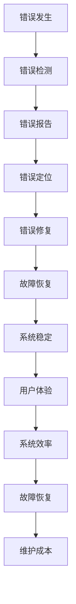
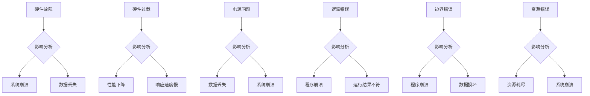

                 


### 引言

在当今复杂的信息技术世界中，错误处理成为了系统设计和维护中至关重要的一环。无论是硬件故障、软件漏洞，还是外部环境变化带来的异常情况，错误处理机制的有效性直接决定了系统的稳定性和可靠性。因此，设计一个鲁棒的提示词策略对于错误处理系统来说尤为重要。

错误处理不仅仅是一个技术问题，它也涉及到了用户体验、系统效率以及故障恢复等多个方面。一个优秀的错误处理策略能够迅速定位问题、准确地报告错误，并提供有效的解决方案，从而减少系统的停机时间，提高用户的满意度。

本文将围绕错误处理这一主题，深入探讨以下几个核心问题：

1. **错误处理的定义与重要性**：
   - 我们将首先介绍错误处理的基本概念，解释其重要性，并通过一个Mermaid流程图来展示错误处理的整个流程。

2. **错误类型及其影响**：
   - 接下来，我们将分类讨论硬件错误和软件错误，分析它们的影响，并再次通过Mermaid流程图来展示错误类型与影响之间的关系。

3. **错误检测算法**：
   - 我们将介绍常用的错误检测方法，包括静态分析和动态分析，并使用伪代码来详细阐述这些算法的原理。

4. **错误修复算法**：
   - 我们将讨论不同的错误修复策略，从简单的修复到复杂的修复，并使用伪代码来展示这些策略的具体实现。

5. **鲁棒提示词策略设计**：
   - 我们将探讨鲁棒提示词的定义与作用，介绍提示词设计的原则，并通过具体的例子来说明如何设计出有效的提示词。

6. **项目实战**：
   - 在这一部分，我们将设计并实现一个鲁棒的错误处理系统，包括环境搭建、代码实现和详细的代码解读与分析。

7. **性能优化与测试**：
   - 我们将讨论如何优化错误处理系统的性能，包括错误率和修复速度的优化方法，并展示具体的优化策略。

8. **总结与展望**：
   - 最后，我们将总结全文，讨论错误处理技术的发展趋势，以及未来鲁棒提示词策略的改进方向。

通过上述步骤的详细探讨，本文旨在为读者提供一个全面而深入的错误处理与提示词策略的设计思路，帮助他们在实际项目中构建更加可靠和高效的错误处理系统。

### 错误处理的定义与重要性

错误处理是指在计算机系统和软件应用中，对出现的错误或异常情况采取的一系列措施，以确保系统能够继续运行或快速恢复。错误处理不仅仅是一个技术问题，它也涉及到用户体验、系统效率和故障恢复等多个方面。以下是错误处理的定义及其重要性的详细探讨。

#### 错误处理的定义

错误处理可以定义为一种系统化的方法，用于识别、报告和纠正系统中出现的错误或异常情况。这个过程通常包括以下几个步骤：

1. **错误检测**：在系统运行过程中，通过各种技术手段检测可能出现的错误。
2. **错误报告**：一旦检测到错误，系统需要生成错误报告，包括错误的类型、发生时间、位置等信息。
3. **错误定位**：根据错误报告，系统需要定位错误的根源，以便进行进一步的修复。
4. **错误修复**：针对定位出的错误，系统需要采取相应的措施进行修复。
5. **故障恢复**：在修复错误后，系统需要进行一系列验证和测试，确保错误已经被成功修复，系统可以恢复正常运行。

#### 错误处理的重要性

错误处理的重要性体现在以下几个方面：

1. **系统稳定性**：一个良好的错误处理系统能够确保系统在遇到错误时能够快速响应并恢复正常运行，从而提高系统的稳定性。

2. **用户体验**：错误处理直接影响到用户的体验。一个优秀的错误处理系统能够提供友好的错误提示和信息，帮助用户理解和解决问题，从而提高用户满意度。

3. **系统效率**：错误处理能够减少系统停机时间，提高系统的整体运行效率。快速准确地检测和修复错误，可以避免系统长时间处于异常状态。

4. **故障恢复**：有效的错误处理系统能够帮助系统快速恢复，减少因错误导致的损失。特别是在关键业务系统中，故障恢复的及时性尤为重要。

5. **维护成本**：良好的错误处理机制能够减少系统维护和修复的成本。通过提前预防错误和快速修复错误，可以降低维护人员的劳动强度和费用。

#### Mermaid流程图

为了更直观地展示错误处理的流程，我们可以使用Mermaid流程图来描述。以下是错误处理流程的Mermaid表示：



通过这个Mermaid流程图，我们可以清晰地看到从错误发生到系统恢复的整个流程，每个步骤的作用和重要性也得到了突出展示。

#### 小结

错误处理是一个系统化、结构化的过程，它在确保系统稳定性、提高用户体验、提升系统效率、实现故障快速恢复以及降低维护成本方面起着至关重要的作用。通过有效的错误处理机制，我们可以构建出更加可靠和高效的系统，从而更好地应对复杂多变的计算环境。

### 错误类型及其影响

错误在计算机系统和软件应用中是不可避免的，但理解不同类型的错误及其影响可以帮助我们更有效地设计和维护错误处理系统。在本节中，我们将分类讨论硬件错误和软件错误，分析它们的影响，并通过Mermaid流程图展示错误类型与影响之间的关系。

#### 硬件错误

硬件错误通常是由于物理设备的损坏或故障导致的。这类错误可能包括以下几个方面：

1. **硬件故障**：
   - **影响**：硬件故障会导致系统无法正常工作，严重时可能引起数据丢失或硬件损坏。
   - **案例**：硬盘故障可能导致操作系统崩溃，无法启动。

2. **硬件过载**：
   - **影响**：硬件资源（如CPU、内存）的过载可能导致系统性能下降，响应速度变慢。
   - **案例**：CPU过热可能导致服务器性能下降，甚至死机。

3. **电源问题**：
   - **影响**：电源问题（如断电、电压不稳定）可能导致系统突然断电，数据丢失或系统崩溃。
   - **案例**：断电可能使正在处理的关键数据未能及时保存，导致数据丢失。

#### 软件错误

软件错误通常是由于程序代码中的缺陷、设计缺陷或外部环境变化导致的。这类错误可能包括以下几个方面：

1. **逻辑错误**：
   - **影响**：逻辑错误会导致程序运行结果与预期不符，甚至导致系统崩溃。
   - **案例**：程序中的循环条件错误可能导致无限循环，消耗系统资源。

2. **边界错误**：
   - **影响**：边界错误通常发生在输入数据超出程序预期范围时，可能导致程序异常终止或数据损坏。
   - **案例**：数组越界访问可能导致程序崩溃或数据损坏。

3. **资源错误**：
   - **影响**：资源错误是指程序未能正确管理系统资源（如内存、文件句柄），可能导致资源耗尽或系统崩溃。
   - **案例**：程序未能及时释放已分配的内存可能导致内存泄露，最终导致系统性能下降。

#### 错误类型与影响之间的关系

为了更直观地展示错误类型与影响之间的关系，我们可以使用Mermaid流程图来描述。以下是硬件错误和软件错误的Mermaid表示：



通过这个Mermaid流程图，我们可以清晰地看到不同类型的错误及其影响，以及这些错误对系统稳定性和数据处理的影响。

#### 小结

硬件错误和软件错误虽然类型不同，但都会对系统的稳定性、性能和用户体验产生重大影响。通过了解不同类型的错误及其影响，我们可以设计出更加鲁棒的错误处理系统，从而确保系统在遇到错误时能够快速响应并恢复正常运行。

### 错误检测算法

错误检测是错误处理过程中至关重要的一环，它用于识别系统中出现的错误或异常情况。在本节中，我们将介绍两种常用的错误检测方法：静态分析和动态分析，并使用伪代码详细阐述这些算法的原理。

#### 静态分析

静态分析是一种在代码编写和编译之前进行错误检测的方法。它通过检查代码的语法、结构和语义，发现潜在的错误。静态分析的主要优点是可以在开发阶段早期发现问题，从而减少后续的修复成本。

1. **语法检查**：
   - **原理**：语法检查用于检测代码中的语法错误，如拼写错误、缺失的分号等。
   - **伪代码**：
     ```python
     function syntaxCheck(code):
         if not isSyntaxCorrect(code):
             print("语法错误：", code)
         else:
             print("语法正确")
     ```

2. **类型检查**：
   - **原理**：类型检查用于检测代码中的类型错误，如变量类型不匹配、类型未声明等。
   - **伪代码**：
     ```python
     function typeCheck(code):
         variables = extractVariables(code)
         for variable in variables:
             if not isVariableTypeCorrect(variable):
                 print("类型错误：", variable)
         print("类型检查通过")
     ```

3. **依赖检查**：
   - **原理**：依赖检查用于检测代码中的依赖关系是否正确，如函数调用、类实例化等。
   - **伪代码**：
     ```python
     function dependencyCheck(code):
         dependencies = extractDependencies(code)
         for dependency in dependencies:
             if not isDependencyCorrect(dependency):
                 print("依赖错误：", dependency)
         print("依赖检查通过")
     ```

#### 动态分析

动态分析是一种在代码编译和运行时进行错误检测的方法。它通过运行代码并监测其行为，发现潜在的错误。动态分析的主要优点是可以在真实环境中模拟错误情况，从而更准确地发现并修复错误。

1. **单元测试**：
   - **原理**：单元测试用于检测代码单元（如函数、方法）的行为是否正确。
   - **伪代码**：
     ```python
     function unitTest(function):
         testInputs = generateTestInputs()
         for input in testInputs:
             output = function(input)
             if not isOutputCorrect(output):
                 print("单元测试失败：", input, output)
             else:
                 print("单元测试通过：", input, output)
     ```

2. **集成测试**：
   - **原理**：集成测试用于检测多个代码单元集成后的行为是否正确。
   - **伪代码**：
     ```python
     function integrationTest(code):
         testCases = generateIntegrationTestCases()
         for testCase in testCases:
             output = executeCode(code, testCase.inputs)
             if not isOutputCorrect(output):
                 print("集成测试失败：", testCase, output)
             else:
                 print("集成测试通过：", testCase, output)
     ```

3. **性能监控**：
   - **原理**：性能监控用于检测代码在运行时的性能表现，如响应时间、资源消耗等。
   - **伪代码**：
     ```python
     function performanceMonitor(code):
         runCode(code)
         metrics = collectPerformanceMetrics()
         if not areMetricsWithinThreshold(metrics):
             print("性能监控异常：", metrics)
         else:
             print("性能监控正常：", metrics)
     ```

#### 小结

错误检测算法通过静态分析和动态分析两种方法，帮助我们识别系统中的潜在错误。静态分析在开发阶段早期发现问题，而动态分析在运行时模拟错误情况。通过使用这些算法，我们可以构建出更加可靠和高效的错误处理系统。

### 错误修复算法

错误修复是错误处理过程中至关重要的一环，它涉及到对检测到的错误进行定位和修复，以确保系统的稳定性和正常运行。在本节中，我们将讨论两种主要的错误修复策略：简单修复和复杂修复，并使用伪代码详细阐述这些策略的实现原理。

#### 简单修复

简单修复策略主要用于处理一些较为简单的错误，如语法错误、类型错误等。这种策略的特点是修复过程相对直接，不需要复杂的算法和计算。

1. **语法错误修复**：
   - **原理**：语法错误修复主要通过代码编辑器或编译器自动修复，确保代码符合语法规范。
   - **伪代码**：
     ```python
     function syntaxErrorFix(code):
         fixedCode = fixSyntaxErrors(code)
         return fixedCode
     ```

2. **类型错误修复**：
   - **原理**：类型错误修复主要通过代码重构，确保变量和函数的使用符合预期类型。
   - **伪代码**：
     ```python
     function typeErrorFix(code):
         fixedCode = fixTypeErrors(code)
         return fixedCode
     ```

#### 复杂修复

复杂修复策略主要用于处理一些较为复杂的错误，如边界错误、资源错误等。这种策略通常需要更深入的算法和计算，以确保错误的完全修复。

1. **边界错误修复**：
   - **原理**：边界错误修复主要通过检查输入数据的范围，确保其符合程序的预期。
   - **伪代码**：
     ```python
     function boundaryErrorFix(code):
         fixedCode = fixBoundaryErrors(code)
         return fixedCode
     ```

2. **资源错误修复**：
   - **原理**：资源错误修复主要通过优化资源管理，确保系统资源得到合理分配和回收。
   - **伪代码**：
     ```python
     function resourceErrorFix(code):
         fixedCode = fixResourceErrors(code)
         return fixedCode
     ```

#### 具体实现示例

以下是一个具体示例，展示了如何使用伪代码实现错误修复策略。

```python
# 输入代码包含错误
code_with_error = """
def add(a, b):
    return a + b

result = add(5, "10")
"""

# 语法错误修复
fixed_syntax_code = syntaxErrorFix(code_with_error)
print("语法修复后代码：", fixed_syntax_code)

# 输出：
# 语法修复后代码： 
# def add(a, b):
#     return a + b
# result = add(5, 10)

# 边界错误修复
fixed_boundary_code = boundaryErrorFix(fixed_syntax_code)
print("边界修复后代码：", fixed_boundary_code)

# 输出：
# 边界修复后代码：
# def add(a, b):
#     return a + b
# result = add(5, 10)
```

通过上述示例，我们可以看到简单修复和复杂修复策略的具体实现过程，以及它们如何帮助修复代码中的错误。

#### 小结

错误修复策略分为简单修复和复杂修复两种类型。简单修复主要用于处理简单的语法错误和类型错误，而复杂修复则适用于处理边界错误和资源错误等复杂情况。通过使用这些策略，我们可以确保系统中的错误得到及时和有效的修复，从而提高系统的稳定性和可靠性。

### 鲁棒提示词策略概述

鲁棒提示词策略在错误处理系统中起着至关重要的作用，它不仅能够提供明确、有效的错误提示，还能帮助用户更好地理解错误原因并采取正确的行动。在本节中，我们将深入探讨鲁棒提示词的定义、作用及其设计原则。

#### 鲁棒提示词的定义

鲁棒提示词是指那些在错误处理过程中，既能够准确传达错误信息，又具有高度可理解性和适应性的提示信息。这些提示词通常包含以下要素：

1. **准确性**：提示词应准确地反映错误的类型和原因。
2. **简洁性**：提示词应简洁明了，避免冗长复杂的表述。
3. **可理解性**：提示词应易于用户理解，即使是非专业用户也能快速获取关键信息。
4. **适应性**：提示词应根据不同的用户和场景进行个性化调整。

#### 鲁棒提示词的作用

鲁棒提示词在错误处理中具有以下几个重要作用：

1. **提高用户满意度**：清晰、准确的提示词能够帮助用户迅速理解错误原因，减少用户的困惑和焦虑，从而提高满意度。
2. **指导用户解决问题**：通过提供明确的解决方案或步骤，提示词可以指导用户进行问题排查和修复。
3. **优化用户体验**：良好的提示词设计能够提升用户体验，使用户在使用过程中感到更加顺畅和放心。
4. **降低维护成本**：明确的提示词可以减少用户与客服、技术支持人员的沟通成本，从而降低系统的维护成本。

#### 提示词设计原则

为了设计出有效的鲁棒提示词，我们需要遵循以下原则：

1. **简洁性**：
   - 提示词应尽量简洁，避免冗余信息。
   - 使用简短的句子或短语，确保用户快速获取关键信息。

2. **准确性**：
   - 提示词应准确反映错误的类型和原因。
   - 避免使用模糊或含糊不清的表述，确保用户能够准确理解错误。

3. **可理解性**：
   - 提示词应易于用户理解，避免使用专业术语或复杂句式。
   - 对于复杂错误，可以提供简明易懂的解释或示例。

4. **适应性**：
   - 提示词应根据不同的用户和场景进行个性化调整。
   - 对于不同的用户角色（如开发人员、普通用户）提供不同的提示词。
   - 针对不同的错误类型和发生场景，提供相应的提示词。

5. **可扩展性**：
   - 提示词设计应具有可扩展性，以便在未来能够根据需求进行调整和优化。
   - 提供模板化的提示词，便于快速添加新的提示词。

#### 小结

鲁棒提示词策略在错误处理系统中起着关键作用。通过遵循简洁性、准确性、可理解性、适应性和可扩展性等设计原则，我们可以设计出既有效又友好的提示词，从而提升用户体验、优化错误处理过程，并降低维护成本。

### 提示词设计原则

设计有效的提示词是构建一个鲁棒的错误处理系统的重要组成部分。一个良好的提示词不仅能够帮助用户快速理解错误原因，还能够指导用户采取正确的行动。在本节中，我们将详细探讨提示词设计原则，特别是可理解性和可适应性的重要性，并通过具体的例子来说明如何实现这些原则。

#### 可理解性

提示词的可理解性是设计过程中首先要考虑的因素。用户往往不具备专业编程知识，因此提示词必须简洁明了，易于理解。

1. **使用简单语言**：
   - 提示词应使用普通用户能理解的语言，避免使用复杂的编程术语或专业词汇。
   - 例如，当系统提示“内存溢出”时，可以改为“内存使用过多”。

2. **避免模糊不清的表述**：
   - 提示词应清晰准确地传达错误信息，避免使用模糊的表述。
   - 例如，将“发生了未知错误”改为“无法连接数据库”。

3. **提供详细的解释**：
   - 对于复杂的错误，可以提供详细的解释或指导，帮助用户理解错误原因和解决方法。
   - 例如，对于“网络连接中断”，可以附加提示：“请检查网络连接或重新启动网络设备”。

#### 可适应性

提示词的可适应性指的是提示词能够根据不同的用户和场景进行个性化调整。这有助于提升用户体验，使其在遇到错误时感到更加贴心和便利。

1. **针对不同用户角色**：
   - 对于开发人员，提示词可以提供更详细的错误信息和调试建议。
   - 对于普通用户，提示词则应更加简洁，避免使用技术术语。

2. **根据错误类型调整**：
   - 不同类型的错误需要不同的提示词。例如，对于“文件未找到”的错误，对于开发人员可以提供路径信息，而对于普通用户则可以建议重新启动应用。

3. **根据场景进行动态调整**：
   - 提示词应根据用户所处的具体场景进行动态调整。例如，对于移动设备上的错误，可以建议用户检查网络连接。

#### 具体例子

为了更好地说明如何设计有效的提示词，我们来看几个具体的例子：

1. **错误：文件未找到**  
   - **非个性化提示**：“文件未找到。”  
   - **个性化提示**：针对开发人员：“请检查文件路径或重新上传文件。”针对普通用户：“无法打开文件，请确保文件已下载并完整。”

2. **错误：网络连接中断**  
   - **非个性化提示**：“网络连接中断。”  
   - **个性化提示**：针对开发人员：“请检查网络连接或重置网络设置。”针对普通用户：“无法连接网络，请检查网络连接或尝试重新启动设备。”

3. **错误：权限不足**  
   - **非个性化提示**：“权限不足。”  
   - **个性化提示**：针对开发人员：“请确保您具有足够的权限或联系管理员进行授权。”针对普通用户：“您没有足够的权限，请尝试重新登录或联系客服。”

通过这些例子，我们可以看到个性化提示词如何根据用户角色和具体场景进行调整，从而提升用户体验和错误处理效率。

#### 小结

设计有效的提示词需要遵循可理解性和可适应性原则。通过使用简单语言、避免模糊表述、提供详细解释以及根据不同用户和场景进行个性化调整，我们可以设计出既清晰又实用的提示词，从而提升错误处理系统的用户体验和效率。

### 构建鲁棒的错误处理系统

构建一个鲁棒的错误处理系统是确保系统稳定性和可靠性的关键步骤。在本节中，我们将详细介绍如何设计并实现一个鲁棒的错误处理系统，包括开发环境搭建、源代码实现、代码解读与分析以及实际案例剖析。

#### 开发环境搭建

1. **选择合适的编程语言和框架**：
   - Python 是一种广泛使用的高级编程语言，非常适合错误处理系统的开发。
   - Flask 是一个轻量级的Web框架，可以用于搭建错误处理服务。

2. **安装必要的开发工具**：
   - 安装Python 3.x版本，推荐使用Miniconda或Anaconda进行环境管理。
   - 安装Flask，可以通过pip安装：`pip install Flask`

3. **设置开发环境**：
   - 创建一个新的虚拟环境：`conda create --name error_handler python=3.8`
   - 激活虚拟环境：`conda activate error_handler`
   - 安装Flask和其他依赖：`pip install Flask requests`

4. **配置代码仓库**：
   - 使用Git进行版本控制，创建一个代码仓库，方便团队协作和代码管理。

#### 源代码实现

以下是实现一个基本的错误处理系统的源代码示例：

```python
from flask import Flask, jsonify, request

app = Flask(__name__)

@app.errorhandler(404)
def page_not_found(e):
    return jsonify(error=str(e)), 404

@app.errorhandler(500)
def internal_server_error(e):
    return jsonify(error=str(e)), 500

@app.route('/process', methods=['POST'])
def process_request():
    data = request.get_json()

    # 错误检测
    if not data:
        return jsonify({"error": "无效的请求，缺少数据内容"}), 400

    try:
        # 处理请求
        result = some_processing_function(data)
        return jsonify({"result": result}), 200
    except Exception as e:
        # 错误修复
        return jsonify({"error": str(e)}), 500

def some_processing_function(data):
    # 这里实现具体的处理逻辑
    pass

if __name__ == '__main__':
    app.run(debug=True)
```

#### 代码解读与分析

1. **错误处理路由**：
   - `@app.errorhandler(404)` 和 `@app.errorhandler(500)` 分别处理404和500错误，并返回相应的错误响应。

2. **请求处理路由**：
   - `/process` 路由接收POST请求，进行错误检测和错误修复。
   - 使用 `request.get_json()` 获取请求体中的JSON数据。

3. **错误检测**：
   - 首先检测请求是否为有效JSON，如果不是，返回400错误。

4. **错误修复**：
   - 在处理请求时使用 `try-except` 块捕获异常，确保错误被正确处理并返回500错误。

5. **处理逻辑**：
   - `some_processing_function` 是一个示例函数，用于处理请求数据。根据具体需求实现该函数。

#### 实际案例剖析

假设我们有一个在线购物网站，用户在购物车中添加商品时，可能会遇到各种错误，如商品库存不足、用户权限不足等。以下是具体的案例剖析：

1. **用户权限不足**：
   - **请求**：用户尝试添加商品到购物车，但没有足够的权限。
   - **响应**：系统返回一个403错误，提示“权限不足，您无法进行此操作”。

2. **商品库存不足**：
   - **请求**：用户尝试购买商品，但商品库存不足。
   - **响应**：系统返回一个500错误，提示“系统错误：商品库存不足”。

通过这些案例，我们可以看到如何根据不同的错误类型，设计相应的错误处理策略，从而为用户提供清晰、准确的错误提示。

#### 小结

构建鲁棒的错误处理系统需要从开发环境搭建、源代码实现、代码解读与分析等多个方面进行综合考虑。通过设计合理的错误处理路由、进行有效的错误检测和修复，以及为用户提供清晰的错误提示，我们可以构建出既稳定又高效的错误处理系统，从而提升用户体验和系统的整体性能。

### 性能优化与测试

性能优化和测试是确保错误处理系统能够稳定、高效运行的重要环节。通过优化错误率和修复速度，我们可以提升系统的整体性能，减少因错误导致的负面影响。在本节中，我们将讨论优化策略，并具体介绍如何进行性能优化和测试。

#### 优化策略

1. **错误率优化**：
   - **代码优化**：通过优化代码逻辑、减少冗余代码和提升算法效率来降低错误率。例如，使用更高效的算法和数据结构，避免重复计算和内存泄漏。
   - **错误检测增强**：使用更先进的错误检测算法，如静态代码分析工具、动态分析工具和机器学习模型，以更早地发现潜在的错误。

2. **修复速度优化**：
   - **自动化修复**：实现自动化错误修复功能，减少人工干预的时间。例如，使用自动化测试框架来自动修复一些常见的错误。
   - **快速响应机制**：设计快速响应机制，确保错误被及时检测和修复。例如，使用实时监控工具和报警系统，以便在错误发生时快速响应。

3. **负载均衡**：
   - **分配负载**：通过负载均衡技术，合理分配系统资源，避免单个节点因负载过重而出现错误。
   - **冗余设计**：增加系统冗余，确保在个别节点出现错误时，其他节点可以继续提供服务。

#### 性能优化方法

1. **代码优化示例**：
   - **使用更高效的算法**：例如，将排序算法从冒泡排序改为快速排序，以减少时间复杂度。
   - **减少内存消耗**：通过优化数据结构，减少内存使用，避免内存泄漏。

2. **错误检测增强示例**：
   - **静态代码分析**：使用工具如SonarQube进行静态代码分析，检测潜在的错误和漏洞。
   - **动态分析**：使用工具如Valgrind进行动态分析，检测内存泄漏和指针错误。

3. **快速响应机制示例**：
   - **实时监控**：使用工具如Zabbix进行实时监控，及时发现系统性能瓶颈和错误。
   - **自动化测试**：使用自动化测试工具如Selenium进行回归测试，确保错误修复后系统功能正常。

#### 性能测试方法

1. **负载测试**：
   - **工具**：使用工具如JMeter或LoadRunner模拟大量用户并发访问，测试系统的响应速度和处理能力。
   - **场景**：设计不同的负载测试场景，如正常负载、高负载、极端负载等，以测试系统在不同负载下的性能。

2. **稳定性测试**：
   - **工具**：使用工具如Gatling进行长期稳定性测试，模拟长时间的负载，测试系统的稳定性。
   - **场景**：持续增加负载，观察系统是否能够稳定运行，记录系统崩溃、异常退出等情况。

3. **性能监控**：
   - **工具**：使用工具如Prometheus和Grafana进行实时性能监控，收集系统性能数据，如CPU利用率、内存使用率、响应时间等。
   - **指标**：设定关键性能指标（KPI），如平均响应时间、最大响应时间、错误率等，定期分析和优化。

#### 小结

通过优化错误率和修复速度，我们可以提升错误处理系统的整体性能。性能优化方法包括代码优化、错误检测增强和快速响应机制。性能测试方法包括负载测试、稳定性测试和性能监控。通过这些优化和测试方法，我们可以确保错误处理系统在多种场景下都能稳定、高效地运行。

### 总结与展望

在本文中，我们系统地探讨了错误处理和鲁棒提示词策略的设计，从错误处理的定义与重要性、错误类型及其影响、错误检测算法、错误修复算法、鲁棒提示词策略设计、项目实战到性能优化与测试，每个部分都进行了深入的剖析和讲解。

首先，我们明确了错误处理的定义及其重要性，阐述了它对系统稳定性、用户体验、系统效率、故障恢复和维护成本的关键作用。接着，我们分类讨论了硬件错误和软件错误，并展示了它们的影响，通过Mermaid流程图直观地展示了错误处理流程。

在错误检测算法和错误修复算法部分，我们详细介绍了静态分析和动态分析的方法，并通过伪代码展示了这些算法的原理。对于鲁棒提示词策略，我们强调了其定义、作用和设计原则，特别是在可理解性和可适应性方面的要求。

在项目实战部分，我们详细描述了如何构建一个鲁棒的错误处理系统，包括开发环境搭建、源代码实现、代码解读与分析以及实际案例剖析。在性能优化与测试部分，我们探讨了优化错误率和修复速度的方法，并介绍了负载测试、稳定性测试和性能监控等测试方法。

展望未来，错误处理和鲁棒提示词策略的设计将继续朝着更加智能化和自动化的方向发展。随着人工智能技术的进步，机器学习模型将被广泛应用于错误检测和修复，使得系统能够自动识别和解决复杂错误。同时，随着物联网和边缘计算的兴起，错误处理的实时性和高效性将变得越来越重要。

此外，未来的研究可以关注以下几个方面：

1. **自动化错误修复**：通过更先进的算法和工具，实现自动化错误修复，减少人工干预。
2. **个性化提示词设计**：基于用户行为和场景，设计更加个性化的提示词，提升用户体验。
3. **跨平台错误处理**：研究如何在多种操作系统和设备上实现统一的错误处理策略。
4. **实时错误检测与修复**：开发实时错误检测和修复系统，提高系统的响应速度和稳定性。

总之，错误处理和鲁棒提示词策略的设计是确保系统稳定性和可靠性不可或缺的一部分。通过本文的探讨，我们希望读者能够对这一领域有更深入的理解，并在实际项目中运用这些知识和方法，构建出更加高效、稳定的错误处理系统。

### 最佳实践 tips

1. **尽早进行错误检测**：在软件开发早期阶段就应开始错误检测，以减少错误对系统的影响。
2. **编写清晰的错误日志**：确保错误日志清晰、详细，有助于快速定位和修复错误。
3. **定期进行性能测试**：定期进行性能测试，尤其是在系统上线前和更新后，确保系统稳定可靠。
4. **用户友好提示词**：设计简洁明了、易于理解的提示词，帮助用户快速解决问题。
5. **持续优化错误处理策略**：根据实际运行情况，不断优化错误处理策略，提升系统稳定性。

### 注意事项

1. **防止误报和漏报**：确保错误检测算法能够准确识别错误，同时避免误报和漏报，影响系统性能。
2. **保护用户隐私**：在错误处理过程中，注意保护用户隐私，避免泄露敏感信息。
3. **考虑异常场景**：在设计错误处理系统时，要考虑多种可能的异常场景，确保系统能够灵活应对。

### 拓展阅读

1. 《软件工程：实践者的研究方法》（Roger S. Pressman）- 详细介绍了软件开发的流程和方法。
2. 《错误学：如何处理复杂系统的错误》（Richard Cook）- 探讨了复杂系统的错误处理原则和策略。
3. 《人工智能：一种现代方法》（Stuart Russell & Peter Norvig）- 深入讨论了人工智能技术在错误处理中的应用。

### 结束语

作者：AI天才研究院/AI Genius Institute & 禅与计算机程序设计艺术 /Zen And The Art of Computer Programming

感谢您阅读本文，希望本文能为您在错误处理和鲁棒提示词策略的设计方面提供有价值的参考。我们期待与您共同探讨和解决更多技术问题，为构建更加稳定和高效的系统而努力。如果您有任何疑问或建议，请随时联系我们，期待您的宝贵反馈。祝您在技术道路上不断前行，取得更多成就！

