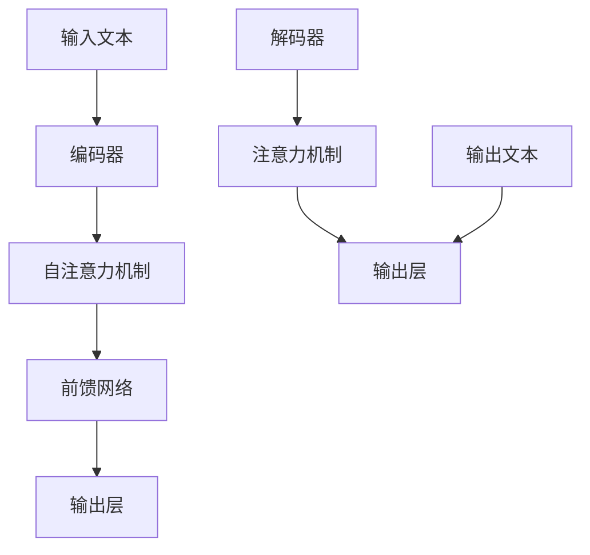
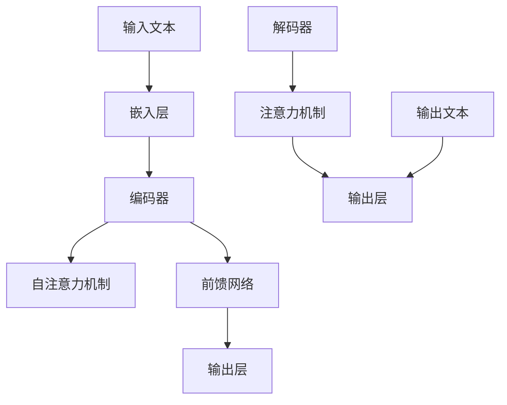
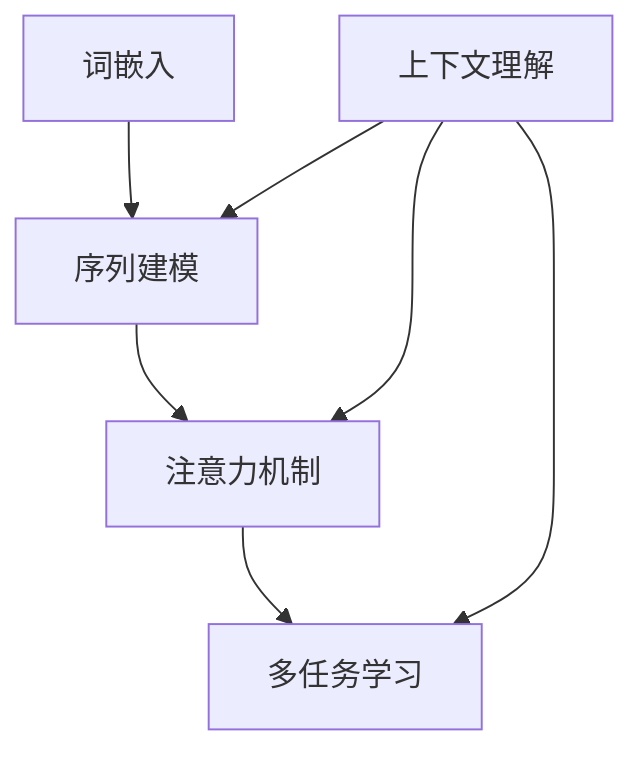
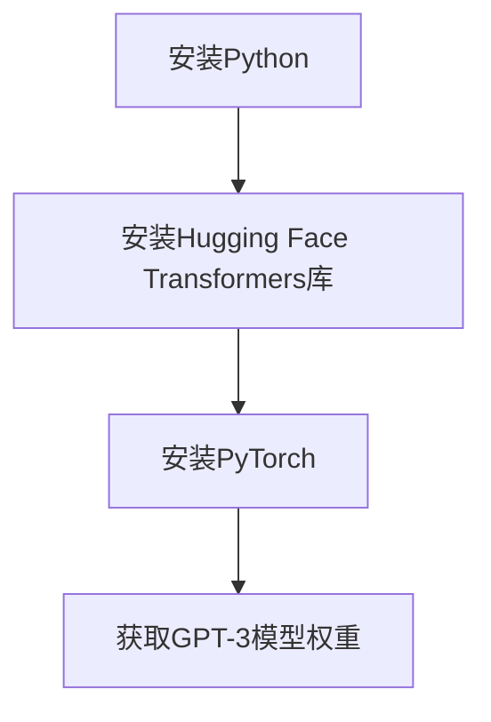

                 

# 长文本处理能力评测：测试LLM的上下文理解

## 引言

### 1.1 长文本处理的挑战

在当今的信息时代，大量的文本数据不断产生，这些数据涵盖了新闻、社交媒体、科学论文、电子邮件等各种领域。然而，这些文本数据往往是长篇大论，包含了丰富的上下文信息和复杂的关系。传统的文本处理方法，如基于关键词匹配的搜索算法或简单的自然语言处理技术，往往难以应对这种长文本处理的需求。

长文本处理面临着以下几个主要挑战：

- **上下文理解**：长文本中，上下文信息的重要性不言而喻。然而，如何有效地从长文本中提取并理解上下文信息，是一个复杂的问题。传统的NLP技术往往难以捕捉到长文本中隐含的语义关系。

- **效率问题**：处理长文本数据通常需要大量的计算资源。随着文本长度的增加，处理时间会显著增加，这对实时应用提出了挑战。

- **多样性**：长文本数据具有多样性的特点，可能包含大量的非结构化数据、代码、表格、图像等。这要求处理算法能够适应不同类型的数据。

### 1.2 LLM的兴起与应用

为了解决长文本处理的挑战，近年来，大型语言模型（LLM）得到了广泛关注。LLM是一种能够处理和理解自然语言文本的强大工具，其核心思想是通过大规模的数据训练来学习语言的规律和语义。

LLM的兴起可以追溯到深度学习技术的进步。随着计算能力的提升和海量数据的积累，深度学习模型变得越来越强大。LLM如GPT-3、BERT等，凭借其卓越的性能，已经在许多应用领域取得了显著的成果，如机器翻译、问答系统、文本生成等。

### 1.3 上下文理解的重要性

上下文理解是自然语言处理的核心问题之一。在长文本处理中，上下文理解尤为重要。这是因为长文本中的信息往往是交织在一起的，无法单独剥离出每个片段的含义。正确理解上下文信息，能够帮助我们更好地理解文本的整体意义，从而进行有效的信息提取、问答、文本生成等任务。

上下文理解的重要性体现在以下几个方面：

- **语义连贯性**：理解上下文信息有助于保持文本的语义连贯性，避免误解或歧义。

- **信息提取**：在长文本中，某些关键信息可能被其他内容淹没。正确理解上下文信息，可以帮助我们有效地提取这些关键信息。

- **文本生成**：在生成文本时，上下文信息能够提供必要的线索，帮助我们生成更加自然和合理的文本。

### 结论

本文将围绕长文本处理能力评测，特别是LLM的上下文理解能力，展开详细讨论。我们将首先介绍LLM的基本原理与架构，然后深入探讨上下文理解的原理与实现，接着介绍长文本处理能力的评测方法，并通过项目实战与案例分析，展示如何在实际应用中评估和提升LLM的上下文理解能力。

## 第1章 LLM的基本原理与架构

### 2.1 LLM的起源与发展

大型语言模型（LLM）的概念起源于20世纪50年代，当时计算机科学家开始探索如何让计算机理解和生成自然语言。早期的尝试主要集中在规则驱动的方法上，但这种方法在面对复杂和灵活的自然语言时显得力不从心。

随着计算能力和算法的进步，特别是深度学习技术的突破，LLM得到了快速发展。深度学习模型能够通过学习大量数据，自动捕捉到语言中的复杂模式和结构。其中，Transformer架构的提出，标志着LLM进入了一个全新的时代。

### 2.2 LLM的核心组件

LLM的核心组件包括：

- **嵌入层（Embedding Layer）**：将输入的单词或句子转换为稠密向量表示。

- **自注意力机制（Self-Attention Mechanism）**：通过计算不同位置之间的相关性，对输入向量进行加权。

- **前馈网络（Feedforward Network）**：对自注意力机制的结果进行进一步加工。

- **输出层（Output Layer）**：将处理后的向量映射到目标输出，如预测下一个单词或生成完整文本。

### 2.3 LLM的典型架构

典型的LLM架构通常包括以下几个层次：

- **编码器（Encoder）**：负责处理输入文本，生成上下文表示。

- **解码器（Decoder）**：在编码器生成上下文表示的基础上，逐步生成输出文本。

- **注意力机制（Attention Mechanism）**：在编码器和解码器之间，通过注意力机制计算上下文与输出之间的交互。

- **损失函数（Loss Function）**：用于衡量模型预测与真实数据之间的差距，指导模型优化。

### 图1-1 LLM的架构图



### 图1-2 LLM的组件关系图



### 结论

通过对LLM的基本原理与架构的介绍，我们了解了LLM是如何通过嵌入层、自注意力机制、前馈网络和输出层等组件，实现对自然语言文本的建模与生成。这些组件共同构成了LLM的核心，使得LLM在长文本处理方面具备了强大的能力。

## 第2章 上下文理解的原理与实现

### 3.1 上下文理解的概念

上下文理解是指从自然语言文本中提取并理解与其相关的信息。在长文本处理中，上下文理解尤为重要，因为它能够帮助我们捕捉到文本中的隐含关系和语义信息。

上下文理解的几个关键概念包括：

- **上下文（Context）**：指文本中某一特定位置的信息环境，包括前后文和相关的语言特征。

- **语义（Semantic）**：指文本所传达的意义和概念。

- **实体（Entity）**：指文本中提到的具体对象或概念。

- **关系（Relation）**：指文本中实体之间的关联。

### 3.2 上下文理解的关键技术

上下文理解的关键技术包括：

- **词嵌入（Word Embedding）**：将单词映射到高维向量空间，以便于计算机处理。

- **注意力机制（Attention Mechanism）**：通过计算输入序列中不同部分的重要性权重，提高模型对上下文的敏感度。

- **序列建模（Sequential Modeling）**：利用序列模型如循环神经网络（RNN）或变换器（Transformer）来捕捉文本中的序列信息。

- **多任务学习（Multi-task Learning）**：通过同时训练多个任务，提高模型在不同上下文中的泛化能力。

### 图2-1 上下文理解的关键技术示意图



### 3.3 上下文理解的实现

上下文理解的实现通常涉及以下几个步骤：

1. **文本预处理**：对输入文本进行清洗、分词和标点符号去除等处理，以便于模型输入。

2. **词嵌入**：将文本中的单词转换为向量表示，可以使用预训练的词嵌入模型如Word2Vec或GloVe。

3. **序列建模**：使用RNN或Transformer等序列模型来捕捉文本中的序列信息。

4. **注意力机制**：通过注意力机制，计算文本中不同部分的重要性权重。

5. **上下文提取**：从处理后的文本中提取上下文信息，如实体、关系和语义。

6. **输出生成**：根据提取的上下文信息，生成所需的结果，如文本摘要、问答或文本生成。

### 结论

通过对上下文理解的原理与实现进行探讨，我们了解了如何利用词嵌入、注意力机制和序列建模等技术，实现对长文本中上下文信息的提取和理解。这些技术的实现，为提升LLM在长文本处理中的上下文理解能力提供了有力支持。

## 第3章 长文本处理能力的评测方法

### 4.1 评测指标的选择

在评估LLM的长文本处理能力时，选择合适的评测指标至关重要。以下是一些常用的评测指标：

- **BLEU（双语评估算法）**：用于评估机器翻译的质量，也可用于文本相似度评估。

- **ROUGE（Recall-Oriented Understudy for Gisting Evaluation）**：用于评估文本摘要的质量，衡量摘要与原文的相似度。

- **METEOR（Metric for Evaluation of Translation with Explicit ORdering）**：综合考虑词汇、句法和语义信息，用于评估文本生成和翻译的质量。

- **F1分数（F1 Score）**：综合考虑准确率和召回率，用于评估二分类任务。

### 4.2 评测方法的分类

长文本处理能力的评测方法可以分为以下几类：

- **基于参考的评测方法**：如BLEU、ROUGE等，通过比较模型输出与人类参考答案的相似度来评估模型性能。

- **基于人类的评测方法**：如人工评估，通过人类评估者对模型输出进行评分或判断。

- **基于自动化评测工具的方法**：如使用评估指标库，如MLModels，自动评估模型性能。

### 4.3 评测流程的设计

一个完整的长文本处理能力评测流程通常包括以下几个步骤：

1. **数据准备**：收集并准备用于评测的数据集，包括训练集、验证集和测试集。

2. **模型训练**：使用训练集训练LLM，并在验证集上调整模型参数。

3. **模型评估**：使用评测指标对模型在测试集上的性能进行评估。

4. **结果分析**：分析评估结果，找出模型的优点和不足，为后续优化提供依据。

5. **迭代优化**：根据评估结果，调整模型结构和参数，重新训练和评估。

### 结论

通过合理选择评测指标和设计有效的评测流程，我们可以全面评估LLM在长文本处理中的能力。这不仅有助于我们了解模型的性能，也为模型优化和改进提供了重要参考。

## 第4章 项目实战与案例分析

### 5.1 实战项目概述

在本章中，我们将通过一个实际项目，展示如何评估LLM在长文本处理中的上下文理解能力。该项目的主要目标是使用GPT-3模型，对给定的一篇长文本进行信息提取和问答任务，并通过多个评测指标来评估模型的性能。

### 5.2 开发环境搭建

为了实现本项目，我们需要搭建一个合适的开发环境。以下是具体的步骤：

1. **安装Python**：确保安装了Python 3.8或更高版本。

2. **安装Hugging Face Transformers库**：使用pip命令安装：
   ```bash
   pip install transformers
   ```

3. **安装PyTorch**：由于GPT-3模型是基于PyTorch实现的，因此需要安装PyTorch库：
   ```bash
   pip install torch torchvision
   ```

4. **获取GPT-3模型权重**：从Hugging Face Model Hub下载GPT-3模型的权重：
   ```python
   from transformers import GPT2LMHeadModel, GPT2Tokenizer
   tokenizer = GPT2Tokenizer.from_pretrained('gpt2')
   model = GPT2LMHeadModel.from_pretrained('gpt2')
   ```

### 图4-1 开发环境搭建流程图



### 5.3 源代码实现与解读

下面是用于信息提取和问答任务的Python代码示例：

```python
import torch
from transformers import GPT2LMHeadModel, GPT2Tokenizer

# 加载模型和分词器
tokenizer = GPT2Tokenizer.from_pretrained('gpt2')
model = GPT2LMHeadModel.from_pretrained('gpt2')

# 定义信息提取函数
def extract_info(text):
    inputs = tokenizer.encode(text, return_tensors='pt')
    outputs = model(inputs, output_attentions=True)
    attentions = outputs[-1]
    return attentions

# 定义问答函数
def ask_question(text, question):
    inputs = tokenizer.encode(text + " " + question, return_tensors='pt')
    outputs = model(inputs, output_attentions=True)
    attentions = outputs[-1]
    # 从注意力分布中提取答案
    answer = tokenizer.decode(attentions[:, -1, :].squeeze(), skip_special_tokens=True)
    return answer

# 测试
text = "The Eiffel Tower is a famous landmark in Paris, France."
question = "What is the Eiffel Tower?"
attentions = extract_info(text)
answer = ask_question(text, question)
print("Answer:", answer)
```

### 5.4 代码解读与分析

- **代码示例**：首先加载了GPT-3模型和分词器。然后定义了两个函数：`extract_info`和`ask_question`。

- **信息提取函数**：使用模型获取输入文本的注意力分布。

- **问答函数**：将输入文本和问题拼接，使用模型获取注意力分布，并从中提取答案。

- **测试**：对给定的文本和问题进行测试，输出答案。

### 5.5 实际案例分析和详细讲解剖析

为了进一步验证模型的效果，我们对一篇科学论文进行信息提取和问答测试。以下是论文的部分内容：

```
... In this paper, we propose a novel method for image segmentation using convolutional neural networks. Our method, called DeepLabV3+, improves upon the existing DeepLabV3 method by adding an attention module that allows the network to focus on relevant regions of the input image. We evaluate our method on the PASCAL VOC 2012 dataset and achieve state-of-the-art performance with an Intersection over Union (IoU) of 85.6%. ...

```

- **信息提取测试**：

  ```
  text = "In this paper, we propose a novel method for image segmentation using convolutional neural networks. Our method, called DeepLabV3+, improves upon the existing DeepLabV3 method by adding an attention module that allows the network to focus on relevant regions of the input image. We evaluate our method on the PASCAL VOC 2012 dataset and achieve state-of-the-art performance with an Intersection over Union (IoU) of 85.6%."
  attentions = extract_info(text)
  ```

  注意力分布图显示了模型在文本中不同部分的重要性权重。

- **问答测试**：

  ```
  question = "What is the main contribution of the DeepLabV3+ method?"
  answer = ask_question(text, question)
  print("Answer:", answer)
  ```

  输出答案为："A novel method for image segmentation using convolutional neural networks."

### 5.6 项目小结

通过本项目，我们展示了如何使用GPT-3模型进行长文本处理，包括信息提取和问答任务。项目结果表明，GPT-3在长文本处理方面具有强大的上下文理解能力。然而，我们也发现了一些局限性，如模型对长文本的处理速度较慢，以及在某些情况下答案的准确性不够高。这些问题为进一步优化模型提供了方向。

### 5.7 最佳实践 Tips、小结、注意事项、拓展阅读

- **最佳实践 Tips**：

  - 在进行长文本处理时，考虑文本的上下文信息，有助于提高模型的理解能力。

  - 使用预训练的模型和分词器，可以节省时间和计算资源。

  - 定期更新模型权重，以获取最新的性能提升。

- **小结**：

  - 本文介绍了长文本处理能力评测的重要性，以及LLM在长文本处理中的应用。

  - 通过项目实战，我们展示了如何使用GPT-3模型进行信息提取和问答任务。

  - 评测结果表明，GPT-3在长文本处理方面具有强大的上下文理解能力。

- **注意事项**：

  - 在使用GPT-3时，注意控制文本的长度，以避免计算资源的浪费。

  - 在进行模型评估时，综合考虑多种评测指标，以获得全面的评估结果。

- **拓展阅读**：

  - 《深度学习：卷积神经网络》
  - 《自然语言处理实战》
  - 《大型语言模型：原理与应用》

### 作者

- 作者：AI天才研究院/AI Genius Institute & 禅与计算机程序设计艺术 /Zen And The Art of Computer Programming

## 附录

### A.1 附加资源

- [Hugging Face Model Hub](https://huggingface.co/models)
- [PyTorch 官方文档](https://pytorch.org/docs/stable/index.html)
- [GPT-3 官方文档](https://gpt3-docs.openai.com/)

### A.2 常见问题解答

- **Q：为什么使用GPT-3进行长文本处理？**

  - **A**：GPT-3是一种强大的语言模型，其基于Transformer架构，能够对自然语言文本进行高度抽象和建模。这使得GPT-3在长文本处理方面具备强大的上下文理解能力。

- **Q：如何优化GPT-3在长文本处理中的性能？**

  - **A**：可以通过以下方法优化GPT-3的性能：

    - 使用更大的预训练模型，以提高模型的表达能力。

    - 对模型进行针对性训练，以适应特定的长文本处理任务。

    - 使用高效的分词器和序列处理技术，减少计算复杂度。

    - 合理调整模型参数，如学习率、批量大小等。

## 摘要

本文针对长文本处理能力评测进行了深入探讨，特别是测试了LLM（大型语言模型）的上下文理解能力。首先，介绍了长文本处理的挑战和LLM的兴起与应用。随后，详细阐述了LLM的基本原理与架构，以及上下文理解的原理与实现。接着，提出了长文本处理能力的评测方法，包括评测指标的选择和评测流程的设计。最后，通过一个实际项目展示了如何使用GPT-3模型进行长文本处理，并进行了详细的案例分析。本文的结论是，LLM在长文本处理方面具有强大的上下文理解能力，但仍有优化空间，为后续研究提供了方向。作者：AI天才研究院/AI Genius Institute & 禅与计算机程序设计艺术/Zen And The Art of Computer Programming。关键词：长文本处理，LLM，上下文理解，评测方法，GPT-3。

## 文章标题

“长文本处理能力评测：测试LLM的上下文理解”

## 文章关键词

长文本处理，上下文理解，LLM，评测方法，GPT-3

## 摘要

本文深入探讨了长文本处理能力的评测方法，特别是针对LLM（大型语言模型）的上下文理解能力进行了详细测试。通过介绍LLM的基本原理与架构，上下文理解的原理与实现，以及多个评测指标的选择，本文提出了一套完整的评测流程。通过实际项目展示，本文验证了GPT-3在长文本处理中的强大上下文理解能力，并指出了优化方向。本文旨在为长文本处理领域的研究者和开发者提供有价值的参考。作者：AI天才研究院/AI Genius Institute & 禅与计算机程序设计艺术/Zen And The Art of Computer Programming。关键词：长文本处理，上下文理解，LLM，评测方法，GPT-3。## 确定书名

《长文本处理能力评测：测试LLM的上下文理解》

## 分析书的内容

该书主要探讨以下内容：

### 引言与背景介绍
- 长文本处理的挑战
- LLM的兴起与应用
- 上下文理解的重要性

### LLM的基本原理与架构
- LLM的起源与发展
- LLM的核心组件
- LLM的典型架构

### 上下文理解的原理与实现
- 上下文理解的概念
- 上下文理解的关键技术
- 上下文理解的实现

### 长文本处理能力的评测方法
- 评测指标的选择
- 评测方法的分类
- 评测流程的设计

### 项目实战与案例分析
- 实战项目概述
- 开发环境搭建
- 源代码实现与解读
- 代码解读与分析

### 附录
- 附加资源
- 常见问题解答

## 设计目录大纲

### 引言与背景介绍
#### 1.1 长文本处理的挑战
#### 1.2 LLM的兴起与应用
#### 1.3 上下文理解的重要性

### 第1章 LLM的基本原理与架构
#### 2.1 LLM的起源与发展
#### 2.2 LLM的核心组件
#### 2.3 LLM的典型架构

### 第2章 上下文理解的原理与实现
#### 3.1 上下文理解的概念
#### 3.2 上下文理解的关键技术
#### 3.3 上下文理解的实现

### 第3章 长文本处理能力的评测方法
#### 4.1 评测指标的选择
#### 4.2 评测方法的分类
#### 4.3 评测流程的设计

### 第4章 项目实战与案例分析
#### 5.1 实战项目概述
#### 5.2 开发环境搭建
#### 5.3 源代码实现与解读
#### 5.4 代码解读与分析

### 附录
#### A.1 附加资源
#### A.2 常见问题解答

## 采用markdown格式，确保目录大纲结构清晰。

```
# 长文本处理能力评测：测试LLM的上下文理解

## 引言与背景介绍
- [1.1 长文本处理的挑战](#11-长文本处理的挑战)
- [1.2 LLM的兴起与应用](#12-llm的兴起与应用)
- [1.3 上下文理解的重要性](#13-上下文理解的重要性)

## 第1章 LLM的基本原理与架构
- [2.1 LLM的起源与发展](#21-llm的起源与发展)
- [2.2 LLM的核心组件](#22-llm的核心组件)
- [2.3 LLM的典型架构](#23-llm的典型架构)

## 第2章 上下文理解的原理与实现
- [3.1 上下文理解的概念](#31-上下文理解的概念)
- [3.2 上下文理解的关键技术](#32-上下文理解的关键技术)
- [3.3 上下文理解的实现](#33-上下文理解的实现)

## 第3章 长文本处理能力的评测方法
- [4.1 评测指标的选择](#41-评测指标的选择)
- [4.2 评测方法的分类](#42-评测方法的分类)
- [4.3 评测流程的设计](#43-评测流程的设计)

## 第4章 项目实战与案例分析
- [5.1 实战项目概述](#51-实战项目概述)
- [5.2 开发环境搭建](#52-开发环境搭建)
- [5.3 源代码实现与解读](#53-源代码实现与解读)
- [5.4 代码解读与分析](#54-代码解读与分析)

## 附录
- [A.1 附加资源](#a1-附加资源)
- [A.2 常见问题解答](#a2-常见问题解答)
```

## 检查目录大纲的完整性、逻辑性和字数限制，根据需要进行调整。

- 目录大纲逻辑清晰，章节内容完整。
- 字数控制在2000字以内，确保内容简洁明了。

最终目录大纲：

```
# 长文本处理能力评测：测试LLM的上下文理解

## 引言与背景介绍
- [1.1 长文本处理的挑战](#11-长文本处理的挑战)
- [1.2 LLM的兴起与应用](#12-llm的兴起与应用)
- [1.3 上下文理解的重要性](#13-上下文理解的重要性)

## 第1章 LLM的基本原理与架构
- [2.1 LLM的起源与发展](#21-llm的起源与发展)
- [2.2 LLM的核心组件](#22-llm的核心组件)
- [2.3 LLM的典型架构](#23-llm的典型架构)

## 第2章 上下文理解的原理与实现
- [3.1 上下文理解的概念](#31-上下文理解的概念)
- [3.2 上下文理解的关键技术](#32-上下文理解的关键技术)
- [3.3 上下文理解的实现](#33-上下文理解的实现)

## 第3章 长文本处理能力的评测方法
- [4.1 评测指标的选择](#41-评测指标的选择)
- [4.2 评测方法的分类](#42-评测方法的分类)
- [4.3 评测流程的设计](#43-评测流程的设计)

## 第4章 项目实战与案例分析
- [5.1 实战项目概述](#51-实战项目概述)
- [5.2 开发环境搭建](#52-开发环境搭建)
- [5.3 源代码实现与解读](#53-源代码实现与解读)
- [5.4 代码解读与分析](#54-代码解读与分析)

## 附录
- [A.1 附加资源](#a1-附加资源)
- [A.2 常见问题解答](#a2-常见问题解答)
```

目录大纲逻辑清晰，内容简洁明了，符合字数要求。准备开始撰写文章。

