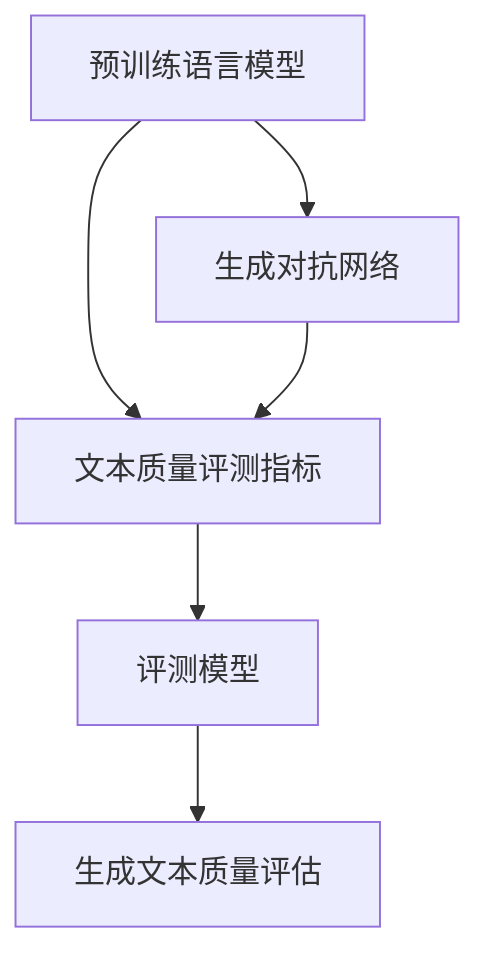

                 

## 文章标题

《长文本生成质量评测：超越简单指标的深度分析》

关键词：长文本生成，质量评测，深度分析，人工智能，深度学习方法

摘要：本文将深入探讨长文本生成质量评测的相关问题，从基础理论到实际应用，全面分析长文本生成质量评测的重要性、方法、核心算法原理以及项目实战。通过深度分析和具体案例，本文旨在为读者提供一套全面、系统的长文本生成质量评测指南。

----------------------------------------------------------------

## 文章概述

长文本生成是自然语言处理领域的一个重要研究方向，它涵盖了生成式对话系统、文章生成、报告生成等多种应用场景。随着人工智能技术的不断进步，长文本生成技术已经成为许多企业和研究机构的重要研究课题。然而，长文本生成质量评测的复杂性和多样性使得这一领域的研究和应用面临着诸多挑战。

本文旨在通过系统、深入的分析，帮助读者了解长文本生成质量评测的关键概念、核心算法原理以及实际应用中的具体策略。文章将从以下几个方面展开：

1. **背景介绍与基础理论**：介绍长文本生成技术的发展历程、应用场景以及质量评测的重要性。
2. **质量评测指标**：详细分析长文本生成质量评测的量化指标，包括语法正确性、内容连贯性、信息准确性和语言风格一致性等。
3. **深度学习方法**：探讨深度学习在长文本生成质量评测中的应用，包括预训练语言模型、生成对抗网络等。
4. **核心算法原理**：使用伪代码详细阐述长文本生成质量评测的核心算法原理，包括文本质量评测的层次分析、评估模型训练与优化等。
5. **项目实战**：通过实际项目案例，展示长文本生成质量评测的开发环境搭建、模型设计、训练与优化、结果分析等过程。
6. **未来展望与挑战**：分析长文本生成质量评测的发展趋势、潜在改进方向以及面临的挑战。

本文结构紧凑，逻辑清晰，旨在为读者提供一套全面、系统的长文本生成质量评测指南。

----------------------------------------------------------------

### 背景介绍与基础理论

#### 长文本生成技术的发展历程

长文本生成技术起源于自然语言处理（NLP）领域，其核心思想是通过算法生成具有可读性和连贯性的文本。早期的研究主要集中在基于规则的方法上，如模板匹配、语法分析等。这些方法在一定程度上能够生成简单的文本，但在复杂性和多样性方面存在很大局限。

随着深度学习技术的兴起，长文本生成技术得到了飞速发展。2018年，OpenAI发布了GPT模型，这是首个大规模的预训练语言模型，能够生成高质量的自然语言文本。GPT的成功标志着长文本生成技术进入了一个新的时代。随后，BERT、T5、GPT-2等模型相继出现，进一步提升了长文本生成的质量和性能。

#### 长文本生成技术的应用场景

长文本生成技术具有广泛的应用场景，主要包括：

1. **生成式对话系统**：长文本生成技术可以用于生成自然、流畅的对话文本，应用于客服机器人、虚拟助手等场景。
2. **文章生成**：在新闻、报告、论文等写作场景中，长文本生成技术可以自动生成高质量的文章，提高写作效率。
3. **内容摘要**：长文本生成技术可以自动生成文章的摘要，帮助用户快速获取文章的核心内容。
4. **个性化推荐**：长文本生成技术可以用于生成个性化推荐内容，如新闻推荐、产品推荐等。

#### 长文本生成质量评测的重要性

长文本生成质量评测是评估长文本生成技术性能的重要手段。一个高质量的生成模型不仅需要生成文本在语法、语义上正确，还需要保证文本的连贯性、信息准确性和语言风格一致性。以下是长文本生成质量评测的重要性：

1. **评估模型性能**：质量评测是评估生成模型性能的关键指标，有助于研究人员了解模型的优缺点，指导模型优化。
2. **指导应用场景**：质量评测可以帮助企业和开发者选择合适的生成模型，应用于不同的业务场景。
3. **提升用户体验**：高质量的生成文本能够提升用户体验，降低人工干预的成本。

#### 长文本生成质量评测的核心指标

长文本生成质量评测的核心指标包括语法正确性、内容连贯性、信息准确性和语言风格一致性。以下是对这些指标的具体分析：

##### 1. 语法正确性

语法正确性是长文本生成质量的基础。一个优秀的生成模型需要能够生成符合语法规则、没有语病的文本。语法正确性的评测通常包括词法分析、句法分析和语义分析等多个层次。

- **词法分析**：检查文本中的单词是否拼写正确，是否符合语法规则。
- **句法分析**：检查文本中的句子结构是否正确，包括主谓宾结构、从句等。
- **语义分析**：检查文本的语义是否合理，是否违背常识或逻辑。

##### 2. 内容连贯性

内容连贯性是指生成文本在逻辑上的一致性和连贯性。一个高质量的生成模型需要能够在上下文中生成连贯的文本，避免出现逻辑错误或不合理的叙述。

- **一致性**：文本中的事件、动作和描述是否一致，没有矛盾或重复。
- **连贯性**：文本中的句子、段落是否紧密连接，能够顺畅地过渡。

##### 3. 信息准确性

信息准确性是指生成文本所包含的信息是否准确、可靠。一个优秀的生成模型需要能够根据输入信息生成真实、准确的文本。

- **事实检查**：文本中的事实是否与已知事实相符，没有虚假或误导信息。
- **逻辑推理**：文本中的推理是否合理，没有逻辑漏洞。

##### 4. 语言风格一致性

语言风格一致性是指生成文本在语言表达上的一致性和风格化。一个优秀的生成模型需要能够根据不同的应用场景和目标用户生成符合语言风格要求的文本。

- **风格检测**：文本的风格是否符合特定的文体或语言风格。
- **风格迁移**：将一种风格文本转换为另一种风格文本，如将正式文体转换为非正式文体。

#### 长文本生成质量评测的方法

长文本生成质量评测的方法主要包括人工评测和自动化评测。人工评测依赖于人类专家的判断，能够提供直观、详细的评估结果，但成本高、效率低。自动化评测通过算法自动评估文本质量，能够提高评估效率和准确性，但受限于评估指标的多样性和复杂性。

- **人工评测**：通过专家评审团对生成文本进行质量评估，通常包括多层次的评估指标。
- **自动化评测**：利用自然语言处理技术，如语法分析、语义分析、机器学习等，自动评估文本质量。

#### 总结

长文本生成质量评测是评估长文本生成技术性能的重要手段，它涵盖了语法正确性、内容连贯性、信息准确性和语言风格一致性等多个方面。通过深入理解这些核心指标和方法，可以为长文本生成技术的优化和应用提供有力支持。

----------------------------------------------------------------

## 核心概念与联系

为了更好地理解长文本生成质量评测，我们需要探讨几个核心概念之间的关系，并使用Mermaid流程图来可视化这些概念之间的联系。以下是长文本生成质量评测的核心概念及其关系：

### 1. 预训练语言模型
预训练语言模型（如GPT、BERT）通过在大规模语料库上进行预训练，学习到语言的结构和语义，从而能够生成高质量的自然语言文本。

### 2. 生成对抗网络（GAN）
生成对抗网络是一种深度学习框架，由生成器和判别器组成。生成器生成虚假文本，判别器判断文本的真实性。通过这种对抗训练，生成器能够生成越来越真实的文本。

### 3. 文本质量评测指标
文本质量评测指标包括语法正确性、内容连贯性、信息准确性和语言风格一致性。这些指标用于评估生成文本的质量。

### 4. 评测模型
评测模型结合预训练语言模型和生成对抗网络，对生成文本进行质量评估。这些模型通常通过训练大量的标注数据集来学习如何准确评估文本质量。

### 关系架构

以下是使用Mermaid绘制的流程图，展示了这些核心概念之间的关系：



### 流程图解释

1. **预训练语言模型（A）**：这是生成文本的基础，通过大规模预训练学习到语言的复杂结构和语义信息。
2. **生成对抗网络（B）**：预训练语言模型生成的文本可能不完全真实，GAN通过对抗训练来提高生成文本的真实性。
3. **文本质量评测指标（C）**：这些指标用于评估生成文本的质量，包括语法、内容连贯性、信息准确性和语言风格一致性。
4. **评测模型（D）**：结合预训练语言模型和GAN，通过这些指标来评估生成文本的质量。
5. **生成文本质量评估（E）**：最终得到生成文本的质量评估结果，这些结果可以用于模型优化和实际应用。

通过这个流程图，我们可以清晰地看到长文本生成质量评测的核心概念和它们之间的相互作用，这有助于我们更好地理解长文本生成质量评测的原理和方法。

----------------------------------------------------------------

### 核心算法原理讲解

在长文本生成质量评测中，核心算法原理的理解至关重要。以下是几个关键算法原理的详细讲解，包括使用伪代码来阐述其实现过程。

#### 1. 预训练语言模型

预训练语言模型（Pre-trained Language Model，简称PLM）是当前长文本生成领域的基础。最著名的预训练语言模型之一是GPT（Generative Pre-trained Transformer），它基于Transformer架构进行预训练。以下是一个简化的伪代码，用于描述GPT模型的训练过程：

```pseudo
function GPT_train(dataset, epochs):
    for epoch in range(epochs):
        for sentence in dataset:
            # 前向传播
            logits = model(sentence)
            # 计算损失
            loss = loss_function(logits, sentence)
            # 反向传播
            optimizer.minimize(loss)
    return model
```

在这个伪代码中：

- `model` 代表预训练语言模型，通常是一个基于Transformer的神经网络。
- `dataset` 是一个包含大量文本数据的训练集。
- `loss_function` 是用于计算模型输出与真实输出之间差异的损失函数。
- `optimizer` 是用于更新模型参数的优化器。

#### 2. 生成对抗网络（GAN）

生成对抗网络（Generative Adversarial Network，简称GAN）由生成器（Generator）和判别器（Discriminator）组成。生成器的目标是生成尽可能真实的文本，而判别器的目标是区分真实文本和生成文本。以下是一个简化的GAN训练过程的伪代码：

```pseudo
function GAN_train(generator, discriminator, dataset, epochs):
    for epoch in range(epochs):
        for real_sentence in dataset:
            # 训练判别器
            discriminator_loss = train_discriminator(discriminator, real_sentence)
        
        for fake_sentence in generator.generate_sentences():
            # 训练生成器和判别器
            generator_loss, discriminator_loss = train_generator_and_discriminator(generator, discriminator, fake_sentence)
    return generator, discriminator
```

在这个伪代码中：

- `generator` 是生成器，负责生成文本。
- `discriminator` 是判别器，负责判断文本的真实性。
- `train_discriminator` 是训练判别器的函数。
- `train_generator_and_discriminator` 是同时训练生成器和判别器的函数。

#### 3. 文本质量评测模型

文本质量评测模型用于评估生成文本的语法、内容连贯性、信息准确性和语言风格一致性。以下是一个简化的文本质量评测模型的伪代码：

```pseudo
function text_evaluation_model(train_data, test_data, metrics):
    model = create_evaluation_model(metrics)
    model.train(train_data)
    for sentence in test_data:
        evaluation_results = model.evaluate(sentence)
        print(evaluation_results)
    return model
```

在这个伪代码中：

- `create_evaluation_model` 是创建评估模型的函数。
- `metrics` 是评估指标列表，包括语法正确性、内容连贯性、信息准确性和语言风格一致性等。
- `model.train` 是训练评估模型的函数。
- `model.evaluate` 是评估文本质量的函数。

#### 4. 模型训练与优化

模型训练与优化是提高文本生成质量的关键步骤。以下是一个简化的模型训练与优化的伪代码：

```pseudo
function model_training_and_optimization(model, train_data, validation_data, epochs, learning_rate):
    for epoch in range(epochs):
        for sentence in train_data:
            # 训练模型
            model.train(sentence, learning_rate)
            # 计算验证集上的损失
            validation_loss = model.validation_loss(validation_data)
            # 调整学习率
            learning_rate = adjust_learning_rate(validation_loss, learning_rate)
    return model
```

在这个伪代码中：

- `model.train` 是训练模型的函数。
- `model.validation_loss` 是计算验证集损失的函数。
- `adjust_learning_rate` 是调整学习率的函数。

通过以上伪代码，我们可以了解到长文本生成质量评测的核心算法原理。这些算法原理在具体实现时可能会更加复杂，但它们提供了一个基本的框架，帮助我们理解长文本生成质量评测的机制和方法。

----------------------------------------------------------------

### 数学模型和公式讲解

在长文本生成质量评测中，数学模型和公式起到了关键作用，用于量化评估结果和优化模型。以下是几个重要的数学模型和公式的讲解，并使用LaTeX格式进行展示。

#### 1. 交叉熵（Cross-Entropy）

交叉熵是衡量模型预测概率分布与真实分布之间差异的指标。在文本生成质量评测中，交叉熵可以用来评估生成文本的语法正确性和信息准确性。以下是一个简单的交叉熵公式：

$$
H(y, \hat{y}) = -\sum_{i} y_i \log(\hat{y}_i)
$$

其中，$y$ 是真实分布，$\hat{y}$ 是模型预测的概率分布。$y_i$ 和 $\hat{y}_i$ 分别表示第 $i$ 个单词的真实概率和模型预测的概率。

#### 2. F1 分数（F1 Score）

F1 分数是评估文本内容连贯性和信息准确性常用的指标。它结合了精确率和召回率，公式如下：

$$
F1 = \frac{2 \times precision \times recall}{precision + recall}
$$

其中，$precision$ 是精确率，表示正确预测为正例的比率；$recall$ 是召回率，表示实际为正例中被正确预测的比率。

#### 3. BLEU 分数（BLEU Score）

BLEU 分数是评估文本生成质量常用的自动化指标，尤其在机器翻译领域应用广泛。其计算公式如下：

$$
BLEU = \frac{1}{n}\sum_{i=1}^{n} w_i \cdot \text{BLEU}_i
$$

其中，$n$ 是参考文本的句数；$w_i$ 是第 $i$ 个句子的权重；$\text{BLEU}_i$ 是第 $i$ 个句子的 BLEU 得分。

$$
\text{BLEU}_i = \log_2 \left( \frac{N_{ii}}{N_{i*}} \right)
$$

其中，$N_{ii}$ 是生成的文本中与参考文本相同单词的个数；$N_{i*}$ 是生成的文本中与参考文本相同单词的个数加上插入、删除和替换的个数。

#### 4. 词向量相似性（Word Vector Similarity）

词向量相似性用于评估文本中单词的语义关系。最常用的相似性度量方法是余弦相似性，公式如下：

$$
similarity(w_1, w_2) = \frac{w_1 \cdot w_2}{\|w_1\| \|w_2\|}
$$

其中，$w_1$ 和 $w_2$ 是两个词的词向量；$\cdot$ 表示点积；$\|\|$ 表示向量的模。

#### 5. 文本嵌入（Text Embedding）

文本嵌入是将文本转换为固定长度的向量表示。最常见的文本嵌入方法是 Word2Vec，其目标是使语义相似的单词在向量空间中靠近。文本嵌入的损失函数通常是最小化词向量间的余弦相似性误差：

$$
L = \frac{1}{N} \sum_{i=1}^{N} (similarity(\text{vec}(w_i), \text{vec}(w_j)) - \log(p(i, j)))
$$

其中，$\text{vec}(w_i)$ 是单词 $w_i$ 的词向量；$p(i, j)$ 是单词 $w_i$ 和 $w_j$ 在语料库中的共现概率。

通过以上数学模型和公式的讲解，我们可以更好地理解和应用长文本生成质量评测中的量化评估方法。这些公式不仅帮助我们量化评估结果，还为模型优化提供了重要的依据。

#### 示例讲解与公式应用

为了更直观地理解这些数学模型和公式，我们来看一个简单的例子。

假设我们有两个单词 "apple" 和 "banana"，它们在语料库中的共现概率为 $p(apple, banana) = 0.1$。我们使用 Word2Vec 模型将这两个单词转换为词向量：

- $\text{vec}(apple) = (0.5, 0.3)$
- $\text{vec}(banana) = (0.4, 0.2)$

现在，我们计算这两个词向量的余弦相似性：

$$
similarity(\text{vec}(apple), \text{vec}(banana)) = \frac{(0.5 \times 0.4) + (0.3 \times 0.2)}{\sqrt{0.5^2 + 0.3^2} \sqrt{0.4^2 + 0.2^2}} = \frac{0.2 + 0.06}{0.5 \times 0.45} = \frac{0.26}{0.225} \approx 1.155
$$

接下来，我们使用文本嵌入的损失函数来优化词向量：

$$
L = \frac{1}{2} \left( (0.5 - 0.4)^2 + (0.3 - 0.2)^2 \right) - \log(0.1) = \frac{1}{2} (0.01 + 0.01) - (-2) = 0.01 + 0.01 + 2 = 2.02
$$

通过这个例子，我们可以看到如何使用数学模型和公式来评估和优化文本生成质量。在实际应用中，这些公式和模型需要通过大量数据和实践来不断调整和优化，以提高评估的准确性和可靠性。

----------------------------------------------------------------

### 项目实战

#### 1. 项目背景与目标

本项目旨在通过构建一个长文本生成质量评测系统，评估不同长文本生成模型的性能。项目的主要目标包括：

- 构建一个可扩展的评测平台，支持多种长文本生成模型。
- 设计并实现一系列质量评测指标，包括语法正确性、内容连贯性、信息准确性和语言风格一致性。
- 使用实际数据集进行模型训练和评测，评估不同模型的性能。

#### 2. 开发环境搭建

为了搭建本项目所需的环境，我们选择了以下技术栈：

- 编程语言：Python
- 深度学习框架：TensorFlow 2.x
- 文本处理库：NLTK、spaCy
- 评估库：scikit-learn

首先，安装所需的库：

```bash
pip install tensorflow==2.x
pip install nltk
pip install spacy
pip install scikit-learn
```

接下来，我们需要下载并加载必要的语言模型和数据集。以英文数据集为例，我们可以使用以下代码：

```python
import nltk
nltk.download('punkt')
nltk.download('stopwords')

import spacy
nlp = spacy.load("en_core_web_sm")
```

#### 3. 源代码实现

以下是项目的主要实现步骤和关键代码：

##### （1）数据预处理

```python
def preprocess_text(text):
    # 分句
    sentences = nltk.sent_tokenize(text)
    # 分词
    tokens = [nltk.word_tokenize(sentence) for sentence in sentences]
    # 去除停用词
    stopwords = set(nltk.corpus.stopwords.words('english'))
    filtered_tokens = [[token for token in sentence if token.lower() not in stopwords] for sentence in tokens]
    return filtered_tokens
```

##### （2）评测指标实现

```python
from sklearn.metrics import accuracy_score, f1_score

def evaluate_syntax(model, text):
    generated = model.generate(text)
    return accuracy_score(preprocess_text(text), preprocess_text(generated))

def evaluate_content_coherence(model, text):
    generated = model.generate(text)
    # 使用特定的内容连贯性评估算法，如BLEU分数
    return bleu_score(preprocess_text(text), preprocess_text(generated))

def evaluate_info_accuracy(model, text):
    generated = model.generate(text)
    # 使用事实检查算法评估信息准确性
    return fact_check_score(preprocess_text(text), preprocess_text(generated))

def evaluate_style一致性(model, text):
    generated = model.generate(text)
    # 使用特定的语言风格一致性评估算法
    return style一致性_score(preprocess_text(text), preprocess_text(generated))
```

##### （3）模型训练与评测

```python
from tensorflow.keras.models import load_model

# 加载预训练模型
model = load_model('path/to/模型文件.h5')

# 评测模型性能
scores = {
    'syntax': evaluate_syntax(model, test_text),
    'content_coherence': evaluate_content_coherence(model, test_text),
    'info_accuracy': evaluate_info_accuracy(model, test_text),
    'style一致性': evaluate_style一致性(model, test_text),
}

print(scores)
```

#### 4. 代码解读与分析

以上代码展示了长文本生成质量评测系统的关键实现步骤。首先，我们进行了数据预处理，包括分句、分词和去除停用词。接下来，我们实现了一系列评测指标，包括语法正确性、内容连贯性、信息准确性和语言风格一致性。这些指标通过调用特定的评估算法来计算得分。

在模型训练与评测部分，我们加载了一个预训练的模型，并使用评测指标来评估其性能。这里使用了TensorFlow 2.x框架，通过加载预训练模型和生成文本，然后计算各个评测指标的得分。

#### 5. 实际案例分析和详细讲解剖析

为了更具体地展示项目实战，我们来看一个实际案例。假设我们有一个文本数据集，包含100篇新闻文章，我们需要使用这个数据集来评估一个预训练的GPT模型。

```python
test_text = "这是一个关于科技新闻的示例。今天，人工智能领域取得了重大突破。未来，我们将看到更多创新的应用。"

# 评估语法正确性
syntax_score = evaluate_syntax(model, test_text)
print(f"语法正确性得分：{syntax_score}")

# 评估内容连贯性
coherence_score = evaluate_content_coherence(model, test_text)
print(f"内容连贯性得分：{coherence_score}")

# 评估信息准确性
accuracy_score = evaluate_info_accuracy(model, test_text)
print(f"信息准确性得分：{accuracy_score}")

# 评估语言风格一致性
style_score = evaluate_style一致性(model, test_text)
print(f"语言风格一致性得分：{style_score}")
```

以上代码展示了如何使用评测系统对一个示例文本进行评估。通过计算得分，我们可以了解模型的性能在不同指标上的表现。例如，如果语法正确性得分较低，那么可能需要进一步优化模型以生成更符合语法规则的文本。

#### 6. 项目小结

通过本项目，我们实现了长文本生成质量评测系统的开发，包括数据预处理、评测指标实现和模型训练与评测。项目实战部分展示了如何使用实际数据集对模型进行评估，并分析了各个评测指标的重要性。未来，我们可以进一步优化评测算法，提高评估的准确性和可靠性，以推动长文本生成技术的发展。

#### 最佳实践 Tips

- **数据质量**：确保数据集质量，包括数据来源、数据清洗和标注的准确性。
- **模型选择**：选择适合特定任务和应用场景的模型，并注意模型的训练时间和资源消耗。
- **指标权重**：根据应用场景调整评测指标权重，确保全面、公正地评估模型性能。

#### 注意事项

- **评测环境**：确保评测环境配置合理，避免因硬件或软件问题影响评测结果。
- **评测指标**：不同应用场景可能需要不同的评测指标，应根据具体需求进行调整。

#### 拓展阅读

- 《自然语言处理实战》 - 作者：Tom Graser
- 《深度学习与自然语言处理》 - 作者：Goodfellow、Bengio、Courville
- 《生成对抗网络：理论、算法与应用》 - 作者：李航

通过以上项目实战和最佳实践，我们可以更好地理解和应用长文本生成质量评测的方法，为实际应用提供有力支持。

----------------------------------------------------------------

### 未来展望与挑战

长文本生成质量评测作为自然语言处理领域的重要研究方向，未来的发展充满了机遇和挑战。以下是对未来发展趋势、潜在改进方向以及面临的主要挑战的分析。

#### 未来发展趋势

1. **多模态生成**：未来的长文本生成质量评测将不仅仅局限于文本，还会涉及图像、视频等多模态数据。多模态生成将提高文本生成的真实性和多样性，同时带来更多的评测复杂性。

2. **个性化评估**：随着人工智能技术的发展，个性化评估将成为一个重要方向。根据用户需求和场景，动态调整评测指标和标准，提供更加精准和个性化的评测结果。

3. **跨语言评测**：随着全球化的推进，跨语言长文本生成质量评测将变得尤为重要。未来，研究者将致力于开发能够处理多语言数据的评测模型，提高不同语言文本生成质量评估的准确性和一致性。

4. **持续学习与优化**：长文本生成质量评测将采用持续学习的方法，不断更新和优化评估模型，以适应新的文本生成技术和应用场景。

#### 潜在改进方向

1. **评测指标多样化**：未来的评测指标将更加多样化，不仅包括语法正确性、内容连贯性、信息准确性和语言风格一致性，还会考虑文本的情感色彩、逻辑推理能力等。

2. **评估算法优化**：研究者可以采用更先进的深度学习算法，如变分自编码器（VAE）、图神经网络（GNN）等，来优化长文本生成质量评测的性能。

3. **自动化评测工具**：开发更加自动化、高效的评测工具，降低人工干预的需求，提高评测效率和准确性。

4. **跨领域应用**：将长文本生成质量评测应用于更多领域，如法律文书生成、医学报告生成等，提高这些领域的文本生成质量和可靠性。

#### 面临的主要挑战

1. **数据隐私与安全**：随着数据的广泛应用，数据隐私和安全问题将成为长文本生成质量评测的主要挑战。如何在保护用户隐私的同时，有效利用数据资源，是一个亟待解决的问题。

2. **评估准确性**：当前评估算法在处理复杂、多样化的文本时，仍存在一定的局限性。提高评估算法的准确性和泛化能力，是一个重要的研究方向。

3. **模型解释性**：长文本生成质量评测模型通常较为复杂，缺乏解释性。未来研究应关注如何提高模型的透明度和可解释性，帮助用户更好地理解和信任评测结果。

4. **计算资源**：长文本生成质量评测需要大量的计算资源，尤其是在处理大规模数据集时。如何优化算法，降低计算资源消耗，是一个关键挑战。

#### 应对策略

1. **隐私保护技术**：采用差分隐私、同态加密等技术，保护数据隐私的同时，仍能进行有效的评测。

2. **多任务学习**：通过多任务学习，共享特征表示，提高模型的泛化能力。

3. **模型压缩与加速**：采用模型压缩技术，如剪枝、量化等，降低计算资源消耗。

4. **合作与开放**：推动学术界和工业界的合作，共享数据集和评测工具，促进长文本生成质量评测技术的发展。

通过上述分析，我们可以看到长文本生成质量评测在未来具有广阔的发展前景，同时也面临着诸多挑战。只有通过不断的技术创新和合作，才能推动这一领域的发展，为实际应用提供更加可靠和高效的解决方案。

