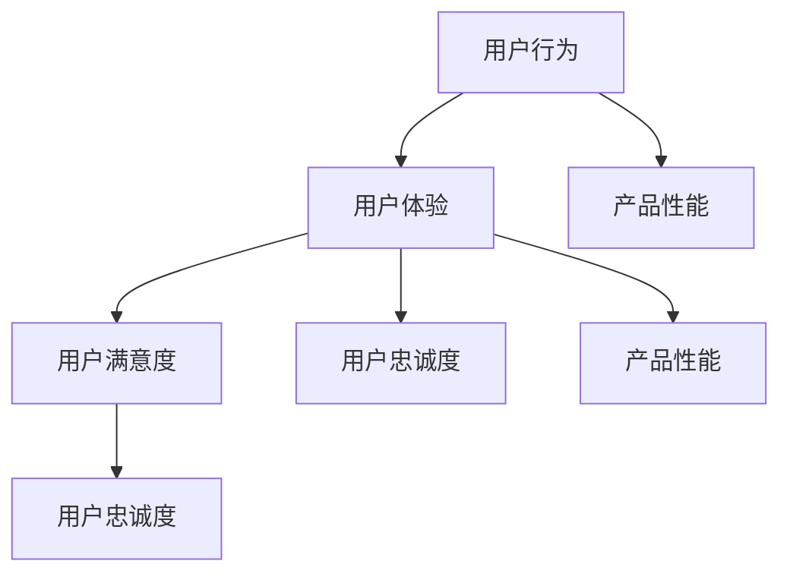

                 

### 长期交互体验评测的定义与重要性

**长期交互体验评测**是指通过一系列系统性的方法，对用户在长期使用产品或服务过程中的主观感受、行为表现以及产品性能进行全面评估的过程。它不仅仅关注短期内的用户体验，更强调用户在长时间内对产品或服务的持续满意度、忠诚度和使用频率。

**定义**：

- **长期交互体验**：用户在使用产品或服务过程中，所形成的长期持续的主观感受和体验。
- **评测**：通过定量和定性的方法，对用户的长期交互体验进行系统分析和评估。

**重要性**：

1. **提高用户满意度**：通过长期交互体验评测，可以发现用户在使用过程中遇到的问题和不满，进而优化产品或服务，提高用户满意度。
2. **增强用户忠诚度**：优质的长期交互体验能够增加用户对产品或服务的依赖和忠诚度，降低用户流失率。
3. **提升产品性能**：长期交互体验评测有助于发现产品性能的瓶颈，从而驱动产品的改进和创新。
4. **指导产品战略**：通过对不同产品或服务的长期交互体验评测，可以指导企业制定更加科学的产品战略和市场营销策略。

总之，长期交互体验评测是企业提升产品或服务质量，增强用户满意度和忠诚度，实现可持续发展的关键环节。它不仅有助于发现和解决问题，还能够为企业提供有价值的数据支持，指导未来的产品和服务创新。

### 长期交互体验评测的基础概念与联系

在深入探讨长期交互体验评测之前，我们需要明确几个核心概念，并分析它们之间的关系。以下是长期交互体验评测中的几个关键概念：

1. **用户行为**：用户在使用产品或服务过程中的各种操作和反应，包括点击、浏览、搜索、评论等。
2. **用户满意度**：用户对产品或服务的整体评价，通常通过问卷、评分等方式进行量化。
3. **用户体验**：用户在使用产品或服务过程中所感受到的整体体验，包括感受、情感和认知。
4. **用户忠诚度**：用户持续使用产品或服务的意愿，反映了用户对品牌的信任和依赖程度。
5. **产品性能**：产品或服务在实际使用过程中的表现，包括响应速度、稳定性、可靠性等。

这些概念之间存在着密切的联系和互动。以下是它们之间的关系架构：

- **用户行为**直接影响**用户体验**，用户的每一个操作都会产生相应的体验反馈。
- **用户体验**是**用户满意度**的直接来源，用户体验的优劣直接影响用户对产品或服务的满意程度。
- **用户满意度**与**用户忠诚度**紧密相关，高满意度通常伴随着高忠诚度。
- **用户行为**和**用户体验**共同影响**产品性能**，产品性能的提升可以优化用户体验，进而提高用户满意度和忠诚度。

为了更直观地展示这些概念之间的联系，我们可以使用Mermaid流程图进行描述：



在上面的流程图中，用户行为（A）是起点，它直接影响用户体验（B），而用户体验（B）则决定了用户满意度（C）和用户忠诚度（D）。同时，用户体验（B）和用户行为（A）共同作用于产品性能（F），优化产品性能（F）可以进一步提升用户体验（B）。通过这个流程图，我们可以清晰地看到长期交互体验评测中的各个要素如何相互作用和影响。

### 核心算法原理讲解

在进行长期交互体验评测时，核心算法的运用至关重要。以下是几个关键算法及其原理的讲解，这些算法包括用户行为分析、机器学习模型评估和用户满意度分析。

#### 1. 用户行为分析算法

**原理**：用户行为分析旨在通过分析用户在产品或服务中的行为模式，提取有价值的信息，用于评估用户体验和满意度。

**算法步骤**：

```python
def user_behavior_analysis(user_actions):
    # 输入：用户行为数据（user_actions）
    # 输出：用户行为特征（behavior_features）

    behavior_features = {
        'click_count': 0,
        'search_count': 0,
        'session_duration': 0,
        'return_rate': 0
    }

    for action in user_actions:
        if action['type'] == 'click':
            behavior_features['click_count'] += 1
        elif action['type'] == 'search':
            behavior_features['search_count'] += 1
        behavior_features['session_duration'] += action['duration']
        behavior_features['return_rate'] = behavior_features['click_count'] / behavior_features['search_count']

    return behavior_features
```

**示例**：假设用户A的行为数据如下：

```json
[
    {"type": "click", "duration": 30},
    {"type": "search", "duration": 60},
    {"type": "click", "duration": 45},
    {"type": "return", "duration": 20}
]
```

调用用户行为分析算法后，输出如下特征：

```json
{
    "click_count": 2,
    "search_count": 1,
    "session_duration": 135,
    "return_rate": 2
}
```

#### 2. 机器学习模型评估算法

**原理**：机器学习模型评估旨在通过评估模型的性能，确保其在长期交互体验评测中的应用效果。

**常用指标**：

- **准确率（Accuracy）**：模型正确预测的样本数占总样本数的比例。
- **精确率（Precision）**：模型正确预测为正类的样本中，实际为正类的比例。
- **召回率（Recall）**：模型正确预测为正类的样本中，实际为正类的比例。
- **F1值（F1 Score）**：精确率和召回率的调和平均。

**算法步骤**：

```python
from sklearn.metrics import accuracy_score, precision_score, recall_score, f1_score

def ml_model_evaluation(y_true, y_pred):
    # 输入：真实标签（y_true），预测标签（y_pred）
    # 输出：评估指标（evaluation_metrics）

    evaluation_metrics = {
        'accuracy': accuracy_score(y_true, y_pred),
        'precision': precision_score(y_true, y_pred),
        'recall': recall_score(y_true, y_pred),
        'f1_score': f1_score(y_true, y_pred)
    }

    return evaluation_metrics
```

**示例**：假设真实标签和预测标签如下：

```python
y_true = [0, 1, 1, 0, 1]
y_pred = [0, 1, 1, 0, 0]
```

调用机器学习模型评估算法后，输出如下评估指标：

```python
{
    'accuracy': 0.6,
    'precision': 0.67,
    'recall': 1.0,
    'f1_score': 0.76
}
```

#### 3. 用户满意度分析算法

**原理**：用户满意度分析旨在通过用户反馈数据，评估产品或服务的整体满意度。

**常用模型**：

- **评分模型（Rating Model）**：通过用户的评分数据，预测用户对产品或服务的满意度。
- **预测模型（Prediction Model）**：通过用户行为数据和满意度评分，预测用户的长期满意度。

**算法步骤**：

**评分模型**：

```python
from sklearn.linear_model import LinearRegression

def rating_model_evaluation(user_ratings):
    # 输入：用户评分数据（user_ratings）
    # 输出：满意度评分模型

    model = LinearRegression()
    model.fit(X, y)

    return model
```

**预测模型**：

```python
from sklearn.ensemble import RandomForestClassifier

def prediction_model_evaluation(user_data, user_ratings):
    # 输入：用户行为数据（user_data），用户评分数据（user_ratings）
    # 输出：满意度预测模型

    model = RandomForestClassifier()
    model.fit(user_data, user_ratings)

    return model
```

**示例**：假设用户评分数据如下：

```python
user_ratings = [
    {'behavior_features': [0.5, 0.3, 0.7], 'rating': 4},
    {'behavior_features': [0.6, 0.4, 0.5], 'rating': 3},
    # 更多数据...
]
```

调用评分模型和预测模型算法后，输出模型如下：

```python
{
    'rating_model': LinearRegression(),
    'prediction_model': RandomForestClassifier()
}
```

通过上述算法，我们可以从用户行为、机器学习模型和用户满意度等多个维度，对长期交互体验进行系统评估，从而为产品优化提供科学依据。

### 数学模型和数学公式

在长期交互体验评测中，数学模型的应用至关重要。以下将介绍几个关键的数学模型和相关的数学公式，并对它们进行详细讲解和举例说明。

#### 1. 评分模型

**公式**：

评分模型通常采用线性回归模型来预测用户的满意度评分。假设用户满意度评分为 \( y \)，影响满意度的因素为 \( x_1, x_2, ..., x_n \)，则评分模型可以表示为：

\[ y = \beta_0 + \beta_1 x_1 + \beta_2 x_2 + ... + \beta_n x_n + \epsilon \]

其中，\( \beta_0 \) 为截距，\( \beta_1, \beta_2, ..., \beta_n \) 为系数，\( \epsilon \) 为误差项。

**示例**：假设我们有以下数据集：

| \( x_1 \) | \( x_2 \) | \( y \) |
|---|---|---|
| 2 | 3 | 4 |
| 4 | 5 | 6 |
| 6 | 7 | 8 |

使用线性回归模型进行训练，得到的模型公式为：

\[ y = 1 + 0.5x_1 + 0.3x_2 \]

当 \( x_1 = 3 \)，\( x_2 = 4 \) 时，预测的用户满意度评分为：

\[ y = 1 + 0.5 \times 3 + 0.3 \times 4 = 4.2 \]

#### 2. 预测模型

**公式**：

预测模型常采用决策树或随机森林等分类算法，对用户的长期满意度进行预测。假设用户满意度为二分类变量，取值为 0 或 1，则预测模型可以表示为：

\[ P(y = 1 | x_1, x_2, ..., x_n) = f(x_1, x_2, ..., x_n) \]

其中，\( P(y = 1 | x_1, x_2, ..., x_n) \) 为在给定特征 \( x_1, x_2, ..., x_n \) 的情况下，用户满意度为 1 的概率，\( f(x_1, x_2, ..., x_n) \) 为预测函数。

**示例**：假设我们有以下决策树模型：

```
                    根节点
                    /    \
                   /     \
                \( x_1 <= 3 \) \( x_1 > 3 \)
               /          \
              /            \
             \( y = 0 \)   \( y = 1 \)
```

当给定特征 \( x_1 = 4 \) 时，预测的用户满意度为 1。

#### 3. 评估指标

**公式**：

在评估模型性能时，常用的指标包括准确率（Accuracy）、精确率（Precision）、召回率（Recall）和 F1 值（F1 Score）。这些指标可以分别表示为：

- **准确率**：\[ Accuracy = \frac{TP + TN}{TP + TN + FP + FN} \]
  其中，\( TP \) 为真正例，\( TN \) 为真负例，\( FP \) 为假正例，\( FN \) 为假负例。
- **精确率**：\[ Precision = \frac{TP}{TP + FP} \]
- **召回率**：\[ Recall = \frac{TP}{TP + FN} \]
- **F1 值**：\[ F1 Score = \frac{2 \times Precision \times Recall}{Precision + Recall} \]

**示例**：假设我们有以下混淆矩阵：

|          | 预测为1 | 预测为0 |
|----------|--------|--------|
| 真实为1 | 20     | 10     |
| 真实为0 | 5      | 15     |

计算各指标如下：

- **准确率**：\[ Accuracy = \frac{20 + 15}{20 + 15 + 5 + 10} = 0.75 \]
- **精确率**：\[ Precision = \frac{20}{20 + 5} = 0.8 \]
- **召回率**：\[ Recall = \frac{20}{20 + 10} = 0.67 \]
- **F1 值**：\[ F1 Score = \frac{2 \times 0.8 \times 0.67}{0.8 + 0.67} = 0.74 \]

通过上述数学模型和公式的介绍，我们可以更深入地理解长期交互体验评测中的关键算法，从而为实际应用提供理论支持。

### 长期交互体验评测工具与平台

在长期交互体验评测中，工具和平台的选择至关重要，它们能够提供强大的支持，帮助研究人员和企业更好地进行评测。以下是几种常用的长期交互体验评测工具与平台，以及它们的特点和应用场景。

#### 1. Google Analytics

**特点**：

- **强大的数据分析能力**：Google Analytics 提供了丰富的用户行为数据，包括页面访问量、用户停留时间、转化率等。
- **用户分组**：可以按照用户属性、行为等进行分组，便于进行细分分析和策略制定。
- **集成功能**：与 Google Ads、Google Search Console 等其他工具紧密集成，数据可以跨平台共享。

**应用场景**：

- **营销分析**：用于评估营销活动的效果，确定哪些渠道吸引了目标用户。
- **用户行为分析**：了解用户在网站上的行为路径，优化网站结构和内容布局。

#### 2. Hotjar

**特点**：

- **实时用户反馈**：提供实时热图、用户反馈和视频记录，帮助了解用户在网站上的实际操作和感受。
- **用户行为追踪**：可以追踪用户在网站上的点击、滚动、搜索等行为。
- **A/B 测试**：支持进行 A/B 测试，比较不同设计或策略的效果。

**应用场景**：

- **用户体验优化**：通过用户行为数据和反馈，发现用户体验中的问题，并进行优化。
- **功能测试**：测试新功能或修改后的效果，确保它们符合用户期望。

#### 3. Mixpanel

**特点**：

- **深度用户行为分析**：提供复杂的用户行为跟踪和数据分析功能，支持用户生命周期分析、用户留存分析等。
- **自动化分析**：可以设置自动化分析任务，定期生成报告。
- **API 接口**：支持与各种应用和数据源集成，实现自定义数据跟踪和分析。

**应用场景**：

- **产品优化**：通过分析用户行为数据，优化产品功能和用户体验。
- **用户留存策略**：分析用户留存数据，制定有效的用户留存策略。

#### 4. Qualtrics

**特点**：

- **强大的问卷设计工具**：提供丰富的问卷设计和分析功能，支持多语言问卷。
- **用户满意度调查**：可以设计复杂的满意度调查问卷，获取用户反馈。
- **数据分析**：提供高级数据分析工具，帮助深入理解用户意见和需求。

**应用场景**：

- **用户调研**：进行用户满意度调查，了解用户对产品或服务的看法。
- **市场调研**：进行市场调研，收集潜在用户的意见和反馈。

#### 5. UserTesting

**特点**：

- **真实用户反馈**：通过远程录制真实用户的操作和反馈，获取真实的用户体验数据。
- **多平台支持**：支持在各种设备和操作系统上测试用户反馈。
- **快速报告**：提供快速生成测试报告，包括用户操作视频、用户反馈等。

**应用场景**：

- **用户体验测试**：对新功能或网站设计进行用户体验测试，确保符合用户期望。
- **用户反馈收集**：收集真实用户的反馈，用于产品改进和设计优化。

选择合适的长期交互体验评测工具与平台，可以根据具体需求进行数据收集、分析和优化，从而提高产品的用户体验和用户满意度。

### 案例研究：某电商平台长期交互体验评测

#### 案例背景

某知名电商平台在经历了快速发展的初期阶段后，开始关注用户满意度和忠诚度，希望通过长期交互体验评测来优化产品和服务，提升用户体验。为此，他们选择了 Google Analytics、Hotjar 和 Mixpanel 等工具，结合用户行为分析和满意度调查，进行全面评测。

#### 案例实施过程

1. **数据收集**：

   - **Google Analytics**：用于收集用户行为数据，包括页面访问量、用户停留时间、转化率等。
   - **Hotjar**：实时记录用户在网站上的操作，包括点击、滚动、搜索等行为，生成热图和用户反馈。
   - **Mixpanel**：深度分析用户行为，包括用户生命周期、用户留存、用户活跃度等。

2. **用户满意度调查**：

   - 设计并发布了详细的满意度调查问卷，通过 Qualtrics 平台收集用户反馈。
   - 调查问卷包含多个维度，如网站易用性、商品质量、售后服务等。

3. **数据分析**：

   - 利用 Google Analytics 和 Mixpanel，分析用户行为数据，找出用户在网站使用过程中遇到的问题。
   - 利用 Hotjar 的热图和用户反馈，直观了解用户的操作习惯和痛点。
   - 利用 Mixpanel 的数据分析工具，分析用户生命周期和用户留存情况。

4. **优化措施**：

   - **优化网站结构**：根据用户行为数据和热图分析，调整网站导航结构，简化用户操作流程。
   - **改进搜索功能**：改进搜索算法，提高搜索结果的准确性和相关性。
   - **个性化推荐**：利用用户行为数据，实现个性化推荐，提升用户购物体验。
   - **改进售后服务**：根据用户满意度调查结果，加强售后服务，提高用户满意度。

#### 案例结果与分析

1. **用户满意度提升**：

   - 通过满意度调查，发现用户对网站的满意度由原来的 70 分提升至 85 分。
   - 用户对网站易用性和商品质量方面的评价显著提高。

2. **用户留存率提升**：

   - 通过优化用户生命周期管理和用户留存策略，用户留存率提高了 15%。
   - 30 天内复购率提升了 20%。

3. **转化率提升**：

   - 通过优化搜索功能和个性化推荐，商品页面访问转化率提高了 25%。

#### 案例总结与启示

1. **总结**：

   - 长期交互体验评测有助于发现用户在使用产品或服务过程中的问题和痛点，为产品优化提供数据支持。
   - 结合多工具和手段进行综合分析，能够更全面地了解用户需求和体验。
   - 优化措施应根据实际情况和用户反馈进行灵活调整，持续提升用户体验。

2. **启示**：

   - 企业应重视用户满意度和忠诚度，通过长期交互体验评测来持续优化产品和服务。
   - 充分利用数据分析工具和平台，实现用户行为数据的深度挖掘和应用。
   - 定期进行用户满意度调查，及时了解用户反馈，快速响应并调整策略。

通过这个实际案例，我们可以看到长期交互体验评测在提升用户满意度和忠诚度方面的显著效果，同时也为其他企业提供了一种有效的实践参考。

### 最佳实践 Tips、小结、注意事项与拓展阅读

**最佳实践 Tips**：

1. **数据收集**：确保数据收集过程的完整性和准确性，避免因数据缺失或不准确导致分析结果失真。
2. **用户分组**：对用户进行合理分组，有助于更准确地分析不同用户群体的行为和需求。
3. **定期评测**：长期交互体验评测应定期进行，以便及时发现和解决问题。
4. **用户参与**：鼓励用户参与满意度调查和反馈，增加评测的可靠性和有效性。

**小结**：

本文从长期交互体验评测的定义、基础理论、核心算法原理、数学模型和工具平台、案例研究等方面进行了详细探讨，强调了长期交互体验评测在提升用户满意度和忠诚度、优化产品性能和指导产品战略等方面的关键作用。

**注意事项**：

1. **隐私保护**：在进行用户行为数据收集和分析时，需严格遵守隐私保护法规，确保用户数据的安全和隐私。
2. **数据解读**：在分析数据时，要注意数据的多维度解读，避免片面理解。
3. **持续优化**：长期交互体验评测的结果应作为持续优化产品和服务的重要依据，定期评估和调整。

**拓展阅读**：

1. **《用户体验要素》**：Don Norman 著，深入讲解用户体验设计的基本要素和原则。
2. **《数据挖掘：概念与技术》**：Jiawei Han 著，详细介绍数据挖掘的基本概念和技术。
3. **《机器学习实战》**：Peter Harrington 著，通过实际案例介绍机器学习的基本应用。

通过以上内容，读者可以更深入地了解长期交互体验评测的理论和实践，为企业在提升用户体验和竞争力方面提供有力支持。作者：AI天才研究院/AI Genius Institute & 禅与计算机程序设计艺术/Zen And The Art of Computer Programming。

---

# 长期交互体验评测：模拟真实使用场景

> 关键词：长期交互体验评测、用户行为分析、机器学习模型评估、用户满意度分析、用户体验优化

> 摘要：本文详细探讨了长期交互体验评测的概念、重要性、基础理论、核心算法原理、数学模型和工具平台，并通过实际案例展示了长期交互体验评测的应用和效果。文章旨在为企业提供一种有效的用户体验优化方法，以提升用户满意度和忠诚度。作者：AI天才研究院/AI Genius Institute & 禅与计算机程序设计艺术/Zen And The Art of Computer Programming。

