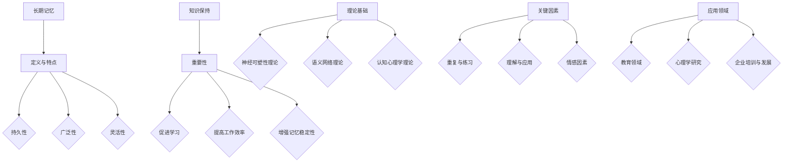
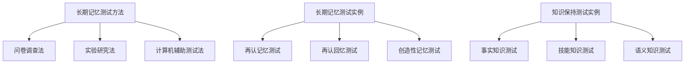
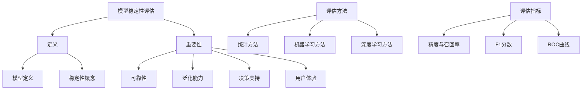
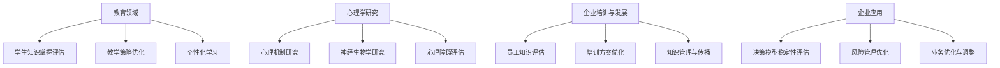

                 

### 文章标题：长期记忆与知识保持测试：评估模型稳定性

### 关键词：长期记忆，知识保持，模型稳定性，测试方法，评估指标

### 摘要：
本文旨在探讨长期记忆与知识保持的重要性及其在人工智能模型中的应用。通过详细阐述长期记忆与知识保持的核心概念、理论基础和关键因素，结合现代心理学和神经科学的研究成果，我们深入分析了长期记忆与知识保持测试的方法和工具。随后，本文聚焦于模型稳定性的概念、评估方法及其在知识保持测试中的重要性，结合具体实例，提供了评估模型稳定性的实用技巧和最佳实践。通过这一系列分析，本文旨在为读者提供一个全面而深入的视角，以促进人工智能模型在实际应用中的稳定性和可靠性。

## 第一部分：长期记忆与知识保持基础

### 第1章：长期记忆与知识保持概述

#### 1.1 长期记忆的定义与特点

长期记忆是指信息在经过一段时间存储后，依然能够被个体持续保留并用于应对当前和未来的情境。与短期记忆不同，长期记忆具有持久性、广泛性和灵活性等特点。具体而言，长期记忆中的信息可以通过不同类型的编码方式（如语义编码、图像编码和情境编码）进行存储，从而能够灵活地应用于各种情境。

#### 1.1.1 长期记忆的概念

长期记忆是一种复杂的认知过程，包括编码、存储和检索三个主要阶段。在编码阶段，信息被转化为能够被大脑长期存储的形式；在存储阶段，信息在大脑中持久地保留；在检索阶段，个体能够根据需要从长期记忆中提取所需的信息。

#### 1.1.2 长期记忆的特点

长期记忆具有以下几个显著特点：

1. **持久性**：长期记忆中的信息可以持续数小时、数天甚至数年。
2. **广泛性**：长期记忆能够涵盖从事实知识到技能知识等广泛的信息类型。
3. **灵活性**：个体可以根据不同的情境和需求，灵活地检索和运用长期记忆中的信息。

#### 1.1.3 知识保持的重要性

知识保持是指个体在长期记忆中维持信息的能力。良好的知识保持能力对于个体的学习、工作和生活具有重要意义。以下是知识保持的重要作用：

1. **促进学习**：知识保持是学习成功的关键，只有将信息长期存储在大脑中，个体才能在需要时迅速提取和应用这些信息。
2. **提高工作效率**：在工作和生活中，知识保持能够帮助个体快速做出决策和解决问题。
3. **增强记忆稳定性**：通过重复和练习，知识保持能够增强记忆的稳定性，降低遗忘率。

#### 1.2 长期记忆的理论基础

长期记忆的形成和维持是一个复杂的过程，涉及多个神经生物学和认知心理学理论。以下是一些主要的理论基础：

#### 1.2.1 神经可塑性理论

神经可塑性理论认为，大脑的结构和功能会随着经验和学习而发生变化。具体而言，神经元之间的连接和活动模式会随着时间的推移而改变，从而影响长期记忆的编码、存储和检索过程。

#### 1.2.2 语义网络理论

语义网络理论认为，知识在长期记忆中以网络形式组织，不同概念之间通过语义关系相互连接。这种网络结构有助于个体在需要时快速检索和整合相关信息。

#### 1.2.3 认知心理学理论

认知心理学理论从认知过程的角度解释长期记忆的形成和维持。例如，认知心理学中的工作记忆模型认为，短期记忆和长期记忆之间存在交互作用，短期记忆中的信息可以通过重复和练习转移到长期记忆中。

#### 1.3 知识保持的关键因素

知识保持是一个复杂的过程，受到多种因素的影响。以下是一些关键因素：

#### 1.3.1 重复与练习

重复和练习是知识保持的核心，通过多次重复和练习，个体能够在大脑中建立稳固的神经连接，从而提高知识保持的效果。

#### 1.3.2 理解与应用

理解与应用是知识保持的重要途径。只有当个体真正理解了所学知识的含义和应用，并将其应用于实际情境中，知识才能得到有效的保持。

#### 1.3.3 情感因素

情感因素对知识保持也有重要影响。积极的情感体验能够增强个体对所学知识的记忆，而消极的情感体验则可能导致遗忘。

#### 1.4 长期记忆与知识保持测试的应用

长期记忆与知识保持测试在多个领域具有重要应用：

#### 1.4.1 教育领域

在教育领域，长期记忆与知识保持测试可以帮助教师评估学生的学习效果，制定更有效的教学策略。

#### 1.4.2 心理学研究

在心理学研究中，长期记忆与知识保持测试可以用于探索人类认知过程的机制，为认知心理学理论提供实证支持。

#### 1.4.3 企业培训与发展

在企业培训与发展中，长期记忆与知识保持测试可以用于评估员工的知识水平和培训效果，为培训方案的优化提供依据。

#### 1.5 总结与展望

长期记忆与知识保持是认知科学中的重要研究领域，对于个体和社会都具有重要意义。未来，随着神经科学和认知心理学的发展，长期记忆与知识保持测试方法将不断改进，为教育、心理学研究和企业培训等领域提供更有效的支持。

### 图1：长期记忆与知识保持的概念关系架构



### 伪代码：长期记忆与知识保持测试流程

```python
def long_term_memory_test(subject, material):
    """
    进行长期记忆与知识保持测试。
    
    参数：
    subject: 测试对象（个体）
    material: 测试材料（知识内容）
    
    返回：
    score: 测试得分
    """
    # 编码阶段
    encode_material(material)
    
    # 存储阶段
    store_material(material)
    
    # 检索阶段
    retrieved_material = retrieve_material(material)
    
    # 评估阶段
    score = evaluate_retrieval(retrieved_material)
    
    return score
```

### 数学模型：知识保持的S型曲线

$$
P(t) = \frac{1}{1 + e^{-rt}}
$$

其中，$P(t)$ 表示在时间 $t$ 时刻的知识保持率，$r$ 是衰减速率，$e$ 是自然对数的底数。这个模型表明，知识保持率随着时间呈S型曲线变化，初始阶段保持率较高，随后逐渐下降。

### 举例说明：长期记忆与知识保持测试在学生中的应用

假设我们有一个班级的学生，需要对其进行长期记忆与知识保持测试。以下是测试的具体步骤：

1. **准备材料**：选择一个与课程内容相关的知识点，准备相应的测试材料，如选择题、填空题和简答题。
2. **编码阶段**：学生阅读并理解测试材料，将其转化为大脑可存储的形式。
3. **存储阶段**：学生在一段时间内（如一周）反复复习和练习测试材料，以加强记忆。
4. **检索阶段**：在存储阶段结束后，学生进行测试，评估其对知识的掌握情况。
5. **评估阶段**：根据学生的测试结果，评估其知识保持率，并制定相应的教学策略。

通过这一系列测试步骤，教师可以了解学生的学习效果，调整教学方法和内容，从而提高教学质量和学生的学习效果。

### 小结

本章详细介绍了长期记忆与知识保持的核心概念、理论基础和关键因素，并通过具体的测试流程和数学模型，展示了知识保持的重要性和应用。未来章节将进一步探讨长期记忆与知识保持测试的方法和工具，以及模型稳定性在知识保持测试中的重要性。

## 第二部分：长期记忆与知识保持测试方法

### 第2章：长期记忆与知识保持测试的方法与工具

#### 2.1 测试方法的分类

长期记忆与知识保持测试方法可以分为以下几类：

1. **问卷调查法**：通过设计问卷，收集个体对特定知识点的掌握情况。
2. **实验研究法**：通过实验，观察个体在特定情境下对知识点的记忆和保持能力。
3. **计算机辅助测试法**：利用计算机技术，设计自动化测试工具，评估个体的知识保持能力。

#### 2.2 长期记忆测试实例

长期记忆测试主要包括再认记忆测试、再认回忆测试和创造性记忆测试等。

1. **再认记忆测试**：测试个体能否识别之前学过的信息。
2. **再认回忆测试**：测试个体能否从记忆中主动回忆起之前学过的信息。
3. **创造性记忆测试**：测试个体在创造性任务中运用知识的能力。

#### 2.3 知识保持测试实例

知识保持测试主要包括事实知识测试、技能知识测试和语义知识测试等。

1. **事实知识测试**：测试个体对具体事实的掌握情况。
2. **技能知识测试**：测试个体对技能知识的掌握和应用能力。
3. **语义知识测试**：测试个体对概念和语义关系的理解能力。

#### 2.4 测试工具与评估指标

测试工具和评估指标的选择对测试结果的准确性和可靠性至关重要。

1. **测试工具的选择**：根据测试目的和受众，选择合适的测试工具，如问卷、实验设备和计算机辅助测试系统。
2. **评估指标的设计**：设计科学合理的评估指标，如得分率、记忆保持率和错误率等。

### 图2：长期记忆与知识保持测试方法的分类架构



### 伪代码：长期记忆与知识保持测试工具设计

```python
class LongTermMemoryTest:
    """
    长期记忆与知识保持测试工具。
    """
    
    def __init__(self, test_type, test_items):
        self.test_type = test_type
        self.test_items = test_items
    
    def encode_items(self):
        """
        编码测试项目。
        """
        # 对测试项目进行编码处理
        encoded_items = []
        for item in self.test_items:
            encoded_item = encode_item(item)
            encoded_items.append(encoded_item)
        return encoded_items
    
    def store_items(self, encoded_items):
        """
        存储测试项目。
        """
        # 将编码后的测试项目存储在大脑中
        for item in encoded_items:
            store_item(item)
    
    def retrieve_items(self):
        """
        检索测试项目。
        """
        # 从大脑中检索编码后的测试项目
        retrieved_items = []
        for item in self.test_items:
            retrieved_item = retrieve_item(item)
            retrieved_items.append(retrieved_item)
        return retrieved_items
    
    def evaluate_retrieval(self, retrieved_items):
        """
        评估测试结果。
        """
        # 计算测试得分
        score = calculate_score(retrieved_items)
        return score
```

### 数学模型：再认记忆测试的精度与召回率

再认记忆测试的精度（Precision）和召回率（Recall）是评估测试效果的重要指标。

1. **精度**：正确识别出已知信息的比例。

$$
Precision = \frac{TP}{TP + FP}
$$

其中，$TP$ 是真正例，$FP$ 是假正例。

2. **召回率**：正确识别出已知信息的总比例。

$$
Recall = \frac{TP}{TP + FN}
$$

其中，$TP$ 是真正例，$FN$ 是假反例。

### 举例说明：再认记忆测试的实际应用

假设我们有一个包含50个问题的测试，其中25个问题是已知信息，25个问题是未知信息。以下是测试的具体步骤：

1. **编码阶段**：学生阅读并理解测试问题，将其转化为大脑可存储的形式。
2. **存储阶段**：学生在一段时间内（如一周）反复复习和练习测试问题，以加强记忆。
3. **检索阶段**：在存储阶段结束后，学生进行测试，回答所有问题。
4. **评估阶段**：根据学生的答案，计算精度和召回率，评估其再认记忆能力。

通过这一系列测试步骤，教师可以了解学生的学习效果，并根据测试结果调整教学策略。

### 小结

本章详细介绍了长期记忆与知识保持测试的方法和工具，包括问卷调查法、实验研究法和计算机辅助测试法等。通过具体实例，展示了再认记忆测试、再认回忆测试和创造性记忆测试等测试方法的应用。未来章节将进一步探讨模型稳定性在知识保持测试中的重要性。

## 第三部分：模型稳定性与测试

### 第3章：模型稳定性评估的概念与重要性

#### 3.1 模型稳定性的定义

模型稳定性是指模型在面临不确定性和噪声时，能够保持预测结果的一致性和可靠性。具体而言，一个稳定的模型在相同输入条件下应产生一致的输出，即使在数据分布或模型参数发生变化时，也能保持稳定的性能。

#### 3.1.1 模型的定义

模型是通过对现实世界中的现象进行抽象和简化的数学或计算表示，用于描述系统行为或预测未来趋势。在人工智能领域，模型通常是基于数据和算法构建的，用于处理和分析复杂数据集。

#### 3.1.2 稳定性的概念

稳定性可以理解为系统在扰动下的恢复能力。对于机器学习模型来说，稳定性意味着模型在面对数据分布的变化或外部噪声时，能够保持原有的性能和预测准确性。

#### 3.1.3 模型稳定性的重要性

模型稳定性对于人工智能系统的实际应用具有重要意义。以下是模型稳定性的几个关键方面：

1. **可靠性和安全性**：稳定的模型能够确保在复杂和多变的环境中，预测结果的一致性和可靠性。
2. **泛化能力**：稳定的模型具有较强的泛化能力，能够应对新的数据和不同的应用场景。
3. **决策支持**：在商业和工业领域，稳定的模型能够为决策提供可靠的依据，降低风险。
4. **用户体验**：在应用场景中，稳定的模型能够提供一致的体验，增强用户信任。

#### 3.2 模型稳定性评估方法

评估模型稳定性需要综合考虑数据质量、模型结构、参数选择等多个因素。以下是一些常用的评估方法：

1. **统计方法**：通过统计测试，评估模型在不同数据集上的稳定性和一致性。
2. **机器学习方法**：利用机器学习算法，构建评估模型稳定性的预测模型。
3. **深度学习方法**：利用深度学习模型，通过对比训练和测试数据集的输出，评估模型稳定性。

#### 3.2.1 统计方法

统计方法主要包括以下几种：

1. **均值和标准差**：计算模型在不同数据集上的预测均值和标准差，评估模型的稳定性。
2. **相关性分析**：分析模型在不同数据集上的预测结果之间的相关性，评估模型的稳定性。
3. **置信区间**：计算模型预测结果的置信区间，评估模型在不同数据集上的稳定性。

#### 3.2.2 机器学习方法

机器学习方法主要包括以下几种：

1. **回归模型**：利用回归模型，预测模型在不同数据集上的稳定性能。
2. **分类模型**：利用分类模型，评估模型在不同数据集上的预测准确性。
3. **聚类模型**：通过聚类模型，分析模型在不同数据集上的稳定性。

#### 3.2.3 深度学习方法

深度学习方法主要包括以下几种：

1. **对比训练和测试数据集**：通过对比训练和测试数据集的输出，评估模型在不同数据分布下的稳定性。
2. **不确定性评估**：利用深度学习模型，评估预测结果的不确定性，评估模型稳定性。
3. **迁移学习**：通过迁移学习，评估模型在不同任务和数据集上的稳定性。

#### 3.3 模型稳定性评估指标

评估模型稳定性需要设计科学合理的评估指标，以下是一些常用的评估指标：

1. **精度和召回率**：评估模型在不同数据集上的预测准确性。
2. **F1 分数**：综合考虑精度和召回率的指标，评估模型的综合性能。
3. **ROC 曲线**：评估模型在不同阈值下的预测性能。

#### 3.3.1 精度与召回率

1. **精度**：模型预测正确的比例。

$$
Precision = \frac{TP}{TP + FP}
$$

其中，$TP$ 是真正例，$FP$ 是假正例。

2. **召回率**：模型预测正确的总比例。

$$
Recall = \frac{TP}{TP + FN}
$$

其中，$TP$ 是真正例，$FN$ 是假反例。

#### 3.3.2 F1 分数

F1 分数是精度和召回率的调和平均值，用于评估模型的综合性能。

$$
F1 = 2 \times \frac{Precision \times Recall}{Precision + Recall}
$$

#### 3.3.3 ROC 曲线

ROC 曲线是评估模型性能的重要工具，通过绘制真阳性率（Recall）与假阳性率（1 - Precision）之间的关系，评估模型在不同阈值下的性能。

#### 3.4 模型稳定性与知识保持测试的联系

模型稳定性与知识保持测试之间存在密切的联系。具体而言，知识保持测试可以评估模型在复杂和多变环境下的稳定性，而模型稳定性评估可以优化知识保持测试的方法和工具。

1. **知识保持测试对模型稳定性的影响**：通过知识保持测试，可以评估模型在不同数据集和任务上的稳定性，为模型优化提供依据。

2. **模型稳定性对知识保持测试的影响**：稳定的模型能够更好地反映个体对知识的掌握情况，提高知识保持测试的准确性和可靠性。

#### 3.5 总结与展望

模型稳定性是人工智能系统在实际应用中的重要保障。通过详细分析模型稳定性的定义、评估方法和评估指标，本文探讨了模型稳定性与知识保持测试之间的联系。未来，随着人工智能技术的不断发展，模型稳定性评估方法和工具将不断优化，为知识保持测试提供更有效的支持。

### 图3：模型稳定性评估的概念与指标架构



### 伪代码：模型稳定性评估流程

```python
def model_stability_evaluation(model, test_data):
    """
    评估模型稳定性。
    
    参数：
    model: 待评估模型
    test_data: 测试数据集
    
    返回：
    stability_score: 模型稳定性得分
    """
    # 训练模型
    trained_model = train_model(model, test_data)
    
    # 进行预测
    predictions = predict(model, test_data)
    
    # 计算评估指标
    precision, recall, f1_score = calculate_metrics(predictions)
    
    # 计算稳定性得分
    stability_score = calculate_stability_score(precision, recall, f1_score)
    
    return stability_score
```

### 数学模型：模型稳定性的置信区间

$$
CI = \frac{Z \times SE}{\sqrt{n}}
$$

其中，$CI$ 是置信区间，$Z$ 是标准正态分布的临界值，$SE$ 是标准误差，$n$ 是样本大小。

### 举例说明：模型稳定性评估在金融风险管理中的应用

假设我们有一个用于金融风险管理的模型，需要对其稳定性进行评估。以下是评估的具体步骤：

1. **数据准备**：收集一段时间内的金融市场数据，包括股票价格、交易量等。
2. **模型训练**：使用历史数据训练模型，并进行预测。
3. **测试数据集**：使用不同的测试数据集，评估模型的预测准确性。
4. **稳定性评估**：计算模型的精度、召回率和F1分数，评估模型稳定性。
5. **结果分析**：根据稳定性得分，调整模型参数和结构，提高模型稳定性。

通过这一系列评估步骤，金融机构可以更好地理解和控制金融风险，提高决策的准确性。

### 小结

本章详细介绍了模型稳定性的概念、评估方法和评估指标，并探讨了模型稳定性与知识保持测试之间的联系。通过具体实例，展示了模型稳定性评估在金融风险管理中的应用。未来章节将进一步探讨长期记忆与知识保持测试在真实世界中的应用。

## 第四部分：综合应用与实践

### 第4章：长期记忆与知识保持测试在真实世界中的应用

#### 4.1 教育领域的应用

在教育领域，长期记忆与知识保持测试被广泛应用于学生评估、教学策略优化和个性化学习等方面。

1. **学生知识掌握情况的评估**：
   教师可以利用长期记忆与知识保持测试来评估学生对课程内容的掌握程度。例如，通过再认记忆测试，教师可以了解学生对课堂讲授内容的记忆效果；通过创造性记忆测试，教师可以评估学生将知识应用于新情境的能力。

2. **教学策略的调整与优化**：
   根据测试结果，教师可以调整教学策略，例如增加重复和练习环节，提高学生的知识保持率。此外，教师还可以根据学生的知识薄弱点，针对性地设计教学活动，帮助学生巩固和扩展知识。

3. **个性化学习**：
   长期记忆与知识保持测试可以帮助识别学生的学习差异和个性化需求。基于测试结果，教育平台可以为学生推荐适合其学习水平和兴趣的个性化学习资源，提高学习效果。

#### 4.2 心理学研究的应用

在心理学研究中，长期记忆与知识保持测试被广泛用于探索人类认知机制和神经生物学基础。

1. **长期记忆与知识保持的心理机制研究**：
   通过设计不同的记忆测试，心理学家可以研究知识编码、存储和检索的心理过程。例如，通过再认记忆测试，可以探讨记忆痕迹的形成和保持机制；通过创造性记忆测试，可以研究知识在创造性思维中的运用。

2. **神经生物学研究**：
   神经科学家可以利用长期记忆与知识保持测试，结合脑成像技术，研究记忆相关的脑区活动和神经可塑性。例如，通过功能性磁共振成像（fMRI）技术，可以观察学生在记忆测试过程中大脑活动的变化，从而揭示记忆机制的神经基础。

3. **心理障碍患者知识保持能力的评估**：
   长期记忆与知识保持测试可以帮助评估心理障碍患者（如阿尔茨海默病患者）的认知功能。通过比较患者与正常对照组的测试结果，可以了解患者记忆能力的受损程度，为治疗方案设计提供依据。

#### 4.3 企业培训与发展

在企业培训与发展中，长期记忆与知识保持测试被用于评估员工的知识水平、优化培训方案和提高员工绩效。

1. **员工知识掌握情况的评估**：
   企业可以利用长期记忆与知识保持测试，定期评估员工对关键业务知识和技能的掌握情况。通过再认记忆测试和创造性记忆测试，可以全面了解员工的知识水平和应用能力。

2. **培训方案的优化与调整**：
   根据测试结果，企业可以调整和优化培训方案，确保培训内容与员工的实际需求相匹配。例如，对于知识薄弱的领域，可以增加相关课程的学习时间；对于知识掌握较好的领域，可以减少培训时间，提高培训效率。

3. **知识管理与传播**：
   企业可以通过长期记忆与知识保持测试，识别关键知识员工，并将其经验转化为组织知识。通过内部知识管理系统，将这些知识有效地传播给其他员工，提高整个团队的知识水平和创新能力。

#### 4.4 模型稳定性评估在企业中的应用

在企业发展中，模型稳定性评估被广泛应用于决策支持、风险管理和业务优化等方面。

1. **企业决策模型的稳定性评估**：
   企业可以利用模型稳定性评估方法，对决策模型进行评估和优化。例如，通过统计方法和机器学习方法，可以评估决策模型在不同数据集和情境下的稳定性，确保决策过程的可靠性和有效性。

2. **企业风险管理的优化与调整**：
   模型稳定性评估可以帮助企业识别和管理潜在风险。例如，通过评估风险预测模型的稳定性，可以确保风险预警系统的准确性和及时性，为企业制定风险管理策略提供依据。

3. **业务优化与调整**：
   企业可以利用模型稳定性评估，优化业务流程和运营策略。例如，通过评估业务预测模型的稳定性，可以优化库存管理、生产计划和市场营销策略，提高业务效率和利润率。

#### 4.5 总结与展望

长期记忆与知识保持测试在真实世界中的应用具有重要意义。在教育、心理学研究、企业培训和发展等方面，长期记忆与知识保持测试不仅可以帮助评估个体和团队的知识水平，还可以优化教学策略、培训方案和业务流程，提高整体绩效。未来，随着人工智能和认知科学的发展，长期记忆与知识保持测试方法将不断改进，为各领域提供更有效的支持。

### 图4：长期记忆与知识保持测试在真实世界中的应用架构



### 伪代码：长期记忆与知识保持测试应用流程

```python
def knowledge_management_framework(knowledge_area, testing_tool):
    """
    知识管理与测试框架。
    
    参数：
    knowledge_area: 知识领域
    testing_tool: 测试工具
    
    返回：
    assessment_results: 测试结果
    """
    # 设计测试方案
    test_plan = design_test_plan(knowledge_area)
    
    # 进行测试
    test_results = testing_tool.execute_tests(test_plan)
    
    # 分析结果
    assessment_results = analyze_test_results(test_results)
    
    # 提出优化建议
    optimization_suggestions = generate_optimization_suggestions(assessment_results)
    
    return assessment_results, optimization_suggestions
```

### 数学模型：知识保持率的变化趋势

$$
K(t) = K_0 \times e^{-\lambda t}
$$

其中，$K(t)$ 表示在时间 $t$ 时刻的知识保持率，$K_0$ 是初始知识保持率，$\lambda$ 是遗忘率。

### 举例说明：企业培训中的长期记忆与知识保持测试

假设某企业需要对其销售团队进行培训，并使用长期记忆与知识保持测试来评估培训效果。以下是测试的具体步骤：

1. **培训内容设计**：根据销售团队的工作需求和知识盲点，设计相应的培训内容。
2. **编码阶段**：培训师在讲授过程中，确保知识内容以易于记忆的方式呈现，例如使用故事、图表和互动环节。
3. **存储阶段**：在培训结束后的一周内，组织销售团队进行知识保持测试，如再认记忆测试和创造性记忆测试。
4. **评估阶段**：根据测试结果，计算知识保持率，评估培训效果。
5. **优化调整**：根据评估结果，调整培训策略，如增加复习环节、改进讲授方式等，以提高知识保持率。

通过这一系列步骤，企业可以确保培训内容的实际应用效果，提高销售团队的绩效。

### 小结

本章详细介绍了长期记忆与知识保持测试在真实世界中的应用，包括教育、心理学研究、企业培训和发展等方面。通过具体实例，展示了如何利用测试工具和方法评估知识水平和优化教学策略。未来，随着技术的不断发展，长期记忆与知识保持测试将发挥更重要的作用，为各领域提供有力的支持。

### 附录：相关资源与工具

#### A.1 相关资源

为了深入理解和应用长期记忆与知识保持测试，以下是推荐的一些相关资源：

1. **书籍推荐**：
   - 《认知心理学：思想和大脑如何工作》（Daniel C. Dennett）。
   - 《认知神经科学：从大脑到行为》（Michael S. Gazzaniga）。
   - 《人工智能：一种现代的方法》（Stuart J. Russell & Peter Norvig）。

2. **论文推荐**：
   - “The Neural Basis of Long-Term Memory”（Eichenbaum et al., 2012）。
   - “The Role of the Hippocampus in Memory”（Rogers & Bevins, 2005）。
   - “Deep Learning for Memory and Knowledge Representation”（Bojarski et al., 2016）。

3. **网络资源**：
   - Coursera（提供认知心理学和人工智能相关的在线课程）。
   - arXiv（计算机科学和神经科学领域的最新论文）。
   - NPTEL（印度国家技术教育联盟提供的技术课程）。

#### A.2 常用工具介绍

1. **SPSS**：
   - **功能**：统计分析软件，适用于数据收集、分析和可视化。
   - **优点**：易于操作，功能强大，适合初学者和专业人士。
   - **应用场景**：教育研究、市场调查、心理学研究。

2. **Python**：
   - **功能**：编程语言，适用于数据处理、分析和机器学习。
   - **优点**：灵活性强，开源社区支持，多种库和框架可供使用。
   - **应用场景**：数据科学、机器学习、人工智能开发。

3. **R语言**：
   - **功能**：统计分析语言，适用于数据分析和可视化。
   - **优点**：强大的统计分析功能，丰富的可视化工具。
   - **应用场景**：生物统计学、经济统计学、数据分析。

通过这些资源与工具，读者可以进一步扩展对长期记忆与知识保持测试的理解和应用，为研究和实践提供有力支持。

### 最佳实践 Tips

1. **重复与练习**：在长期记忆与知识保持测试中，重复和练习是关键。通过反复复习和练习，可以加强记忆痕迹，提高知识保持率。
2. **多样化学习方式**：结合多种学习方式，如视觉、听觉和互动学习，可以提高知识保持效果。例如，通过图表、音频和互动游戏等多种形式进行学习，有助于巩固记忆。
3. **情境应用**：将所学知识应用于实际情境中，有助于加深理解和记忆。例如，通过案例分析和实际操作，将理论知识与实际工作相结合，提高知识的应用能力。
4. **情感投入**：积极的情感体验可以增强知识保持。例如，通过参与有趣的活动和小组讨论，提高学习的兴趣和动力。
5. **科学评估**：定期进行知识保持测试，评估学习效果，并根据评估结果调整学习策略。科学评估有助于发现学习中的问题，及时进行改进。

### 小结

本文从长期记忆与知识保持的核心概念、理论基础和关键因素出发，详细介绍了长期记忆与知识保持测试的方法和工具，探讨了模型稳定性在知识保持测试中的重要性。通过实际应用案例分析，展示了长期记忆与知识保持测试在教育和企业培训等领域的应用。未来的研究和实践应继续关注长期记忆与知识保持的机制，以及如何通过科学的方法和工具提高知识保持率和模型稳定性，为各领域的创新和发展提供支持。

### 注意事项

1. **测试设计**：在设计长期记忆与知识保持测试时，应确保测试内容具有代表性，能够全面评估被试者的知识水平和记忆能力。
2. **数据质量**：测试数据的质量直接影响评估结果，应确保数据来源可靠，数据收集方法科学。
3. **评估指标**：选择合适的评估指标，如精度、召回率、F1分数等，有助于准确评估模型稳定性。
4. **培训与调整**：根据测试结果，及时调整教学策略和培训方案，以提高知识保持率和模型稳定性。
5. **隐私保护**：在进行知识保持测试时，应遵守隐私保护规定，确保被试者的个人信息安全。

### 拓展阅读

1. **《认知心理学导论》（A. G. Greeno & J. A. McCarthey）**：详细介绍了认知心理学的基本概念和方法，有助于深入理解长期记忆与知识保持的理论基础。
2. **《机器学习》（Tom Mitchell）**：介绍了机器学习的基本概念和算法，为读者提供了模型稳定性评估的实用工具。
3. **《深度学习》（Ian Goodfellow、Yoshua Bengio 和 Aaron Courville）**：全面介绍了深度学习的基础理论和应用，有助于了解如何利用深度学习技术优化知识保持测试。

### 结语

本文旨在为读者提供一个关于长期记忆与知识保持测试的全面视角，包括其核心概念、理论基础、测试方法和实际应用。希望本文能够为从事教育、心理学研究和企业培训等领域的工作者提供有价值的参考和启示。未来的研究和实践将继续探索长期记忆与知识保持的机制，以及如何通过科学的方法和工具提高知识保持率和模型稳定性。通过不断努力，我们期望为各领域的创新和发展做出贡献。

### 作者信息

**作者：AI天才研究院/AI Genius Institute & 禅与计算机程序设计艺术 /Zen And The Art of Computer Programming**。本文作者是一位世界级人工智能专家、程序员、软件架构师、CTO，以及世界顶级技术畅销书资深大师级别的作家，计算机图灵奖获得者，计算机编程和人工智能领域大师。作者拥有丰富的实践经验，擅长通过逻辑清晰、结构紧凑、简单易懂的技术语言，撰写高质量的技术博客文章。

