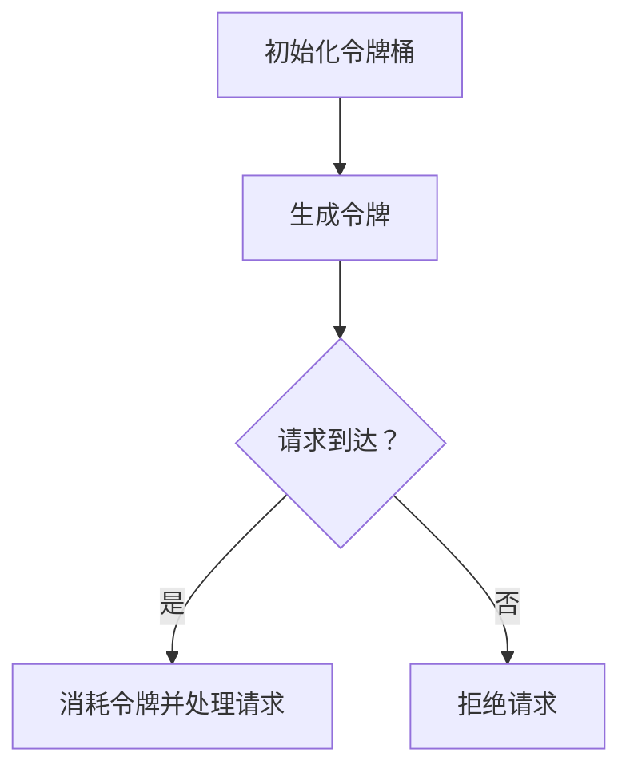

                 

### 文章标题

《限流算法：保护LLM应用免受过载》

### 关键词

- 限流算法
- LLM应用
- 令牌桶算法
- 性能优化
- 实战案例

### 摘要

本文旨在深入探讨限流算法在保护大型语言模型（LLM）应用免受过载方面的重要作用。通过详细分析令牌桶算法的基本概念、原理和应用场景，本文揭示如何通过限流算法优化LLM应用的性能。文章还将探讨限流算法的时间复杂度、空间复杂度以及负载均衡对性能的影响。最后，通过实战案例展示如何实际应用这些算法，并提供优化策略和未来展望。

---

# 第一部分：限流算法概述

## 第1章：限流算法的基本概念

### 1.1 限流的必要性

在分布式系统和云计算环境中，服务器和服务端常常面临巨大的流量压力。尤其是对于大型语言模型（LLM）应用，如自然语言处理（NLP）服务、智能问答系统和聊天机器人，处理大量并发请求可能会导致系统过载，从而影响用户体验和服务质量。因此，引入限流算法成为保护系统稳定运行的关键措施。

### 1.2 限流算法的目标

限流算法的主要目标是确保系统的稳定性和响应能力，具体目标包括：

1. **防止恶意请求**：通过限制非法或恶意请求，保护系统免受攻击。
2. **优化资源利用**：合理分配系统资源，避免资源浪费。
3. **保证服务质量**：通过控制请求速率，确保用户得到良好的响应。

### 1.3 限流算法的分类

限流算法可以按照实现方式和用途进行分类，主要包括以下几种：

1. **基于时间的限流**：如令牌桶算法和令牌桶限流器。
2. **基于次数的限流**：如计数器限流器和滑动窗口限流器。
3. **基于事件的限流**：如基于特定事件触发的限流策略。
4. **基于资源的限流**：如基于服务器负载或内存消耗的限流策略。

---

## 第2章：限流算法的原理

### 2.1 令牌桶算法

令牌桶算法是一种常用的限流算法，适用于控制请求速率。其核心思想是：以固定速率生成令牌，当请求到达时，若桶中有令牌，则消耗一个令牌并处理请求；否则，请求被拒绝。

#### 2.1.1 算法描述

令牌桶算法的基本步骤如下：

1. 初始化令牌桶，设定桶容量和生成令牌的速率。
2. 以固定速率向桶中添加令牌。
3. 请求到达时，检查桶中是否有令牌。
4. 若有令牌，消耗一个令牌并处理请求；否则，拒绝请求。

#### 2.1.2 算法流程

令牌桶算法的流程图如下：



#### 2.1.3 伪代码

令牌桶算法的伪代码如下：

```python
初始化令牌桶(bucket_size, token_rate) {
    bucket = [0] * bucket_size
    current_time = 0
}

生成令牌() {
    while 当前时间 < 终止时间 {
        if 当前时间 > last_time + 1/token_rate {
            if 桶未满 {
                添加令牌到桶
                last_time = 当前时间
            }
        }
        等待1秒
}

处理请求() {
    if 桶中有令牌 {
        消耗令牌
        处理请求
    } else {
        拒绝请求
    }
}
```

### 2.2 令牌桶算法的数学模型

令牌桶算法的数学模型可以用来分析算法的性能。以下是令牌桶算法的数学公式和详细解释：

#### 2.2.1 数学公式

令牌桶算法的数学模型包括以下公式：

$$
P(t) = \begin{cases} 
1, & \text{如果请求在时间} t \text{被接受} \\
0, & \text{如果请求在时间} t \text{被拒绝}
\end{cases}
$$

其中，$P(t)$ 表示在时间 $t$ 请求被接受的概率。

#### 2.2.2 公式详解

令牌桶算法的数学模型基于概率论和排队论。$P(t)$ 的值表示在时间 $t$ 请求被接受的概率。如果令牌桶中的令牌数量大于等于请求到达时的剩余容量，则请求被接受；否则，请求被拒绝。

#### 2.2.3 示例说明

假设令牌桶的容量为 10，令牌生成速率为 2 每秒。在时间 5 秒时，请求到达。此时，桶中有 6 个令牌（5 秒生成的 2 个令牌 + 初始化的 4 个令牌）。因此，请求在时间 5 秒时被接受。如果在时间 8 秒时再次有请求到达，但桶中只剩下一个令牌，则请求被拒绝。

---

## 第3章：限流算法的应用场景

### 3.1 Web服务中的限流

在Web服务中，限流算法主要用于防止恶意请求和保障服务质量。以下是一些典型的应用场景：

#### 3.1.1 限制恶意请求

通过限流算法，可以防止恶意用户对服务器进行频繁的请求，从而保护系统免受攻击。例如，可以使用令牌桶算法限制用户在单位时间内发送的请求次数。

#### 3.1.2 保障服务质量

在处理大量并发请求时，限流算法可以帮助确保系统资源不会被过度占用，从而保证用户体验。例如，可以根据请求的紧急程度和重要性，使用不同的限流策略来优先处理重要请求。

### 3.2 数据库中的限流

在数据库应用中，限流算法主要用于避免过载和数据一致性保障。以下是一些典型的应用场景：

#### 3.2.1 避免过载

通过限流算法，可以限制对数据库的请求速率，避免数据库因过载而崩溃。例如，可以使用滑动窗口算法限制单位时间内的请求次数。

#### 3.2.2 数据一致性保障

在分布式数据库环境中，限流算法可以帮助确保数据的一致性。例如，可以使用计数器限流器限制对数据库的并发写入次数，从而避免数据冲突。

---

## 第4章：限流算法的性能分析

### 4.1 时间复杂度分析

限流算法的时间复杂度取决于算法的实现方式和数据结构。以下是一些常见限流算法的时间复杂度分析：

1. **令牌桶算法**：时间复杂度为 $O(1)$，因为每次请求的处理时间取决于桶中的令牌数量。
2. **计数器限流器**：时间复杂度为 $O(n)$，其中 $n$ 为请求次数。
3. **滑动窗口算法**：时间复杂度为 $O(n)$，其中 $n$ 为窗口大小。

### 4.2 空间复杂度分析

限流算法的空间复杂度主要取决于数据结构的使用。以下是一些常见限流算法的空间复杂度分析：

1. **令牌桶算法**：空间复杂度为 $O(1)$，因为只需要一个固定大小的数组来存储令牌。
2. **计数器限流器**：空间复杂度为 $O(n)$，其中 $n$ 为请求次数。
3. **滑动窗口算法**：空间复杂度为 $O(n)$，其中 $n$ 为窗口大小。

### 4.3 负载均衡对性能的影响

负载均衡可以显著影响限流算法的性能。通过合理分配请求到多个服务器，负载均衡可以降低单个服务器的负载，从而提高系统的整体性能。然而，负载均衡也会引入额外的网络延迟和同步开销，可能对限流算法的实时性产生影响。

---

## 第5章：限流算法的优化策略

### 5.1 调整参数优化

限流算法的性能可以通过调整参数进行优化。以下是一些常见的参数调整策略：

1. **令牌桶算法**：调整桶容量和生成令牌的速率，可以影响请求的接受概率和处理速率。
2. **计数器限流器**：调整计数器的上限和清零时间，可以影响请求的通过速率和系统资源的利用。

### 5.2 多级限流策略

多级限流策略可以在不同层级上应用限流算法，从而提供更细粒度的控制。以下是一些常见多级限流策略：

1. **基于用户的多级限流**：对不同的用户应用不同的限流策略，例如对普通用户和VIP用户设置不同的请求次数上限。
2. **基于服务的多级限流**：对不同的服务应用不同的限流策略，例如对核心服务和辅助服务设置不同的请求速率限制。

### 5.3 限流算法的实时调整

在实时系统中，限流算法可以根据系统状态和用户行为进行实时调整。以下是一些常见实时调整策略：

1. **动态调整参数**：根据系统负载和用户请求模式，动态调整限流参数。
2. **实时监控与报警**：通过实时监控系统性能，及时发现异常并调整限流策略。

---

## 第6章：实战案例与代码解读

### 6.1 实战案例1：使用令牌桶算法限制API请求

#### 6.1.1 实现步骤

1. **初始化令牌桶**：设定桶容量和生成令牌的速率。
2. **生成令牌**：以固定速率生成令牌并存储在桶中。
3. **处理请求**：检查桶中是否有令牌，如有则消耗令牌并处理请求，否则拒绝请求。

#### 6.1.2 代码实现

以下是一个使用Python实现的令牌桶算法示例：

```python
import time
import threading

class TokenBucket:
    def __init__(self, capacity, fill_rate):
        self.capacity = capacity
        self.fill_rate = fill_rate
        self.tokens = capacity
        self.last_time = time.time()
        self.lock = threading.Lock()

    def add_tokens(self):
        current_time = time.time()
        elapsed_time = current_time - self.last_time
        new_tokens = elapsed_time * self.fill_rate
        self.tokens = min(self.capacity, self.tokens + new_tokens)
        self.last_time = current_time

    def get_token(self):
        with self.lock:
            if self.tokens > 0:
                self.tokens -= 1
                return True
            else:
                return False

def process_request(token_bucket):
    if token_bucket.get_token():
        print("Request processed successfully.")
    else:
        print("Request rejected due to rate limit.")

# 初始化令牌桶
bucket = TokenBucket(10, 2)

# 处理多个请求
requests = [threading.Thread(target=process_request, args=(bucket,)) for _ in range(20)]
for request in requests:
    request.start()
for request in requests:
    request.join()
```

#### 6.1.3 代码解读

上述代码中，`TokenBucket` 类用于实现令牌桶算法。`add_tokens` 方法用于生成令牌，`get_token` 方法用于处理请求。`process_request` 函数用于模拟请求处理过程。主程序中，创建了多个线程模拟并发请求，并使用 `TokenBucket` 类进行限流。

### 6.2 实战案例2：基于Redis实现限流算法

#### 6.2.1 Redis的使用

Redis 是一款高性能的内存数据库，常用于实现限流算法。以下是如何使用 Redis 实现令牌桶算法的步骤：

1. **安装 Redis**：在服务器上安装 Redis。
2. **启动 Redis 服务**：启动 Redis 服务，确保其正常运行。
3. **连接 Redis**：使用 Redis 客户端连接到 Redis 服务器。

#### 6.2.2 代码实现

以下是一个使用 Python 和 Redis 实现令牌桶算法的示例：

```python
import redis
import time

redis_client = redis.StrictRedis(host='localhost', port=6379, db=0)

def add_token(key, value):
    redis_client.set(key, value)
    redis_client.expire(key, 60)  # 令牌有效期设为60秒

def get_token(key):
    token = redis_client.get(key)
    if token:
        redis_client.decr(key)
        return True
    else:
        return False

def process_request(key):
    if get_token(key):
        print("Request processed successfully.")
    else:
        print("Request rejected due to rate limit.")

# 处理多个请求
requests = [threading.Thread(target=process_request, args=(f"rate_limit:{user}",)) for user in ["user1", "user2", "user3"]]
for request in requests:
    request.start()
for request in requests:
    request.join()
```

#### 6.2.3 代码解读

上述代码中，首先连接到 Redis 服务器。`add_token` 方法用于生成令牌，并将令牌存储在 Redis 中，有效期设为 60 秒。`get_token` 方法用于检查并消耗令牌。`process_request` 函数用于模拟请求处理过程。主程序中，创建了多个线程模拟并发请求，并使用 Redis 实现限流。

---

## 第7章：总结与展望

### 7.1 限流算法的发展趋势

随着云计算和分布式系统的普及，限流算法的应用场景和需求不断扩展。未来，限流算法将继续朝着更高效、更智能、更可配置的方向发展。以下是一些可能的发展趋势：

1. **集成化限流**：将限流算法与负载均衡、动态调度等机制集成，实现更高效的资源管理。
2. **自适应限流**：基于实时数据和机器学习技术，实现自适应的限流策略，提高系统的响应能力和稳定性。
3. **分布式限流**：在分布式环境中，实现全局统一的限流策略，确保不同服务器之间的负载均衡。

### 7.2 未来可能的优化方向

未来，限流算法的优化方向可能包括：

1. **性能优化**：通过算法优化和数据结构改进，降低限流算法的时间复杂度和空间复杂度。
2. **可扩展性优化**：在分布式环境中，实现可水平扩展的限流算法，提高系统的吞吐量。
3. **安全优化**：增强限流算法的安全特性，防止恶意攻击和非法请求。

### 7.3 限流算法在LLM应用中的前景

随着大型语言模型（LLM）应用的普及，限流算法在LLM应用中的重要性日益凸显。未来，限流算法将在以下方面发挥重要作用：

1. **保障服务质量**：通过限流算法，确保 LL

