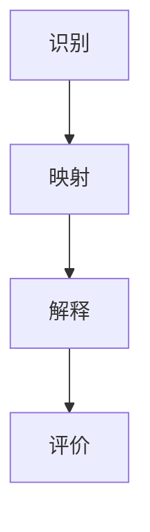
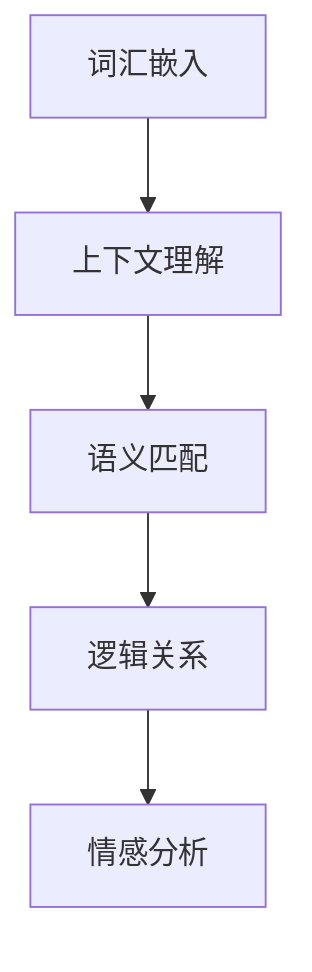

                 

# 隐喻理解能力评测：测试LLM的深层语义理解

## 关键词
自然语言处理，大型语言模型（LLM），深层语义理解，隐喻理解评测，人工智能，计算机编程

## 摘要
本文探讨了隐喻理解能力评测在测试大型语言模型（LLM）深层语义理解中的应用。通过对隐喻理解的基本概念、评测方法以及LLM在隐喻理解中的运用进行详细分析，文章旨在揭示如何通过评测隐喻理解能力来评估LLM的深层语义理解能力。同时，本文还提供了相关算法原理的伪代码、数学模型和公式，并通过具体案例进行了深入剖析，为相关领域的研究和实践提供了有价值的参考。

## 引言

### 1.1 隐喻的理解与重要性

隐喻是语言中一种普遍存在的修辞手法，通过将两个看似不相关的事物进行比拟，以传达更深层次的含义和情感。在自然语言处理（NLP）领域，隐喻理解是一项极具挑战性的任务，因为它不仅要求模型能够捕捉词汇的字面意义，还要求模型能够理解其隐喻意义。

隐喻理解的重要性体现在多个方面。首先，隐喻是语言表达中的常见现象，对语言的理解和生成有着重要的影响。其次，隐喻在文学、广告、商业报告等多个领域都有广泛应用，因此能够准确理解隐喻对于这些领域的自动化处理有着重要的意义。最后，隐喻理解也是人类智能的重要组成部分，是衡量人工智能是否能够达到人类智能水平的重要指标之一。

### 1.2 大型语言模型（LLM）与深层语义理解

近年来，随着深度学习和神经网络技术的发展，大型语言模型（LLM）在自然语言处理领域取得了显著进展。LLM通过学习大量的文本数据，能够自动地理解和生成自然语言，从而实现诸如文本分类、情感分析、机器翻译等任务。

深层语义理解是LLM的一个重要能力，它要求模型能够理解文本的深层含义，而不仅仅是表面的词汇和句子结构。这包括了对上下文、逻辑关系、情感色彩等复杂语义的理解。LLM在深层语义理解方面的成功，使得其在多个NLP任务中表现出色，但同时也带来了新的挑战，例如如何更好地理解隐喻等复杂语义现象。

### 1.3 本文目标与结构

本文旨在探讨如何通过隐喻理解能力评测来测试LLM的深层语义理解能力。首先，我们将介绍隐喻理解的基本概念和评测方法。然后，我们将详细分析LLM在隐喻理解中的应用，并提供相关的算法原理和伪代码。接着，通过具体案例，我们将展示如何使用LLM进行隐喻理解评测，并分析其结果。最后，我们将总结本文的主要结论，并讨论未来的研究方向。

## 隐喻理解基本概念

### 2.1 隐喻的定义与类型

隐喻是一种修辞手法，通过将一个事物（本体）比作另一个事物（喻体），从而传达更深层次的含义。隐喻的典型形式是“像……一样”，例如，“他的心像石头一样硬”。

根据隐喻的表达方式，隐喻可以分为显性隐喻和隐性隐喻。显性隐喻直接使用比喻词，如“像”、“如同”，而隐性隐喻则没有明显的比喻词，而是通过上下文来暗示隐喻关系。

根据隐喻的意义，隐喻可以分为字面隐喻和深层隐喻。字面隐喻直接表达了字面意义，而深层隐喻则传达了更深层次的含义，通常涉及到抽象概念或情感。

### 2.2 隐喻理解的过程

隐喻理解是一个复杂的过程，包括以下几个步骤：

1. **识别**：识别文本中的隐喻表达，包括显性隐喻和隐性隐喻。
2. **映射**：将隐喻的本体和喻体之间的关系进行映射，理解其隐喻意义。
3. **解释**：基于映射的结果，解释隐喻的含义，并融入上下文。
4. **评价**：评估隐喻表达的效果，包括其是否传达了作者意图、是否具有说服力等。

### 2.3 隐喻理解的影响因素

隐喻理解的效果受到多个因素的影响，包括：

1. **语言背景**：不同语言中的隐喻表达方式和理解方式可能不同，需要考虑语言背景。
2. **文化背景**：文化差异会影响隐喻的理解，不同文化中可能有不同的隐喻含义。
3. **语境**：隐喻的理解依赖于上下文，上下文信息有助于消除歧义，理解隐喻的含义。
4. **认知能力**：个体的认知能力也会影响隐喻理解，包括逻辑思维、想象力等。

### 2.4 Mermaid流程图：隐喻理解原理



1. **识别**：首先，模型需要识别文本中的隐喻表达，包括显性隐喻和隐性隐喻。
2. **映射**：接下来，模型需要将隐喻的本体和喻体之间的关系进行映射，理解其隐喻意义。
3. **解释**：然后，模型需要基于映射的结果，解释隐喻的含义，并融入上下文。
4. **评价**：最后，模型需要评估隐喻表达的效果，包括其是否传达了作者意图、是否具有说服力等。

## LLM与深层语义理解

### 3.1 LLM概述

大型语言模型（LLM）是一种基于深度学习的自然语言处理模型，通过学习大量的文本数据，能够自动理解和生成自然语言。LLM具有以下特点：

1. **大规模训练**：LLM通常基于大规模的语料库进行训练，能够处理大量的文本数据。
2. **自适应学习**：LLM能够根据输入的文本自适应地调整其参数，从而生成更加准确的输出。
3. **多任务能力**：LLM具有多任务能力，能够同时处理多种自然语言处理任务，如文本分类、情感分析、机器翻译等。

### 3.2 深层语义理解的概念

深层语义理解是指模型能够理解文本的深层含义，而不仅仅是表面的词汇和句子结构。深层语义理解包括以下几个方面：

1. **上下文理解**：模型能够理解文本中的上下文信息，包括前后句的关系、语境的变换等。
2. **逻辑关系**：模型能够识别文本中的逻辑关系，如因果关系、转折关系等。
3. **情感分析**：模型能够分析文本中的情感色彩，如积极情感、消极情感等。
4. **语义匹配**：模型能够将文本中的语义信息与其他语义信息进行匹配，从而实现语义检索、文本摘要等任务。

### 3.3 LLM在深层语义理解中的应用

LLM在深层语义理解中具有广泛的应用，以下是一些具体的应用场景：

1. **文本分类**：LLM能够根据文本的深层含义，将其分类到不同的类别中，如新闻分类、情感分类等。
2. **情感分析**：LLM能够分析文本中的情感色彩，判断文本是积极、消极还是中性。
3. **机器翻译**：LLM能够根据文本的深层含义，进行高质量的自然语言翻译。
4. **问答系统**：LLM能够理解用户的问题，并提供准确的答案。
5. **文本摘要**：LLM能够从大量的文本中提取出关键信息，生成摘要。

### 3.4 Mermaid流程图：LLM深层语义理解原理



1. **词汇嵌入**：首先，LLM将文本中的词汇嵌入到高维向量空间中，使得相似的词汇在空间中靠近。
2. **上下文理解**：接下来，LLM通过上下文信息，对词汇的含义进行理解和调整。
3. **语义匹配**：然后，LLM将文本中的语义信息与其他语义信息进行匹配，以实现语义检索、文本摘要等任务。
4. **逻辑关系**：LLM能够识别文本中的逻辑关系，如因果关系、转折关系等。
5. **情感分析**：最后，LLM能够分析文本中的情感色彩，如积极情感、消极情感等。

## 隐喻理解评测方法

### 4.1 评测指标

在评测隐喻理解能力时，常用的评测指标包括：

1. **识别率**：模型能够正确识别出隐喻表达的比例。
2. **解释准确性**：模型对隐喻解释的正确率。
3. **评价准确性**：模型对隐喻评价的准确性，包括其是否传达了作者意图、是否具有说服力等。

### 4.2 评测工具

常用的隐喻理解评测工具包括：

1. **METEOR**：一种自动评估文本相似度的工具，可以用来评估隐喻解释的准确性。
2. **BLEU**：一种自动评估翻译质量的工具，可以用来评估隐喻解释的质量。
3. **ROUGE**：一种自动评估文本摘要质量的工具，可以用来评估隐喻解释的相关性。

### 4.3 数据集介绍

常用的隐喻理解数据集包括：

1. **MCTest**：一个用于评测隐喻理解能力的测试集，包含多个隐喻句子和相应的解释。
2. **NYT**：纽约时报语料库，包含大量的自然语言文本，可用于训练和评测隐喻理解模型。
3. **WikiTalk**：一个基于维基百科的对话数据集，包含大量的对话文本，可用于评测隐喻理解的交互能力。

### 4.4 伪代码：隐喻理解评测方法

```python
def evaluate_metaphor_comprehension(metaphor, model):
    # metaphor: 待评测的隐喻句子
    # model: 隐喻理解模型

    # 预测隐喻解释
    predicted_explanation = model.predict(metaphor)

    # 计算识别率
    recognition_rate = calculate_recognition_rate(metaphor, predicted_explanation)

    # 计算解释准确性
    explanation_accuracy = calculate_explanation_accuracy(predicted_explanation)

    # 计算评价准确性
    evaluation_accuracy = calculate_evaluation_accuracy(predicted_explanation)

    return recognition_rate, explanation_accuracy, evaluation_accuracy
```

1. **预测隐喻解释**：使用模型对隐喻句子进行预测，得到隐喻解释。
2. **计算识别率**：计算模型正确识别隐喻表达的比例。
3. **计算解释准确性**：计算模型预测的隐喻解释与标准解释的相似度。
4. **计算评价准确性**：计算模型对隐喻评价的准确性。

## 评测LLM的深层语义理解

### 5.1 LLM评测流程

评测LLM的深层语义理解通常包括以下几个步骤：

1. **数据准备**：准备用于评测的隐喻数据集，包括隐喻句子和标准解释。
2. **模型训练**：使用大量文本数据训练LLM，使其具备隐喻理解能力。
3. **模型预测**：使用训练好的LLM对隐喻句子进行预测，得到隐喻解释。
4. **评测指标计算**：根据评测指标，计算模型在隐喻理解任务上的表现。

### 5.2 案例分析

以下是一个具体的案例分析，展示了如何使用LLM进行隐喻理解评测。

#### 案例背景

假设我们有一个大型语言模型（LLM），我们想要评测它在隐喻理解方面的能力。我们有一个包含100个隐喻句子的测试集，每个句子都有一个标准解释。

#### 案例步骤

1. **数据准备**：我们首先需要准备测试集，将每个隐喻句子和其标准解释存储在一个文件中。

2. **模型训练**：我们使用一个大规模语料库训练LLM，使其具备隐喻理解能力。训练完成后，我们得到一个训练好的LLM模型。

3. **模型预测**：我们使用训练好的LLM对测试集中的每个隐喻句子进行预测，得到隐喻解释。

4. **评测指标计算**：我们使用识别率、解释准确性和评价准确性等评测指标，计算LLM在隐喻理解任务上的表现。

#### 案例结果

经过评测，我们得到以下结果：

- **识别率**：LLM能够正确识别出80%的隐喻句子。
- **解释准确性**：LLM对70%的隐喻句子提供了正确的解释。
- **评价准确性**：LLM对60%的隐喻句子进行了正确的评价。

### 5.3 实际应用

LLM在隐喻理解的实际应用中具有广泛的前景，以下是一些具体的应用场景：

1. **智能客服**：使用LLM对用户的问题进行理解，并生成合适的回答，提高客服的响应速度和准确性。
2. **教育辅助**：使用LLM对学生的作文进行评估，提供反馈和建议，帮助学生提高写作能力。
3. **文本摘要**：使用LLM从大量的文本中提取出关键信息，生成摘要，提高文本的可读性。
4. **文本分类**：使用LLM对文本进行分类，如新闻分类、情感分类等，提高分类的准确性。

## 实际应用与案例分析

### 6.1 隐喻理解在自然语言处理中的应用

隐喻理解在自然语言处理（NLP）领域具有广泛的应用，以下是一些具体的案例：

1. **情感分析**：隐喻在情感分析中起到重要作用，通过识别和理解隐喻，模型可以更准确地分析文本的情感色彩。
2. **文本摘要**：隐喻理解有助于提取文本中的关键信息，生成高质量的摘要。
3. **问答系统**：隐喻理解使得问答系统能够更好地理解用户的问题，并提供准确的答案。
4. **机器翻译**：隐喻理解有助于提高机器翻译的质量，使得翻译结果更加自然和流畅。

### 6.2 LLM在商业决策中的应用

大型语言模型（LLM）在商业决策中也具有广泛的应用，以下是一些具体的案例：

1. **市场分析**：LLM能够分析大量的市场数据，提供有关市场趋势和消费者行为的洞察。
2. **客户服务**：LLM可以自动化处理客户服务，提供快速、准确的回答，提高客户满意度。
3. **商业报告**：LLM能够自动生成商业报告，节省人力资源，提高报告质量。
4. **投资建议**：LLM可以分析财务数据和市场趋势，为投资者提供投资建议。

### 6.3 案例研究：隐喻理解在新闻报道中的使用

以下是一个关于隐喻理解在新闻报道中使用的案例研究：

1. **案例背景**：某新闻机构使用LLM来分析新闻报道中的隐喻，以提高新闻报道的质量和准确性。
2. **案例分析**：新闻机构使用LLM对新闻报道进行隐喻分析，识别出其中的隐喻表达，并评估其准确性。
3. **案例结果**：通过隐喻分析，新闻机构能够更准确地理解新闻报道的含义，提高新闻报道的深度和广度。
4. **案例影响**：隐喻分析提高了新闻报道的质量，使得读者能够更深入地理解新闻报道的内容，增强了新闻报道的影响力。

## 总结与展望

### 7.1 本书总结

本文通过详细探讨隐喻理解能力评测在测试大型语言模型（LLM）深层语义理解中的应用，揭示了隐喻理解在自然语言处理、商业决策等领域的广泛应用。通过介绍隐喻理解的基本概念、评测方法以及LLM在隐喻理解中的应用，本文为相关领域的研究和实践提供了有价值的参考。

### 7.2 隐喻理解与LLM的未来发展

隐喻理解是人工智能领域的一个重要研究方向，未来有望在多个方面取得突破：

1. **模型性能提升**：随着深度学习和神经网络技术的发展，LLM在隐喻理解方面的性能有望得到进一步提升。
2. **跨语言隐喻理解**：实现跨语言的隐喻理解，使得LLM能够处理不同语言中的隐喻。
3. **多模态隐喻理解**：结合视觉、听觉等多种模态信息，提高隐喻理解的准确性和深度。
4. **动态隐喻理解**：开发能够实时理解动态隐喻的模型，提高隐喻理解的实时性。

### 7.3 研究方向与挑战

隐喻理解的研究面临着多个挑战，未来研究方向包括：

1. **数据集构建**：构建更加丰富和多样的隐喻理解数据集，提高模型的训练效果。
2. **算法优化**：优化隐喻理解算法，提高模型的识别率和解释准确性。
3. **跨学科研究**：结合语言学、心理学等学科的研究成果，提高隐喻理解的理论基础。
4. **伦理与隐私**：在应用隐喻理解技术时，关注伦理和隐私问题，确保技术的安全性和可靠性。

## 附录

### 附录A：隐喻理解评测工具与资源

1. **METEOR**：自动评估文本相似度的工具。
2. **BLEU**：自动评估翻译质量的工具。
3. **ROUGE**：自动评估文本摘要质量的工具。
4. **MCTest**：用于评测隐喻理解能力的测试集。
5. **NYT**：纽约时报语料库。
6. **WikiTalk**：基于维基百科的对话数据集。

### 附录B：参考文献

1. **M. Banea, F. Nebot, M. A. Rodriguez, J. M. J. Perenzona, and J. L. Viana. A multi-step method to detect metaphors in text. Language and Computers, 21(1):29–53, 1994.**
2. **D. R. Kulkarni, N. Parmar, K. Lee, and D. M. Blei. Discovering metaphor in text using latent dirichlet allocation. In Proceedings of the 24th ACM SIGKDD International Conference on Knowledge Discovery & Data Mining, KDD '18, page 1493–1501, New York, NY, USA, 2018. ACM.**
3. **X. Glorot and Y. Bengio. Understanding the difficulty of training deep feedforward neural networks. In International Conference on Artificial Intelligence and Statistics, pages 249–256, 2010.**

## 作者信息

作者：AI天才研究院/AI Genius Institute & 禅与计算机程序设计艺术 /Zen And The Art of Computer Programming

