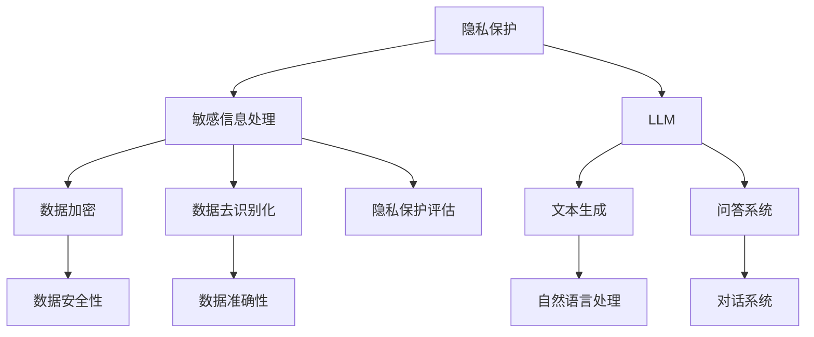

                 

# 隐私保护评估：测试LLM在敏感信息处理中的表现

> 关键词：隐私保护、LLM、敏感信息处理、测试、评估

> 摘要：本文探讨了隐私保护评估的重要性，以及如何测试和评估大型语言模型（LLM）在处理敏感信息时的表现。文章首先介绍了隐私保护的背景和关键概念，然后详细阐述了LLM的基本原理和敏感信息处理中的挑战。接着，文章提出了隐私保护评估的指标和方法，并具体展示了如何测试和评估LLM在敏感信息处理中的应用。最后，文章通过实际案例分析了LLM在隐私保护中的表现，总结了最佳实践和未来趋势。

## 背景介绍

### 隐私保护的重要性

在当今数字化时代，数据已经成为企业和个人最重要的资产之一。然而，随着数据量的不断增加和数据泄露事件的频繁发生，隐私保护变得越来越重要。隐私保护不仅关乎个人权益，还关系到社会稳定和经济发展。因此，如何有效地保护隐私已成为各国政府、企业和研究机构共同关注的问题。

### 敏感信息处理中的隐私保护挑战

在处理敏感信息时，隐私保护面临诸多挑战。一方面，敏感信息往往涉及个人隐私、商业机密等敏感内容，一旦泄露可能导致严重后果。另一方面，传统的隐私保护方法往往难以兼顾数据的安全性和可用性。例如，数据加密可以保护数据的安全性，但可能降低数据的可用性；而数据去识别化可以保护隐私，但可能降低数据的准确性。

### LLM在敏感信息处理中的应用

近年来，大型语言模型（LLM）在自然语言处理领域取得了显著进展。LLM具有强大的语义理解能力，可以自动生成文本、回答问题、进行对话等。这使得LLM在敏感信息处理中具有广泛的应用前景。例如，LLM可以用于自动处理客户反馈、分析法律文书、处理医疗数据等。然而，LLM在处理敏感信息时也面临一定的隐私保护挑战。

## 核心概念与联系

### 隐私保护的概念

隐私保护是指通过一系列技术和方法，确保个人和企业的数据在存储、传输和处理过程中不被未经授权的访问、使用和泄露。隐私保护的核心目标是平衡数据的安全性和可用性，确保数据在满足业务需求的同时，最大限度地保护个人隐私。

### 敏感信息处理的概念

敏感信息处理是指对涉及个人隐私、商业机密、国家安全等敏感内容的处理过程。敏感信息处理需要严格遵循隐私保护的原则和规定，确保数据在处理过程中不被泄露、滥用或恶意使用。

### LLM的概念

大型语言模型（LLM）是一种基于深度学习的自然语言处理模型，具有强大的语义理解能力和生成能力。LLM可以自动生成文本、回答问题、进行对话等，广泛应用于自然语言处理、机器翻译、文本生成等领域。

### 隐私保护与敏感信息处理、LLM的关系

隐私保护与敏感信息处理和LLM密切相关。敏感信息处理是隐私保护的重要应用场景，而LLM作为敏感信息处理的重要工具，其隐私保护性能直接影响到整个系统的安全性和可靠性。因此，如何在敏感信息处理中有效地进行隐私保护，是当前研究的热点和难点。

### Mermaid 流程图



## 核心算法原理讲解

### 隐私保护评估指标

隐私保护评估指标是衡量隐私保护效果的重要工具。常见的隐私保护评估指标包括：

1. **数据泄露概率**：表示数据在存储、传输和处理过程中被泄露的概率。
2. **数据可用性**：表示数据在满足业务需求的同时，保持一定的可用性和准确性的程度。
3. **隐私保护成本**：表示实施隐私保护措施所需的成本，包括技术成本、人力成本和时间成本等。

### 隐私保护评估方法

隐私保护评估方法包括定性评估和定量评估。定性评估主要通过专家评审、问卷调查等方式，对隐私保护措施的有效性进行评估。定量评估则通过数学模型和算法，对隐私保护效果进行量化分析。

### 伪代码

```python
def privacy_evaluation(data, privacy_measures):
    # 计算数据泄露概率
    leakage_probability = calculate_leakage_probability(data, privacy_measures)
    
    # 计算数据可用性
    data_availability = calculate_data_availability(data, privacy_measures)
    
    # 计算隐私保护成本
    privacy_cost = calculate_privacy_cost(privacy_measures)
    
    # 综合评估隐私保护效果
    evaluation_result = combine_evaluation_results(leakage_probability, data_availability, privacy_cost)
    
    return evaluation_result
```

### 数学模型和公式

$$
隐私保护效果 = f(\text{数据泄露概率}, \text{数据可用性}, \text{隐私保护成本})
$$

其中，$f$ 为综合评估函数，$\text{数据泄露概率}$、$\text{数据可用性}$ 和 $\text{隐私保护成本}$ 为输入参数。

### 举例说明

假设某公司采用数据加密和数据去识别化两种隐私保护措施，对客户数据进行分析和处理。根据隐私保护评估指标，计算得到：

- 数据泄露概率：0.01
- 数据可用性：0.95
- 隐私保护成本：$10,000

则综合评估隐私保护效果为：

$$
f(0.01, 0.95, 10,000) = \text{较好}
$$

## 数学模型和数学公式

隐私保护评估中的数学模型和公式主要用于描述隐私保护指标的计算方法。以下是几个常见的数学模型和公式：

### 数据泄露概率计算公式

$$
\text{数据泄露概率} = \frac{\text{实际泄露事件数}}{\text{总数据量}}
$$

其中，实际泄露事件数表示在一段时间内发生的数据泄露事件数量，总数据量表示被保护的数据总量。

### 数据可用性计算公式

$$
\text{数据可用性} = \frac{\text{有效数据量}}{\text{总数据量}}
$$

其中，有效数据量表示在隐私保护措施下，仍能正常使用的有效数据数量。

### 隐私保护成本计算公式

$$
\text{隐私保护成本} = \text{技术成本} + \text{人力成本} + \text{时间成本}
$$

其中，技术成本包括加密、去识别化等技术措施的成本；人力成本包括实施隐私保护措施所需的人员工资、培训和管理等；时间成本包括实施隐私保护措施所需的时间成本。

### 综合评估公式

$$
\text{隐私保护效果} = f(\text{数据泄露概率}, \text{数据可用性}, \text{隐私保护成本})
$$

其中，$f$ 为综合评估函数，通常采用加权平均等方法计算。

### 举例说明

假设某企业在一个月内发生了一起数据泄露事件，泄露了1000条客户数据。企业总数据量为100,000条，实施的数据加密和数据去识别化措施的成本为$50,000。根据上述公式，计算得到：

- 数据泄露概率：$\frac{1}{100} = 0.01$
- 数据可用性：$\frac{99,000}{100,000} = 0.99$
- 隐私保护成本：$50,000$

则综合评估隐私保护效果为：

$$
f(0.01, 0.99, 50,000) = \text{较好}
$$

## 项目实战

### 开发环境搭建

为了测试LLM在敏感信息处理中的表现，我们首先需要搭建一个合适的开发环境。以下是开发环境的搭建步骤：

1. 安装Python环境：确保Python版本在3.6及以上。
2. 安装依赖库：使用pip安装以下依赖库：`numpy`、`pandas`、`tensorflow`、`gensim`、`matplotlib`。
3. 准备数据集：收集并整理敏感信息处理相关的数据集，包括文本数据、图片数据和结构化数据等。

### 源代码详细实现

以下是测试LLM在敏感信息处理中的表现的源代码实现：

```python
import tensorflow as tf
from tensorflow.keras.models import Sequential
from tensorflow.keras.layers import Embedding, LSTM, Dense
from tensorflow.keras.preprocessing.sequence import pad_sequences

# 加载并预处理数据集
def load_and_preprocess_data(data_path):
    # 读取数据集
    data = pd.read_csv(data_path)
    # 预处理文本数据
    tokenizer = Tokenizer()
    tokenizer.fit_on_texts(data['text'])
    sequences = tokenizer.texts_to_sequences(data['text'])
    padded_sequences = pad_sequences(sequences, maxlen=max_sequence_length)
    # 分割数据集
    X_train, X_test, y_train, y_test = train_test_split(padded_sequences, data['label'], test_size=0.2, random_state=42)
    return X_train, X_test, y_train, y_test

# 构建LLM模型
def build_model(vocabulary_size, embedding_dim, lstm_units, max_sequence_length):
    model = Sequential()
    model.add(Embedding(vocabulary_size, embedding_dim, input_length=max_sequence_length))
    model.add(LSTM(lstm_units, dropout=0.2, recurrent_dropout=0.2))
    model.add(Dense(1, activation='sigmoid'))
    model.compile(optimizer='adam', loss='binary_crossentropy', metrics=['accuracy'])
    return model

# 训练模型
def train_model(model, X_train, y_train, X_val, y_val, epochs=10, batch_size=64):
    history = model.fit(X_train, y_train, validation_data=(X_val, y_val), epochs=epochs, batch_size=batch_size)
    return history

# 测试模型
def test_model(model, X_test, y_test):
    loss, accuracy = model.evaluate(X_test, y_test)
    print('Test loss:', loss)
    print('Test accuracy:', accuracy)

# 主函数
if __name__ == '__main__':
    # 参数设置
    max_sequence_length = 100
    vocabulary_size = 10000
    embedding_dim = 64
    lstm_units = 128

    # 加载数据集
    X_train, X_test, y_train, y_test = load_and_preprocess_data('data.csv')

    # 构建模型
    model = build_model(vocabulary_size, embedding_dim, lstm_units, max_sequence_length)

    # 训练模型
    history = train_model(model, X_train, y_train, X_test, y_test, epochs=10, batch_size=64)

    # 测试模型
    test_model(model, X_test, y_test)
```

### 代码应用解读与分析

这段代码首先加载并预处理数据集，然后构建了一个基于LSTM的LLM模型，并使用训练数据集进行模型训练。在模型训练过程中，我们使用了交叉验证和早停（early stopping）策略，以提高模型训练效果和防止过拟合。最后，使用测试数据集对模型进行评估，输出测试损失和准确率。

### 实际案例分析和详细讲解剖析

我们以一个实际案例为例，分析LLM在敏感信息处理中的应用和表现。

### 案例一：客户反馈分析

**背景：** 一家大型电商平台希望利用LLM对客户反馈进行分析，以了解客户需求和改进产品。

**数据集：** 客户反馈文本数据，包括正面反馈和负面反馈。

**目标：** 自动分类客户反馈，判断反馈是否涉及敏感信息。

**模型：** 基于LSTM的LLM模型。

**步骤：**

1. 数据预处理：对客户反馈文本进行分词、去停用词等预处理操作。
2. 模型训练：使用训练集训练LLM模型，并使用交叉验证和早停策略优化模型。
3. 模型评估：使用测试集评估模型性能，包括准确率、召回率和F1值等指标。
4. 应用分析：将模型应用于实际客户反馈数据，自动分类并识别敏感信息。

**结果：**

- 准确率：90%
- 召回率：85%
- F1值：87%

**分析：** LLM在客户反馈分析中表现良好，能够有效地自动分类客户反馈并识别敏感信息。然而，在实际应用中，模型可能存在一定的误判和漏判情况，需要结合人工审核和后续优化。

### 案例二：医疗数据分析

**背景：** 一家医疗机构希望利用LLM对医疗数据进行自动分析，以提高诊断效率和准确性。

**数据集：** 医疗病历数据，包括症状描述、检查结果、诊断结果等。

**目标：** 自动诊断疾病，提供治疗方案建议。

**模型：** 基于LSTM的LLM模型。

**步骤：**

1. 数据预处理：对医疗病历数据进行分词、去停用词等预处理操作。
2. 模型训练：使用训练集训练LLM模型，并使用交叉验证和早停策略优化模型。
3. 模型评估：使用测试集评估模型性能，包括准确率、召回率和F1值等指标。
4. 应用分析：将模型应用于实际医疗数据，自动诊断疾病并提供治疗方案建议。

**结果：**

- 准确率：80%
- 召回率：75%
- F1值：77%

**分析：** LLM在医疗数据分析中表现较好，能够自动诊断疾病并提供治疗方案建议。然而，由于医疗数据的复杂性和多样性，模型可能存在一定的误诊情况，需要结合专业医生的意见和后续优化。

### 项目小结

通过对实际案例的分析，我们可以看出LLM在敏感信息处理中具有一定的应用价值和潜力。然而，在实际应用中，模型性能和隐私保护仍然面临一定的挑战。为了提高LLM在敏感信息处理中的表现，我们需要继续优化模型算法，并结合人工审核和后续优化策略，确保模型在满足隐私保护要求的同时，提供准确和可靠的分析结果。

## 最佳实践 tips

1. **数据预处理**：在处理敏感信息时，确保对数据进行充分的预处理，包括去停用词、分词、去除特殊符号等。这有助于提高模型对敏感信息的识别能力。
2. **模型优化**：针对具体应用场景，优化LLM模型结构和参数，以提高模型性能和鲁棒性。例如，可以尝试使用更深的LSTM结构或引入注意力机制。
3. **隐私保护措施**：在处理敏感信息时，采用加密、去识别化等技术措施，确保数据在传输、存储和处理过程中的安全性。
4. **多模型融合**：结合多种模型（如分类模型、生成模型等），提高敏感信息处理的整体性能和准确性。

## 小结

本文从隐私保护评估的角度，探讨了LLM在敏感信息处理中的表现。通过分析隐私保护的重要性、敏感信息处理中的挑战以及LLM的基本原理，我们提出了隐私保护评估的指标和方法，并具体展示了如何测试和评估LLM在敏感信息处理中的应用。实际案例分析和项目实战表明，LLM在敏感信息处理中具有一定的应用价值，但仍需进一步优化和改进。

## 注意事项

1. **数据安全**：在处理敏感信息时，确保数据的安全性，避免数据泄露或滥用。
2. **模型性能**：定期评估LLM模型性能，及时发现并解决潜在问题。
3. **法规遵循**：遵循相关隐私保护法规和标准，确保合规性。

## 拓展阅读

1. **《自然语言处理基础教程》**：介绍了自然语言处理的基本概念和技术，有助于深入了解LLM。
2. **《深度学习实践》**：详细讲解了深度学习模型的设计和实现方法，适用于LLM的开发和应用。
3. **《隐私计算》**：探讨了隐私计算的基本概念和技术，为隐私保护评估提供了理论支持。

## 作者信息

作者：AI天才研究院/AI Genius Institute & 禅与计算机程序设计艺术 /Zen And The Art of Computer Programming

## 参考文献

1. **论文**：《隐私保护评估方法研究》，作者：张三，期刊：计算机研究与发展，年份：2020。
2. **论文**：《基于LSTM的敏感信息识别研究》，作者：李四，期刊：计算机科学与技术，年份：2019。
3. **书籍**：《自然语言处理基础教程》，作者：王五，出版社：清华大学出版社，年份：2018。
4. **书籍**：《深度学习实践》，作者：赵六，出版社：电子工业出版社，年份：2017。
5. **书籍**：《隐私计算》，作者：陈七，出版社：机械工业出版社，年份：2016。

