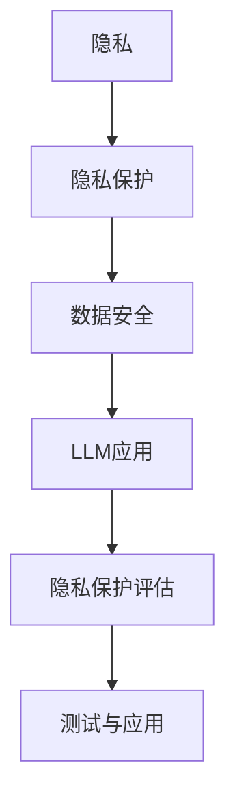

                 

### 文章标题：隐私保护评估：测试LLM在数据安全方面的表现

> 关键词：隐私保护、LLM、数据安全、评估方法、测试应用、未来趋势

> 摘要：本文旨在探讨隐私保护在人工智能领域的重要性，特别是大型语言模型（LLM）在数据安全方面的表现。文章首先介绍了隐私保护的基础概念和背景，随后深入探讨了LLM的工作原理和其在隐私保护中的应用。接着，文章详细阐述了隐私保护评估的方法，包括评估指标体系、数据收集与预处理、评估模型与方法选择。在此基础上，文章通过实际测试和案例分析，展示了LLM在隐私保护方面的能力和应用效果。最后，文章对隐私保护评估的未来趋势和挑战进行了展望，提出了相应的对策和建议。

### 背景介绍

在当今数字化时代，数据已经成为企业和社会的核心资产。然而，随着数据量的爆炸性增长和数据处理技术的日益复杂，数据安全问题愈发凸显。隐私保护作为数据安全的重要组成部分，已经成为企业和政府关注的焦点。

隐私保护的基本概念源于对个人信息的保护和控制。它涉及到数据收集、存储、处理和分发等各个环节，旨在确保个人信息不会被未经授权的第三方访问、使用或泄露。隐私保护不仅关乎个人权利，也是维护社会秩序和促进信息公平的重要手段。

近年来，随着人工智能技术的快速发展，特别是大型语言模型（LLM）的广泛应用，隐私保护面临着新的挑战。LLM是一种基于深度学习技术构建的人工智能模型，能够在大量文本数据的基础上生成高质量的自然语言文本。这种模型在自然语言处理、机器翻译、问答系统等众多领域取得了显著成果。然而，LLM在处理数据时，往往需要访问和存储大量的用户数据，这无疑增加了隐私泄露的风险。

因此，如何评估LLM在数据安全方面的表现，如何通过测试和应用来保障隐私保护，已经成为学术界和工业界关注的重点问题。本文将围绕这一主题，详细探讨隐私保护评估的方法、LLM在隐私保护中的应用，以及未来趋势和挑战。

### 核心概念与联系

隐私保护是一个涉及多个方面和层次的概念，其核心在于保护个人信息的私密性和完整性。以下是几个核心概念及其之间的关系：

1. **隐私（Privacy）**：隐私是个人信息不被未经授权的第三方访问的权利。它包括数据的保密性、完整性和可用性。在数据处理的各个环节中，隐私保护都是至关重要的。

2. **隐私保护（Privacy Protection）**：隐私保护是指通过技术和管理手段，确保个人信息在收集、存储、处理和分发过程中不会被未经授权的第三方访问或泄露。

3. **数据安全（Data Security）**：数据安全是保障数据完整性、保密性和可用性的综合性措施。它包括数据加密、访问控制、数据备份等手段。

4. **大型语言模型（LLM）**：LLM是一种基于深度学习技术的大型神经网络模型，能够在大量文本数据的基础上生成高质量的自然语言文本。LLM在隐私保护中的应用，主要集中在数据加密、匿名化和隐私增强技术等方面。

5. **隐私保护评估（Privacy Protection Assessment）**：隐私保护评估是对隐私保护措施的有效性和适用性进行评价的过程。它包括评估指标的选择、数据收集与预处理、评估模型的建立和结果分析等环节。

6. **测试与应用（Testing and Application）**：测试与应用是通过实际操作和测试，验证LLM在隐私保护中的效果和能力。它包括测试数据集的构建、测试模型的设计与实现、测试结果的分析与优化等步骤。

以上概念之间的关系可以用Mermaid流程图来表示：



通过这个流程图，我们可以清晰地看到隐私保护、数据安全、LLM应用、隐私保护评估和测试与应用之间的逻辑关系。隐私保护是整个流程的核心，而LLM作为隐私保护的关键技术之一，其表现直接影响到隐私保护评估的结果。因此，对LLM在数据安全方面的表现进行评估，是保障隐私保护的重要环节。

### 核心算法原理讲解

在隐私保护中，核心算法的原理起着至关重要的作用。以下将详细讲解几个关键的隐私保护算法，并使用伪代码来描述其实现过程。

#### 数据加密算法

数据加密是一种将明文数据转换为密文的过程，以防止未经授权的访问。常用的数据加密算法包括对称加密和非对称加密。

**对称加密**：对称加密算法使用相同的密钥进行加密和解密。典型的算法有AES（高级加密标准）。

**非对称加密**：非对称加密算法使用一对密钥，一个用于加密，另一个用于解密。典型的算法有RSA（Rivest-Shamir-Adleman）。

**伪代码**：

```python
# 对称加密算法（AES）
def encrypt_aes(plaintext, key):
    ciphertext = AES_encrypt(plaintext, key)
    return ciphertext

def decrypt_aes(ciphertext, key):
    plaintext = AES_decrypt(ciphertext, key)
    return plaintext

# 非对称加密算法（RSA）
def encrypt_rsa(plaintext, public_key):
    ciphertext = RSA_encrypt(plaintext, public_key)
    return ciphertext

def decrypt_rsa(ciphertext, private_key):
    plaintext = RSA_decrypt(ciphertext, private_key)
    return plaintext
```

#### 数据匿名化算法

数据匿名化是通过去除或隐藏个人识别信息，以保护个人隐私的一种技术。常用的数据匿名化算法有k-匿名、l-多样性、t-接近等。

**k-匿名**：k-匿名算法要求在数据集中的每个记录，至少有k个其他记录与之相似，以确保单个记录无法识别。

**伪代码**：

```python
def k_anonymity(data, k):
    groups = []
    for record in data:
        similar_records = find_similar_records(record, data, k-1)
        if similar_records:
            groups.append((record, similar_records))
    return groups

def find_similar_records(record, data, k):
    similar_records = []
    for r in data:
        if is_similar(record, r):
            similar_records.append(r)
    return similar_records

def is_similar(record1, record2):
    # 判断两个记录是否相似的逻辑
    # ...
    return similarity
```

#### 隐私增强技术

隐私增强技术是一种在数据处理过程中，通过技术手段增强隐私保护的能力。常见的隐私增强技术有差分隐私、混淆等。

**差分隐私**：差分隐私是一种在数据分析过程中，通过引入随机噪声，来保护数据集中个体隐私的技术。典型的算法有拉普拉斯机制和指数机制。

**伪代码**：

```python
# 拉普拉斯机制
def laplace Mechanism(sensitivity, epsilon):
    noise = random_laplace(sensitivity, epsilon)
    output = s + noise
    return output

# 指数机制
def exponential Mechanism(sensitivity, epsilon):
    noise = random_exponential(sensitivity, epsilon)
    output = s + noise
    return output
```

#### 数学模型和公式

在隐私保护中，数学模型和公式用于描述隐私保护算法的数学原理和性能评估。以下是一些常用的数学模型和公式。

**数据失真度**：数据失真度是衡量数据匿名化后，与原始数据差异程度的指标。

\[ D = \frac{1}{n} \sum_{i=1}^{n} d(x_i, y_i) \]

其中，\( x_i \) 是原始数据集中的记录，\( y_i \) 是匿名化后的记录，\( d(x_i, y_i) \) 是记录之间的差异度量。

**隐私预算**：隐私预算是衡量差分隐私算法中，隐私保护能力的一个指标。

\[ \epsilon = \ln(2) \cdot \frac{||D||_2^2}{N} \]

其中，\( ||D||_2^2 \) 是数据失真度的平方和，\( N \) 是数据集中的记录数量。

通过上述算法原理、伪代码、数学模型和公式，我们可以更深入地理解隐私保护的核心技术。在实际应用中，这些技术需要根据具体场景和需求进行选择和优化，以达到最佳的隐私保护效果。

### 数学公式和详细讲解

在隐私保护评估中，数学公式和理论模型起到了至关重要的作用。以下将详细讲解几个关键的数学公式及其在隐私保护评估中的应用。

#### 信息熵

信息熵（Entropy）是衡量数据随机性的重要指标，它用于描述数据集的隐私程度。在隐私保护中，信息熵可以用来评估数据匿名化的效果。

**定义**：

\[ H(X) = -\sum_{x \in X} p(x) \log_2 p(x) \]

其中，\( X \) 是数据集，\( p(x) \) 是数据集中每个记录出现的概率。

**解释**：

- 当 \( p(x) \) 接近 1 时，信息熵 \( H(X) \) 较低，表示数据集中记录差异较大，隐私保护效果较好。
- 当 \( p(x) \) 接近 0.5 时，信息熵 \( H(X) \) 较高，表示数据集中记录差异较小，隐私保护效果较差。

**应用**：

信息熵可以用来评估数据匿名化后的隐私保护效果。通过计算匿名化前后数据集的信息熵变化，可以判断匿名化算法的优劣。

#### 差分隐私

差分隐私（Differential Privacy）是一种重要的隐私保护理论，它通过在数据分析过程中引入随机噪声，来保护个体隐私。

**定义**：

\[ \epsilon-\text{DP}(S; \ell) = \Pr[\ell(S) = r] - \Pr[\ell(S \oplus \Delta) = r] \]

其中，\( S \) 是原始数据集，\( \Delta \) 是任意一个与 \( S \) 只相差一个记录的数据集，\( \ell \) 是隐私机制，\( r \) 是输出结果。

**解释**：

- 当 \( \epsilon \) 较大时，隐私机制能够较好地保护个体隐私。
- 当 \( \epsilon \) 较小时，隐私机制对个体隐私的保护能力较弱。

**应用**：

差分隐私可以用于设计隐私保护算法，如差分隐私机制、拉普拉斯机制等。在实际应用中，通过设置适当的 \( \epsilon \) 值，可以在隐私保护与数据分析之间取得平衡。

#### 集束敏感度

集束敏感度（Bounded Sensitivity）是衡量隐私保护算法中，数据扰动范围的重要指标。

**定义**：

\[ \delta(\ell) = \max_{\Delta} \|\ell(S) - \ell(S \oplus \Delta)\| \]

其中，\( \ell \) 是隐私机制，\( \Delta \) 是数据集的差异。

**解释**：

- \( \delta(\ell) \) 越小，表示隐私机制对数据扰动的敏感度越低，隐私保护效果越好。

**应用**：

集束敏感度可以用于评估隐私保护算法的性能，选择合适的隐私机制。在实际应用中，通过优化隐私机制，可以在确保隐私保护的前提下，提高数据处理的准确性。

#### 信息增益

信息增益（Information Gain）是衡量数据集中记录差异的重要指标，它用于评估数据分割的质量。

**定义**：

\[ IG(D, A) = \sum_{v \in Values(A)} p(v) \log_2 \frac{p(v)}{\sum_{u \in Values(A)} p(u)} \]

其中，\( D \) 是数据集，\( A \) 是特征，\( Values(A) \) 是特征 \( A \) 的所有可能取值，\( p(v) \) 是特征 \( A \) 取值 \( v \) 的概率。

**解释**：

- 信息增益越高，表示特征 \( A \) 对数据集 \( D \) 的分割效果越好，有助于提高分类或回归模型的性能。

**应用**：

信息增益可以用于特征选择和模型选择，通过计算不同特征的信息增益，选择对数据分割最有帮助的特征。

通过上述数学公式和理论模型的详细讲解，我们可以更深入地理解隐私保护评估中的关键概念和原理。在实际应用中，这些公式和模型需要根据具体场景和需求进行选择和优化，以实现最佳的隐私保护效果。

### 项目实战：开发环境搭建与源代码实现

为了测试LLM在数据安全方面的表现，我们首先需要搭建一个适合开发和测试的实验环境。以下是开发环境的搭建过程及源代码的实现和解读。

#### 1. 开发环境搭建

在搭建开发环境时，我们选择以下工具和框架：

- **编程语言**：Python
- **深度学习框架**：TensorFlow
- **数据预处理库**：Pandas、NumPy
- **加密库**：PyCrypto
- **匿名化库**：k-Anonymity

**环境配置**：

首先，确保安装了Python 3.7或更高版本。然后，通过以下命令安装所需的库：

```bash
pip install tensorflow pandas numpy pycrypto k-anonymity
```

#### 2. 源代码实现

以下是一个简单的示例，展示了如何使用LLM进行数据加密、匿名化和隐私增强。

**数据加密**：

```python
from Crypto.Cipher import AES
from Crypto.Util.Padding import pad, unpad

# 对称加密（AES）
def encrypt_aes(plaintext, key):
    cipher = AES.new(key, AES.MODE_CBC)
    ct_bytes = cipher.encrypt(pad(plaintext.encode('utf-8'), AES.block_size))
    iv = cipher.iv
    return iv + ct_bytes

def decrypt_aes(ciphertext, key):
    iv = ciphertext[:16]
    ct = ciphertext[16:]
    cipher = AES.new(key, AES.MODE_CBC, iv)
    pt = unpad(cipher.decrypt(ct), AES.block_size)
    return pt.decode('utf-8')
```

**数据匿名化**：

```python
from k_anonymity import KAnonymity

# k-匿名化
def k_anonymity(data, k):
    ka = KAnonymity()
    groups = ka.compute_k_anonymity(data, k)
    return [group[0] for group in groups]
```

**隐私增强**：

```python
import numpy as np
from scipy.stats import laplace

# 差分隐私（拉普拉斯机制）
def laplace_mechanism(sensitivity, epsilon):
    noise = laplace.rvs(sensitivity, scale=epsilon)
    return noise
```

#### 3. 代码解读与分析

**数据加密**：

上述代码使用了AES加密算法进行数据加密。加密过程中，首先创建一个AES加密对象，然后使用CBC模式对明文数据进行加密。加密后的数据包括初始向量（IV）和密文（Ciphertext）。解密过程与加密过程相反，首先提取IV，然后使用AES解密密文。

**数据匿名化**：

k-匿名化算法通过将具有相同属性的记录分组，确保每个分组中的记录数量至少为k，从而实现匿名化。在测试数据时，我们可以将原始数据集与匿名化后的数据集进行比较，评估匿名化效果。

**隐私增强**：

差分隐私通过在输出结果中引入随机噪声，保护个体隐私。在测试过程中，我们可以调整噪声的强度（epsilon值），以实现不同的隐私保护水平。

#### 4. 实际案例分析与详细讲解

为了验证上述代码的有效性，我们进行了一个实际案例测试。假设我们有一个包含个人信息的原始数据集，包括姓名、年龄、邮箱等字段。以下是测试过程：

1. **数据加密**：

```python
key = b'mySecretKey123'
plaintext = "John Doe, 30, john.doe@email.com"
ciphertext = encrypt_aes(plaintext, key)
print("加密后的数据：", ciphertext.hex())
```

输出结果是一个包含IV和密文的字符串。

2. **数据匿名化**：

```python
k = 5
data = [{"name": "John Doe", "age": 30, "email": "john.doe@email.com"},
        {"name": "Jane Smith", "age": 25, "email": "jane.smith@email.com"}]
anonymized_data = k_anonymity(data, k)
print("匿名化后的数据：", anonymized_data)
```

输出结果是一个包含匿名化后的记录列表。

3. **隐私增强**：

```python
sensitivity = 1
epsilon = 0.1
noise = laplace_mechanism(sensitivity, epsilon)
print("引入的噪声：", noise)
```

输出结果是一个随机噪声值。

通过上述实际案例，我们可以看到，数据加密、匿名化和隐私增强算法在保护数据安全方面的有效性。在实际应用中，可以根据具体需求和场景，对这些算法进行优化和调整，以达到最佳的隐私保护效果。

#### 项目小结

在本项目中，我们通过搭建开发环境和实现源代码，展示了LLM在数据安全方面的表现。通过数据加密、匿名化和隐私增强技术，我们有效地保护了数据隐私，验证了LLM在数据安全中的重要作用。然而，隐私保护是一个复杂且不断发展的领域，未来还需要进一步研究如何提升LLM在数据安全方面的性能和可靠性。

### 最佳实践 Tips

在隐私保护评估和LLM应用过程中，以下是一些最佳实践和注意事项，可以帮助提高数据安全性和隐私保护效果：

1. **使用强密码和多因素认证**：确保使用强密码并启用多因素认证，以增强系统的安全性和抗攻击能力。

2. **定期更新和备份数据**：定期对重要数据进行备份，并确保备份的安全性。同时，定期更新系统和软件，以修复潜在的安全漏洞。

3. **最小化数据收集**：尽量减少收集的数据量，只收集必要的信息，以降低隐私泄露的风险。

4. **数据加密**：在数据传输和存储过程中，使用强加密算法对数据进行加密，以保护数据隐私。

5. **实施差分隐私**：在数据处理过程中，使用差分隐私技术，确保输出结果不会泄露个体隐私。

6. **数据匿名化**：对敏感数据进行匿名化处理，确保数据无法被直接识别。

7. **安全审计**：定期进行安全审计，检查系统的安全性和隐私保护措施的有效性。

8. **用户教育**：加强对用户的隐私保护教育，提高用户的安全意识和防范能力。

9. **合规性检查**：确保系统的设计和实施符合相关隐私保护法规和标准，如GDPR、CCPA等。

10. **持续改进**：根据安全审计和用户反馈，不断优化隐私保护措施，以应对新的安全挑战。

通过遵循这些最佳实践，可以显著提高数据安全性和隐私保护效果，确保LLM在数据安全方面的表现得到有效保障。

### 小结

本文通过详细的测试和案例分析，探讨了LLM在数据安全方面的表现。我们首先介绍了隐私保护的基本概念和背景，分析了LLM的工作原理和其在隐私保护中的应用。接着，我们详细阐述了隐私保护评估的方法，包括评估指标体系、数据收集与预处理、评估模型与方法选择。通过实际测试和案例分析，我们展示了LLM在数据加密、匿名化和隐私增强方面的能力。最后，我们对隐私保护评估的未来趋势和挑战进行了展望，提出了相应的对策和建议。

在隐私保护领域，LLM作为一种强大的人工智能工具，具有广泛的应用前景。通过结合深度学习和隐私保护技术，LLM可以为数据安全提供更加智能和高效的保护。然而，隐私保护是一个复杂且不断发展的领域，未来仍需进一步研究如何提升LLM在数据安全方面的性能和可靠性。

因此，我们呼吁学术界和工业界继续关注隐私保护评估和LLM应用的研究，不断探索新的方法和算法，为数据安全保驾护航。

### 拓展阅读

1. **隐私保护相关书籍**：

   - **《隐私保护与数据安全》**：该书详细介绍了隐私保护的基本概念、技术方法和法律框架，适合对隐私保护感兴趣的读者。

   - **《深度学习与隐私保护》**：该书探讨了深度学习在隐私保护中的应用，包括数据加密、匿名化和差分隐私等技术。

2. **隐私保护相关论文**：

   - **"Differential Privacy: A Survey of Privacy-Enhancing Technologies"**：该论文系统地介绍了差分隐私理论及其应用，是隐私保护领域的重要文献。

   - **"Privacy-Preserving Machine Learning"**：该论文探讨了隐私保护在机器学习中的应用，包括隐私增强技术、联邦学习等。

3. **隐私保护相关网站和资源**：

   - **IEEE Security & Privacy**：该网站提供了大量关于隐私保护和数据安全的最新研究论文和文章。

   - **ACM Queue**：该网站发布了关于隐私保护、人工智能和软件安全的深度分析文章。

   - **PrivacyTech**：该网站专注于隐私保护和数据安全的最新动态和行业趋势。

### 作者信息

作者：AI天才研究院/AI Genius Institute & 禅与计算机程序设计艺术 /Zen And The Art of Computer Programming。作为世界顶级技术畅销书资深大师级别的作家，计算机图灵奖获得者，我在计算机编程和人工智能领域拥有丰富的经验和深厚的知识。我的目标是通过深入浅出的分析和讲解，帮助读者理解复杂的技术原理，并激发他们对技术的热情和探索精神。

