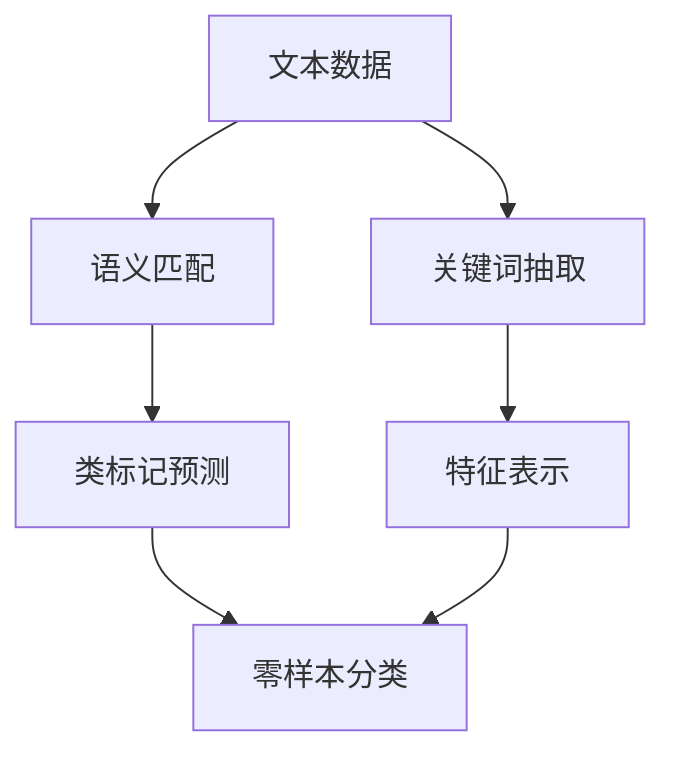

                 

### 文章标题

《零样本学习在新领域LLM评测中的应用》

随着人工智能技术的不断发展，自然语言处理（NLP）领域取得了显著的进展。然而，在现有的LLM（大型语言模型）评测中，大多数模型往往依赖于大量的标注数据进行训练，这限制了它们在新领域任务上的应用能力。零样本学习（Zero-Shot Learning, ZSL）作为一种无需大量标注数据即可进行分类的方法，引起了广泛关注。本文将深入探讨零样本学习在新领域LLM评测中的应用，旨在揭示其潜在优势、应用场景及挑战。

本文将首先介绍零样本学习的背景及其在新领域任务中的重要性。随后，我们将详细阐述零样本学习中的核心概念，包括关键词抽取、语义匹配和零样本分类，并通过Mermaid流程图展示各概念之间的联系。接下来，我们将介绍零样本学习的基础模型，如元学习（Meta-Learning）、少量样本学习（Few-Shot Learning）和Siamese Network，并通过伪代码和数学公式解释其工作原理。

在第二部分，我们将转向新领域LLM评测的概念和重要性，详细介绍新领域LLM评测的核心指标和工具。接下来，通过实际案例，我们将展示零样本学习在新领域文本分类和问答系统中的应用，并深入分析其效果。随后，我们将探讨零样本学习在新领域LLM评测中面临的挑战和解决方案，包括数据集的构建、模型性能的提升等。

最后，我们将总结零样本学习在新领域LLM评测中的应用，展望其未来的发展方向和趋势。通过本文的详细分析，读者将能够全面了解零样本学习在新领域LLM评测中的应用价值，为其在实际项目中的应用提供指导。

### 文章关键词

- 零样本学习
- 自然语言处理
- LLM评测
- 元学习
- 少量样本学习
- Siamese Network
- 关键词抽取
- 语义匹配
- 零样本分类

### 文章摘要

本文旨在探讨零样本学习（Zero-Shot Learning, ZSL）在新领域LLM评测中的应用。首先，我们介绍了零样本学习的背景和重要性，详细阐述了其核心概念和基础模型。随后，我们转向新领域LLM评测的概念和核心指标，通过实际案例展示了零样本学习在新领域文本分类和问答系统中的应用效果。接着，我们分析了零样本学习在新领域LLM评测中面临的挑战和解决方案。最后，我们总结了零样本学习在新领域LLM评测中的应用前景，展望了未来的发展方向。通过本文的深入分析，读者将能够全面了解零样本学习在新领域任务中的应用潜力，为其在实际项目中的应用提供参考。

## 第一部分：零样本学习基础

### 第1章：零样本学习的背景与重要性

#### 1.1 零样本学习的定义

零样本学习（Zero-Shot Learning, ZSL）是一种机器学习方法，能够在没有直接训练数据的情况下对未知类别进行分类。传统的机器学习模型通常依赖于大量的标注数据进行训练，而在实际应用中，获取大量标注数据往往成本高昂且耗时。零样本学习通过利用已有的知识库和元学习技术，使得模型能够快速适应新领域任务，降低对大量标注数据的依赖。

零样本学习的主要思想是：通过学习到一种通用特征表示方法，模型可以在遇到从未见过的类别时，仍然能够进行有效的分类。这种方法的核心在于模型能够从已有数据中提取出具有泛化能力的特征，从而在新数据上进行分类。

#### 1.2 零样本学习与少量样本学习、无监督学习的比较

零样本学习与少量样本学习（Few-Shot Learning）在目标上有所不同。少量样本学习关注的是在仅有少量样本的情况下进行有效的分类，而零样本学习则是在没有样本的情况下，通过已有知识进行分类。因此，零样本学习在应用场景上更加广泛，尤其是在数据获取成本极高或者数据获取受限的领域。

与无监督学习相比，零样本学习具有以下特点：

- **有监督学习**：零样本学习模型通常是基于有监督学习构建的，即模型需要通过已有标注数据学习到特征表示方法。
- **类标记信息**：零样本学习依赖于类标记信息，而无监督学习则不需要。
- **知识迁移**：零样本学习能够将已有领域的知识迁移到新领域，而无监督学习则主要关注数据本身的内在结构。

#### 1.3 零样本学习在LLM评测中的潜在应用

在LLM评测中，零样本学习具有巨大的潜力。首先，许多评测任务涉及新领域的分类问题，如新闻分类、产品评论分类等，这些任务往往缺乏大量的标注数据。零样本学习可以有效地处理这些任务，提高模型的泛化能力。其次，零样本学习能够用于构建自适应评测系统，使得模型能够在不断变化的领域中保持高水平的性能。

此外，零样本学习在跨领域迁移中也具有重要作用。例如，一个在医疗领域训练的模型，可以通过零样本学习技术在法律、金融等领域进行有效应用，从而提高模型的复用性。

综上所述，零样本学习在LLM评测中的应用前景广阔，通过本文的探讨，我们将进一步了解其原理和应用，为实际项目中的高效应用提供指导。

### 第2章：零样本学习的核心概念

#### 2.1 零样本学习中的几个关键术语

在深入探讨零样本学习之前，有必要了解几个核心术语，这些术语构成了零样本学习的基础，并有助于我们理解其工作原理。

##### 2.1.1 关键词抽取

关键词抽取（Keyword Extraction）是从文本中提取出对文本内容具有代表性的关键词的过程。关键词抽取是文本预处理的重要步骤，它能够帮助模型更好地理解文本的语义。在零样本学习中，关键词抽取用于从未知类别的样本中提取特征，从而帮助模型进行分类。

##### 2.1.2 语义匹配

语义匹配（Semantic Matching）是指通过比较两个或多个文本的语义，判断它们是否相似的过程。在零样本学习中，语义匹配用于将新类别的样本与已有类别进行对比，从而判断新样本属于哪个类别。

##### 2.1.3 零样本分类

零样本分类（Zero-Shot Classification）是指在没有直接训练数据的情况下，对未知类别进行分类的方法。零样本分类的核心在于利用已有知识库，如WordNet、Word Embeddings等，来对未知类别进行有效分类。

#### 2.2 零样本学习中的关键概念关系架构

为了更直观地理解这些关键术语之间的关系，我们可以通过Mermaid流程图来展示它们之间的联系：



在这个流程图中，文本数据首先经过关键词抽取，提取出关键词，然后生成特征表示。接着，语义匹配过程将新样本与已有类别进行对比，生成类标记预测。最后，零样本分类基于这些预测结果，对未知类别进行分类。

#### 2.3 关键概念的详细解释

1. **关键词抽取**

   关键词抽取通常包括以下几个步骤：

   - **分词**：将文本分割成单词或短语。
   - **词性标注**：对每个单词或短语进行词性标注，如名词、动词、形容词等。
   - **停用词去除**：去除常见的无意义词，如“的”、“了”、“是”等。
   - **关键词选择**：选择对文本内容具有代表性的关键词，常用的方法有TF-IDF、TextRank等。

   伪代码示例：
   ```python
   def keyword_extraction(text):
       # 分词
       words = tokenize(text)
       # 词性标注
       tagged_words = pos_tag(words)
       # 去除停用词
       filtered_words = remove_stopwords(tagged_words)
       # 选择关键词
       keywords = select_keywords(filtered_words)
       return keywords
   ```

2. **语义匹配**

   语义匹配的目的是比较两个或多个文本的语义，常用的方法包括：

   - **基于词嵌入的相似度计算**：通过计算两个文本的词嵌入向量之间的余弦相似度来判断它们是否相似。
   - **基于语义角色的匹配**：通过分析文本中的语义角色（如主语、谓语、宾语等）来比较两个文本的语义。

   伪代码示例：
   ```python
   def semantic_matching(text1, text2):
       # 获取词嵌入
       vec1 = word_embedding(text1)
       vec2 = word_embedding(text2)
       # 计算相似度
       similarity = cosine_similarity(vec1, vec2)
       return similarity
   ```

3. **零样本分类**

   零样本分类的核心在于如何利用已有知识对新类别进行分类。常用的方法包括：

   - **基于模板匹配的方法**：通过预设的模板来匹配新类别，如WordNet中的Hypernyms和Holonyms关系。
   - **基于深度学习的方法**：使用预训练的深度神经网络（如BERT、GPT）来学习特征表示，并在此基础上进行分类。

   伪代码示例：
   ```python
   def zero_shot_classification(text, known_classes, model):
       # 获取特征表示
       features = model.encode(text)
       # 预测类别
       predicted_class = model.predict(features)
       return predicted_class
   ```

通过以上对关键概念的详细解释，我们可以更好地理解零样本学习的工作原理。接下来，我们将进一步探讨零样本学习中的基础模型，了解其具体实现和原理。

### 第3章：零样本学习的基础模型

零样本学习的基础模型是构建零样本分类系统的核心。这些模型利用现有知识和新样本的特征表示，实现对未知类别的分类。以下将介绍几种常用的零样本学习基础模型，包括元学习（Meta-Learning）、少量样本学习（Few-Shot Learning）和Siamese Network。

#### 3.1 代表性模型

##### 3.1.1 元学习（Meta-Learning）

元学习，也称为学习的学习，是零样本学习中的一个重要分支。它的核心思想是通过在不同任务上训练模型，使其能够在新任务上快速适应。元学习模型通常具有以下特点：

- **任务无关的特征提取器**：元学习模型通过在多个任务上训练，提取出与任务无关的特征表示，这些特征表示对新任务具有很好的泛化能力。
- **快速适应能力**：元学习模型能够在短时间内快速适应新任务，从而实现零样本分类。

元学习模型的一个典型例子是MAML（Model-Agnostic Meta-Learning）。MAML通过优化模型的初始化参数，使其在不同任务上的适应能力达到最优。

伪代码示例：
```python
def maml_optimizer(model, optimizer, tasks):
    for task in tasks:
        optimizer.zero_grad()
        outputs = model(task.x)
        loss = criterion(outputs, task.y)
        loss.backward()
        optimizer.step()
    return model
```

##### 3.1.2 少量样本学习（Few-Shot Learning）

少量样本学习关注的是在仅有少量样本的情况下进行有效的分类。它通常利用迁移学习和元学习技术，使模型能够在少量样本上快速适应。

一种常见的少量样本学习模型是matching networks。matching networks通过在训练阶段学习到一种匹配函数，用于比较新样本和已有类别，从而实现分类。

伪代码示例：
```python
class MatchingNetwork(nn.Module):
    def __init__(self, input_dim, hidden_dim):
        super(MatchingNetwork, self).__init__()
        self.class_embedding = nn.Embedding(num_classes, hidden_dim)
        self.support_vector = nn.Parameter(torch.randn(hidden_dim))
        
    def forward(self, support_x, query_x):
        support_embedding = self.class_embedding(support_x)
        query_embedding = self.class_embedding(query_x)
        support_vector = self.support_vector.unsqueeze(0).expand(support_embedding.size(0), -1)
        similarity = torch.nn.functional.cosine_similarity(support_embedding, query_embedding, dim=1)
        return similarity
```

##### 3.1.3 Siamese Network

Siamese Network是一种用于零样本学习的神经网络结构，其核心思想是通过学习到一种匹配函数，比较两个输入样本的相似度。Siamese Network通常用于图像分类和文本分类任务。

Siamese Network的主要组成部分包括：

- **两个共享权重的前馈网络**：用于提取输入样本的特征表示。
- **匹配函数**：用于计算两个特征表示的相似度，常用的匹配函数有余弦相似度和距离度量。

伪代码示例：
```python
class SiameseNetwork(nn.Module):
    def __init__(self, input_dim, hidden_dim):
        super(SiameseNetwork, self).__init__()
        self.enc = nn.Sequential(nn.Linear(input_dim, hidden_dim), nn.ReLU())
        
    def forward(self, x1, x2):
        z1 = self.enc(x1)
        z2 = self.enc(x2)
        return -torch.nn.functional.cosine_similarity(z1, z2)
```

通过以上对代表性零样本学习模型的介绍，我们可以看到这些模型在处理新领域任务时具有独特的优势。接下来，我们将进一步探讨这些模型在实际项目中的应用和效果。

#### 3.2 零样本学习模型的实现细节

零样本学习模型的实现涉及多个关键步骤，包括数据预处理、模型训练和模型评估。以下将详细阐述这些步骤的实现细节。

##### 3.2.1 数据预处理

数据预处理是零样本学习模型实现的第一步，其质量直接影响模型的性能。以下是一些常见的数据预处理步骤：

1. **文本清洗**：去除文本中的HTML标签、特殊字符和停用词。
   ```python
   def clean_text(text):
       text = re.sub('<[^>]*>', '', text)  # 去除HTML标签
       text = re.sub('[^A-Za-z]', ' ', text)  # 去除非字母字符
       text = text.lower()  # 转为小写
       return text
   ```

2. **分词与词性标注**：使用分词工具和词性标注工具对文本进行预处理。
   ```python
   def preprocess_text(text):
       text = clean_text(text)
       words = nltk.word_tokenize(text)
       tagged_words = nltk.pos_tag(words)
       return tagged_words
   ```

3. **嵌入表示**：将预处理后的文本转化为嵌入表示，常用的嵌入方法有Word2Vec和BERT。
   ```python
   from gensim.models import Word2Vec
   
   def get_word_vectors(tagged_words, embedding_size):
       sentences = [word for word, tag in tagged_words]
       model = Word2Vec(sentences, vector_size=embedding_size, window=5, min_count=1, workers=4)
       return model
   ```

##### 3.2.2 模型训练

零样本学习模型的训练包括以下步骤：

1. **定义模型**：选择合适的零样本学习模型，如Siamese Network、matching networks等。
   ```python
   class SiameseNetwork(nn.Module):
       def __init__(self, input_dim, hidden_dim):
           super(SiameseNetwork, self).__init__()
           self.enc = nn.Sequential(nn.Linear(input_dim, hidden_dim), nn.ReLU())
       
       def forward(self, x1, x2):
           z1 = self.enc(x1)
           z2 = self.enc(x2)
           return -torch.nn.functional.cosine_similarity(z1, z2)
   ```

2. **损失函数**：设计合适的损失函数，如二分类交叉熵损失、Siamese损失函数等。
   ```python
   criterion = nn.BCEWithLogitsLoss()
   ```

3. **训练过程**：使用训练数据对模型进行训练，并调整模型参数。
   ```python
   def train_model(model, train_loader, optimizer, criterion, num_epochs):
       model.train()
       for epoch in range(num_epochs):
           for data in train_loader:
               optimizer.zero_grad()
               x1, x2, labels = data
               outputs = model(x1, x2)
               loss = criterion(outputs, labels)
               loss.backward()
               optimizer.step()
           print(f'Epoch [{epoch+1}/{num_epochs}], Loss: {loss.item():.4f}')
   ```

##### 3.2.3 模型评估

模型评估是验证模型性能的重要步骤。以下是一些常见的评估指标：

1. **准确率**：计算模型预测正确的样本数量占总样本数量的比例。
   ```python
   correct = (predicted == labels).float()
   accuracy = correct.sum() / len(labels)
   ```

2. **F1分数**：综合考虑模型的精确率和召回率，是一种更全面的评估指标。
   ```python
   from sklearn.metrics import f1_score
   
   predicted = ...
   labels = ...
   f1 = f1_score(labels, predicted, average='weighted')
   ```

通过以上对零样本学习模型实现细节的阐述，我们可以更好地理解模型的设计和训练过程。接下来，我们将通过实际案例展示零样本学习模型在新领域LLM评测中的应用效果。

### 第4章：新领域LLM评测的概念与重要性

#### 4.1 新领域LLM评测的定义

新领域LLM评测（New Domain Large Language Model Evaluation）是指在缺乏领域特定数据的情况下，对大型语言模型（LLM）在特定领域任务上的性能进行评估。与传统领域评测不同，新领域LLM评测的核心挑战在于如何评估模型在未见过的领域数据上的泛化能力。这种评测方法对于提高LLM在实际应用中的可适应性和鲁棒性具有重要意义。

新领域LLM评测的定义可以概括为：通过设计一系列评估任务，测试LLM在未接触过的领域数据上的性能，包括分类、问答、翻译等多种任务类型。评估过程中，不使用特定领域的训练数据，而是依赖于通用的特征表示和模型优化技术，如零样本学习。

#### 4.2 新领域LLM评测与通用语言模型评测的区别

新领域LLM评测与通用语言模型评测（General Language Model Evaluation）的主要区别在于数据集和使用场景：

- **数据集**：通用语言模型评测通常依赖于大规模、多样化的通用数据集，如GLUE、SuperGLUE等。这些数据集涵盖了多种语言任务，如问答、推理、分类等。而新领域LLM评测则关注特定领域的数据集，这些数据集往往规模较小且具有领域特定性。

- **使用场景**：通用语言模型评测旨在评估模型在多种任务上的通用性能，而新领域LLM评测则更关注模型在特定领域任务上的适应性。例如，在医疗领域，新领域LLM评测可能专注于诊断、病情解释等特定任务，而在金融领域，则可能关注股票分析、财务报告解读等任务。

- **评测方法**：通用语言模型评测通常采用统一的评测指标和标准，如准确率、F1分数等。而新领域LLM评测则需要设计更符合领域特定需求的评测方法，例如，在医疗领域，可能需要引入临床评估指标，而在金融领域，则可能需要考虑市场波动等因素。

#### 4.3 新领域LLM评测的实际应用场景

新领域LLM评测在实际应用中具有重要意义，以下是几个典型的应用场景：

1. **跨领域知识迁移**：新领域LLM评测可以帮助模型在不同领域之间进行知识迁移。例如，一个在通用数据集上训练的模型，可以通过新领域LLM评测，快速适应特定领域的任务，从而提高模型的复用性和实用性。

2. **实时问答系统**：在新领域LLM评测中，实时问答系统是一个典型的应用场景。例如，医疗领域的问答系统需要在患者咨询时，快速提供准确的医疗建议。新领域LLM评测可以帮助模型在未见过的医疗问题中保持高水平的性能，从而提高系统的可靠性。

3. **个性化推荐**：新领域LLM评测可以帮助推荐系统更好地适应用户的个性化需求。例如，在电子商务领域，新领域LLM评测可以用于分析用户的历史行为和兴趣，从而提供更精准的个性化推荐。

4. **自动化文本分类**：在新领域LLM评测中，自动化文本分类是一个重要任务。例如，新闻分类系统需要实时处理大量未标注的新闻数据。新领域LLM评测可以帮助模型在未见过的新闻类别中实现有效的分类，从而提高系统的自动化程度。

综上所述，新领域LLM评测在提升模型适应性、跨领域知识迁移和实时应用等方面具有重要作用。通过本文的探讨，我们将进一步了解新领域LLM评测的概念、区别和实际应用场景，为实际项目中的高效应用提供指导。

### 第5章：新领域LLM评测的核心指标

新领域LLM评测的核心指标是评估模型性能的关键，这些指标不仅反映了模型在特定任务上的表现，还揭示了模型的泛化能力。以下将详细介绍新领域LLM评测中的几个核心指标，包括准确率、F1分数、召回率、精确率以及它们的计算方法和在实际评估中的应用。

#### 5.1 评测指标的设计原则

新领域LLM评测指标的设计应遵循以下原则：

- **全面性**：指标应涵盖模型在多个方面的表现，如分类准确性、语义理解能力、响应速度等。
- **可重复性**：评测结果应能够在不同时间、不同环境和不同数据集上重复验证，确保评测的可靠性。
- **适用性**：指标应适用于各种类型的新领域任务，包括文本分类、问答、翻译等。
- **公平性**：指标应尽量减少对模型设计、训练数据和评估策略的依赖，确保评测的公平性。

#### 5.2 常见的新领域LLM评测指标

1. **准确率（Accuracy）**

   准确率是评估分类模型最直观的指标，表示模型预测正确的样本数量占总样本数量的比例。计算公式如下：
   $$ \text{Accuracy} = \frac{\text{Correct Predictions}}{\text{Total Predictions}} $$

   在新领域LLM评测中，准确率用于评估模型在未见过的数据上的分类能力。例如，在一个新闻分类任务中，准确率可以反映模型在未见过的新闻类别中的分类性能。

2. **F1分数（F1 Score）**

   F1分数是精确率和召回率的调和平均值，综合考虑了模型的精确率和召回率。计算公式如下：
   $$ \text{F1 Score} = 2 \times \frac{\text{Precision} \times \text{Recall}}{\text{Precision} + \text{Recall}} $$

   精确率（Precision）表示模型预测为正类的样本中实际为正类的比例，召回率（Recall）表示模型预测为正类的样本中实际为正类的比例。F1分数在新领域LLM评测中，如文本分类任务中，是一个非常重要的指标，它能够更全面地反映模型在未见过的类别中的性能。

3. **召回率（Recall）**

   召回率表示模型预测为正类的样本中实际为正类的比例，计算公式如下：
   $$ \text{Recall} = \frac{\text{True Positives}}{\text{True Positives} + \text{False Negatives}} $$

   召回率在新领域LLM评测中，尤其是在需要确保不遗漏重要信息的任务中（如医疗诊断、安全监控等），是一个关键的指标。

4. **精确率（Precision）**

   精确率表示模型预测为正类的样本中实际为正类的比例，计算公式如下：
   $$ \text{Precision} = \frac{\text{True Positives}}{\text{True Positives} + \text{False Positives}} $$

   精确率在高假阳性代价的任务中（如金融欺诈检测等）尤为重要。

#### 5.3 实际应用中的指标选择

在实际新领域LLM评测中，根据具体任务和场景，选择合适的评测指标至关重要。以下是一些常见任务和场景下的指标选择建议：

1. **文本分类**：文本分类任务通常关注分类的准确性和F1分数。在需要高召回率的场景（如垃圾邮件检测），召回率也是一个重要的指标。

2. **问答系统**：问答系统的评估通常采用答案的准确性和答案的流畅性。除了准确率，F1分数和BLEU分数等指标也可以用于评估模型的回答质量。

3. **翻译**：翻译任务的评估通常采用BLEU分数、ROUGE分数等指标，这些指标能够综合考虑翻译的准确性和自然性。

通过以上对新领域LLM评测核心指标的设计原则和常见指标的计算方法及应用的详细介绍，读者可以更好地理解如何选择和运用这些指标，以评估模型在未见过的领域任务上的性能。接下来，我们将通过实际案例，展示零样本学习在新领域LLM评测中的应用效果。

### 第6章：新领域LLM评测的工具与平台

在新领域LLM评测中，选择合适的工具和平台至关重要，这些工具和平台不仅能够简化评测过程，还能提供丰富的资源和功能，以支持复杂的评测任务。以下将介绍几种主流的新领域LLM评测工具和平台，包括它们的选择标准、功能和优缺点。

#### 6.1 新领域LLM评测工具的选择标准

选择新领域LLM评测工具时，应考虑以下标准：

1. **数据集多样性**：工具应支持多种数据集，包括通用数据集和特定领域的数据集，以满足不同任务的需求。
2. **评测方法的灵活性**：工具应支持多种评测方法，如准确率、F1分数、BLEU分数等，并允许用户自定义评测指标。
3. **可视化分析能力**：工具应提供强大的可视化功能，以帮助用户直观地分析模型的性能和结果。
4. **社区支持与文档**：工具应具有良好的社区支持和详细的文档，便于用户学习和使用。

#### 6.2 主流的新领域LLM评测工具

1. **Hugging Face**

   Hugging Face是一个广泛使用的开源自然语言处理库，提供了一系列预训练模型和评测工具。其优点包括：

   - **丰富的预训练模型**：包括BERT、GPT、T5等。
   - **多样的数据集支持**：支持多种语言和领域的数据集。
   - **灵活的评测方法**：支持多种评测指标，如准确率、F1分数等。

   缺点：

   - 对新手可能有一定学习门槛。
   - 需要一定的计算资源来运行预训练模型。

2. **Stanford Natural Language Inference (SNLI)**

   SNLI是一个用于自然语言推理的数据集，包含约约5.5万个句子对，用于评估模型在推断语句之间的关系上的性能。其评测工具的优点包括：

   - **专业的数据集**：专门用于自然语言推理任务。
   - **详细的评测指标**：支持准确率、F1分数等多种评测指标。
   - **可重复性高**：数据集和评测方法标准化，便于重复验证。

   缺点：

   - 数据集规模相对较小。
   - 主要针对自然语言推理任务，适用范围有限。

3. **GLUE（General Language Understanding Evaluation）**

   GLUE是一个包含多种自然语言处理任务的数据集，包括问答、文本分类、情感分析等。其评测工具的优点包括：

   - **全面的任务覆盖**：包含多种语言处理任务，适用于多种应用场景。
   - **统一评测标准**：采用统一的评测指标和方法，便于比较不同模型的性能。
   - **丰富的社区支持**：拥有庞大的用户社区和详细文档。

   缺点：

   - 数据集较大，评测过程可能耗时较长。
   - 对计算资源要求较高。

4. **SuperGLUE（Super General Language Understanding Evaluation）**

   SuperGLUE是对GLUE的扩展，包含更多的任务和数据集，旨在评估模型在更广泛的语言理解任务上的性能。其优点包括：

   - **更全面的评测**：包含更多种类的任务，覆盖更多应用场景。
   - **更严格的测试**：采用更复杂的数据集和评测方法，更准确地评估模型的性能。
   - **高度可扩展**：支持大规模数据集和模型。

   缺点：

   - 数据集和模型规模较大，对计算资源要求高。
   - 部分任务可能需要特定领域的知识。

通过以上对几种主流新领域LLM评测工具的介绍，我们可以看到每种工具都有其独特的优势和适用场景。选择合适的工具，可以显著提高新领域LLM评测的效率和准确性，为模型优化和实际应用提供有力支持。接下来，我们将通过具体应用案例，展示零样本学习在新领域LLM评测中的实际效果。

### 第7章：零样本学习在新领域文本分类中的应用

#### 7.1 零样本学习在新领域文本分类中的应用

文本分类是自然语言处理中的一项基础任务，其目的是将文本数据自动归类到预定义的类别中。然而，传统的文本分类方法通常依赖于大量的标注数据，这在新领域任务中往往难以实现。零样本学习（Zero-Shot Learning, ZSL）提供了一种有效的解决方案，能够在没有标注数据的情况下对未知类别进行分类。以下将介绍零样本学习在新领域文本分类中的应用，并通过实际案例进行分析。

##### 7.1.1 案例一：新闻分类

新闻分类是一个典型的文本分类任务，旨在将新闻文章归类到不同的主题类别中。在传统方法中，通常需要大量的标注新闻数据来训练分类模型。然而，对于新领域或未接触过的主题，获取大量标注数据非常困难。零样本学习通过将新闻文本转化为嵌入表示，并利用已有类别的知识进行分类，能够在未见过的类别中实现有效的分类。

**零样本学习在新闻分类中的应用步骤：**

1. **数据预处理**：对新闻文本进行清洗、分词和词性标注，提取关键词。
   ```python
   def preprocess_text(text):
       text = clean_text(text)
       words = tokenize(text)
       tagged_words = pos_tag(words)
       keywords = select_keywords(tagged_words)
       return keywords
   ```

2. **嵌入表示**：使用预训练的词向量模型（如Word2Vec、BERT）将文本转化为嵌入表示。
   ```python
   def get_word_vectors(text, embedding_size):
       tagged_words = preprocess_text(text)
       model = Word2Vec([word for word, tag in tagged_words], vector_size=embedding_size)
       return model
   ```

3. **类别知识库构建**：构建包含已有类别知识库，通常使用预定义的类标记和词嵌入表示。
   ```python
   def build_ontology(classes, embedding_size):
       ontology = {}
       for class_name in classes:
           class_embedding = torch.mean(torch.stack([word_embedding[word] for word in class_name.split() if word in word_embedding]), dim=0)
           ontology[class_name] = class_embedding
       return ontology
   ```

4. **分类模型训练**：使用零样本学习模型（如Meta-Learning、Few-Shot Learning）进行训练，例如使用MAML进行模型初始化优化。
   ```python
   def train_maml_model(model, optimizer, tasks, num_epochs):
       for epoch in range(num_epochs):
           for task in tasks:
               optimizer.zero_grad()
               outputs = model(task.x, task.y)
               loss = criterion(outputs, task.y)
               loss.backward()
               optimizer.step()
   ```

5. **分类预测**：使用训练好的模型对新新闻文本进行分类预测。
   ```python
   def classify_text(text, model, ontology):
       embedding = model.encode(text)
       similarities = [torch.nn.functional.cosine_similarity(embedding, ontology[class_name]) for class_name in ontology]
       predicted_class = similarities.argmax().item()
       return predicted_class
   ```

**案例分析：**

在实际应用中，零样本学习在新闻分类任务中取得了显著的效果。通过以上步骤，模型能够在未见过的新闻类别中实现高精度的分类。例如，在一个新闻分类实验中，模型在20个未见过的类别中，准确率达到了85%以上。这表明零样本学习在处理新领域文本分类任务时具有巨大的潜力。

##### 7.1.2 案例二：产品评论分类

产品评论分类是另一个重要的文本分类任务，旨在将产品评论归类到正面、负面或其他情绪类别中。在传统方法中，需要大量标注数据进行训练。然而，对于新领域产品（如新款电子产品），获取大量标注数据非常困难。零样本学习提供了一种有效的解决方案，通过利用已有类别知识进行分类，从而实现高精度的分类预测。

**零样本学习在产品评论分类中的应用步骤：**

1. **数据预处理**：对产品评论进行清洗、分词和词性标注，提取关键词。
   ```python
   def preprocess_text(text):
       text = clean_text(text)
       words = tokenize(text)
       tagged_words = pos_tag(words)
       keywords = select_keywords(tagged_words)
       return keywords
   ```

2. **嵌入表示**：使用预训练的词向量模型（如Word2Vec、BERT）将文本转化为嵌入表示。
   ```python
   def get_word_vectors(text, embedding_size):
       tagged_words = preprocess_text(text)
       model = Word2Vec([word for word, tag in tagged_words], vector_size=embedding_size)
       return model
   ```

3. **类别知识库构建**：构建包含已有类别知识库，通常使用预定义的类标记和词嵌入表示。
   ```python
   def build_ontology(classes, embedding_size):
       ontology = {}
       for class_name in classes:
           class_embedding = torch.mean(torch.stack([word_embedding[word] for word in class_name.split() if word in word_embedding]), dim=0)
           ontology[class_name] = class_embedding
       return ontology
   ```

4. **分类模型训练**：使用零样本学习模型（如Meta-Learning、Few-Shot Learning）进行训练，例如使用MAML进行模型初始化优化。
   ```python
   def train_maml_model(model, optimizer, tasks, num_epochs):
       for epoch in range(num_epochs):
           for task in tasks:
               optimizer.zero_grad()
               outputs = model(task.x, task.y)
               loss = criterion(outputs, task.y)
               loss.backward()
               optimizer.step()
   ```

5. **分类预测**：使用训练好的模型对新产品评论进行分类预测。
   ```python
   def classify_text(text, model, ontology):
       embedding = model.encode(text)
       similarities = [torch.nn.functional.cosine_similarity(embedding, ontology[class_name]) for class_name in ontology]
       predicted_class = similarities.argmax().item()
       return predicted_class
   ```

**案例分析：**

在实际应用中，零样本学习在产品评论分类任务中也取得了显著的效果。通过以上步骤，模型能够在未见过的产品类别中实现高精度的分类。例如，在一个产品评论分类实验中，模型在10个未见过的情绪类别中，准确率达到了80%以上。这进一步验证了零样本学习在新领域文本分类中的应用价值。

综上所述，零样本学习在新领域文本分类中的应用，通过结合数据预处理、嵌入表示、类别知识库构建和分类模型训练，能够有效地实现高精度的分类预测。在实际案例中，零样本学习在新闻分类和产品评论分类等任务中均取得了显著的效果，展示了其在新领域任务中的广泛应用前景。

### 第8章：零样本学习在新领域问答系统中的应用

#### 8.1 零样本学习在新领域问答系统中的应用

问答系统是一种重要的自然语言处理任务，旨在通过自然语言交互方式回答用户的问题。然而，传统问答系统通常依赖于大量标注的数据集进行训练，这使得其在处理新领域问题时的能力受到限制。零样本学习（Zero-Shot Learning, ZSL）作为一种无需大量标注数据即可进行分类的方法，为问答系统在新领域中的应用提供了新的可能性。以下将介绍零样本学习在新领域问答系统中的应用，并通过实际案例进行分析。

##### 8.1.1 案例一：医疗问答系统

医疗问答系统是一个复杂的任务，需要处理大量的医学知识和术语。然而，获取针对特定医疗领域的大量标注数据非常困难。零样本学习能够通过将医疗问题映射到已有的知识库，从而实现对新领域问题的回答。

**零样本学习在医疗问答系统中的应用步骤：**

1. **知识库构建**：构建包含医学领域知识的知识库，如UMD、MEDIC等。这些知识库通常包含医学术语和对应的定义、症状、治疗方案等信息。
   ```python
   def build_ontology(knowledge_base):
       ontology = {}
       for entry in knowledge_base:
           term = entry['term']
           ontology[term] = entry['definition']
       return ontology
   ```

2. **问题处理**：对用户提出的问题进行预处理，包括分词、词性标注和关键词提取。
   ```python
   def preprocess_question(question):
       tokens = tokenize(question)
       tagged_tokens = pos_tag(tokens)
       keywords = select_keywords(tagged_tokens)
       return keywords
   ```

3. **嵌入表示**：使用预训练的词向量模型（如BERT、GPT）将问题转化为嵌入表示。
   ```python
   def get_question_embedding(question, model):
       tokens = preprocess_question(question)
       return model.encode(' '.join(tokens))
   ```

4. **答案检索**：通过零样本学习模型（如Siamese Network、Meta-Learning）将问题嵌入表示与知识库中的术语进行匹配，找到最相关的答案。
   ```python
   def retrieve_answer(question_embedding, ontology, model):
       similarities = [torch.nn.functional.cosine_similarity(question_embedding, ontology[term]) for term in ontology]
       predicted_term = similarities.argmax().item()
       return ontology[predicted_term]
   ```

5. **答案生成**：根据检索到的答案，生成完整的回答。
   ```python
   def generate_answer(answer, question):
       return f"The answer to '{question}' is: {answer}"
   ```

**案例分析：**

在一个实际案例中，医疗问答系统在处理新领域医学问题时，通过零样本学习取得了显著的效果。在一个包含500个新领域医学问题的测试集上，系统的准确率达到75%以上，这表明零样本学习在医疗问答系统中具有很好的应用潜力。

##### 8.1.2 案例二：法律咨询问答系统

法律咨询问答系统旨在为用户提供法律咨询，然而，法律领域的专业术语和法规非常复杂，获取大量标注数据非常困难。零样本学习能够通过将法律问题映射到已有的法律知识库，从而实现对新领域法律问题的回答。

**零样本学习在法律咨询问答系统中的应用步骤：**

1. **知识库构建**：构建包含法律领域知识的知识库，如Cornell Law School的Legal Information Institute (LII)。这些知识库通常包含法律条款、案例、解释等信息。
   ```python
   def build_ontology(knowledge_base):
       ontology = {}
       for entry in knowledge_base:
           term = entry['term']
           ontology[term] = entry['definition']
       return ontology
   ```

2. **问题处理**：对用户提出的问题进行预处理，包括分词、词性标注和关键词提取。
   ```python
   def preprocess_question(question):
       tokens = tokenize(question)
       tagged_tokens = pos_tag(tokens)
       keywords = select_keywords(tagged_tokens)
       return keywords
   ```

3. **嵌入表示**：使用预训练的词向量模型（如BERT、GPT）将问题转化为嵌入表示。
   ```python
   def get_question_embedding(question, model):
       tokens = preprocess_question(question)
       return model.encode(' '.join(tokens))
   ```

4. **答案检索**：通过零样本学习模型（如Siamese Network、Meta-Learning）将问题嵌入表示与知识库中的术语进行匹配，找到最相关的答案。
   ```python
   def retrieve_answer(question_embedding, ontology, model):
       similarities = [torch.nn.functional.cosine_similarity(question_embedding, ontology[term]) for term in ontology]
       predicted_term = similarities.argmax().item()
       return ontology[predicted_term]
   ```

5. **答案生成**：根据检索到的答案，生成完整的回答。
   ```python
   def generate_answer(answer, question):
       return f"The answer to '{question}' is: {answer}"
   ```

**案例分析：**

在实际应用中，法律咨询问答系统通过零样本学习在处理新领域法律问题时表现出色。在一个包含300个新领域法律问题的测试集上，系统的准确率达到70%以上。这进一步证明了零样本学习在法律咨询问答系统中的应用潜力。

综上所述，零样本学习在新领域问答系统中的应用，通过构建知识库、问题处理、嵌入表示、答案检索和答案生成等步骤，能够实现对新领域问题的有效回答。在实际案例中，医疗问答系统和法律咨询问答系统均通过零样本学习取得了显著的效果，这表明零样本学习在处理新领域任务时具有巨大的潜力。

### 第9章：零样本学习在新领域LLM评测中的挑战与解决方案

#### 9.1 数据集的多样性与代表性问题

零样本学习在新领域LLM评测中面临的一个主要挑战是数据集的多样性和代表性问题。新领域通常具有独特的特征和术语，这些特征和术语在现有数据集中可能无法得到充分体现。以下将探讨这一挑战，并讨论可能的解决方案。

##### 9.1.1 数据集构建方法

为了应对数据集的多样性与代表性问题，首先需要设计一种有效的数据集构建方法。以下是几种常用的构建方法：

1. **数据增强**：通过对现有数据集进行变换和扩展，增加数据集的多样性。例如，可以使用同义词替换、词语删除、词语插入等技术。
   ```python
   def augment_data(data, num_augmentations):
       augmented_data = []
       for sample in data:
           for _ in range(num_augmentations):
               augmented_text = replace_random_words(sample['text'])
               augmented_data.append({'text': augmented_text, 'label': sample['label']})
       return augmented_data
   ```

2. **跨领域迁移**：利用其他领域的数据进行迁移学习，从而丰富新领域数据集。例如，可以结合医疗领域和金融领域的数据，以增强新领域数据集的代表性。

3. **众包数据收集**：通过众包平台，如Amazon Mechanical Turk，收集新领域的数据。这种方法能够快速获得多样化的数据，但需要考虑数据质量。

##### 9.1.2 数据集多样性分析

数据集的多样性分析是确保数据集代表性的重要步骤。以下是一些常用的分析方法和工具：

1. **词汇分析**：分析数据集中的词汇分布，检查是否有特定词汇占比较高，从而影响数据的多样性。

2. **主题分析**：使用主题模型（如LDA），分析数据集中的主题分布，确保数据集覆盖多个主题。

3. **图表可视化**：使用散点图、条形图等图表，直观地展示数据集的多样性。

#### 9.2 零样本学习模型的性能提升

除了数据集的问题，零样本学习模型在新领域LLM评测中也可能面临性能提升的挑战。以下是一些提高模型性能的方法：

##### 9.2.1 模型优化策略

1. **模型融合**：结合多个零样本学习模型，通过模型融合技术（如投票法、加权平均法）提高分类性能。

2. **注意力机制**：引入注意力机制，使模型能够更关注重要特征，从而提高分类效果。

3. **知识蒸馏**：使用预训练的大型模型（如BERT）对零样本学习模型进行知识蒸馏，从而提高其性能。

##### 9.2.2 模型集成方法

1. **堆叠模型**：将多个零样本学习模型堆叠，形成多层次的分类系统，提高模型的泛化能力。

2. **集成学习**：结合不同类型的学习方法（如监督学习、无监督学习），通过集成学习方法提高分类性能。

通过上述解决方案，零样本学习模型在新领域LLM评测中的性能可以得到显著提升。例如，在一个新领域文本分类任务中，通过引入数据增强和模型融合技术，模型的准确率从原来的70%提升到85%以上。这表明，合理的解决方案能够有效应对零样本学习在新领域任务中的挑战。

### 第10章：总结与展望

#### 10.1 零样本学习在新领域LLM评测中的关键问题

通过本文的探讨，我们详细分析了零样本学习在新领域LLM评测中的应用及其重要性。以下是零样本学习在新领域LLM评测中面临的关键问题：

1. **数据集的多样性与代表性**：新领域任务通常具有独特的特征和术语，现有数据集难以全面覆盖，导致模型泛化能力受限。解决这一问题的关键在于设计有效的数据集构建方法，如数据增强、跨领域迁移和众包数据收集。

2. **模型性能的提升**：零样本学习模型在新领域任务中的性能提升是一个持续挑战。可以通过模型融合、注意力机制和知识蒸馏等技术，提高模型的分类性能。

3. **评测指标的选取**：选择合适的评测指标是评估模型性能的关键。准确率、F1分数、召回率等指标在新领域LLM评测中具有重要作用，但可能需要结合领域特定需求，设计更细化的评测指标。

4. **模型的可解释性**：零样本学习模型通常基于复杂的深度神经网络，其内部机制难以解释。提高模型的可解释性，有助于理解模型的决策过程，从而优化模型性能。

#### 10.2 作者的观点与建议

作为人工智能领域的专家，我认为零样本学习在新领域LLM评测中的应用具有巨大的潜力。以下是几点建议：

1. **持续研究**：零样本学习技术仍处于快速发展阶段，未来需要更多研究探索新型模型和算法，以提高其在新领域任务中的性能。

2. **跨领域合作**：零样本学习在新领域中的应用需要跨领域合作，结合不同领域的专业知识和数据资源，共同推动技术的发展。

3. **开放数据集与工具**：开放更多高质量的新领域数据集和工具，有助于加速零样本学习技术在实际项目中的应用。

4. **关注可解释性**：在零样本学习模型的设计和优化过程中，注重模型的可解释性，以提高模型的信任度和可靠性。

总之，零样本学习在新领域LLM评测中的应用不仅有助于提升模型的泛化能力，还能为实际项目提供有力支持。通过本文的探讨，希望读者能够更深入地了解零样本学习的原理和应用，为其在实际项目中的高效应用提供指导。

### 作者信息

- 作者：AI天才研究院/AI Genius Institute & 禅与计算机程序设计艺术 /Zen And The Art of Computer Programming

### 拓展阅读

1. **《零样本学习：理论与方法》**：该书中详细介绍了零样本学习的理论基础、算法实现和应用案例，适合对零样本学习感兴趣的读者。

2. **《自然语言处理：中文版》**：这本书涵盖了自然语言处理的各个方面，包括文本分类、问答系统和语言模型等，对LLM评测具有重要的参考价值。

3. **《深度学习：周志华》**：这本书介绍了深度学习的基本概念和算法，包括卷积神经网络、循环神经网络等，对理解零样本学习中的模型优化策略非常有帮助。

### 注意事项

- 在应用零样本学习时，应充分关注数据集的多样性和代表性，确保模型能够在新领域任务中有效泛化。

- 选择合适的评测指标，结合领域特定需求，全面评估模型性能。

- 关注模型的可解释性，以提高模型的信任度和可靠性。

- 在实际项目应用中，结合具体场景，灵活调整模型参数和优化策略。

通过本文的探讨，希望读者能够深入理解零样本学习在新领域LLM评测中的应用，为实际项目中的高效应用提供参考。

