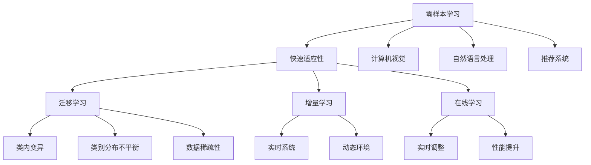

                 

### 文章标题

《零样本学习能力测试：评估快速适应性》

### 文章关键词

零样本学习，快速适应性，人工智能，评估方法，案例研究

### 文章摘要

本文深入探讨了零样本学习能力及其评估方法，特别关注了快速适应性在零样本学习中的应用。通过对零样本学习的概念、原理、研究现状和评估方法的详细阐述，文章展示了其在计算机视觉、自然语言处理和推荐系统等领域的应用案例。同时，本文提出了快速适应性的评估方法，并通过具体案例分析，展示了其在实际应用中的价值。文章最后对零样本学习的未来发展趋势进行了展望，为读者提供了实用的最佳实践和拓展阅读建议。

### 目录大纲

#### 第一部分：引言与背景

**1.1 书籍目的与读者对象**

本文旨在探讨零样本学习的能力测试，特别是快速适应性的评估，以帮助读者深入理解这一前沿技术，并为其在实际项目中的应用提供指导。

**1.2 零样本学习的定义及其重要性**

零样本学习是一种无需训练数据即可进行分类、识别等任务的方法，它在处理未知类别和实时数据方面具有显著优势。

**1.3 快速适应性的概念及其在AI中的应用**

快速适应性指的是模型在接收到新的数据时，能够迅速调整并提高其性能的能力，这在动态环境中尤为重要。

#### 第二部分：理论基础

**2.1 零样本学习的基本原理**

**2.1.1 零样本学习的概念**

零样本学习是一种机器学习方法，它通过学习一组先验知识，能够对新类别进行分类。

**2.1.2 零样本学习的挑战**

零样本学习面临的主要挑战包括类别分布不平衡、类内变异性和数据稀疏性等。

**2.1.3 零样本学习的应用场景**

零样本学习适用于多种场景，如图像识别、语音识别、自然语言处理等。

**2.2 快速适应性的原理**

**2.2.1 快速适应性的定义**

快速适应性是指模型在遇到新数据时，能够迅速适应并提高性能的能力。

**2.2.2 快速适应性的重要性**

快速适应性对于实时系统和动态环境中的AI应用至关重要。

**2.2.3 快速适应性的实现方法**

快速适应性的实现方法包括迁移学习、增量学习、在线学习等。

#### 第三部分：评估方法

**3.1 零样本学习评估的框架**

**3.1.1 评估指标的选择**

**3.1.2 数据集的准备**

**3.1.3 评估流程的标准化**

**3.2 快速适应性评估的方法**

**3.2.1 评估指标的设定**

**3.2.2 快速适应性测试的数据集**

**3.2.3 快速适应性测试的流程**

#### 第四部分：案例分析

**4.1 零样本学习在计算机视觉中的应用**

**4.2 零样本学习在自然语言处理中的应用**

**4.3 零样本学习在推荐系统中的应用**

#### 第五部分：快速适应性的评估

**5.1 快速适应性的评估指标**

**5.2 快速适应性评估的方法**

#### 第六部分：未来展望

**6.1 零样本学习的未来发展趋势**

**6.2 快速适应性的挑战与机遇**

**6.3 零样本学习与快速适应性的融合应用**

#### 附录

**A. 常用评估指标解释**

**B. 参考资源**

### 实际撰写步骤

1. **概述与引言**：简要介绍文章的主题，明确目标读者群体。
2. **理论基础**：详细阐述零样本学习和快速适应性的概念、原理和实现方法。
3. **评估方法**：介绍零样本学习和快速适应性的评估框架和具体方法。
4. **案例分析**：通过具体案例展示零样本学习和快速适应性在实际应用中的效果。
5. **未来展望**：探讨零样本学习和快速适应性未来的发展趋势和挑战。
6. **总结与附录**：总结文章的主要观点，提供拓展阅读资源。

在撰写过程中，需要确保每个部分的内容都详细具体，并通过图示、伪代码、公式等形式增强文章的可读性和理解性。同时，文章的结构和逻辑要清晰，便于读者逐步理解和掌握相关知识。

### 核心概念原理之间的关系架构 Mermaid 流程图

### 核心算法原理讲解与伪代码

**零样本学习核心算法原理讲解：**

零样本学习（Zero-Shot Learning, ZSL）的核心在于利用先验知识库（Concept Emb

