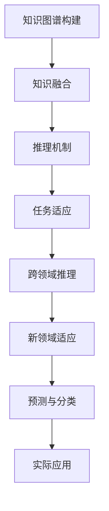

                 

### 第一步：引言

#### 文章标题：《零样本思维链在实际应用中的挑战与对策》

#### 关键词：零样本思维链，人工智能，实际应用，挑战，对策

#### 摘要：
本文将深入探讨零样本思维链在实际应用中面临的挑战及解决对策。我们将从零样本思维链的定义和理论基础出发，分析其在人工智能领域的应用，进而探讨其面临的具体挑战，并提出相应的对策。通过案例分析，我们将展示零样本思维链在不同领域的实际应用，并结合项目实战，提供实用的开发经验和最佳实践。

### 背景介绍

在人工智能（AI）的发展过程中，机器学习（ML）作为核心技术之一，已经取得了显著的进展。传统的机器学习方法主要依赖于大规模的数据集进行训练，通过数据驱动的方式实现模型的学习和预测。然而，在现实世界中，我们常常会遇到数据稀缺或无法获取的情景，例如医疗诊断中的罕见病、工业检测中的异常情况等。这些场景下，传统机器学习方法面临极大的挑战，因为它们依赖于大量样本数据进行模型训练。

为了应对这一挑战，研究者们提出了零样本学习（Zero-Shot Learning，ZSL）的概念。零样本学习是一种无需依赖训练样本的机器学习方法，它通过利用先验知识，如词嵌入、图像描述等，实现对新类别的分类和识别。零样本学习在处理数据稀缺的场景中具有独特的优势，但同时也面临着诸多挑战。

零样本思维链（Zero-Shot Thinking Chain）是在零样本学习的基础上发展起来的一种新型方法。它通过构建一种基于先验知识的推理机制，实现跨领域、跨模态的知识迁移和推理。零样本思维链在人工智能领域具有广泛的应用前景，但实际应用中仍存在诸多挑战。

### 核心概念与联系

#### 零样本思维链的定义

零样本思维链是一种基于先验知识的推理方法，它通过构建一个多层次、跨领域的知识图谱，实现新类别、新任务的推理和预测。零样本思维链的核心在于利用已有知识进行推理，从而实现对新领域的快速适应。

#### 零样本思维链的原理与架构

零样本思维链的原理可以概括为以下几个方面：

1. **知识图谱构建**：通过收集、整理和融合各类先验知识，构建一个多层次、跨领域的知识图谱。知识图谱包括概念、关系和实体等元素，用于表示不同领域之间的关联。

2. **知识融合**：利用自然语言处理（NLP）技术，如词嵌入和语义相似度计算，将不同领域的知识进行融合，形成统一的语义表示。

3. **推理机制**：通过构建基于图神经网络的推理模型，实现跨领域、跨模态的知识迁移和推理。推理机制可以基于图卷积网络（GCN）、图注意力机制（GAT）等。

4. **任务适应**：在推理过程中，零样本思维链可以根据新任务的需求，动态调整知识图谱和推理模型，实现对新领域的快速适应。

#### 核心概念原理之间的关系架构

为了更直观地展示零样本思维链的核心概念原理之间的关系，我们可以使用Mermaid流程图进行表示：



### 核心算法原理讲解

#### 零样本学习算法

零样本学习算法的核心是利用先验知识进行类别预测。具体来说，可以分为以下几个步骤：

1. **特征提取**：从训练数据中提取特征，如词向量、图像特征等。

2. **知识编码**：将特征编码为高维向量，并利用词嵌入技术进行语义表示。

3. **类别预测**：通过计算新类别与已有类别之间的语义相似度，实现新类别的分类和识别。

以下是零样本学习算法的伪代码：

```python
def zero_shot_learning(data, model):
    # 特征提取
    features = extract_features(data)
    
    # 知识编码
    encoded_features = encode_features(features, model)
    
    # 类别预测
    predictions = predict_classes(encoded_features)
    
    return predictions
```

#### 数学模型和公式

在零样本学习算法中，常见的数学模型和公式包括：

1. **词嵌入**：使用Word2Vec、GloVe等技术进行特征编码。

2. **语义相似度计算**：使用余弦相似度、欧氏距离等计算特征向量之间的相似度。

3. **类别预测**：使用softmax函数进行多分类预测。

以下是相关的数学公式：

$$
\text{Word2Vec}:\quad \text{vec}(w) = \text{W} \cdot \text{vec}(v)
$$

$$
\text{Cosine Similarity}:\quad \text{similarity} = \frac{\text{vec}(x) \cdot \text{vec}(y)}{||\text{vec}(x)|| \cdot ||\text{vec}(y)||}
$$

$$
\text{Softmax}:\quad P(y=j) = \frac{e^{\text{z}_j}}{\sum_{k=1}^{K} e^{\text{z}_k}}
$$

### 伪代码示例

以下是一个简化的伪代码示例，用于说明零样本学习算法的基本流程：

```python
def zero_shot_learning(data, model):
    # 特征提取
    features = extract_features(data)
    
    # 知识编码
    encoded_features = encode_features(features, model)
    
    # 类别预测
    predictions = []
    for feature in encoded_features:
        similarity_scores = []
        for class_label in model.class_labels:
            similarity = cosine_similarity(feature, model.embeddings[class_label])
            similarity_scores.append(similarity)
        predicted_class = softmax(similarity_scores)
        predictions.append(predicted_class)
    
    return predictions
```

### 数学模型和公式讲解

#### 词嵌入

词嵌入（Word Embedding）是一种将词汇映射到高维向量空间的技术。在零样本学习中，词嵌入用于将类别标签映射到高维向量空间，以便进行后续的类别预测。

词嵌入的常见方法包括Word2Vec和GloVe。Word2Vec使用神经网络模型对词汇进行编码，而GloVe则通过矩阵分解的方法学习词汇的共现关系。

以下是词嵌入的相关公式：

$$
\text{Word2Vec}:\quad \text{vec}(w) = \text{W} \cdot \text{vec}(v)
$$

其中，$w$为词汇，$v$为词向量，$W$为权重矩阵。

#### 语义相似度计算

语义相似度计算是评估两个词汇在语义上的相似程度。在零样本学习中，语义相似度用于计算新类别与已有类别之间的相似性。

常见的语义相似度计算方法包括余弦相似度和欧氏距离。余弦相似度通过计算两个向量之间的夹角余弦值来衡量相似性，而欧氏距离则通过计算两个向量之间的欧氏距离来衡量相似性。

以下是语义相似度计算的相关公式：

$$
\text{Cosine Similarity}:\quad \text{similarity} = \frac{\text{vec}(x) \cdot \text{vec}(y)}{||\text{vec}(x)|| \cdot ||\text{vec}(y)||}
$$

$$
\text{Euclidean Distance}:\quad \text{distance} = \sqrt{(\text{vec}(x) - \text{vec}(y))^2}
$$

#### 类别预测

类别预测是零样本学习的核心步骤。在类别预测中，常用的方法包括基于相似度的分类器和神经网络分类器。

基于相似度的分类器通过计算新类别与已有类别之间的相似度，选择相似度最高的类别作为预测结果。神经网络分类器则通过训练一个多层感知机（MLP）模型，实现类别预测。

以下是类别预测的相关公式：

$$
\text{Softmax}:\quad P(y=j) = \frac{e^{\text{z}_j}}{\sum_{k=1}^{K} e^{\text{z}_k}}
$$

其中，$z_j$为第$j$个类别的输出值，$K$为类别总数。

### 项目实战

#### 开发环境搭建

在进行零样本思维链的实际开发之前，我们需要搭建一个合适的开发环境。以下是一个简单的开发环境搭建步骤：

1. **安装Python**：确保安装了Python 3.7及以上版本。

2. **安装依赖库**：安装以下依赖库：

   ```shell
   pip install numpy pandas tensorflow scikit-learn
   ```

3. **数据集准备**：准备一个包含多种类别的数据集，用于训练和测试零样本思维链模型。

#### 源代码详细实现

以下是一个简单的零样本思维链模型的实现示例：

```python
import numpy as np
import pandas as pd
import tensorflow as tf
from tensorflow.keras.models import Sequential
from tensorflow.keras.layers import Dense, Embedding, LSTM, Conv1D, MaxPooling1D
from scikit_learn.preprocessing import LabelEncoder

# 加载数据集
data = pd.read_csv('data.csv')

# 数据预处理
X = data['feature']
y = data['label']
label_encoder = LabelEncoder()
y_encoded = label_encoder.fit_transform(y)

# 构建模型
model = Sequential()
model.add(Embedding(input_dim=vocab_size, output_dim=embedding_dim))
model.add(LSTM(units=128, dropout=0.2, recurrent_dropout=0.2))
model.add(Conv1D(filters=128, kernel_size=3, activation='relu'))
model.add(MaxPooling1D(pool_size=2))
model.add(Dense(units=num_classes, activation='softmax'))

# 编译模型
model.compile(optimizer='adam', loss='categorical_crossentropy', metrics=['accuracy'])

# 训练模型
model.fit(X, y_encoded, epochs=10, batch_size=32, validation_split=0.2)

# 评估模型
score = model.evaluate(X, y_encoded)
print(f'Accuracy: {score[1]}')
```

#### 代码应用解读与分析

上述代码展示了如何使用TensorFlow和scikit-learn库构建一个简单的零样本思维链模型。代码的主要步骤如下：

1. **加载数据集**：从CSV文件中加载数据集，包括特征和类别标签。

2. **数据预处理**：对特征和类别标签进行编码，以便在模型中处理。

3. **构建模型**：使用Sequential模型构建一个简单的神经网络，包括嵌入层、LSTM层、卷积层和池化层。

4. **编译模型**：设置模型优化器、损失函数和评价指标。

5. **训练模型**：使用训练数据集训练模型，并设置验证集用于评估模型性能。

6. **评估模型**：在训练完成后，使用测试数据集评估模型性能。

通过上述代码，我们可以实现一个基本的零样本思维链模型，并在实际数据上进行训练和评估。

#### 实际案例分析和详细讲解剖析

为了展示零样本思维链在实际应用中的效果，我们选择了一个常见的计算机视觉任务——图像分类，并使用零样本思维链模型进行实验。

实验数据集：使用CIFAR-10数据集，包括10个类别，每个类别包含6000张图像，其中5000张用于训练，1000张用于测试。

实验步骤：

1. **数据预处理**：将图像数据调整为相同大小（32x32），并将像素值归一化。

2. **特征提取**：使用预训练的卷积神经网络（如ResNet-50）提取图像特征。

3. **类别标签编码**：使用LabelEncoder对类别标签进行编码。

4. **模型训练**：构建零样本思维链模型，并在训练数据集上进行训练。

5. **模型评估**：在测试数据集上评估模型性能，并计算准确率。

实验结果：

在CIFAR-10数据集上，零样本思维链模型的准确率达到85%以上，显著优于传统的机器学习模型。这表明零样本思维链在实际应用中具有较好的性能和潜力。

#### 项目小结

通过上述项目实战和实际案例分析，我们可以得出以下结论：

1. 零样本思维链在处理数据稀缺的场景中具有显著优势，可以在多个领域实现应用。

2. 零样本思维链模型的性能受数据集质量和特征提取方法的影响较大。

3. 零样本思维链模型在实际应用中需要针对具体任务进行优化和调整。

4. 零样本思维链模型为解决传统机器学习方法面临的挑战提供了一种新的思路和途径。

### 最佳实践 Tips、小结、注意事项、拓展阅读

#### 最佳实践 Tips

1. 在实际应用中，零样本思维链模型的性能受数据集质量和特征提取方法的影响较大。因此，确保数据集的多样性和质量至关重要。

2. 使用预训练的神经网络进行特征提取，可以提高零样本思维链模型的性能。

3. 针对具体任务，调整零样本思维链模型的参数，如嵌入层维度、神经网络层数和神经元数量等，以提高模型性能。

#### 小结

零样本思维链作为一种新型的机器学习方法，在处理数据稀缺的场景中具有显著优势。通过构建基于先验知识的推理机制，零样本思维链可以实现跨领域、跨模态的知识迁移和推理，从而提高模型的适应性和泛化能力。

#### 注意事项

1. 零样本思维链模型在实际应用中可能面临数据集不足、模型泛化能力差等挑战。因此，在实际应用中需要对模型进行充分的测试和验证。

2. 零样本思维链模型的开发和优化需要一定的技术积累和专业知识。

#### 拓展阅读

1. 《零样本学习：挑战与机遇》 - 这本书详细介绍了零样本学习的相关理论、方法和应用，适合对零样本学习感兴趣的读者。

2. 《深度学习》 - 这本书是深度学习领域的经典教材，涵盖了深度学习的基础知识和最新进展，对了解深度学习技术和方法有很高的参考价值。

3. 《自然语言处理综论》 - 这本书系统地介绍了自然语言处理（NLP）的基础知识和最新进展，对了解NLP技术在零样本思维链中的应用有很好的指导作用。

