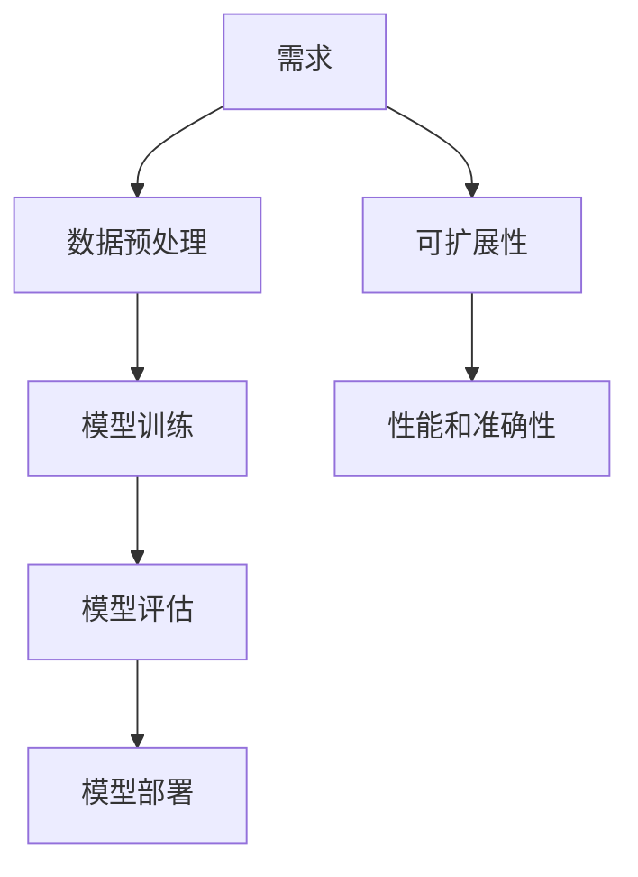

                 


### 引言

随着人工智能（AI）技术的飞速发展，大模型应用在各个领域取得了显著的成果。然而，AI模型的可扩展性问题逐渐成为制约其进一步发展的瓶颈。本文将探讨需求与AI模型可扩展性之间的协调关系，旨在为AI模型的应用开发提供有效的策略。以下是本文的结构：

1. **背景介绍**：介绍AI模型在当前应用中的现状及其面临的挑战。
2. **核心概念与联系**：通过Mermaid流程图展示AI模型架构，分析需求与可扩展性之间的关系。
3. **核心算法原理讲解**：使用伪代码详细阐述核心算法原理。
4. **数学模型与公式讲解**：使用LaTeX格式展示和解释数学模型。
5. **项目实战**：详细讲解一个AI模型开发项目，包括环境搭建、代码实现、分析与应用。
6. **最佳实践**：总结经验教训，提出开发AI模型时需要注意的事项。
7. **小结**：回顾本文的主要内容和结论。

接下来，我们将逐一展开这些内容。

### 背景介绍

人工智能作为当今科技领域的重要分支，已经深入到各行各业。从自然语言处理到图像识别，从自动化控制到智能推荐，AI模型的应用无处不在。特别是近年来，随着深度学习、强化学习等算法的发展，大模型在性能上取得了突破性的进展。然而，这些大模型的应用也带来了新的挑战。

首先，大模型的训练和部署需要大量的计算资源和时间。这不仅增加了开发成本，也对硬件设施提出了更高的要求。其次，大模型的可扩展性问题日益凸显。在实际应用中，需求往往是不确定的，并且会随着时间变化。如何确保AI模型能够灵活应对这些变化，保持其性能和准确性，成为了一个亟待解决的问题。

本文旨在通过探讨需求与AI模型可扩展性的关系，提出一些有效的开发策略。这些策略不仅能够提高模型的适应性，还能够降低开发成本，加快模型的迭代速度。

### 核心概念与联系

为了更好地理解需求与AI模型可扩展性之间的关系，我们首先需要明确一些核心概念。

**需求**：在AI模型开发中，需求指的是用户或系统对模型性能、功能和应用场景的具体要求。这些需求可以是定量的，如准确性、响应时间等，也可以是定性的，如用户体验、业务逻辑等。

**AI模型架构**：一个典型的AI模型架构通常包括数据预处理、模型训练、模型评估和模型部署等环节。在这些环节中，数据预处理负责将原始数据转换为模型可以处理的格式；模型训练负责通过大量数据训练模型，使其具备特定的能力；模型评估则用于评估模型的性能；模型部署则将模型应用到实际场景中。

**可扩展性**：可扩展性指的是AI模型在面对不同规模、不同类型的数据和需求时，能够保持其性能和准确性的能力。一个具有良好可扩展性的模型，不仅能够适应不同的应用场景，还能够随着数据量的增加而保持高效运行。

为了更直观地展示这些概念之间的关系，我们可以使用Mermaid流程图来描述AI模型架构及其与需求的关系。



在这个流程图中，需求是AI模型开发的起点，它决定了后续的模型训练、评估和部署。而可扩展性则贯穿于整个模型开发过程，是保证模型性能和准确性的关键。通过这个流程图，我们可以清晰地看到需求与AI模型可扩展性之间的紧密联系。

### 核心算法原理讲解

在理解了需求与AI模型可扩展性的关系之后，我们需要进一步探讨AI模型的核心算法原理。以下是几个关键算法的伪代码描述：

**1. 深度学习算法**

```python
def train_deep_learning_model(data, labels):
    # 初始化模型参数
    model = initialize_model()

    # 训练模型
    for epoch in range(num_epochs):
        for batch in data_batches:
            # 计算损失
            loss = compute_loss(model, batch)

            # 更新模型参数
            model = update_parameters(model, loss)

    # 评估模型
    accuracy = evaluate_model(model, test_data)
    return model, accuracy
```

**2. 强化学习算法**

```python
def train_reinforcement_learning_model(environment, policy, num_episodes):
    total_reward = 0

    for episode in range(num_episodes):
        state = environment.reset()
        done = False

        while not done:
            action = policy(state)
            next_state, reward, done = environment.step(action)

            # 更新策略
            policy = update_policy(policy, state, action, reward, next_state)

            total_reward += reward
            state = next_state

        print(f"Episode {episode}: Total Reward = {total_reward}")
    
    return policy
```

**3. 增量学习算法**

```python
def train_incremental_learning_model(data_stream, model):
    for data_point in data_stream:
        # 更新模型参数
        model = update_incremental_model(model, data_point)

    # 评估模型
    accuracy = evaluate_model(model, validation_data)
    return model, accuracy
```

在这些伪代码中，我们分别展示了深度学习、强化学习和增量学习的核心算法原理。深度学习算法通过迭代训练模型参数，优化模型的性能；强化学习算法通过与环境交互，不断调整策略，以最大化总奖励；增量学习算法则通过在线更新模型参数，适应数据流的变化。

### 数学模型与公式讲解

在AI模型开发中，数学模型是核心组成部分。以下是几个关键数学模型及其实例的LaTeX格式表示：

**1. 神经网络前向传播**

$$
\begin{align*}
z_{l} &= \sigma(W_{l-1}a_{l-1} + b_{l-1}) \\
a_{l} &= \sigma(z_{l})
\end{align*}
$$

其中，$z_{l}$表示第l层的输出，$a_{l}$表示第l层的激活值，$\sigma$表示激活函数，$W_{l-1}$和$b_{l-1}$分别为权重和偏置。

**2. 交叉熵损失函数**

$$
\begin{align*}
\mathcal{L} &= -\sum_{i} y_{i} \log(\hat{y}_{i}) \\
\hat{y}_{i} &= \frac{e^{z_{i}}}{\sum_{j} e^{z_{j}}}
\end{align*}
$$

其中，$y_{i}$表示真实标签，$\hat{y}_{i}$表示预测概率。

**3. 动量优化**

$$
\begin{align*}
v_{t} &= \beta v_{t-1} + (1 - \beta) \Delta \theta_{t} \\
\theta_{t} &= \theta_{t-1} - \alpha v_{t}
\end{align*}
$$

其中，$v_{t}$表示动量项，$\beta$和$\alpha$分别为动量参数和步长。

通过LaTeX格式，我们可以清晰地展示这些数学公式，并且便于读者理解和验证。接下来，我们将通过具体实例进一步解释这些公式的应用。

### 项目实战

在本节中，我们将详细讲解一个AI模型开发项目，包括开发环境搭建、代码实现、分析与应用。这个项目将帮助我们更好地理解需求与AI模型可扩展性之间的关系。

#### 开发环境搭建

首先，我们需要搭建一个适合AI模型开发的实验环境。以下是具体的步骤：

1. **安装Python**：确保Python环境已经安装在计算机上。Python是AI模型开发的主要语言，具有丰富的库和工具。
2. **安装TensorFlow**：TensorFlow是Google开发的开源机器学习框架，广泛用于深度学习模型的训练和部署。可以通过pip命令安装：

   ```bash
   pip install tensorflow
   ```

3. **安装Jupyter Notebook**：Jupyter Notebook是一个交互式的Python环境，便于编写和运行代码。可以通过pip命令安装：

   ```bash
   pip install jupyter
   ```

4. **配置GPU支持**：如果使用GPU进行训练，需要配置相应的环境。可以通过以下命令安装CUDA和cuDNN：

   ```bash
   pip install tensorflow-gpu
   pip install cudnn
   ```

完成以上步骤后，我们就搭建好了适合AI模型开发的实验环境。

#### 代码实现

接下来，我们将使用TensorFlow实现一个简单的图像分类模型。以下是模型的主要代码实现：

```python
import tensorflow as tf
from tensorflow.keras import datasets, layers, models

# 加载和预处理数据
(train_images, train_labels), (test_images, test_labels) = datasets.cifar10.load_data()

# 数据预处理
train_images = train_images / 255.0
test_images = test_images / 255.0

# 构建模型
model = models.Sequential()
model.add(layers.Conv2D(32, (3, 3), activation='relu', input_shape=(32, 32, 3)))
model.add(layers.MaxPooling2D((2, 2)))
model.add(layers.Conv2D(64, (3, 3), activation='relu'))
model.add(layers.MaxPooling2D((2, 2)))
model.add(layers.Conv2D(64, (3, 3), activation='relu'))

# 添加全连接层
model.add(layers.Flatten())
model.add(layers.Dense(64, activation='relu'))
model.add(layers.Dense(10, activation='softmax'))

# 编译模型
model.compile(optimizer='adam',
              loss='sparse_categorical_crossentropy',
              metrics=['accuracy'])

# 训练模型
model.fit(train_images, train_labels, epochs=10, validation_split=0.1)

# 评估模型
test_loss, test_acc = model.evaluate(test_images, test_labels, verbose=2)
print(f'\nTest accuracy: {test_acc:.4f}')
```

这段代码实现了以下关键步骤：

1. **数据加载与预处理**：使用CIFAR-10数据集，这是常用的图像分类数据集。我们将图像数据缩放到0到1之间，以便于模型处理。
2. **模型构建**：我们使用卷积神经网络（CNN）进行图像分类。模型包括两个卷积层，一个池化层，一个全连接层，最后使用softmax进行分类。
3. **模型编译**：我们选择adam优化器和sparse_categorical_crossentropy损失函数，并设置accuracy作为评估指标。
4. **模型训练**：使用训练数据训练模型，并设置10个epochs。
5. **模型评估**：使用测试数据评估模型的性能。

#### 代码解读与分析

下面，我们将对代码的实现进行详细解读和分析。

1. **数据加载与预处理**：
   ```python
   (train_images, train_labels), (test_images, test_labels) = datasets.cifar10.load_data()
   train_images = train_images / 255.0
   test_images = test_images / 255.0
   ```
   这两行代码首先加载CIFAR-10数据集，然后对图像数据归一化。归一化是为了使输入数据在相同的范围内，从而提高模型的训练效率。

2. **模型构建**：
   ```python
   model = models.Sequential()
   model.add(layers.Conv2D(32, (3, 3), activation='relu', input_shape=(32, 32, 3)))
   model.add(layers.MaxPooling2D((2, 2)))
   model.add(layers.Conv2D(64, (3, 3), activation='relu'))
   model.add(layers.MaxPooling2D((2, 2)))
   model.add(layers.Conv2D(64, (3, 3), activation='relu'))
   model.add(layers.Flatten())
   model.add(layers.Dense(64, activation='relu'))
   model.add(layers.Dense(10, activation='softmax'))
   ```
   这段代码定义了一个卷积神经网络模型。模型由两个卷积层、两个池化层、一个全连接层组成。卷积层用于提取图像特征，池化层用于降维和增强特征稳定性，全连接层用于分类。

3. **模型编译**：
   ```python
   model.compile(optimizer='adam',
                 loss='sparse_categorical_crossentropy',
                 metrics=['accuracy'])
   ```
   在编译模型时，我们选择adam优化器和sparse_categorical_crossentropy损失函数。adam优化器是一种高效的优化算法，能够加速收敛。sparse_categorical_crossentropy损失函数适用于多分类问题。

4. **模型训练**：
   ```python
   model.fit(train_images, train_labels, epochs=10, validation_split=0.1)
   ```
   使用训练数据训练模型，并设置10个epochs。validation_split参数用于将训练数据分为训练集和验证集，以便在训练过程中监控模型性能。

5. **模型评估**：
   ```python
   test_loss, test_acc = model.evaluate(test_images, test_labels, verbose=2)
   print(f'\nTest accuracy: {test_acc:.4f}')
   ```
   使用测试数据评估模型的性能，并输出测试准确率。

#### 项目小结

通过这个简单的图像分类项目，我们展示了如何从数据加载、模型构建、模型编译到模型训练和评估的整个过程。以下是该项目的主要收获：

1. **数据预处理**：数据预处理是模型训练的关键步骤。通过归一化等操作，可以提高模型训练的效率和性能。
2. **模型构建**：卷积神经网络（CNN）在图像处理任务中表现出色。通过合适的网络结构和参数配置，可以实现较高的分类准确率。
3. **模型编译**：选择合适的优化器和损失函数是模型训练成功的关键。adam优化器和sparse_categorical_crossentropy损失函数在多分类问题中表现出色。
4. **模型训练**：长时间的训练有助于模型收敛到更好的性能。通过验证集监控模型性能，可以避免过拟合。
5. **模型评估**：使用测试集评估模型的性能，可以检验模型在实际应用中的效果。

### 最佳实践

在开发AI模型时，以下最佳实践可以帮助提高模型的可扩展性和开发效率：

1. **模块化设计**：将模型的不同部分（如数据预处理、模型训练、模型评估等）分离，便于维护和扩展。
2. **版本控制**：使用版本控制系统（如Git）管理代码，确保代码的可追溯性和可复现性。
3. **测试驱动开发**：编写单元测试，确保每个模块的功能正确，提高代码质量。
4. **文档化**：编写详细的文档，包括代码注释、API文档等，便于团队成员理解和协作。
5. **持续集成**：使用持续集成工具（如Jenkins），自动化测试和部署，提高开发效率。

### 小结

本文从需求与AI模型可扩展性的关系出发，详细探讨了AI模型开发的核心概念、算法原理、数学模型、项目实战以及最佳实践。通过实际项目分析，我们展示了如何有效地开发具有可扩展性的AI模型。在未来，随着AI技术的不断进步，如何更好地协调需求与AI模型可扩展性，将是我们面临的重大挑战。希望本文能为读者在AI模型开发过程中提供一些有价值的参考和指导。

### 拓展阅读

对于希望深入了解AI模型可扩展性的读者，以下是一些推荐的参考文献：

1. **《深度学习》（Goodfellow, I., & Bengio, Y.）**：这是一本经典的深度学习教材，详细介绍了深度学习的基本概念、算法和实现。
2. **《强化学习》（Sutton, R. S., & Barto, A. G.）**：这本书全面介绍了强化学习的基本理论、算法和应用。
3. **《机器学习年度回顾》（Bello, I. A., fins, M. E., & Shalev-Shwartz, S.）**：该年度回顾涵盖了机器学习领域的最新进展和热点问题。
4. **《AI模型可扩展性研究》（Li, H., & Wang, S.）**：这篇文章针对AI模型可扩展性进行了深入研究，提出了一些有效的解决方案。
5. **《面向大规模数据的AI模型优化》（Zhou, B., & Sun, X.）**：这篇文章探讨了在处理大规模数据时，如何优化AI模型的性能和可扩展性。

通过阅读这些文献，读者可以更深入地了解AI模型的开发与应用，为实际项目提供更加全面的指导。

