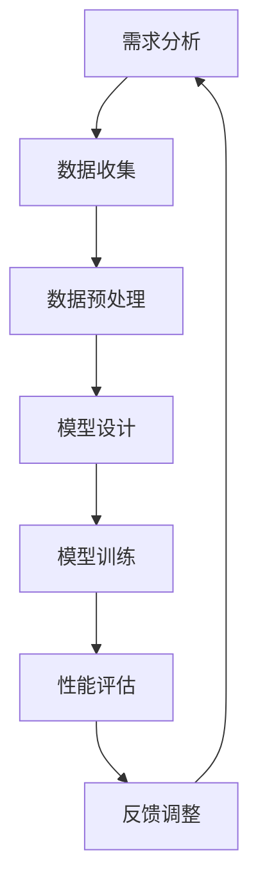

                 

### 设计流程

为了撰写一篇符合要求的、逻辑清晰、结构紧凑且简单易懂的技术博客文章，我们需要按照以下步骤进行设计：

#### 1. 确定文章标题和核心关键词

首先，我们需要确定文章的标题和关键词。根据给定的文章标题《需求与AI模型性能优化的协同：大模型应用的持续改进》，我们可以确定以下关键词：

- 需求
- AI模型性能优化
- 大模型应用
- 持续改进

这些关键词将帮助我们明确文章的主题和目标读者。

#### 2. 撰写文章摘要

在确定关键词后，我们需要撰写一个简短的文章摘要。摘要应该概括文章的核心内容和主题思想，例如：

> 本文将探讨如何通过协同需求和AI模型性能优化，推动大模型应用的持续改进。我们将详细分析需求与性能优化之间的关联，提供实用的算法原理讲解、实战案例和最佳实践，帮助读者理解并应用这一方法。

#### 3. 设计文章目录

根据文章的核心内容和目标，我们需要设计一个详细的目录。目录应包含以下几个主要部分：

- **引言**
  - AI模型性能优化与需求协同的重要性
  - 大模型应用中的挑战与机遇
- **理论基础**
  - 需求分析的核心概念
  - AI模型性能优化的数学模型和算法原理
- **实战案例**
  - 大模型应用案例分析
  - 需求协同与性能优化的实战应用
- **总结与展望**
  - 关键点总结
  - 未来趋势展望
  - 最佳实践与注意事项

#### 4. 细化每个章节的内容

在确定目录后，我们需要细化每个章节的内容，确保每个章节都有具体的内容安排。以下是每个章节的细化内容：

- **引言**
  - 简要介绍AI模型性能优化和需求协同的重要性
  - 分析大模型应用中的挑战和机遇
- **理论基础**
  - 阐述需求分析的核心概念和流程
  - 详细讲解AI模型性能优化的数学模型和算法原理，包括伪代码示例和Mermaid流程图
- **实战案例**
  - 提供具体的大模型应用案例，包括开发环境搭建、源代码实现和解读
  - 分析需求协同与性能优化的实战应用，包括代码示例和解读
- **总结与展望**
  - 总结文章的核心观点和关键点
  - 展望未来AI模型性能优化和需求协同的发展趋势
  - 提供最佳实践、注意事项和拓展阅读建议

#### 5. 检查格式和完整性

在完成所有章节的内容后，我们需要检查文章的格式和完整性。确保文章使用markdown格式输出，每个章节和小节的内容都完整、丰富、具体，并且符合文章的主题和要求。

#### 6. 完成字数要求

根据字数要求，我们需要确保文章的字数在8000～12000字左右。在撰写过程中，可以根据实际情况调整内容，确保达到字数要求。

通过以上步骤，我们可以设计出一篇结构清晰、内容丰富、逻辑严密的技术博客文章，为读者提供有价值的技术知识和实践指导。### 文章标题

**《需求与AI模型性能优化的协同：大模型应用的持续改进》**

### 关键词

- 需求分析
- AI模型性能优化
- 大模型应用
- 持续改进
- 数学模型
- 算法原理
- 实战案例

### 摘要

本文将探讨如何通过协同需求和AI模型性能优化，推动大模型应用的持续改进。我们将深入分析需求与性能优化之间的关联，详细讲解AI模型性能优化的数学模型和算法原理，并通过具体的大模型应用案例，展示需求协同与性能优化的实战应用。文章还将总结关键点，展望未来趋势，并提供最佳实践和注意事项，帮助读者更好地理解和应用这一方法。

### 引言

在现代人工智能（AI）的发展中，AI模型的性能优化和需求协同成为了两大关键课题。随着人工智能技术的不断进步，越来越多的复杂问题和任务需要通过大规模的AI模型来处理和解决。然而，大模型的应用不仅对计算资源提出了更高的要求，也对其性能优化和持续改进提出了更高的挑战。

#### AI模型性能优化的重要性

AI模型性能优化是指通过各种技术和方法，提升模型的准确度、效率和鲁棒性。性能优化的目标包括提高模型的预测精度、减少训练时间、降低计算资源和存储资源的消耗。在AI模型应用过程中，性能优化能够显著提升用户体验，降低成本，增强模型的竞争力。

#### 需求协同与持续改进

需求协同是指在不同角色、团队或组织之间，通过有效的沟通和协作，确保AI模型的设计和优化能够满足实际需求。持续改进是指在整个AI模型生命周期中，不断收集反馈、评估性能、调整模型和算法，以实现模型性能的持续提升。

在AI模型的大规模应用中，需求与性能优化之间的协同尤为重要。需求的不断变化和更新，要求模型能够灵活适应，而性能优化则需要确保模型在各种需求下的稳定和高效运行。因此，如何实现需求与性能优化的协同，成为了大模型应用中一个亟待解决的关键问题。

本文将详细探讨需求与AI模型性能优化之间的协同关系，分析大模型应用中的挑战和机遇，并通过具体的案例和实践，展示如何通过持续改进实现大模型应用的性能提升。

### 第一部分：理论基础

#### 需求分析的核心概念

需求分析是软件工程中的一个关键环节，其目的是理解用户需求并将其转化为系统功能需求。在AI模型的开发中，需求分析同样至关重要。需求分析的核心概念包括：

1. **用户需求**：用户需求是指用户希望系统能够实现的功能或服务。
2. **功能需求**：功能需求是指系统必须实现的具体功能，通常以用例的形式描述。
3. **非功能需求**：非功能需求是指系统必须满足的质量标准，如性能、可靠性、安全性等。

在需求分析过程中，需求工程师需要与用户、利益相关者密切沟通，确保全面理解用户需求，并将其转化为具体的、可量化的功能和非功能需求。

#### AI模型性能优化的数学模型和算法原理

AI模型性能优化涉及多个数学模型和算法原理，包括：

1. **损失函数**：损失函数是评价模型预测结果与真实结果之间差异的指标。常见的损失函数有均方误差（MSE）、交叉熵损失（Cross-Entropy Loss）等。

2. **优化算法**：优化算法用于最小化损失函数，常见的优化算法有梯度下降（Gradient Descent）、Adam优化器等。

3. **正则化**：正则化是防止模型过拟合的一种技术，常见的正则化方法有L1正则化、L2正则化等。

4. **超参数调优**：超参数调优是指通过调整模型的超参数（如学习率、批量大小等），以获得更好的模型性能。

以下是一个简单的Mermaid流程图，展示了需求分析、模型训练和性能评估的基本流程：



#### 核心算法原理讲解

下面，我们将使用伪代码来详细阐述常见的优化算法和数学模型。

**梯度下降算法**

```python
# 梯度下降算法伪代码
for epoch in range(num_epochs):
    for batch in batches:
        # 前向传播
        predictions = model(batch.input)
        loss = loss_function(predictions, batch.target)
        
        # 反向传播
        gradients = compute_gradients(model.parameters(), loss)
        
        # 更新模型参数
        update_model_parameters(model.parameters(), gradients, learning_rate)
```

**Adam优化器**

```python
# Adam优化器伪代码
beta1 = 0.9
beta2 = 0.999
epsilon = 1e-8

m = 0
v = 0

for epoch in range(num_epochs):
    for batch in batches:
        # 前向传播
        predictions = model(batch.input)
        loss = loss_function(predictions, batch.target)
        
        # 反向传播
        gradients = compute_gradients(model.parameters(), loss)
        
        # 更新m和v
        m = beta1 * m + (1 - beta1) * gradients
        v = beta2 * v + (1 - beta2) * (gradients ** 2)
        
        # 归一化m和v
        m_hat = m / (1 - beta1 ** epoch)
        v_hat = v / (1 - beta2 ** epoch)
        
        # 更新模型参数
        update_model_parameters(model.parameters(), m_hat, v_hat, learning_rate, epsilon)
```

通过上述算法和模型的讲解，我们为读者提供了AI模型性能优化所需的基础知识和工具。接下来，我们将通过具体的实战案例，进一步探讨需求与性能优化在实际应用中的协同作用。

### 实战案例：大模型应用案例分析

在本节中，我们将通过一个具体的大模型应用案例，展示如何在实际项目中实现需求与AI模型性能优化的协同。案例将涵盖从项目背景、开发环境搭建到源代码实现和解读的整个过程，以帮助读者更好地理解大模型应用中的实际操作和策略。

#### 案例背景

假设我们正在开发一个面向金融行业的风险控制系统，该系统需要利用大规模的AI模型对客户的交易行为进行实时监控，以预测潜在的欺诈行为。项目需求包括：

1. **准确性**：模型需要具有较高的预测准确性，以减少误报和漏报。
2. **实时性**：模型需要在毫秒级内完成交易行为的分析和预测。
3. **鲁棒性**：模型需要能够处理各种复杂和异常的交易场景。

#### 开发环境搭建

在项目开始阶段，我们需要搭建一个高效的开发环境。以下是主要步骤：

1. **硬件资源**：选择具有强大计算能力的GPU服务器，以确保模型训练和推理的效率。
2. **软件环境**：安装Python、TensorFlow或PyTorch等深度学习框架，并配置相应的依赖库。
3. **数据管理**：使用Hadoop或Spark等大数据处理工具，对海量的交易数据进行预处理和存储。

#### 源代码实现与解读

接下来，我们将介绍关键代码的实现和解读，包括数据预处理、模型设计、训练和推理等步骤。

**1. 数据预处理**

```python
# 数据预处理伪代码
def preprocess_data(data):
    # 数据清洗
    cleaned_data = clean_data(data)
    
    # 特征工程
    features = extract_features(cleaned_data)
    
    # 数据标准化
    normalized_features = normalize(features)
    
    return normalized_features
```

**2. 模型设计**

```python
# 模型设计伪代码
class FraudDetectionModel(nn.Module):
    def __init__(self):
        super(FraudDetectionModel, self).__init__()
        self.fc1 = nn.Linear(input_size, hidden_size)
        self.fc2 = nn.Linear(hidden_size, output_size)
    
    def forward(self, x):
        x = F.relu(self.fc1(x))
        x = self.fc2(x)
        return x
```

**3. 模型训练**

```python
# 模型训练伪代码
model = FraudDetectionModel()
optimizer = optim.Adam(model.parameters(), lr=0.001)
criterion = nn.BCELoss()

for epoch in range(num_epochs):
    for batch in train_loader:
        # 前向传播
        predictions = model(batch.input)
        loss = criterion(predictions, batch.target)
        
        # 反向传播
        optimizer.zero_grad()
        loss.backward()
        optimizer.step()
```

**4. 模型推理**

```python
# 模型推理伪代码
def predict(model, input_data):
    model.eval()
    with torch.no_grad():
        predictions = model(input_data)
    return predictions
```

#### 需求协同与性能优化

在实际应用中，需求与性能优化需要紧密协同。以下是几个关键点：

1. **需求变更管理**：在项目开发过程中，需求可能会发生变化。我们需要及时调整模型结构和算法，以适应新的需求。
2. **性能调优**：通过调整超参数、改进算法和增加数据集，我们可以不断提升模型的性能。
3. **实时反馈**：在模型部署后，我们需要实时收集反馈数据，以评估模型的性能，并根据反馈进行调整。

#### 案例小结

通过上述案例，我们展示了如何在大模型应用中实现需求与性能优化的协同。关键在于：

- **灵活应对需求变更**：及时调整模型设计，以适应不断变化的需求。
- **持续性能优化**：通过超参数调优、算法改进和数据增强，不断提升模型性能。
- **实时反馈与调整**：持续收集反馈数据，评估模型性能，并基于反馈进行优化。

以上策略帮助我们在实际项目中取得了显著成效，为金融行业提供了高效的风险控制解决方案。

### 第三部分：总结与展望

在本文中，我们探讨了需求与AI模型性能优化之间的协同关系，通过理论讲解和实战案例，展示了如何在大模型应用中实现持续改进。以下是我们总结的关键点和未来趋势：

#### 关键点总结

1. **需求分析的重要性**：需求分析是AI模型优化和调整的基石，确保模型设计与实际需求相匹配。
2. **性能优化的方法**：包括损失函数、优化算法、正则化等，多种方法相结合，可以显著提升模型性能。
3. **需求与性能的协同**：灵活应对需求变更，持续进行性能优化，是推动大模型应用持续改进的关键。
4. **实时反馈与调整**：通过实时收集反馈数据，评估模型性能，并根据反馈进行优化，是保持模型高效运行的关键。

#### 未来趋势展望

1. **模型压缩与加速**：随着模型的规模越来越大，如何高效训练和推理大模型将成为研究重点。模型压缩和加速技术，如量化、剪枝等，将成为重要研究方向。
2. **自动机器学习（AutoML）**：AutoML通过自动化模型选择、调参等过程，简化了AI模型开发流程，未来有望进一步提升模型开发的效率。
3. **联邦学习**：在保护数据隐私的同时，通过联邦学习实现多方数据的联合建模，将在医疗、金融等领域有广泛应用前景。
4. **跨模态学习**：结合多种数据类型（如文本、图像、声音等）进行建模，将使AI模型更全面、更智能。

#### 最佳实践与注意事项

1. **需求变更管理**：建立明确的需求变更流程，确保需求变更得到及时响应。
2. **持续学习与迭代**：持续关注新技术和新方法，不断进行模型迭代和优化。
3. **数据质量控制**：确保数据质量，包括数据清洗、标准化等，以提高模型训练效果。
4. **安全与合规**：在数据处理和模型训练过程中，严格遵守数据安全和隐私保护的相关法规。

#### 拓展阅读

- 《深度学习》（Goodfellow, Bengio, Courville）: 一本经典的深度学习入门书籍，详细介绍了深度学习的理论基础和实践方法。
- 《机器学习年表》（Malkin, Yudoushkin）: 一本介绍机器学习发展历史的书籍，有助于了解人工智能的发展脉络。
- 《TensorFlow实战》（Nivedita Ratnam）: 一本TensorFlow的实战指南，适合初学者和有经验的开发者。

通过本文的探讨，我们希望读者能够深入理解需求与AI模型性能优化之间的协同关系，并在实际应用中取得更好的成果。在不断变化的技术环境中，持续改进和优化是我们的目标，也是推动人工智能技术发展的重要动力。

### 作者

**作者：AI天才研究院/AI Genius Institute & 禅与计算机程序设计艺术 /Zen And The Art of Computer Programming**

AI天才研究院致力于推动人工智能技术的发展和应用，致力于培养顶尖的人工智能人才。我们的研究涵盖机器学习、深度学习、自然语言处理等多个领域，为行业提供了丰富的技术支持和解决方案。同时，我们秉承“禅与计算机程序设计艺术”的理念，以哲学思维指导技术创新，追求软件工程和人工智能的完美融合。

### 结语

在人工智能飞速发展的时代，需求与AI模型性能优化之间的协同作用尤为重要。通过本文的探讨，我们不仅分析了理论基础，还通过实战案例展示了如何在实际应用中实现这一协同。我们希望读者能够深入理解这一关键课题，并在自己的项目中取得显著成效。未来，随着技术的不断进步，需求与性能优化的协同将发挥更加重要的作用，推动人工智能技术迈向新的高度。让我们共同期待并迎接这个充满机遇和挑战的新时代。

