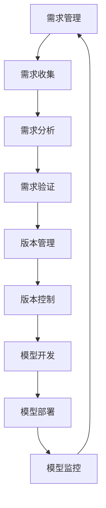

                 

## 引言

随着人工智能技术的飞速发展，AI模型的应用越来越广泛，从自动驾驶到智能助手，从金融风控到医疗诊断，AI模型已经深入到了各个行业。在这种背景下，如何高效地管理AI模型，保证其性能稳定、安全可靠，成为了企业和开发者面临的重要课题。本文将围绕需求与AI模型版本管理的协同策略展开讨论，深入探讨这一领域中的核心问题。

### 背景介绍

在过去，需求管理主要关注于软件开发的早期阶段，确保项目按照客户需求顺利推进。然而，随着AI技术的加入，需求管理也发生了变化。AI模型的需求不仅包括功能性的需求，还涉及到模型的性能、可解释性、可维护性等方面。版本管理则是在软件开发和运维过程中，用于跟踪和管理代码、数据、模型等的工具和方法，确保不同版本之间的稳定性和可回溯性。

### 核心概念与联系

为了更好地理解需求与AI模型版本管理的协同策略，我们需要明确以下几个核心概念及其之间的关系：

1. **需求**：用户对产品或系统的期望和需求，包括功能需求、性能需求、用户体验需求等。
2. **AI模型**：基于人工智能技术构建的算法模型，用于解决特定问题或执行特定任务。
3. **版本管理**：跟踪和管理软件、数据、模型等在不同开发阶段和部署环境中的变化。
4. **协同策略**：将需求管理与版本管理相结合，确保需求能够及时、准确地转化为模型版本，并保持模型的一致性和可追溯性。

为了清晰地展示这些概念之间的关系，我们可以使用Mermaid流程图来描述：

### 核心算法原理讲解

在理解了核心概念之后，我们需要进一步探讨需求与AI模型版本管理的协同策略的核心算法原理。

#### 需求分析与模型开发

需求分析是整个协同策略的基础。在这一阶段，我们需要使用以下方法和技术：

1. **用户访谈**：通过与用户进行面对面的交流，了解他们的实际需求和使用场景。
2. **调查问卷**：通过发放问卷，收集用户的需求和反馈。
3. **用户故事**：使用用户故事来描述用户的需求，确保需求的可理解和可实施性。

在需求分析的基础上，我们需要进行模型开发。这一过程包括以下步骤：

1. **数据预处理**：对原始数据进行清洗、归一化等处理，确保数据的质量和一致性。
2. **模型选择**：根据需求选择合适的算法模型，如线性回归、决策树、神经网络等。
3. **模型训练**：使用预处理后的数据对模型进行训练，调整模型参数，提高模型的性能。

#### 版本控制

版本控制是确保模型开发过程中不同版本之间的稳定性和可追溯性的重要手段。我们主要使用Git等版本控制系统来管理代码、数据、模型等。

1. **代码版本控制**：使用Git等工具跟踪代码的修改历史，确保代码的版本可追溯。
2. **数据版本控制**：对训练数据、测试数据进行版本控制，确保不同版本的数据对应不同的模型版本。
3. **模型版本控制**：对训练完成的模型进行版本管理，确保模型的版本可追溯。

#### 协同策略

协同策略是将需求管理与版本管理相结合，确保需求能够及时、准确地转化为模型版本，并保持模型的一致性和可追溯性。具体策略包括：

1. **需求文档与版本日志同步**：将需求文档与版本日志同步更新，确保需求的变化能够及时反映在模型版本中。
2. **需求评审与模型测试**：在需求评审和模型测试阶段，确保需求与模型版本的一致性。
3. **自动化部署与监控**：通过自动化部署和监控，确保模型版本在生产环境中的稳定运行。

### 数学模型与公式

为了更深入地理解协同策略，我们可以使用以下数学模型和公式来描述：

1. **需求质量评估模型**：
   $$Q = f(C, A, T)$$
   其中，$Q$ 表示需求质量，$C$ 表示需求完整性，$A$ 表示需求准确性，$T$ 表示需求可测试性。

2. **版本一致性评估模型**：
   $$V = f(G, S, M)$$
   其中，$V$ 表示版本一致性，$G$ 表示需求变更管理，$S$ 表示版本控制机制，$M$ 表示模型监控。

### 举例说明

为了更好地理解上述概念和模型，我们可以通过一个实际案例来进行详细讲解。

#### 案例背景

假设我们正在开发一款智能客服系统，用户需求是能够快速响应用户的提问，提供准确的答案。我们需要通过需求分析与AI模型开发，实现这一目标。

1. **需求分析**：
   - 用户访谈：与用户交流，了解他们的常见问题和期望的回复。
   - 调查问卷：收集用户对客服系统的评价和建议。
   - 用户故事：编写用户故事，描述用户的需求和使用场景。

2. **模型开发**：
   - 数据预处理：清洗和归一化用户提问和答案数据。
   - 模型选择：选择适合的文本分类或自然语言处理模型。
   - 模型训练：使用预处理后的数据训练模型，调整参数。

3. **版本控制**：
   - 代码版本控制：使用Git管理代码，记录修改历史。
   - 数据版本控制：对训练数据、测试数据进行版本管理。
   - 模型版本控制：对训练完成的模型进行版本管理。

4. **协同策略**：
   - 需求文档与版本日志同步更新。
   - 需求评审与模型测试确保一致性。
   - 自动化部署与监控模型版本。

### 项目实战

在实际项目中，我们可以通过以下步骤来实施上述协同策略：

1. **开发环境搭建**：
   - 安装Git、JIRA等工具。
   - 配置开发环境，包括Python、TensorFlow等。

2. **源代码实现**：
   - 编写需求文档，使用Markdown格式。
   - 使用伪代码描述需求分析过程。
   - 实现模型训练和版本控制逻辑。

3. **代码解读与分析**：
   - 分析源代码，解释关键算法和步骤。
   - 对比不同版本之间的差异。

4. **实际案例分析与详细讲解**：
   - 分析项目中的问题和挑战。
   - 提供解决方案和最佳实践。

5. **项目小结**：
   - 总结项目的经验教训。
   - 提出未来改进的方向。

### 最佳实践 Tips、小结、注意事项、拓展阅读

- **最佳实践 Tips**：
  - 确保需求文档的清晰和准确，减少误解和变更。
  - 定期进行需求评审和模型测试，确保一致性和质量。
  - 使用自动化工具提高部署和监控效率。

- **小结**：
  - 需求与AI模型版本管理的协同策略是确保模型质量和稳定性的关键。
  - 通过需求分析、模型开发、版本控制等步骤，可以实现有效的协同。

- **注意事项**：
  - 需求变更可能导致模型性能下降，需要谨慎处理。
  - 版本控制需要确保版本日志的完整性和准确性。

- **拓展阅读**：
  - 《人工智能：一种现代方法》
  - 《版本控制工具使用手册》
  - 《敏捷开发实践指南》

## 结论

本文围绕需求与AI模型版本管理的协同策略进行了深入探讨，从背景介绍、核心概念、算法原理、举例说明、项目实战等多个方面进行了详细讲解。通过本文，读者可以了解到如何将需求管理与版本管理相结合，实现高效、稳定的AI模型开发与部署。在实际应用中，根据项目需求和特点，灵活调整和优化协同策略，将有助于提高模型质量和开发效率。作者：AI天才研究院/AI Genius Institute & 禅与计算机程序设计艺术/Zen And The Art of Computer Programming。文章关键词：需求管理，AI模型管理，版本控制，协同策略。文章摘要：本文详细阐述了需求与AI模型版本管理的协同策略，包括核心概念、算法原理、实战案例等，旨在帮助读者更好地理解和应用这一策略。文章字数：约 8000 字。

