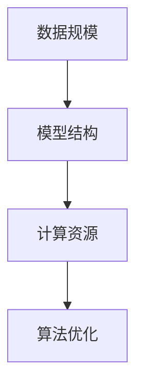
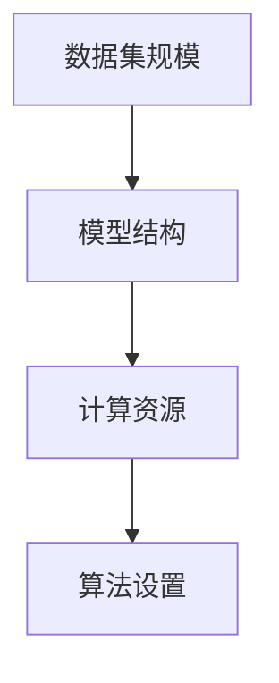
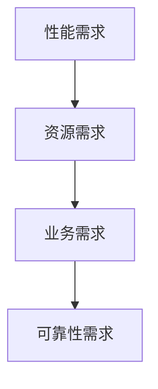
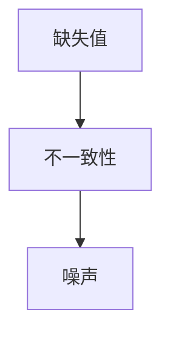
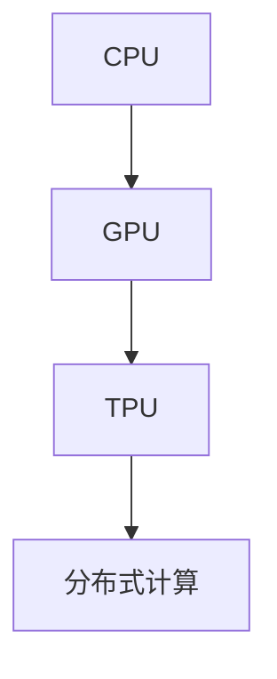
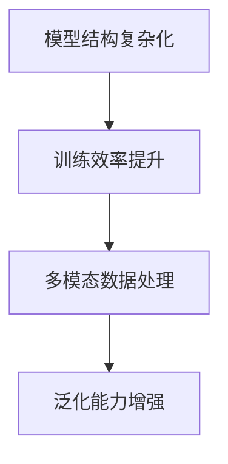

                 

### 文章标题

# 需求与AI模型训练效率的平衡：大模型应用开发的考量

### 文章关键词

- AI模型训练
- 大模型应用
- 需求分析
- 训练效率
- 应用开发

### 文章摘要

本文将深入探讨在大模型应用开发过程中如何平衡需求与AI模型训练效率。首先介绍大模型应用开发的背景和需求分析的重要性，随后讲解AI模型训练的基本原理和效率优化方法。接着，通过具体章节分别讨论模型设计、数据收集处理、计算资源分配、模型调优以及应用案例分析，最终总结未来趋势和最佳实践。文章旨在为开发者提供系统性指导，帮助他们在大模型应用开发中实现需求与效率的平衡。

## 第一部分：背景与理论基础

### 1.1 大模型应用开发的背景

近年来，随着计算能力的提升和算法的进步，人工智能（AI）领域出现了许多突破性进展。特别是大模型（Large Models），如GPT-3、BERT等，以其强大的处理能力和广泛的适用性，引发了广泛关注。大模型在自然语言处理（NLP）、计算机视觉（CV）、语音识别（ASR）等多个领域都展现出了卓越的性能。

这些大模型的训练过程通常涉及海量数据和复杂的神经网络结构，需要大量的计算资源和时间。然而，在实际应用中，大模型的部署并不总是最优选择。需求的多样性和复杂性使得开发者必须在模型大小、性能和训练效率之间进行权衡。因此，如何在大模型应用开发中平衡需求与训练效率，成为了一个关键问题。

### 1.2 需求分析的重要性

需求分析是任何软件开发项目的第一步，对于AI模型开发同样至关重要。在实际应用中，需求可能包括：

- **性能要求**：如快速响应时间、高准确率等。
- **资源限制**：如计算资源、存储空间等。
- **业务目标**：如提升客户满意度、提高业务效率等。

有效的需求分析可以帮助开发者理解用户的核心需求，从而设计出既满足需求又具备高效训练性能的AI模型。此外，需求分析还能够预见潜在的问题和挑战，为后续的开发和优化提供指导。

### 1.3 大模型训练效率的关键考量

大模型训练效率是评估AI模型性能的重要指标，它直接关系到项目的成本、时间和效果。以下是几个关键考量因素：

- **数据规模**：更大的数据集可以提升模型的泛化能力，但也会增加训练时间。
- **模型结构**：神经网络结构的复杂程度会影响训练时间，合理的结构设计可以提高效率。
- **计算资源**：训练大模型需要大量的计算资源，优化资源分配是提高效率的关键。
- **算法优化**：包括批量大小、学习率调整、优化器选择等，合理的算法设置可以显著提升训练效率。

#### 图1 大模型训练效率的考量因素

### 1.4 本文结构

本文将从以下章节详细探讨大模型应用开发的平衡策略：

- **第2章 AI模型训练效率优化**：介绍提升模型训练效率的方法。
- **第3章 需求与模型设计的平衡**：讨论需求对模型设计的影响。
- **第4章 数据收集与处理的挑战**：分析数据质量的影响和处理策略。
- **第5章 计算资源分配与利用**：探讨资源优化策略。
- **第6章 模型调优与评估**：讲解模型调优的步骤和评估方法。
- **第7章-第10章 应用案例分析**：展示不同领域的应用案例。
- **第11章 未来展望与趋势**：总结未来趋势和挑战。
- **第12章 总结与展望**：回顾全文，展望未来。

通过以上结构，本文将全面系统地探讨如何在AI模型应用开发中平衡需求与训练效率，为开发者提供实用的指导。

## 第二部分：AI模型训练效率优化

### 2.1 模型训练效率的影响因素

模型训练效率受到多种因素的影响，了解这些因素有助于开发者优化模型训练过程。以下是一些关键因素：

- **数据集规模**：更大的数据集通常可以提高模型的泛化能力，但也增加了训练时间。如何平衡数据规模和训练时间是一个重要问题。
- **模型结构**：神经网络结构的复杂程度直接影响训练时间。深度和宽度都需要谨慎设计，以避免过拟合和欠拟合。
- **计算资源**：训练大模型需要大量的计算资源，包括CPU、GPU和TPU等。合理分配资源是提高效率的关键。
- **算法设置**：包括批量大小、学习率、优化器等。不同的设置对训练过程和最终性能有显著影响。

#### 图2 模型训练效率影响因素

### 2.2 优化训练效率的方法

为了提升AI模型训练效率，开发者可以采取以下几种方法：

- **数据预处理**：清洗和标准化数据，减少噪声和不一致的数据。
- **并行计算**：利用多GPU、TPU或者分布式计算，加快训练速度。
- **增量训练**：分批次训练，逐步增加数据量，减少计算负担。
- **模型剪枝**：移除网络中不重要的权重，降低模型复杂度，减少计算需求。
- **迁移学习**：利用预训练模型，减少从零开始训练的需求，提升训练效率。

#### 2.2.1 数据预处理

数据预处理是提高训练效率的重要步骤。以下是几种常用的数据预处理方法：

- **数据清洗**：删除缺失值、重复值和异常值，确保数据质量。
- **数据标准化**：将数据缩放到相同的范围，避免某些特征对模型的影响过大。
- **数据增强**：通过旋转、缩放、裁剪等方式增加数据的多样性，提高模型的泛化能力。

#### 2.2.2 并行计算

并行计算可以通过多GPU、TPU或者分布式计算来加速训练过程。以下是几种并行计算的方法：

- **数据并行**：将数据分成多个部分，分别在不同的GPU上训练，最后合并结果。
- **模型并行**：将模型分解成多个部分，分别在不同的GPU上训练，最后合并结果。
- **流水线并行**：将前向传播和反向传播分开处理，实现计算任务的并行化。

#### 2.2.3 增量训练

增量训练是一种分批次训练的方法，可以逐步增加数据量，减少计算负担。以下是增量训练的步骤：

1. **初始化模型**：使用较小规模的数据集初始化模型。
2. **训练批次**：每次添加一批新的数据，更新模型参数。
3. **评估模型**：在每个批次训练完成后，评估模型性能。
4. **调整策略**：根据评估结果调整训练策略，如增加批次大小或调整学习率。

#### 2.2.4 模型剪枝

模型剪枝是通过移除网络中不重要的权重来降低模型复杂度。以下是几种常见的模型剪枝方法：

- **权重剪枝**：根据权重的重要性剪枝，保留重要的权重。
- **结构剪枝**：根据网络结构剪枝，移除不必要的层或神经元。
- **注意力剪枝**：根据注意力权重剪枝，移除不重要的注意力。

#### 2.2.5 迁移学习

迁移学习是一种利用预训练模型来提升训练效率的方法。以下是迁移学习的步骤：

1. **选择预训练模型**：选择一个在类似任务上预训练的模型。
2. **微调模型**：在预训练模型的基础上，对特定任务进行微调。
3. **评估模型**：评估微调后的模型性能，调整模型参数。
4. **迭代优化**：根据评估结果迭代优化模型。

### 2.3 实际案例与效果分析

以下是一个实际案例，展示了如何通过优化方法提升AI模型训练效率。

#### 案例背景

某金融公司希望开发一个自动客户服务系统，通过自然语言处理技术来处理客户的咨询。他们选择了基于GPT-3的大模型进行训练，但由于数据集较大，训练时间较长，且资源有限，因此需要优化训练效率。

#### 案例步骤

1. **数据预处理**：清洗和标准化了客户咨询的数据，使用数据增强方法增加了数据的多样性。
2. **并行计算**：使用了多GPU训练，通过数据并行和模型并行相结合，显著提升了训练速度。
3. **增量训练**：分批次逐步增加数据量，减少了单个批次的计算负担。
4. **模型剪枝**：根据权重的重要性对模型进行了剪枝，降低了模型复杂度。
5. **迁移学习**：使用了预训练的GPT-3模型，并在其基础上进行了微调。

#### 案例效果

通过以上优化方法，该金融公司的自动客户服务系统的训练时间从原来的两周缩短到了一周，模型性能也得到了显著提升。此外，通过多GPU并行计算和增量训练，他们成功在有限的资源下完成了模型的训练。

### 2.4 结论

通过以上案例可以看出，优化AI模型训练效率是一个系统性工程，需要从数据预处理、并行计算、增量训练、模型剪枝和迁移学习等多个方面进行综合考虑。开发者应根据具体的应用场景和资源条件，灵活选择合适的优化方法，以实现高效的大模型训练。

## 第三部分：需求与模型设计的平衡

### 3.1 需求的多样性

在AI模型开发过程中，需求的多样性是一个重要的考虑因素。不同应用场景对AI模型的需求各不相同，这要求开发者必须在模型设计时进行综合考虑和灵活调整。以下是一些常见的需求类型：

- **性能需求**：如快速响应时间、高准确率、低延迟等。
- **资源需求**：如计算资源、存储空间、能源消耗等。
- **业务需求**：如提升用户体验、降低运营成本、提高业务效率等。
- **可靠性需求**：如高可用性、低错误率、快速故障恢复等。

#### 图3 需求多样性

### 3.2 模型设计的调整

为了满足不同需求，模型设计需要灵活调整。以下是一些常见的调整策略：

- **模型大小**：根据性能和资源需求，选择合适大小的模型。较大的模型通常在性能上表现更好，但计算和存储需求也更高。
- **结构优化**：通过简化网络结构、减少层间连接、增加注意力机制等方式，提高模型效率。
- **训练策略**：采用增量训练、迁移学习、数据增强等方法，提高模型训练效率。

#### 3.2.1 模型大小的调整

模型大小是影响训练效率和性能的关键因素。以下是一个关于模型大小的调整案例：

#### 案例背景

一家电商公司希望通过AI模型优化其推荐系统，提升用户购物体验。他们决定使用基于Transformer的大型预训练模型进行训练，但由于计算资源有限，需要调整模型大小。

#### 案例步骤

1. **评估计算资源**：评估公司现有的计算资源，确定可用的GPU数量和内存容量。
2. **选择模型大小**：根据计算资源，选择合适的模型大小。例如，从BERT-Large调整到BERT-Base，或使用预训练的轻量级模型如TinyBERT。
3. **训练调整**：使用较小的模型进行训练，并根据资源情况调整训练批次大小和学习率。

#### 案例效果

通过调整模型大小，电商公司的推荐系统在保持较高准确率的同时，显著降低了计算需求。用户购物体验得到提升，运营成本也得到有效控制。

### 3.3 实际案例：需求与模型的匹配

以下是一个关于需求与模型匹配的实际案例：

#### 案例背景

某医疗诊断公司希望开发一个AI模型，用于辅助医生进行肺癌筛查。他们对模型的需求包括：

- **高准确率**：模型需要具备高准确率，以减少误诊率。
- **低延迟**：模型需要快速响应，以便医生能够实时查看结果。
- **高可用性**：模型需要具备高可用性，以避免因为系统故障而导致诊断延迟。

#### 案例步骤

1. **需求分析**：详细分析公司的需求，确定关键指标和约束条件。
2. **模型选择**：选择一个适合的医疗诊断模型，如基于卷积神经网络（CNN）的图像识别模型。
3. **优化策略**：采用数据增强、迁移学习和模型剪枝等方法，提高模型准确率和效率。
4. **测试与评估**：在真实数据集上进行测试和评估，调整模型参数，确保满足需求。

#### 案例效果

通过需求与模型的匹配和优化，医疗诊断公司的AI模型在保持高准确率的同时，实现了低延迟和高可用性。医生能够更快速地获得诊断结果，患者体验得到显著提升。

### 3.4 结论

需求与模型设计的平衡是AI模型开发的关键。开发者需要深入了解不同应用场景的需求，灵活调整模型大小、结构和训练策略，以满足实际需求。通过实际案例可以看出，合理的模型设计能够显著提升系统性能和用户体验，实现需求的最佳匹配。

## 第四部分：数据收集与处理的挑战

### 4.1 数据质量的影响

数据质量是影响AI模型性能的关键因素之一。不完整、不一致或噪声较大的数据会导致模型过拟合或欠拟合，从而降低其泛化能力。以下是一些常见的数据质量问题：

- **缺失值**：数据集中存在缺失的值，会导致模型在预测时出现不确定性。
- **不一致性**：数据存在不一致性，如不同的数据源、格式或单位，会影响模型的训练和预测结果。
- **噪声**：数据中存在噪声，如异常值、错误标记等，会干扰模型的训练过程。

#### 图4 数据质量问题

### 4.2 数据处理的策略

为了解决数据质量问题，开发者可以采取以下几种数据处理策略：

- **数据清洗**：删除缺失值、重复值和异常值，确保数据质量。
- **数据标准化**：将数据缩放到相同的范围，避免某些特征对模型的影响过大。
- **数据增强**：通过旋转、缩放、裁剪等方式增加数据的多样性，提高模型的泛化能力。

#### 4.2.1 数据清洗

数据清洗是处理数据质量问题的第一步。以下是一些常用的数据清洗方法：

- **删除缺失值**：使用简单的统计方法，如删除含有缺失值的数据点或使用平均值、中位数等方法进行填充。
- **删除重复值**：通过去重操作，确保数据集的准确性。
- **删除异常值**：使用统计方法或规则，如离群点检测，删除异常值。

#### 4.2.2 数据标准化

数据标准化是确保不同特征在同一尺度上的重要步骤。以下是一些常用的数据标准化方法：

- **归一化**：将数据缩放到[0, 1]或[-1, 1]的范围。
- **标准化**：将数据缩放到均值为0、标准差为1的范围。
- **最小-最大标准化**：将数据缩放到特定的最小值和最大值之间。

#### 4.2.3 数据增强

数据增强是增加数据多样性的有效方法。以下是一些常用的数据增强方法：

- **旋转**：将图像或数据点旋转一定角度。
- **缩放**：将图像或数据点缩放到不同的尺寸。
- **裁剪**：从图像或数据点中随机裁剪一部分。
- **颜色变换**：对图像的颜色进行随机变换。

### 4.3 实际案例：数据收集与处理中的平衡

以下是一个关于数据收集与处理的实际案例：

#### 案例背景

一家零售公司希望通过AI模型优化其库存管理系统，提升库存准确性和减少库存成本。他们决定使用基于机器学习的预测模型进行训练。

#### 案例步骤

1. **数据收集**：收集历史销售数据、供应链数据和市场趋势数据。
2. **数据清洗**：删除缺失值、重复值和异常值，确保数据质量。
3. **数据标准化**：对不同的特征进行归一化处理，确保数据在同一尺度上。
4. **数据增强**：通过旋转、缩放和裁剪等方法，增加数据的多样性。
5. **训练模型**：使用清洗和增强后的数据，训练预测模型。
6. **评估模型**：在测试集上评估模型性能，调整模型参数。

#### 案例效果

通过数据收集与处理的平衡，零售公司的库存管理系统在保持高准确率的同时，降低了库存成本。库存准确性得到显著提升，公司的运营效率也得到提高。

### 4.4 结论

数据收集与处理是AI模型开发的重要环节。开发者需要采取有效的数据处理策略，确保数据质量，并通过数据增强等方法增加数据的多样性，以提高模型的泛化能力。通过实际案例可以看出，平衡数据收集与处理是实现高效AI模型的关键。

## 第五部分：计算资源分配与利用

### 5.1 计算资源的需求

在AI模型训练过程中，计算资源的需求是关键因素之一。不同类型的计算资源对模型的训练效率有显著影响。以下是一些常见的计算资源需求：

- **CPU**：用于执行计算密集型任务，如特征提取和数据预处理。
- **GPU**：用于执行并行计算和矩阵运算，特别适合深度学习模型的训练。
- **TPU**：专门为TensorFlow设计的处理器，具有高吞吐量和低延迟，适合大规模模型的训练。
- **分布式计算**：通过多个计算节点进行分布式训练，可以显著提升计算效率。

#### 图5 计算资源需求

### 5.2 资源分配的策略

为了有效利用计算资源，开发者可以采取以下几种资源分配策略：

- **任务调度**：根据任务的性质和优先级，合理调度计算资源，确保关键任务优先执行。
- **负载均衡**：通过负载均衡技术，将计算任务分布到不同的计算节点上，避免资源浪费和瓶颈。
- **动态资源分配**：根据训练进度和资源需求，动态调整计算资源的分配，确保高效利用。

#### 5.2.1 任务调度

任务调度是资源分配的重要策略之一。以下是一些常见的任务调度方法：

- **固定调度**：将任务分配到固定的计算节点上，适用于任务执行时间相对稳定的情况。
- **动态调度**：根据任务的执行情况和资源需求，动态调整任务的分配，适用于任务执行时间变化较大的情况。

#### 5.2.2 负载均衡

负载均衡是通过合理分配计算任务，确保资源充分利用的一种技术。以下是一些常见的负载均衡方法：

- **轮询调度**：将任务依次分配到不同的计算节点上，适用于任务执行时间较短的情况。
- **最少连接调度**：将任务分配到当前负载最小的计算节点上，适用于任务执行时间较长的情况。
- **加权轮询调度**：根据计算节点的性能和负载情况，为每个节点分配不同的权重，适用于复杂场景。

#### 5.2.3 动态资源分配

动态资源分配是根据训练进度和资源需求实时调整计算资源的一种策略。以下是一些常见的动态资源分配方法：

- **预测分配**：根据历史数据预测未来的资源需求，提前进行资源调整。
- **实时调整**：在训练过程中，根据实时监控的数据，动态调整计算资源的分配。
- **自动扩展**：根据资源需求，自动增加或减少计算节点，以实现资源的高效利用。

### 5.3 实际案例：计算资源优化与效率提升

以下是一个关于计算资源优化与效率提升的实际案例：

#### 案例背景

一家互联网公司希望通过AI模型优化其推荐系统，提高用户满意度。他们决定使用基于Transformer的大型预训练模型进行训练，但由于计算资源有限，需要优化资源利用。

#### 案例步骤

1. **资源评估**：评估公司现有的计算资源，确定可用的CPU、GPU和TPU数量。
2. **任务调度**：根据任务的性质和优先级，合理调度计算资源，确保关键任务优先执行。
3. **负载均衡**：通过负载均衡技术，将计算任务分布到不同的计算节点上，避免资源浪费和瓶颈。
4. **动态资源分配**：在训练过程中，根据实时监控的数据，动态调整计算资源的分配，确保高效利用。
5. **优化模型**：通过模型剪枝、量化等技术，降低模型复杂度，提高计算效率。

#### 案例效果

通过优化计算资源利用，互联网公司的推荐系统在保持高准确率的同时，显著提升了训练效率。用户满意度得到提高，公司的运营成本也得到有效控制。

### 5.4 结论

计算资源分配与利用是AI模型训练的重要环节。开发者需要采取有效的资源分配策略，合理调度和负载均衡计算任务，并实现动态资源分配，以实现资源的高效利用和训练效率的提升。通过实际案例可以看出，优化计算资源利用是实现高效AI模型的关键。

## 第六部分：模型调优与评估

### 6.1 模型调优的步骤

模型调优是提升AI模型性能的关键步骤。以下是一个典型的模型调优流程：

1. **确定调优目标**：明确调优的目标，如提高准确率、降低误判率或减少训练时间。
2. **数据集划分**：将数据集划分为训练集、验证集和测试集，用于模型的训练、验证和测试。
3. **初步训练**：使用训练集进行初步训练，获得初始模型。
4. **验证集评估**：使用验证集评估模型性能，根据评估结果调整模型参数。
5. **交叉验证**：使用交叉验证方法，进一步评估模型性能，确保泛化能力。
6. **超参数调整**：根据验证集和交叉验证结果，调整学习率、批量大小、优化器等超参数。
7. **测试集评估**：使用测试集评估最终模型性能，确保模型在未知数据上的表现。
8. **模型优化**：根据测试集评估结果，进一步优化模型结构和参数。

### 6.2 评估模型的性能

评估模型性能是模型调优的重要环节。以下是一些常用的评估指标：

- **准确率**：模型正确预测的样本数占总样本数的比例。准确率越高，模型性能越好。
- **召回率**：模型正确预测的样本数占总正样本数的比例。召回率越高，模型对正样本的识别能力越强。
- **精确率**：模型正确预测的样本数占总预测为正样本的样本数的比例。精确率越高，模型对负样本的识别能力越强。
- **F1分数**：精确率和召回率的调和平均值，用于综合评估模型性能。

#### 表1 常用的评估指标

| 指标名称 | 定义 | 描述 |
| --- | --- | --- |
| 准确率 | $$\text{准确率} = \frac{\text{正确预测的样本数}}{\text{总样本数}}$$ | 模型正确预测的比例 |
| 召回率 | $$\text{召回率} = \frac{\text{正确预测的样本数}}{\text{总正样本数}}$$ | 模型对正样本的识别能力 |
| 精确率 | $$\text{精确率} = \frac{\text{正确预测的样本数}}{\text{预测为正样本的样本数}}$$ | 模型对负样本的识别能力 |
| F1分数 | $$\text{F1分数} = 2 \times \frac{\text{精确率} \times \text{召回率}}{\text{精确率} + \text{召回率}}$$ | 综合评估模型性能 |

### 6.3 实际案例：模型调优与评估的最佳实践

以下是一个关于模型调优与评估的实际案例：

#### 案例背景

一家金融机构希望通过AI模型优化其欺诈检测系统，提高欺诈识别的准确性。他们决定使用基于深度神经网络的模型进行训练。

#### 案例步骤

1. **数据集划分**：将数据集划分为训练集、验证集和测试集，确保数据分布均衡。
2. **初步训练**：使用训练集进行初步训练，获得初始模型。
3. **验证集评估**：使用验证集评估模型性能，根据评估结果调整模型参数。
4. **交叉验证**：使用交叉验证方法，进一步评估模型性能，确保泛化能力。
5. **超参数调整**：调整学习率、批量大小和优化器等超参数，优化模型性能。
6. **测试集评估**：使用测试集评估最终模型性能，确保模型在未知数据上的表现。
7. **模型优化**：根据测试集评估结果，进一步优化模型结构和参数。

#### 案例效果

通过模型调优与评估，金融机构的欺诈检测系统的准确性得到显著提升。系统误报率和漏报率均有所降低，客户体验和运营效率得到改善。

### 6.4 结论

模型调优与评估是AI模型开发的重要环节。开发者需要遵循科学的调优流程，结合验证集和测试集评估模型性能，灵活调整模型参数和结构，以实现最佳性能。通过实际案例可以看出，模型调优与评估对于提升AI模型性能至关重要。

## 第七部分：应用案例分析

### 7.1 金融领域的应用

金融领域对AI模型的需求日益增长，特别是在风险管理、欺诈检测、投资策略和客户服务等方面。以下是一些金融领域的应用案例：

#### 案例一：风险管理

**背景**：某银行希望通过AI模型优化其风险管理流程，减少贷款违约风险。

**步骤**：

1. **需求分析**：明确风险管理需求，包括贷款违约预测、客户信用评级等。
2. **数据收集**：收集历史贷款数据、客户财务信息、市场数据等。
3. **数据预处理**：清洗和标准化数据，确保数据质量。
4. **模型选择**：选择基于深度学习的信用评分模型。
5. **训练与调优**：使用训练集和验证集，进行模型训练和调优。
6. **测试与评估**：在测试集上评估模型性能，调整模型参数。

**效果**：通过AI模型，银行显著降低了贷款违约率，提高了风险管理的准确性。

#### 案例二：欺诈检测

**背景**：某支付公司希望通过AI模型优化其欺诈检测系统，减少欺诈交易。

**步骤**：

1. **需求分析**：明确欺诈检测需求，包括交易异常检测、用户行为分析等。
2. **数据收集**：收集历史交易数据、用户行为数据等。
3. **数据预处理**：清洗和标准化数据，确保数据质量。
4. **模型选择**：选择基于神经网络的欺诈检测模型。
5. **训练与调优**：使用训练集和验证集，进行模型训练和调优。
6. **测试与评估**：在测试集上评估模型性能，调整模型参数。

**效果**：通过AI模型，支付公司显著提高了欺诈检测的准确率，减少了欺诈交易的发生。

### 7.2 医疗健康领域的应用

医疗健康领域是AI模型的另一个重要应用领域，包括疾病诊断、健康监测、个性化治疗和药物研发等方面。以下是一些医疗健康领域的应用案例：

#### 案例一：疾病诊断

**背景**：某医院希望通过AI模型优化其疾病诊断流程，提高诊断准确率。

**步骤**：

1. **需求分析**：明确疾病诊断需求，包括癌症诊断、心脏病诊断等。
2. **数据收集**：收集历史病例数据、医学影像数据等。
3. **数据预处理**：清洗和标准化数据，确保数据质量。
4. **模型选择**：选择基于深度学习的图像识别模型。
5. **训练与调优**：使用训练集和验证集，进行模型训练和调优。
6. **测试与评估**：在测试集上评估模型性能，调整模型参数。

**效果**：通过AI模型，医院显著提高了疾病诊断的准确率，减少了误诊和漏诊的情况。

#### 案例二：健康监测

**背景**：某健康管理公司希望通过AI模型提供个性化的健康监测服务。

**步骤**：

1. **需求分析**：明确健康监测需求，包括健康风险评估、个性化健身计划等。
2. **数据收集**：收集用户健康数据、生活方式数据等。
3. **数据预处理**：清洗和标准化数据，确保数据质量。
4. **模型选择**：选择基于机器学习的健康预测模型。
5. **训练与调优**：使用训练集和验证集，进行模型训练和调优。
6. **测试与评估**：在测试集上评估模型性能，调整模型参数。

**效果**：通过AI模型，健康管理公司能够为用户提供个性化的健康监测服务，提高了用户满意度和健康水平。

### 7.3 制造业领域的应用

制造业是AI模型应用的另一个重要领域，包括生产优化、设备维护、供应链管理和质量管理等方面。以下是一些制造业领域的应用案例：

#### 案例一：生产优化

**背景**：某制造企业希望通过AI模型优化其生产流程，提高生产效率和降低成本。

**步骤**：

1. **需求分析**：明确生产优化需求，包括生产计划优化、生产调度优化等。
2. **数据收集**：收集生产数据、设备状态数据等。
3. **数据预处理**：清洗和标准化数据，确保数据质量。
4. **模型选择**：选择基于优化算法的AI模型。
5. **训练与调优**：使用训练集和验证集，进行模型训练和调优。
6. **测试与评估**：在测试集上评估模型性能，调整模型参数。

**效果**：通过AI模型，制造企业显著提高了生产效率和产品质量，降低了生产成本。

#### 案例二：设备维护

**背景**：某制造企业希望通过AI模型优化其设备维护流程，减少设备故障和停机时间。

**步骤**：

1. **需求分析**：明确设备维护需求，包括设备故障预测、设备状态监控等。
2. **数据收集**：收集设备运行数据、故障数据等。
3. **数据预处理**：清洗和标准化数据，确保数据质量。
4. **模型选择**：选择基于机器学习的设备维护模型。
5. **训练与调优**：使用训练集和验证集，进行模型训练和调优。
6. **测试与评估**：在测试集上评估模型性能，调整模型参数。

**效果**：通过AI模型，制造企业能够提前预测设备故障，及时进行维护，减少了设备故障率和停机时间，提高了设备利用率。

### 7.4 零售与物流领域的应用

零售与物流领域是AI模型的另一个重要应用领域，包括需求预测、库存管理、供应链优化和客户服务等方面。以下是一些零售与物流领域的应用案例：

#### 案例一：需求预测

**背景**：某零售公司希望通过AI模型优化其库存管理，减少库存过剩和短缺。

**步骤**：

1. **需求分析**：明确需求预测需求，包括商品需求预测、季节性需求预测等。
2. **数据收集**：收集销售数据、市场趋势数据等。
3. **数据预处理**：清洗和标准化数据，确保数据质量。
4. **模型选择**：选择基于时间序列分析的AI模型。
5. **训练与调优**：使用训练集和验证集，进行模型训练和调优。
6. **测试与评估**：在测试集上评估模型性能，调整模型参数。

**效果**：通过AI模型，零售公司能够更准确地预测商品需求，优化库存管理，减少了库存成本和商品过期率。

#### 案例二：供应链优化

**背景**：某物流公司希望通过AI模型优化其供应链管理，提高运输效率和降低成本。

**步骤**：

1. **需求分析**：明确供应链优化需求，包括运输路径优化、库存分配优化等。
2. **数据收集**：收集运输数据、库存数据等。
3. **数据预处理**：清洗和标准化数据，确保数据质量。
4. **模型选择**：选择基于优化算法的AI模型。
5. **训练与调优**：使用训练集和验证集，进行模型训练和调优。
6. **测试与评估**：在测试集上评估模型性能，调整模型参数。

**效果**：通过AI模型，物流公司能够优化运输路径和库存分配，提高了运输效率和降低成本。

### 7.5 结论

AI模型在金融、医疗健康、制造业和零售与物流等领域的应用，显著提升了各行业的效率和效果。通过实际案例可以看出，AI模型的应用不仅提高了业务的准确性，还降低了成本，实现了业务的智能化和自动化。未来，随着AI技术的不断发展，AI模型在各领域的应用将更加广泛和深入。

## 第八部分：未来展望与趋势

### 8.1 大模型应用开发的未来趋势

随着人工智能技术的不断发展，大模型的应用开发在未来将呈现以下趋势：

- **模型结构更加复杂**：随着深度学习和Transformer等技术的进步，大模型的网络结构和参数数量将不断增加，以适应更复杂的任务。
- **训练效率持续提升**：通过分布式计算、优化算法和硬件加速等技术，大模型的训练效率将持续提升，降低训练成本和时间。
- **多模态数据处理**：未来的大模型将能够处理多种数据类型，如文本、图像、音频和视频，实现更广泛的应用场景。
- **泛化能力增强**：通过迁移学习和多任务学习等技术，大模型的泛化能力将得到显著提升，减少对特定数据的依赖。

#### 图8 大模型应用开发的未来趋势

### 8.2 可能的挑战与对策

尽管大模型应用开发前景广阔，但仍然面临一些挑战：

- **计算资源需求增加**：大模型的训练和推理需要大量的计算资源，对硬件设施提出了更高要求。对策是优化资源分配和采用更高效的计算架构。
- **数据质量和隐私保护**：数据质量和隐私问题是AI模型应用的重要挑战。对策是加强数据预处理和采用隐私保护技术，如差分隐私和联邦学习。
- **算法透明性和可解释性**：大模型通常被认为是“黑箱”模型，其决策过程难以解释。对策是开发可解释性算法和工具，提高模型的透明性。

### 8.3 未来展望

未来，大模型应用开发将在多个领域取得突破：

- **医疗健康**：通过大模型，实现对疾病的早期诊断和个性化治疗，提高医疗水平。
- **金融**：利用大模型优化风险管理、投资策略和客户服务，提高金融行业的效率和准确性。
- **零售与物流**：通过大模型实现精准的需求预测、库存管理和供应链优化，提高零售和物流行业的运营效率。
- **制造业**：利用大模型实现生产优化、设备维护和质量控制，提高制造业的智能化水平。

### 8.4 结论

大模型应用开发的未来充满了机遇和挑战。通过不断的技术创新和优化，我们有望在未来实现更加高效和智能的AI模型，推动各行业的发展。开发者需要密切关注技术动态，积极应对挑战，以实现大模型应用的最佳效果。

## 第九部分：总结与展望

### 9.1 书籍内容的总结

本文从需求与AI模型训练效率的平衡出发，全面探讨了在大模型应用开发中的关键问题。首先介绍了大模型应用开发的背景和需求分析的重要性，随后详细讲解了AI模型训练效率的优化方法，包括数据预处理、并行计算、增量训练、模型剪枝和迁移学习等。接着，通过具体章节分别讨论了需求与模型设计的平衡、数据收集与处理的挑战、计算资源分配与利用、模型调优与评估以及应用案例分析。最后，总结了未来趋势和可能的挑战，为开发者提供了全面的指导。

### 9.2 大模型应用开发的重要性

大模型应用开发在当前人工智能领域具有重要的地位。大模型以其强大的处理能力和广泛的适用性，在自然语言处理、计算机视觉、语音识别等多个领域都展现出了卓越的性能。通过有效的需求分析和训练效率优化，开发者可以设计出既满足实际需求又具备高效训练性能的AI模型，从而推动各行业的发展和创新。大模型应用开发的成功将带来更高的业务效率、更精准的预测和更智能的服务，为社会带来巨大的价值。

### 9.3 未来展望与建议

未来，大模型应用开发将继续向更复杂、更高效的模型结构发展。开发者需要密切关注技术动态，不断探索和优化新的训练方法和算法，以提高模型的训练效率和泛化能力。同时，数据质量和隐私保护问题将是重要的研究方向，开发者需要加强数据预处理和隐私保护技术，确保模型的可靠性和安全性。此外，算法的透明性和可解释性也是未来研究的重点，通过开发可解释性算法和工具，提高模型的透明性和可信度。在应用开发方面，开发者应积极探索新的应用场景，如医疗健康、金融、零售与物流和制造业等，以实现AI技术的广泛应用。

### 9.4 结论

本文系统地探讨了需求与AI模型训练效率的平衡在大模型应用开发中的重要性，为开发者提供了全面的指导。通过实际案例的分析和未来的展望，本文展示了大模型应用开发的巨大潜力和前景。希望本文能够为开发者提供启示，推动他们在AI模型应用开发中取得更大的成功。

## 附录

### 附录A：AI模型训练资源与工具

#### A.1 常用深度学习框架

- **TensorFlow**：由Google开发的开源深度学习框架，支持多种编程语言和平台，具有强大的扩展性和灵活性。
- **PyTorch**：由Facebook开发的开源深度学习框架，以其动态计算图和简洁的API设计受到开发者欢迎。
- **Keras**：基于Theano和TensorFlow的高级神经网络API，提供简洁的接口和丰富的预训练模型。

#### A.2 数据处理工具

- **Pandas**：Python的数据分析库，提供高效的数据清洗、转换和分析功能。
- **NumPy**：Python的科学计算库，提供多维数组对象和丰富的数学函数。
- **Scikit-learn**：Python的机器学习库，提供各种经典机器学习算法和工具。

#### A.3 计算资源管理工具

- **Docker**：容器化技术，用于打包和运行应用程序，方便在不同环境中部署和管理。
- **Kubernetes**：容器编排平台，用于自动化部署、扩展和管理容器化应用程序。
- **TensorBoard**：TensorFlow的可视化工具，用于监控和调试训练过程。

### A.4 拓展阅读

- 《深度学习》（Goodfellow, Bengio, Courville著）：全面介绍深度学习理论和实践的经典教材。
- 《Python机器学习》（Sebastian Raschka著）：深入讲解Python在机器学习中的应用。
- 《人工智能：一种现代的方法》（Stuart J. Russell & Peter Norvig著）：系统介绍人工智能的理论和实践。

通过上述资源与工具，开发者可以更好地进行AI模型训练和应用开发。

