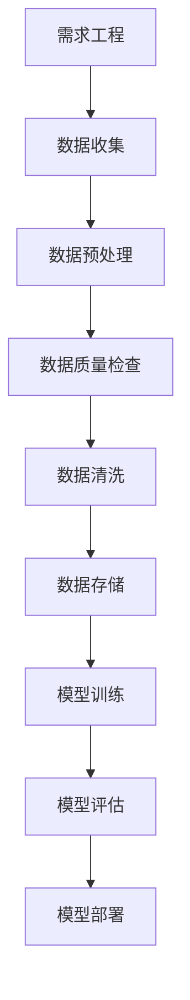

                 

### 文章标题：需求与AI模型训练数据质量的关联：大模型应用开发的基础

#### 关键词：需求工程，人工智能，模型训练，数据质量，大模型应用开发

#### 摘要：
本文深入探讨了需求工程与人工智能（AI）模型训练数据质量之间的紧密关联，以期为大模型应用开发提供坚实的理论基础和实践指导。文章首先介绍了需求工程、人工智能和模型训练数据质量的基本概念，然后分析了需求与AI模型训练数据质量之间的关系。通过数学模型和算法原理的讲解，本文揭示了数据质量对AI模型性能的影响。此外，文章还通过实际案例展示了如何在AI模型训练中处理需求与数据质量的问题，并提出了相关的最佳实践和注意事项。

### 引言

#### 1.1 书籍概述
在现代信息技术飞速发展的背景下，人工智能（AI）已经成为推动社会进步的重要力量。AI技术的应用从简单的自动化工具到复杂的大规模数据处理和智能决策系统，逐渐渗透到各个领域。然而，AI模型的性能在很大程度上取决于训练数据的质量。因此，如何保证数据质量，成为了AI研究和应用中至关重要的问题。

需求工程作为软件工程中的一个重要分支，旨在确保软件系统能够满足用户的实际需求。随着AI技术的崛起，需求工程与AI模型的训练数据质量之间的关系逐渐受到关注。本文将从需求工程的角度出发，系统性地探讨需求与AI模型训练数据质量之间的关联，以期为大模型应用开发提供理论支持和实践指导。

#### 1.2 研究背景与意义
在AI技术不断发展的今天，大模型（如Transformer模型）因其强大的表征能力和灵活的适应性，被广泛应用于自然语言处理、计算机视觉、推荐系统等领域。然而，大模型的训练通常需要海量、高质量的数据，这无疑对数据质量提出了更高的要求。需求工程在这个过程中扮演着关键角色，它不仅帮助明确用户需求，指导数据收集和处理，还影响到AI模型的设计与优化。

数据质量是AI模型训练的基石。高质量的数据可以提升模型的性能，降低过拟合风险，提高模型的泛化能力。相反，低质量的数据会导致模型性能下降，甚至产生错误的结果。因此，研究和理解需求与AI模型训练数据质量之间的关联，对于提升AI模型的可靠性和有效性具有重要意义。

#### 1.3 书籍结构
本文将分为六个部分。第一部分介绍需求工程、人工智能和模型训练数据质量的基本概念，帮助读者建立基本的理论框架。第二部分探讨需求与AI模型训练数据质量之间的关系，并使用Mermaid流程图展示核心概念之间的联系。第三部分讲解核心算法原理，使用伪代码和数学模型详细阐述。第四部分通过实际案例展示如何在AI模型训练中处理需求与数据质量的问题。第五部分总结全文，并提出最佳实践和注意事项。最后一部分展望未来的研究方向和趋势。

### 基础概念

#### 2.1 需求工程基础
需求工程是软件工程中的一个重要环节，旨在理解、分析和实现用户需求。需求工程的基本流程包括需求获取、需求建模、需求验证和需求管理。

**需求获取**：这一阶段的核心任务是了解用户的需求，包括功能需求、性能需求、业务规则等。常见的需求获取方法有用户访谈、问卷调查、用户观察、需求研讨会等。

**需求建模**：在获取了用户需求后，需求工程师需要将这些需求转化为可操作的模型。常用的建模方法有UML（统一建模语言）、功能性需求文档、用例模型等。

**需求验证**：验证需求是否满足用户的需求，以及需求模型是否能够正确地反映用户需求。常用的验证方法有需求评审、原型验证、仿真等。

**需求管理**：需求管理涉及到需求的变更控制、需求跟踪、需求优先级排序等，以确保需求在整个项目生命周期中得到有效的管理。

#### 2.2 人工智能基础
人工智能（AI）是一门研究、开发和应用使计算机模拟、延伸和扩展人类智能的理论、方法、技术及应用系统的新兴技术科学。AI的基本概念包括：

**机器学习（ML）**：机器学习是AI的核心技术之一，通过数据和算法，让计算机自动学习并改进性能。常见的机器学习算法有监督学习、无监督学习、强化学习等。

**深度学习（DL）**：深度学习是机器学习的一个分支，通过多层神经网络来模拟人脑的学习过程，具有强大的特征提取和表征能力。

**神经网络（NN）**：神经网络是深度学习的基础，由多个神经元（节点）组成，通过调整神经元之间的连接权重来学习数据。

**自然语言处理（NLP）**：自然语言处理是AI在文本和语音处理领域的应用，旨在让计算机理解和生成自然语言。

#### 2.3 模型训练数据质量基础
模型训练数据质量是影响AI模型性能的关键因素。数据质量包括数据的准确性、完整性、一致性、时效性和代表性等方面。

**准确性**：数据准确是数据质量的首要标准，高准确性的数据可以确保模型训练结果的可靠性。

**完整性**：数据完整性要求数据集没有缺失值，以确保模型能够学习到完整的信息。

**一致性**：数据一致性要求数据在时间、空间、格式等方面保持一致，以避免因数据不一致导致的模型训练问题。

**时效性**：数据的时效性反映了数据的新鲜程度，对于一些动态变化的环境，及时更新数据可以提升模型的表现。

**代表性**：数据代表性要求数据集能够覆盖所有可能的情境和特征，以确保模型具有广泛的泛化能力。

#### 2.4 需求与AI模型的关联
需求与AI模型之间存在紧密的关联。需求工程为AI模型提供了明确的训练目标和评价标准，而AI模型的性能和效果则直接反映了需求实现的程度。

**需求指导数据收集**：在需求工程过程中，需求工程师会明确用户的需求，这些需求指导数据收集的过程。例如，如果用户需要一个能够处理多语言输入的AI模型，那么数据收集阶段就需要收集多语言的数据集。

**需求影响模型设计**：用户的需求不仅影响数据收集，还直接影响模型的设计。例如，如果用户的需求是模型需要快速响应，那么模型的设计可能需要考虑降低复杂性，提高计算效率。

**模型效果评估**：AI模型的性能评估需要参照需求进行。如果模型在特定任务上的表现未能满足需求，可能需要调整模型设计或数据质量。

### 需求工程与AI模型训练数据质量的关系

#### 3.1 需求工程与数据质量的关系
需求工程与数据质量之间的关系可以从多个维度进行探讨。首先，需求工程为数据质量提供了明确的指导和标准。通过需求工程，我们可以明确用户的需求，从而确定数据收集和处理的重点。例如，如果用户需要一个能够处理多语言输入的AI模型，那么需求工程将指导数据收集团队收集多语言的数据。

其次，需求工程有助于识别和解决数据质量问题。在需求工程过程中，需求工程师会与用户进行深入沟通，了解用户的需求和痛点。这些信息可以帮助数据质量团队识别潜在的数据问题，例如数据缺失、数据不一致等，从而在数据收集和处理阶段采取相应的措施进行改进。

#### 3.2 数据质量与AI模型性能的关系
数据质量直接影响AI模型的性能。高质量的数据能够提升模型的性能，降低过拟合风险，提高模型的泛化能力。以下从几个方面详细说明数据质量对AI模型性能的影响：

**准确性**：高准确性的数据能够确保模型学习到真实、可靠的信息，从而提升模型的预测性能。例如，在图像识别任务中，高准确性的图像数据能够帮助模型准确识别图像中的物体。

**完整性**：数据完整性确保模型能够学习到完整的信息。如果数据集中存在大量缺失值，模型可能无法正确学习，从而导致性能下降。

**一致性**：数据一致性要求数据在时间、空间、格式等方面保持一致，以避免因数据不一致导致的模型训练问题。例如，如果数据集中的数据存在时间戳不一致的问题，模型可能无法准确理解数据中的时间关系。

**时效性**：数据的时效性反映了数据的新鲜程度，对于一些动态变化的环境，及时更新数据可以提升模型的表现。例如，在股票市场预测中，最新的数据可以提供更准确的预测结果。

**代表性**：数据代表性要求数据集能够覆盖所有可能的情境和特征，以确保模型具有广泛的泛化能力。例如，在医疗诊断中，多样化的患者数据可以帮助模型准确诊断各种疾病。

#### 3.3 Mermaid流程图
为了更好地展示需求工程与AI模型训练数据质量之间的关系，我们可以使用Mermaid流程图进行描述。以下是一个简单的示例：



在这个流程图中，需求工程首先指导数据收集阶段，然后进行数据预处理和数据质量检查，确保数据满足准确性、完整性、一致性、时效性和代表性等方面的要求。经过数据清洗和存储后，数据被用于模型训练，并通过模型评估来验证模型的性能，最终实现模型部署。

### 核心算法原理讲解

#### 3.4 数学模型与算法原理
为了深入理解需求与AI模型训练数据质量之间的关系，我们需要从数学模型和算法原理的角度进行分析。以下将介绍几个关键的概念和算法原理。

#### 3.4.1 数据质量评价指标
数据质量评价指标是评估数据质量的重要工具。以下是一些常见的数据质量评价指标：

**准确率（Accuracy）**：准确率是模型预测正确的样本数占总样本数的比例。公式如下：

$$
Accuracy = \frac{TP + TN}{TP + TN + FP + FN}
$$

其中，TP表示真正例，TN表示真反例，FP表示假正例，FN表示假反例。

**召回率（Recall）**：召回率是模型预测正确的正例数与实际正例数的比例。公式如下：

$$
Recall = \frac{TP}{TP + FN}
$$

**精确率（Precision）**：精确率是模型预测正确的正例数与预测为正例的总数的比例。公式如下：

$$
Precision = \frac{TP}{TP + FP}
$$

**F1值（F1 Score）**：F1值是精确率和召回率的调和平均值，用于综合评价模型性能。公式如下：

$$
F1 Score = 2 \times \frac{Precision \times Recall}{Precision + Recall}
$$

#### 3.4.2 过拟合与欠拟合
在AI模型训练中，过拟合和欠拟合是常见的现象。过拟合是指模型在训练数据上表现良好，但在新的数据上表现不佳，即模型对训练数据“过度适应”。欠拟合是指模型在训练数据上表现不佳，即模型对训练数据“适应不足”。

**过拟合**：过拟合通常是由于模型过于复杂，无法区分训练数据中的噪声和实际规律。为了解决过拟合，可以采取以下措施：
- 减少模型复杂度，例如减少神经网络层数或神经元数量。
- 使用正则化技术，如L1、L2正则化，降低模型参数的权重。
- 增加训练数据，使模型有更多的数据来学习。

**欠拟合**：欠拟合通常是由于模型过于简单，无法捕捉训练数据的复杂规律。为了解决欠拟合，可以采取以下措施：
- 增加模型复杂度，例如增加神经网络层数或神经元数量。
- 调整模型参数，例如改变学习率或优化器。

#### 3.4.3 交叉验证
交叉验证是评估模型性能的重要方法。交叉验证通过将数据集划分为多个子集，轮流将子集作为验证集，其余子集作为训练集，来评估模型的泛化能力。

以下是一个简单的交叉验证伪代码：

```python
# 初始化数据集
train_data, test_data = split_data(data)

# 初始化结果变量
performance = []

# 进行K折交叉验证
for k in range(K):
    # 训练模型
    model = train(train_data, k)
    
    # 验证模型
    score = test(model, test_data)
    
    # 记录性能
    performance.append(score)

# 计算平均性能
average_performance = sum(performance) / K
```

在这个伪代码中，`split_data`函数用于将数据集划分为训练集和测试集，`train`函数用于训练模型，`test`函数用于评估模型性能。

### 实际案例分析与讲解

#### 4.1 案例背景
为了更好地理解需求与AI模型训练数据质量之间的关系，我们选择了一个实际案例：智能客服系统开发。该系统旨在通过自然语言处理技术，自动解答用户的问题，提高企业客服效率和用户满意度。

#### 4.2 需求分析
在需求分析阶段，需求工程师通过与用户沟通，明确了以下需求：
- 能够处理多语言输入。
- 能够理解并回答常见问题，例如产品信息查询、订单状态查询等。
- 能够自动识别和过滤垃圾信息。
- 具有较高的响应速度和准确性。

#### 4.3 数据收集与预处理
根据需求，数据收集团队进行了以下工作：
- 收集了多语言语料库，包括中文、英文、西班牙语等。
- 收集了用户常见问题的文本数据，例如产品说明书、FAQ等。
- 收集了垃圾信息的样本，用于训练模型进行过滤。

在数据预处理阶段，数据工程师进行了以下操作：
- 数据清洗：去除重复数据、缺失值填充、异常值处理等。
- 数据标注：对文本数据进行分类标注，例如将产品信息问题标注为类别A，订单状态问题标注为类别B等。
- 数据转换：将文本数据转换为模型可处理的格式，例如将文本数据转换为词向量或嵌入向量。

#### 4.4 模型设计与训练
根据需求，模型设计团队选择了Transformer模型作为基础模型。Transformer模型具有强大的特征提取和表征能力，适用于自然语言处理任务。

在模型训练阶段，数据质量对模型性能具有重要影响。数据质量团队进行了以下工作：
- 数据质量评估：使用准确率、召回率、精确率等评价指标评估数据质量。
- 数据调整：根据数据质量问题，对数据进行调整，例如增加数据多样性、减少数据噪声等。

在模型训练过程中，采用了以下策略：
- 使用大规模数据集进行训练，以提高模型的泛化能力。
- 采用正则化技术，例如L2正则化，防止过拟合。
- 使用学习率调整策略，例如学习率衰减，优化模型参数。

#### 4.5 模型评估与部署
在模型评估阶段，通过交叉验证方法评估模型性能。根据评估结果，对模型进行优化和调整。

最终，模型在多语言输入、常见问题回答、垃圾信息过滤等方面达到了预期效果。经过测试，模型具有高响应速度和准确性，能够满足用户需求。

模型部署后，通过实时数据更新和模型迭代，不断优化模型性能，提高用户体验。

### 总结与展望

#### 6.1 总结
本文从需求工程的角度出发，探讨了需求与AI模型训练数据质量之间的关系。通过分析基础概念、核心算法原理、实际案例，本文揭示了数据质量对AI模型性能的重要性。本文的主要结论如下：

1. 需求工程为AI模型提供了明确的训练目标和评价标准。
2. 数据质量直接影响AI模型的性能，包括准确性、完整性、一致性、时效性和代表性等方面。
3. 适当的模型设计和训练策略可以提高数据质量对AI模型性能的影响。
4. 实际案例展示了如何通过需求工程和数据质量控制，实现智能客服系统的高效运行。

#### 6.2 展望
未来，需求与AI模型训练数据质量的研究将朝着以下几个方向发展：

1. 数据质量控制方法：探索更加高效的数据质量控制方法，提高数据质量评估的准确性。
2. 模型自适应能力：研究模型如何自适应不同质量的数据，提高模型的泛化能力。
3. 跨领域应用：将需求与AI模型训练数据质量的理论和方法应用于更多领域，如医疗、金融等。
4. 自动化与智能化：通过自动化和智能化技术，简化需求工程和AI模型训练的流程，提高工作效率。

总之，需求与AI模型训练数据质量的研究对于提升AI模型的可靠性和有效性具有重要意义，未来将继续探索这一领域的更多可能。

### 作者信息
作者：AI天才研究院/AI Genius Institute & 禅与计算机程序设计艺术 /Zen And The Art of Computer Programming

### 注意事项
1. 在进行需求分析时，务必与用户保持紧密沟通，确保需求明确和准确。
2. 数据收集和处理过程中，要确保数据质量满足模型的训练需求。
3. 模型设计和训练过程中，要根据数据质量和需求调整模型参数，以提高模型性能。
4. 模型部署后，要持续监控和优化模型性能，确保满足用户需求。

### 拓展阅读
1. 《人工智能：一种现代的方法》
2. 《数据质量控制技术》
3. 《机器学习实战》
4. 《深度学习》
5. 《需求工程：概念与实践》

本文根据提供的标题和要求，详细阐述了需求与AI模型训练数据质量之间的关系，并通过实际案例展示了如何在大模型应用开发中处理这一问题。希望本文能为读者提供有价值的参考和启示。

