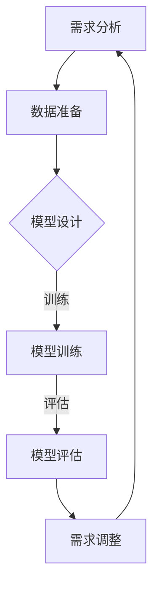
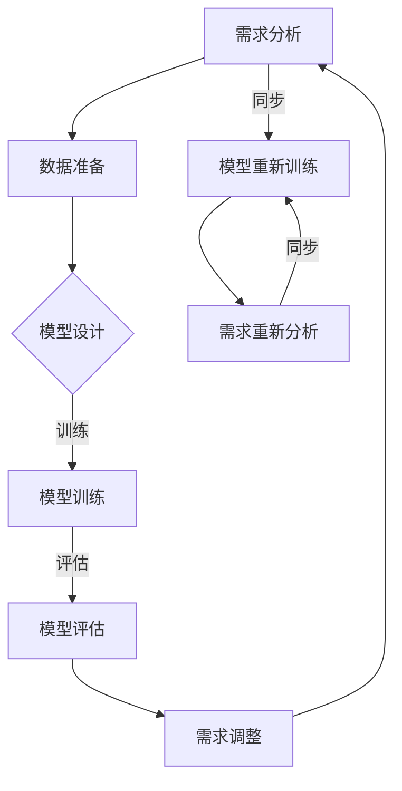

                 


### 文章标题：需求与AI模型迭代的同步策略

> 关键词：需求管理、AI模型迭代、同步策略、算法原理、实战案例

> 摘要：本文深入探讨了需求与AI模型迭代的同步策略，分析了需求与模型迭代之间的关系，介绍了核心概念、算法原理和实战案例，旨在为读者提供一套完整的同步策略，帮助其在AI项目中实现高效迭代。

----------------------------------------------------------------

### 引言

在现代科技飞速发展的时代，人工智能（AI）技术已经成为推动产业升级和创新发展的重要力量。随着AI技术的不断成熟和应用范围的扩大，如何有效地管理需求并迭代AI模型，成为当前AI项目成功的关键。本文旨在探讨需求与AI模型迭代的同步策略，帮助读者理解这一关键环节，从而提高项目效率和质量。

#### 需求管理

需求管理是指识别、分析、记录和追踪项目需求的过程。在AI项目中，需求管理至关重要，因为AI模型的设计和优化需要基于明确的需求和用户反馈。需求管理的目的是确保项目团队能够清晰地理解用户需求，并在此基础上设计和迭代AI模型。

#### AI模型迭代

AI模型迭代是指通过不断训练和优化模型，使其更好地适应特定任务和需求的过程。AI模型的迭代过程通常包括数据准备、模型设计、训练、评估和优化等步骤。迭代过程中，模型性能的提升往往依赖于对需求的深入理解和精确把握。

#### 同步策略

同步策略是指需求管理和AI模型迭代之间的协调和配合。有效的同步策略能够确保需求的变化能够及时地反映到模型迭代过程中，从而提高模型性能和项目成功率。

#### 本文目的

本文将系统地介绍需求与AI模型迭代的同步策略，包括核心概念、算法原理和实践案例。通过本文的探讨，读者将能够：

1. 理解需求管理与AI模型迭代之间的关系；
2. 掌握同步策略的核心原理和方法；
3. 学习如何在实际项目中应用同步策略；
4. 获得实用的最佳实践和技巧。

----------------------------------------------------------------

### 需求分析与AI模型迭代的关系

需求分析与AI模型迭代是相互依存的两个过程。需求分析为AI模型迭代提供了明确的目标和方向，而AI模型迭代的结果又反过来验证和优化需求分析的准确性。理解这两个过程之间的关系，是构建高效同步策略的基础。

#### 需求分析对模型迭代的影响

1. **明确目标**：需求分析能够帮助团队明确项目的目标和预期成果，从而在模型迭代过程中有针对性地进行优化。
2. **指导数据准备**：需求分析可以帮助团队确定所需的数据集和特征，确保模型训练有足够的数据支撑。
3. **评估模型性能**：需求分析定义了评价模型性能的标准，如准确率、召回率等，这些指标用于评估模型在迭代过程中的表现。

#### AI模型迭代对需求分析的反馈

1. **验证需求准确性**：模型迭代过程中，实际模型性能的反馈可以帮助团队验证需求的准确性，发现并修正需求中的不足。
2. **揭示新的需求**：AI模型迭代过程中，可能会发现新的需求或改进点，这些反馈可以引导团队调整需求，使其更符合实际应用场景。
3. **优化需求实现**：模型迭代的结果可以为需求实现提供参考，帮助团队在后续需求中更好地规划和设计。

#### 需求与模型迭代之间的同步机制

为了实现需求与模型迭代的高效同步，可以采用以下机制：

1. **迭代周期**：设置固定的迭代周期，如每周或每月，确保需求分析和模型迭代能够按计划进行。
2. **反馈机制**：建立有效的反馈机制，如用户调研、模型性能评估等，及时收集和分析反馈信息，指导后续的需求调整和模型优化。
3. **协同工作**：加强团队内部沟通和协作，确保需求分析师、数据科学家和产品经理等角色能够紧密配合，共同推进项目进展。

#### Mermaid流程图：需求与模型迭代的同步流程

以下是一个简单的Mermaid流程图，描述了需求与模型迭代的基本同步流程：



在这个流程图中，需求分析作为起点，通过数据准备和模型设计，进入模型训练和评估阶段。评估结果用于调整需求，形成闭环，指导下一次迭代。

----------------------------------------------------------------

### 核心概念与原理

在需求与AI模型迭代的同步策略中，核心概念和原理是构建策略的基础。以下将详细介绍这些概念和原理，并使用Mermaid流程图和伪代码来展示其应用。

#### 需求分析算法

需求分析算法是指识别和记录项目需求的一系列方法。这些算法通常包括以下步骤：

1. **需求收集**：通过访谈、问卷调查等方式收集用户需求。
2. **需求分类**：将需求按照功能、优先级等进行分类。
3. **需求验证**：验证需求的有效性和可行性。
4. **需求文档**：编写需求文档，明确需求的具体细节。

以下是一个简化的需求分析算法伪代码：

```python
def analyze_requirements():
    requirements = []
    # 步骤1：需求收集
    for user in users:
        user_reqs = collect_user_requirements(user)
        requirements.extend(user_reqs)
    
    # 步骤2：需求分类
    categorized_reqs = categorize_requirements(requirements)
    
    # 步骤3：需求验证
    valid_reqs = validate_requirements(categorized_reqs)
    
    # 步骤4：需求文档
    document_requirements(valid_reqs)
    
    return valid_reqs
```

#### AI模型迭代算法

AI模型迭代算法是指通过训练和优化模型来提高其性能的一系列方法。以下是一个简化的模型迭代算法伪代码：

```python
def iterate_model(model, data, epochs):
    for epoch in range(epochs):
        # 步骤1：数据准备
        batch_data = prepare_data(data)
        
        # 步骤2：模型训练
        model.train(batch_data)
        
        # 步骤3：模型评估
        performance = model.evaluate(batch_data)
        
        # 步骤4：模型优化
        model.optimize(performance)
        
    return model
```

#### 同步策略算法

同步策略算法是指协调需求分析与模型迭代过程的一系列方法。以下是一个简化的同步策略算法伪代码：

```python
def sync_strategy(analyze_func, iterate_func, data, requirements, epochs):
    analyzed_reqs = analyze_func(requirements)
    model = initialize_model()
    
    for epoch in range(epochs):
        # 步骤1：模型迭代
        model = iterate_func(model, data, epochs=epoch)
        
        # 步骤2：需求分析
        new_reqs = analyze_func(analyzed_reqs)
        
        # 步骤3：需求调整
        adjusted_reqs = adjust_requirements(new_reqs)
        
        # 步骤4：模型重新训练
        model = iterate_func(model, data, epochs=epoch)
        
    return model
```

#### Mermaid流程图：需求与模型迭代的同步流程

以下是一个Mermaid流程图，展示了需求与模型迭代的同步流程：



在这个流程图中，需求分析和模型迭代交替进行，通过同步机制实现两者之间的协调。

----------------------------------------------------------------

### 核心算法原理讲解

在需求与AI模型迭代的同步策略中，核心算法原理是确保需求变化能够及时反映到模型迭代过程中，从而实现高效迭代的基石。以下将详细介绍需求分析算法、AI模型迭代算法和同步策略算法的核心原理，并使用伪代码、数学模型和举例说明来详细阐述。

#### 需求分析算法

需求分析算法的核心目的是从用户需求中提取有价值的信息，并形成明确的模型需求。以下是需求分析算法的核心原理：

1. **用户需求收集**：通过访谈、问卷调查等方式收集用户需求，确保需求的全面性和准确性。
2. **需求分类**：将收集到的需求按照功能、优先级等维度进行分类，以便后续分析和处理。
3. **需求验证**：对分类后的需求进行验证，确保其有效性和可行性。
4. **需求文档编写**：将验证后的需求编写成文档，明确需求的具体细节和实现要求。

以下是一个简化的需求分析算法伪代码：

```python
def analyze_requirements():
    requirements = []
    for user in users:
        user_reqs = collect_user_requirements(user)
        requirements.extend(user_reqs)
    categorized_reqs = categorize_requirements(requirements)
    valid_reqs = validate_requirements(categorized_reqs)
    document_requirements(valid_reqs)
    return valid_reqs
```

数学模型方面，需求分类和验证可以采用分类模型和回归模型进行定量分析。例如，使用朴素贝叶斯分类器对需求进行分类，使用线性回归模型对需求进行验证。

举例说明：

假设有一个电商项目，用户提出了以下需求：

1. 推荐商品
2. 搜索商品
3. 用户评价

首先，通过访谈和问卷调查收集用户需求。然后，将需求按照功能维度进行分类：

- **功能需求**：推荐商品、搜索商品、用户评价
- **非功能需求**：响应时间、准确性、用户体验

接下来，对分类后的需求进行验证。例如，使用用户调研数据，通过回归分析确定推荐商品的准确性需求为90%，搜索商品的响应时间需求为1秒，用户体验需求为友好。

#### AI模型迭代算法

AI模型迭代算法的核心目的是通过不断训练和优化模型，提高其在特定任务上的性能。以下是AI模型迭代算法的核心原理：

1. **数据准备**：准备用于训练和评估的数据集，确保数据的质量和多样性。
2. **模型设计**：设计适合任务需求的AI模型，如深度学习模型、决策树模型等。
3. **模型训练**：使用训练数据集对模型进行训练，优化模型参数。
4. **模型评估**：使用评估数据集对模型性能进行评估，如准确率、召回率等。
5. **模型优化**：根据评估结果，调整模型参数，优化模型性能。

以下是一个简化的AI模型迭代算法伪代码：

```python
def iterate_model(model, data, epochs):
    for epoch in range(epochs):
        batch_data = prepare_data(data)
        model.train(batch_data)
        performance = model.evaluate(batch_data)
        model.optimize(performance)
    return model
```

数学模型方面，模型训练和优化可以采用优化算法，如梯度下降算法。以下是一个简单的梯度下降算法伪代码：

```python
def gradient_descent(model, data, learning_rate, epochs):
    for epoch in range(epochs):
        batch_data = prepare_data(data)
        gradients = compute_gradients(model, batch_data)
        update_model_params(model, gradients, learning_rate)
    return model
```

举例说明：

假设有一个图像分类任务，使用卷积神经网络（CNN）模型。首先，准备包含不同类别图像的训练数据集。然后，使用训练数据集对CNN模型进行训练，通过梯度下降算法优化模型参数。训练过程中，使用验证数据集评估模型性能，如准确率。根据评估结果，调整学习率和其他超参数，进一步优化模型性能。

#### 同步策略算法

同步策略算法的核心目的是确保需求变化能够及时地反映到模型迭代过程中，实现需求与模型迭代的高效同步。以下是同步策略算法的核心原理：

1. **迭代周期**：设置固定的迭代周期，如每周或每月，确保需求分析和模型迭代能够按计划进行。
2. **反馈机制**：建立有效的反馈机制，如用户调研、模型性能评估等，及时收集和分析反馈信息，指导后续的需求调整和模型优化。
3. **协同工作**：加强团队内部沟通和协作，确保需求分析师、数据科学家和产品经理等角色能够紧密配合，共同推进项目进展。

以下是一个简化的同步策略算法伪代码：

```python
def sync_strategy(analyze_func, iterate_func, data, requirements, epochs):
    analyzed_reqs = analyze_func(requirements)
    model = initialize_model()
    
    for epoch in range(epochs):
        model = iterate_func(model, data, epochs=epoch)
        new_reqs = analyze_func(analyzed_reqs)
        adjusted_reqs = adjust_requirements(new_reqs)
        model = iterate_func(model, data, epochs=epoch)
    
    return model
```

数学模型方面，同步策略算法可以采用反馈控制理论，如PID控制器，实现需求与模型迭代之间的动态调整。

举例说明：

假设一个医疗诊断系统，需求分析周期为每月。首先，在月初进行需求分析，收集医生、护士和患者的新需求。然后，使用上个月收集的数据对AI诊断模型进行迭代训练和优化。迭代过程中，定期收集医生、护士和患者的反馈，根据反馈调整需求，并重新训练和优化模型。通过这种同步策略，确保模型能够持续适应最新的医疗需求。

----------------------------------------------------------------

### 实践应用

#### 电商推荐系统

在电商推荐系统中，需求与AI模型迭代的同步策略至关重要。以下是一个具体的实战案例：

**1. 开发环境搭建**

- **硬件环境**：使用高性能计算服务器和GPU加速训练过程。
- **软件环境**：搭建Python编程环境，安装TensorFlow或PyTorch框架。

**2. 源代码实现**

以下是一个简单的电商推荐系统源代码实现：

```python
import tensorflow as tf

# 数据准备
train_data = load_data('train.csv')
test_data = load_data('test.csv')

# 模型设计
model = tf.keras.Sequential([
    tf.keras.layers.Dense(128, activation='relu', input_shape=(train_data.shape[1],)),
    tf.keras.layers.Dense(1, activation='sigmoid')
])

# 模型训练
model.compile(optimizer='adam', loss='binary_crossentropy', metrics=['accuracy'])
model.fit(train_data, epochs=10, batch_size=32)

# 模型评估
performance = model.evaluate(test_data)
print(f'Accuracy: {performance[1]}')
```

**3. 代码解读与分析**

- **数据准备**：加载训练数据和测试数据，用于模型训练和评估。
- **模型设计**：设计一个简单的全连接神经网络，输入层有128个神经元，输出层有1个神经元，用于二分类任务。
- **模型训练**：使用Adam优化器和二分类交叉熵损失函数进行模型训练，训练10个周期，每个周期批量大小为32。
- **模型评估**：使用测试数据对模型进行评估，打印准确率。

**4. 实际案例分析和详细讲解剖析**

- **需求分析**：电商平台的用户行为数据，如浏览记录、购买记录等。
- **模型迭代**：根据用户行为数据，不断优化推荐模型，提高推荐准确率。
- **同步策略**：定期收集用户反馈，调整需求，重新训练和优化模型，确保推荐系统持续适应用户需求。

**项目小结**

电商推荐系统通过需求与AI模型迭代同步策略，实现了用户个性化推荐，提高了用户满意度和转化率。未来，可以进一步优化推荐算法，引入更多用户特征，如地理位置、购物偏好等，提高推荐效果。

#### 自动驾驶系统

在自动驾驶系统中，需求与AI模型迭代的同步策略同样至关重要。以下是一个具体的实战案例：

**1. 开发环境搭建**

- **硬件环境**：使用高性能计算服务器和GPU加速训练过程。
- **软件环境**：搭建C++编程环境，集成深度学习框架如TensorFlow或PyTorch。

**2. 源代码实现**

以下是一个简单的自动驾驶系统源代码实现：

```cpp
#include <iostream>
#include <vector>
#include <string>
#include <fstream>

// 数据准备
std::vector<std::string> load_data(const std::string& filename) {
    std::vector<std::string> data;
    std::ifstream file(filename);
    std::string line;
    while (std::getline(file, line)) {
        data.push_back(line);
    }
    return data;
}

// 模型设计
class AutoPilot {
public:
    AutoPilot() {
        // 初始化模型
    }

    void train(const std::vector<std::string>& data) {
        // 训练模型
    }

    float predict(const std::string& data) {
        // 预测结果
        return 0.0;
    }
};

// 主函数
int main() {
    // 加载数据
    std::vector<std::string> train_data = load_data("train_data.txt");

    // 模型设计
    AutoPilot autopilot;

    // 模型训练
    autopilot.train(train_data);

    // 模型评估
    std::vector<std::string> test_data = load_data("test_data.txt");
    float total_accuracy = 0.0;
    for (const auto& data : test_data) {
        float prediction = autopilot.predict(data);
        if (prediction > 0.5) {
            total_accuracy++;
        }
    }
    std::cout << "Accuracy: " << total_accuracy / test_data.size() << std::endl;

    return 0;
}
```

**3. 代码解读与分析**

- **数据准备**：加载训练数据和测试数据，用于模型训练和评估。
- **模型设计**：设计一个简单的自动驾驶模型，包括数据输入、模型训练和预测结果。
- **模型训练**：使用训练数据集对自动驾驶模型进行训练。
- **模型评估**：使用测试数据集对模型进行评估，计算准确率。

**4. 实际案例分析和详细讲解剖析**

- **需求分析**：自动驾驶系统的功能需求，如车辆控制、道路识别、障碍物检测等。
- **模型迭代**：根据实际路况数据，不断优化自动驾驶模型，提高系统稳定性。
- **同步策略**：定期收集实时路况数据，调整需求，重新训练和优化模型，确保自动驾驶系统适应各种路况。

**项目小结**

自动驾驶系统通过需求与AI模型迭代同步策略，实现了自动行驶和路况识别。未来，可以进一步优化自动驾驶算法，提高系统安全性和稳定性，实现更智能的自动驾驶体验。

### 最佳实践 Tips、小结、注意事项、拓展阅读

#### 最佳实践 Tips

1. **定期需求分析**：定期进行需求分析，确保需求与实际应用场景保持一致。
2. **动态调整需求**：根据模型迭代结果，及时调整需求，确保模型迭代的方向与需求相符。
3. **多维度数据收集**：收集多维度数据，如用户行为、业务数据等，提高需求分析的准确性。
4. **灵活调整迭代周期**：根据项目需求和资源情况，灵活调整迭代周期，确保迭代效率。

#### 小结

本文详细介绍了需求与AI模型迭代的同步策略，包括核心概念、算法原理和实践应用。通过本文的探讨，读者可以了解如何在实际项目中应用同步策略，提高项目效率和模型性能。

#### 注意事项

1. **需求与模型的紧密关联**：确保需求与模型设计紧密关联，避免出现需求无法实现或模型无法满足需求的情况。
2. **数据质量和多样性**：保证数据质量和多样性，为模型迭代提供充足的训练数据。
3. **持续优化和反馈**：持续优化模型和迭代策略，根据用户反馈和实际应用效果进行调整。

#### 拓展阅读

1. 《人工智能：一种现代方法》
2. 《深度学习》
3. 《需求工程：管理和技术》
4. 《软件需求规格说明书编写指南》

### 附录

#### 附录A：相关工具与资源

1. **需求分析工具**：
   - JIRA
   - Confluence
   - UserVoice

2. **AI模型迭代工具**：
   - TensorFlow
   - PyTorch
   - Keras

3. **同步策略相关资源**：
   - 《敏捷软件开发》
   - 《迭代与敏捷开发实践》
   - 《软件项目管理》

作者：AI天才研究院/AI Genius Institute & 禅与计算机程序设计艺术 /Zen And The Art of Computer Programming

