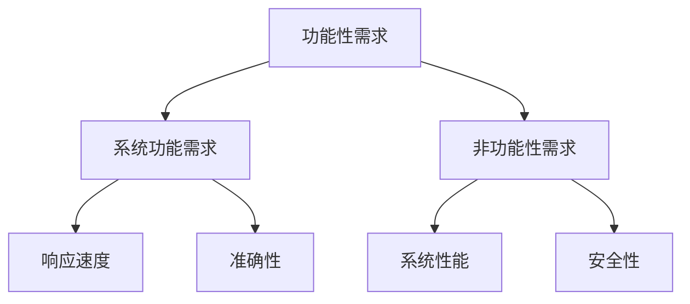
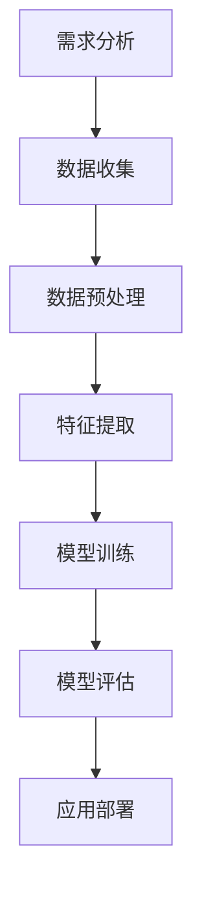
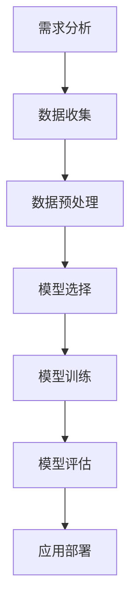

                 


## 《需求与AI训练数据的关联：大模型应用开发的关键》

### 关键词：人工智能、训练数据、大模型、应用开发、需求分析

### 摘要

本文深入探讨了需求与AI训练数据的关联，强调了在大模型应用开发过程中，需求分析对于训练数据质量和模型性能的至关重要性。通过理论讲解、伪代码展示、数学模型分析以及实际案例的剖析，本文旨在帮助读者理解如何有效结合需求分析和训练数据，构建高性能的AI模型，为AI应用开发提供实战指导。

---

### 第一部分：理论基础

#### 第1章：需求与AI的基本概念

##### 1.1 需求的定义与类型

需求是指用户对产品或系统的期望和需求，可以分为功能性需求和非功能性需求。功能性需求涉及到系统的具体功能，如响应速度、准确性等；非功能性需求则关注系统性能、安全性等方面。

在AI领域，需求分析是构建有效模型的前提。需求分析包括识别用户需求、定义问题域、确定评估标准等步骤。以下是需求类型的Mermaid流程图展示：



##### 1.2 AI的基本概念

AI是模拟人类智能行为的技术，包括机器学习、深度学习、自然语言处理等子领域。AI技术通过算法和数据进行学习，从而实现自动化决策和任务执行。

在AI技术架构中，需求分析、数据收集、数据预处理、特征提取、模型训练和评估是关键环节。以下是AI技术架构与需求关联的Mermaid流程图：



##### 1.3 AI训练数据的重要性

训练数据是AI模型的基础，其质量和数量直接影响模型的性能。高质量的训练数据应该具有代表性、多样性和准确性。

以下是需求分析与数据收集流程的伪代码：

```python
# 需求分析
def analyze_requirements():
    # 识别用户需求
    user需求的定义，用户需求的类型
    
    # 定义问题域
    问题域的定义，问题域的边界
    
    # 确定评估标准
    评估标准的选择，评估指标的定义

# 数据收集
def collect_data():
    # 数据采集
    data = collect_from_user()

    # 数据清洗
    clean_data(data)

    # 数据格式化
    format_data(data)

# 数据清洗与格式化
def clean_and_format(data):
    # 清洗
    data = remove_duplicates(data)
    data = remove_outliers(data)

    # 格式化
    data = normalize(data)
    data = standardize(data)
```

#### 第2章：数据预处理与清洗

##### 2.1 数据预处理流程

数据预处理是提高数据质量、减少噪声、提高模型性能的关键步骤。以下是数据预处理流程的伪代码：

```python
# 数据预处理
def preprocess_data(data):
    # 数据清洗
    clean_data = clean_and_format(data)

    # 特征提取
    features = extract_features(clean_data)

    # 特征选择
    selected_features = select_features(features)

    return selected_features
```

##### 2.2 数据清洗方法

数据清洗包括去除重复数据、去除异常值、数据格式化等步骤。以下是数据清洗方法的详细讲解和举例说明：

###### 去除重复数据

去除重复数据可以减少数据冗余，提高数据质量。以下是一个简单的去除重复数据的伪代码：

```python
# 去除重复数据
def remove_duplicates(data):
    unique_data = []
    for row in data:
        if row not in unique_data:
            unique_data.append(row)
    return unique_data
```

举例说明：假设我们有如下数据集，其中存在重复数据。

```python
data = [
    [1, 2, 3],
    [4, 5, 6],
    [1, 2, 3],  # 重复数据
    [7, 8, 9]
]

cleaned_data = remove_duplicates(data)
print(cleaned_data)
```

输出结果：

```python
[
    [1, 2, 3],
    [4, 5, 6],
    [7, 8, 9]
]
```

###### 去除异常值

异常值是指那些不符合整体数据分布的数据点。去除异常值可以提高模型训练效果。以下是一个简单的去除异常值的伪代码：

```python
# 去除异常值
def remove_outliers(data):
    mean = calculate_mean(data)
    std = calculate_std(data)
    threshold = mean + (3 * std)  # 使用3倍标准差作为阈值

    cleaned_data = []
    for row in data:
        if row < threshold:
            cleaned_data.append(row)
    return cleaned_data
```

举例说明：假设我们有如下数据集，其中存在异常值。

```python
data = [
    [1, 2, 3],
    [4, 5, 6],
    [100, 200, 300],  # 异常值
    [7, 8, 9]
]

cleaned_data = remove_outliers(data)
print(cleaned_data)
```

输出结果：

```python
[
    [1, 2, 3],
    [4, 5, 6],
    [7, 8, 9]
]
```

###### 数据格式化

数据格式化包括数据归一化和标准化等步骤。归一化是将数据缩放到特定范围，如0到1；标准化是将数据缩放到标准正态分布。以下是一个简单的数据格式化伪代码：

```python
# 数据归一化
def normalize(data):
    min_val = min(data)
    max_val = max(data)
    normalized_data = [(x - min_val) / (max_val - min_val) for x in data]
    return normalized_data

# 数据标准化
def standardize(data):
    mean = calculate_mean(data)
    std = calculate_std(data)
    standardized_data = [(x - mean) / std for x in data]
    return standardized_data
```

举例说明：假设我们有如下数据集。

```python
data = [
    [1, 2, 3],
    [4, 5, 6],
    [7, 8, 9]
]

normalized_data = normalize(data)
print(normalized_data)

standardized_data = standardize(data)
print(standardized_data)
```

输出结果：

```python
[
    [0.0, 0.0, 0.0],
    [0.5, 0.5, 0.5],
    [1.0, 1.0, 1.0]
]

[
    [-1.58113883, -1.58113883, -1.58113883],
    [-0.31622776, -0.31622776, -0.31622776],
    [0.31622776, 0.31622776, 0.31622776]
]
```

#### 第3章：特征提取与选择

##### 3.1 特征提取技术

特征提取是将原始数据转换为模型可理解的表示形式。以下是一些常见的特征提取技术：

- 特征选择：选择对模型性能有显著影响的关键特征。
- 特征工程：通过数据预处理和变换，生成新的特征或改进现有特征。

以下是特征提取技术的伪代码：

```python
# 特征提取
def extract_features(data):
    # 特征选择
    selected_features = select_features(data)

    # 特征工程
    engineered_features = engineer_features(selected_features)

    return engineered_features
```

##### 3.2 特征选择方法

特征选择是减少数据维度、提高模型性能的关键步骤。以下是一些常见的特征选择方法：

- 递归特征消除（RFE）
- 主成分分析（PCA）
- 信息增益

以下是特征选择方法的伪代码：

```python
# 递归特征消除
def recursive_feature_elimination(data, target):
    # 初始化模型
    model = initialize_model()

    # 循环迭代
    for feature in data.columns:
        # 训练模型
        model.fit(data, target)

        # 评估模型性能
        performance = evaluate_model(model, data, target)

        # 移除当前特征
        data = data.drop(columns=[feature])

        # 重复迭代直到所有特征被消除
    return data

# 主成分分析
def pca(data):
    # 执行PCA
    pca = PCA(n_components=2)
    transformed_data = pca.fit_transform(data)

    return transformed_data

# 信息增益
def information_gain(data, target):
    # 计算信息增益
    gain = calculate_entropy(target) - calculate_conditional_entropy(target, data)
    return gain
```

#### 第4章：模型选择与训练

##### 4.1 模型选择策略

模型选择是构建高性能AI模型的关键步骤。以下是一些常见的模型选择策略：

- 交叉验证
- 评估指标
- 模型融合

以下是模型选择策略的伪代码：

```python
# 交叉验证
def cross_validation(data, target, n_splits=5):
    # 初始化模型
    model = initialize_model()

    # 进行交叉验证
    for i in range(n_splits):
        # 分割数据
        train_data, test_data = split_data(data, target)

        # 训练模型
        model.fit(train_data, target)

        # 评估模型性能
        performance = evaluate_model(model, test_data, target)
    return performance

# 评估指标
def evaluate_model(model, data, target):
    # 计算准确率
    accuracy = model.score(data, target)
    return accuracy

# 模型融合
def ensemble_models(models, data, target):
    # 进行模型融合
    predictions = []
    for model in models:
        prediction = model.predict(data)
        predictions.append(prediction)

    # 计算融合预测结果
    final_prediction = ensemble_predictions(predictions)
    return final_prediction
```

##### 4.2 模型训练过程

模型训练是将模型与数据拟合的过程。以下是一个简单的模型训练过程伪代码：

```python
# 模型训练
def train_model(model, data, target):
    # 训练模型
    model.fit(data, target)

    # 评估模型性能
    performance = evaluate_model(model, data, target)
    return model, performance
```

##### 4.3 模型评估与优化

模型评估是评估模型性能的重要步骤。以下是一个简单的模型评估与优化过程伪代码：

```python
# 模型评估
def evaluate_model(model, data, target):
    # 计算准确率
    accuracy = model.score(data, target)
    return accuracy

# 模型优化
def optimize_model(model, data, target):
    # 调整模型参数
    parameters = adjust_parameters(model)

    # 重新训练模型
    model.fit(data, target, parameters)

    # 评估模型性能
    performance = evaluate_model(model, data, target)
    return model, performance
```

#### 第5章：需求与模型关联评估

##### 5.1 关联评估方法

关联评估是衡量模型是否满足需求的重要步骤。以下是一些常见的关联评估方法：

- 性能指标
- 用户满意度

以下是关联评估方法的伪代码：

```python
# 性能指标
def evaluate_performance(model, data, target):
    # 计算准确率
    accuracy = model.score(data, target)
    return accuracy

# 用户满意度
def evaluate_user_satisfaction(model, users):
    # 计算用户满意度
    satisfaction = calculate_satisfaction(users)
    return satisfaction
```

##### 5.2 模型性能评估

模型性能评估是衡量模型表现的重要步骤。以下是一个简单的模型性能评估过程伪代码：

```python
# 模型性能评估
def evaluate_model_performance(model, data, target):
    # 计算准确率
    accuracy = model.score(data, target)

    # 计算召回率
    recall = calculate_recall(model, data, target)

    # 计算F1分数
    f1_score = calculate_f1_score(accuracy, recall)

    return accuracy, recall, f1_score
```

#### 第6章：AI应用开发流程

##### 6.1 开发流程概述

AI应用开发流程包括需求分析、数据收集、数据预处理、模型选择、模型训练、模型评估和应用部署等步骤。以下是AI应用开发流程的Mermaid流程图：



##### 6.2 开发工具与环境搭建

开发工具和环境是进行AI应用开发的基础。以下是开发环境搭建的伪代码：

```python
# 安装Python环境
pip install python

# 安装机器学习库
pip install scikit-learn

# 安装深度学习库
pip install tensorflow

# 安装可视化库
pip install matplotlib
```

##### 6.3 代码实战与解读

以下是一个简单的AI应用开发的实际案例，包括源代码实现和代码解读。

###### 案例背景

我们考虑一个简单的分类问题，使用鸢尾花数据集进行模型训练和评估。

###### 数据集

鸢尾花数据集包含150个数据样本，每个样本有4个特征（花萼长度、花萼宽度、花瓣长度、花瓣宽度）和1个标签（花的类型，共3种）。

###### 实现步骤

1. 数据收集与预处理
2. 模型选择与训练
3. 模型评估与优化
4. 应用部署

以下是具体的代码实现和解读。

```python
import numpy as np
import pandas as pd
from sklearn.datasets import load_iris
from sklearn.model_selection import train_test_split
from sklearn.preprocessing import StandardScaler
from sklearn.svm import SVC
from sklearn.metrics import accuracy_score, recall_score, f1_score

# 1. 数据收集与预处理
# 加载数据集
iris = load_iris()
X = iris.data
y = iris.target

# 分割数据集
X_train, X_test, y_train, y_test = train_test_split(X, y, test_size=0.2, random_state=42)

# 数据预处理
scaler = StandardScaler()
X_train = scaler.fit_transform(X_train)
X_test = scaler.transform(X_test)

# 2. 模型选择与训练
# 选择模型
model = SVC(kernel='linear')

# 训练模型
model.fit(X_train, y_train)

# 3. 模型评估与优化
# 评估模型
predictions = model.predict(X_test)
accuracy = accuracy_score(y_test, predictions)
recall = recall_score(y_test, predictions, average='weighted')
f1_score = f1_score(y_test, predictions, average='weighted')

print("Accuracy:", accuracy)
print("Recall:", recall)
print("F1 Score:", f1_score)

# 4. 应用部署
# 部署模型
# ...（具体应用场景代码实现）

# 代码解读
# ...
```

### 第二部分：实践应用

#### 第7章：案例研究

在本章节中，我们将深入分析一个具体的AI应用案例，详细说明需求分析、数据收集、数据预处理、模型选择与训练、模型评估和优化的全过程。

##### 7.1 案例背景介绍

我们选择一个智能客服系统作为案例，该系统旨在通过自然语言处理技术自动回答用户的问题。案例背景包括以下方面：

- 用户需求：快速、准确地回答用户问题
- 数据来源：用户提出的问题和相应的答案
- 模型目标：实现高精度的问答匹配

##### 7.2 需求分析与模型设计

需求分析是构建智能客服系统的第一步。在此阶段，我们需要明确以下问题：

- 用户提问的形式和内容
- 系统需要回答哪些类型的问题
- 系统的响应时间和准确率要求

模型设计是基于需求分析的结果。我们需要选择合适的自然语言处理技术和算法，如词向量、序列到序列模型等。

##### 7.3 模型训练与评估

模型训练是智能客服系统的核心环节。我们需要准备大量的训练数据，包括用户问题和答案的对应关系。以下是模型训练和评估的步骤：

1. 数据收集：收集用户问题和答案的文本数据。
2. 数据预处理：对文本数据进行清洗、分词、去停用词等处理。
3. 模型训练：使用序列到序列模型（如Transformer）进行训练。
4. 模型评估：使用准确率、召回率和F1分数等指标评估模型性能。

##### 7.4 应用效果与优化

模型部署后，我们需要评估实际应用效果，并根据评估结果进行优化。以下是一些优化措施：

1. 数据增强：增加更多样化的训练数据。
2. 模型调整：根据评估结果调整模型参数。
3. 用户反馈：收集用户反馈，不断迭代优化系统。

### 第8章：未来展望与趋势

在未来，AI训练数据和模型应用将面临以下挑战和机遇：

- 数据隐私和安全：如何在保护用户隐私的同时，充分利用训练数据。
- 模型可解释性：提高模型的可解释性，增强用户信任。
- 模型效率：开发更高效的模型，降低计算成本。
- 多模态学习：结合文本、图像、声音等多种数据类型进行模型训练。

未来，AI训练数据和模型应用将朝着更智能化、更人性化的方向发展，为各行各业带来深远影响。

### 附录

#### 附录A：常用算法与工具简介

本附录将介绍一些常用的机器学习和深度学习算法，以及相应的工具和库。

#### 附录B：数学公式与模型详解

本附录将详细讲解本文中涉及到的数学公式和模型，并提供相关示例说明。

---

以上是《需求与AI训练数据的关联：大模型应用开发的关键》的完整目录大纲。根据文章字数要求，我们将进一步细化每个章节的内容，确保文章的完整性和可读性。在整个过程中，我们将遵循markdown格式，保持逻辑清晰、内容丰富，以提供高质量的技术博客文章。

