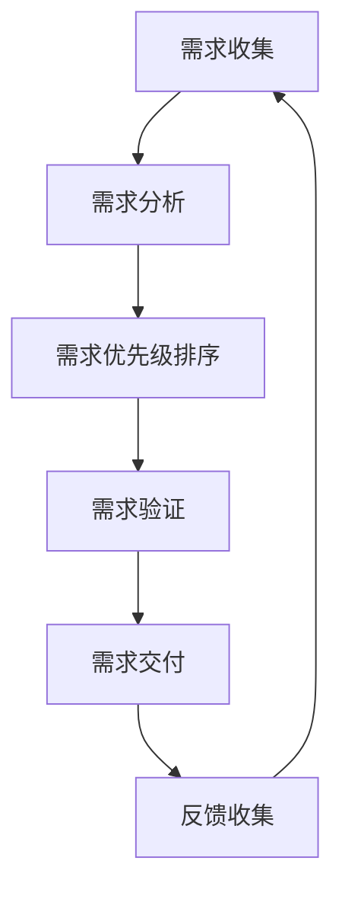
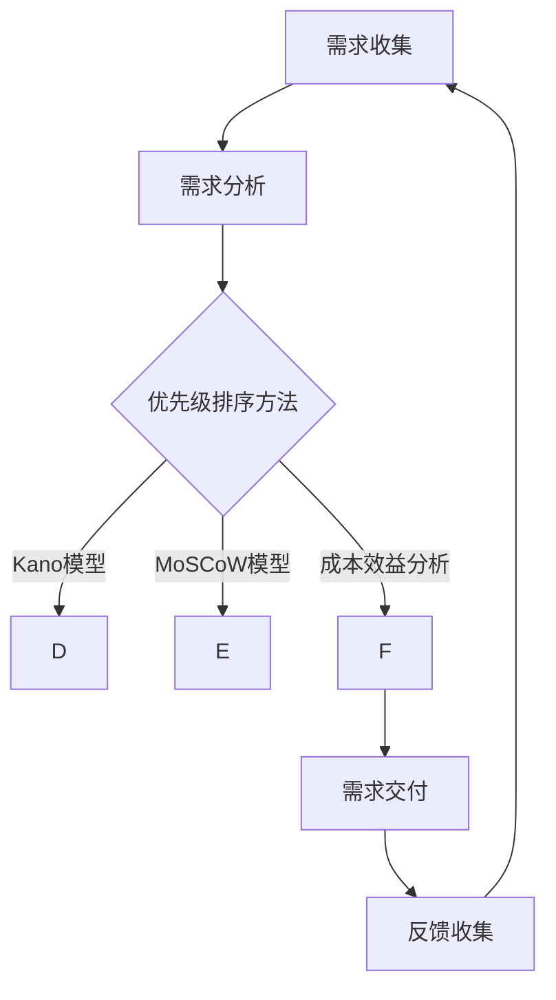
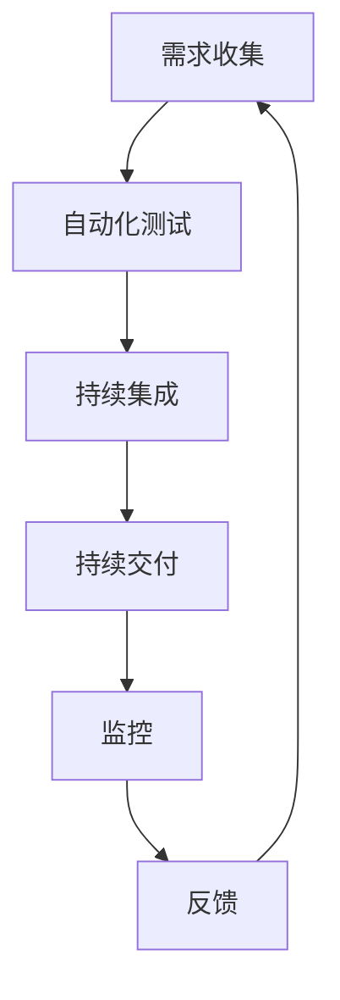
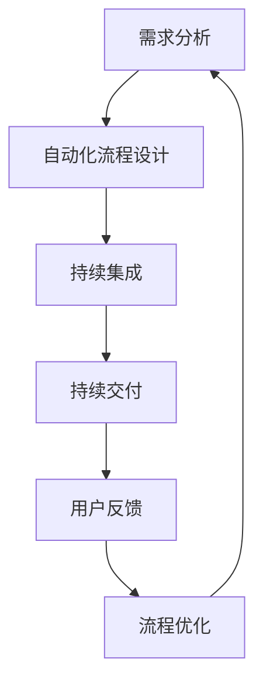
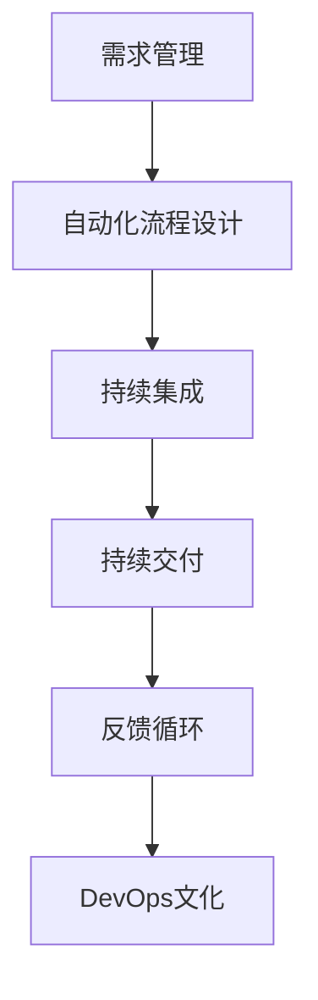
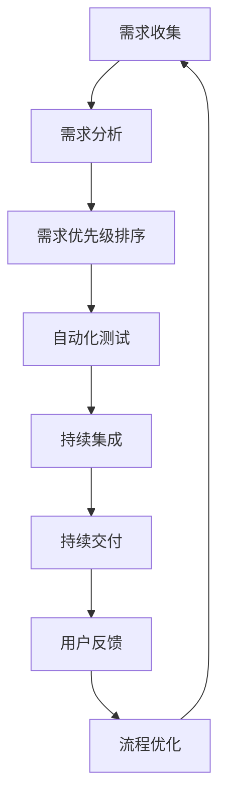
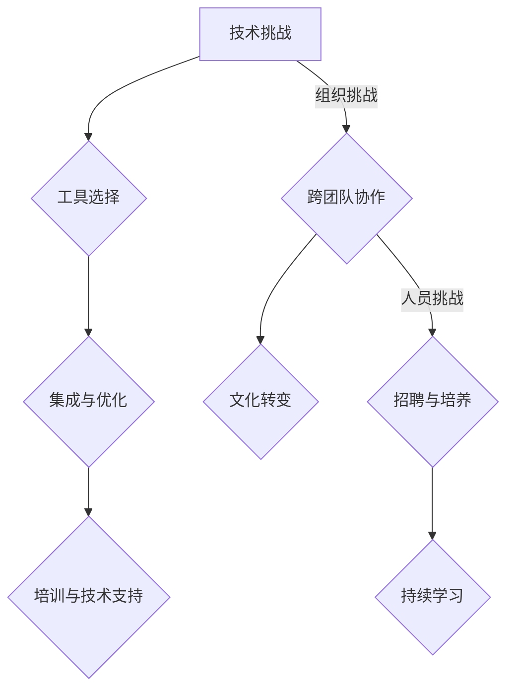

                 

### 文章标题

《需求与DevOps实践的融合：加速交付周期》

### 关键词

需求管理，DevOps，交付周期，自动化流程，持续交付

### 摘要

本文旨在探讨如何将需求管理与DevOps实践相结合，以实现软件交付周期的加速。通过分析需求管理的核心概念和DevOps的核心原则，本文将阐述两者融合的方法和策略，并通过实际案例进行深入剖析。同时，本文还将探讨在实施这一融合过程中可能遇到的挑战和解决方法，为读者提供全面的指导。

---

## 第1章 DevOps简介与需求管理

### 1.1 DevOps的核心概念

DevOps是一种软件开发和运维的方法论，其核心理念是通过将开发和运维团队紧密集成，实现快速交付和高质量软件。DevOps的核心理念包括：

- **持续集成（CI）**：通过自动化测试和构建，确保代码质量，并快速发现和修复问题。
- **持续交付（CD）**：通过自动化部署和交付流程，实现快速、可靠和频繁的软件发布。
- **基础设施即代码（IaC）**：将基础设施的配置和管理过程自动化，确保环境的一致性和可重复性。
- **团队合作**：促进开发、测试、运维等不同团队之间的沟通与协作，共同实现项目目标。

### 1.2 需求管理的重要性

需求管理是软件工程中不可或缺的一部分，它涉及到如何收集、分析和优先处理用户需求，以确保开发出符合用户期望的软件产品。需求管理的重要性体现在：

- **明确项目目标**：通过明确的需求定义，确保项目团队对项目的目标和范围有共同的理解。
- **减少变更**：通过需求优先级排序和变更管理，减少项目过程中的需求变更，降低风险。
- **提高质量**：通过需求验证和验证，确保开发出的软件符合用户需求，提高软件质量。
- **控制成本**：通过需求管理和变更管理，控制项目成本，避免资源浪费。

### 1.3 需求与DevOps的融合概述

需求管理与DevOps的融合旨在通过优化需求管理和交付流程，实现快速、高质量和低成本的软件交付。这一融合的主要方法包括：

- **需求驱动开发**：以用户需求为导向，快速迭代开发，确保交付的软件始终满足用户需求。
- **自动化需求管理**：通过工具和自动化流程，提高需求收集、分析和管理效率。
- **敏捷DevOps**：结合敏捷开发和DevOps的理念，实现快速响应需求变更和快速交付。
- **全流程集成**：将需求管理、开发、测试和运维等环节紧密结合，确保需求能够顺畅地转化为最终的软件产品。

### Mermaid 流程图



### 1.4 DevOps在需求管理中的应用

DevOps在需求管理中的应用主要体现在以下几个方面：

- **自动化测试**：通过自动化测试，确保需求实现的过程符合预期，提高软件质量。
- **持续集成**：将需求变更快速集成到现有代码库中，确保需求实现不会对现有功能产生影响。
- **持续交付**：通过自动化部署和交付流程，确保需求实现能够快速、可靠地交付到用户手中。
- **反馈循环**：通过用户反馈，持续优化需求管理过程，提高交付效率和质量。

### 伪代码讲解

```python
# 需求分析伪代码
def analyze_request(request):
    # 初始化需求分析结果
    result = {}
    
    # 对请求进行解析
    result['description'] = request['description']
    result['priority'] = request['priority']
    result['status'] = 'pending'
    
    # 进行需求验证
    if validate_request(result['description']):
        result['status'] = 'valid'
    else:
        result['status'] = 'invalid'
    
    # 返回分析结果
    return result

# 需求验证伪代码
def validate_request(description):
    # 进行一系列验证操作
    # 例如：检查描述是否完整、是否具有可实现性等
    # 返回验证结果
    return True # 或 False
```

### 数学模型和公式

需求分析中常用的数学模型包括：

- **优先级计算公式**：优先级 = 功能重要性 × 影响范围
- **变更成本公式**：变更成本 = 变更规模 × 变更次数

### 举例说明

假设有一个需求，描述为“增加一个用户登录功能”，其优先级计算如下：

- 功能重要性 = 8（高）
- 影响范围 = 5（广泛）

优先级 = 8 × 5 = 40

### 项目实战

在需求分析与DevOps融合的项目中，通常需要以下步骤：

1. **需求收集**：通过与用户沟通，收集需求。
2. **需求分析**：对需求进行详细分析，确定需求优先级。
3. **自动化测试**：编写自动化测试脚本，确保需求实现的过程符合预期。
4. **持续集成**：将需求变更集成到现有代码库中，确保不引入新的问题。
5. **持续交付**：通过自动化部署和交付流程，将需求实现交付到用户手中。

### 最佳实践 Tips

- **尽早进行需求分析**：需求分析越早，变更的风险和成本就越低。
- **保持沟通**：需求分析过程中，保持与用户的沟通，确保需求的理解一致。
- **使用敏捷方法**：敏捷开发方法有助于快速响应需求变更，提高交付效率。

### 小结

本章介绍了DevOps的核心概念和需求管理的重要性，并探讨了需求与DevOps融合的方法和策略。通过实际案例和数学模型，我们看到了需求分析与DevOps融合在实践中的应用和效果。下一章，我们将深入探讨如何进行需求分析与优先级排序。

---

## 第2章 需求分析与优先级排序

### 2.1 需求分析的方法

需求分析是软件工程的重要环节，它涉及到如何理解、收集和描述用户需求。以下是一些常见的需求分析方法：

- **用户访谈**：通过与用户面对面交流，了解他们的需求和期望。
- **问卷调查**：通过设计问卷，收集用户的需求信息。
- **用户场景**：通过描述用户在使用软件时的具体场景，分析用户需求。
- **文档分析**：通过分析现有文档，了解用户需求和现有系统的问题。

### 2.2 需求优先级排序技术

在需求分析完成后，需要对需求进行优先级排序。以下是一些常用的需求优先级排序技术：

- **Kano模型**：根据用户满意度将需求分为必须需求、一元需求、魅力需求和无关需求。
- **MoSCoW模型**：根据需求的紧急程度和重要性，将需求分为必须、应该、可以、和不会的需求。
- **成本效益分析**：根据成本和效益，对需求进行优先级排序。

### 2.3 需求与DevOps的匹配策略

在DevOps实践中，如何将需求与DevOps理念相结合，实现快速交付和高质量软件，是至关重要的。以下是一些需求与DevOps匹配的策略：

- **需求驱动开发**：以用户需求为导向，快速迭代开发，确保交付的软件始终满足用户需求。
- **敏捷DevOps**：结合敏捷开发和DevOps的理念，实现快速响应需求变更和快速交付。
- **自动化需求管理**：通过工具和自动化流程，提高需求收集、分析和管理效率。

### Mermaid 流程图



### 伪代码讲解

```python
# 需求优先级排序伪代码
def sort_requests(requests):
    # 初始化需求列表
    sorted_requests = []
    
    # 使用Kano模型进行排序
    for request in requests:
        priority = kano_model(request['description'])
        sorted_requests.append({'request': request, 'priority': priority})
    
    # 根据优先级排序
    sorted_requests.sort(key=lambda x: x['priority'], reverse=True)
    
    # 返回排序后的需求列表
    return sorted_requests

# Kano模型伪代码
def kano_model(description):
    # 根据描述进行判断
    if "基本" in description:
        return 1
    elif "性能" in description:
        return 2
    elif "吸引力" in description:
        return 3
    else:
        return 4
```

### 数学模型和公式

需求优先级排序中常用的数学模型包括：

- **加权评分模型**：优先级 = 功能重要性 × 影响范围 × 成本效益
- **评分模型**：优先级 = (功能重要性 + 影响范围 + 成本效益) / 3

### 举例说明

假设有一个需求，描述为“增加一个用户登录功能”，其优先级计算如下：

- 功能重要性 = 8（高）
- 影响范围 = 5（广泛）
- 成本效益 = 4（适中）

优先级 = (8 + 5 + 4) / 3 = 17 / 3 ≈ 5.67

### 项目实战

在需求分析与优先级排序的项目中，通常需要以下步骤：

1. **需求收集**：通过与用户沟通，收集需求。
2. **需求分析**：对需求进行详细分析，确定需求优先级。
3. **需求优先级排序**：根据分析结果，对需求进行优先级排序。
4. **需求交付**：根据优先级，将需求分解为可执行的任务，并分配给开发人员。
5. **反馈收集**：在需求实现过程中，定期收集用户反馈，调整需求优先级。

### 最佳实践 Tips

- **明确需求优先级**：在项目早期明确需求优先级，有助于减少后续的变更和风险。
- **定期审查优先级**：定期审查需求优先级，确保需求能够及时响应市场变化。

### 小结

本章介绍了需求分析的方法和需求优先级排序技术，并探讨了需求与DevOps融合的策略。通过实际案例和数学模型，我们看到了如何有效地进行需求分析和优先级排序，以实现快速、高质量和低成本的软件交付。下一章，我们将深入探讨DevOps工具与技术。

---

## 第3章 DevOps工具与技术

### 3.1 自动化测试

自动化测试是DevOps实践中的重要组成部分，它通过自动化测试脚本，确保软件质量，并提高测试效率。以下是一些常用的自动化测试工具：

- **Selenium**：用于Web应用的自动化测试。
- **JUnit**：用于Java应用程序的单元测试。
- **Mocha**：用于Node.js应用程序的测试框架。
- **pytest**：用于Python应用程序的测试框架。

### 3.2 持续集成

持续集成（CI）是将代码集成到共享代码库中，并自动执行构建和测试的过程。以下是一些常用的持续集成工具：

- **Jenkins**：开源的持续集成工具。
- **Travis CI**：基于云的持续集成服务。
- **GitHub Actions**：GitHub提供的持续集成服务。

### 3.3 持续交付

持续交付（CD）是通过自动化流程，将代码部署到生产环境的过程。以下是一些常用的持续交付工具：

- **Docker**：用于容器化应用的工具。
- **Kubernetes**：用于容器编排的工具。
- **Ansible**：用于自动化部署和配置管理的工具。

### 3.4 DevOps常见工具介绍

以下是一些DevOps中常用的工具及其简介：

- **Puppet**：用于自动化部署和配置管理的工具。
- **Chef**：用于自动化部署和配置管理的工具。
- **Vagrant**：用于创建和管理虚拟开发环境的工具。
- **Terraform**：用于基础设施即代码的工具。

### 3.5 DevOps工具与技术的关系

DevOps工具和技术之间的关系可以概括为以下几个方面：

- **自动化**：所有工具的核心目标都是实现自动化，减少手动操作，提高效率。
- **集成**：将不同的工具和流程集成在一起，实现全流程自动化。
- **监控**：通过监控工具，实时监控软件的运行状态，确保系统的稳定性和可靠性。

### Mermaid 流程图



### 伪代码讲解

```python
# 持续集成伪代码
def ci_process(code):
    # 构建代码
    build_code(code)
    
    # 运行测试
    run_tests()
    
    # 如果测试通过
    if test_passed():
        # 集成代码到共享库
        integrate_code(code)
    else:
        # 报告测试失败
        report_failure()

# 持续交付伪代码
def cd_process(code):
    # 创建容器镜像
    create_image(code)
    
    # 部署到生产环境
    deploy_to_production()
    
    # 如果部署成功
    if deployment_success():
        # 更新代码库
        update_repository(code)
    else:
        # 报告部署失败
        report_failure()
```

### 数学模型和公式

持续集成和持续交付中常用的数学模型包括：

- **构建时间模型**：构建时间 = 代码复杂度 × 构建工具效率
- **部署时间模型**：部署时间 = 部署脚本复杂度 × 部署工具效率

### 举例说明

假设有一个项目，代码复杂度为10，构建工具效率为2，部署脚本复杂度为5，部署工具效率为3。其构建和部署时间计算如下：

- 构建时间 = 10 × 2 = 20
- 部署时间 = 5 × 3 = 15

### 项目实战

在DevOps工具与技术实施的项目中，通常需要以下步骤：

1. **需求分析**：确定需求，并分解为可自动化执行的测试、构建和部署任务。
2. **工具选择**：根据项目需求和团队技术栈，选择合适的DevOps工具。
3. **脚本编写**：编写自动化测试、构建和部署脚本。
4. **流程集成**：将不同的工具和脚本集成到一起，实现自动化流程。
5. **测试与优化**：在实施过程中，不断测试和优化流程，确保其稳定性和效率。

### 最佳实践 Tips

- **选择合适的工具**：根据项目需求和团队技术栈，选择合适的DevOps工具。
- **持续优化流程**：在实施过程中，不断优化流程，提高其稳定性和效率。

### 小结

本章介绍了DevOps工具与技术，包括自动化测试、持续集成、持续交付和监控。通过实际案例和数学模型，我们看到了这些工具和技术在实践中的应用和效果。下一章，我们将深入探讨自动化流程与持续交付。

---

## 第4章 自动化流程与持续交付

### 4.1 自动化流程的设计

自动化流程是DevOps实践中的核心，它通过自动化工具和脚本，实现软件的构建、测试、部署和监控。设计自动化流程时，需要考虑以下几个方面：

- **需求分析**：明确需求和目标，确定需要自动化的任务和流程。
- **工具选择**：根据项目需求和团队技术栈，选择合适的自动化工具。
- **脚本编写**：编写自动化测试、构建和部署脚本。
- **流程集成**：将不同的工具和脚本集成到一起，实现自动化流程。
- **测试与优化**：在实施过程中，不断测试和优化流程，确保其稳定性和效率。

### 4.2 持续交付的实践

持续交付是实现快速、可靠和频繁的软件发布的关键。以下是一些持续交付的实践方法：

- **自动化测试**：通过自动化测试，确保代码质量，并快速发现和修复问题。
- **持续集成**：将代码变更快速集成到现有代码库中，确保需求实现不会对现有功能产生影响。
- **持续部署**：通过自动化部署，将需求实现交付到用户手中。
- **反馈循环**：通过用户反馈，持续优化需求管理过程，提高交付效率和质量。

### 4.3 持续交付的挑战与解决方法

在持续交付的实施过程中，可能会遇到以下挑战：

- **代码质量**：自动化测试无法完全保证代码质量，需要持续优化测试策略。
- **部署失败**：部署过程中可能出现失败，需要设计容错机制和回滚策略。
- **环境一致性**：不同环境之间的配置和状态可能不一致，需要使用基础设施即代码工具进行管理。
- **团队协作**：不同团队之间的沟通与协作是持续交付成功的关键。

以下是一些解决方法：

- **代码质量**：引入代码审查和静态代码分析工具，提高代码质量。
- **部署失败**：设计容错机制和回滚策略，确保部署失败时的快速恢复。
- **环境一致性**：使用基础设施即代码工具，确保不同环境之间的配置和状态一致。
- **团队协作**：建立沟通机制，确保不同团队之间的信息共享和协作。

### Mermaid 流程图



### 伪代码讲解

```python
# 自动化流程设计伪代码
def design_automation流程():
    # 需求分析
    analyze_requirements()
    
    # 选择工具
    select_tools()
    
    # 编写脚本
    write_scripts()
    
    # 集成流程
    integrate流程()
    
    # 测试与优化
    test_and_optimize()

# 持续交付伪代码
def continuous_delivery():
    # 自动化测试
    run_automation_tests()
    
    # 持续集成
    run_continuous_integration()
    
    # 持续部署
    run_continuous_deployment()
    
    # 用户反馈
    collect_user_feedback()
    
    # 流程优化
    optimize流程()
```

### 数学模型和公式

持续交付中常用的数学模型包括：

- **交付时间模型**：交付时间 = 构建时间 + 测试时间 + 部署时间
- **失败率模型**：失败率 = 部署失败次数 / 部署次数

### 举例说明

假设一个项目的交付时间如下：

- 构建时间 = 1小时
- 测试时间 = 2小时
- 部署时间 = 1小时

交付时间 = 1 + 2 + 1 = 4小时

假设该项目在一个月内部署了100次，其中有5次部署失败。其失败率计算如下：

- 失败率 = 5 / 100 = 5%

### 项目实战

在自动化流程与持续交付的项目中，通常需要以下步骤：

1. **需求分析**：明确需求和目标，确定需要自动化的任务和流程。
2. **工具选择**：根据项目需求和团队技术栈，选择合适的自动化工具。
3. **脚本编写**：编写自动化测试、构建和部署脚本。
4. **流程集成**：将不同的工具和脚本集成到一起，实现自动化流程。
5. **测试与优化**：在实施过程中，不断测试和优化流程，确保其稳定性和效率。

### 最佳实践 Tips

- **自动化测试**：确保自动化测试覆盖面广，提高代码质量。
- **持续集成**：确保持续集成的频率和速度，减少集成问题。
- **持续交付**：确保交付的可靠性，减少部署失败的风险。

### 小结

本章介绍了自动化流程与持续交付的设计和实践，以及面临的挑战和解决方法。通过实际案例和数学模型，我们看到了这些方法在实践中的应用和效果。下一章，我们将探讨DevOps文化与实践。

---

## 第5章 DevOps文化与实践

### 5.1 DevOps文化的构建

DevOps文化的构建是DevOps成功实施的关键。以下是一些构建DevOps文化的关键要素：

- **团队合作**：鼓励跨团队合作，打破壁垒，提高协作效率。
- **开放沟通**：建立开放的沟通机制，确保信息共享和透明。
- **共享目标**：确保团队成员对项目的目标和期望有共同的理解。
- **持续学习**：鼓励团队成员持续学习新技术和方法，提高团队的整体能力。

### 5.2 DevOps实践的方法论

DevOps实践的方法论包括以下核心原则：

- **自动化**：通过自动化工具和流程，减少手动操作，提高效率。
- **持续集成**：将代码变更快速集成到现有代码库中，确保软件质量。
- **持续交付**：通过自动化部署，确保软件快速、可靠地交付到用户手中。
- **基础设施即代码**：将基础设施的配置和管理过程自动化，确保环境的一致性和可重复性。

### 5.3 DevOps实践中的关键角色

在DevOps实践中，以下角色至关重要：

- **DevOps工程师**：负责构建和维护自动化流程，确保软件的持续集成和交付。
- **开发人员**：参与自动化测试和持续集成，确保代码质量和交付效率。
- **运维人员**：负责基础设施的管理和部署，确保系统的稳定性和可靠性。
- **产品经理**：负责需求管理和优先级排序，确保软件交付满足用户需求。

### Mermaid 流程图



### 伪代码讲解

```python
# DevOps文化实践伪代码
def devops_culture():
    # 团队合作
    collaborate_with_teams()
    
    # 开放沟通
    communicate_openly()
    
    # 共享目标
    share_goals()
    
    # 持续学习
    continue_learning()

# DevOps实践伪代码
def devops_practice():
    # 自动化
    automate_processes()
    
    # 持续集成
    run_continuous_integration()
    
    # 持续交付
    run_continuous_deployment()
    
    # 反馈循环
    collect_feedback()
```

### 数学模型和公式

DevOps文化与实践中常用的数学模型包括：

- **团队合作效率模型**：效率 = 1 / (1/a + 1/b + 1/c)，其中a、b、c分别为团队成员的效率。
- **交付周期模型**：交付周期 = 构建时间 + 测试时间 + 部署时间

### 举例说明

假设一个团队有三个成员，他们的效率分别为a=0.8，b=0.9，c=0.85。其团队合作效率计算如下：

- 效率 = 1 / (1/0.8 + 1/0.9 + 1/0.85) ≈ 0.818

假设一个项目的交付周期如下：

- 构建时间 = 2小时
- 测试时间 = 4小时
- 部署时间 = 1小时

交付周期 = 2 + 4 + 1 = 7小时

### 项目实战

在DevOps文化与实践的项目中，通常需要以下步骤：

1. **需求管理**：明确需求和目标，确保团队对项目有共同的理解。
2. **自动化流程设计**：设计自动化流程，确保软件的构建、测试和部署。
3. **持续集成**：确保代码变更快速集成到现有代码库中，提高软件质量。
4. **持续交付**：确保软件快速、可靠地交付到用户手中。
5. **反馈循环**：收集用户反馈，持续优化需求和交付流程。

### 最佳实践 Tips

- **建立团队信任**：建立团队信任，鼓励团队成员相互支持和协作。
- **持续改进**：持续改进自动化流程和交付流程，提高交付效率和质量。

### 小结

本章介绍了DevOps文化的构建和实践方法，以及关键角色和数学模型。通过实际案例和数学模型，我们看到了DevOps文化在实践中的应用和效果。下一章，我们将通过实际案例研究，深入探讨需求与DevOps的融合实践。

---

## 第6章 案例研究：需求与DevOps的融合实践

### 6.1 案例选择

在本章中，我们将研究一家电子商务公司的案例。该公司在实施DevOps过程中，面临需求频繁变更和交付周期长的问题。通过需求与DevOps的融合，该公司成功实现了快速交付和高质量软件的目标。

### 6.2 案例分析

#### 需求分析

在案例中，电子商务公司收集了大量的用户需求，包括新增功能、优化现有功能、提升系统性能等。通过对这些需求进行优先级排序，公司确定了以下几个关键需求：

- 新增用户评论功能
- 优化购物车体验
- 提升订单处理速度

#### DevOps实践

为了实现这些需求，公司采用了以下DevOps实践：

- **自动化测试**：编写自动化测试脚本，覆盖新增功能和优化功能的测试。
- **持续集成**：通过Jenkins实现持续集成，确保需求变更不会对现有功能产生影响。
- **持续交付**：使用Docker和Kubernetes进行持续交付，确保需求实现能够快速、可靠地交付到用户手中。

#### 融合实践

在需求与DevOps融合的实践中，公司采取了以下步骤：

- **需求驱动开发**：以用户需求为导向，快速迭代开发，确保交付的软件始终满足用户需求。
- **敏捷DevOps**：结合敏捷开发和DevOps的理念，实现快速响应需求变更和快速交付。
- **自动化需求管理**：使用工具和自动化流程，提高需求收集、分析和管理效率。

### 6.3 案例总结与启示

通过需求与DevOps的融合实践，电子商务公司实现了以下成果：

- **交付周期缩短**：通过自动化流程和持续交付，交付周期从原来的两周缩短到两天。
- **软件质量提高**：通过自动化测试和持续集成，确保软件质量，减少了故障和用户投诉。
- **团队协作增强**：通过DevOps文化的构建，增强了团队之间的协作和沟通。

该案例为其他公司提供了以下启示：

- **重视需求管理**：明确的需求是软件交付成功的关键，需要投入足够的时间和资源进行需求分析和管理。
- **结合敏捷和DevOps**：敏捷和DevOps的结合可以显著提高交付效率和质量。
- **持续优化流程**：在实施过程中，需要不断优化流程，提高其稳定性和效率。

### Mermaid 流程图



### 伪代码讲解

```python
# 需求驱动开发伪代码
def devops_integration():
    # 需求收集
    collect_requirements()
    
    # 需求分析
    analyze_requirements()
    
    # 自动化测试
    run_automation_tests()
    
    # 持续集成
    run_continuous_integration()
    
    # 持续交付
    run_continuous_deployment()
    
    # 用户反馈
    collect_user_feedback()
    
    # 流程优化
    optimize_processes()
```

### 数学模型和公式

在案例研究中，使用的数学模型包括：

- **交付周期模型**：交付周期 = 构建时间 + 测试时间 + 部署时间
- **失败率模型**：失败率 = 部署失败次数 / 部署次数

### 举例说明

假设一个项目的交付周期如下：

- 构建时间 = 1小时
- 测试时间 = 2小时
- 部署时间 = 1小时

交付周期 = 1 + 2 + 1 = 4小时

假设该项目在一个月内部署了100次，其中有5次部署失败。其失败率计算如下：

- 失败率 = 5 / 100 = 5%

### 项目实战

在需求与DevOps融合的项目中，通常需要以下步骤：

1. **需求收集**：通过与用户沟通，收集需求。
2. **需求分析**：对需求进行详细分析，确定需求优先级。
3. **自动化测试**：编写自动化测试脚本，确保软件质量。
4. **持续集成**：确保需求变更不会对现有功能产生影响。
5. **持续交付**：确保需求实现能够快速、可靠地交付到用户手中。
6. **用户反馈**：收集用户反馈，持续优化需求和交付流程。

### 最佳实践 Tips

- **尽早进行需求分析**：需求分析越早，变更的风险和成本就越低。
- **保持沟通**：在需求分析和实施过程中，保持与用户的沟通，确保需求的理解一致。
- **持续优化**：在实施过程中，不断优化流程和工具，提高交付效率和质量。

### 小结

通过本章的案例研究，我们看到了需求与DevOps融合在实践中的应用和效果。该案例为其他公司提供了宝贵的经验和启示，展示了如何通过需求管理与DevOps实践的结合，实现快速交付和高质量软件。在下一章，我们将探讨未来展望与挑战。

---

## 第7章 未来展望与挑战

### 7.1 DevOps的发展趋势

DevOps作为现代软件开发和运维的方法论，正不断发展演进。以下是一些DevOps的发展趋势：

- **云原生技术**：随着云原生技术的普及，越来越多的组织开始采用Kubernetes等容器编排工具，实现更灵活、可扩展的部署环境。
- **AI与机器学习**：AI和机器学习在DevOps中的应用越来越广泛，例如自动化测试、智能监控和故障预测等。
- **自动化与智能化**：自动化和智能化是DevOps发展的关键方向，通过引入更多自动化工具和智能化技术，进一步提高交付效率和软件质量。
- **持续安全**：持续安全是DevOps的重要一环，确保在快速交付过程中不会忽视安全问题。

### 7.2 需求管理在DevOps中的演变

需求管理在DevOps中的演变主要体现在以下几个方面：

- **需求驱动的DevOps**：以用户需求为导向，实现快速响应和交付。
- **敏捷需求管理**：结合敏捷开发理念，实现需求快速迭代和优化。
- **数据驱动的需求管理**：通过数据分析，优化需求分析和优先级排序。
- **全流程需求管理**：将需求管理贯穿整个软件生命周期，确保需求的有效管理和交付。

### 7.3 面临的挑战与解决策略

在需求与DevOps融合的过程中，可能会面临以下挑战：

- **技术挑战**：DevOps工具和技术的选择、集成和优化是一个复杂的过程，需要团队成员具备一定的技术能力和经验。
- **组织挑战**：组织文化的转变、团队协作和沟通的障碍是需要解决的问题。
- **人员挑战**：DevOps需要多学科的知识和技能，对团队成员的能力和素质提出了更高的要求。

以下是一些解决策略：

- **技术挑战**：通过培训和技术支持，提高团队成员的技术能力。同时，选择合适的工具和平台，简化技术实现过程。
- **组织挑战**：建立跨团队的沟通和协作机制，促进组织文化的转变。通过领导层的支持和推动，确保组织对DevOps理念的认同。
- **人员挑战**：通过招聘和培养，引进具备DevOps能力和经验的人才。同时，提供持续的学习和培训机会，提高现有团队成员的技能。

### Mermaid 流程图



### 数学模型和公式

在DevOps和需求管理中，常用的数学模型包括：

- **效率模型**：效率 = 产出 / 耗费
- **成本效益模型**：成本效益 = 效益 / 成本

### 举例说明

假设一个团队在实施DevOps后，产出提高了20%，耗费降低了10%，其效率计算如下：

- 效率 = (1 + 0.2) / (1 - 0.1) = 1.222

假设一个项目的成本效益如下：

- 效益 = 100万
- 成本 = 80万

成本效益 = 100 / 80 = 1.25

### 项目实战

在面临挑战的项目中，通常需要以下步骤：

1. **技术评估**：评估现有技术栈和工具，选择合适的DevOps工具和平台。
2. **团队建设**：通过招聘和培养，引进和提升团队的技术能力。
3. **流程优化**：优化现有流程，确保需求与DevOps的顺畅融合。
4. **组织变革**：建立跨团队的沟通和协作机制，推动组织文化的转变。
5. **持续改进**：在实施过程中，不断收集反馈，优化需求和交付流程。

### 最佳实践 Tips

- **技术储备**：保持对新技术和工具的关注，持续提升团队的技术能力。
- **组织支持**：得到领导层的支持，确保组织对DevOps理念的认同和投入。
- **持续学习**：提供持续的学习和培训机会，提高团队成员的专业素养。

### 小结

本章探讨了DevOps的发展趋势、需求管理在DevOps中的演变以及面临的挑战和解决策略。通过实际案例和数学模型，我们看到了需求与DevOps融合在实践中的应用和效果。在未来的发展中，DevOps和需求管理将继续融合，推动软件交付的进步。

