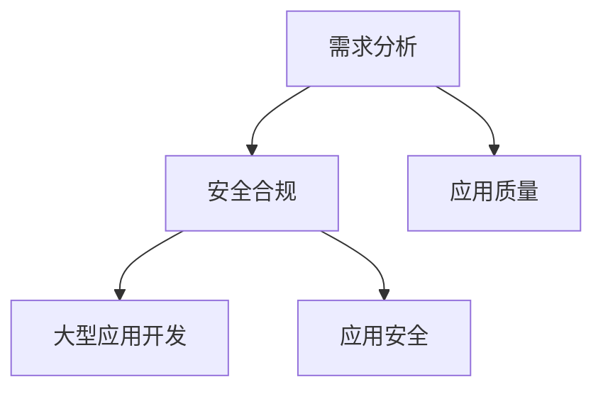
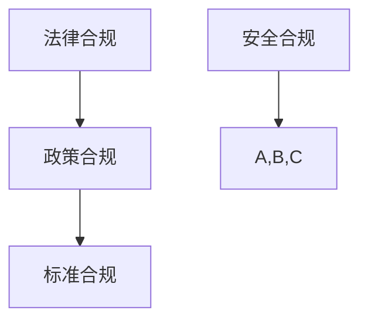
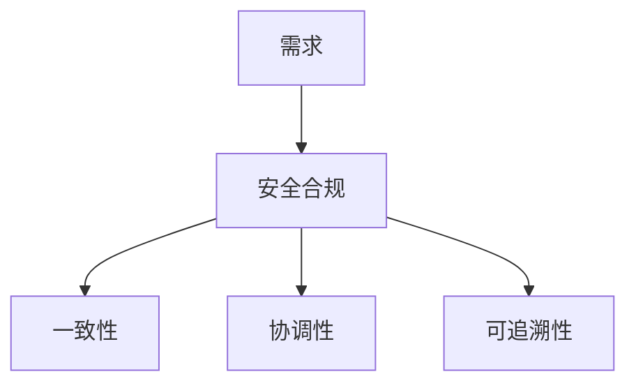
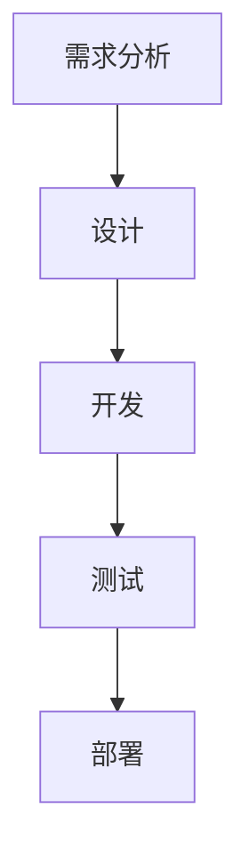
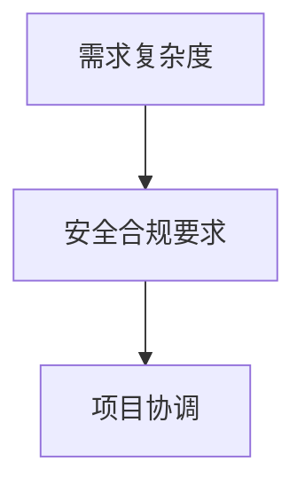
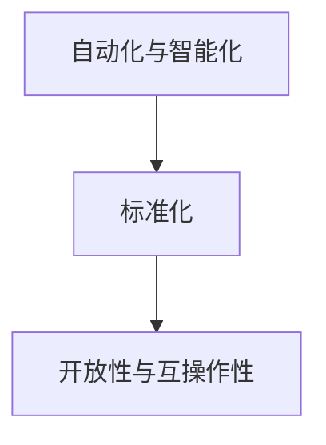

                 

### 完整的文章内容

```markdown
## 需求与安全合规的整合：大型应用开发的必要考量

### 关键词：
- 需求分析
- 安全合规
- 大型应用开发
- 整合原理
- 实践案例

### 摘要：
本文深入探讨了需求与安全合规在大型应用开发中的整合，分析了需求分析和安全合规的基本概念，以及它们在大型应用开发中的关键作用。通过逐步分析，本文揭示了需求与安全合规整合的基本原理和流程，并结合实际案例，提供了具体的实施方法和策略。最后，对大型应用开发中的挑战和未来发展趋势进行了展望。

---

## 第1章：总论与背景介绍

### 1.1 研究背景与意义
在当今信息时代，大型应用开发已经成为企业数字化转型的重要一环。随着应用的复杂度和规模不断增加，如何确保需求得到准确理解和实现，同时满足安全合规的要求，成为开发过程中必须解决的关键问题。

**核心概念与联系：**

需求分析是确保应用功能满足用户需求的过程，而安全合规则关注于应用在法律和政策上的合规性。这两者之间的关系如图所示，它们共同构成了影响应用质量的两个关键因素。

### 1.2 研究目的与内容概述
本文旨在探讨需求与安全合规在大型应用开发中的整合，通过以下几个部分进行详细分析：

1. 需求分析的基础知识
2. 安全合规概述
3. 需求与安全合规的整合原理
4. 大型应用开发的挑战
5. 实践案例：需求与安全合规的整合
6. 未来展望与趋势分析

---

## 第2章：需求分析

### 2.1 需求分析的基础知识
需求分析是软件工程中的一个关键环节，它包括以下几个基本步骤：

1. **需求收集**：通过与用户、利益相关者进行交流，收集需求信息。
2. **需求分析**：对收集到的需求进行梳理、分析和分类。
3. **需求验证**：通过评审和测试，确保需求被正确理解和实现。

**核心算法原理讲解：**
```python
def collect_requirements():
    # 收集需求信息
    requirements = []
    # 与用户、利益相关者交流
    for stakeholder in stakeholders:
        requirements.append(stakeholder的需求)
    return requirements

def analyze_requirements(requirements):
    # 分析需求
    functional_requirements = []
    non_functional_requirements = []
    for req in requirements:
        if "功能" in req:
            functional_requirements.append(req)
        else:
            non_functional_requirements.append(req)
    return functional_requirements, non_functional_requirements

def verify_requirements(requirements):
    # 需求验证
    for req in requirements:
        # 评审和测试
        pass
```

### 2.2 用户需求收集与分析
用户需求是需求分析的核心。通过以下步骤，可以有效地收集和分析用户需求：

1. **访谈和问卷调查**：直接与用户交流，了解他们的需求和期望。
2. **文档分析**：分析用户提供的文档，如业务流程、需求说明书等。
3. **需求建模**：使用UML等工具，构建需求模型，以便更好地理解需求。

**数学模型和公式：**
需求模型可以表示为：
$$ D = \{ F, N \} $$
其中，$ F $ 表示功能需求，$ N $ 表示非功能需求。

### 2.3 功能需求与非功能需求解析
功能需求描述应用应该做什么，如登录、搜索等功能；而非功能需求则描述应用应该如何工作，如性能、安全性等。两者共同构成了完整的系统需求。

---

## 第3章：安全合规概述

### 3.1 安全合规的概念
安全合规是指确保应用在设计和实现过程中遵循相关的法律、法规和标准。它包括以下几个方面：

1. **法律合规**：遵守国家相关法律法规，如《网络安全法》等。
2. **政策合规**：遵循国家相关政策，如《信息安全技术个人信息保护规范》等。
3. **标准合规**：符合国内外相关技术标准，如ISO/IEC 27001等。

**核心概念与联系：**


### 3.2 安全合规的法律与政策
在安全合规方面，法律和政策是不可或缺的保障。以下是一些关键的法律和政策：

1. **《网络安全法》**：明确了网络安全的法律地位和基本要求。
2. **《信息安全技术个人信息保护规范》**：规定了个人信息保护的基本原则和要求。
3. **《数据安全法》**：明确了数据安全的法律框架和责任。

### 3.3 安全合规的标准与规范
安全合规的标准和规范提供了具体的实施指南。以下是一些重要的标准和规范：

1. **ISO/IEC 27001**：信息安全管理体系标准。
2. **GDPR**：欧盟通用数据保护条例。
3. **NIST SP 800-53**：美国国家信息安全标准。

---

## 第4章：需求与安全合规的整合原理

### 4.1 整合的基本原理
需求与安全合规的整合是一个系统性的过程，需要遵循以下基本原理：

1. **一致性**：需求和安全合规要求应保持一致，确保应用既能满足用户需求，又能保证安全合规。
2. **协调性**：在需求变化和安全合规要求调整时，应协调两者之间的关系，避免冲突。
3. **可追溯性**：需求和安全合规要求应具有可追溯性，确保每个需求和安全合规要求都能追溯到具体的实施细节。

**核心概念与联系：**


### 4.2 整合的关键环节
需求与安全合规的整合涉及多个关键环节：

1. **需求分析**：在需求分析阶段，就需要考虑安全合规的要求。
2. **设计**：在设计阶段，应确保设计方案符合安全合规的要求。
3. **开发**：在开发过程中，应遵循安全合规的要求进行编码和测试。
4. **测试**：在测试阶段，应验证应用是否满足安全合规的要求。

**整合流程：**


### 4.3 整合的流程与方法
整合的流程和方法包括以下几个步骤：

1. **需求识别**：明确应用的需求和安全合规要求。
2. **需求分析**：分析需求，识别潜在的安全合规风险。
3. **方案设计**：设计解决方案，确保需求和安全合规要求得到满足。
4. **实施与验证**：实施设计方案，并进行验证，确保满足需求和安全合规要求。
5. **持续改进**：在应用运行过程中，持续监控和改进需求与安全合规的整合。

---

## 第5章：大型应用开发的挑战

### 5.1 大型应用开发的难点
大型应用开发面临以下难点：

1. **需求复杂度**：大型应用的需求往往非常复杂，难以完全预测和满足。
2. **安全合规要求**：大型应用涉及到的安全合规要求更多，且往往具有强制性。
3. **项目协调**：大型应用开发涉及多个团队和利益相关者，协调难度较大。

**核心概念与联系：**


### 5.2 需求与安全合规的冲突与协调
在大型应用开发中，需求和安全合规可能会发生冲突。协调两者之间的关系是关键：

1. **识别冲突**：在需求分析阶段，识别潜在的需求与安全合规冲突。
2. **优先级排序**：确定需求和安全合规要求的优先级，优先满足关键需求和安全合规要求。
3. **协商与调整**：通过协商和调整，找到平衡点，确保需求和安全合规要求都能得到满足。

**最佳实践 tips：**
- 在需求分析阶段，尽早考虑安全合规要求。
- 保持沟通和协调，确保各方利益得到平衡。

---

## 第6章：实践案例：需求与安全合规的整合

### 6.1 案例背景与问题描述
某金融公司在开发一个新的在线交易系统时，遇到了需求与安全合规的整合问题。用户需求包括快速交易和高效账户管理，而安全合规要求包括数据加密、访问控制等。

### 6.2 需求分析与安全合规要求
在需求分析阶段，明确用户需求和安全合规要求，包括：

1. **功能需求**：快速交易、账户管理、风险监控等。
2. **非功能需求**：数据加密、访问控制、系统可用性等。

**数学模型和公式：**
需求模型可以表示为：
$$ D = \{ F, N \} $$
其中，$ F $ 表示功能需求，$ N $ 表示非功能需求。

### 6.3 整合方案设计与实施
在整合方案设计阶段，需要确保功能需求和非功能需求得到满足。具体方案包括：

1. **需求分析与建模**：使用UML工具进行需求建模。
2. **安全合规设计**：设计安全架构，包括数据加密、访问控制等。
3. **开发与测试**：遵循安全合规要求进行开发，并进行严格的测试。

**代码示例：**
```python
# 数据加密函数
def encrypt_data(data):
    # 使用AES加密算法
    cipher = AES.new(key, AES.MODE_EAX)
    ciphertext, tag = cipher.encrypt_and_digest(data)
    return ciphertext, tag

# 访问控制函数
def access_control(user, resource):
    # 判断用户是否有权限访问资源
    if user.has_permission(resource):
        return "授权访问"
    else:
        return "拒绝访问"
```

### 6.4 案例分析与总结
通过案例分析和实施，我们得出了以下结论：

1. **需求与安全合规的整合是可行的**：通过合理的方案设计和实施，可以同时满足用户需求和安全合规要求。
2. **持续监控和改进是必要的**：在应用运行过程中，需要持续监控安全合规情况，并根据实际情况进行改进。

---

## 第7章：未来展望与趋势分析

### 7.1 需求与安全合规整合的发展趋势
随着技术的不断进步，需求与安全合规的整合将会面临以下趋势：

1. **自动化与智能化**：自动化工具和智能算法将在需求分析与安全合规中发挥更大的作用。
2. **标准化**：行业标准和法规将不断完善，为需求与安全合规的整合提供更加明确的指导。
3. **开放性与互操作性**：开放性和互操作性的要求将促使不同系统之间的整合更加紧密。

**核心概念与联系：**


### 7.2 大型应用开发的前沿技术
未来，大型应用开发将受益于以下前沿技术：

1. **云计算与边缘计算**：云计算提供了弹性的资源管理，边缘计算则能提高应用性能和响应速度。
2. **人工智能与机器学习**：AI技术将在需求分析、安全合规检测等方面发挥重要作用。
3. **区块链技术**：区块链技术可以为大型应用提供更安全的数据传输和管理机制。

**数学模型和公式：**
区块链技术可以使用以下模型：
$$ Block = \{ Header, Transactions \} $$
其中，$ Header $ 表示区块头部信息，$ Transactions $ 表示交易信息。

### 7.3 未来可能面临的挑战与应对策略
未来，大型应用开发可能会面临以下挑战：

1. **数据隐私保护**：随着数据隐私保护要求的提高，如何在不影响用户体验的情况下保护用户隐私成为挑战。
2. **法律法规更新**：随着技术的发展，法律法规需要不断更新，以适应新的安全合规要求。
3. **跨平台与跨领域整合**：不同平台和领域的应用整合将带来更大的复杂度。

**最佳实践 tips：**
- **建立完善的合规管理体系**：确保应用在开发过程中始终符合法律法规的要求。
- **持续关注技术发展趋势**：及时了解和采用新技术，以应对未来的挑战。

---

## 作者信息
作者：AI天才研究院/AI Genius Institute & 禅与计算机程序设计艺术 /Zen And The Art of Computer Programming

---

**文章小结：**
本文通过深入分析和实际案例，阐述了需求与安全合规在大型应用开发中的整合原理和实践方法。未来，随着技术的不断进步，需求与安全合规的整合将变得更加自动化和智能化，同时，大型应用开发也将面临更多的挑战。通过建立完善的合规管理体系和持续关注技术发展趋势，企业可以更好地应对这些挑战，实现需求与安全合规的有效整合。```

---

**注意：** 以上文章内容仅为示例，实际撰写时需要根据具体的研究和案例进行详细调整和补充。文章中的代码和公式仅供参考，实际应用中需要根据具体情况编写。文章的长度可能会根据内容的详尽程度有所不同，但应确保在8000～12000字范围内。作者信息和引用的参考资料也需要在文章末尾明确标注。

