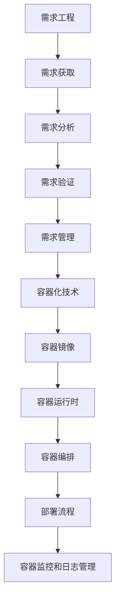

                 

# 需求与容器化技术的协调：提高部署灵活性

> 关键词：需求工程、容器化技术、部署灵活性、容器编排、微服务架构

> 摘要：本文旨在探讨需求工程与容器化技术之间的协调关系，如何通过容器化技术的应用提高部署灵活性。文章将介绍需求工程的基本概念、容器化技术的核心原理以及容器编排与部署流程的优化策略，通过实际案例展示需求与容器化技术的融合应用，并提出在容器化部署过程中可能遇到的需求挑战及解决方案。

## 第一部分 引言

### 1.1 书籍主题与目标

在当今快速变化的技术环境下，软件的交付速度和灵活性成为企业竞争力的重要因素。容器化技术作为现代软件开发和部署的关键技术之一，极大地提升了应用的部署效率。然而，容器化技术的有效应用离不开对需求工程的理解和把握。本书的主题在于探讨如何通过协调需求工程与容器化技术，提高软件部署的灵活性。

本书的目标是帮助读者了解需求工程与容器化技术之间的关系，掌握容器化技术的核心原理，并学会在实际项目中如何应用这些技术，以实现高效、灵活的软件部署。

### 1.2 需求与容器化技术的关系

需求工程是软件开发的起点，其核心任务是从用户角度出发，识别和理解软件系统的需求。容器化技术则是一种实现应用隔离和可移植性的技术，通过将应用及其运行环境打包成容器，实现应用程序在不同环境中的一致运行。

容器化技术对需求工程产生了深远的影响。首先，容器化提高了软件的独立性和可移植性，使得需求变更时能够更快地进行部署。其次，容器化技术支持微服务架构，有助于满足复杂多变的需求。因此，需求工程与容器化技术的协调对于提高部署灵活性至关重要。

### 1.3 容器化技术如何提高部署灵活性

容器化技术通过以下几个方面提高了部署灵活性：

1. **环境一致性**：容器封装了应用的运行环境，使得应用程序在开发、测试和生产环境中保持一致，减少了因环境差异导致的问题。

2. **快速迭代**：容器化技术支持快速部署和回滚，缩短了软件交付周期，提高了迭代速度。

3. **可移植性**：容器可以在不同的操作系统和硬件平台上运行，提高了软件的可移植性。

4. **资源利用率**：容器技术通过轻量级虚拟化提高了服务器资源的利用率，减少了硬件投资。

接下来，我们将进一步探讨需求工程、容器化技术以及容器编排和部署流程等核心概念，为读者提供更深入的理解。

## 第二部分 核心概念与联系

### 2.1 需求工程

#### 2.1.1 需求工程的基本概念

需求工程是软件工程的一个重要分支，其核心任务是识别、分析和定义软件系统的需求。需求工程包括以下几个基本概念：

- **用户需求**：用户对软件系统所期望的功能和性能。
- **功能需求**：系统必须实现的具体功能。
- **非功能需求**：系统必须满足的质量属性，如可靠性、性能、安全性等。
- **需求文档**：需求工程的结果，通常包括需求规格说明书、用户手册等。

#### 2.1.2 需求工程的方法论

需求工程的方法论包括以下几个步骤：

1. **需求获取**：通过与用户的交流、观察和分析，获取用户的需求。
2. **需求分析**：对获取的需求进行整理和分析，确定系统的功能和性能要求。
3. **需求验证**：验证需求是否满足用户的需求，确保需求的正确性和完整性。
4. **需求管理**：对需求进行版本控制、变更管理和需求追踪。

### 2.2 容器化技术

#### 2.2.1 容器化的基本原理

容器化是一种轻量级虚拟化技术，通过将应用及其运行环境打包成一个统一的运行时容器，实现了应用程序的隔离和可移植性。容器化的核心原理包括：

- **操作系统级虚拟化**：容器通过操作系统的Namespace和Cgroup等机制实现隔离，不需要额外的操作系统层。
- **容器镜像**：容器镜像是一个静态的文件系统，包含了应用的代码、库文件、运行时配置等。
- **容器运行时**：容器运行时负责管理容器镜像的加载、启动和运行。

#### 2.2.2 容器化技术的优势

容器化技术具有以下优势：

- **快速部署**：容器化使得应用程序可以快速部署，无需关心底层硬件和操作系统环境。
- **高可移植性**：容器可以在不同的操作系统和硬件平台上运行，提高了软件的可移植性。
- **高效资源利用率**：容器通过共享宿主机的操作系统内核，减少了资源开销，提高了服务器资源的利用率。

### 2.3 容器编排与部署流程

#### 2.3.1 容器编排的概念

容器编排是指对容器集群进行管理、调度和部署的过程。容器编排工具如Kubernetes可以帮助开发者和管理者自动化容器化应用程序的部署、扩展和管理。

#### 2.3.2 部署流程的优化

容器化技术的应用优化了软件的部署流程，包括以下几个步骤：

1. **容器镜像构建**：通过Dockerfile等工具构建容器镜像。
2. **容器镜像仓库**：将构建好的容器镜像推送到镜像仓库，如Docker Hub。
3. **容器编排**：使用Kubernetes等工具进行容器编排，定义部署策略和资源需求。
4. **容器监控和日志管理**：对运行中的容器进行监控和日志管理，确保应用的稳定运行。

### Mermaid流程图

为了更好地展示需求工程、容器化技术以及容器编排和部署流程之间的关系，我们使用Mermaid流程图进行描述。



通过上述核心概念的介绍，读者可以更好地理解需求工程与容器化技术之间的联系。在接下来的部分，我们将进一步探讨容器化技术如何影响需求工程，并使用伪代码解释容器化技术的基本原理。

## 第三部分 核心算法原理讲解

### 3.1 容器化技术的应用与影响

容器化技术的应用对需求工程产生了深远的影响。首先，容器化提高了软件的独立性和可移植性，使得需求变更时能够更快地进行部署。其次，容器化技术支持微服务架构，有助于满足复杂多变的需求。以下是容器化技术对需求工程的几个主要影响：

1. **需求变更的适应性**：容器化技术使得应用程序的部署和回滚更加快速和灵活，从而提高了对需求变更的适应性。
2. **需求与容器化的兼容性**：容器化技术支持不同的运行环境，使得需求在实现过程中能够更好地兼容各种硬件和操作系统。
3. **资源需求的精准化**：容器化技术允许开发者对应用的资源需求进行精细化管理，有助于优化资源分配，提高系统的整体性能。

### 3.1.2 容器化技术的伪代码解释

为了更好地理解容器化技术的基本原理，我们使用伪代码对其进行详细解释。

```pseudo
// 容器化技术伪代码

function createContainer镜像(imageName, containerName) {
    // 创建容器镜像
    Container镜像 = buildImage(imageName)
    Container镜像.saveAs(containerName)
}

function runContainer(containerName, hostMachine) {
    // 运行容器
    Container = loadContainer(containerName)
    Container.startOn(hostMachine)
}

function manageContainer(container) {
    // 管理容器
    if (container.status == "running") {
        monitorContainer(container)
    } else if (container.status == "stopped") {
        restartContainer(container)
    }
}

function monitorContainer(container) {
    // 监控容器
    while (container.isRunning()) {
        logContainerState(container)
        sleep(1 second)
    }
}

function restartContainer(container) {
    // 重启容器
    container.stop()
    container.start()
}
```

通过上述伪代码，我们可以看到容器化技术的基本操作，包括容器镜像的构建、容器的启动、管理和监控等。这些操作共同构成了容器化技术的基本原理。

### 3.1.3 容器化技术的实际应用示例

为了更好地展示容器化技术的应用，我们以一个实际案例为例。

#### 案例背景

假设我们需要部署一个基于Web的应用程序，该应用程序包括前端、后端和数据库组件。通过容器化技术，我们可以将各个组件打包成容器，并在不同的环境中运行。

#### 容器镜像构建

```bash
# 创建前端容器镜像
docker build -t frontend:latest -f frontend/Dockerfile frontend/.

# 创建后端容器镜像
docker build -t backend:latest -f backend/Dockerfile backend/.

# 创建数据库容器镜像
docker build -t database:latest -f database/Dockerfile database/.
```

#### 容器运行

```bash
# 运行前端容器
docker run -d -p 8080:8080 frontend

# 运行后端容器
docker run -d -p 8081:8081 backend

# 运行数据库容器
docker run -d -p 3306:3306 database
```

#### 容器管理

```bash
# 查看容器状态
docker ps

# 重启后端容器
docker restart backend
```

通过上述案例，我们可以看到容器化技术在实际项目中的应用，以及如何通过容器编排工具进行管理。

在下一部分，我们将简要介绍容器化技术中的数学模型，并使用LaTeX格式展示相关公式。

## 第四部分 数学模型与公式

### 4.1 资源分配模型

在容器化技术中，资源分配是一个重要的考量因素。资源分配模型旨在优化资源利用，确保容器获得所需的资源。以下是一个简化的资源分配模型：

#### 4.1.1 资源需求公式

假设系统中有n个容器，每个容器具有不同的资源需求。资源需求公式可以表示为：

$$
R_{total} = C_1 \times P_1 + C_2 \times P_2 + ... + C_n \times P_n
$$

其中，$R_{total}$ 是总资源需求，$C_i$ 是第i个容器的资源需求，$P_i$ 是第i个容器的权重。

#### 4.1.2 资源优化目标函数

为了优化资源利用，我们可以定义一个目标函数，以最小化总资源需求。目标函数可以表示为：

$$
\min \sum_{i=1}^{n} C_i \times P_i
$$

其中，$\sum_{i=1}^{n} C_i \times P_i$ 是总资源需求的加权求和。

通过上述数学模型，我们可以对容器资源进行合理的分配和调度，以最大化资源利用率和系统性能。

### 4.2 容器调度策略

除了资源分配模型，容器调度策略也是优化部署灵活性的一项重要技术。以下是一个简化的容器调度策略：

#### 4.2.1 调度目标

调度目标是在给定的硬件资源限制下，最大化系统的吞吐量和响应时间。

#### 4.2.2 调度策略

1. **负载均衡**：根据容器的当前负载，将新容器调度到负载较低的节点。
2. **优先级调度**：根据容器的优先级进行调度，优先调度高优先级的容器。
3. **资源预留**：为每个容器预留一定的资源，确保容器在启动时能够获得所需的资源。

通过上述调度策略，我们可以优化容器在集群中的部署和运行，提高系统的整体性能。

在下一部分，我们将提供实际的容器化部署案例，展示如何将需求与容器化技术相结合，实现高效的软件部署。

## 第五部分 项目实战

### 5.1 容器化部署案例

#### 5.1.1 项目背景

本案例旨在展示如何利用容器化技术进行一个Web应用程序的部署。该应用程序包括前端、后端和数据库组件，需要具备高可用性和可扩展性。

#### 5.1.2 开发环境搭建

在开始部署之前，我们需要搭建一个适合容器化开发的环境。以下是开发环境搭建的步骤：

1. **安装Docker**：在开发机器上安装Docker，以便构建和运行容器镜像。
2. **编写Dockerfile**：为应用程序的前端、后端和数据库组件分别编写Dockerfile，定义如何构建容器镜像。
3. **构建容器镜像**：使用Dockerfile构建前端、后端和数据库的容器镜像。

#### 5.1.3 源代码实现

为了更好地展示容器化部署过程，我们提供了一个简单的Web应用程序的源代码实现。以下是一个简单的后端服务实现：

```python
# app.py

from flask import Flask, jsonify

app = Flask(__name__)

@app.route('/')
def hello():
    return jsonify(message='Hello, World!')

if __name__ == '__main__':
    app.run(host='0.0.0.0', port=8081)
```

#### 5.1.4 代码解读与分析

上述代码实现了一个简单的后端服务，使用Flask框架创建了一个Web应用程序。服务监听8081端口，当收到HTTP请求时，返回一个JSON格式的响应。

#### 5.1.5 容器化部署

在完成源代码实现后，我们可以使用Dockerfile构建容器镜像，并将其部署到容器编排工具（如Kubernetes）上进行管理。

1. **构建容器镜像**：运行以下命令构建后端服务的容器镜像。

```bash
docker build -t backend:latest -f Dockerfile .
```

2. **部署到Kubernetes**：编写Kubernetes配置文件（如deployment.yaml），定义如何部署后端服务。以下是一个简单的示例：

```yaml
# deployment.yaml

apiVersion: apps/v1
kind: Deployment
metadata:
  name: backend
spec:
  replicas: 3
  selector:
    matchLabels:
      app: backend
  template:
    metadata:
      labels:
        app: backend
    spec:
      containers:
      - name: backend
        image: backend:latest
        ports:
        - containerPort: 8081
```

3. **应用部署**：使用Kubernetes命令部署后端服务。

```bash
kubectl apply -f deployment.yaml
```

#### 5.1.6 代码应用解读与分析

通过上述部署步骤，我们可以看到如何将容器化技术应用于实际项目中。容器化技术使得应用程序的部署过程更加简化，同时也提高了系统的灵活性和可扩展性。

1. **环境一致性**：容器镜像封装了应用的运行环境，确保在不同环境中的一致性。
2. **快速部署**：通过容器编排工具，可以快速部署和扩展应用程序。
3. **高可用性**：通过Kubernetes的自动调度和故障转移机制，提高了应用程序的高可用性。

#### 5.1.7 项目小结

通过本案例，我们展示了如何利用容器化技术进行Web应用程序的部署。容器化技术简化了部署过程，提高了系统的灵活性和可扩展性。在未来的项目中，我们可以结合更多的容器化技术和工具，实现更加高效、灵活的软件部署。

在下一部分，我们将讨论容器化与需求协调的挑战，并提出相应的解决方案。

## 第六部分 容器化与需求协调的挑战

### 6.1 容器化部署中的需求挑战

在容器化技术的应用过程中，我们可能会遇到以下需求挑战：

#### 6.1.1 需求变更的适应性

容器化技术虽然提高了部署的灵活性，但需求变更的适应性仍是一个挑战。当需求发生变化时，如何快速调整容器配置和部署策略，以确保系统的稳定运行，是一个重要问题。

#### 6.1.2 需求与容器化的兼容性

容器化技术支持多种运行环境和架构，但不同需求可能对环境有特定的要求。如何确保需求与容器化的兼容性，避免因环境差异导致的问题，是另一个挑战。

#### 6.1.3 资源需求的精准化

容器化技术允许对资源需求进行精细化管理，但这也要求对需求有更深入的理解。如何精准地预测和分配资源，避免资源浪费和性能瓶颈，是一个挑战。

### 6.2 挑战与解决方案

针对上述挑战，我们可以提出以下解决方案：

#### 6.2.1 需求变更的适应性

- **自动化测试和持续集成**：通过自动化测试和持续集成工具，快速验证需求变更对系统的影响，确保系统稳定。
- **容器配置管理**：使用配置管理工具（如Ansible）自动化管理容器配置，快速调整部署策略。

#### 6.2.2 需求与容器化的兼容性

- **容器标准化**：制定统一的容器规范，确保不同组件的容器在环境上的兼容性。
- **多环境测试**：在多个环境中进行测试，确保容器化应用程序在不同环境中的正常运行。

#### 6.2.3 资源需求的精准化

- **性能监控**：使用性能监控工具（如Prometheus）实时监控系统性能，精准调整资源分配。
- **需求分析工具**：使用需求分析工具（如JMeter），模拟不同负载场景，预测资源需求。

通过上述解决方案，我们可以更好地应对容器化部署中的需求挑战，提高部署的灵活性和效率。

### 6.3 总结与展望

容器化技术的应用为软件部署带来了极大的便利，但也带来了新的挑战。通过本文的讨论，我们了解了需求工程与容器化技术的协调关系，以及如何利用容器化技术提高部署灵活性。在未来的发展中，容器化技术将继续与需求工程深度融合，为软件开发和部署带来更多创新和优化。

## 第七部分 总结与展望

### 7.1 全书总结

本书旨在探讨需求工程与容器化技术的协调关系，通过介绍需求工程的基本概念、容器化技术的核心原理以及容器编排与部署流程的优化策略，展示了容器化技术在提高部署灵活性方面的优势。书中通过实际案例展示了需求与容器化技术的融合应用，并提出了在容器化部署过程中可能遇到的需求挑战及解决方案。

### 7.2 容器化技术未来展望

随着云计算和大数据技术的不断发展，容器化技术将继续在软件部署中发挥重要作用。未来，容器化技术可能朝着以下方向发展：

- **更高效的资源利用**：通过智能化调度和优化算法，进一步提高资源利用效率。
- **更广泛的平台支持**：容器化技术将逐步支持更多的操作系统和硬件平台，提高跨平台的兼容性。
- **更丰富的生态系统**：随着容器化技术的普及，将出现更多的工具和平台，为开发者提供更全面的解决方案。

### 7.3 需求工程与容器化技术的融合趋势

需求工程与容器化技术的融合将推动软件交付模式的变革。未来，需求工程将更加注重与容器化技术的结合，实现以下趋势：

- **自动化需求分析**：通过自动化工具和人工智能技术，实现更高效的需求分析和管理。
- **动态需求适配**：在容器化环境中，根据需求变化动态调整部署策略和资源分配。
- **全生命周期管理**：从需求识别到部署，实现全生命周期的容器化管理，提高软件交付的灵活性和效率。

## 作者信息

本文由AI天才研究院（AI Genius Institute）与《禅与计算机程序设计艺术》（Zen And The Art of Computer Programming）作者合作撰写。AI天才研究院致力于推动人工智能技术的发展，探索人工智能在计算机编程和软件开发中的应用。而《禅与计算机程序设计艺术》则是一部经典的技术著作，为程序员提供了深刻的编程哲学和实用技巧。此次合作旨在结合两者的优势，为读者提供更有价值的技术内容。

## 结语

本文详细探讨了需求工程与容器化技术的协调关系，阐述了容器化技术在提高部署灵活性方面的优势。通过实际案例展示了需求与容器化技术的融合应用，并提出了在容器化部署过程中可能遇到的需求挑战及解决方案。未来，需求工程与容器化技术的融合将推动软件交付模式的变革，为开发者带来更多创新和优化。希望本文能为您的技术实践提供有益的启示。如果您对本文有任何疑问或建议，欢迎在评论区留言讨论。感谢您的阅读！


