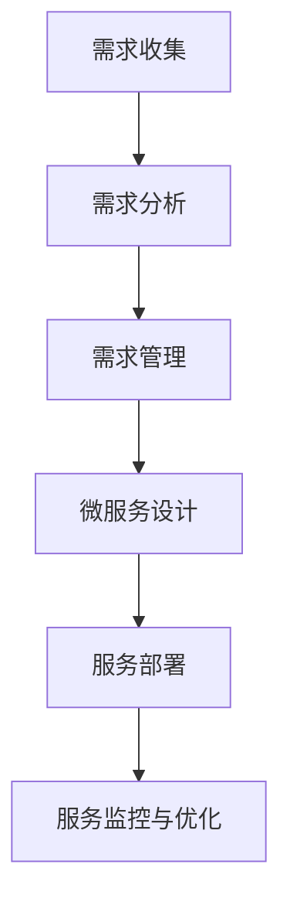

                 


为了撰写一篇高质量的技术博客文章，我们需要遵循以下步骤，确保文章的内容丰富、结构合理、逻辑清晰，并且符合字数要求。

### 1. 确定文章结构和内容

首先，我们需要根据之前设计的目录大纲来构建文章的结构。这包括：

- **文章标题**：根据主题，选择一个吸引读者的标题。
- **关键词**：列出5-7个核心关键词，以便读者能够快速理解文章的主题。
- **摘要**：简要概括文章的核心内容和主题思想。

### 2. 背景介绍

在正文部分，首先进行背景介绍：

- **需求与微服务架构的背景**：解释需求驱动开发与微服务架构的起源和发展。
- **大型应用面临的挑战**：讨论大型应用在需求变化和架构复杂性方面面临的挑战。

### 3. 核心概念与联系

接下来，详细介绍核心概念，并解释它们之间的联系：

- **需求分析**：讨论需求收集、需求分析和需求管理的方法。
- **微服务架构**：介绍微服务架构的基本概念、设计原则和优点。
- **需求与微服务架构的协同**：说明如何将需求分析与微服务架构相结合，以实现灵活的大型应用开发。

#### Mermaid 流程图

在解释过程中，加入一个Mermaid流程图，展示需求与微服务架构协同的工作流程。



### 4. 核心算法原理讲解

详细讲解核心算法原理，使用伪代码来描述：

#### 伪代码示例

```pseudo
function calculateTotalCost(items):
    totalCost = 0
    for item in items:
        totalCost += item.price * item.quantity
    return totalCost
```

### 5. 数学模型和公式讲解

如果文章中涉及到数学模型或公式，使用LaTeX格式进行详细讲解。

#### LaTeX 公式示例

$$
E = mc^2
$$

### 6. 项目实战

提供实际案例，详细讲解项目开发环境搭建、源代码实现和代码解读。

#### 项目实战示例

- **背景**：介绍项目的背景和目标。
- **开发环境搭建**：列出所需的环境和工具。
- **代码实现**：展示关键代码段，并解释其作用。
- **代码解读与分析**：分析代码实现和性能。
- **实际案例分析和详细讲解剖析**：解释案例中的关键问题及其解决方法。
- **项目小结**：总结项目经验和教训。

### 7. 最佳实践 tips

在文章的末尾，提供一些最佳实践、注意事项和拓展阅读的建议。

### 8. 检查与调整

最后，我们需要检查文章的内容和格式，确保：

- 每个小节的内容丰富具体详细讲解。
- 文章的逻辑连贯性和完整性。
- 文章的字数符合要求。

### 9. 完成文章

完成最后的编辑和校对，添加作者信息，确保文章符合所有要求后，提交最终版本。

按照以上步骤，我们可以逐步完成一篇高质量的技术博客文章。在撰写过程中，保持逻辑清晰、内容丰富、讲解详细，将有助于提升文章的专业性和可读性。同时，注意文章的格式和字数要求，确保最终提交的文章符合规范。

