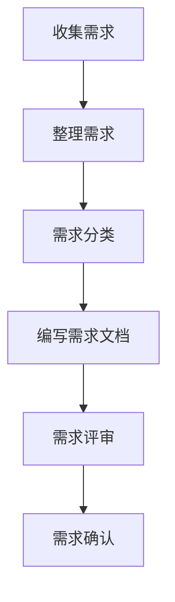
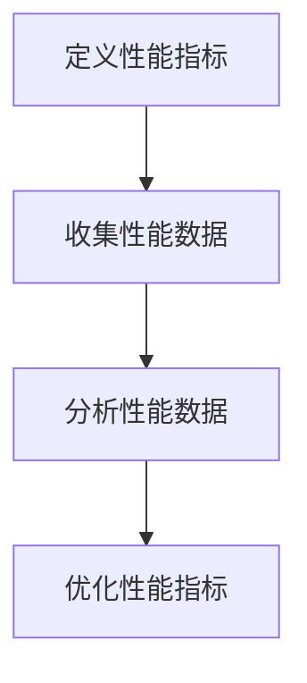
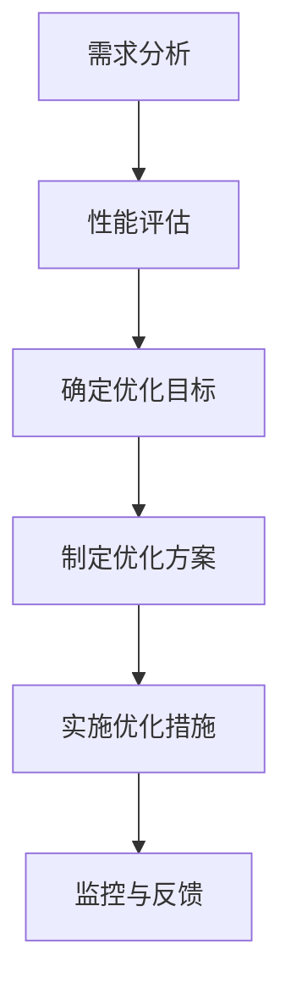
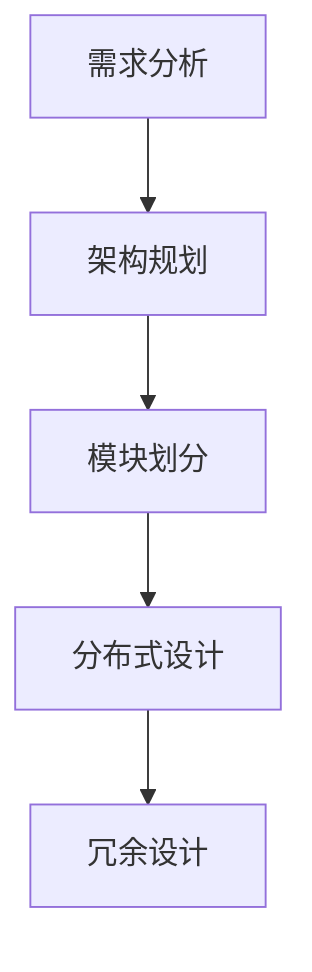

                 

# 需求与性能指标的协调：大型应用开发的平衡之道

## 关键词
- 需求分析
- 性能指标
- 大型应用
- 协调策略
- 优化实践

## 摘要
在现代软件工程中，大型应用的开发面临着诸多挑战，其中需求与性能指标之间的协调尤为重要。本文将深入探讨这一平衡之道，从需求分析、性能指标解析、协调策略，到实际应用案例，逐步阐述如何在大型应用开发过程中实现需求与性能的优化与协调。

## 引言

随着信息技术的发展，大型应用已经成为企业运营的基石。然而，这些应用往往面临着复杂的需求和苛刻的性能要求。如何在满足用户需求的同时，确保应用的高效运行，成为了开发人员亟待解决的问题。本文旨在通过需求与性能指标的协调，揭示大型应用开发的平衡之道。

## 第1章：需求分析基础

### 1.1 需求分析概述
需求分析是软件开发的第一步，也是至关重要的一步。它涉及对用户需求、业务需求和系统需求的理解和整理。

#### 背景介绍
软件开发的核心目标是为用户提供有价值的功能和服务。然而，用户的需求往往是非结构化的、多样的，甚至有时候是不明确的。因此，需求分析成为了一项复杂而又关键的工程。

#### 核心概念与联系
- **用户需求**：用户对软件系统所期望的功能和特性。
- **业务需求**：业务流程、业务规则等对软件系统的要求。
- **系统需求**：软件系统在技术层面上必须满足的条件。

需求分析需要将这些需求有机地整合，形成一份清晰的需求文档。

### 1.2 需求分类
在需求分析中，对需求的分类有助于更好地理解和满足用户需求。

#### 功能需求
功能需求描述了软件系统必须实现的功能，如用户登录、数据查询等。

#### 非功能需求
非功能需求描述了软件系统的性能、安全性、可靠性等，如响应时间、数据一致性等。

#### 用户需求与系统需求的关联
用户需求需要通过系统需求来实现。例如，用户希望快速获取数据，系统需求就需要确保数据查询的效率。

### 1.3 Mermaid流程图：需求分析流程

## 第2章：性能指标解析

### 2.1 性能指标概述
性能指标是衡量软件系统性能的重要工具。常见的性能指标包括响应时间、吞吐量、并发量等。

#### 背景介绍
性能指标不仅关系到用户的使用体验，也直接影响到系统的商业价值。因此，了解和解析性能指标至关重要。

#### 核心概念与联系
- **响应时间**：系统处理请求并返回结果所需的时间。
- **吞吐量**：系统在单位时间内处理请求的数量。
- **并发量**：系统能够同时处理请求的数量。

### 2.2 性能指标分类
性能指标可以按照不同的维度进行分类，如响应时间、吞吐量、并发量、资源利用率等。

#### 响应时间
- **平均响应时间**：系统处理所有请求的平均时间。
- **最大响应时间**：系统处理请求的最大时间。

#### 吞吐量
- **理论吞吐量**：理想状态下系统能够达到的最大吞吐量。
- **实际吞吐量**：实际运行中系统所达到的吞吐量。

#### 并发量
- **最大并发量**：系统能够同时处理请求的最大数量。
- **当前并发量**：系统当前正在处理的请求数量。

### 2.3 Mermaid流程图：性能指标评估流程

## 第3章：需求与性能的协调策略

### 3.1 协调策略概述
在大型应用开发中，需求与性能的协调是一项系统性工程。以下是一些常见的协调策略。

#### 背景介绍
需求与性能的协调不仅仅是技术问题，还涉及到团队协作、项目管理等多个方面。

#### 核心概念与联系
- **优先级排序**：根据需求的紧急程度和重要性进行排序，确保关键需求得到优先处理。
- **资源分配**：合理分配人力资源和硬件资源，确保性能优化得到充分支持。
- **监控与反馈**：持续监控性能指标，及时反馈并调整优化策略。

### 3.2 性能优化实践
性能优化是需求与性能协调的重要组成部分。以下是一些常见的性能优化方法。

#### 缓存策略
- **内存缓存**：减少对磁盘的访问，提高数据访问速度。
- **分布式缓存**：通过分布式缓存系统，减少单点瓶颈。

#### 数据库优化
- **索引优化**：合理设计索引，提高查询效率。
- **分库分表**：通过分库分表，降低单表的压力。

#### 网络优化
- **负载均衡**：通过负载均衡器，合理分配网络请求。
- **CDN加速**：通过CDN，减少数据传输距离，提高访问速度。

### 3.3 Mermaid流程图：性能优化流程

## 第4章：大型应用架构设计

### 4.1 架构设计概述
大型应用架构设计是确保需求与性能协调的重要环节。以下是一些常见的架构设计原则。

#### 背景介绍
大型应用往往具有复杂的业务逻辑和高并发要求，因此架构设计需要具备良好的可扩展性、高可用性和高性能。

#### 核心概念与联系
- **分层架构**：将系统分为多个层次，如表示层、业务逻辑层、数据访问层等。
- **微服务架构**：将系统拆分为多个独立的微服务，以提高系统的可维护性和可扩展性。

### 4.2 架构设计原则
以下是一些常见的架构设计原则，有助于实现需求与性能的协调。

- **模块化设计**：将系统功能划分为多个模块，以提高系统的可维护性。
- **分布式设计**：通过分布式架构，提高系统的并发处理能力。
- **冗余设计**：通过冗余设计，提高系统的可用性。

### 4.3 Mermaid流程图：大型应用架构设计流程

## 第5章：性能优化实践

### 5.1 开发环境搭建
在开始性能优化之前，需要搭建一个合适的开发环境。

#### 步骤1：安装开发工具
- 安装编程语言开发工具，如Java SDK、Python环境等。
- 安装数据库，如MySQL、PostgreSQL等。

#### 步骤2：配置开发环境
- 配置代码版本管理工具，如Git。
- 配置持续集成/持续部署工具，如Jenkins。

#### 步骤3：搭建测试环境
- 搭建与生产环境类似的测试环境，确保测试数据的真实性和准确性。

### 5.2 源代码详细实现和代码解读
在性能优化过程中，源代码的实现和解读至关重要。

#### 步骤1：编写伪代码
- 根据需求文档，编写伪代码，确保算法的正确性和高效性。

#### 步骤2：实现源代码
- 使用合适的编程语言，实现伪代码。
- 注释代码，确保代码的可读性和可维护性。

#### 步骤3：代码解读
- 分析代码结构，确保代码符合设计原则。
- 检查代码性能，查找可能的性能瓶颈。

### 5.3 代码应用解读与分析
在实际应用中，需要对代码进行解读和分析，以评估其性能。

#### 步骤1：性能测试
- 使用性能测试工具，如JMeter、Gatling等，对代码进行压力测试。
- 记录性能指标，如响应时间、吞吐量等。

#### 步骤2：分析结果
- 分析性能测试结果，查找性能瓶颈。
- 提出优化建议，如代码重构、数据库优化等。

#### 步骤3：实施优化
- 根据分析结果，实施代码优化。
- 再次进行性能测试，验证优化效果。

### 5.4 实际案例分析和详细讲解剖析
通过实际案例，可以更好地理解性能优化的方法和技巧。

#### 案例一：电商平台的订单处理优化
- **问题**：订单处理速度慢，用户体验差。
- **分析**：通过分析发现，订单处理过程中涉及多次数据库查询，导致响应时间过长。
- **优化**：通过缓存策略和索引优化，提高查询效率。

#### 案例二：社交媒体的图片处理优化
- **问题**：图片处理速度慢，影响用户体验。
- **分析**：通过分析发现，图片处理过程中存在大量重复计算，导致性能瓶颈。
- **优化**：通过分布式计算和并行处理，提高图片处理速度。

### 5.5 项目小结
在性能优化过程中，需要注意以下几点：

- **需求明确**：明确需求，确保优化方向正确。
- **持续监控**：持续监控性能指标，及时发现性能瓶颈。
- **团队协作**：团队协作，共同推进性能优化工作。

## 结论

在大型应用开发中，需求与性能指标的协调至关重要。本文通过需求分析、性能指标解析、协调策略、大型应用架构设计和性能优化实践，揭示了大型应用开发的平衡之道。希望本文能够为开发人员提供有益的参考和指导，助力打造高效、稳定的软件系统。

## 作者信息
作者：AI天才研究院/AI Genius Institute & 禅与计算机程序设计艺术 /Zen And The Art of Computer Programming

