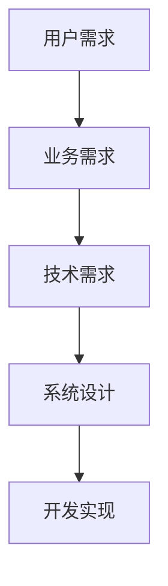

                 

# 需求与技术可行性的平衡：大型应用开发的挑战

> 关键词：需求分析、技术可行性、大型应用、开发挑战、平衡策略

> 摘要：本文旨在探讨大型应用开发过程中，如何平衡需求变化与技术可行性，以应对不断变化的市场和技术环境。通过深入分析需求与技术可行性的核心概念及其关系，提出一系列策略和最佳实践，为开发团队提供指导，确保项目的成功交付。

## 引言

在当今快速变化的技术环境中，大型应用的开发面临诸多挑战。需求频繁变更、技术复杂性增加、资源限制等，使得开发团队在保持项目进度和满足客户需求之间不断寻求平衡。本文将详细探讨需求与技术可行性的关系，并分析在大型应用开发中如何实现两者之间的平衡。

### 需求分析

需求分析是大型应用开发的基础。它涉及收集、分析和整理用户需求，以确保项目能够满足预期目标。需求分析的质量直接影响项目的成功与否。

#### 1.1 核心概念与关系

在需求分析过程中，以下几个核心概念至关重要：

1. **用户需求**：用户对应用功能的期望和需求。
2. **业务需求**：业务流程和应用功能之间的关系。
3. **技术需求**：实现用户需求所需的技术能力和资源。

这些概念之间的关系可以用以下 Mermaid 流程图表示：



#### 1.2 需求分析过程

**1.2.1 Stakeholder Identification**：识别项目利益相关者，包括用户、业务分析师、项目经理和技术团队。

**1.2.2 Collecting Requirements**：通过访谈、调查问卷、头脑风暴等方式收集用户需求。

**1.2.3 Analyzing Requirements**：分析需求，确保它们是明确的、可量化的、可实现的和相关的。

**1.2.4 Documenting Requirements**：将需求文档化，以便在整个项目生命周期中参考。

#### 1.3 技术可行性研究

技术可行性研究是评估项目是否能够实现的关键环节。它涉及分析项目所需的技术能力和资源，并识别潜在的技术风险。

**2.1 技术可行性评估**

**2.1.1 Technical Analysis**：评估当前技术是否满足项目需求。

**2.1.2 Resource Assessment**：评估团队的技术能力、资源和时间。

**2.1.3 Timeframe Analysis**：评估项目的开发周期。

#### 2.2 技术风险评估

**2.2.1 Risk Identification**：识别项目可能遇到的技术风险。

**2.2.2 Risk Assessment**：评估风险的影响和概率。

**2.2.3 Risk Mitigation**：制定风险应对策略。

### 大型应用开发实践

**3.1 大型应用开发过程**

大型应用开发通常分为以下几个阶段：

1. **需求分析**：详细收集和分析用户需求。
2. **系统设计**：设计系统架构和模块。
3. **开发实现**：编写代码，实现功能。
4. **测试与部署**：测试应用，确保质量，部署到生产环境。
5. **运维与维护**：持续监控和维护应用。

**3.2 团队协作**

开发团队的成功协作至关重要。以下是一些最佳实践：

1. **明确的职责分工**：确保每个团队成员都清楚自己的角色和责任。
2. **透明的沟通机制**：建立有效的沟通渠道，确保信息畅通。
3. **定期团队会议**：定期召开会议，讨论进度和问题。

**3.3 管理依赖**

在大型应用开发中，依赖关系复杂。以下是一些管理依赖的最佳实践：

1. **模块化设计**：将应用分解为独立的模块，降低依赖关系。
2. **依赖管理工具**：使用依赖管理工具，如 npm 或 Maven，来管理和跟踪依赖。

### 案例分析

**4.1 案例研究 1：某电商平台**

某电商平台在需求和技术可行性的平衡方面面临挑战。通过迭代开发和持续评估，团队成功解决了需求变更和技术风险。

**4.2 案例研究 2：某金融服务平台**

某金融服务平台在开发过程中，通过敏捷方法和优先级排序，实现了需求和技术可行性的平衡。

### 小结

大型应用开发中，平衡需求与技术可行性是关键。通过深入的需求分析、技术可行性研究和实践，开发团队可以更好地应对挑战，确保项目的成功交付。

### 注意事项

1. **持续沟通**：确保团队内部和利益相关者之间的沟通畅通。
2. **灵活应对**：在需求变更和技术风险面前，保持灵活应对能力。
3. **定期评估**：定期评估项目进度和需求变化，确保项目目标始终与市场需求保持一致。

### 拓展阅读

1. 《软件需求工程：实践指南》
2. 《敏捷软件开发：原则、实践与模式》
3. 《软件工程：实践者的研究方法》

作者：AI天才研究院/AI Genius Institute & 禅与计算机程序设计艺术 /Zen And The Art of Computer Programming```markdown
# 需求与技术可行性的平衡：大型应用开发的挑战

## 关键词
- 需求分析
- 技术可行性
- 大型应用
- 开发挑战
- 平衡策略

## 摘要
本文旨在探讨大型应用开发过程中，如何平衡需求变化与技术可行性，以应对不断变化的市场和技术环境。通过深入分析需求与技术可行性的核心概念及其关系，提出一系列策略和最佳实践，为开发团队提供指导，确保项目的成功交付。

## 引言

在当今快速变化的技术环境中，大型应用的开发面临诸多挑战。需求频繁变更、技术复杂性增加、资源限制等，使得开发团队在保持项目进度和满足客户需求之间不断寻求平衡。本文将详细探讨需求与技术可行性的关系，并分析在大型应用开发中如何实现两者之间的平衡。

### 需求分析

需求分析是大型应用开发的基础。它涉及收集、分析和整理用户需求，以确保项目能够满足预期目标。需求分析的质量直接影响项目的成功与否。

#### 1.1 核心概念与关系

在需求分析过程中，以下几个核心概念至关重要：

1. **用户需求**：用户对应用功能的期望和需求。
2. **业务需求**：业务流程和应用功能之间的关系。
3. **技术需求**：实现用户需求所需的技术能力和资源。

这些概念之间的关系可以用以下 Mermaid 流程图表示：


#### 1.2 需求分析过程

**1.2.1 Stakeholder Identification**：识别项目利益相关者，包括用户、业务分析师、项目经理和技术团队。

**1.2.2 Collecting Requirements**：通过访谈、调查问卷、头脑风暴等方式收集用户需求。

**1.2.3 Analyzing Requirements**：分析需求，确保它们是明确的、可量化的、可实现的和相关的。

**1.2.4 Documenting Requirements**：将需求文档化，以便在整个项目生命周期中参考。

#### 1.3 技术可行性研究

技术可行性研究是评估项目是否能够实现的关键环节。它涉及分析项目所需的技术能力和资源，并识别潜在的技术风险。

**2.1 技术可行性评估**

**2.1.1 Technical Analysis**：评估当前技术是否满足项目需求。

**2.1.2 Resource Assessment**：评估团队的技术能力、资源和时间。

**2.1.3 Timeframe Analysis**：评估项目的开发周期。

#### 2.2 技术风险评估

**2.2.1 Risk Identification**：识别项目可能遇到的技术风险。

**2.2.2 Risk Assessment**：评估风险的影响和概率。

**2.2.3 Risk Mitigation**：制定风险应对策略。

### 大型应用开发实践

**3.1 大型应用开发过程**

大型应用开发通常分为以下几个阶段：

1. **需求分析**：详细收集和分析用户需求。
2. **系统设计**：设计系统架构和模块。
3. **开发实现**：编写代码，实现功能。
4. **测试与部署**：测试应用，确保质量，部署到生产环境。
5. **运维与维护**：持续监控和维护应用。

**3.2 团队协作**

开发团队的成功协作至关重要。以下是一些最佳实践：

1. **明确的职责分工**：确保每个团队成员都清楚自己的角色和责任。
2. **透明的沟通机制**：建立有效的沟通渠道，确保信息畅通。
3. **定期团队会议**：定期召开会议，讨论进度和问题。

**3.3 管理依赖**

在大型应用开发中，依赖关系复杂。以下是一些管理依赖的最佳实践：

1. **模块化设计**：将应用分解为独立的模块，降低依赖关系。
2. **依赖管理工具**：使用依赖管理工具，如 npm 或 Maven，来管理和跟踪依赖。

### 案例分析

**4.1 案例研究 1：某电商平台**

某电商平台在需求和技术可行性的平衡方面面临挑战。通过迭代开发和持续评估，团队成功解决了需求变更和技术风险。

**4.2 案例研究 2：某金融服务平台**

某金融服务平台在开发过程中，通过敏捷方法和优先级排序，实现了需求和技术可行性的平衡。

### 小结

大型应用开发中，平衡需求与技术可行性是关键。通过深入的需求分析、技术可行性研究和实践，开发团队可以更好地应对挑战，确保项目的成功交付。

### 注意事项

1. **持续沟通**：确保团队内部和利益相关者之间的沟通畅通。
2. **灵活应对**：在需求变更和技术风险面前，保持灵活应对能力。
3. **定期评估**：定期评估项目进度和需求变化，确保项目目标始终与市场需求保持一致。

### 拓展阅读

1. 《软件需求工程：实践指南》
2. 《敏捷软件开发：原则、实践与模式》
3. 《软件工程：实践者的研究方法》

作者：AI天才研究院/AI Genius Institute & 禅与计算机程序设计艺术 /Zen And The Art of Computer Programming
```

