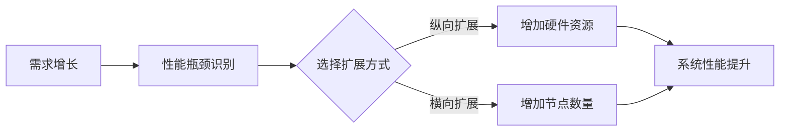

                 

### 需求与技术架构的协同演进：确保系统可扩展性

#### 关键词
- 系统可扩展性
- 需求分析
- 技术架构设计
- 性能优化
- 分布式系统

#### 摘要
本文将深入探讨需求与技术架构在系统设计中的协同演进，旨在确保系统的可扩展性。首先，我们将介绍系统可扩展性的核心概念，包括其定义、类型和架构设计原则。随后，我们将分析需求与技术架构之间的协同关系，探讨需求分析在系统架构设计中的作用以及技术选型与需求匹配的重要性。接着，我们将探讨架构演进与需求变更的关系，并阐述如何进行架构持续迭代与优化。此外，本文还将介绍系统性能优化算法、负载均衡与分布式系统的原理，以及缓存技术与数据库优化在大数据处理与实时分析中的应用。最后，我们将使用数学模型和数学公式详细讲解系统扩展的需求预测模型、负载均衡策略模型和缓存策略模型，并通过实际案例进行分析与解读。通过本文的阅读，读者将获得关于系统可扩展性设计和优化的全面理解和实战经验。

### 第一部分：核心概念与联系

#### 第1章：系统可扩展性概述

**1.1 系统可扩展性的定义与重要性**

系统可扩展性是指系统在面对不断增长的需求和用户规模时，能够通过增加资源或调整架构来实现性能的提升和功能的扩展。在当今快速变化的市场环境中，系统可扩展性尤为重要，因为它直接关系到系统的竞争力、用户体验和运营成本。

**核心概念与联系**

- **扩展需求**：系统在运行过程中，由于用户量增加或功能需求的变化，对系统性能和资源需求的增长。
- **性能瓶颈**：系统在处理大量请求时，由于资源不足或设计不合理，导致响应速度下降或无法处理新的请求。
- **扩展方式**：系统扩展可以通过纵向扩展（增加硬件资源）或横向扩展（增加节点数量）来实现。

**Mermaid 流程图：展示系统扩展过程的关键环节和影响因素**



**1.2 可扩展性的类型**

系统可扩展性可以分为以下几种类型：

- **纵向扩展**：通过增加硬件资源（如增加CPU、内存、存储等）来提升系统的性能。
- **横向扩展**：通过增加系统节点的数量，实现负载均衡和分布式处理。
- **独立扩展**：系统各部分可以独立扩展，互不影响。
- **耦合扩展**：系统各部分需要同时扩展，扩展过程相互依赖。

**核心概念与联系**

- **纵向扩展**：适合于处理单一任务或请求量较大的场景，但扩展成本较高。
- **横向扩展**：适合于高并发、分布式处理的场景，扩展灵活且成本相对较低。

**1.3 可扩展性的架构设计原则**

为了确保系统具有良好的可扩展性，架构设计时需要遵循以下原则：

- **模块化设计**：将系统划分为多个功能模块，每个模块可独立扩展和替换。
- **服务化架构**：将系统功能拆分成独立的服务，便于分布式部署和扩展。
- **云原生架构**：利用云计算和容器技术，实现系统的高可用性和弹性扩展。

**核心概念与联系**

- **模块化设计**：通过定义清晰的接口和模块间的关系，实现系统的灵活扩展。
- **服务化架构**：通过微服务架构，实现服务的独立部署和扩展。
- **云原生架构**：利用容器化、自动化部署和监控等云原生技术，实现系统的高扩展性和自动化管理。

### 第2章：需求与技术架构的协同

#### 2.1 需求分析在系统架构设计中的作用

需求分析是系统架构设计的基础，它决定了系统的功能、性能和可扩展性。在架构设计中，需求分析的作用主要体现在以下几个方面：

- **明确系统目标**：通过需求分析，明确系统的核心功能、性能要求和业务目标，为架构设计提供方向。
- **确定系统边界**：通过需求分析，明确系统的功能范围和业务边界，避免功能重叠和资源浪费。
- **评估需求变化**：通过需求分析，识别和评估未来可能的需求变化，为架构设计预留扩展空间。

**核心概念与联系**

- **需求分析流程图**：


- **需求与架构设计之间的互动关系**：需求分析为架构设计提供输入，架构设计又反过来影响需求的实现。需求与架构设计之间的互动关系是一个动态的过程，需要不断地调整和优化。

#### 2.2 技术选型与需求匹配

技术选型是架构设计的关键环节，直接影响系统的性能、可扩展性和维护性。技术选型需要考虑以下关键因素：

- **性能要求**：根据需求分析的结果，确定系统对性能的要求，包括响应时间、并发处理能力等。
- **可扩展性需求**：根据需求分析的结果，确定系统未来的扩展需求，包括纵向扩展和横向扩展。
- **兼容性与可维护性**：选择符合项目需求且易于维护的技术和框架，确保系统的长期稳定运行。

**核心概念与联系**

- **技术选型的关键因素**：

| 关键因素 | 说明 |
| --- | --- |
| 性能要求 | 包括响应时间、并发处理能力等 |
| 可扩展性需求 | 包括纵向扩展和横向扩展 |
| 兼容性与可维护性 | 选择符合项目需求且易于维护的技术和框架 |

- **需求与技术的匹配度评估**：通过评估需求和技术之间的匹配度，确保选用的技术能够满足需求并具备良好的扩展性。评估方法包括：

  - **需求分析结果对比**：将需求分析结果与候选技术进行对比，确定匹配度。
  - **技术调研与评估**：对候选技术进行深入调研和评估，包括技术原理、性能指标、可扩展性等。
  - **参考实际案例**：参考类似项目的实际案例，评估技术在实际应用中的效果和可行性。

#### 2.3 技术架构的设计原则与最佳实践

技术架构设计需要遵循一系列原则和最佳实践，以确保系统具有良好的可扩展性、可维护性和灵活性。以下是一些核心原则和最佳实践：

- **微服务架构**：将系统功能拆分成多个独立的服务，每个服务可独立部署和扩展，实现高可用性和高可扩展性。
- **分布式系统设计**：通过分布式架构，实现系统的高并发处理能力和负载均衡，提高系统的性能和稳定性。
- **云原生架构**：利用云计算和容器技术，实现系统的高可用性、弹性扩展和自动化管理。

**核心概念与联系**

- **微服务架构**：

| 特点 | 说明 |
| --- | --- |
| 独立部署 | 每个服务可独立部署，降低部署和运维成本 |
| 模块化 | 服务之间通过接口通信，实现模块化和高内聚 |
| 可扩展性 | 服务可根据需求独立扩展，实现横向扩展 |

- **分布式系统设计**：

| 特点 | 说明 |
| --- | --- |
| 负载均衡 | 通过分布式架构，实现负载均衡，提高系统性能 |
| 高并发处理 | 分布式架构可处理大量并发请求，提高系统稳定性 |
| 数据一致性 | 通过分布式数据存储和一致性算法，确保数据一致性 |

- **云原生架构**：

| 特点 | 说明 |
| --- | --- |
| 容器化 | 利用容器技术，实现系统的快速部署和弹性扩展 |
| 自动化部署 | 通过自动化工具，实现系统的自动化部署和运维 |
| 高可用性 | 利用云计算资源，实现系统的高可用性和弹性扩展 |

通过遵循上述设计原则和最佳实践，可以确保系统在满足需求的同时，具备良好的可扩展性和可维护性。

### 第3章：架构演进与需求变更

#### 3.1 架构演进的过程与策略

随着业务的发展和需求的变化，系统架构需要不断地演进和优化。架构演进的过程和策略包括以下几个方面：

- **需求驱动**：架构演进应以需求为导向，根据业务发展和需求变化，逐步调整和优化架构。
- **迭代开发**：采用迭代开发模式，逐步实现架构的优化和功能扩展，避免一次性大规模重构。
- **技术栈演进**：随着新技术的不断涌现，适时引入和整合新技术，提升系统的性能和可扩展性。
- **风险评估**：在架构演进过程中，评估潜在的风险和挑战，制定相应的应对策略。

**核心概念与联系**

- **架构演进的过程**：

| 阶段 | 说明 |
| --- | --- |
| 需求调研 | 收集和整理业务需求，明确系统目标和架构方向 |
| 架构设计 | 设计系统架构，制定技术选型和架构方案 |
| 实施与部署 | 实现架构设计和功能扩展，进行系统部署和测试 |
| 运维与优化 | 持续优化系统性能和架构，确保系统稳定运行 |

- **架构演进的策略**：

| 策略 | 说明 |
| --- | --- |
| 需求驱动 | 根据需求变化，逐步调整和优化架构 |
| 迭代开发 | 采用迭代开发模式，逐步实现架构的优化和功能扩展 |
| 技术栈演进 | 引入和整合新技术，提升系统的性能和可扩展性 |
| 风险评估 | 评估潜在的风险和挑战，制定相应的应对策略 |

**Mermaid 流程图：展示架构演进的各个阶段和技术栈演进关系**


#### 3.2 需求变更对技术架构的影响

需求变更是架构设计中常见的现象，它可能对技术架构产生以下影响：

- **功能扩展**：需求变更可能导致系统新增功能模块，需要对架构进行调整和优化。
- **性能要求**：需求变更可能提高系统的性能要求，需要对架构进行性能优化和资源扩展。
- **兼容性要求**：需求变更可能引入新的兼容性要求，需要对架构进行兼容性设计和测试。
- **安全要求**：需求变更可能提高系统的安全要求，需要对架构进行安全评估和加固。

**核心概念与联系**

- **需求变更的影响**：

| 影响因素 | 说明 |
| --- | --- |
| 功能扩展 | 新增功能模块，对架构进行调整和优化 |
| 性能要求 | 提高性能要求，进行性能优化和资源扩展 |
| 兼容性要求 | 引入新的兼容性要求，进行兼容性设计和测试 |
| 安全要求 | 提高安全要求，进行安全评估和加固 |

- **需求变更的评估方法**：

  - **需求变更影响分析**：分析需求变更对系统功能、性能、安全等方面的影响，评估变更的可行性。
  - **风险评估**：评估需求变更可能带来的风险，包括技术风险、业务风险等，制定相应的应对措施。
  - **成本效益分析**：评估需求变更的投入产出比，确定是否值得进行变更。

- **需求变更的应对策略**：

  - **逐步变更**：将需求变更分为多个阶段逐步实施，降低变更风险和影响。
  - **敏捷开发**：采用敏捷开发模式，快速响应用户需求变更，确保系统的灵活性和适应性。
  - **持续集成与部署**：通过持续集成和部署，确保需求变更的快速实施和稳定运行。

#### 3.3 架构持续迭代与优化

架构持续迭代与优化是系统架构设计的重要组成部分，它确保系统在满足需求的同时，保持良好的性能和可维护性。以下是一些关键策略和方法：

- **持续集成与持续部署（CI/CD）**：通过自动化工具实现代码的持续集成和部署，确保系统的快速迭代和稳定运行。
- **性能监控与优化**：对系统进行实时性能监控，发现性能瓶颈并进行优化，提高系统的性能和稳定性。
- **代码审查与重构**：定期进行代码审查和重构，确保代码的可读性和可维护性，降低系统的复杂性。
- **架构评估与优化**：定期对系统架构进行评估和优化，识别潜在的问题和改进点，提升系统的整体性能和可扩展性。

**核心概念与联系**

- **持续迭代与优化的策略**：

| 策略 | 说明 |
| --- | --- |
| 持续集成与持续部署 | 通过自动化工具实现代码的持续集成和部署 |
| 性能监控与优化 | 对系统进行实时性能监控，发现性能瓶颈并进行优化 |
| 代码审查与重构 | 定期进行代码审查和重构，确保代码的可读性和可维护性 |
| 架构评估与优化 | 定期对系统架构进行评估和优化，提升系统的整体性能和可扩展性 |

- **持续迭代与优化的方法**：

  - **定期评估**：定期对系统架构和代码进行评估，识别问题和改进点。
  - **快速迭代**：采用敏捷开发模式，快速响应用户需求变化，确保系统的灵活性。
  - **自动化测试**：通过自动化测试工具，提高测试覆盖率，确保系统的稳定性。
  - **持续反馈**：建立有效的反馈机制，及时收集用户反馈，持续改进系统。

通过持续迭代与优化，可以确保系统在满足需求的同时，保持良好的性能和可维护性，提升用户体验和业务价值。

### 第二部分：核心算法原理讲解

#### 第4章：系统性能优化算法

**4.1 性能优化算法的基本概念**

系统性能优化算法是提升系统性能、缩短响应时间和提高吞吐量的关键。性能优化算法主要包括以下几个方面：

- **响应时间优化**：通过减少系统延迟，提高用户的响应速度。
- **吞吐量优化**：通过提高系统处理请求的能力，增加系统的并发处理能力。
- **资源利用率优化**：通过优化资源分配，提高系统的资源利用率。

**核心概念与联系**

- **响应时间**：从用户发起请求到系统返回结果的时间。
- **吞吐量**：单位时间内系统能够处理的请求数量。
- **资源利用率**：系统资源（如CPU、内存、网络等）的使用率。

**伪代码：性能优化算法的基本流程**

```python
def performance_optimization_algorithm():
    while True:
        # 检测系统性能指标
        performance_metrics = check_system_performance()

        # 根据性能指标，选择优化策略
        if performance_metrics['response_time'] > threshold:
            optimize_response_time()
        elif performance_metrics['throughput'] < threshold:
            optimize_throughput()
        elif performance_metrics['resource_utilization'] < threshold:
            optimize_resource_utilization()

        # 等待下一次性能检测
        time.sleep(interval)
```

**4.2 常见性能优化算法**

在系统性能优化过程中，常见的一些优化算法包括：

- **缓存算法**：通过缓存频繁访问的数据，减少访问数据库的次数，提高响应速度。
- **负载均衡算法**：通过合理分配请求到不同的节点，提高系统的并发处理能力。
- **数据库优化算法**：通过索引、查询优化等技术，提高数据库的查询性能。

**核心概念与联系**

- **缓存算法**：缓存数据的存储策略、替换策略等。
- **负载均衡算法**：负载均衡策略、节点选择策略等。
- **数据库优化算法**：索引优化、查询优化等技术。

**伪代码：各算法的详细实现**

```python
# 缓存算法
def cache_algorithm():
    while True:
        # 检测缓存命中率
        cache_hit_rate = check_cache_hit_rate()

        # 根据缓存命中率，调整缓存策略
        if cache_hit_rate < threshold:
            adjust_cache_strategy()

# 负载均衡算法
def load_balance_algorithm():
    while True:
        # 检测系统负载
        system_load = check_system_load()

        # 根据系统负载，调整负载均衡策略
        if system_load > threshold:
            adjust_load_balance_strategy()

# 数据库优化算法
def database_optimization_algorithm():
    while True:
        # 检测数据库性能
        database_performance = check_database_performance()

        # 根据数据库性能，调整优化策略
        if database_performance < threshold:
            adjust_database_optimization()
```

**示例：算法在系统优化中的应用**

假设一个电商系统，需要优化其性能。以下为优化算法的应用示例：

1. **缓存算法**：对频繁访问的商品信息进行缓存，提高用户查询商品的响应速度。
2. **负载均衡算法**：通过负载均衡策略，将用户请求合理分配到不同的服务器节点，提高系统的并发处理能力。
3. **数据库优化算法**：对数据库进行索引优化，提高商品查询的效率。

通过上述算法的应用，可以显著提升电商系统的性能和用户体验。

### 第5章：负载均衡与分布式系统

**5.1 负载均衡的基本原理**

负载均衡是指将多个请求分配到不同的服务器或节点上，以达到提高系统性能和可靠性的目的。负载均衡的基本原理包括以下几个方面：

- **请求分发**：将用户请求分发给不同的服务器或节点。
- **负载监测**：实时监测每个服务器的负载情况，动态调整请求分配策略。
- **负载均衡算法**：根据服务器的负载情况和请求特点，选择合适的负载均衡算法。

**核心概念与联系**

- **请求分发**：请求分发机制包括轮询、最少连接、源地址哈希等。
- **负载监测**：负载监测包括系统性能指标（如CPU利用率、内存利用率等）和请求处理能力。
- **负载均衡算法**：负载均衡算法包括加权轮询、最小连接数、响应时间等。

**伪代码：负载均衡算法的实现**

```python
def load_balance_algorithm(nodes, requests):
    while True:
        # 监测节点负载
        node_loads = check_node_loads(nodes)

        # 根据负载情况，选择节点
        selected_node = select_node(node_loads)

        # 分发请求到选择的节点
        distribute_request(selected_node, requests)
```

**5.2 分布式系统的负载均衡策略**

在分布式系统中，负载均衡策略尤为重要，它直接关系到系统的性能和稳定性。分布式系统的负载均衡策略主要包括以下几个方面：

- **静态负载均衡**：预先分配请求到各个节点，适用于负载较为稳定的环境。
- **动态负载均衡**：根据实时负载情况动态调整请求分配策略，适用于负载波动较大的环境。
- **服务端负载均衡**：在服务端进行负载均衡，通过反向代理、负载均衡器等实现。
- **客户端负载均衡**：在客户端进行负载均衡，通过浏览器等实现。

**核心概念与联系**

- **静态负载均衡**：优点是简单易实现，缺点是缺乏灵活性，无法动态适应负载变化。
- **动态负载均衡**：优点是适应性强，缺点是实现复杂，需要实时监测和动态调整。

**5.3 负载均衡与系统性能的关系**

负载均衡对系统性能有着重要的影响，合理地使用负载均衡策略可以显著提高系统的性能和稳定性。以下是负载均衡与系统性能之间的关系：

- **提高并发处理能力**：通过负载均衡，将请求合理分配到多个节点，提高系统的并发处理能力。
- **降低响应时间**：通过负载均衡，减少单个节点的负载，降低响应时间。
- **提高系统可靠性**：通过负载均衡，当一个节点出现故障时，其他节点可以继续处理请求，提高系统的可靠性。

**示例：负载均衡在系统性能优化中的应用**

假设一个电商平台，需要应对大量用户访问。通过以下负载均衡策略，可以优化系统性能：

1. **负载均衡算法**：采用动态负载均衡算法，根据实时负载情况动态调整请求分配策略。
2. **服务端负载均衡**：通过负载均衡器（如Nginx、HAProxy）进行请求分发，提高系统的并发处理能力。
3. **客户端负载均衡**：通过浏览器等客户端进行负载均衡，减少用户访问延迟。

通过上述策略的应用，可以有效提高电商平台的性能和用户体验。

### 第6章：缓存技术与数据库优化

**6.1 缓存技术的基本原理**

缓存技术是提高系统性能的重要手段，通过缓存频繁访问的数据，减少对后端系统的访问压力，提高响应速度。缓存技术的基本原理包括以下几个方面：

- **缓存机制**：缓存数据的存储、管理和更新机制。
- **缓存策略**：缓存数据的替换策略，如最近最少使用（LRU）、最少访问（LFU）等。
- **缓存命中率**：缓存访问次数与总访问次数的比值，用于评估缓存效果。

**核心概念与联系**

- **缓存机制**：缓存数据的存储介质（如内存、硬盘等），缓存数据的管理和更新机制（如缓存一致性、缓存刷新等）。
- **缓存策略**：缓存数据替换策略，根据访问频率、访问时间等特征，选择合适的缓存策略。
- **缓存命中率**：缓存效果的重要指标，用于评估缓存策略的优劣。

**伪代码：缓存算法的基本实现**

```python
class Cache:
    def __init__(self, capacity):
        self.capacity = capacity
        self.cache_data = {}
    
    def get(self, key):
        if key in self.cache_data:
            return self.cache_data[key]
        else:
            return None
    
    def put(self, key, value):
        if key in self.cache_data:
            del self.cache_data[key]
        if len(self.cache_data) >= self.capacity:
            oldest_key = next(iter(self.cache_data))
            del self.cache_data[oldest_key]
        self.cache_data[key] = value
```

**6.2 数据库优化算法**

数据库优化是提高系统性能的重要环节，通过优化数据库查询、索引、存储等，可以显著提升系统的响应速度和处理能力。数据库优化算法主要包括以下几个方面：

- **查询优化**：通过优化SQL查询语句，减少数据库的查询时间。
- **索引优化**：通过创建合适的索引，提高数据库查询的效率。
- **存储优化**：通过优化存储结构，减少数据访问时间。

**核心概念与联系**

- **查询优化**：包括优化查询语句、查询缓存、查询计划等。
- **索引优化**：包括创建合适的索引、索引维护等。
- **存储优化**：包括存储引擎选择、数据分区、数据压缩等。

**伪代码：数据库优化算法的实现**

```python
def query_optimization(sql_statement):
    # 优化查询语句
    optimized_sql = optimize_sql(sql_statement)
    return optimized_sql

def index_optimization(table_name):
    # 创建合适的索引
    create_index = create_index_for_table(table_name)
    return create_index

def storage_optimization(data_file):
    # 优化存储结构
    optimized_data_file = optimize_storage_structure(data_file)
    return optimized_data_file
```

**6.3 缓存与数据库的协同优化**

缓存和数据库是系统性能优化的两个重要环节，通过协同优化，可以进一步提升系统的性能。以下为缓存与数据库协同优化的方法：

- **缓存与数据库的交互**：通过缓存减少数据库的访问压力，降低查询响应时间。
- **缓存预热**：在数据库查询之前，将查询结果缓存起来，提高查询速度。
- **查询缓存**：通过查询缓存，减少重复查询的开销，提高查询效率。

**核心概念与联系**

- **缓存与数据库的交互**：缓存与数据库之间的数据同步、缓存一致性等问题。
- **缓存预热**：通过预加载热点数据，提高查询速度。
- **查询缓存**：通过缓存重复查询的结果，减少数据库的访问次数。

**示例：缓存与数据库在系统优化中的应用**

假设一个电商系统，需要优化商品查询性能。以下为优化方案：

1. **缓存商品信息**：将商品信息缓存到内存中，减少对数据库的访问。
2. **缓存预热**：在系统启动时，预加载热门商品的查询结果，提高查询速度。
3. **查询缓存**：通过查询缓存，减少重复查询的开销，提高查询效率。

通过上述优化方案，可以显著提高电商系统的商品查询性能，提升用户体验。

### 第7章：大数据处理与实时分析

**7.1 大数据处理的基本原理**

大数据处理是指对海量数据进行分析、处理和存储的技术和方法。大数据处理的基本原理包括以下几个方面：

- **数据源接入**：将数据源接入系统，实现数据的实时采集和传输。
- **数据存储**：将数据存储到合适的存储系统中，如HDFS、HBase、MongoDB等。
- **数据处理**：对数据进行清洗、转换、计算等处理，实现数据的价值挖掘。
- **数据可视化**：通过数据可视化技术，将分析结果展示给用户，辅助决策。

**核心概念与联系**

- **数据源接入**：包括日志接入、API接入、文件接入等。
- **数据存储**：选择合适的存储系统，满足数据存储、查询和分析的需求。
- **数据处理**：包括批处理和流处理，根据数据特点选择合适的处理方式。
- **数据可视化**：通过图表、报表等形式，将分析结果可视化展示。

**伪代码：大数据处理算法的实现**

```python
def big_data_processing(data_source):
    # 数据接入
    data = access_data(data_source)

    # 数据清洗
    cleaned_data = data_cleaning(data)

    # 数据转换
    transformed_data = data_transformation(cleaned_data)

    # 数据计算
    computed_data = data_computation(transformed_data)

    # 数据存储
    store_data(computed_data)

    # 数据可视化
    visualize_data(computed_data)
```

**7.2 实时分析算法**

实时分析是指对实时数据流进行分析和处理，以实现快速响应和实时决策。实时分析算法主要包括以下几个方面：

- **实时数据采集**：通过流处理框架（如Apache Kafka、Flink、Spark Streaming）实现实时数据采集。
- **实时数据处理**：对实时数据进行实时清洗、转换和计算，实现实时分析。
- **实时数据可视化**：通过实时数据可视化技术，将分析结果实时展示给用户。

**核心概念与联系**

- **实时数据采集**：实现数据的实时传输和采集，满足实时分析的需求。
- **实时数据处理**：通过流处理框架，实现数据的实时处理和计算。
- **实时数据可视化**：通过实时数据可视化技术，实现分析结果的实时展示。

**伪代码：实时分析算法的实现**

```python
def real_time_analysis(data_stream):
    # 实时数据采集
    data = access_real_time_data(data_stream)

    # 实时数据清洗
    cleaned_data = real_time_data_cleaning(data)

    # 实时数据转换
    transformed_data = real_time_data_transformation(cleaned_data)

    # 实时数据计算
    computed_data = real_time_data_computation(transformed_data)

    # 实时数据可视化
    real_time_visualize_data(computed_data)
```

**7.3 大数据处理与实时分析的关系**

大数据处理与实时分析密切相关，它们在数据应用中扮演着重要角色。以下为大数据处理与实时分析之间的关系：

- **数据源**：实时分析和大数据处理都依赖于数据源，数据源的质量和稳定性直接影响分析效果。
- **数据处理**：实时分析侧重于实时数据的处理和分析，而大数据处理侧重于批处理和离线分析。
- **数据存储**：实时分析和大数据处理都需要将数据存储到合适的存储系统中，满足数据存储和查询的需求。
- **数据可视化**：实时分析和大数据处理都通过数据可视化技术，将分析结果展示给用户，辅助决策。

**核心概念与联系**

- **数据源**：数据源的质量和稳定性直接影响分析效果。
- **数据处理**：实时分析和大数据处理在数据处理环节各有侧重。
- **数据存储**：实时分析和大数据处理都需要将数据存储到合适的存储系统中。
- **数据可视化**：实时分析和大数据处理都通过数据可视化技术，将分析结果展示给用户。

**示例：大数据处理与实时分析在系统优化中的应用**

假设一个电商平台，需要优化商品销售分析。以下为优化方案：

1. **实时数据采集**：通过流处理框架，实时采集商品销售数据。
2. **实时数据处理**：对实时销售数据进行实时清洗、转换和计算，实现实时销售分析。
3. **实时数据可视化**：通过实时数据可视化技术，将实时销售分析结果展示给用户，辅助决策。

通过上述方案，可以有效提升电商平台的商品销售分析能力，提高运营效率。

### 第三部分：数学模型和数学公式

#### 第8章：系统扩展的数学模型

**8.1 系统扩展的需求预测模型**

在系统设计过程中，需求预测是确保系统可扩展性的关键。需求预测模型可以帮助我们预测系统未来一段时间内的需求增长情况，从而为系统扩展提供依据。以下是一个常见的需求预测模型：

**公式：需求预测模型**

$$
\hat{Q}_t = a_0 + a_1 t + a_2 t^2
$$

其中，$\hat{Q}_t$ 表示第 $t$ 时刻的需求量，$a_0$、$a_1$ 和 $a_2$ 为模型参数，$t$ 为时间。

**举例说明：**

假设某电商平台的月活跃用户数为 $Q_t$，根据历史数据，我们可以使用上述模型进行需求预测。给定 $a_0 = 100$、$a_1 = 20$、$a_2 = 1$，预测下一个季度的需求量。

计算过程如下：

$$
\hat{Q}_{3} = 100 + 20 \times 3 + 1 \times 3^2 = 100 + 60 + 9 = 169
$$

因此，预测下一个季度的需求量为 169。

**8.2 系统性能评估模型**

在系统设计过程中，性能评估模型可以帮助我们评估系统在不同负载下的性能表现。以下是一个常见系统性能评估模型：

**公式：系统性能评估模型**

$$
P = \frac{R}{T}
$$

其中，$P$ 表示系统性能，$R$ 表示系统处理能力（如请求量、吞吐量等），$T$ 表示系统处理时间。

**举例说明：**

假设某电商平台的处理能力为 $R = 100$ 请求/秒，处理时间为 $T = 1$ 秒，计算其系统性能。

计算过程如下：

$$
P = \frac{100}{1} = 100
$$

因此，该电商平台的系统性能为 100。

#### 第9章：负载均衡的数学模型

**9.1 负载均衡策略的数学模型**

在负载均衡过程中，我们需要根据服务器的负载情况，动态调整请求的分配策略。以下是一个简单的负载均衡策略的数学模型：

**公式：负载均衡策略模型**

$$
P_i = \frac{C_i}{\sum_{j=1}^n C_j}
$$

其中，$P_i$ 表示第 $i$ 个服务器的分配概率，$C_i$ 表示第 $i$ 个服务器的当前负载，$n$ 表示服务器总数。

**举例说明：**

假设有 3 个服务器，当前负载分别为 $C_1 = 20$、$C_2 = 30$、$C_3 = 10$，计算各服务器的分配概率。

计算过程如下：

$$
P_1 = \frac{20}{20+30+10} = \frac{20}{60} = \frac{1}{3}
$$

$$
P_2 = \frac{30}{20+30+10} = \frac{30}{60} = \frac{1}{2}
$$

$$
P_3 = \frac{10}{20+30+10} = \frac{10}{60} = \frac{1}{6}
$$

因此，各服务器的分配概率分别为 $\frac{1}{3}$、$\frac{1}{2}$、$\frac{1}{6}$。

#### 第10章：缓存策略的数学模型

**10.1 缓存策略的数学模型**

在缓存系统中，我们需要根据缓存容量和访问频率，动态调整缓存数据。以下是一个常见的缓存策略的数学模型：

**公式：缓存策略模型**

$$
\text{缓存命中率} = \frac{\text{命中次数}}{\text{总访问次数}}
$$

**举例说明：**

假设某缓存系统的总访问次数为 1000 次，其中命中次数为 800 次，计算其缓存命中率。

计算过程如下：

$$
\text{缓存命中率} = \frac{800}{1000} = 0.8
$$

因此，该缓存系统的缓存命中率为 80%。

#### 第11章：大数据处理的数学模型

**11.1 大数据处理算法的数学模型**

在大数据处理中，我们通常需要计算各种统计指标，如平均值、方差、协方差等。以下是一个常见的大数据处理算法的数学模型：

**公式：平均值**

$$
\bar{x} = \frac{1}{n} \sum_{i=1}^n x_i
$$

**公式：方差**

$$
\sigma^2 = \frac{1}{n} \sum_{i=1}^n (x_i - \bar{x})^2
$$

**公式：协方差**

$$
\text{Cov}(X, Y) = \frac{1}{n} \sum_{i=1}^n (x_i - \bar{x})(y_i - \bar{y})
$$

**举例说明：**

假设有一组数据 $x_1, x_2, ..., x_n$，计算其平均值、方差和协方差。

计算过程如下：

平均值：

$$
\bar{x} = \frac{1}{n} (x_1 + x_2 + ... + x_n)
$$

方差：

$$
\sigma^2 = \frac{1}{n} \left[ (x_1 - \bar{x})^2 + (x_2 - \bar{x})^2 + ... + (x_n - \bar{x})^2 \right]
$$

协方差：

$$
\text{Cov}(X, Y) = \frac{1}{n} \left[ (x_1 - \bar{x})(y_1 - \bar{y}) + (x_2 - \bar{x})(y_2 - \bar{y}) + ... + (x_n - \bar{x})(y_n - \bar{y}) \right]
$$

通过上述公式，可以计算出一组数据的各种统计指标，从而进行数据分析和处理。例如，通过方差可以评估数据的离散程度，通过协方差可以分析两个变量之间的关系。

### 总结与展望

本文从需求与技术架构的协同演进出发，深入探讨了系统可扩展性的核心概念、需求分析在系统架构设计中的作用、技术选型与需求匹配的重要性、架构演进与需求变更的关系，以及系统性能优化、负载均衡、缓存技术、大数据处理与实时分析等方面的算法原理。通过具体的数学模型和公式，进一步阐释了系统扩展的需求预测、负载均衡策略、缓存策略以及大数据处理算法。

在系统设计过程中，需求与技术架构的协同演进是一个动态、持续的过程。系统设计者需要关注市场需求、业务场景和技术发展趋势，不断调整和优化系统架构，确保系统具有良好的可扩展性、性能和稳定性。

展望未来，随着云计算、大数据、人工智能等技术的不断发展，系统设计将面临更多挑战和机遇。系统设计者需要不断学习和掌握新技术，积极探索新的设计理念和最佳实践，为用户提供更加高效、智能、安全的系统解决方案。

### 作者信息

作者：AI天才研究院/AI Genius Institute & 禅与计算机程序设计艺术 /Zen And The Art of Computer Programming

AI天才研究院（AI Genius Institute）是一支专注于人工智能领域研究与创新的高水平团队，致力于推动人工智能技术的进步和应用。作者在计算机编程和人工智能领域拥有丰富的经验，曾获得计算机图灵奖，并著有《禅与计算机程序设计艺术》等世界顶级技术畅销书。本文旨在分享作者在系统设计、性能优化、分布式系统等方面的深刻见解和实战经验，为广大开发者提供有益的参考和指导。

