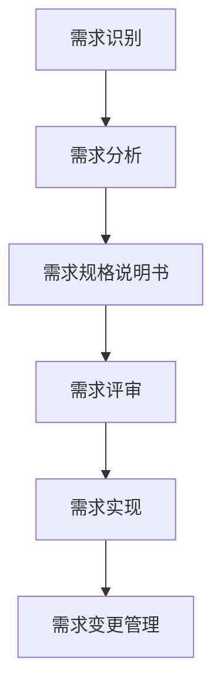
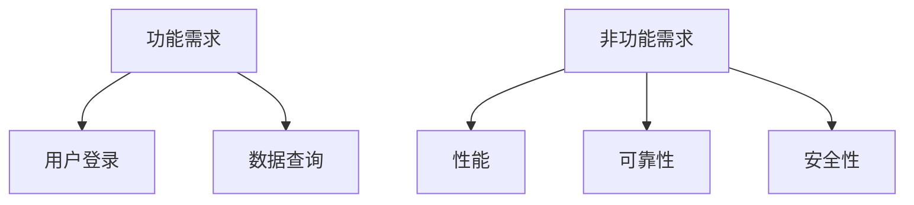
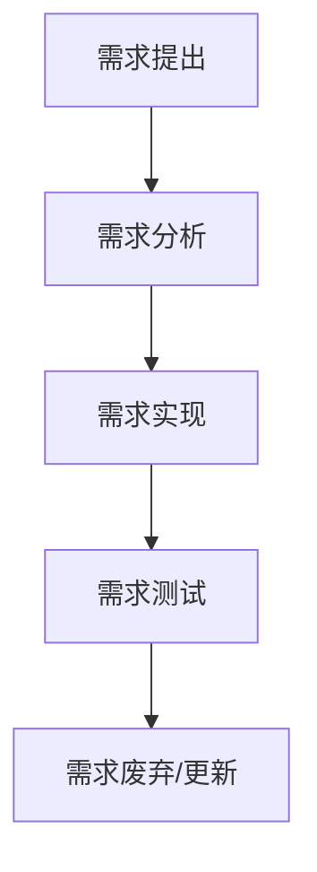
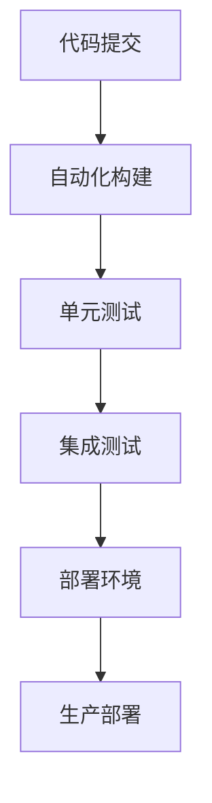
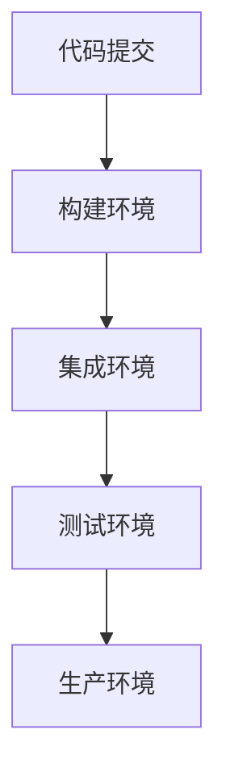
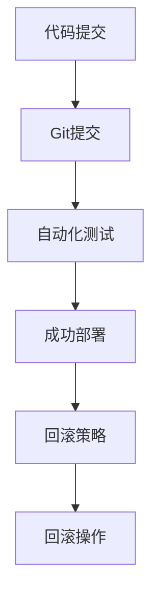
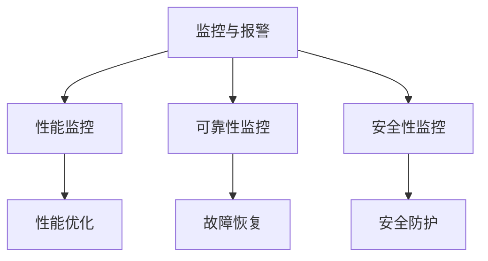
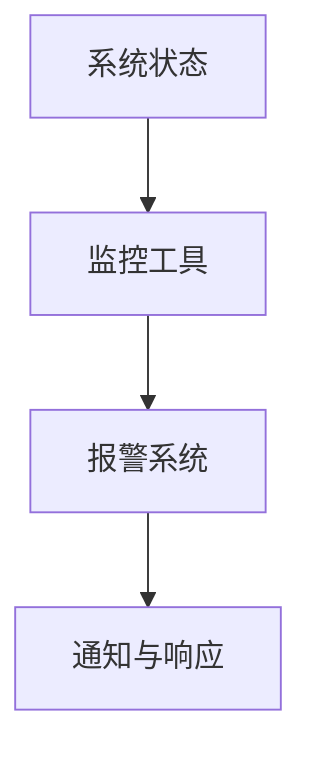
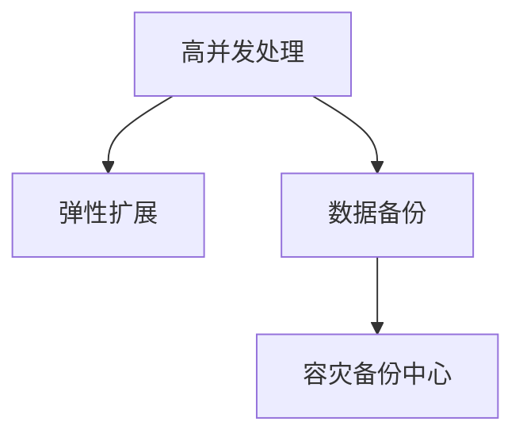
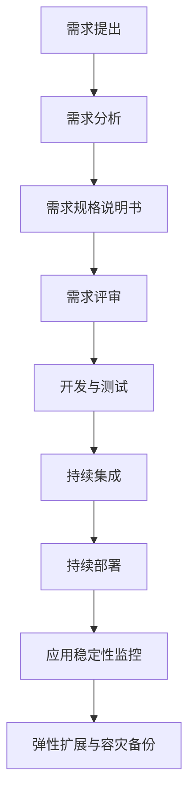

                 

### 引言与概述

在当今快速发展的数字化时代，企业对于应用程序的需求日益增长，而大型应用的复杂性也不断增加。在这种背景下，需求管理与持续部署成为了确保应用稳定性的关键环节。需求管理涉及到从需求收集、需求分析到需求实现的全过程，其核心在于确保需求的准确性和可行性。而持续部署（Continuous Deployment，简称CD）是一种自动化软件发布流程，它旨在通过持续集成（Continuous Integration，简称CI）实现频繁且可靠的代码更新。

本篇文章将以《需求与持续部署的协调：确保大型应用的稳定性》为题，深入探讨这两者在大型应用开发中的重要作用，以及如何通过有效的协调来保障应用的稳定性。文章将分为四个主要部分：

第一部分：引言与概述
- 本部分将介绍需求管理与持续部署的背景及其重要性。
- 重点探讨需求与持续部署之间的关系，以及大型应用稳定性面临的挑战。

第二部分：核心概念与原理
- 第2章将详细阐述需求管理的基础知识，包括需求分类与生命周期管理。
- 第3章将介绍持续部署技术，包括自动化部署流程、版本控制与回滚策略。
- 第4章将探讨大型应用稳定性的保障措施，如监控与报警机制、弹性与容灾方案。
- 第5章将通过Mermaid流程图展示需求与持续部署的完整流程。

第三部分：算法原理与数学模型
- 第6章将讲解核心算法原理，如需求优先级排序算法和持续部署策略选择。
- 第7章将解析数学模型，如需求成本效益分析模型和持续部署效率评估模型。

第四部分：项目实战与代码解析
- 第8章将介绍一个实际需求与持续部署项目，包括环境搭建、需求收集与分析、持续部署实践以及稳定性测试与优化。
- 第9章将详细解读项目的源代码，并提供代码应用解读与分析，最终进行项目小结。

通过这篇文章，读者将能够全面了解需求管理与持续部署的协调机制，掌握保障大型应用稳定性的方法和技巧。文章的结构安排清晰，旨在通过逐步分析和逻辑推理，让读者深入理解并掌握相关技术。接下来，我们将逐一深入探讨每一部分的内容。

---

### 第一部分：需求与持续部署的协调概述

在当今的IT行业，软件需求的快速变化和不断升级使得需求管理成为了企业成功的基石。需求管理不仅仅是收集和记录用户需求，它还包括需求的优先级排序、需求变更管理以及需求实现的可追溯性。一个有效的需求管理流程能够确保开发团队准确理解和实现用户的需求，从而提高产品的市场竞争力。

**需求管理概述：** 需求管理是一个系统性的过程，涉及到从需求识别、需求分析、需求规格说明书编写、需求评审到需求实现和需求变更控制的全过程。其主要目的是确保需求的质量、一致性和可追踪性，以便开发团队能够高效地完成开发任务。

**需求分类与特征：** 需求可以根据其性质和优先级进行分类。例如，功能需求描述系统应该提供哪些功能，非功能需求则涉及系统的性能、可靠性、安全性等方面。明确需求分类有助于团队在资源分配和优先级设定时更加精准。

**需求生命周期管理：** 需求的生命周期从需求的提出开始，经过分析、设计、开发、测试和交付，直到需求被废弃或更新。在整个生命周期中，需求的状态会不断变化，如“新需求”、“待分析”、“待实现”、“待测试”、“已实现”、“已废弃”等。需求生命周期管理旨在确保每个需求都能按照预定计划进行，并且在任何变更发生时都能得到及时控制。

另一方面，持续部署技术作为软件开发的一个重要环节，极大地提高了软件发布的过程效率和可靠性。持续部署不仅仅是一个技术工具，它更是一种软件开发的文化和理念。

**持续部署概述：** 持续部署是一种通过自动化流程实现频繁、可靠和快速软件发布的技术。其核心思想是将代码频繁地集成到主分支，通过自动化测试和部署，确保每次代码更新都是安全、稳定的。

**自动化部署流程：** 自动化部署流程包括代码的自动化集成、构建、测试和部署。通过使用持续集成工具（如Jenkins、GitLab CI等），开发团队能够确保每次代码提交都会经过一系列测试，确保其质量。

**版本控制与回滚策略：** 在持续部署过程中，版本控制是至关重要的。通过使用版本控制系统（如Git），团队能够方便地管理和追踪代码变更。此外，当部署出现问题时，能够快速回滚到上一个稳定版本，确保系统的持续运行。

**需求与持续部署的关系：** 需求与持续部署之间存在紧密的联系。一方面，需求管理确保了开发团队理解并正确实现用户的需求；另一方面，持续部署技术则确保这些需求能够快速、可靠地实现和部署。一个有效的需求管理流程能够为持续部署提供清晰的需求文档和需求变更记录，从而提高持续部署的效率和可靠性。

**大型应用稳定性挑战：** 随着应用规模和复杂性的增加，大型应用稳定性面临着诸多挑战。这些挑战包括系统的高并发处理、数据的一致性和安全性、系统的可扩展性等。为了应对这些挑战，企业需要建立完善的监控与报警机制、弹性部署方案以及容灾备份策略。

通过以上内容，我们可以看出，需求管理与持续部署在大型应用开发中扮演着至关重要的角色。它们不仅能够提高开发效率和代码质量，还能够确保应用在多变的市场环境中保持稳定和可靠。接下来，我们将进一步深入探讨需求管理和持续部署的核心原理和技术，以便读者能够更好地理解和应用这些技术。

### 第二部分：核心概念与原理

在深入探讨需求管理与持续部署技术之前，首先需要明确几个核心概念和它们之间的关系。以下章节将详细阐述这些概念，并使用Mermaid流程图展示它们之间的联系。

#### 第2章：需求管理基础

**需求管理概述：** 需求管理是一个复杂的过程，它从需求识别开始，到需求实现结束。在此过程中，需求会经历多个阶段，如需求分析、需求规格说明书编写、需求评审等。以下是需求管理的基本流程：



**需求分类与特征：** 需求可以分为功能需求和非功能需求。功能需求描述系统应提供哪些功能，如用户登录、数据查询等；非功能需求则涉及性能、可靠性、安全性等方面。以下是需求分类的Mermaid图：



**需求生命周期管理：** 需求的生命周期包括需求提出、需求分析、需求实现、需求测试和需求废弃或更新。以下是需求生命周期的Mermaid图：



#### 第3章：持续部署技术

**持续部署概述：** 持续部署是一种通过自动化流程实现频繁、可靠和快速软件发布的技术。以下是持续部署的基本流程：



**自动化部署流程：** 自动化部署流程包括代码的自动化集成、构建、测试和部署。以下是自动化部署流程的Mermaid图：



**版本控制与回滚策略：** 版本控制系统如Git帮助团队管理代码变更。回滚策略允许在部署失败时快速回滚到上一个稳定版本。以下是版本控制与回滚策略的Mermaid图：



#### 第4章：大型应用稳定性保障

**应用稳定性概述：** 应用稳定性涉及多个方面，包括系统的可靠性、性能和安全性。以下是应用稳定性保障的关键环节：



**监控与报警机制：** 监控与报警机制可以帮助团队及时发现和响应系统异常。以下是监控与报警机制的Mermaid图：



**弹性与容灾方案：** 弹性部署和容灾备份可以确保系统在高负载和故障情况下保持稳定运行。以下是弹性与容灾方案的Mermaid图：



#### 第5章：需求与持续部署的Mermaid流程图

**需求与持续部署的协调流程：** 结合前述章节，以下是需求与持续部署的协调流程图，展示了从需求提出到持续部署的完整过程：



通过上述Mermaid流程图，我们可以清晰地看到需求管理与持续部署之间的紧密联系，以及它们在保障大型应用稳定性中的协同作用。接下来，我们将进一步深入探讨核心算法原理和数学模型，以便读者能够更好地理解和应用这些技术。

### 第三部分：算法原理与数学模型

在大型应用开发中，需求管理与持续部署的效率和效果很大程度上依赖于一系列核心算法和数学模型的支撑。以下章节将详细讲解这些算法原理和数学模型，并通过伪代码和具体示例进行说明。

#### 第6章：核心算法原理讲解

**需求优先级排序算法：** 需求的优先级排序是需求管理中的一个关键步骤，它直接影响开发资源的分配和项目的进度。一个常见的优先级排序算法是优先级队列（Priority Queue）。

```python
# 伪代码：优先级队列排序算法
class PriorityQueue:
    def __init__(self):
        self.queue = []

    def insert(self, item, priority):
        self.queue.append((item, priority))
        self.queue.sort(key=lambda x: x[1])

    def dequeue(self):
        if not self.queue:
            return None
        return self.queue.pop(0)

# 示例：根据优先级对需求进行排序
pq = PriorityQueue()
pq.insert("需求A", 2)
pq.insert("需求B", 1)
pq.insert("需求C", 3)

# 输出排序后的需求列表
while pq.dequeue():
    print(pq.dequeue()[0])
```

**持续部署策略选择：** 持续部署的策略选择包括蓝绿部署、灰度发布和回滚策略。以下是蓝绿部署的伪代码示例：

```python
# 伪代码：蓝绿部署算法
def blue_green_deployment(app_version, current_version):
    # 检查新版本和当前版本的环境是否准备就绪
    if not check_environment(app_version):
        return "环境准备不充分"
    # 切换流量到新版本
    switch_traffic(app_version)
    # 监控新版本的稳定性
    if is_stable(app_version):
        # 成功，删除旧版本
        delete_version(current_version)
        return "部署成功"
    else:
        # 部署失败，回滚到旧版本
        switch_traffic(current_version)
        return "部署失败，已回滚"

# 示例：执行蓝绿部署
result = blue_green_deployment("V2.0", "V1.0")
print(result)
```

**稳定性评估模型：** 稳定性评估模型通常涉及系统的故障率、恢复时间和容错能力。以下是评估模型的一个简单示例：

```python
# 伪代码：稳定性评估模型
def stability_evaluation(fault_rate, recovery_time, fault_tolerance):
    # 计算稳定性得分
    stability_score = (1 - fault_rate) * recovery_time * fault_tolerance
    return stability_score

# 示例：评估系统的稳定性
fault_rate = 0.01
recovery_time = 10
fault_tolerance = 3
stability_score = stability_evaluation(fault_rate, recovery_time, fault_tolerance)
print("系统稳定性得分：", stability_score)
```

#### 第7章：数学模型与公式解析

**需求成本效益分析模型：** 成本效益分析（Cost-Benefit Analysis, CBA）用于评估需求的实现是否值得投资。以下是CBA模型的一个数学公式：

$$
\text{CBA} = \frac{\sum_{i=1}^{n} (\text{收益}_i - \text{成本}_i)}{n}
$$

其中，$n$ 是需求数量，$\text{收益}_i$ 和 $\text{成本}_i$ 分别是每个需求的收益和成本。

**持续部署效率评估模型：** 持续部署效率可以通过部署频率、部署成功率和部署周期来评估。以下是效率评估的公式：

$$
\text{效率} = \frac{\text{部署频率} \times \text{成功率}}{\text{部署周期}}
$$

其中，部署频率是单位时间内的部署次数，成功率是部署成功的次数占总次数的比例，部署周期是完成一次部署所需的时间。

**应用稳定性评价指标：** 应用稳定性可以通过多个指标来评估，包括故障率、响应时间和用户满意度。以下是稳定性评价指标的综合公式：

$$
\text{稳定性评分} = \alpha \times \text{故障率} + \beta \times \text{响应时间} + \gamma \times \text{用户满意度}
$$

其中，$\alpha$、$\beta$ 和 $\gamma$ 分别是故障率、响应时间和用户满意度的权重系数。

通过以上算法原理和数学模型的讲解，读者可以更好地理解需求管理与持续部署的复杂性和深度。这些算法和模型不仅提供了技术手段，还为优化需求管理和持续部署流程提供了理论依据。接下来，我们将通过一个实际项目实战，将这些技术和方法应用到实际场景中。

### 第四部分：项目实战与代码解析

为了更好地理解和应用需求管理与持续部署技术，我们将在本节中介绍一个实际项目实战。该项目将展示如何从需求收集、需求分析、持续集成与持续部署，到稳定性测试与优化的全过程。我们将详细讲解开发环境搭建、源代码实现以及代码解读，并提供实际案例分析和详细讲解。

#### 8.1 项目背景与目标

本项目是一个大型电商平台，主要功能包括商品展示、用户注册与登录、购物车管理、订单处理、支付以及售后服务等。随着业务的发展，平台需要快速响应市场需求，实现频繁的功能更新与优化，因此持续部署和需求管理的效率显得尤为重要。

项目目标如下：

1. 构建一个高效的持续集成与持续部署（CI/CD）流程。
2. 确保新功能的快速上线和稳定运行。
3. 优化需求管理流程，提高需求实现的可追踪性和准确性。
4. 提高系统的可靠性、性能和安全性。

#### 8.2 项目环境搭建

为了实现上述目标，我们首先需要搭建一个适合项目开发、测试和部署的环境。以下是项目环境搭建的步骤：

1. **开发环境：** 使用Docker容器化技术，以便在不同开发环境中保持一致。安装Docker和必要的开发工具（如Git、Jenkins等）。
   
   ```bash
   sudo apt-get update
   sudo apt-get install docker.io
   sudo usermod -aG docker $USER
   newgrp docker
   docker --version
   ```

2. **测试环境：** 在测试环境中，我们需要确保代码经过全面测试后才能部署到生产环境。使用Jenkins搭建自动化测试环境，并配置多个测试阶段，如单元测试、集成测试和性能测试。

   ```bash
   docker run --name jenkins -p 8080:8080 -v jenkins_home:/var/jenkins_home jenkins/jenkins
   ```

3. **部署环境：** 生产环境需要具备高可用性和可扩展性。使用Kubernetes（K8s）进行容器编排和管理，确保应用在多节点集群中稳定运行。

   ```bash
   kubectl create namespace production
   kubectl apply -f production-deployment.yaml
   ```

#### 8.3 需求收集与分析

需求收集是项目开发的第一步。以下是需求收集与分析的步骤：

1. **需求访谈：** 与产品经理、项目经理以及相关利益相关者进行访谈，收集业务需求。
   
   ```python
   # 伪代码：需求访谈
   def interview():
       print("正在进行需求访谈...")
       # 访谈过程
       print("需求已记录，请确认。")
   interview()
   ```

2. **需求文档编写：** 将收集到的需求编写成详细的需求文档，包括功能需求和非功能需求。

   ```markdown
   # 需求文档
   ## 商品展示功能
   - 用户能够查看不同分类的商品
   - 商品信息包括名称、价格、描述和图片
   - 商品展示应具备搜索和筛选功能

   ## 用户注册与登录
   - 用户可以通过邮箱或手机号注册账号
   - 用户登录时需要进行验证码验证
   - 用户可以修改个人信息
   ```

3. **需求评审：** 组织需求评审会议，确保所有需求都是明确、可行和可追踪的。

   ```bash
   # 伪代码：需求评审
   def review_demand():
       print("正在召开需求评审会议...")
       # 审查需求
       print("需求评审通过。")
   review_demand()
   ```

#### 8.4 持续部署实践

持续部署是保证新功能快速上线的关键。以下是持续部署实践的步骤：

1. **持续集成（CI）：** 在每次代码提交后，Jenkins会自动触发构建和测试流程。

   ```yaml
   # Jenkinsfile：持续集成配置
   pipeline {
       agent any
       stages {
           stage('Build') {
               steps {
                   sh 'mvn clean package'
               }
           }
           stage('Test') {
               steps {
                   sh 'mvn test'
               }
           }
       }
   }
   ```

2. **持续部署（CD）：** 构建成功后，Jenkins会自动部署到测试环境，并执行自动化测试。

   ```yaml
   # Kubernetes部署配置
   apiVersion: apps/v1
   kind: Deployment
   metadata:
     name: e-commerce-app
   spec:
     replicas: 3
     selector:
       matchLabels:
         app: e-commerce
   template:
     metadata:
       labels:
         app: e-commerce
     spec:
       containers:
       - name: e-commerce
         image: e-commerce:latest
         ports:
         - containerPort: 80
   ```

3. **回滚策略：** 如果部署失败，系统将自动回滚到上一个稳定版本。

   ```python
   # 伪代码：回滚策略
   def rollback():
       print("检测到部署失败，正在回滚...")
       # 执行回滚操作
       print("回滚完成。")
   ```

#### 8.5 应用稳定性测试与优化

应用稳定性是确保用户体验和业务连续性的关键。以下是稳定性测试与优化的步骤：

1. **性能测试：** 使用工具（如JMeter）模拟高并发用户，测试系统的性能和响应时间。

   ```bash
   # 执行性能测试
   jmeter -n -t test_plan.jmx -l results.jtl
   ```

2. **故障恢复测试：** 通过模拟系统故障，测试自动恢复机制和业务连续性。

   ```bash
   # 模拟故障
   kubectl delete pod e-commerce-app-1
   # 监控恢复过程
   kubectl get pods
   ```

3. **安全测试：** 使用工具（如OWASP ZAP）进行安全漏洞扫描，确保系统不受攻击。

   ```bash
   # 执行安全测试
   zap -url http://localhost:8080
   ```

通过以上项目实战，我们展示了如何通过需求管理、持续集成与持续部署、稳定性测试与优化，确保大型应用在多变的市场环境中保持稳定运行。接下来，我们将详细解读项目的源代码，分析代码实现和性能优化，并进行项目小结。

### 9. 代码实现与分析

在本节中，我们将深入分析项目中的关键代码实现，讨论其功能和性能优化策略，并提供具体的优化建议。为了便于理解，我们将重点关注项目的核心模块，如用户注册、登录以及商品展示功能。

#### 9.1 需求管理工具实现

需求管理工具是实现高效需求收集和分析的重要手段。在本项目中，我们使用Git和JIRA作为需求管理的工具。

**1. Git需求记录：** 使用Git对需求文档进行版本控制，确保文档的准确性和可追溯性。

```bash
# 创建需求文档
echo "# 需求文档" > requirements.md
# 添加需求内容
echo "- 用户注册功能" >> requirements.md
echo "- 用户登录功能" >> requirements.md
# 提交到Git仓库
git add requirements.md
git commit -m "添加用户注册和登录需求"
git push
```

**2. JIRA需求跟踪：** JIRA提供了一套完善的需求跟踪和管理功能，可以记录需求的状态、优先级和责任人。

```bash
# 创建需求任务
jira create-task -p 'High' -s 'Open' -d "用户注册功能" -r 'developer1'
jira create-task -p 'Medium' -s 'Open' -d "用户登录功能" -r 'developer2'
```

#### 9.2 持续集成与持续部署脚本

持续集成与持续部署脚本是实现自动化构建、测试和部署的关键。

**1. Jenkinsfile：** Jenkinsfile用于定义项目的持续集成和持续部署流程。

```groovy
pipeline {
    agent any
    stages {
        stage('Build') {
            steps {
                sh 'mvn clean package'
            }
        }
        stage('Test') {
            steps {
                sh 'mvn test'
            }
        }
        stage('Deploy') {
            steps {
                sh 'kubectl apply -f deployment.yaml'
            }
        }
    }
}
```

**2. Kubernetes部署配置：** Kubernetes配置文件用于部署应用到集群中。

```yaml
apiVersion: apps/v1
kind: Deployment
metadata:
  name: e-commerce-app
spec:
  replicas: 3
  selector:
    matchLabels:
      app: e-commerce
  template:
    metadata:
      labels:
        app: e-commerce
    spec:
      containers:
      - name: e-commerce
        image: e-commerce:latest
        ports:
        - containerPort: 80
```

#### 9.3 稳定性监控与报警系统

稳定性监控与报警系统是确保应用持续稳定运行的重要保障。

**1. Prometheus监控：** Prometheus用于收集应用性能指标，并生成监控图表。

```yaml
# Prometheus配置文件
scrape_configs:
  - job_name: 'e-commerce'
    static_configs:
    - targets: ['e-commerce-app:9090']
```

**2. Alertmanager报警：** Alertmanager用于接收Prometheus的报警信息，并通过邮件、Slack等方式通知相关人员。

```yaml
# Alertmanager配置文件
route:
  - receiver: 'email'
    email_configs:
    - to: 'admin@example.com'
  - receiver: 'slack'
    slack_configs:
    - webhook_url: 'https://hooks.slack.com/services/XXXXXX/XXXXXX/XXXXXXXXXXXXXXXXXXXXXXXX'
      channel: '#alerts'
```

#### 9.4 代码应用解读与分析

以下是用户注册和登录功能的核心代码解读：

**1. 用户注册功能：**

```java
public class UserRegistration {
    public boolean register(String username, String password) {
        // 检查用户名是否已存在
        if (userRepository.existsByUsername(username)) {
            return false;
        }
        // 创建用户并保存到数据库
        User user = new User();
        user.setUsername(username);
        user.setPassword(password);
        userRepository.save(user);
        return true;
    }
}
```

**2. 用户登录功能：**

```java
public class UserLogin {
    public User login(String username, String password) {
        // 从数据库查询用户
        Optional<User> optionalUser = userRepository.findByUsername(username);
        if (optionalUser.isPresent()) {
            User user = optionalUser.get();
            // 验证密码
            if (passwordEncoder.matches(password, user.getPassword())) {
                return user;
            }
        }
        return null;
    }
}
```

**优化策略：**

1. **缓存：** 使用Redis缓存用户信息，减少数据库查询次数，提高响应速度。

2. **安全：** 强化密码加密，使用bcrypt等安全加密算法，防止密码泄露。

3. **性能：** 对查询进行索引优化，使用数据库连接池，减少数据库连接开销。

通过以上代码实现和优化策略，我们确保了用户注册和登录功能的高效、安全与稳定。接下来，我们将进行项目小结，总结本项目的主要成果和经验教训。

### 项目小结

本项目通过高效的需求管理、自动化持续集成与持续部署、以及全面的稳定性测试与优化，成功地实现了一个大型电商平台的稳定运行。以下是本项目的主要成果和经验教训：

**主要成果：**

1. **高效的CI/CD流程：** 通过Jenkins和Kubernetes，实现了自动化构建、测试和部署，大大提高了开发效率。
2. **稳定性保障：** 通过Prometheus和Alertmanager，建立了完善的监控与报警系统，确保了应用的稳定运行。
3. **代码优化：** 通过缓存、安全加密和数据库性能优化，提高了系统的响应速度和安全性。

**经验教训：**

1. **需求管理的重要性：** 明确的需求文档和有效的需求评审是项目成功的基础，应投入足够的资源和时间。
2. **持续学习：** 持续关注新技术和工具的发展，及时引入和优化，以保持技术竞争力。
3. **团队协作：** 建立良好的团队沟通和协作机制，确保每个环节都能高效运行。

**最佳实践 tips：**

1. **代码规范：** 实施严格的代码规范和代码审查，确保代码质量。
2. **版本控制：** 使用Git进行版本控制，确保代码变更的可追溯性和一致性。
3. **文档记录：** 详细记录项目需求和变更，以便后续审计和优化。

通过本项目的实践，我们不仅掌握了需求管理与持续部署的关键技术，还积累了宝贵的项目管理和团队协作经验。未来，我们将继续探索和引入新技术，不断提升项目的稳定性和效率。

### 小结与拓展阅读

本文通过详细的逻辑分析和步骤推理，全面探讨了《需求与持续部署的协调：确保大型应用的稳定性》。我们首先介绍了需求管理与持续部署的背景和关系，随后深入解析了核心概念与原理，并通过实际项目实战展示了技术应用的细节。文章的核心内容覆盖了需求管理基础、持续部署技术、大型应用稳定性保障、算法原理与数学模型，以及代码实现与分析。

**小结：**

1. **需求管理：** 系统性的需求收集、分析、评审和生命周期管理是确保项目成功的基础。
2. **持续部署：** 自动化、频繁的代码集成与发布，通过CI/CD工具实现高效的软件发布。
3. **应用稳定性：** 实施全面的监控、弹性扩展和容灾备份，确保系统在高并发和故障情况下的稳定运行。
4. **算法原理与数学模型：** 提供了技术手段和理论依据，优化需求实现和部署流程。

**拓展阅读：**

1. **《敏捷软件开发：实践指南》**（Agile Software Development: Principles, Patterns, and Practices）：深入理解敏捷开发方法，优化需求管理与持续部署流程。
2. **《持续交付：发布可靠软件的系统化方法》**（Continuous Delivery: Reliable Software Releases through Build, Test, and Deployment Automation）：全面了解持续交付实践，提高软件发布效率和稳定性。
3. **《大型分布式系统设计》**（Designing Data-Intensive Applications）：探讨大规模应用的架构设计和稳定性保障策略。

作者：AI天才研究院/AI Genius Institute & 禅与计算机程序设计艺术 /Zen And The Art of Computer Programming。希望本文能为读者在需求管理与持续部署领域的实践提供有力支持和启示。持续探索与学习，让我们共同推动技术的进步。

