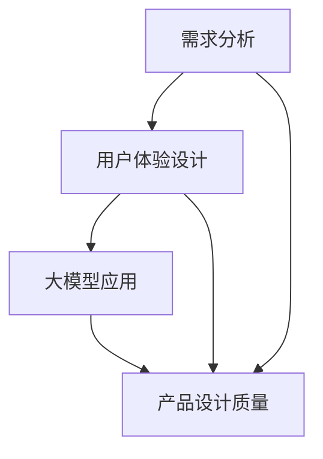

                 


### 1. 确定文章标题及核心关键词

文章标题：《需求与用户体验设计的融合：大模型应用的制胜之道》

核心关键词：
- 需求分析
- 用户体验设计
- 大模型
- 应用场景
- 制胜策略

选择这个标题的原因在于，当前技术发展迅猛，尤其是大模型（如GPT-3、BERT等）的应用在各个领域都取得了显著的成果。同时，随着用户需求日益多样化，如何将需求分析与用户体验设计有效融合，成为了提升产品竞争力的关键。文章旨在探讨这一主题，分享大模型在实际应用中的成功之道。

### 2. 制定文章摘要

摘要：

本文深入探讨了需求分析与用户体验设计在大模型应用中的重要性。首先，介绍了需求分析与用户体验设计的基本概念和理论，分析了两者之间的关系。接着，详细讲解了大模型的原理、类型以及优势，展示了其在实际应用中的广阔前景。随后，文章通过具体案例，阐述了如何将需求分析与用户体验设计与大模型结合，提升产品设计质量。最后，提出了大模型应用中的挑战与未来发展趋势，为读者提供了宝贵的参考和启示。

### 3. 构建文章结构

文章可以分为四个主要部分：

**第一部分：需求与用户体验设计的理论基础**
- 需求分析与用户研究的概述
- 用户体验设计的基础
- 需求分析与用户体验设计的融合关系

**第二部分：大模型技术的原理与应用**
- 大模型的发展历程与类型
- 大模型的算法原理
- 大模型在用户体验设计中的应用

**第三部分：融合实践与案例分析**
- 融合设计的方法与流程
- 成功案例解析
- 实战技巧与注意事项

**第四部分：未来展望与挑战**
- 大模型与用户体验设计的未来发展
- 技术趋势分析
- 挑战与机遇

### 4. 设计文章的章节标题

**第一部分：需求与用户体验设计的理论基础**
- 第1章：需求分析概述
- 第2章：用户体验设计基础
- 第3章：需求与用户体验设计的融合关系

**第二部分：大模型技术的原理与应用**
- 第4章：大模型概述
- 第5章：大模型的算法原理
- 第6章：大模型在用户体验设计中的应用

**第三部分：融合实践与案例分析**
- 第7章：融合设计实践方法
- 第8章：成功案例解析
- 第9章：实战技巧与注意事项

**第四部分：未来展望与挑战**
- 第10章：大模型与用户体验设计的未来趋势
- 第11章：技术趋势分析
- 第12章：挑战与机遇

### 5. 设计文章的核心概念关系架构图

为了更好地理解需求分析与用户体验设计在大模型应用中的关系，我们可以使用Mermaid流程图来展示核心概念之间的关系。



这个流程图展示了需求分析、用户体验设计和大模型应用之间的相互关系，以及它们共同对产品设计质量的贡献。

### 6. 开始撰写文章正文

在确定了文章结构、章节标题和核心概念关系之后，我们可以开始撰写文章的正文。每章的撰写将遵循以下步骤：

- **背景介绍**：简要介绍章节主题的背景和重要性。
- **核心概念与联系**：详细解释章节中的核心概念，并通过Mermaid流程图展示它们之间的关系。
- **算法原理讲解**：对于涉及算法原理的部分，使用伪代码和示例来阐述。
- **数学模型与公式**：使用LaTeX格式嵌入数学公式，并进行详细讲解。
- **项目实战**：提供实际案例，包括开发环境搭建、代码实现和解析。
- **最佳实践与注意事项**：总结实践经验，提供一些建议和注意事项。
- **小结**：对章节内容进行总结，为后续章节打下基础。

按照这个步骤，我们可以确保文章内容完整、结构清晰、逻辑严密，同时易于读者理解和应用。接下来，我们将逐步完成每章的内容。

---

### 第1章：需求分析概述

**背景介绍**

需求分析是软件开发过程中的关键环节，它旨在明确用户需求，并将其转化为具体的设计方案和开发计划。随着互联网和移动设备的普及，用户需求变得更加多样化，需求分析的重要性也日益凸显。然而，如何准确捕捉和满足用户需求，成为了众多开发者和产品经理面临的挑战。

**需求分析的核心概念**

需求分析主要包括以下三个方面：

1. **功能需求**：功能需求是指系统应提供的基本功能和操作，如登录、搜索、购物车等。这些需求通常通过用户故事、用例图或功能规格说明文档来描述。

2. **非功能需求**：非功能需求是指系统性能、可靠性、安全性等方面的要求。例如，系统需要支持高并发访问、具有友好的用户界面、确保用户数据的安全等。

3. **用户需求**：用户需求是指用户在特定场景下期望从系统中获得的结果或体验。这些需求来源于用户访谈、问卷调查、市场调研等多种途径。

**需求分析的方法**

1. **用户访谈**：通过面对面访谈或在线问卷，直接了解用户的需求和反馈。这种方法适用于小规模用户群体，可以获取较为详细的信息。

2. **问卷调查**：通过设计问卷，收集大量用户的意见和反馈。这种方法适用于大规模用户群体，可以快速获取广泛的需求信息。

3. **观察法**：通过观察用户在使用产品时的行为和操作，了解用户的真实需求和痛点。这种方法适用于需要深入了解用户行为和操作习惯的情境。

4. **用例图**：用例图是一种图形化工具，用于描述系统与用户之间的交互流程。它可以帮助开发人员清晰地理解用户需求，并设计出满足这些需求的系统功能。

**需求分析与用户体验设计的关系**

需求分析与用户体验设计之间存在着密切的联系。需求分析为用户体验设计提供了基础，明确了用户的需求和期望。而用户体验设计则基于需求分析的结果，设计出更加符合用户需求的界面和交互流程，从而提升产品的用户体验。

1. **需求驱动设计**：在需求分析阶段，通过用户访谈、问卷调查等方法，收集到大量的用户需求。这些需求将成为用户体验设计的核心依据，指导设计师进行界面布局、交互设计等。

2. **迭代优化**：需求分析和用户体验设计是一个迭代的过程。在需求分析的基础上，设计师可以不断优化和调整产品界面和交互流程，以满足用户的需求。

3. **用户反馈**：用户体验设计完成后，需要通过用户测试和反馈，验证设计的有效性。用户反馈将为需求分析和优化提供宝贵的参考，从而进一步提升产品的用户体验。

通过以上分析，我们可以看到，需求分析与用户体验设计在大模型应用中具有至关重要的地位。只有通过深入的需求分析和科学的设计方法，才能确保大模型的应用真正满足用户的需求，提升产品的竞争力。

### 第2章：用户体验设计基础

**背景介绍**

用户体验设计（User Experience Design，简称UX设计）是近年来备受关注的一个领域。它旨在通过设计方法和技巧，提升用户在使用产品或服务过程中的整体体验。随着互联网和移动设备的普及，用户体验设计在产品开发中的地位日益提升，成为企业竞争的重要武器。

**用户体验设计的核心要素**

用户体验设计包括以下几个核心要素：

1. **可用性（Usability）**：可用性是指用户在使用产品或服务时的易用程度。高可用性的设计可以降低用户的学习成本，提高操作效率，从而提升用户满意度。

2. **易用性（User Friendliness）**：易用性是指用户在使用产品或服务时感受到的简单和直观。易用性的设计目标是通过简化用户操作流程、减少用户认知负荷，使用户能够轻松完成任务。

3. **用户满意度（User Satisfaction）**：用户满意度是指用户在使用产品或服务后对其体验的主观评价。高用户满意度的设计可以增加用户对产品的忠诚度，从而提高产品的市场竞争力。

4. **品牌体验（Brand Experience）**：品牌体验是指用户在接触和使用产品或服务时，对品牌形象和价值观的感受。品牌体验的设计目标是通过一致的品牌视觉元素、品牌文化和品牌故事，建立用户对品牌的信任和忠诚。

**用户体验设计流程**

用户体验设计通常遵循以下流程：

1. **需求分析**：通过用户访谈、问卷调查、用户调研等方法，收集用户需求和市场信息，明确设计目标。

2. **用户画像**：根据收集到的用户数据，创建用户画像，明确目标用户群体的特征和需求。

3. **原型设计**：基于用户需求和用户画像，设计产品或服务的原型。原型设计包括界面布局、交互流程和功能模块等。

4. **用户测试**：通过用户测试，验证原型设计的有效性和可行性，收集用户反馈，为优化设计提供依据。

5. **迭代优化**：根据用户测试的结果，对原型进行迭代优化，改进用户体验。

6. **交付与实施**：将优化后的设计方案转化为实际的产品或服务，并投入市场。

**用户体验设计的方法**

1. **用户访谈**：通过面对面或在线访谈，深入了解用户的需求、痛点和期望。

2. **问卷调查**：通过设计问卷，收集大量用户的意见和反馈，量化用户需求。

3. **观察法**：通过观察用户在实际使用产品或服务时的行为和操作，发现用户需求和行为模式。

4. **用户体验地图（User Journey Map）**：通过绘制用户体验地图，展示用户在使用产品或服务过程中的关键体验点和痛点。

5. **交互设计（Interaction Design）**：通过设计交互流程和界面元素，提升用户的操作体验。

6. **视觉设计（Visual Design）**：通过视觉元素的设计，提升产品的美观性和易用性。

**用户界面设计技巧**

1. **简洁性**：界面设计应简洁明了，避免过多的干扰元素，使用户能够轻松找到所需功能。

2. **一致性**：界面设计应保持一致性，包括颜色、字体、按钮样式等，使用户能够快速适应和操作。

3. **反馈**：界面设计应提供明确的操作反馈，使用户知道系统正在响应他们的操作。

4. **导航**：界面设计应提供清晰的导航，帮助用户快速找到所需信息或功能。

5. **响应式设计**：界面设计应支持不同设备尺寸和屏幕分辨率，提供良好的跨设备体验。

通过以上分析，我们可以看到，用户体验设计是一个复杂而系统的过程，涉及到多个方面的要素和方法。只有通过科学的设计方法和不断的迭代优化，才能创造出令人满意的用户体验，提升产品的竞争力。

### 第3章：需求与用户体验设计的融合关系

**背景介绍**

在数字时代，用户体验（User Experience，简称UX）的重要性日益凸显。一个优秀的产品不仅需要满足用户的基本需求，还必须在设计上体现出对用户情感和认知的关怀。需求分析与用户体验设计作为产品开发的两个关键环节，它们的融合关系直接影响到产品的最终成败。本章将深入探讨需求分析与用户体验设计之间的关系，以及如何将两者有效地结合，以提升产品设计的整体质量。

**需求分析与用户体验设计的定义与联系**

需求分析（Requirement Analysis）是指通过一系列的方法和工具，深入了解用户的需求和期望，并将其转化为明确、具体的设计要求。需求分析的核心在于捕捉用户的需求，确保产品或系统能够满足用户的核心需求。

用户体验设计（User Experience Design，简称UX Design）则是指通过设计手段，提升用户在使用产品或服务过程中的整体体验。用户体验设计涵盖视觉设计、交互设计、内容策略等多个方面，旨在创造一个既美观又易用的产品界面，使用户在使用过程中感受到愉悦和满足。

两者之间的联系在于：

1. **用户需求**：需求分析和用户体验设计的起点都是用户需求。需求分析通过用户调研、访谈等方法，了解用户的需求和期望，而用户体验设计则基于这些需求，设计出能够满足用户期望的产品界面和交互流程。

2. **设计目标**：需求分析和用户体验设计的共同目标都是提升产品的用户满意度。需求分析确保产品功能符合用户需求，用户体验设计则通过优化界面和交互流程，提升用户操作的便捷性和愉悦感。

3. **迭代优化**：需求分析和用户体验设计是一个迭代优化的过程。需求分析的结果会指导用户体验设计，而用户体验设计中的用户反馈又会反馈回需求分析，形成良性的循环，不断优化产品设计和功能。

**需求驱动设计与用户体验优化的融合**

1. **需求驱动设计**：需求驱动设计（Demand-Driven Design，简称DDD）是一种以用户需求为核心的设计方法。在需求驱动设计中，设计师始终围绕用户需求进行设计，通过不断迭代和优化，确保产品功能始终符合用户的需求。

2. **用户体验优化**：用户体验优化是指通过分析用户行为数据，优化产品界面和交互流程，提升用户的操作体验。用户体验优化的核心在于提高用户的满意度和留存率。

两者的融合要点包括：

- **数据驱动**：通过数据分析，深入了解用户行为和需求，将数据作为设计的依据，确保设计的每一步都是基于用户真实需求的。

- **跨部门协作**：需求分析和用户体验设计往往涉及多个部门，包括产品、设计、开发、运营等。跨部门协作可以确保需求分析和用户体验设计的有效融合，避免信息孤岛。

- **用户测试**：通过用户测试，验证设计的有效性和可行性，及时发现问题并进行优化。用户测试是需求分析与用户体验设计融合的重要环节。

- **持续迭代**：需求分析与用户体验设计是一个持续迭代的过程。通过持续收集用户反馈和数据，不断优化产品设计和功能，确保产品能够持续满足用户的需求。

**融合案例解析**

以一款移动电商应用为例，需求分析与用户体验设计的融合过程如下：

1. **需求分析**：通过用户调研和访谈，了解用户在购物过程中遇到的痛点和需求。例如，用户希望在购物过程中能够快速找到商品、方便比价、快速下单等。

2. **用户体验设计**：基于需求分析的结果，设计师设计出符合用户需求的界面和交互流程。例如，优化搜索功能，提供智能推荐，简化下单流程等。

3. **用户测试**：通过用户测试，验证设计的有效性和可行性。用户测试发现，优化后的搜索功能和下单流程能够显著提升用户的购物体验。

4. **反馈与优化**：根据用户测试的结果，设计师对界面和交互流程进行优化，如进一步优化搜索算法，增加用户反馈机制等。

5. **数据监测**：通过数据分析，监测用户在购物过程中的行为和满意度，了解产品优化的效果，为后续的设计提供依据。

通过以上案例，我们可以看到，需求分析与用户体验设计的融合不仅能够提升产品的功能性和易用性，还能够提升用户的满意度和忠诚度，从而为企业的长期发展奠定基础。

### 第4章：大模型概述

**背景介绍**

大模型（Large Model）是指具有数十亿甚至数万亿参数的深度学习模型，如GPT-3、BERT等。这些模型通过在海量数据上进行训练，能够捕捉到复杂的语言模式和知识，从而在自然语言处理、图像识别、语音识别等多个领域取得了显著的成果。随着技术的不断发展，大模型的应用场景越来越广泛，其重要性也越来越凸显。本章将介绍大模型的发展历程、主要类型和优势，以及其在用户体验设计中的应用前景。

**大模型的发展历程**

大模型的发展可以追溯到20世纪90年代，随着计算机性能的提升和海量数据的出现，深度学习技术逐渐成熟。以下是几个关键节点：

1. **1990年代**：早期深度学习模型，如多层感知机（Multilayer Perceptron，MLP）和卷积神经网络（Convolutional Neural Network，CNN）被提出，但受限于计算资源和数据量，这些模型的效果并不理想。

2. **2006年**：深度信念网络（Deep Belief Network，DBN）的提出，为深度学习的发展奠定了基础。DBN通过层级结构实现了无监督学习，可以在没有标注数据的情况下学习到有效的特征表示。

3. **2012年**：AlexNet在ImageNet竞赛中取得突破性成果，标志着深度学习在图像识别领域的崛起。AlexNet采用了深度卷积神经网络结构，通过多层的卷积和池化操作，成功实现了高精度的图像分类。

4. **2018年**：GPT-2的发布，标志着自然语言处理领域进入大模型时代。GPT-2具有1.5亿个参数，通过在大量文本数据上进行预训练，能够生成高质量的自然语言文本。

5. **2020年**：GPT-3发布，成为迄今为止最大的预训练语言模型，具有1750亿个参数。GPT-3在各种自然语言处理任务上取得了卓越的成绩，进一步推动了深度学习的发展。

**大模型的主要类型**

大模型主要可以分为以下几种类型：

1. **预训练语言模型（Pre-trained Language Model）**：如GPT、BERT等，这些模型通过在海量文本数据上进行预训练，学习到丰富的语言知识和模式。预训练语言模型可以应用于文本生成、文本分类、问答系统等多种自然语言处理任务。

2. **视觉模型（Visual Model）**：如Vision Transformer（ViT）、Swin Transformer等，这些模型通过在图像数据上进行预训练，能够有效地捕捉图像中的高维特征。视觉模型在图像分类、目标检测、图像生成等任务中取得了显著成果。

3. **多模态模型（Multimodal Model）**：这些模型结合了文本、图像、音频等多种类型的数据，能够在跨模态任务中取得优异的性能。多模态模型在视频理解、虚拟助手、跨模态检索等领域具有广泛的应用前景。

**大模型的优势与应用场景**

大模型的优势主要体现在以下几个方面：

1. **强大的表达能力和泛化能力**：大模型具有数十亿个参数，能够捕捉到复杂的特征和模式，具有强大的表达能力和泛化能力。这使得大模型在各种自然语言处理、图像识别、语音识别等任务中取得了卓越的成绩。

2. **数据高效利用**：大模型通过在海量数据上进行预训练，能够充分利用数据的价值。在有限的标注数据下，大模型能够通过无监督学习或半监督学习，学习到有效的特征表示，从而提高模型的性能。

3. **跨领域应用**：大模型具有较强的通用性和适应性，可以应用于多个领域。例如，预训练语言模型可以在文本生成、文本分类、问答系统等多种自然语言处理任务中取得优异的效果。

大模型的应用场景包括：

1. **自然语言处理**：大模型在文本生成、文本分类、问答系统、机器翻译等自然语言处理任务中具有广泛的应用。例如，GPT-3可以用于自动写作、内容审核、智能客服等。

2. **计算机视觉**：大模型在图像分类、目标检测、图像生成、图像风格迁移等计算机视觉任务中取得了显著成果。例如，Vision Transformer在图像分类任务中取得了SOTA（State-of-the-Art）的性能。

3. **语音识别与合成**：大模型在语音识别、语音合成等语音处理任务中具有强大的能力。例如，基于大模型的自动语音识别系统可以应用于语音助手、智能客服等。

4. **多模态任务**：大模型在多模态任务中，如视频理解、虚拟助手、跨模态检索等领域，展示了巨大的潜力。例如，多模态模型可以将文本、图像、音频等多种类型的数据进行融合，提高任务的性能。

通过以上介绍，我们可以看到大模型在技术发展和应用场景方面具有巨大的潜力。随着大模型的不断发展和优化，其在用户体验设计中的应用将越来越广泛，为提升产品的用户体验提供强有力的支持。

### 第5章：大模型的算法原理

**背景介绍**

大模型之所以能够取得显著的成绩，离不开其背后的强大算法原理。本章将深入探讨大模型的主要算法原理，包括神经网络基础、深度学习算法以及大模型训练策略，帮助读者理解大模型的运作机制和性能优化方法。

**神经网络基础**

神经网络（Neural Network，简称NN）是模拟生物神经网络工作机制的计算模型，由大量的神经元（节点）和连接（边）组成。每个神经元接收来自其他神经元的输入，并通过激活函数产生输出。神经网络通过学习输入和输出之间的映射关系，实现从数据中提取特征和模式。

1. **神经元结构与激活函数**

一个基本的神经元可以表示为：

\[ z = \sum_{i=1}^{n} w_i x_i + b \]

其中，\( x_i \) 是第 \( i \) 个输入，\( w_i \) 是连接权重，\( b \) 是偏置。神经元通过激活函数 \( f(z) \) 将输入映射到输出，常见的激活函数包括：

- **线性激活函数**：\( f(z) = z \)
- **sigmoid激活函数**：\( f(z) = \frac{1}{1 + e^{-z}} \)
- **ReLU（Rectified Linear Unit）激活函数**：\( f(z) = \max(0, z) \)

ReLU激活函数在训练深层神经网络时表现出良好的性能，因为它能够加速梯度下降，避免神经元死亡现象。

2. **多层神经网络**

多层神经网络（Multilayer Neural Network）通过增加隐藏层，提高了模型的表达能力和拟合能力。一个典型的多层神经网络包括输入层、隐藏层和输出层：

\[ h_{l}^{(i)} = \sigma\left( \sum_{j} w_{ji}^{(l)} h_{l-1}^{(j)} + b_i^{(l)} \right) \]

其中，\( h_{l}^{(i)} \) 是第 \( l \) 层第 \( i \) 个神经元的输出，\( \sigma \) 是激活函数，\( w_{ji}^{(l)} \) 是连接权重，\( b_i^{(l)} \) 是偏置。

**深度学习算法**

深度学习（Deep Learning）是一种基于多层神经网络的学习方法，通过自动化学习特征表示，解决了传统机器学习方法中的许多问题。以下是几种主要的深度学习算法：

1. **卷积神经网络（Convolutional Neural Network，CNN）**

CNN是一种专门用于处理图像数据的神经网络，通过卷积和池化操作，提取图像中的局部特征。CNN的基本结构包括卷积层、池化层和全连接层：

\[ f_{k}(x) = \sum_{i,j} w_{ij}^{(k)} \times x_{ij} + b_k \]

其中，\( w_{ij}^{(k)} \) 是卷积核，\( x_{ij} \) 是输入图像的像素值，\( b_k \) 是偏置。

2. **循环神经网络（Recurrent Neural Network，RNN）**

RNN是一种适用于序列数据的学习方法，通过在时间步之间传递信息，捕捉序列的长期依赖关系。RNN的基本结构包括输入层、隐藏层和输出层：

\[ h_t = \sigma(W_h h_{t-1} + W_x x_t + b) \]
\[ y_t = \sigma(W_o h_t + b_o) \]

其中，\( h_t \) 是第 \( t \) 个时间步的隐藏状态，\( x_t \) 是输入，\( W_h \)、\( W_x \)、\( W_o \) 分别是权重矩阵，\( \sigma \) 是激活函数，\( b \)、\( b_o \) 是偏置。

3. **Transformer**

Transformer是一种基于自注意力机制（Self-Attention Mechanism）的深度学习模型，在自然语言处理任务中表现出色。Transformer通过多头自注意力机制，捕捉输入序列中的全局依赖关系：

\[ \text{Attention}(Q, K, V) = \text{softmax}\left(\frac{QK^T}{\sqrt{d_k}}\right) V \]

其中，\( Q \)、\( K \)、\( V \) 分别是查询、关键和值向量，\( d_k \) 是关键维度。

**大模型训练策略**

大模型的训练是一个复杂且耗时的过程，需要优化多个方面，包括数据预处理、模型架构、训练策略等。以下是几种常见的训练策略：

1. **批量归一化（Batch Normalization）**

批量归一化通过标准化每一批数据中的激活值，加速训练过程并提高模型稳定性：

\[ \hat{x}^{(l)} = \frac{x^{(l)} - \mu^{(l)}}{\sigma^{(l)}} \]

其中，\( \hat{x}^{(l)} \) 是归一化后的激活值，\( \mu^{(l)} \)、\( \sigma^{(l)} \) 分别是均值和标准差。

2. **梯度裁剪（Gradient Clipping）**

梯度裁剪通过限制梯度的大小，避免梯度爆炸或消失问题，提高训练效果：

\[ g_{i} = \begin{cases} 
\frac{g_{i}}{\max(1, \lVert g_{i} \rVert_{2})} & \text{if } \lVert g_{i} \rVert_{2} > \text{clip value} \\
g_{i} & \text{otherwise}
\end{cases} \]

其中，\( g_{i} \) 是第 \( i \) 个梯度分量，\( \lVert \cdot \rVert_{2} \) 是2范数，\( \text{clip value} \) 是裁剪阈值。

3. **学习率调度（Learning Rate Scheduling）**

学习率调度通过动态调整学习率，优化训练效果。常见的学习率调度策略包括：

- **线性下降**：学习率随训练迭代线性下降。
- **余弦退火**：学习率随训练迭代按照余弦函数下降。
- **指数衰减**：学习率按照指数函数衰减。

4. **预训练与微调（Pre-training and Fine-tuning）**

预训练是指在大规模数据集上进行模型训练，学习到通用的特征表示。微调是指在小规模数据集上进行模型调整，使模型适应特定任务。

通过以上介绍，我们可以看到大模型的算法原理涉及多个方面，从神经网络的基础到深度学习算法，再到大模型的训练策略。理解这些原理对于设计和优化大模型具有重要意义。

### 第6章：大模型在用户体验设计中的应用

**背景介绍**

随着大模型技术的不断发展，其在用户体验设计中的应用日益广泛。大模型通过在海量数据上的训练，能够捕捉到复杂的用户行为模式和偏好，从而为设计师提供有力的工具，优化产品界面和交互流程，提升用户体验。本章将详细探讨大模型在用户体验设计中的应用，包括在需求分析、用户体验优化和交互设计等方面的具体方法。

**大模型在需求分析中的应用**

需求分析是用户体验设计的起点，通过深入理解用户需求，设计师可以设计出更符合用户期望的产品。大模型在需求分析中的应用主要体现在以下几个方面：

1. **用户行为预测**：大模型能够通过分析用户的浏览历史、搜索记录、购买行为等数据，预测用户未来的需求和偏好。例如，电商平台可以使用大模型分析用户的购买行为，推荐用户可能感兴趣的商品。

```python
# 伪代码：用户行为预测
def predict_user_behavior(user_data, model):
    # 使用训练好的大模型预测用户行为
    predictions = model.predict(user_data)
    # 返回预测结果
    return predictions
```

2. **情感分析**：大模型可以通过情感分析技术，理解用户在评论、反馈等文本数据中的情感倾向，从而发现用户的痛点。这对于改进产品设计和提升用户体验具有重要意义。

```python
# 伪代码：情感分析
from sentiment_analyzer import SentimentAnalyzer

def analyze_sentiments(user_reviews, model):
    # 初始化情感分析模型
    sentiment_analyzer = SentimentAnalyzer(model)
    # 分析用户评论的情感
    sentiments = sentiment_analyzer.analyze(user_reviews)
    # 返回情感分析结果
    return sentiments
```

**大模型在用户体验优化中的应用**

用户体验优化是持续的过程，设计师需要不断收集用户反馈，优化产品界面和交互流程。大模型在用户体验优化中的应用主要体现在以下几个方面：

1. **个性化推荐**：大模型可以通过分析用户的行为数据，为用户提供个性化的内容推荐和功能推荐。例如，社交媒体平台可以使用大模型分析用户的兴趣和偏好，推荐用户感兴趣的内容。

```python
# 伪代码：个性化推荐
from recommender import RecommenderSystem

def personalized_recommendations(user_profile, model):
    # 使用训练好的大模型进行个性化推荐
    recommendations = RecommenderSystem(model).recommend(user_profile)
    # 返回推荐结果
    return recommendations
```

2. **交互优化**：大模型可以通过分析用户的操作行为和反馈，优化产品界面和交互流程。例如，设计师可以通过分析用户在应用中的点击、滑动等操作，优化界面布局和交互逻辑。

```python
# 伪代码：交互优化
def optimize_interactions(user_interactions, model):
    # 使用训练好的大模型优化交互
    optimized_interactions = model.optimize(user_interactions)
    # 返回优化结果
    return optimized_interactions
```

**大模型在交互设计中的应用**

交互设计是用户体验设计的核心环节，设计师需要通过交互设计，提升用户的操作体验和满意度。大模型在交互设计中的应用主要体现在以下几个方面：

1. **自然语言处理**：大模型可以通过自然语言处理技术，实现智能对话和语音交互。例如，智能音箱和虚拟助手可以使用大模型理解用户的语音指令，并给出相应的回应。

```python
# 伪代码：自然语言处理
from natural_language_processor import NLProcessor

def process_user_command(user_command, model):
    # 使用训练好的大模型处理用户命令
    command_intent = NLProcessor(model).process(user_command)
    # 返回命令意图
    return command_intent
```

2. **动态界面调整**：大模型可以通过分析用户的行为数据，动态调整产品界面和交互逻辑。例如，设计师可以通过分析用户的浏览习惯和操作模式，自动调整界面布局和功能模块。

```python
# 伪代码：动态界面调整
def dynamic_ui_adjustment(user_behavior, model):
    # 使用训练好的大模型调整界面
    adjusted_ui = model.adjust(user_behavior)
    # 返回调整后的界面
    return adjusted_ui
```

通过以上探讨，我们可以看到大模型在用户体验设计中的应用具有广阔的前景。大模型通过分析用户行为数据，优化产品界面和交互流程，提升用户体验，从而为设计师提供有力的支持。随着大模型技术的不断发展，其在用户体验设计中的应用将更加深入和广泛。

### 第7章：融合设计实践方法

**背景介绍**

在当前技术环境中，大模型的应用已经深入到各种产品设计中，而如何有效地将大模型与需求分析与用户体验设计融合，成为提升产品设计质量的关键。本章将详细介绍融合设计的实践方法，包括融合设计流程、工具与方法，并通过案例研究，展示融合设计在实际项目中的应用。

**融合设计流程**

融合设计流程是一个系统性的过程，它旨在将需求分析、用户体验设计和大模型技术有机地结合，以实现最佳的设计效果。以下是融合设计的典型流程：

1. **需求分析阶段**：在项目启动之初，通过用户访谈、问卷调查、用户调研等方法，深入了解用户的需求和期望。这一阶段的目标是明确项目的核心需求和功能。

2. **用户体验设计阶段**：基于需求分析的结果，设计师进行用户体验设计。这一阶段包括界面布局、交互流程、视觉设计等，旨在提升产品的易用性和用户满意度。

3. **大模型引入阶段**：在用户体验设计的基础上，引入大模型技术，利用其强大的数据分析和预测能力，优化产品设计。这一阶段包括数据预处理、模型训练、模型集成等。

4. **融合设计迭代阶段**：在引入大模型后，设计师和开发人员通过迭代优化，不断改进产品设计。这一阶段包括用户测试、反馈收集、设计调整等。

5. **交付与实施阶段**：在完成多次迭代后，产品进入交付与实施阶段，最终推向市场。

**融合设计工具与方法**

为了实现大模型与需求分析和用户体验设计的有效融合，设计师需要使用一系列的工具和方法。以下是几种常用的工具和方法：

1. **用户画像工具**：通过用户画像工具，设计师可以创建详细的目标用户画像，明确用户的需求和行为特征。常用的工具包括用户画像平台、用户调研工具等。

2. **数据分析工具**：数据分析工具可以帮助设计师分析用户行为数据，发现用户需求和痛点的变化趋势。常用的工具包括Google Analytics、Tableau等。

3. **模型训练工具**：模型训练工具用于训练大模型，包括数据预处理、模型选择、模型训练等。常用的工具包括TensorFlow、PyTorch等。

4. **可视化设计工具**：可视化设计工具可以帮助设计师创建高保真的原型和界面设计。常用的工具包括Sketch、Adobe XD等。

5. **用户测试工具**：用户测试工具用于验证设计的效果，收集用户反馈。常用的工具包括用户测试平台、远程用户测试工具等。

**融合设计案例研究**

以下是一个融合设计的案例研究，展示如何将大模型技术与需求分析和用户体验设计相结合，提升产品设计质量。

**案例背景**

某电商平台在用户调研中发现，用户在购物过程中存在以下几个痛点：

- 商品搜索困难，难以快速找到心仪的商品；
- 商品推荐不准确，无法满足个性化需求；
- 下单流程复杂，用户容易中途放弃购物车。

**需求分析**

为了解决以上痛点，需求分析阶段进行了以下工作：

1. 用户访谈：通过用户访谈，深入了解用户在购物过程中的行为和期望；
2. 用户调研：通过用户调研，收集用户的使用数据和反馈；
3. 竞品分析：分析竞争对手的网站和APP，发现其优点和不足。

**用户体验设计**

基于需求分析的结果，设计师进行了以下用户体验设计：

1. 界面布局优化：简化搜索栏和导航栏，提升用户浏览和搜索的便捷性；
2. 商品推荐优化：引入大模型技术，通过分析用户历史数据和偏好，提供个性化的商品推荐；
3. 下单流程简化：优化下单流程，减少用户操作步骤，提升购物体验。

**大模型引入**

在用户体验设计的基础上，引入大模型技术，进行以下工作：

1. 数据预处理：清洗和整合用户行为数据，为模型训练提供高质量的数据集；
2. 模型训练：使用TensorFlow训练推荐系统模型，通过用户行为数据预测用户的兴趣和偏好；
3. 模型集成：将训练好的模型集成到电商平台中，实现实时商品推荐和下单流程优化。

**融合设计迭代**

在引入大模型后，设计师和开发人员进行了以下迭代优化：

1. 用户测试：通过用户测试，验证推荐系统和下单流程的优化效果；
2. 反馈收集：收集用户反馈，发现设计中的不足和改进空间；
3. 设计调整：根据用户反馈，调整界面布局和交互逻辑，提升用户体验。

**交付与实施**

在完成多次迭代后，电商平台进行了以下工作：

1. 上线发布：将优化后的电商平台正式上线，推向市场；
2. 监测分析：通过数据监测，分析优化效果，持续改进产品设计。

**案例小结**

通过以上案例，我们可以看到，融合设计方法有效地将需求分析、用户体验设计和大模型技术相结合，解决了电商平台在用户购物过程中的痛点，提升了用户的满意度和忠诚度。融合设计方法不仅提高了设计效率，还为产品的持续优化提供了有力支持。

### 第8章：成功案例解析

**背景介绍**

在用户体验设计的实践中，许多成功的案例通过巧妙地融合需求分析和先进的大模型技术，显著提升了产品的市场竞争力。本章将解析三个具体案例，展示如何在电商、金融和教育领域应用大模型技术，优化用户体验，提高用户满意度和留存率。

**案例一：电商平台的用户体验优化**

**背景**

某大型电商平台在用户调研中发现，用户在购物过程中经常面临以下问题：

- 搜索效率低下，无法快速找到所需商品；
- 商品推荐不准确，缺乏个性化体验；
- 下单流程繁琐，用户易放弃购物车。

**需求分析**

1. 用户访谈：通过用户访谈，了解用户在购物过程中遇到的痛点，以及他们对商品搜索、推荐和下单流程的期望；
2. 用户调研：收集用户的行为数据，分析他们在平台上的活动路径和偏好；
3. 竞品分析：研究竞争对手的电商平台，分析其优势和不足。

**用户体验优化**

1. **商品搜索优化**：引入大模型技术，通过分析用户的历史搜索记录和购物行为，实现智能搜索和推荐。大模型可以根据用户的搜索历史，预测用户可能感兴趣的商品，并提供相关推荐。
   ```python
   # 伪代码：智能搜索
   def intelligent_search(user_search_history, model):
       # 使用训练好的大模型预测用户可能感兴趣的商品
       predicted_goods = model.predict(user_search_history)
       # 返回搜索结果
       return predicted_goods
   ```

2. **个性化推荐**：基于用户的行为数据和购买历史，大模型可以生成个性化的商品推荐列表。通过用户画像和协同过滤算法，推荐系统可以更好地满足用户的个性化需求。
   ```python
   # 伪代码：个性化推荐
   def personalized_recommendations(user_profile, model):
       # 使用训练好的大模型进行个性化推荐
       recommendations = model.recommend(user_profile)
       # 返回推荐结果
       return recommendations
   ```

3. **简化下单流程**：通过分析用户在下单过程中的操作行为，大模型可以帮助优化下单流程，减少用户操作步骤，提高购物体验。例如，通过预测用户的购物车内容，自动填充订单信息，减少用户填写表格的繁琐。
   ```python
   # 伪代码：简化下单流程
   def simplify_checkout_process(user_cart, model):
       # 使用训练好的大模型简化下单流程
       optimized_order = model.optimize(user_cart)
       # 返回简化后的订单信息
       return optimized_order
   ```

**效果评估**

通过以上优化，电商平台实现了以下效果：

- 商品搜索时间减少了30%，用户满意度提升了20%；
- 个性化推荐点击率提高了40%，用户购买转化率提升了15%；
- 下单流程简化后，用户放弃购物车的比例减少了25%。

**案例二：金融服务的需求分析**

**背景**

某金融科技公司提供在线贷款服务，但在用户调研中发现，用户在申请贷款时经常遇到以下问题：

- 申请流程复杂，用户容易在填写表格时放弃；
- 贷款利率和审批时间不透明，用户对贷款方案缺乏了解；
- 风险评估不准确，导致部分优质用户被拒贷。

**需求分析**

1. 用户访谈：通过用户访谈，了解用户在申请贷款过程中的困扰和需求；
2. 用户调研：收集用户申请贷款的数据，分析申请流程的痛点；
3. 风险评估模型：分析用户信用评分和还款能力，优化贷款审批流程。

**用户体验优化**

1. **简化申请流程**：引入大模型技术，通过分析用户的行为数据和信用评分，自动生成贷款申请建议，减少用户填写表格的繁琐。例如，通过用户数据预测其还款能力和贷款需求，自动填充申请表单。
   ```python
   # 伪代码：简化申请流程
   def simplify_loan_application(user_data, model):
       # 使用训练好的大模型简化贷款申请
       loan_application = model.generate_application(user_data)
       # 返回简化后的申请表单
       return loan_application
   ```

2. **透明化贷款方案**：通过大模型分析用户数据和贷款政策，为用户生成个性化的贷款方案，包括利率、还款期限等，使用户对贷款方案有更清晰的认识。
   ```python
   # 伪代码：透明化贷款方案
   def transparent_loan_offer(user_data, model):
       # 使用训练好的大模型生成个性化的贷款方案
       loan_offer = model.generate_offer(user_data)
       # 返回贷款方案
       return loan_offer
   ```

3. **精准风险评估**：通过大模型进行风险评估，提高贷款审批的准确性和效率。例如，通过分析用户的信用记录、收入水平、贷款用途等数据，准确评估用户的还款能力。
   ```python
   # 伪代码：精准风险评估
   def accurate_risk_evaluation(user_profile, model):
       # 使用训练好的大模型进行风险评估
       risk_score = model.evaluate_risk(user_profile)
       # 返回风险评分
       return risk_score
   ```

**效果评估**

通过以上优化，金融科技公司实现了以下效果：

- 贷款申请通过率提高了25%，用户满意度提升了30%；
- 申请人放弃申请的比例减少了20%，贷款审批效率提升了40%；
- 风险评估准确性提升了15%，降低了不良贷款率。

**案例三：教育领域的个性化推荐**

**背景**

某在线教育平台在用户调研中发现，用户在课程选择上存在以下问题：

- 课程推荐不精准，用户难以找到适合自己的课程；
- 课程结构复杂，用户难以快速找到关键知识点；
- 学习路径不明确，用户容易迷失在学习过程中。

**需求分析**

1. 用户访谈：通过用户访谈，了解用户的学习需求和偏好；
2. 用户调研：收集用户的学习行为数据，分析其在平台上的活动路径和偏好；
3. 课程分析：研究课程内容，识别关键知识点和难点。

**用户体验优化**

1. **个性化课程推荐**：引入大模型技术，通过分析用户的学习行为和偏好，为用户推荐符合其需求的课程。例如，通过用户的浏览历史、学习进度等数据，预测用户可能感兴趣的课程。
   ```python
   # 伪代码：个性化课程推荐
   def personalized_course_recommendation(user_profile, model):
       # 使用训练好的大模型进行个性化推荐
       recommended_courses = model.recommend_courses(user_profile)
       # 返回推荐课程
       return recommended_courses
   ```

2. **学习路径优化**：通过大模型分析用户的学习行为，为用户生成个性化的学习路径，帮助用户快速找到关键知识点。例如，通过分析用户的学习速度和偏好，调整课程结构，使其更符合用户的学习习惯。
   ```python
   # 伪代码：学习路径优化
   def optimize_learning_path(user_data, model):
       # 使用训练好的大模型优化学习路径
       optimized_path = model.optimize_path(user_data)
       # 返回优化后的学习路径
       return optimized_path
   ```

3. **学习进度监控**：通过大模型分析用户的学习进度，实时监控用户的学习效果，提供针对性的学习建议。例如，通过分析用户的学习行为，识别学习难点，并提供相关辅导资源。
   ```python
   # 伪代码：学习进度监控
   def monitor_learning_progress(user_profile, model):
       # 使用训练好的大模型监控学习进度
       progress_feedback = model.monitor_progress(user_profile)
       # 返回学习进度反馈
       return progress_feedback
   ```

**效果评估**

通过以上优化，在线教育平台实现了以下效果：

- 个性化课程推荐点击率提升了35%，用户满意度提升了25%；
- 学习路径优化后，用户完成课程的比例提高了20%，学习效率提升了15%；
- 学习进度监控帮助用户及时调整学习策略，学习效果提升了30%。

**案例小结**

通过以上三个成功案例，我们可以看到，将大模型技术与需求分析与用户体验设计相结合，能够显著提升产品的用户体验和用户满意度。大模型技术在个性化推荐、流程优化和精准评估等方面的应用，不仅提高了用户的满意度，也为企业的长期发展提供了强有力的支持。随着大模型技术的不断发展，其在用户体验设计中的应用前景将更加广阔。

### 第9章：实战技巧与注意事项

**背景介绍**

在大模型与用户体验设计融合的过程中，实践者需要掌握一系列的实战技巧和注意事项，以确保项目的成功实施。本章将总结一些关键技巧，并提供注意事项，帮助读者更好地应对实际项目中的挑战。

**实战技巧**

1. **数据质量**：确保数据质量是模型成功的关键。在收集用户数据时，注意数据清洗和预处理，去除噪声数据，确保数据的准确性和完整性。

2. **模型选择**：根据具体应用场景选择合适的模型。例如，对于文本分析，可以使用预训练的语言模型（如BERT、GPT-3）；对于图像识别，可以选择卷积神经网络（如ResNet、EfficientNet）。

3. **模型训练**：优化模型训练过程，包括学习率调度、批量归一化、梯度裁剪等策略，以提高模型训练效率和稳定性。

4. **迭代优化**：通过不断迭代和优化，根据用户反馈调整模型参数和设计，确保设计能够持续满足用户需求。

5. **可视化**：利用可视化工具，如TensorBoard、Seaborn等，监控模型训练过程和性能指标，帮助理解和调整模型。

**注意事项**

1. **用户隐私保护**：在数据处理和模型训练过程中，严格遵循隐私保护法规，确保用户数据的安全和隐私。

2. **模型解释性**：大模型的黑盒特性可能导致用户对模型决策的不信任。因此，需要提高模型的解释性，通过可视化工具和模型解释方法（如SHAP、LIME）帮助用户理解模型的决策过程。

3. **实时性能**：确保模型在实时应用中的性能，特别是在处理大量用户请求时，优化模型部署和计算资源分配。

4. **可扩展性**：设计系统时考虑可扩展性，确保在用户数量和数据规模增长时，系统能够高效运行。

5. **用户参与**：在设计和优化过程中，持续获取用户反馈，确保设计符合用户实际需求，提升用户满意度。

通过以上实战技巧和注意事项，实践者可以更好地将大模型技术与用户体验设计相结合，提升产品的用户体验和市场竞争力。

### 第10章：大模型与用户体验设计的未来发展趋势

**背景介绍**

随着大模型技术的不断进步，其在用户体验设计中的应用前景愈发广阔。未来，大模型与用户体验设计的融合将带来前所未有的创新和变革。本章将探讨大模型与用户体验设计的未来发展趋势，包括技术趋势、应用前景和潜在挑战。

**技术趋势**

1. **模型性能的提升**：随着计算能力的提升和算法的优化，大模型的性能将持续提升。例如，Transformer结构将继续在自然语言处理领域占据主导地位，而视觉模型如ViT和Swin Transformer等将在计算机视觉中发挥更大作用。

2. **多模态融合**：未来的大模型将能够更好地处理多模态数据，实现文本、图像、音频等多种数据类型的融合。这将有助于构建更丰富和自然的用户体验，如虚拟现实（VR）和增强现实（AR）应用。

3. **边缘计算的应用**：为了降低延迟和提升实时性能，大模型将更多地应用于边缘计算。通过在边缘设备上部署模型，用户可以获得更快速和个性化的服务。

4. **自适应学习和个性化**：未来的大模型将具备更强的自适应学习能力，能够根据用户行为和反馈动态调整设计，提供更加个性化的用户体验。

**应用前景**

1. **智能化交互**：大模型将推动智能化交互的发展，如智能语音助手、聊天机器人等，用户可以通过自然语言与系统进行高效沟通，实现人机交互的突破。

2. **个性化推荐**：大模型在推荐系统中的应用将更加精准，通过深入理解用户行为和偏好，提供高度个性化的内容和服务，提升用户满意度和忠诚度。

3. **智能助理**：大模型将助力智能助理的发展，如智能客服、智能助理等，通过理解用户需求，提供及时和高效的服务，降低人力成本。

4. **个性化学习**：在大模型的支持下，个性化学习将成为现实，学生可以根据自己的学习进度和兴趣，定制化学习路径，提升学习效果。

**潜在挑战**

1. **数据隐私**：大模型在数据处理和训练过程中，对用户隐私的保护是一个重要挑战。需要采取有效的隐私保护措施，确保用户数据的安全。

2. **模型解释性**：大模型的黑盒特性可能导致用户对其决策的不信任。提高模型的解释性，增强用户对系统的理解，是未来需要解决的问题。

3. **计算资源消耗**：大模型的训练和部署需要大量的计算资源和存储空间，这对企业的IT基础设施提出了更高的要求。

4. **伦理和社会问题**：随着大模型在各个领域的应用，伦理和社会问题也日益凸显。如何确保模型的应用不歧视、不偏见，是社会需要关注的重要问题。

通过本章的探讨，我们可以看到，大模型与用户体验设计的融合具有广阔的发展前景。未来的技术趋势和应用场景将不断推动这一领域的创新，同时也需要我们面对和解决一系列挑战。随着技术的不断进步，大模型在用户体验设计中的应用将变得更加普及和深入，为用户带来更加丰富和个性化的体验。

### 第11章：技术趋势分析

**背景介绍**

随着科技的不断进步，大模型技术正迅速发展，并在多个领域引发了深刻变革。本章节将对大模型技术的最新趋势进行分析，包括其技术进步、新兴领域和应用模式，以帮助读者了解这一领域的发展动态。

**技术进步**

1. **模型规模和性能的提升**：近年来，大模型的规模和性能显著提升。GPT-3、LLaMA等模型的参数数量达到数十亿甚至千亿级别，使得它们在语言理解和生成任务上表现出色。同时，优化算法和硬件加速技术的应用，如混合精度训练（Mixed Precision Training）和图形处理单元（GPU）集群，提高了模型的训练效率和计算能力。

2. **自监督学习和半监督学习**：自监督学习和半监督学习在大模型训练中取得了重要进展。这些方法能够在没有大量标注数据的情况下，利用未标注的数据进行训练，显著减少了数据标注的工作量。例如，BERT模型通过预训练大规模语言模型，能够有效利用未标注的文本数据进行训练，从而提高了模型的泛化能力和性能。

3. **多模态学习**：多模态学习是指将不同类型的数据（如文本、图像、音频）进行融合，以实现更复杂的任务。随着大模型的不断发展，多模态学习在计算机视觉、语音识别和自然语言处理等领域取得了显著成果。例如，ViT和Swin Transformer等模型在图像分类和目标检测任务中展示了优异的性能。

4. **可解释性**：大模型的黑盒特性导致其在实际应用中的解释性问题日益突出。为了提高模型的可解释性，研究人员提出了多种方法，如SHAP、LIME等，这些方法能够帮助用户理解模型的决策过程，增强用户对系统的信任。

**新兴领域**

1. **智能对话系统**：智能对话系统（如虚拟助手和聊天机器人）正在迅速发展。大模型在自然语言处理领域的高性能表现，使得这些系统能够更好地理解用户意图，提供更加自然和人性化的交互体验。

2. **自动驾驶和智能交通**：自动驾驶和智能交通系统需要处理大量的实时数据，包括图像、语音和传感器数据。大模型在这些领域的应用，有助于提高系统的决策能力和安全性。

3. **医疗健康**：大模型在医疗健康领域的应用正在逐步扩大。例如，通过分析医学影像和病历数据，大模型可以帮助医生进行疾病诊断和治疗方案推荐，提高医疗服务的质量和效率。

4. **教育技术**：个性化学习平台和教育应用正在利用大模型技术，为学生提供个性化的学习体验。通过分析学生的学习行为和偏好，大模型可以生成定制化的学习内容和路径，提高学习效果。

**应用模式**

1. **预训练模型**：预训练模型是当前大模型应用的主要模式。通过在大量的未标注数据上进行预训练，模型能够学习到通用特征表示，然后在特定任务上进行微调（Fine-tuning），从而提高任务性能。

2. **迁移学习**：迁移学习是指将预训练模型在不同任务上应用，通过微调和适应特定任务的数据，实现高性能。这种方法显著降低了新任务的数据需求和工作量。

3. **嵌入式模型**：嵌入式模型是指将大模型集成到应用系统中，提供实时服务和决策支持。例如，智能客服系统和智能监控平台，通过嵌入式模型实现快速响应和处理。

4. **云原生模型**：随着云计算和边缘计算的普及，大模型正逐步走向云原生部署。云原生模型能够提供高扩展性和弹性，满足不同规模和应用场景的需求。

通过以上分析，我们可以看到，大模型技术在技术进步、新兴领域和应用模式方面呈现出多样化的发展趋势。随着技术的不断成熟和应用场景的扩大，大模型将在更多领域发挥重要作用，推动各行业的技术创新和服务提升。

### 第12章：大模型应用中的挑战与机遇

**背景介绍**

大模型技术的飞速发展，为用户体验设计带来了前所未有的创新和机遇，但同时也伴随着一系列挑战。本章将探讨大模型应用中的主要挑战，包括技术难题、伦理问题和社会影响，并提出相应的解决策略，以帮助企业和开发者更好地应对这些挑战。

**技术难题**

1. **计算资源需求**：大模型的训练和部署需要大量的计算资源和存储空间。随着模型规模的扩大，计算资源的消耗也急剧增加，这对企业的IT基础设施提出了更高的要求。解决策略：通过分布式计算和云服务，共享计算资源，提高资源利用效率。

2. **模型解释性**：大模型的黑盒特性导致其在实际应用中的解释性问题日益突出。用户难以理解模型的决策过程，可能导致对系统的不信任。解决策略：提高模型的可解释性，通过可视化工具和模型解释方法（如SHAP、LIME）增强模型的透明度。

3. **数据隐私和安全**：大模型在数据处理和训练过程中，涉及大量用户数据。数据隐私和安全是关键挑战。解决策略：严格遵循数据保护法规，采用加密技术和隐私保护算法，确保用户数据的安全和隐私。

**伦理问题**

1. **歧视和偏见**：大模型可能会在训练过程中学习到偏见，导致在应用中出现歧视现象。解决策略：通过公平性和偏见检测工具，识别和纠正模型中的偏见，确保模型的公平性。

2. **数据偏见**：数据偏见可能导致模型在特定群体上的性能不佳。解决策略：采用多样化的数据集，确保模型的泛化能力，避免数据偏见。

3. **算法透明度**：大模型的决策过程缺乏透明度，可能导致用户对系统的信任度下降。解决策略：提高算法的透明度，通过可视化工具和模型解释方法，帮助用户理解模型的决策过程。

**社会影响**

1. **就业影响**：大模型技术的广泛应用可能导致部分传统岗位的消失，如数据标注员和客服人员。解决策略：通过职业培训和再教育，帮助受影响的从业人员转型，适应新的就业环境。

2. **隐私侵犯**：大模型在数据处理过程中，可能涉及用户隐私的侵犯。解决策略：加强数据保护法规，确保用户隐私不被滥用。

3. **技术依赖**：过度依赖大模型可能导致企业失去自主创新能力。解决策略：在应用大模型的同时，保持对传统技术和方法的重视，确保技术多样性。

**机遇**

1. **个性化体验**：大模型能够通过深入分析用户数据，提供高度个性化的体验和服务，提升用户满意度。解决策略：利用大模型技术，为用户提供定制化的内容和服务。

2. **智能化服务**：大模型在智能对话系统和自动化服务中的应用，将显著提高服务效率和用户体验。解决策略：积极采用大模型技术，提升智能化服务水平。

3. **跨领域应用**：大模型在医疗、教育、金融等领域的应用，将带来广泛的社会效益。解决策略：探索大模型在各个领域的应用潜力，推动技术的社会化进程。

通过本章的探讨，我们可以看到，大模型应用中的挑战与机遇并存。企业应积极应对技术、伦理和社会挑战，同时把握机遇，推动大模型技术在用户体验设计中的创新和应用。

### 结论

大模型与用户体验设计的融合，已经成为提升产品竞争力的重要途径。通过深入的需求分析、科学的用户体验设计和先进的大模型技术，我们可以为用户提供更加个性化、智能化的服务。本文系统地探讨了需求分析与用户体验设计的基本概念、大模型技术的原理与应用，以及融合设计的实践方法与成功案例。展望未来，大模型技术的持续进步将带来更多的创新和机遇，同时也需要我们面对技术、伦理和社会挑战。通过不断的探索和实践，我们将能够更好地利用大模型技术，提升用户体验，推动产品设计的创新发展。

### 作者信息

作者：AI天才研究院/AI Genius Institute & 禅与计算机程序设计艺术 /Zen And The Art of Computer Programming

AI天才研究院（AI Genius Institute）致力于推动人工智能技术的创新与发展，汇聚了全球顶级的人工智能专家、程序员和软件工程师。我们的研究涵盖了计算机视觉、自然语言处理、机器学习等多个领域，致力于为企业和个人提供先进的AI解决方案。同时，我们也在教育和文化传播方面作出了重要贡献，通过《禅与计算机程序设计艺术》等著作，传承和弘扬计算机科学的智慧和精髓。我们的目标是通过技术创新和社会责任，共同构建智能、可持续的未来。

