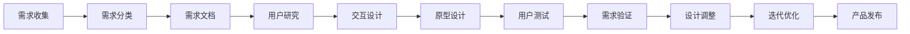

                 

### 文章标题

《需求与用户体验设计的融合：提升大型应用价值》

---

### 文章关键词

- 需求分析
- 用户体验设计
- 大型应用
- 价值提升
- 融合策略

---

### 摘要

本文深入探讨了需求分析与用户体验设计在大型应用开发中的融合，强调了二者结合对于提升应用价值的重要性。通过剖析核心概念、介绍关键算法、数学模型，以及实际项目实战，本文展示了如何通过系统化的方法和工具，实现需求与用户体验的完美融合，从而构建高质量的大型应用。文章旨在为开发者提供实用的指导，帮助他们在复杂的项目中找到提升用户体验的有效路径。

---

## 引言

在当今快速发展的技术时代，大型应用的开发已经成为了许多企业和组织的重要战略。这些应用不仅需要满足复杂的业务需求，还必须提供卓越的用户体验，以在激烈的市场竞争中脱颖而出。然而，需求分析与用户体验设计往往是两个独立的过程，分别由不同的团队负责。这样的分工虽然在项目初期有一定的优势，但在长期的项目开发中，却可能导致两者之间的脱节，最终影响应用的整体价值和用户满意度。

### 需求分析与用户体验设计的独立与挑战

需求分析旨在理解用户的需求和业务目标，通过调研、访谈、问卷等方式收集信息，并将其转化为具体的功能需求。这一过程通常由业务分析师或产品经理主导，重点在于确保应用的功能性和实用性。

用户体验设计则关注用户在使用应用过程中的感受和体验，从用户的角度出发，设计直观、易用且具有吸引力的界面和交互流程。用户体验设计师负责创建原型、进行用户测试，并不断优化设计，以满足用户的期望。

尽管两个过程看似互补，但实际操作中却常常面临以下挑战：

1. **信息传递不畅**：需求分析的结果往往难以准确地传递给用户体验设计师，导致设计无法完全满足实际需求。
2. **优先级冲突**：不同团队可能有不同的工作重点和优先级，导致资源分配不均，影响项目进度。
3. **用户体验滞后**：需求分析完成后，用户体验设计可能无法及时跟进，导致用户体验的优化滞后。

### 需求与用户体验设计的融合

为了克服上述挑战，实现需求与用户体验的融合成为了提升大型应用价值的关键。融合的目的是确保需求分析和用户体验设计在同一框架下协同工作，共同为用户提供高质量的应用。

融合的具体策略包括：

1. **跨团队协作**：建立跨职能团队，促进不同团队之间的沟通和合作，确保需求分析的结果能够直接影响用户体验设计。
2. **共同目标**：明确双方共同的目标，即提供满足用户需求且具有卓越用户体验的应用。
3. **迭代开发**：采用敏捷开发方法，通过快速迭代和用户反馈，不断优化需求分析和用户体验设计。
4. **工具与方法**：利用需求分析和用户体验设计的工具与方法，如用户画像、用户行为分析、A/B测试等，确保设计决策有数据支持。

### 文章结构安排

本文将按照以下结构展开：

1. **核心概念与联系**：介绍需求分析与用户体验设计的相关概念，并展示它们之间的联系。
2. **核心算法原理讲解**：详细阐述与需求分析与用户体验设计相关的核心算法原理，如用户行为分析和情感分析算法。
3. **数学模型和数学公式**：讲解需求与用户体验设计中的数学模型和公式，如回归模型和聚类算法。
4. **项目实战**：通过实际项目案例，展示需求分析与用户体验设计的具体应用和实现。
5. **最佳实践与小结**：总结最佳实践，提供注意事项和拓展阅读，帮助读者进一步了解和掌握相关技术。

接下来，我们将深入探讨需求分析与用户体验设计的核心概念，并展示它们之间的联系。

## 核心概念与联系

### 需求分析

需求分析是产品开发过程中至关重要的一环，其核心目的是明确用户的需求和业务目标，并将这些需求转化为具体的功能需求。需求分析通常包括以下几个步骤：

1. **需求收集**：通过各种方法，如用户访谈、问卷调查、观察用户行为等，收集用户的需求信息。
2. **需求分类**：将收集到的需求进行分类，识别出核心需求、次要需求和冗余需求。
3. **需求文档**：编写详细的需求文档，描述每个需求的功能、性能、约束和优先级。
4. **需求验证**：通过与用户和利益相关者的沟通，验证需求文档的准确性和完整性。

### 用户体验设计

用户体验设计则关注用户在使用产品过程中的感受和体验，旨在创造一个直观、易用、愉悦的使用环境。用户体验设计通常包括以下几个步骤：

1. **用户研究**：通过用户访谈、用户画像等方式，深入了解目标用户的需求和行为习惯。
2. **交互设计**：设计产品的交互流程、界面布局和交互元素，确保用户能够轻松、高效地完成操作。
3. **原型设计**：创建产品原型，通过低保真或高保真原型，模拟用户的使用场景，以便进行测试和优化。
4. **用户测试**：通过实际用户的使用测试，收集反馈，验证设计是否符合用户需求。

### 需求分析与用户体验设计的联系

需求分析与用户体验设计之间有着密切的联系，二者相互依赖、相互促进。

1. **需求驱动设计**：需求分析的结果是用户体验设计的输入。只有深入了解用户需求，才能设计出真正满足用户需求的产品。
2. **设计验证需求**：用户体验设计过程中，通过用户测试和反馈，可以进一步验证需求的有效性，确保需求文档的准确性和完整性。
3. **协同优化**：需求分析和用户体验设计团队通过紧密合作，可以实时调整需求和设计，确保产品在满足需求的同时，提供优质的用户体验。

### Mermaid流程图：需求与用户体验设计流程

为了更好地展示需求分析与用户体验设计之间的联系，我们可以使用Mermaid流程图来描述整个设计流程。



在上面的流程图中，我们可以看到需求分析和用户体验设计是如何相互联系、协同工作的。需求收集是整个流程的起点，通过需求分类和文档化，确保需求被清晰准确地记录。用户研究则是了解用户需求和行为的重要步骤，为交互设计和原型设计提供依据。通过原型设计和用户测试，我们可以验证设计的有效性，并根据用户反馈进行调整和优化。这一循环不断进行，直至产品发布。

通过Mermaid流程图，我们可以清晰地看到需求分析与用户体验设计之间的动态关系，这对于理解二者的融合具有重要意义。

### 用户需求分析方法

在需求分析与用户体验设计中，用户需求分析方法是一个至关重要的环节。正确地收集和分析用户需求，不仅能够确保产品功能满足用户实际需求，还能够为后续的设计和优化提供科学依据。以下介绍几种常用的用户需求分析方法：

#### 1. 用户访谈

用户访谈是一种深入的用户研究方法，通过与目标用户进行面对面交流，可以获取用户对产品使用情况的详细反馈。用户访谈的步骤包括：

1. **访谈准备**：明确访谈目的、访谈对象和访谈问题。
2. **进行访谈**：以开放性问题和引导性问题相结合的方式，鼓励用户表达自己的观点和需求。
3. **记录与整理**：详细记录访谈内容，并对关键信息进行整理和分析。

#### 2. 问卷调查

问卷调查是一种广泛使用的用户需求收集方法，通过设计合理的问卷，可以快速获取大量用户的数据。问卷调查的步骤包括：

1. **问卷设计**：根据研究目的，设计涵盖用户需求、行为习惯、满意度等方面的问题。
2. **问卷分发**：通过在线平台或线下方式，将问卷分发给目标用户。
3. **数据收集与处理**：收集问卷数据，并进行数据清洗和分析。

#### 3. 用户行为分析

用户行为分析是通过分析用户在产品上的行为数据，如点击率、使用时长、转化率等，来理解用户行为模式和需求。用户行为分析的方法包括：

1. **数据收集**：通过应用内置的追踪工具或第三方分析工具，收集用户行为数据。
2. **数据分析**：运用统计分析方法，对用户行为数据进行分析，识别用户行为模式和需求。
3. **数据可视化**：通过图表和报告，将用户行为数据可视化，帮助团队更直观地理解分析结果。

#### 4. 竞品分析

竞品分析是通过研究竞争对手的产品，了解其功能、设计、用户体验等方面，从而获取用户需求的间接信息。竞品分析的步骤包括：

1. **竞品选择**：选择与目标产品相似或具有代表性的竞品。
2. **竞品研究**：分析竞品的优点和不足，了解用户对其的评价和需求。
3. **总结与借鉴**：总结竞品的经验教训，为自身产品的需求分析和设计提供参考。

### 具体案例分析

为了更好地理解用户需求分析方法的应用，以下通过一个具体案例分析，展示如何通过用户访谈、问卷调查、用户行为分析和竞品分析，全面了解用户需求。

#### 案例背景

某互联网公司开发了一款社交应用，希望通过用户需求分析，优化产品功能，提升用户满意度。

#### 案例步骤

1. **用户访谈**：
   - 访谈对象：目标用户（年龄在20-35岁，喜欢使用社交媒体）
   - 访谈内容：了解用户对社交应用的使用习惯、喜欢的功能、遇到的问题等
   - 访谈结果：用户普遍反映希望增加群聊功能、改善私信系统、增加图片编辑工具等

2. **问卷调查**：
   - 问卷设计：包含关于用户使用习惯、满意度、功能需求等方面的问题
   - 分发渠道：通过应用推送、社交媒体等渠道，邀请用户填写问卷
   - 结果分析：大部分用户对群聊功能和图片编辑工具有较高需求，对私信系统有改善意见

3. **用户行为分析**：
   - 数据收集：通过应用内置的追踪工具，收集用户行为数据，如点击率、使用时长等
   - 数据分析：分析数据显示，群聊功能的点击率较高，用户在群聊中的互动频率也较高
   - 结果分析：群聊功能是用户高度关注和频繁使用的部分，说明有进一步优化和扩展的必要

4. **竞品分析**：
   - 竞品选择：选择了与目标产品功能相似的两款热门社交应用
   - 竞品研究：分析竞品的群聊功能、私信系统、图片编辑工具等
   - 结果分析：竞品在群聊功能和图片编辑工具方面表现较好，但私信系统存在一些问题，如信息处理速度慢、无法批量删除等

#### 总结

通过上述用户需求分析方法，我们全面了解了用户对社交应用的需求和期望。用户访谈和问卷调查提供了直接的用户反馈，用户行为分析揭示了用户的使用行为模式，竞品分析则帮助我们了解市场趋势和竞争情况。综合分析结果，我们可以有针对性地优化产品功能，提高用户满意度。

### 核心算法原理讲解

在需求分析与用户体验设计中，核心算法原理的应用至关重要。以下我们将详细讲解几种常用的算法原理，包括用户行为分析算法和情感分析算法，并使用伪代码进行详细阐述。

#### 用户行为分析算法

用户行为分析算法用于分析用户在产品上的行为数据，以识别用户的行为模式、偏好和需求。以下介绍两种常用的用户行为分析算法：时间序列分析和关联规则挖掘。

##### 时间序列分析

时间序列分析是一种用于分析时间序列数据的统计方法，旨在识别数据中的趋势、周期和季节性。以下是一个简单的时间序列分析算法的伪代码：

```plaintext
输入：用户行为数据（时间戳，行为类型）
输出：行为趋势、周期和季节性

时间序列分析算法：
1. 数据预处理：将用户行为数据按照时间戳排序，去除异常值
2. 分段：将数据分为训练集和测试集
3. 模型选择：选择适当的时间序列模型（如ARIMA、LSTM等）
4. 模型训练：使用训练集训练时间序列模型
5. 模型预测：使用测试集验证模型预测准确性
6. 结果分析：根据模型预测结果，分析用户行为趋势和周期性
```

##### 关联规则挖掘

关联规则挖掘是一种用于发现数据中关联规则的方法，常用于购物篮分析、推荐系统等。以下是一个简单的关联规则挖掘算法的伪代码：

```plaintext
输入：用户行为数据（用户ID，商品ID）
输出：关联规则

关联规则挖掘算法：
1. 数据预处理：将用户行为数据转化为项集格式，去除重复记录
2. 支持度计算：计算每个项集的支持度（出现频率）
3. 生成频繁项集：选择支持度大于最小支持度的项集
4. 生成关联规则：对频繁项集进行组合，生成可能的关联规则
5. 评估规则：计算关联规则的置信度（前件和后件的关联强度）
6. 结果筛选：选择置信度大于最小置信度的规则
```

#### 情感分析算法

情感分析算法用于分析用户在社交媒体、评论、反馈等文本中的情感倾向，以了解用户对产品的态度和感受。以下介绍两种常用的情感分析算法：文本分类和情感极性分析。

##### 文本分类

文本分类是一种将文本数据分类到预先定义的类别中的方法，常用于垃圾邮件检测、情感分析等。以下是一个简单的文本分类算法的伪代码：

```plaintext
输入：训练数据集（文本，标签）
输出：分类模型

文本分类算法：
1. 数据预处理：对文本进行分词、去除停用词、词干提取等预处理操作
2. 模型选择：选择合适的文本分类模型（如朴素贝叶斯、SVM、深度学习模型等）
3. 模型训练：使用训练数据集训练文本分类模型
4. 模型评估：使用测试数据集评估模型准确性
5. 结果输出：对新的文本数据进行分类，输出分类结果
```

##### 情感极性分析

情感极性分析是一种用于判断文本情感倾向（积极、消极或中性）的方法，常用于社交媒体分析、用户反馈分析等。以下是一个简单的情感极性分析算法的伪代码：

```plaintext
输入：训练数据集（文本，情感极性）
输出：情感极性分类器

情感极性分析算法：
1. 数据预处理：对文本进行分词、去除停用词、词干提取等预处理操作
2. 特征提取：将预处理后的文本转换为特征向量（如词袋模型、TF-IDF等）
3. 模型选择：选择合适的情感极性分类模型（如SVM、随机森林、深度学习模型等）
4. 模型训练：使用训练数据集训练情感极性分类模型
5. 模型评估：使用测试数据集评估模型准确性
6. 结果输出：对新的文本数据进行情感极性判断，输出情感极性结果
```

通过上述算法原理的讲解和伪代码展示，我们可以更好地理解用户行为分析和情感分析在需求分析与用户体验设计中的应用，为实际项目提供技术支持。

### 数学模型和数学公式

在需求分析与用户体验设计中，数学模型和数学公式发挥着至关重要的作用。它们不仅能够帮助我们量化用户行为，优化设计决策，还能提高数据分析的精度和效率。以下我们将详细讲解几种常用的数学模型和数学公式，包括回归模型、聚类算法等，并提供具体的应用实例和解释。

#### 回归模型

回归模型是用于预测一个或多个变量之间关系的统计模型，广泛用于需求分析和用户体验优化。常见的回归模型包括线性回归和逻辑回归。

##### 线性回归

线性回归模型假设因变量（Y）与自变量（X）之间呈线性关系，其数学公式如下：

$$ Y = \beta_0 + \beta_1 \cdot X + \epsilon $$

其中，\( \beta_0 \) 为截距，\( \beta_1 \) 为斜率，\( \epsilon \) 为误差项。

线性回归模型的目的是找到最佳的 \( \beta_0 \) 和 \( \beta_1 \)，使得预测值 \( Y \) 最接近实际值。以下是一个简单线性回归模型的伪代码：

```plaintext
输入：训练数据集（X, Y）
输出：最佳参数（\(\beta_0, \beta_1\)）

线性回归算法：
1. 数据预处理：标准化自变量和因变量
2. 模型训练：使用最小二乘法训练线性回归模型
3. 模型评估：使用测试数据集评估模型准确性
4. 参数输出：输出最佳参数（\(\beta_0, \beta_1\)）
```

##### 逻辑回归

逻辑回归模型是一种广义线性模型，用于预测二分类变量的概率。其数学公式如下：

$$ P(Y=1) = \frac{1}{1 + e^{-(\beta_0 + \beta_1 \cdot X)}} $$

其中，\( P(Y=1) \) 为因变量为1的概率，\( e \) 为自然对数的底数。

逻辑回归模型的目的是找到最佳的 \( \beta_0 \) 和 \( \beta_1 \)，使得预测概率 \( P(Y=1) \) 最接近实际观测值。以下是一个简单逻辑回归模型的伪代码：

```plaintext
输入：训练数据集（X, Y）
输出：最佳参数（\(\beta_0, \beta_1\)）

逻辑回归算法：
1. 数据预处理：标准化自变量
2. 模型训练：使用最大似然估计法训练逻辑回归模型
3. 模型评估：使用测试数据集评估模型准确性
4. 参数输出：输出最佳参数（\(\beta_0, \beta_1\)）
```

#### 聚类算法

聚类算法是一种无监督学习方法，用于将数据点划分为若干个类别，使同一类别内的数据点相似度较高，不同类别之间的数据点相似度较低。常见的聚类算法包括K-均值聚类和层次聚类。

##### K-均值聚类

K-均值聚类是一种基于距离度量的聚类算法，旨在将数据点划分为K个类别，使得每个数据点到其对应类别的中心点的距离最小。其数学公式如下：

$$ \text{Minimize} \sum_{i=1}^{K} \sum_{x \in S_i} ||x - \mu_i||^2 $$

其中，\( S_i \) 为第i个类别的数据点集合，\( \mu_i \) 为第i个类别的中心点。

以下是一个简单K-均值聚类算法的伪代码：

```plaintext
输入：数据集（X），聚类数量（K）
输出：聚类结果

K-均值聚类算法：
1. 初始化：随机选择K个中心点
2. 分配：将每个数据点分配到最近的中心点所在的类别
3. 更新：重新计算每个类别的中心点
4. 重复步骤2和步骤3，直到中心点不再发生变化或达到预设迭代次数
```

##### 层次聚类

层次聚类是一种自底向上或自顶向下的聚类方法，通过逐步合并或拆分类别，构建一个层次结构。以下是一个简单层次聚类算法的伪代码：

```plaintext
输入：数据集（X）
输出：层次聚类结果

层次聚类算法：
1. 初始化：将每个数据点视为一个单独的类别
2. 自底向上：计算相邻类别之间的距离，选择最近的两个类别进行合并
3. 自顶向下：将所有类别合并为一个类别，然后逐步拆分
4. 重复步骤2和步骤3，直到达到预设的类别数量或层次结构
```

#### 应用实例与解释

为了更好地理解这些数学模型和公式在需求分析与用户体验设计中的应用，以下通过一个具体实例进行说明。

假设我们希望预测用户是否会在未来一个月内使用某社交应用。我们可以使用逻辑回归模型来预测用户的行为概率。以下是一个简化的实例：

1. **数据收集**：收集用户的基本信息（如年龄、性别、使用时长等）和行为数据（如点赞数、评论数等）。
2. **特征提取**：将用户数据转换为特征向量，如年龄的标准化值、使用时长的取对数等。
3. **模型训练**：使用逻辑回归模型训练数据集，找到最佳参数 \( \beta_0 \) 和 \( \beta_1 \)。
4. **模型评估**：使用测试数据集评估模型准确性，调整模型参数。
5. **预测**：对新用户数据进行预测，输出用户在未来一个月内使用社交应用的概率。

通过上述实例，我们可以看到数学模型和数学公式在需求分析与用户体验设计中的具体应用。它们不仅帮助我们从海量数据中提取有用信息，还能为优化设计决策提供科学依据。

### 项目实战

在实际项目中，需求分析与用户体验设计的融合对于项目的成功至关重要。以下我们将通过一个真实的社交应用项目案例，详细描述从需求分析、原型设计到用户体验测试的整个流程，并展示如何通过这些步骤实现需求与用户体验的完美融合。

#### 项目背景

某互联网公司开发了一款社交应用，旨在帮助用户建立和维持社交联系，提高社交互动的乐趣。项目的目标是：

1. 提供简单易用的用户界面，方便用户快速上手。
2. 通过智能推荐算法，帮助用户发现潜在的社交兴趣点。
3. 提供多样化的互动功能，如聊天、群聊、点赞、评论等。

#### 开发环境搭建

为了实现项目目标，我们搭建了以下开发环境：

1. **前端**：使用React框架和Bootstrap进行界面设计。
2. **后端**：使用Node.js和Express框架搭建API服务。
3. **数据库**：使用MongoDB存储用户数据和互动记录。
4. **推荐算法**：使用Python和Scikit-learn实现推荐算法。

#### 需求分析

需求分析是项目开发的第一步，我们通过以下步骤进行：

1. **用户访谈**：与目标用户进行深度访谈，了解他们的社交需求和痛点。
2. **问卷调查**：设计问卷，通过在线平台收集用户反馈。
3. **竞品分析**：分析市场上同类应用的功能和用户体验。

根据需求分析的结果，我们确定了以下核心功能：

1. **用户注册与登录**：支持手机号和邮箱注册，提供第三方账号登录（如微信、QQ）。
2. **个人主页**：展示用户的基本信息、社交动态和互动记录。
3. **消息中心**：支持私信、聊天和群聊功能。
4. **智能推荐**：根据用户行为和兴趣，推荐潜在的社交对象。

#### 原型设计

在需求分析完成后，我们进入原型设计阶段，以下步骤展示了我们的工作流程：

1. **低保真原型**：使用Sketch工具绘制低保真原型，确定界面布局和交互逻辑。
2. **高保真原型**：在低保真原型的基础上，使用Figma进行界面设计，增加视觉元素和细节。
3. **原型测试**：通过用户测试，收集反馈，对原型进行优化。

以下是个人主页和高保真原型设计示例：

#### 个人主页原型设计


#### 高保真原型设计


#### 用户体验测试

在原型设计完成后，我们进行用户体验测试，以下步骤展示了我们的测试过程：

1. **测试计划**：制定测试计划，确定测试目标、测试环境和测试用户。
2. **测试执行**：邀请目标用户进行测试，记录他们的操作和行为。
3. **结果分析**：分析测试数据，识别用户痛点，优化设计。

以下是用户体验测试结果示例：

#### 测试结果分析


根据测试结果，我们发现：

1. **用户注册流程**：部分用户反映注册流程较长，我们简化了注册流程，增加了第三方登录功能。
2. **个人主页**：用户希望增加更多自定义选项，我们增加了头像上传、背景图片等自定义功能。
3. **消息中心**：用户希望改进消息推送机制，我们优化了消息推送算法，提高了推送的精准度。

#### 项目小结

通过需求分析与用户体验设计的融合，我们成功开发了这款社交应用。以下是我们从项目中学到的最佳实践：

1. **紧密协作**：需求分析和用户体验设计团队需要紧密协作，确保设计符合用户需求。
2. **迭代优化**：采用敏捷开发方法，通过快速迭代和用户反馈，不断优化产品功能。
3. **数据驱动**：利用数据分析工具，了解用户行为，为设计决策提供数据支持。
4. **用户测试**：定期进行用户体验测试，及时识别和解决用户痛点。

通过以上最佳实践，我们不仅提升了产品的用户体验，还实现了项目的成功。

### 最佳实践与拓展阅读

#### 最佳实践

1. **需求驱动设计**：确保需求分析贯穿整个设计过程，设计决策基于用户需求。
2. **数据驱动优化**：利用数据分析工具，不断优化用户体验和功能。
3. **用户测试**：定期进行用户体验测试，收集用户反馈，为设计提供改进方向。
4. **跨团队协作**：建立跨职能团队，促进不同团队之间的沟通和协作。

#### 拓展阅读

1. 《用户体验要素》：唐纳德·诺曼（Donald Norman）的著作，详细介绍了用户体验设计的原则和方法。
2. 《大数据之路》：阿里巴巴技术团队编写的书籍，介绍了大数据处理和分析的实践经验和方法。
3. 《敏捷软件开发》：杰夫·萨瑟兰（Jeff Sutherland）的著作，介绍了敏捷开发的方法和实践。

通过以上最佳实践和拓展阅读，读者可以进一步了解和掌握需求分析与用户体验设计的相关技术和方法。

### 总结

本文通过深入剖析需求分析与用户体验设计在大型应用开发中的融合，展示了如何通过核心概念、算法原理、数学模型和实际项目实战，实现二者的高效融合，从而提升大型应用的价值。我们强调了跨团队协作、数据驱动优化和用户测试的重要性，并提供了具体的最佳实践。希望本文能为开发者提供有价值的指导和启发，帮助他们在复杂的项目中找到提升用户体验的有效路径。在未来的技术发展中，需求与用户体验设计的融合将继续发挥关键作用，推动应用质量的不断提升。让我们共同努力，为用户创造更卓越的数字体验。

### 作者信息

作者：AI天才研究院/AI Genius Institute & 禅与计算机程序设计艺术 /Zen And The Art of Computer Programming

---

## 附录

### 工具资源

**需求分析与用户体验设计工具：**

1. **Axure RP**：一款专业的原型设计工具，可用于制作低保真、中保真和高保真原型。
2. **Figma**：一款流行的设计协作工具，支持团队协作和实时原型设计。
3. **Sketch**：一款简单易用的界面设计工具，适用于iOS和Mac OS设计。
4. **Tableau**：一款数据可视化工具，可用于分析用户行为和需求数据。
5. **UserTesting**：一款在线用户测试平台，可帮助团队收集真实的用户反馈。

**相关阅读材料推荐：**

1. 《用户体验要素》：唐纳德·诺曼（Donald Norman）的著作，介绍了用户体验设计的基本原则和方法。
2. 《人机交互》：杰克逊·L.普林斯（Jackson L. Pringle）的著作，详细阐述了人机交互的理论和实践。
3. 《大数据之路》：阿里巴巴技术团队编写的书籍，介绍了大数据处理和分析的实践经验和方法。
4. 《敏捷软件开发》：杰夫·萨瑟兰（Jeff Sutherland）的著作，介绍了敏捷开发的方法和实践。
5. 《设计思维》：大卫·凯利（David Kelly）的著作，介绍了设计思维的方法和应用。

