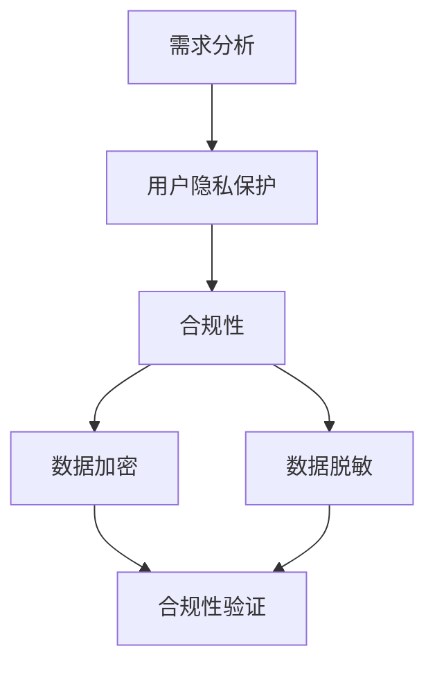

                 

### 文章标题

《需求与用户隐私保护的平衡：合规性考量》### 文章关键词

需求分析、用户隐私保护、合规性、数据加密、数据脱敏、算法设计、项目实践### 文章摘要

本文深入探讨了在数字化时代，如何平衡用户需求与隐私保护之间的关系，特别是针对合规性的考量。文章首先介绍了需求分析与用户隐私保护的基本概念，然后详细分析了国际与国内隐私保护法规，接着探讨了用户隐私保护的技术手段，如数据加密和数据脱敏。通过实际项目案例，本文展示了如何在合规性要求下平衡需求与隐私保护，并提出了未来发展的趋势和挑战。文章旨在为从事IT行业的专业人员和开发者提供实用的指导和建议。### 第一步：确定核心概念与联系

在数字化时代，需求与用户隐私保护的平衡是信息技术领域一个至关重要的课题。要深入探讨这一问题，我们需要首先明确以下几个核心概念及其相互之间的联系：

#### 核心概念

1. **需求**：这是用户对产品或服务功能、性能和体验的具体要求。需求可以是功能性的，如对特定功能的实现；也可以是非功能性的，如对系统响应时间的期望。
2. **用户隐私保护**：这是指保护用户个人信息不被未经授权的第三方收集、使用或泄露。隐私保护是信息安全的一个重要组成部分。
3. **合规性**：这是指在法律、法规和行业标准的要求下，确保产品或服务的合法性和安全性。在信息技术领域，合规性通常涉及到数据保护法规、行业规范以及内部政策。

#### 核心联系

- **需求与隐私保护的平衡**：在满足用户需求的同时，需要确保用户的隐私不受侵犯。这两者之间有时存在冲突，如为了满足某些功能需求，可能需要收集和处理用户的敏感信息。
- **合规性与隐私保护**：合规性要求是隐私保护的重要保障。通过遵循法律法规和行业标准，可以确保隐私保护措施的有效性。
- **技术手段与合规性**：数据加密、数据脱敏等技术手段是实现隐私保护的关键。这些技术的合规性直接影响隐私保护措施的有效性。

为了更好地理解这些概念和它们之间的联系，我们可以使用Mermaid流程图来展示：



### 第二步：设计章节结构

根据上述核心概念与联系，我们可以设计以下章节结构：

#### 引言

- **1.1 引言**：介绍需求与用户隐私保护的概念及其重要性。
- **1.2 本书的目标和结构**：概述本书的写作目的、内容安排和读者对象。

#### 需求分析

- **2.1 需求的定义与类型**：
  - **2.1.1 用户体验需求**：讨论用户体验需求的概念和重要性。
  - **2.1.2 功能性需求**：分析功能性需求的类型和内容。
  - **2.1.3 非功能性需求**：探讨非功能性需求的特点和影响因素。

- **2.2 需求调研方法**：
  - **2.2.1 定性调研**：介绍定性调研的方法和技术。
  - **2.2.2 定量调研**：分析定量调研的优势和适用场景。
  - **2.2.3 调研实践案例**：通过实际案例展示需求调研的过程和成果。

#### 用户隐私保护法规

- **3.1 国际与国内隐私保护法规概述**：
  - **3.1.1 国际隐私保护法规**：介绍GDPR、CCPA等国际隐私保护法规。
  - **3.1.2 国内隐私保护法规**：分析中国《网络安全法》和《个人信息保护法》等法规。

- **3.2 各类隐私保护法规的具体内容与应用**：
  - **3.2.1 GDPR**：详细解释GDPR的主要内容和应用场景。
  - **3.2.2 CCPA**：分析CCPA的核心条款和实施要求。

#### 用户隐私保护技术

- **4.1 数据加密技术**：
  - **4.1.1 加密算法**：介绍常见的加密算法，如AES、RSA。
  - **4.1.2 加密技术的应用**：探讨加密技术在隐私保护中的应用。

- **4.2 数据脱敏技术**：
  - **4.2.1 脱敏方法**：讨论数据脱敏的不同方法，如伪名化、遮挡、伪随机化。
  - **4.2.2 脱敏技术的应用**：展示数据脱敏技术在现实世界中的应用案例。

- **4.3 用户隐私保护算法**：
  - **4.3.1 算法概述**：介绍隐私保护算法的基本概念和分类。
  - **4.3.2 算法应用**：分析隐私保护算法在不同场景下的应用效果。

#### 需求与隐私保护的平衡

- **5.1 两者之间的冲突与协调**：
  - **5.1.1 冲突分析**：探讨需求与隐私保护之间的潜在冲突。
  - **5.1.2 协调策略**：提出平衡需求与隐私保护的策略和措施。

- **5.2 合规性考量与实施策略**：
  - **5.2.1 合规性考量**：分析合规性对需求与隐私保护的影响。
  - **5.2.2 实施策略**：提供实施合规性要求的实用策略。

#### 项目实践

- **6.1 真实案例分享**：
  - **6.1.1 案例一**：分析一个企业如何平衡需求与隐私保护。
  - **6.1.2 案例二**：探讨一个电商平台如何实施隐私保护。

- **6.2 实际项目中的隐私保护需求分析与解决方案**：
  - **6.2.1 项目背景**：介绍项目的背景和目标。
  - **6.2.2 需求分析**：详细分析项目中的隐私保护需求。
  - **6.2.3 解决方案**：展示实施隐私保护的具体解决方案。

#### 未来展望

- **7.1 需求与用户隐私保护的发展趋势**：
  - **7.1.1 技术发展**：探讨隐私保护技术的未来发展方向。
  - **7.1.2 法规变化**：分析隐私保护法规的发展趋势。

- **7.2 技术创新与合规性挑战**：
  - **7.2.1 技术创新**：探讨隐私保护技术的创新。
  - **7.2.2 合规性挑战**：分析合规性面临的新挑战。

### 第三步：细化章节内容

#### 引言

- **1.1 引言**：介绍需求与用户隐私保护的基本概念，阐述它们在数字化时代的重要性。
- **1.2 本书的目标和结构**：概述本书的内容安排，包括各个章节的主要内容和逻辑关系。

#### 需求分析

- **2.1 需求的定义与类型**：
  - **2.1.1 用户体验需求**：讨论用户体验需求的概念、类型和重要性，提供实际案例分析。
  - **2.1.2 功能性需求**：分析功能性需求的定义、分类和影响因素，结合实际项目进行讨论。
  - **2.1.3 非功能性需求**：介绍非功能性需求的特点、类型和影响因素，通过实例阐述其重要性。

- **2.2 需求调研方法**：
  - **2.2.1 定性调研**：介绍定性调研的方法、技巧和工具，通过案例分析展示其应用。
  - **2.2.2 定量调研**：分析定量调研的适用场景、方法和技术，结合实际项目说明其优势。
  - **2.2.3 调研实践案例**：通过具体案例展示需求调研的过程和成果，讨论其在实际应用中的效果。

#### 用户隐私保护法规

- **3.1 国际与国内隐私保护法规概述**：
  - **3.1.1 国际隐私保护法规**：介绍GDPR、CCPA等国际隐私保护法规的背景、主要内容和应用范围。
  - **3.1.2 国内隐私保护法规**：分析中国《网络安全法》和《个人信息保护法》的立法背景、主要内容及其对企业和开发者的要求。

- **3.2 各类隐私保护法规的具体内容与应用**：
  - **3.2.1 GDPR**：详细解释GDPR的条款、要求和实施步骤，结合实际案例说明其在欧洲的应用。
  - **3.2.2 CCPA**：分析CCPA的核心条款、合规要求和实施过程，结合实际案例讨论其在加州的应用。

#### 用户隐私保护技术

- **4.1 数据加密技术**：
  - **4.1.1 加密算法**：介绍常见的加密算法，如AES、RSA的工作原理、优势和适用场景。
  - **4.1.2 加密技术的应用**：探讨加密技术在数据传输、存储和安全审计等场景下的应用，提供实际案例。

- **4.2 数据脱敏技术**：
  - **4.2.1 脱敏方法**：讨论数据脱敏的不同方法，如伪名化、遮挡、伪随机化，比较其优缺点和适用场景。
  - **4.2.2 脱敏技术的应用**：通过具体案例展示数据脱敏技术在数据分析、测试和安全审计等场景下的应用。

- **4.3 用户隐私保护算法**：
  - **4.3.1 算法概述**：介绍隐私保护算法的基本概念、分类和常见算法。
  - **4.3.2 算法应用**：分析隐私保护算法在不同场景下的应用，如联邦学习、差分隐私等。

#### 需求与隐私保护的平衡

- **5.1 两者之间的冲突与协调**：
  - **5.1.1 冲突分析**：探讨需求与隐私保护之间的潜在冲突，如数据收集的必要性与隐私保护要求的矛盾。
  - **5.1.2 协调策略**：提出平衡需求与隐私保护的策略，如最小化数据处理、隐私设计原则等。

- **5.2 合规性考量与实施策略**：
  - **5.2.1 合规性考量**：分析合规性对需求与隐私保护的影响，如法律风险、合规成本等。
  - **5.2.2 实施策略**：提供实施合规性要求的实用策略，如合规框架、合规流程等。

#### 项目实践

- **6.1 真实案例分享**：
  - **6.1.1 案例一**：分析一个企业在满足用户需求的同时如何实施有效的隐私保护措施。
  - **6.1.2 案例二**：探讨一个电商平台如何通过技术手段和合规策略实现隐私保护。

- **6.2 实际项目中的隐私保护需求分析与解决方案**：
  - **6.2.1 项目背景**：介绍项目的背景和目标，如一个新推出的社交媒体平台。
  - **6.2.2 需求分析**：详细分析项目中的隐私保护需求，包括用户数据的收集、存储和使用等。
  - **6.2.3 解决方案**：展示项目团队如何通过技术手段和合规策略实现隐私保护，包括数据加密、数据脱敏和隐私算法的应用。

#### 未来展望

- **7.1 需求与用户隐私保护的发展趋势**：
  - **7.1.1 技术发展**：探讨隐私保护技术的未来发展方向，如区块链、人工智能等新技术。
  - **7.1.2 法规变化**：分析隐私保护法规的发展趋势，如全球范围内的法规协调和更新。

- **7.2 技术创新与合规性挑战**：
  - **7.2.1 技术创新**：讨论隐私保护技术的创新，如联邦学习、差分隐私等新算法。
  - **7.2.2 合规性挑战**：分析合规性面临的新挑战，如跨区域数据传输、新兴技术的合规性要求等。

### 文章完整结构

以下是文章的完整结构，按照目录大纲组织内容，确保每个章节都包含详细的解释和实际案例：

```markdown
# 需求与用户隐私保护的平衡：合规性考量

## 引言
- 引言1：需求与隐私保护的基本概念
- 引言2：本书的目标和结构

## 需求分析
- 2.1 需求的定义与类型
  - 2.1.1 用户体验需求
  - 2.1.2 功能性需求
  - 2.1.3 非功能性需求
- 2.2 需求调研方法
  - 2.2.1 定性调研
  - 2.2.2 定量调研
  - 2.2.3 调研实践案例

## 用户隐私保护法规
- 3.1 国际与国内隐私保护法规概述
  - 3.1.1 国际隐私保护法规
  - 3.1.2 国内隐私保护法规
- 3.2 各类隐私保护法规的具体内容与应用
  - 3.2.1 GDPR
  - 3.2.2 CCPA

## 用户隐私保护技术
- 4.1 数据加密技术
  - 4.1.1 加密算法
  - 4.1.2 加密技术的应用
- 4.2 数据脱敏技术
  - 4.2.1 脱敏方法
  - 4.2.2 脱敏技术的应用
- 4.3 用户隐私保护算法
  - 4.3.1 算法概述
  - 4.3.2 算法应用

## 需求与隐私保护的平衡
- 5.1 两者之间的冲突与协调
  - 5.1.1 冲突分析
  - 5.1.2 协调策略
- 5.2 合规性考量与实施策略
  - 5.2.1 合规性考量
  - 5.2.2 实施策略

## 项目实践
- 6.1 真实案例分享
  - 6.1.1 案例一
  - 6.1.2 案例二
- 6.2 实际项目中的隐私保护需求分析与解决方案
  - 6.2.1 项目背景
  - 6.2.2 需求分析
  - 6.2.3 解决方案

## 未来展望
- 7.1 需求与用户隐私保护的发展趋势
  - 7.1.1 技术发展
  - 7.1.2 法规变化
- 7.2 技术创新与合规性挑战
  - 7.2.1 技术创新
  - 7.2.2 合规性挑战
```

### 最后，以下是文章的完整概要：

**《需求与用户隐私保护的平衡：合规性考量》**

**引言：** 随着数字化时代的到来，用户需求与隐私保护成为信息技术领域的关键议题。本文旨在探讨如何在满足用户需求的同时，确保用户隐私得到有效保护，并提供合规性考量。

**需求分析：** 详细介绍需求分析的定义、类型和方法，包括用户体验需求、功能性需求和非功能性需求。讨论定性调研和定量调研的方法，并分享实际案例。

**用户隐私保护法规：** 分析国际和国内隐私保护法规，如GDPR和CCPA，并探讨其实际应用和影响。

**用户隐私保护技术：** 介绍数据加密技术、数据脱敏技术和用户隐私保护算法，包括其工作原理和应用场景。

**需求与隐私保护的平衡：** 探讨需求与隐私保护之间的冲突和协调策略，以及如何确保合规性。

**项目实践：** 通过真实案例分享和实际项目分析，展示如何在项目中平衡需求与隐私保护，并提供解决方案。

**未来展望：** 分析需求与用户隐私保护的发展趋势，探讨技术创新和合规性挑战，为未来发展方向提供指导。

### 文章结束

**作者：AI天才研究院/AI Genius Institute & 禅与计算机程序设计艺术 /Zen And The Art of Computer Programming**

在本文中，我们系统地阐述了需求与用户隐私保护的平衡问题，包括需求分析、法规考量、技术手段、实践案例和未来展望。通过深入分析和详细讲解，我们希望为从事IT行业的专业人员和开发者提供实用的指导和建议。随着数字化时代的不断推进，隐私保护将成为技术发展的核心议题，我们期待与广大读者共同探索这一领域的更多可能性。作者：AI天才研究院/AI Genius Institute & 禅与计算机程序设计艺术 /Zen And The Art of Computer Programming。希望本文能为您的职业发展和技术创新带来启示。如果您有任何疑问或建议，欢迎随时交流讨论。让我们共同推动技术进步，守护用户隐私。祝您在技术探索的道路上一切顺利！

