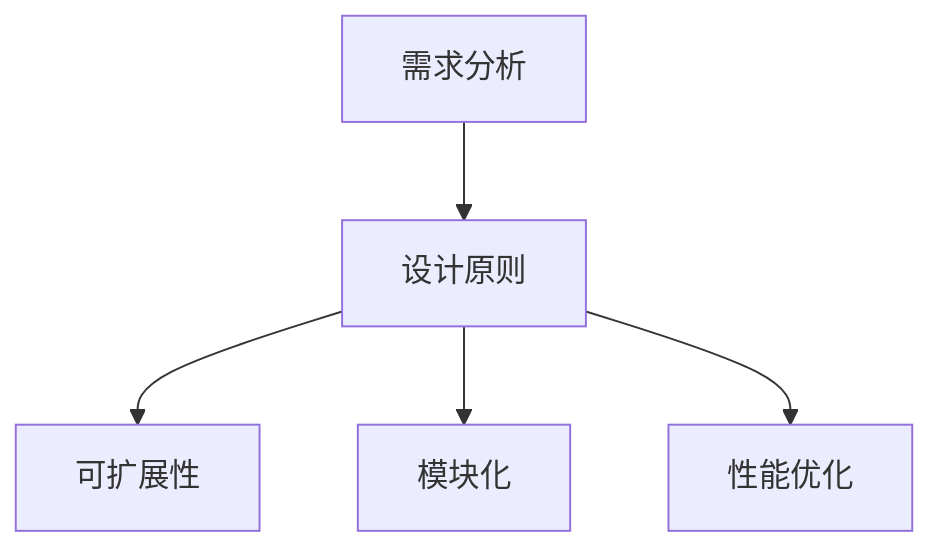
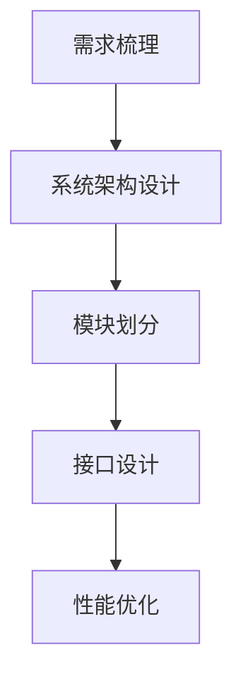

                 

### 文章标题

《需求与设计的迭代：提高大型应用开发的适应性》

### 关键词

- 迭代思维
- 大型应用开发
- 需求管理
- 设计迭代
- 沟通与协作
- 实战案例分析

### 摘要

本文将深入探讨迭代思维在大型应用开发中的应用，分析需求与设计之间的关系，并详细阐述需求与设计的迭代过程。通过实战案例，本文旨在提供一系列提高大型应用开发适应性的策略和技巧，帮助开发者更好地应对开发中的挑战。

---

## 第一部分：迭代思维与大型应用开发

### 第1章：迭代思维概述

#### 1.1 迭代思维的概念与重要性

迭代思维是一种持续改进和优化的开发方式。其核心是通过多次迭代，逐步完善产品，使最终产品更符合用户需求。在大型应用开发中，迭代思维具有以下重要意义：

1. **快速响应变化**：需求变化是不可避免的，迭代思维使得开发者能够快速适应需求变更，避免因需求滞后而导致的项目失败。
2. **提高产品质量**：通过多次迭代，开发者可以逐步修复缺陷、优化性能，从而提高产品的整体质量。
3. **增强团队协作**：迭代思维强调持续沟通与协作，有助于团队形成良好的合作氛围，提高开发效率。

#### 1.2 迭代思维与传统开发模式的对比

传统开发模式（如瀑布模型）往往一次性完成所有需求的分析和设计，然后进行编码和测试。这种模式存在以下问题：

1. **需求滞后**：在需求完全确定之前，无法开始开发，容易导致项目延迟。
2. **缺乏灵活性**：一旦需求确定，难以进行更改，无法适应市场变化。
3. **质量难以保证**：一次性完成的开发方式，往往在后期发现大量问题，导致返工和项目延期。

相比之下，迭代思维更加灵活和高效：

1. **逐步开发**：每次迭代完成一部分功能，逐步完善产品。
2. **持续反馈**：每次迭代后，及时收集用户反馈，进行改进。
3. **质量保证**：通过多次迭代，逐步修复缺陷，提高产品质量。

#### 1.3 迭代思维在大型应用开发中的应用

在大型应用开发中，迭代思维的应用主要体现在以下几个方面：

1. **需求管理**：通过迭代方式，逐步收集和分析需求，确保需求的准确性和完整性。
2. **设计迭代**：在每次迭代中，对设计进行评估和优化，确保设计符合实际需求。
3. **开发与测试**：每次迭代完成后，进行编码和测试，确保功能的正确实现和性能的稳定。

通过迭代思维，大型应用开发可以更加灵活、高效地应对需求变化，提高产品质量，实现项目的成功。

---

## 第二部分：需求与设计的迭代过程

### 第2章：需求与设计的关系

#### 2.1 需求分析的核心要点

需求分析是软件开发过程中的关键环节，其核心要点包括：

1. **理解用户需求**：通过与用户的沟通，深入了解用户的需求和期望，确保需求的准确性和可行性。
2. **明确功能与性能要求**：在需求分析过程中，要明确系统的功能需求、性能需求和安全性要求。
3. **需求文档的编写**：将收集到的需求整理成文档，确保需求的清晰、完整和一致。

#### 2.2 设计原则与需求分析的联系

设计原则是指导软件开发的重要原则，其与需求分析有密切的联系：

1. **可扩展性**：设计时需要考虑系统的可扩展性，以适应未来需求的变化。
2. **模块化**：设计时采用模块化方法，将系统划分为多个模块，提高系统的可维护性和可扩展性。
3. **性能优化**：设计时需要考虑系统的性能，确保系统能够满足用户的需求。

需求分析与设计原则之间的关系如图所示：

#### 2.3 从需求到设计的转换

从需求到设计的转换是软件开发过程中的关键步骤，其核心目标是根据需求文档，设计出满足需求的系统架构和模块。以下是从需求到设计的转换步骤：

1. **需求梳理**：对需求文档进行梳理，明确系统的功能模块和性能要求。
2. **系统架构设计**：根据需求，设计系统的总体架构，包括数据库设计、接口设计等。
3. **模块划分**：将系统划分为多个模块，明确各模块的功能和接口。
4. **接口设计**：设计各模块之间的接口，确保模块之间的高内聚和低耦合。
5. **性能优化**：对设计进行性能优化，确保系统能够满足性能要求。

从需求到设计的转换过程如图所示：

通过以上步骤，可以从需求文档顺利转换到系统设计文档，为后续的开发和测试奠定基础。

---

## 第二部分：需求与设计的迭代过程

### 第3章：大型应用的设计挑战

#### 3.1 大型应用的特点

大型应用具有以下特点：

1. **功能复杂**：大型应用通常具有丰富的功能，涉及多个业务领域。
2. **用户规模大**：大型应用往往服务于大量用户，需要处理海量数据。
3. **性能要求高**：大型应用需要保证系统的高并发、高性能和稳定性。
4. **安全性要求高**：大型应用往往涉及用户的敏感数据，需要保证数据的安全性和隐私性。

#### 3.2 大型应用开发中的常见问题

在大型应用开发中，常见的问题包括：

1. **需求变更频繁**：大型应用往往涉及多个业务领域，需求变更频繁，给开发带来很大挑战。
2. **技术复杂度高**：大型应用通常采用多种技术栈，技术复杂度高，开发难度大。
3. **团队协作困难**：大型应用开发涉及多个团队，团队协作困难，沟通成本高。
4. **性能瓶颈**：大型应用需要保证高并发、高性能和稳定性，性能瓶颈是常见问题。

#### 3.3 应对大型应用开发挑战的策略

为应对大型应用开发中的挑战，可以采取以下策略：

1. **需求管理**：建立有效的需求管理流程，及时收集和分析需求，降低需求变更带来的风险。
2. **技术选型**：选择适合大型应用开发的技术栈，确保技术先进性和稳定性。
3. **团队协作**：建立高效的团队协作机制，提高团队沟通和协作效率。
4. **性能优化**：采用性能优化方法，如缓存、异步处理、负载均衡等，提高系统性能。

通过以上策略，可以降低大型应用开发中的挑战，提高开发效率，确保项目的成功。

---

## 第二部分：需求与设计的迭代过程

### 第4章：需求管理的迭代过程

#### 4.1 需求收集与筛选

需求收集与筛选是需求管理的第一步，其核心目标是从大量需求中筛选出有价值的需求，并确保需求的准确性和可行性。

**需求收集的方法：**

1. **用户调研**：通过与用户的面对面交流、问卷调查等方式，了解用户的需求和期望。
2. **竞品分析**：分析竞争对手的产品，发现其优点和不足，为改进自身产品提供参考。
3. **内部沟通**：与业务部门、产品经理等内部人员进行沟通，了解业务需求和痛点。

**需求筛选的原则：**

1. **优先级排序**：根据需求的紧急程度和重要性，对需求进行排序，确保关键需求优先处理。
2. **可行性分析**：对需求进行可行性分析，评估需求是否能够实现，并评估实现成本。
3. **一致性检查**：确保需求之间的逻辑一致性，避免需求冲突。

#### 4.2 需求分析的方法与工具

需求分析是需求管理的核心环节，其目标是明确系统的功能需求和性能需求。

**需求分析的方法：**

1. **需求访谈**：通过与用户和业务人员进行面对面的交流，深入了解需求。
2. **用例建模**：使用用例图和场景图，描述系统的功能需求和用户操作。
3. **需求文档编写**：将收集到的需求整理成文档，明确系统的功能需求、性能需求和安全性要求。

**需求分析的工具有：**

1. **需求管理工具**：如JIRA、Trello等，用于需求收集、筛选和跟踪。
2. **建模工具**：如Microsoft Visio、Lucidchart等，用于绘制用例图、场景图等。
3. **数据分析工具**：如Excel、Power BI等，用于数据分析，支持需求分析。

#### 4.3 需求变更管理

需求变更是软件开发过程中不可避免的现象，有效的需求变更管理可以降低变更带来的风险。

**需求变更管理的关键步骤：**

1. **变更请求的收集与评估**：收集变更请求，评估变更对项目进度、成本和功能的影响。
2. **变更决策**：根据评估结果，决定是否接受变更请求，并制定变更计划。
3. **变更实施**：按照变更计划，实施变更，确保变更的正确实施。
4. **变更追踪与评估**：跟踪变更的实施过程，评估变更的效果，为后续的变更管理提供参考。

通过以上步骤，可以有效管理需求变更，降低变更带来的风险，确保项目的顺利进行。

---

## 第二部分：需求与设计的迭代过程

### 第5章：设计迭代的步骤与方法

#### 5.1 设计阶段的迭代过程

设计阶段的迭代过程是确保系统设计符合需求、技术可行性和用户体验的重要环节。以下是设计阶段的迭代步骤：

1. **需求分析**：对需求进行详细分析，明确系统的功能需求和性能需求。
2. **初步设计**：基于需求，进行初步设计，包括系统架构、数据库设计、接口设计等。
3. **评审与反馈**：组织评审会议，邀请相关部门和人员参与，对设计进行评审，收集反馈意见。
4. **优化设计**：根据评审反馈，对设计进行优化，解决存在的问题，提高设计的质量。
5. **文档更新**：更新设计文档，确保文档与设计一致，为后续的开发和测试提供依据。

#### 5.2 设计评审与反馈

设计评审与反馈是设计迭代过程的重要环节，其目的是确保设计符合需求、技术可行性和用户体验。

**设计评审的步骤：**

1. **准备评审材料**：包括设计文档、用例图、场景图等，确保评审材料完整、清晰。
2. **组织评审会议**：邀请相关部门和人员参与评审，确保评审的全面性。
3. **评审与讨论**：评审会议中，对设计进行详细讨论，发现存在的问题和改进点。
4. **评审结论**：总结评审讨论的结果，形成评审结论，为优化设计提供依据。

**反馈机制：**

1. **及时反馈**：在每次迭代过程中，及时收集反馈意见，确保设计问题能够得到及时解决。
2. **闭环管理**：对反馈意见进行跟踪和闭环管理，确保反馈意见得到有效处理。

#### 5.3 设计迭代中的变更控制

设计迭代中的变更控制是确保设计质量的重要手段，其目的是在变更发生时，确保变更的合理性和可控性。

**变更控制的关键步骤：**

1. **变更请求的收集与评估**：收集变更请求，评估变更对设计、开发、测试和部署的影响。
2. **变更决策**：根据评估结果，决定是否接受变更请求，并制定变更计划。
3. **变更实施**：按照变更计划，实施变更，确保变更的正确实施。
4. **变更追踪与评估**：跟踪变更的实施过程，评估变更的效果，为后续的变更管理提供参考。

通过以上步骤，可以有效控制设计迭代过程中的变更，确保设计质量和项目进度。

---

## 第二部分：需求与设计的迭代过程

### 第6章：迭代过程中的沟通与协作

#### 6.1 迭代过程中的沟通机制

迭代过程中的沟通机制是确保项目顺利进行的关键，其目的是确保团队成员之间的信息传递畅通、及时和准确。

**沟通机制的核心要素：**

1. **定期会议**：如每日站会、每周例会等，用于汇报进度、解决问题和协调工作。
2. **即时通讯**：使用即时通讯工具（如Slack、微信等），确保团队成员之间的即时沟通。
3. **邮件通知**：用于重要事项的通知和记录，确保信息的正式性和可追溯性。

**沟通机制的实施策略：**

1. **明确沟通目标**：每次沟通前，明确沟通的目标和重点，确保沟通高效。
2. **建立沟通渠道**：根据项目需求和团队特点，建立适合的沟通渠道和机制。
3. **鼓励反馈与建议**：鼓励团队成员提出反馈和建议，促进团队协作和持续改进。

#### 6.2 团队协作与角色分工

团队协作和角色分工是迭代过程中高效完成工作的基础。

**团队协作的核心原则：**

1. **共同目标**：团队成员应明确共同目标，确保团队协作的合力。
2. **相互信任**：建立信任关系，促进团队成员之间的合作与支持。
3. **职责明确**：明确每个成员的角色和职责，确保团队工作的有序进行。

**角色分工的要点：**

1. **职责划分**：根据项目需求和成员能力，合理划分职责，确保每个成员都有明确的任务。
2. **任务分配**：根据任务特点和要求，合理分配任务，确保任务的高效完成。
3. **跨职能协作**：促进不同职能之间的协作，如开发、测试、运维等，提高整体工作效率。

#### 6.3 沟通工具与技术

现代项目管理中，各种沟通工具和技术的应用，大大提高了团队协作的效率。

**常用的沟通工具：**

1. **项目管理工具**：如JIRA、Trello等，用于任务管理、进度跟踪和协作。
2. **文档协作工具**：如GitLab、Confluence等，用于文档编写、共享和版本控制。
3. **即时通讯工具**：如Slack、微信等，用于即时沟通、信息共享和协作。

**常用的沟通技术：**

1. **敏捷开发**：采用敏捷开发方法，如Scrum、Kanban等，提高团队协作效率。
2. **看板管理**：使用看板（Kanban）方法，可视化工作流程，提高团队协作效率。
3. **远程协作**：使用远程协作工具（如Zoom、腾讯会议等），确保团队成员之间的实时沟通和协作。

通过以上沟通工具和技术的应用，可以有效提高迭代过程中的沟通效率，促进团队协作，确保项目的成功。

---

## 第三部分：实战案例与技巧

### 第7章：大型应用迭代案例分析

#### 7.1 案例一：电商平台的迭代开发

**案例背景**：
电商平台是一个典型的复杂系统，需要处理海量的商品、订单、用户等信息。在迭代开发过程中，如何快速响应市场需求、保证系统稳定性和性能成为关键挑战。

**迭代过程**：

1. **需求收集**：通过与用户、产品经理和业务部门的沟通，了解用户需求和业务变化。
2. **需求分析**：对收集到的需求进行分析，明确功能模块和性能要求。
3. **初步设计**：根据需求，进行初步设计，包括数据库设计、接口设计等。
4. **评审与反馈**：组织评审会议，对设计进行评审，收集反馈意见。
5. **开发与测试**：按照设计文档，进行编码和测试，确保功能的正确实现和性能的稳定。
6. **部署与上线**：将迭代成果部署到生产环境，进行上线和验收。

**案例总结**：

电商平台迭代开发的成功，主要得益于以下几点：

1. **敏捷开发**：采用敏捷开发方法，确保快速响应市场需求。
2. **持续集成与持续部署**：采用持续集成和持续部署，提高开发效率和系统稳定性。
3. **需求与设计的迭代**：通过需求与设计的迭代，确保系统符合实际需求，提高用户体验。

#### 7.2 案例二：金融系统的持续迭代

**案例背景**：
金融系统是一个高度敏感和复杂的系统，要求高安全性、高稳定性和高性能。在迭代开发过程中，如何保证系统安全、稳定和可靠是关键挑战。

**迭代过程**：

1. **需求收集**：通过与用户、产品经理和业务部门的沟通，了解用户需求和业务变化。
2. **需求分析**：对收集到的需求进行分析，明确功能模块和性能要求。
3. **安全评估**：对需求进行安全评估，确保系统满足安全要求。
4. **初步设计**：根据需求和安全评估结果，进行初步设计，包括数据库设计、接口设计等。
5. **评审与反馈**：组织评审会议，对设计进行评审，收集反馈意见。
6. **开发与测试**：按照设计文档，进行编码和测试，确保功能的正确实现和性能的稳定。
7. **部署与上线**：将迭代成果部署到生产环境，进行上线和验收。

**案例总结**：

金融系统迭代开发的成功，主要得益于以下几点：

1. **安全优先**：在迭代过程中，始终将安全作为首要考虑因素，确保系统满足安全要求。
2. **严格测试**：采用严格的测试方法，包括功能测试、性能测试和安全测试，确保系统稳定可靠。
3. **持续改进**：通过持续迭代，不断优化系统，提高用户体验和系统性能。

#### 7.3 案例三：物联网应用的敏捷迭代

**案例背景**：
物联网应用涉及多个设备和平台，需要处理大量数据，对实时性和稳定性有较高要求。在迭代开发过程中，如何确保系统实时响应和高效处理数据是关键挑战。

**迭代过程**：

1. **需求收集**：通过与用户、产品经理和业务部门的沟通，了解用户需求和业务变化。
2. **需求分析**：对收集到的需求进行分析，明确功能模块和性能要求。
3. **初步设计**：根据需求，进行初步设计，包括数据库设计、接口设计等。
4. **评审与反馈**：组织评审会议，对设计进行评审，收集反馈意见。
5. **开发与测试**：按照设计文档，进行编码和测试，确保功能的正确实现和性能的稳定。
6. **部署与上线**：将迭代成果部署到生产环境，进行上线和验收。

**案例总结**：

物联网应用敏捷迭代开发的成功，主要得益于以下几点：

1. **实时性优先**：在迭代过程中，注重系统实时响应能力，确保数据及时处理。
2. **高效处理**：采用高效的数据处理算法和架构，提高数据处理速度和效率。
3. **灵活调整**：根据用户反馈和市场变化，灵活调整需求和技术方案，确保系统适应性强。

通过以上案例，可以看到大型应用迭代开发的成功关键在于敏捷应对需求变化、严格测试和持续优化。这些经验对于其他大型应用开发项目也具有借鉴意义。

---

## 第三部分：实战案例与技巧

### 第8章：提高迭代效率的技巧

#### 8.1 迭代周期优化

优化迭代周期是提高迭代效率的关键，以下是一些优化迭代周期的技巧：

1. **敏捷开发方法**：采用敏捷开发方法，如Scrum、Kanban等，缩短迭代周期，提高开发效率。
2. **任务分解**：将大任务分解为小任务，确保每个迭代都有明确的任务目标，提高迭代效率。
3. **自动化测试**：采用自动化测试工具，提高测试效率，减少测试时间，从而缩短迭代周期。
4. **持续集成**：采用持续集成和持续部署（CI/CD）流程，确保代码质量，减少集成和部署时间。

#### 8.2 精益开发方法

精益开发方法是一种以用户价值为导向的开发方式，旨在提高开发效率和产品质量。以下是一些精益开发方法的应用：

1. **用户故事**：使用用户故事（User Story）来描述用户需求，确保开发工作以用户价值为导向。
2. **看板管理**：使用看板（Kanban）方法，可视化工作流程，识别瓶颈和优化流程。
3. **持续改进**：通过持续改进（Kaizen）方法，不断优化开发流程和团队协作方式，提高整体效率。
4. **最小可行产品（MVP）**：优先开发最小可行产品，验证市场需求，降低开发风险。

#### 8.3 持续集成与持续部署

持续集成与持续部署（CI/CD）是提高迭代效率的重要手段，以下是一些关键要素：

1. **自动化构建**：采用自动化构建工具，如Jenkins、GitLab CI等，确保代码质量和构建效率。
2. **自动化测试**：采用自动化测试工具，如Selenium、JUnit等，确保测试覆盖率和测试效率。
3. **自动化部署**：采用自动化部署工具，如Docker、Kubernetes等，确保部署过程的可靠性和效率。
4. **监控与反馈**：建立监控机制，实时监控系统性能和稳定性，快速发现和解决问题。

通过以上技巧，可以有效提高迭代效率，缩短迭代周期，确保项目的顺利进行。

---

## 第三部分：实战案例与技巧

### 第9章：迭代过程中的风险管理

#### 9.1 风险识别与评估

在迭代过程中，识别和评估风险是确保项目顺利进行的关键步骤。以下是一些风险识别和评估的方法：

1. **历史数据分析**：通过对过去项目的历史数据进行分析，识别类似项目的风险点。
2. **专家评审**：邀请相关领域的专家进行评审，借助其经验，识别潜在风险。
3. **问卷调查**：通过问卷调查，收集团队成员和利益相关者对项目风险的看法和意见。
4. **情景分析**：模拟可能发生的情景，分析每个情景的风险程度和影响范围。

#### 9.2 风险应对策略

针对识别出的风险，需要制定相应的应对策略，确保项目能够顺利推进。以下是一些常见风险应对策略：

1. **风险回避**：通过改变项目计划或技术方案，避免风险的发生。
2. **风险转移**：将风险转移给第三方，如购买保险或签订合同，降低项目风险。
3. **风险缓解**：采取措施降低风险发生的概率或减轻风险的影响。
4. **风险接受**：在某些情况下，接受风险并制定相应的应急计划，以应对风险的发生。

#### 9.3 风险监控与调整

在迭代过程中，需要对风险进行持续监控和调整，确保风险处于可控状态。以下是一些风险监控与调整的方法：

1. **定期评估**：定期对风险进行评估，更新风险记录，确保风险信息的准确性。
2. **预警机制**：建立预警机制，及时发现风险变化，提前采取应对措施。
3. **反馈机制**：建立反馈机制，及时收集和处理团队成员和利益相关者的风险反馈。
4. **调整计划**：根据风险监控结果，调整项目计划和技术方案，确保项目按计划推进。

通过以上方法，可以有效识别和应对迭代过程中的风险，确保项目的成功。

---

## 第四部分：未来展望

### 第10章：迭代思维的未来发展

#### 10.1 迭代思维的趋势与方向

迭代思维在未来的发展趋势将更加注重以下几个方面：

1. **智能化**：随着人工智能技术的发展，迭代过程将更加智能化，自动化工具将辅助开发者进行需求分析、设计优化和风险控制。
2. **云计算与大数据**：云计算和大数据技术的应用，将使迭代过程中的资源分配、数据分析和支持更加高效。
3. **敏捷性**：迭代思维将更加注重敏捷性，通过不断优化开发流程和团队协作方式，提高项目的响应速度和灵活性。

#### 10.2 技术革新对迭代思维的影响

技术革新对迭代思维的影响主要体现在以下几个方面：

1. **开发工具与平台**：新的开发工具和平台将提高开发效率，促进迭代思维的实现。
2. **自动化与智能化**：自动化和智能化技术的发展，将减少人工干预，提高迭代过程的效率和准确性。
3. **分布式与边缘计算**：分布式和边缘计算的应用，将使迭代过程更加灵活，支持大规模应用的快速迭代。

#### 10.3 迭代思维在行业中的应用前景

迭代思维在各个行业中的应用前景如下：

1. **金融行业**：通过迭代思维，金融行业可以快速响应市场需求，提高产品和服务的竞争力。
2. **制造业**：迭代思维可以帮助制造业企业优化生产流程，提高生产效率和产品质量。
3. **医疗健康**：在医疗健康领域，迭代思维可以推动医疗技术创新和服务模式优化，提高医疗水平。

通过以上展望，可以看到迭代思维在未来的发展具有广阔的前景，将为各行各业带来巨大的变革。

---

### 第11章：总结与展望

#### 11.1 书籍内容的总结

本文从迭代思维概述、需求与设计的关系、大型应用的设计挑战、需求与设计的迭代过程、实战案例与技巧、迭代效率提升、风险管理和未来展望等方面，系统阐述了迭代思维在大型应用开发中的应用和实践。通过本文的阅读，读者可以全面了解迭代思维的核心概念、方法与应用，提高大型应用开发的适应性。

#### 11.2 对大型应用开发适应性的思考

大型应用开发面临诸多挑战，如需求变更频繁、技术复杂度高、团队协作困难等。迭代思维提供了一种有效的应对策略，通过逐步完善需求、持续优化设计和高效沟通协作，可以提高大型应用开发的适应性。未来，随着技术革新和行业发展的推动，迭代思维将在大型应用开发中发挥更加重要的作用。

#### 11.3 未来研究与实践的方向

未来研究与实践的方向主要包括：

1. **智能化迭代**：结合人工智能技术，开发智能化迭代工具和平台，提高迭代效率和准确性。
2. **跨行业应用**：探索迭代思维在其他行业的应用，如制造业、医疗健康等，推动行业创新和发展。
3. **团队协作优化**：研究团队协作的最佳实践，提高团队沟通协作效率，降低沟通成本。
4. **持续集成与持续部署**：深化持续集成与持续部署（CI/CD）的研究和实践，提高开发效率和系统稳定性。

通过以上研究方向，可以进一步推动迭代思维在大型应用开发中的应用，为行业发展提供有力支持。

---

### 附录

#### 附录 A：迭代思维工具与资源

**A.1 常用迭代工具介绍**

1. **项目管理工具**：如JIRA、Trello等，用于任务管理、进度跟踪和协作。
2. **文档协作工具**：如GitLab、Confluence等，用于文档编写、共享和版本控制。
3. **即时通讯工具**：如Slack、微信等，用于即时沟通、信息共享和协作。

**A.2 迭代过程中的最佳实践**

1. **敏捷开发方法**：如Scrum、Kanban等，提高团队协作效率和项目响应速度。
2. **持续集成与持续部署**：采用CI/CD流程，确保代码质量和系统稳定性。
3. **用户故事**：使用用户故事描述用户需求，确保开发工作以用户价值为导向。

**A.3 拓展阅读**

1. **《敏捷软件开发：原则、实践与模式》**：作者：Andrew Hunt & David Thomas
2. **《持续集成：构建可靠软件的新策略》**：作者：Mike Cohn
3. **《用户故事映射：从用户需求到产品设计的实践指南》**：作者：Jeff Patton

通过以上工具和资源，开发者可以更好地应用迭代思维，提高大型应用开发的适应性。希望本文对您在迭代思维和大型应用开发中的应用有所帮助。作者：AI天才研究院/AI Genius Institute & 禅与计算机程序设计艺术 /Zen And The Art of Computer Programming。

