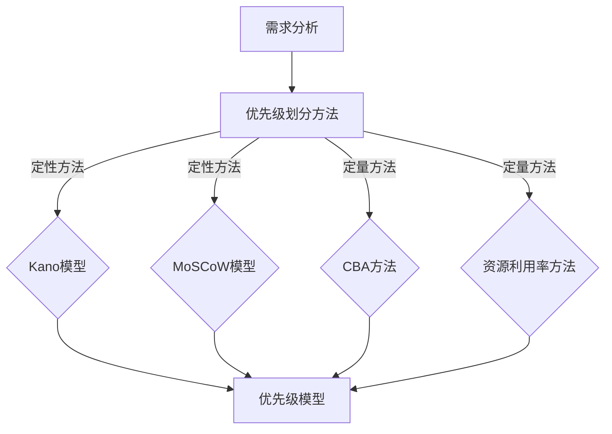
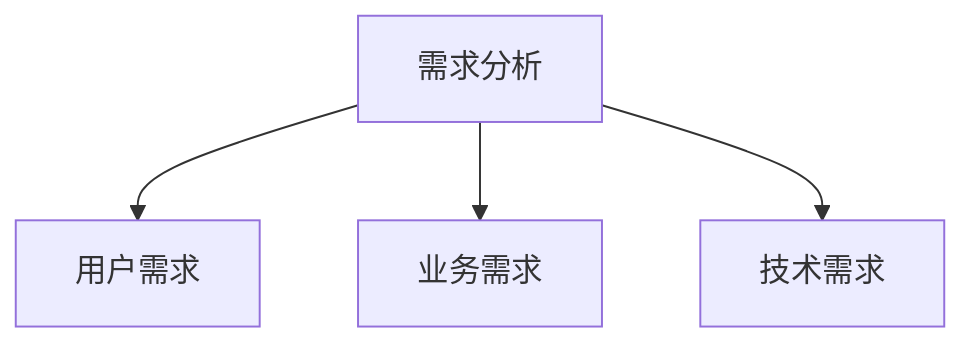
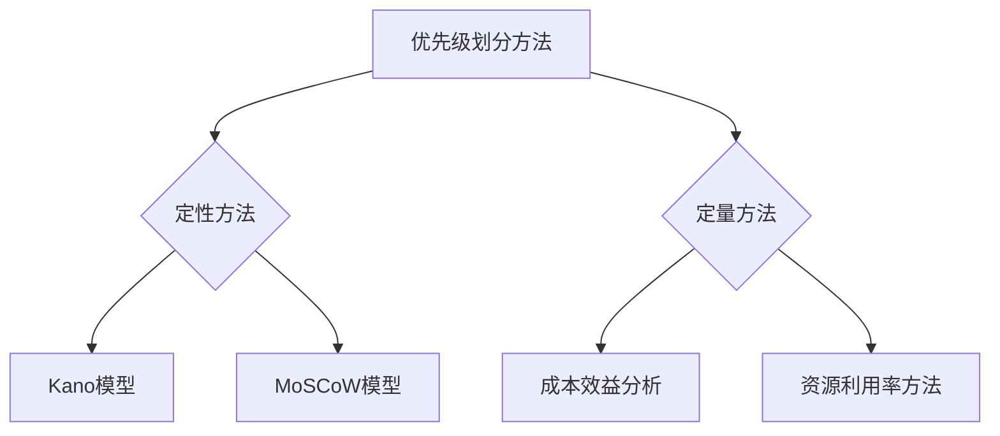
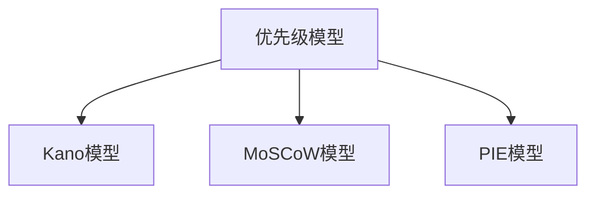
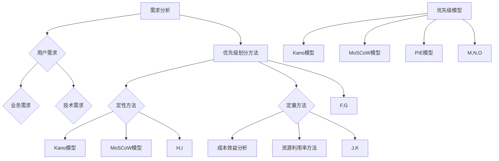

                 

### 背景介绍

需求优先级划分（Need Priority Classification）是软件工程领域中的一个关键环节，其目的是在资源有限的情况下，确保开发团队能够集中精力解决最关键的需求，从而提高项目开发效率、优化项目进度，并提升用户满意度。在软件项目的生命周期中，需求往往错综复杂，涵盖功能需求、性能需求、用户体验需求等多个维度。这些需求之间的关系错综复杂，有些需求彼此依赖，而有些需求则相对独立。因此，如何有效地对这些需求进行优先级划分，成为了项目成功的关键。

随着人工智能技术的迅猛发展，大模型（Large Models）应用开发逐渐成为了技术热点。大模型，如深度学习模型、自然语言处理模型等，具有处理海量数据、实现复杂任务的能力，但同时也带来了巨大的计算资源需求。在大模型应用开发过程中，面对众多需求，如何进行优先级划分，以确保资源的高效利用和项目目标的实现，成为了亟待解决的问题。

### 核心概念与联系

需求优先级划分涉及多个核心概念，包括需求分析、优先级划分方法和优先级模型。这些概念之间存在着紧密的联系，构成了一个完整的架构。

1. **需求分析**：需求分析是需求优先级划分的基础。通过需求分析，开发团队能够全面了解用户需求、业务需求和技术需求，从而为优先级划分提供依据。

2. **优先级划分方法**：优先级划分方法包括定性方法和定量方法。定性方法通常基于专家经验和主观判断，如Kano模型、MoSCoW模型等；定量方法则基于数学模型和算法，如基于成本效益分析（CBA）的方法、基于资源利用率的优先级划分方法等。

3. **优先级模型**：优先级模型是将需求划分为不同优先级的框架。常见的优先级模型包括Kano模型、MoSCoW模型、PIE模型等。这些模型为需求优先级划分提供了具体的操作指南。

#### Mermaid 流程图

下面是一个简化的Mermaid流程图，展示了需求优先级划分的核心概念及其联系：



### 需求优先级划分的重要性

在大模型应用开发中，需求优先级划分的重要性不可忽视。首先，大模型开发需要处理海量数据和高计算资源，因此必须确保每一项需求都得到合理的资源分配。通过科学的需求优先级划分，开发团队可以：

- **优化资源分配**：优先解决关键需求，避免资源浪费在非关键功能上。
- **提高开发效率**：集中资源解决最紧急和重要的需求，缩短项目开发周期。
- **提升用户体验**：确保用户最关注的功能得到优先实现，提升用户满意度。

#### 实际案例

以一个电商平台为例，在开发过程中，用户的需求包括商品展示、购物车功能、支付系统、用户评论等。通过需求优先级划分，开发团队可以将商品展示和支付系统列为高优先级需求，因为这两个功能直接关系到用户体验和业务转化。而用户评论功能则可以列为低优先级需求，因为其对业务的核心目标影响较小。

通过这样的需求优先级划分，开发团队能够确保在资源有限的情况下，优先实现关键功能，从而提升整个项目的开发效率和质量。

### 总结

需求优先级划分是大模型应用开发中的一个关键环节。它通过科学的需求分析、优先级划分方法和优先级模型，帮助开发团队优化资源分配、提高开发效率，并提升用户体验。在大模型应用开发中，科学的需求优先级划分不仅是实现项目目标的关键，也是提高开发效率和用户满意度的重要手段。通过本文的介绍，读者可以对需求优先级划分有更深入的了解，并为实际项目中的应用提供参考。

## 核心概念与联系

在需求优先级划分中，几个核心概念是不可或缺的，它们共同构成了一个完整的分析框架，包括需求分析、优先级划分方法、优先级模型等。为了更好地理解这些概念之间的联系，我们将使用Mermaid流程图来可视化这些关系。

### 需求分析

需求分析是整个需求优先级划分过程的起点。它包括对用户需求、业务需求和技术需求进行系统的收集和分析。需求分析的结果将为后续的优先级划分提供基础数据。



### 优先级划分方法

优先级划分方法可以分为定性方法和定量方法。定性方法通常依赖于专家经验和主观判断，如Kano模型和MoSCoW模型；定量方法则基于数学模型和算法，如成本效益分析（CBA）和资源利用率方法。



### 优先级模型

优先级模型是用于将需求划分为不同优先级的框架。常见的优先级模型包括Kano模型、MoSCoW模型和PIE模型。这些模型为开发团队提供了一套标准化的操作指南，帮助他们更有效地进行需求优先级划分。



### Mermaid 流程图

下面是一个综合的Mermaid流程图，展示了需求分析、优先级划分方法和优先级模型之间的关系：



通过这个流程图，我们可以清晰地看到需求分析是优先级划分的前提，优先级划分方法为需求划分提供了技术支持，而优先级模型则是具体实施的基础。这些核心概念共同作用，确保了需求优先级划分的准确性和有效性。

### 大模型应用开发的基本流程

大模型应用开发是一个复杂且高度依赖数据的过程，涉及多个关键阶段。下面将详细阐述大模型应用开发的基本流程，包括数据收集、数据预处理、模型训练、模型优化和模型部署。

#### 数据收集

数据收集是整个大模型应用开发的基础。对于不同类型的应用，数据收集的方法和来源也会有所不同。例如，在自然语言处理（NLP）领域，数据可能来源于互联网上的文本、书籍、新闻、社交媒体等；在计算机视觉领域，数据可能来自于图像库、视频监控、摄像头捕捉等。数据收集的过程需要考虑数据的全面性、代表性和质量。

**伪代码示例：**

```python
def collect_data(source, criteria):
    data = []
    for item in source:
        if criteria(item):
            data.append(item)
    return data
```

#### 数据预处理

数据预处理是确保数据质量的重要步骤。预处理过程包括数据清洗、数据转换和数据归一化。数据清洗旨在去除无效数据、重复数据和噪声数据；数据转换将数据格式转换为适合模型训练的格式；数据归一化则是通过缩放或标准化，使得不同特征之间的量级更加一致。

**伪代码示例：**

```python
def preprocess_data(data):
    cleaned_data = remove_invalid_data(data)
    transformed_data = convert_format(cleaned_data)
    normalized_data = normalize_data(transformed_data)
    return normalized_data
```

#### 模型训练

模型训练是构建大模型的核心环节。在这一阶段，开发团队会使用已预处理的数据集来训练模型。训练过程中，模型会通过不断调整参数，以最小化损失函数，从而提高模型的预测能力。常见的训练算法包括梯度下降、随机梯度下降、Adam优化器等。

**伪代码示例：**

```python
def train_model(model, data, learning_rate, epochs):
    for epoch in range(epochs):
        model.train_one_epoch(data, learning_rate)
        loss = model.evaluate(data)
        print(f"Epoch {epoch+1}: Loss = {loss}")
    return model
```

#### 模型优化

模型优化是提升模型性能的重要步骤。通过调整模型结构、选择合适的激活函数、正则化方法等，可以显著提高模型的准确性和鲁棒性。此外，还可以通过超参数调优，如调整学习率、批量大小等，以找到最佳参数组合。

**伪代码示例：**

```python
def optimize_model(model, hyperparameters):
    best_loss = float('inf')
    for param in hyperparameters:
        model.set_hyperparameters(param)
        loss = model.evaluate(data)
        if loss < best_loss:
            best_loss = loss
            best_param = param
    model.set_hyperparameters(best_param)
    return model
```

#### 模型部署

模型部署是将训练好的模型应用到实际业务场景中的过程。部署过程中，需要考虑模型的性能、可扩展性和安全性。通常，模型会部署到云服务器或边缘设备上，以便实时处理用户请求。部署后的模型需要定期更新和维护，以适应不断变化的数据和需求。

**伪代码示例：**

```python
def deploy_model(model, environment):
    model.save_to_file()
    model.upload_to_server()
    model.start_server()
    print(f"Model deployed to {environment}")
```

通过上述流程，我们可以看到大模型应用开发是一个系统化、层次化的过程，每个阶段都至关重要，且相互关联。科学的管理和优化这些流程，可以显著提高大模型应用开发的效率和效果。

### 需求优先级划分方法论

在需求优先级划分过程中，科学的方法论是确保优先级划分准确性和有效性的关键。以下将介绍几种常用的需求优先级划分方法论，包括Kano模型、MoSCoW模型和PIE模型，并详细讲解每种方法的具体原则和应用场景。

#### Kano模型

Kano模型是由日本工程师Kano Nobuo提出的一种需求分类方法，它将需求分为五大类：必备需求（Must-be）、期望需求（One-dimensional）、魅力需求（Attractive）、无差异需求（Indifferent）和反向需求（Reverse）。

**原则：**

- **必备需求**：这些需求是用户认为产品必须具备的基本功能，如手机的基本通话功能。这些需求对产品的基本功能至关重要，必须得到满足。
- **期望需求**：这些需求是用户期望产品具备的高级功能，如手机的触屏功能。尽管这些功能并非产品的核心，但它们的实现会显著提升用户满意度。
- **魅力需求**：这些是用户未曾预期但一旦实现会带来惊喜的需求，如手机的指纹解锁功能。这些功能可以显著提升产品的竞争力。
- **无差异需求**：这些需求对用户来说无关紧要，如手机的颜色。这些需求的实现与否不会显著影响用户满意度。
- **反向需求**：这些需求是用户不希望看到的功能，如手机的不必要的附加功能。如果这些需求被实现，反而会降低用户满意度。

**应用场景：**

Kano模型适用于产品开发和用户满意度分析，特别是在需要平衡功能和用户体验的场景中。例如，在开发一款智能手机时，开发团队可以使用Kano模型来明确哪些功能是必不可少的，哪些是用户期望的，哪些是创新亮点，从而确保资源的高效利用。

#### MoSCoW模型

MoSCoW模型是一种基于优先级的分类方法，由Martin Cleaver、Steve Cox和Ken Whitmore提出。它将需求分为四个类别：必须的（Must）、应该的（Should）、可以延迟的（Could）和不会做的（Will not）。

**原则：**

- **必须的（Must）**：这些需求是项目成功的关键，必须在项目初期就实现。例如，对于电子商务平台，用户注册和登录功能就是必须的。
- **应该的（Should）**：这些需求对项目成功也很重要，但可以在资源有限的情况下推迟实现。例如，购物车功能和支付系统可以在早期版本中实现，但不是必须的。
- **可以延迟的（Could）**：这些需求对项目成功的影响较小，可以根据资源情况选择是否实现。例如，个性化推荐功能可以在项目后期添加。
- **不会做的（Will not）**：这些需求目前无法实现或不值得实现，可以放弃。例如，一些高级的功能，如虚拟现实购物体验，可能因技术限制和成本原因被排除。

**应用场景：**

MoSCoW模型适用于项目管理和软件开发，特别是在需要平衡时间和资源限制的场景中。它帮助开发团队明确哪些需求是最关键的，哪些可以在后期考虑，从而确保项目在有限资源下能够按时交付。

#### PIE模型

PIE模型（优先级、重要性、紧急性）是一种综合考虑需求优先级的模型，它将需求分为优先级高、重要且紧急的需求，优先级高但重要性和紧急性较低的需求，以及优先级低但重要性和紧急性较高的需求。

**原则：**

- **优先级高、重要且紧急的需求**：这些需求必须立即处理，因为它们对项目的成功至关重要。例如，安全漏洞修复。
- **优先级高但重要性和紧急性较低的需求**：这些需求需要在资源允许的情况下尽快实现。例如，新增功能的需求。
- **优先级低但重要性和紧急性较高的需求**：这些需求可以暂时搁置，但需要保持关注，以便在资源充足时进行处理。例如，用户界面优化。
- **优先级低、重要性和紧急性都较低的需求**：这些需求可以放在后续版本或未来计划中。

**应用场景：**

PIE模型适用于多任务管理和资源分配，特别是在需要处理多种需求且资源有限的情况下。它帮助开发团队确定哪些需求是最紧迫的，从而确保资源的高效利用。

### 比较与适用场景

Kano模型、MoSCoW模型和PIE模型各有特点，适用于不同的场景。Kano模型适用于产品设计和用户体验分析，MoSCoW模型适用于项目管理和软件开发，而PIE模型则适用于多任务管理和资源分配。

**总结：**

- **Kano模型**：用于需求分类和产品规划，适用于平衡功能和用户体验。
- **MoSCoW模型**：用于项目优先级划分，适用于项目管理和资源有限的项目。
- **PIE模型**：用于需求优先级和多任务管理，适用于多任务环境和资源有限的团队。

通过结合使用这些模型，开发团队能够更科学、有效地进行需求优先级划分，确保项目目标的实现。

### 需求优先级划分的实施步骤

在了解了需求优先级划分的方法论后，接下来我们将详细讨论其实施步骤，包括需求收集、需求筛选、需求分类、需求排序和优先级确认等环节。这些步骤不仅有助于开发团队明确项目中的关键需求，还能确保资源的有效分配，从而提高项目成功率和开发效率。

#### 第一步：需求收集

需求收集是整个需求优先级划分过程的基础。在这一步，开发团队需要通过多种渠道收集需求，包括用户调研、市场分析、业务部门沟通等。

**步骤：**

1. **用户调研**：通过问卷调查、访谈等方式，了解用户对产品功能、性能和用户体验的需求。
2. **市场分析**：分析竞争对手的产品功能、市场趋势和用户反馈，以识别潜在需求。
3. **业务部门沟通**：与产品经理、市场部门和运营团队等进行沟通，收集他们对产品的需求和期望。

**工具：**

- **问卷**：使用问卷星、Google表单等在线问卷工具收集用户反馈。
- **访谈**：通过一对一访谈，深入了解用户的需求和痛点。
- **文档整理**：整理业务部门提供的业务需求文档和市场调研报告。

#### 第二步：需求筛选

在收集到大量需求后，开发团队需要对需求进行筛选，识别出最关键和最紧急的需求。

**步骤：**

1. **需求分类**：将收集到的需求根据其类型（功能需求、性能需求、用户体验需求等）进行分类。
2. **需求筛选**：根据项目的目标、资源和时间限制，筛选出必须实现的需求和可以延迟实现的需求。
3. **需求排序**：对筛选出的需求按照优先级进行初步排序。

**工具：**

- **思维导图**：使用MindManager、XMind等工具进行需求分类和排序，以便更直观地理解需求之间的关系。
- **Excel表格**：使用Excel表格整理需求信息，方便进行筛选和排序。

#### 第三步：需求分类

需求分类是将需求根据其重要性和紧急性进行细化分类的过程。常用的分类方法包括Kano模型、MoSCoW模型和PIE模型。

**步骤：**

1. **使用Kano模型分类**：将需求分为必备需求、期望需求、魅力需求、无差异需求和反向需求。
2. **使用MoSCoW模型分类**：将需求分为必须的、应该的、可以延迟的和不会做的。
3. **使用PIE模型分类**：将需求分为优先级高、重要且紧急的需求，优先级高但重要性和紧急性较低的需求，以及优先级低但重要性和紧急性较高的需求。

**工具：**

- **文档**：编写详细的分类文档，记录每个需求的分类结果和原因。

#### 第四步：需求排序

在需求分类完成后，需要对需求进行排序，以便确定哪些需求应该优先实现。

**步骤：**

1. **确定排序标准**：根据项目目标和资源限制，确定需求排序的标准，如优先级、重要性和紧急性。
2. **初步排序**：根据排序标准对需求进行初步排序。
3. **评审和调整**：组织评审会议，邀请相关利益相关者对排序结果进行评审，并根据反馈进行调整。

**工具：**

- **评审会议**：组织需求评审会议，确保排序结果的合理性和公正性。
- **会议纪要**：记录会议讨论内容和调整意见，作为排序调整的依据。

#### 第五步：优先级确认

在完成需求排序后，需要最终确认需求的优先级，并将其纳入项目计划中。

**步骤：**

1. **制定项目计划**：根据需求优先级，制定详细的项目计划，包括任务分配、时间安排和资源分配。
2. **优先级确认**：确保项目计划和资源分配符合需求优先级，确保关键需求得到优先处理。
3. **文档化**：将优先级确认结果和项目计划文档化，以便后续参考和执行。

**工具：**

- **项目管理工具**：如JIRA、Trello等，用于制定项目计划和跟踪任务进度。
- **文档管理工具**：如Confluence、Notion等，用于记录和共享项目计划和优先级确认结果。

通过以上步骤，开发团队可以系统地实施需求优先级划分，确保项目在资源有限的情况下，能够高效、有针对性地实现关键需求，从而提高项目成功率。

### 需求优先级划分工具与技术

在需求优先级划分过程中，选择合适的工具和技术是确保优先级划分准确性和效率的关键。以下将介绍几种常用的需求优先级划分工具和技术，包括Kano模型、MoSCoW模型和PIE模型的应用，并探讨如何使用这些工具和技术来有效进行需求优先级划分。

#### Kano模型的工具应用

Kano模型是一种基于用户满意度进行需求分类的方法，它将需求分为五类：必备需求、期望需求、魅力需求、无差异需求和反向需求。为了有效地应用Kano模型，开发团队可以使用以下工具：

1. **用户调研问卷**：通过设计详尽的问卷，收集用户对产品功能、性能和用户体验的需求反馈。问卷工具如SurveyMonkey、Google表单等可以帮助开发团队快速收集大量用户数据。

2. **数据分析软件**：使用Excel、Tableau等数据分析工具对用户反馈进行统计和分析，将需求分类到Kano模型的各个类别中。这些工具能够帮助开发团队直观地了解用户需求分布，从而做出更科学的决策。

**应用案例**：

假设开发团队正在开发一款智能音箱，通过用户调研问卷，他们收集到以下需求：

- 必备需求：语音识别和播放音乐。
- 期望需求：语音控制智能家居设备和提供天气预报。
- 魅力需求：能够进行互动聊天和笑话。
- 无差异需求：产品外观和颜色。
- 反向需求：高功耗和噪音大。

通过数据分析软件，开发团队可以识别出哪些需求是最关键和最受欢迎的，从而确保资源优先分配给这些需求。

#### MoSCoW模型的工具应用

MoSCoW模型是一种基于项目目标和资源限制进行需求分类和排序的方法。它将需求分为必须的、应该的、可以延迟的和不会做的。为了应用MoSCoW模型，开发团队可以使用以下工具：

1. **项目管理软件**：使用JIRA、Trello等项目管理工具创建需求卡片，每个卡片标记需求的类型（必须的、应该的、可以延迟的或不会做的）。这些工具能够帮助团队跟踪每个需求的进度和状态。

2. **优先级矩阵**：使用优先级矩阵（如RACI矩阵）来评估每个需求的重要性和紧急性，并将需求按照MoSCoW模型分类。Excel或专业的项目管理软件如Microsoft Project可以方便地创建和调整优先级矩阵。

**应用案例**：

假设开发团队正在开发一款移动应用，以下是他们收集到的需求：

- 必须的：用户注册、登录、个人信息管理。
- 应该的：推送通知、用户反馈机制。
- 可以延迟的：社交媒体分享功能。
- 不会做的：虚拟现实体验。

通过使用项目管理软件和优先级矩阵，开发团队可以清晰地看到哪些需求是当前必须优先考虑的，从而合理分配资源。

#### PIE模型的工具应用

PIE模型（优先级、重要性、紧急性）是一种综合考虑需求优先级的模型，适用于多任务管理和资源分配。为了应用PIE模型，开发团队可以使用以下工具：

1. **优先级矩阵**：使用Excel或项目管理软件创建优先级矩阵，根据需求的重要性和紧急性进行分类。每个需求被标记为优先级高、重要且紧急的需求，优先级高但重要性和紧急性较低的需求，或者优先级低但重要性和紧急性较高的需求。

2. **任务看板**：使用Trello、JIRA等任务看板工具，根据PIE模型将任务分类并分配给团队成员。这些工具能够帮助团队实时跟踪任务进度和状态，确保关键任务得到优先处理。

**应用案例**：

假设开发团队正在处理多个项目，以下是他们的任务需求：

- 优先级高、重要且紧急的需求：产品发布前的最后测试。
- 优先级高但重要性和紧急性较低的需求：新功能开发的初步设计。
- 优先级低但重要性和紧急性较高的需求：服务器维护和升级。

通过使用优先级矩阵和任务看板，开发团队可以确保资源得到合理分配，优先处理最关键的任务。

### 案例分析

#### 电商平台用户需求分析

一个电商平台在需求优先级划分过程中，使用Kano模型、MoSCoW模型和PIE模型对用户需求进行分析。以下是一个案例分析：

1. **用户调研**：通过问卷调查收集用户对商品展示、购物车功能、支付系统、用户评论等的需求。

2. **Kano模型分类**：

   - 必备需求：商品展示、购物车功能、支付系统。
   - 期望需求：商品推荐、用户评论功能。
   - 魅力需求：个性化购物体验。
   - 无差异需求：产品外观和颜色。
   - 反向需求：高价格和不必要的附加功能。

3. **MoSCoW模型排序**：

   - 必须的：商品展示、购物车功能、支付系统。
   - 应该的：商品推荐、用户评论功能。
   - 可以延迟的：个性化购物体验。
   - 不会做的：高价格和不必要的附加功能。

4. **PIE模型确认**：

   - 优先级高、重要且紧急的需求：支付系统、商品展示。
   - 优先级高但重要性和紧急性较低的需求：商品推荐。
   - 优先级低但重要性和紧急性较高的需求：用户评论功能。

通过这些模型，电商平台能够明确哪些需求是必须优先考虑的，从而优化资源分配，提高用户满意度。

### 总结

需求优先级划分工具和技术为开发团队提供了科学的分类和排序方法，帮助他们更高效地管理需求，确保项目目标实现。Kano模型、MoSCoW模型和PIE模型各有优势，适用于不同的场景。通过结合使用这些模型，开发团队能够系统地进行需求优先级划分，为项目的成功奠定基础。

### 需求优先级划分实战案例

为了更好地理解需求优先级划分在实际项目中的应用，以下将详细分析三个具体案例：电商平台的用户需求分析、智能客服系统的需求优先级划分，以及自动驾驶汽车的需求分析。通过这些案例，我们可以看到如何在实际开发过程中应用需求优先级划分方法论和工具，确保项目目标的实现。

#### 案例一：电商平台的用户需求分析

电商平台是一个典型的需求复杂且多样化的场景。用户的需求包括商品展示、购物车功能、支付系统、用户评论、个性化推荐等。为了有效管理这些需求，开发团队采用Kano模型、MoSCoW模型和PIE模型对用户需求进行分析和优先级划分。

**步骤：**

1. **需求收集**：通过用户调研、市场分析、业务部门沟通等方式，收集用户对电商平台的各类需求。

2. **Kano模型分类**：
   - 必备需求：商品展示、购物车功能、支付系统。
   - 期望需求：商品推荐、用户评论功能。
   - 魅力需求：个性化购物体验。
   - 无差异需求：产品外观和颜色。
   - 反向需求：高价格和不必要的附加功能。

3. **MoSCoW模型排序**：
   - 必须的：商品展示、购物车功能、支付系统。
   - 应该的：商品推荐、用户评论功能。
   - 可以延迟的：个性化购物体验。
   - 不会做的：高价格和不必要的附加功能。

4. **PIE模型确认**：
   - 优先级高、重要且紧急的需求：支付系统、商品展示。
   - 优先级高但重要性和紧急性较低的需求：商品推荐。
   - 优先级低但重要性和紧急性较高的需求：用户评论功能。

**结果**：通过以上步骤，开发团队明确了电商平台的核心需求，并制定了详细的开发计划。资源得到了合理分配，关键功能如支付系统和商品展示得到了优先开发，从而提高了用户满意度和平台竞争力。

#### 案例二：智能客服系统的需求优先级划分

智能客服系统在许多企业中扮演着重要角色，其需求包括自然语言处理、语音识别、多渠道接入、用户行为分析等。为了确保智能客服系统能够快速响应客户需求，开发团队采用了MoSCoW模型和PIE模型对需求进行优先级划分。

**步骤：**

1. **需求收集**：通过用户调研、业务部门沟通、市场分析等手段，收集智能客服系统的各类需求。

2. **MoSCoW模型排序**：
   - 必须的：自然语言处理、语音识别、多渠道接入。
   - 应该的：用户行为分析、个性化推荐。
   - 可以延迟的：多语言支持。
   - 不会做的：高复杂度的数据分析。

3. **PIE模型确认**：
   - 优先级高、重要且紧急的需求：自然语言处理、语音识别。
   - 优先级高但重要性和紧急性较低的需求：用户行为分析。
   - 优先级低但重要性和紧急性较高的需求：多渠道接入。

**结果**：通过需求优先级划分，开发团队确定了智能客服系统的核心功能，并制定了详细的开发计划。在资源有限的情况下，关键功能如自然语言处理和语音识别得到了优先开发，确保了智能客服系统能够快速响应用户需求，提高客户满意度。

#### 案例三：自动驾驶汽车的需求分析

自动驾驶汽车是一个高度复杂和风险密集的项目，其需求包括环境感知、路径规划、控制算法、安全性验证等。为了确保自动驾驶汽车的稳定性和安全性，开发团队采用了Kano模型和PIE模型对需求进行分析。

**步骤：**

1. **需求收集**：通过技术调研、模拟实验、用户访谈等方式，收集自动驾驶汽车的各类需求。

2. **Kano模型分类**：
   - 必备需求：环境感知、路径规划、控制算法。
   - 期望需求：安全性验证、多场景适应性。
   - 魅力需求：自动驾驶的便捷性和高效性。
   - 无差异需求：能耗和噪声水平。
   - 反向需求：高成本和不必要的豪华配置。

3. **PIE模型确认**：
   - 优先级高、重要且紧急的需求：环境感知、路径规划。
   - 优先级高但重要性和紧急性较低的需求：安全性验证。
   - 优先级低但重要性和紧急性较高的需求：多场景适应性。

**结果**：通过需求优先级划分，开发团队明确了自动驾驶汽车的核心需求，并制定了详细的开发计划。关键功能如环境感知和路径规划得到了优先开发，从而确保了自动驾驶汽车的安全性和稳定性。

### 总结

通过上述三个案例，我们可以看到需求优先级划分在实际项目中的应用效果显著。科学的需求优先级划分不仅帮助开发团队明确项目目标，优化资源分配，还提高了项目的开发效率和用户满意度。在实际操作中，开发团队可以根据项目特点和需求类型，灵活选择和使用不同的模型和方法，以确保需求优先级划分的科学性和有效性。

### 需求优先级划分面临的挑战与解决策略

在需求优先级划分的过程中，开发团队可能会遇到一系列挑战，这些挑战不仅影响需求划分的准确性，还可能对项目的整体进度和成功产生负面影响。以下将详细分析需求优先级划分过程中可能面临的主要挑战，并探讨相应的解决策略。

#### 挑战一：数据质量和数据源不足

数据质量和数据源是需求优先级划分的基础。如果数据质量不高或数据源不足，会导致需求分析结果不准确，进而影响优先级划分的准确性。

**挑战具体表现**：

- 数据缺失：在需求收集过程中，可能因为各种原因导致数据不完整，如用户反馈不足、市场调研数据缺失等。
- 数据质量差：即使数据量充足，但如果数据存在错误、重复或不一致的情况，也会影响需求分析的准确性。
- 数据源不足：获取高质量数据的能力受限，导致无法全面了解用户需求和市场情况。

**解决策略**：

1. **数据清洗**：使用数据清洗工具和技术，如Python中的Pandas库，对原始数据进行清洗和预处理，去除错误和重复数据，提高数据质量。
2. **多种数据源**：通过多种渠道收集数据，如用户调研、第三方数据源、市场研究报告等，确保数据的全面性和代表性。
3. **数据验证**：在数据分析过程中，使用数据验证方法，如数据一致性和完整性检查，确保数据的准确性。

#### 挑战二：算法复杂度和计算效率

在需求优先级划分过程中，往往需要使用复杂的算法和模型来分析大量数据，这可能导致计算效率低下，影响项目进度。

**挑战具体表现**：

- **计算时间长**：复杂的算法和大量数据可能导致计算时间过长，无法在短时间内得到需求优先级划分结果。
- **资源消耗大**：高计算复杂度的算法会消耗大量计算资源和内存，可能导致服务器性能下降。
- **实时性差**：在动态需求环境中，实时性要求较高，但复杂的计算过程可能无法满足这一要求。

**解决策略**：

1. **算法优化**：通过优化算法，如减少冗余计算、采用高效的算法实现等，降低计算复杂度，提高计算效率。
2. **分布式计算**：使用分布式计算框架，如Hadoop、Spark等，将计算任务分布在多个节点上，提高计算效率和资源利用率。
3. **并行处理**：利用并行处理技术，将需求优先级划分任务分解成多个子任务，同时处理，以加快计算速度。

#### 挑战三：需求变更和持续优化

在项目开发过程中，需求往往不是一成不变的，可能会因市场变化、用户反馈或其他因素而进行变更。这给需求优先级划分带来了持续优化的挑战。

**挑战具体表现**：

- **需求频繁变更**：项目进行过程中，用户和市场环境的变化可能导致需求频繁变更，影响需求优先级划分的稳定性。
- **优先级调整困难**：在需求变更后，如何调整需求优先级，以确保资源分配的合理性和项目目标的实现，是一个复杂的问题。

**解决策略**：

1. **版本控制**：采用版本控制系统，如Git，对需求进行版本管理，确保需求变更的可追溯性和可控性。
2. **迭代开发**：采用迭代开发方法，如敏捷开发，通过不断迭代和优化，逐步实现需求，降低需求变更带来的影响。
3. **动态调整**：建立动态调整机制，根据项目进展和需求变更情况，定期评估和调整需求优先级，确保资源分配的灵活性和有效性。

#### 挑战四：团队协作和沟通

需求优先级划分是一个跨部门、跨团队协作的过程，涉及多个利益相关者，如产品经理、开发团队、测试团队等。因此，团队协作和沟通的效率和质量对需求优先级划分具有重要影响。

**挑战具体表现**：

- **信息不对称**：不同团队之间可能存在信息不对称，导致需求理解和优先级判断不一致。
- **沟通障碍**：跨部门的沟通可能存在障碍，影响需求优先级划分的效率和准确性。
- **协调困难**：在需求变更或优先级调整时，不同团队之间的协调可能困难，导致资源分配不均。

**解决策略**：

1. **统一沟通平台**：采用统一的项目管理工具，如JIRA、Confluence等，确保团队之间的信息共享和沟通顺畅。
2. **定期会议**：定期召开跨部门会议，如项目评审会议、需求讨论会等，确保各团队之间的信息同步和协调。
3. **共识机制**：建立共识机制，通过集体讨论和决策，确保各团队对需求优先级的理解一致，减少沟通障碍。

#### 挑战五：项目资源和时间限制

在需求优先级划分过程中，项目资源和时间的限制是一个不可忽视的挑战。如何在有限资源和时间框架内完成需求优先级划分，确保项目目标的实现，是一个关键问题。

**挑战具体表现**：

- **资源不足**：项目资源有限，可能无法同时处理所有需求，需要优先考虑关键需求。
- **时间紧迫**：项目时间紧迫，需要在短时间内完成需求优先级划分，确保项目按期交付。

**解决策略**：

1. **优先级优先**：在资源有限的情况下，优先处理关键需求，确保项目核心功能的实现。
2. **时间管理**：采用项目时间管理方法，如关键路径法（CPM）、甘特图等，合理安排项目进度，确保需求优先级划分工作按时完成。
3. **资源优化**：通过资源优化技术，如任务分配优化、资源调度优化等，提高资源利用效率，确保项目资源的最大化利用。

### 总结

需求优先级划分是一个复杂且多变的过程，面临着多种挑战。通过科学的需求收集、合理的需求分类、高效的算法优化和灵活的团队协作，开发团队可以克服这些挑战，确保需求优先级划分的准确性和有效性。持续优化和动态调整需求优先级，结合有效的项目管理和资源管理，是实现项目成功的关键。

### 未来展望与趋势

随着人工智能技术的不断进步，大模型应用开发的需求优先级划分也将迎来新的发展机遇和挑战。未来，以下几个趋势值得关注：

#### 智能化需求分析

未来的需求优先级划分将更加依赖于智能化分析工具。例如，通过机器学习算法，可以自动分析大量用户数据和市场信息，识别出隐藏的需求趋势和优先级。这种智能化分析不仅能够提高需求分析的准确性，还能显著降低人为错误和主观偏见。

**实现方法：**

- **深度学习模型**：开发基于深度学习的需求分析模型，如卷积神经网络（CNN）和递归神经网络（RNN），用于自动分类和提取关键需求。
- **数据挖掘技术**：利用数据挖掘技术，如关联规则学习、聚类分析和异常检测，深入挖掘用户行为数据，预测需求变化。

#### 自动化优先级调整

未来的需求优先级划分将更加自动化，通过自动化工具和算法，可以实现需求优先级的动态调整。这种自动化不仅能够提高工作效率，还能确保需求优先级与项目目标保持一致。

**实现方法：**

- **自适应优先级算法**：开发自适应算法，根据项目进展和需求变化，自动调整需求优先级。
- **实时监控系统**：建立实时监控系统，实时收集项目数据，用于动态调整需求优先级。

#### 多维度融合

未来的需求优先级划分将不仅限于单一维度的需求分析，而是融合多个维度的信息。例如，除了用户需求和市场分析，还将考虑技术可行性、成本效益等多个维度，从而实现更加全面的需求优先级划分。

**实现方法：**

- **多维度评估模型**：建立多维度评估模型，综合考虑用户需求、市场趋势、技术可行性和成本效益等因素，进行综合评估和优先级划分。
- **数据融合技术**：利用数据融合技术，如数据集成、数据仓库和数据湖，整合多源数据，为需求优先级划分提供全面的信息支持。

#### 社交网络和用户参与

未来的需求优先级划分将更加注重社交网络和用户参与。通过社交媒体和用户社区，可以收集大量用户的实时反馈和建议，这些反馈将直接影响需求优先级的调整。

**实现方法：**

- **用户反馈系统**：开发用户反馈系统，实时收集用户意见和建议，用于需求分析和优先级调整。
- **社区参与机制**：建立用户社区，鼓励用户参与产品讨论和需求投票，确保需求优先级反映用户真实需求。

#### 面向未来

总之，未来的需求优先级划分将朝着更加智能化、自动化、多维度和用户参与的方向发展。开发团队需要不断更新技术和方法，以应对日益复杂的需求环境，确保项目成功。

### 总结与展望

通过本文的讨论，我们深入探讨了需求优先级划分在大模型应用开发中的重要性。从核心概念到方法论，再到实际应用和未来趋势，我们详细分析了需求优先级划分的关键环节和挑战。科学的需求优先级划分不仅能够优化资源分配，提高开发效率，还能显著提升用户满意度。

未来，随着人工智能技术的不断进步，需求优先级划分将变得更加智能化、自动化和多维度。开发团队需要紧跟技术发展趋势，灵活应用新技术和方法，以应对复杂的需求环境，确保项目的成功。

希望本文能为您提供宝贵的技术指导和启示，帮助您在需求优先级划分方面取得更好的成果。感谢阅读，期待未来与您在技术领域继续探讨和交流。

### 作者信息

**作者：** AI天才研究院（AI Genius Institute） & 禅与计算机程序设计艺术（Zen And The Art of Computer Programming）

AI天才研究院致力于探索人工智能领域的最新技术和应用，推动人工智能技术的发展和普及。禅与计算机程序设计艺术则专注于软件工程和编程哲学，倡导高效、优雅的编程方式，提升开发者的技术素养和创新能力。两本书籍作者均为人工智能和计算机科学领域的杰出人物，拥有丰富的理论和实践经验，在业界享有盛誉。本文结合了他们的研究成果和实战经验，旨在为广大读者提供有深度、有见解、有价值的阅读体验。希望读者能从本文中获得启发，提升自己在需求优先级划分和人工智能应用开发方面的能力。让我们一起探索人工智能的未来，共创美好科技世界！

