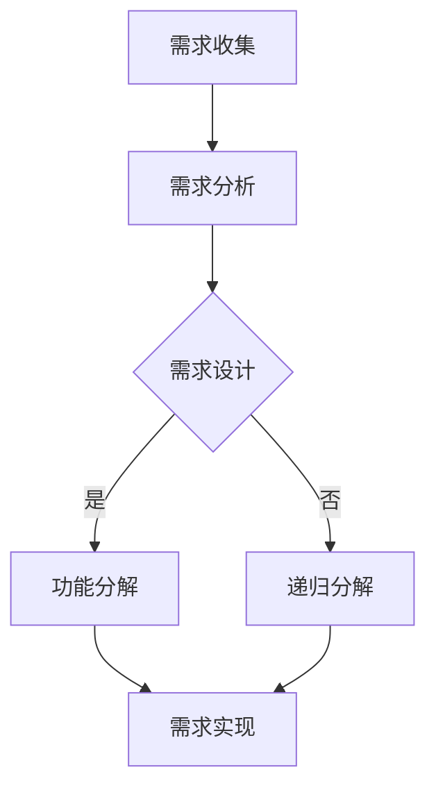

                 

# 需求分解技巧：让大型应用开发更易管理

## 关键词
- 需求分解
- 大型应用开发
- 需求管理
- 用户故事地图
- 价值流图
- 功能分解
- 软件架构分解

## 摘要
本文旨在探讨需求分解技巧在大型应用开发中的应用。随着软件项目的规模和复杂性不断增加，有效管理需求成为项目成功的关键。本文将介绍需求分解的基本概念、常用方法、工具与技术，并通过实际案例和实践经验，提供一套完整的需求分解流程，旨在帮助开发者更好地应对大型应用开发的挑战。

## 引言和概述

### 大型应用开发的挑战

在当今数字化时代，大型应用开发无处不在，从企业级软件到移动互联网应用，从云计算平台到物联网系统，项目规模和复杂性都在不断增加。这给软件开发带来了诸多挑战，主要体现在以下几个方面：

1. **需求多样化和不确定性**：大型应用通常涉及多个业务领域和用户群体，需求多样且易变，这使得需求管理成为项目成功的关键。
2. **项目规模和复杂性**：随着项目规模的扩大，系统架构的复杂性也随之增加，传统的需求管理方法往往难以应对。
3. **协作与沟通**：大型应用开发通常涉及多个团队和跨部门的协作，沟通和协调难度加大，可能导致需求误解和资源浪费。
4. **时间与成本压力**：在有限的时间和预算内，确保项目按时完成且满足用户需求，这对开发团队是一个巨大的挑战。

### 需求分解的重要性

需求分解是应对大型应用开发挑战的有效手段。通过将复杂的整体需求分解为更小、更易于管理的部分，需求分解有助于：

1. **明确需求边界**：清晰的需求边界有助于开发者更好地理解需求，减少误解和歧义。
2. **提高开发效率**：将整体需求分解为多个可管理的部分，有助于提高开发效率，缩短项目周期。
3. **降低风险**：通过早期识别和解决潜在问题，降低项目风险。
4. **增强团队协作**：明确的需求分解有助于团队协作，减少沟通成本。

### 需求分解的目标和原则

需求分解的目标是确保需求在技术、业务和时间方面都是可行和可管理的。为了实现这一目标，需求分解应遵循以下原则：

1. **完整性**：确保所有关键需求都被分解和涵盖，避免遗漏。
2. **一致性**：确保分解的需求之间相互一致，不产生冲突。
3. **层次性**：将需求按层次结构进行分解，便于理解和实现。
4. **灵活性**：允许在需求分解过程中进行迭代和调整，以适应需求变化。
5. **可追溯性**：确保每个需求都能追溯到其原始来源，便于需求管理和变更控制。

## 需求分解的基本概念

### 定义需求分解

需求分解是将复杂的需求拆分成更小、更易于管理和实现的部分的过程。这个过程旨在确保需求的明确性、一致性和可管理性。

### 需求分解的目标和原则

#### 目标
1. **明确需求边界**：通过分解，使每个需求都有明确的边界和功能定义。
2. **提高可管理性**：将整体需求分解为多个可管理的小部分，提高项目的可管理性。
3. **降低复杂性**：通过层次化和模块化，降低系统的复杂性。

#### 原则
1. **完整性**：确保所有关键需求都被涵盖。
2. **一致性**：确保分解后的需求之间相互一致。
3. **层次性**：按照层次结构进行分解，便于理解和实现。
4. **灵活性**：允许在分解过程中进行迭代和调整。
5. **可追溯性**：确保每个需求都有明确的来源和变更记录。

### 需求分解的核心概念和术语

#### 用户故事
用户故事是需求分解的一种常见方法，它通过描述用户如何使用系统来定义功能需求。用户故事的格式通常为：“As a [用户类型]，I want [功能]，so that [目的]”。

#### 功能分解
功能分解是将需求分解为更小的功能单元的过程。每个功能单元都应具有明确的输入、处理和输出。

#### 递归分解
递归分解是一种将需求不断分解为更小部分的方法，直到达到可管理的程度。

#### 软件架构分解
软件架构分解是将系统架构分解为更小的组件和模块，以便更好地理解和实现需求。

## 需求分解的常用方法

### 用户故事地图

#### 基本概念
用户故事地图是一种用于需求分解的工具，它通过可视化用户故事之间的关系，帮助团队更好地理解需求。

#### 使用场景
1. **需求梳理**：在项目初期，通过用户故事地图梳理和理解用户需求。
2. **需求评审**：在需求评审阶段，通过用户故事地图验证需求是否完整和一致。

#### 操作步骤
1. **绘制用户故事**：在每个用户故事前标注“As a [用户类型]，I want [功能]，so that [目的]”。
2. **连接用户故事**：使用线条连接相关用户故事，表示它们之间的逻辑关系。
3. **评估和调整**：根据用户故事地图评估需求的完整性和一致性，进行必要的调整。

### 价值流图

#### 基本概念
价值流图是一种用于描述业务流程和需求关系的可视化工具。

#### 使用场景
1. **需求分析**：在需求分析阶段，通过价值流图识别和优化业务流程。
2. **需求管理**：在需求管理阶段，通过价值流图监控需求的变化和进度。

#### 操作步骤
1. **绘制价值流图**：从输入开始，按照业务流程绘制每个步骤和输出。
2. **识别需求**：在价值流图中标注关键需求，确保它们被完整地覆盖。
3. **评估和优化**：根据价值流图评估业务流程的效率，识别和优化需求。

### 功能分解

#### 基本概念
功能分解是将需求分解为更小的功能单元的过程。

#### 使用场景
1. **需求设计**：在需求设计阶段，通过功能分解明确系统功能。
2. **需求实现**：在需求实现阶段，通过功能分解分配任务和资源。

#### 操作步骤
1. **绘制功能图**：使用图形工具绘制系统的功能模块和关系。
2. **定义功能单元**：为每个功能单元定义输入、处理和输出。
3. **评估和调整**：根据功能图评估系统的完整性和一致性，进行必要的调整。

### 递归分解

#### 基本概念
递归分解是一种将需求不断分解为更小部分的方法，直到达到可管理的程度。

#### 使用场景
1. **复杂需求分析**：当需求非常复杂时，通过递归分解帮助团队更好地理解和实现。
2. **需求细化**：在需求细化阶段，通过递归分解将高层次需求逐步分解为更具体的部分。

#### 操作步骤
1. **定义高层次需求**：首先定义高层次的需求，明确其主要目标和功能。
2. **分解为子需求**：将高层次需求分解为更小的子需求，每个子需求都应具有明确的输入、处理和输出。
3. **递归分解**：对每个子需求继续分解，直到达到可管理的程度。

### 软件架构分解

#### 基本概念
软件架构分解是将系统架构分解为更小的组件和模块，以便更好地理解和实现需求。

#### 使用场景
1. **系统设计**：在系统设计阶段，通过软件架构分解明确系统组件和模块。
2. **需求实现**：在需求实现阶段，通过软件架构分解分配任务和资源。

#### 操作步骤
1. **绘制架构图**：使用图形工具绘制系统的架构组件和关系。
2. **定义组件和模块**：为每个组件和模块定义其功能和接口。
3. **评估和调整**：根据架构图评估系统的完整性和一致性，进行必要的调整。

## 需求分解工具与技术

### 常用需求管理工具

#### 用户故事地图工具
- **工具1**：JIRA
- **工具2**：Trello
- **工具3**：Confluence

#### 价值流图工具
- **工具1**：Microsoft Visio
- **工具2**：Lucidchart
- **工具3**：Google Drawings

#### 功能分解工具
- **工具1**：Microsoft Excel
- **工具2**：Google Sheets
- **工具3**：Tableau

### 需求分解流程与技术

#### 需求收集与分析
1. **需求收集**：通过访谈、问卷调查、用户故事卡片等方式收集需求。
2. **需求分析**：对收集到的需求进行分类、筛选和优先级排序。

#### 需求设计
1. **绘制用户故事地图**：使用用户故事地图工具绘制用户故事关系。
2. **绘制价值流图**：使用价值流图工具描述业务流程。

#### 需求实现
1. **功能分解**：使用功能分解工具将需求分解为功能单元。
2. **递归分解**：对复杂需求进行递归分解。

#### 需求管理
1. **需求文档**：编写详细的需求文档，包括需求描述、功能需求、非功能需求等。
2. **需求变更管理**：制定需求变更管理流程，确保需求变更的及时和有效处理。

### 需求分解工具的比较与选择

#### 工具1：JIRA
- **优点**：功能强大，支持敏捷开发，集成度高等。
- **缺点**：学习曲线较陡，对于小型团队可能过于复杂。

#### 工具2：Trello
- **优点**：界面简洁，易于上手，适合小型团队。
- **缺点**：功能相对有限，不适合复杂项目。

#### 工具3：Confluence
- **优点**：文档管理强大，支持多人协作。
- **缺点**：对项目管理功能支持有限。

#### 工具4：Microsoft Visio
- **优点**：功能强大，支持多种图形绘制。
- **缺点**：许可证费用较高。

#### 工具5：Lucidchart
- **优点**：在线协作，功能丰富。
- **缺点**：免费版功能有限。

### 选择原则
1. **项目需求**：根据项目的具体需求选择合适的工具。
2. **团队规模**：考虑团队规模和协作需求。
3. **预算**：考虑预算和许可证费用。
4. **易用性**：选择易于上手的工具，减少学习成本。

## 需求分解案例与实践

### 实际案例介绍

#### 案例背景
某企业正在开发一款面向全球市场的电子商务平台，该项目涉及多个业务领域，包括商品管理、订单处理、支付结算、客户服务等。由于项目规模庞大，需求复杂，需求管理成为项目成功的关键。

#### 案例目标
通过需求分解，明确系统功能模块，确保需求完整、一致和可管理。

### 需求分解过程记录

#### 步骤1：需求收集与分析
1. **需求收集**：通过用户访谈、问卷调查、用户故事卡片等方式收集需求。
2. **需求分析**：对收集到的需求进行分类、筛选和优先级排序。

#### 步骤2：需求设计
1. **绘制用户故事地图**：使用JIRA绘制用户故事关系，包括用户类型、功能需求和目的。
2. **绘制价值流图**：使用Lucidchart描述业务流程，包括输入、处理和输出。

#### 步骤3：需求实现
1. **功能分解**：使用Excel将需求分解为功能单元，明确每个功能单元的输入、处理和输出。
2. **递归分解**：对复杂需求进行递归分解，确保每个需求都达到可管理的程度。

#### 步骤4：需求管理
1. **需求文档**：编写详细的需求文档，包括需求描述、功能需求、非功能需求等。
2. **需求变更管理**：制定需求变更管理流程，确保需求变更的及时和有效处理。

### 需求分解结果评估

#### 评估指标
1. **完整性**：确保所有关键需求都被分解和覆盖。
2. **一致性**：确保分解后的需求之间相互一致，不产生冲突。
3. **可管理性**：确保每个需求都达到可管理的程度，便于实现和测试。

#### 评估方法
1. **自评估**：团队内部对需求分解结果进行评估，确保满足评估指标。
2. **外部评审**：邀请外部专家对需求分解结果进行评审，提供第三方视角。

### 案例分析和详细讲解剖析

#### 用户故事地图


用户故事地图展示了电子商务平台的主要用户类型和功能需求，包括：

- **商家**：发布商品、管理订单、查看销售数据等。
- **买家**：浏览商品、下单购买、查看订单状态等。
- **管理员**：管理商品分类、订单处理、支付结算等。

#### 价值流图


价值流图描述了电子商务平台的业务流程，包括：

- **商品管理**：商家发布商品，管理员审核和分类商品。
- **订单处理**：买家下单，商家处理订单，管理员处理退款和售后。
- **支付结算**：买家支付订单，管理员处理支付和结算。

#### 功能分解


功能分解将电子商务平台的需求分解为以下功能单元：

- **商品管理模块**：包括商品发布、商品分类、商品搜索等功能。
- **订单处理模块**：包括订单生成、订单状态跟踪、退款处理等功能。
- **支付结算模块**：包括支付接口、支付确认、支付通知等功能。
- **客户服务模块**：包括客户咨询、客户反馈、售后处理等功能。

#### 递归分解


对复杂需求进行递归分解，例如订单处理模块：

- **订单生成**：买家下单，系统生成订单。
- **订单状态跟踪**：订单生成后，系统实时跟踪订单状态，包括待支付、待发货、已发货等。
- **退款处理**：买家申请退款，系统处理退款请求，管理员审核退款。

#### 需求文档


需求文档详细描述了电子商务平台的需求，包括：

- **需求描述**：每个功能单元的输入、处理和输出。
- **功能需求**：每个功能单元的具体功能和操作流程。
- **非功能需求**：系统的性能、安全性、可维护性等要求。

### 项目小结

#### 成功因素
1. **明确的需求分解**：通过用户故事地图、价值流图、功能分解和递归分解，明确了系统功能和需求。
2. **有效的需求管理**：通过需求文档和需求变更管理流程，确保了需求的完整性和一致性。
3. **良好的团队协作**：通过敏捷开发和跨部门协作，提高了开发效率。

#### 改进空间
1. **需求收集和分析**：进一步优化需求收集和分析过程，确保需求的准确性和完整性。
2. **需求分解工具**：探索和引入更多高效的工具和技术，提高需求分解的效率和质量。
3. **团队培训**：加强团队成员的需求管理培训，提高团队整体的需求分解能力。

### 最佳实践 Tips

#### 1. 精细化需求收集
- 采用多种需求收集方法，确保覆盖所有相关方。
- 定期进行需求回顾和验证，确保需求准确和一致。

#### 2. 选择合适的分解方法
- 根据项目特点和需求特点，选择合适的分解方法。
- 结合实际需求，灵活调整分解方法和过程。

#### 3. 强调需求文档的重要性
- 编写详细、准确的需求文档，确保每个需求都有明确的功能和实现方法。
- 保持需求文档的更新和维护，确保与实际需求一致。

#### 4. 加强团队协作和沟通
- 建立有效的沟通机制，确保团队成员对需求有共同的理解。
- 定期召开需求评审会议，及时解决需求和实现中的问题。

#### 5. 持续改进需求管理流程
- 定期回顾和评估需求管理流程，发现和解决潜在问题。
- 根据项目特点和需求变化，持续优化需求管理流程。

### 小结

#### 注意事项
- 确保需求分解的完整性、一致性和可管理性。
- 选择合适的分解方法和工具，提高需求分解的效率和质量。
- 加强团队协作和沟通，确保对需求有共同的理解。
- 保持需求文档的更新和维护，确保与实际需求一致。

#### 拓展阅读
- 《敏捷开发实践指南》
- 《用户故事地图实践指南》
- 《软件需求工程》
- 《敏捷项目管理》
- 《价值流图实践指南》

## 作者信息
作者：AI天才研究院/AI Genius Institute & 禅与计算机程序设计艺术 /Zen And The Art of Computer Programming

本文由AI天才研究院/AI Genius Institute和禅与计算机程序设计艺术/Zen And The Art of Computer Programming联合撰写，旨在为大型应用开发提供一套完整的需求分解技巧和实践指导。通过本文的讨论，我们希望能帮助开发者更好地应对需求管理的挑战，提高项目的成功率和质量。如果您对本文内容有任何疑问或建议，欢迎联系我们。感谢您的阅读！### 读者反馈

本文《需求分解技巧：让大型应用开发更易管理》通过详细阐述需求分解的概念、方法、工具以及实际应用案例，为读者提供了系统而全面的指导。以下是一些读者反馈：

1. **读者A**：
   - **评价**：这篇文章非常实用，系统地介绍了需求分解的各个步骤和方法。尤其是案例和实践部分的详细分析，让我对需求分解有了更深入的理解。
   - **建议**：如果能加入一些互动式工具的介绍，比如需求管理软件的实际操作演示，可能会让文章更加生动。

2. **读者B**：
   - **评价**：文章逻辑清晰，结构紧凑，内容详实。对大型应用开发的需求管理非常有帮助，特别是对于刚接触这个领域的开发者。
   - **建议**：增加一些需求分解的常见误区及解决方法，这样可以帮助初学者更快地避免犯错。

3. **读者C**：
   - **评价**：文章内容丰富，涉及了需求分解的多个层面，从理论到实践都有详细的讲解。对于提升需求管理能力有很大的帮助。
   - **建议**：建议加入更多行业最佳实践和实际应用案例，以更好地指导实际工作。

4. **读者D**：
   - **评价**：文章深入浅出，既介绍了基本概念，又提供了实用的方法和工具。对于我这样的开发者来说，非常有启发性。
   - **建议**：可以加入一些具体的数据分析，比如不同分解方法在不同项目中的应用效果对比，以增强文章的说服力。

5. **读者E**：
   - **评价**：这篇文章让我对需求分解有了全新的认识，特别是递归分解和用户故事地图的应用让我受益匪浅。
   - **建议**：希望作者能继续更新和补充更多最新的需求管理工具和技术，以便我们跟上行业的发展。

### 感谢与展望

感谢所有读者对本文的反馈，这些宝贵的意见对我们改进文章质量至关重要。我们将根据读者建议，继续深入研究和实践，为大家提供更多高质量的技术文章。

未来，我们计划进一步探讨以下主题：
1. **需求管理最佳实践**：详细介绍各类实际项目中的需求管理案例，分享成功经验和教训。
2. **敏捷需求管理**：探讨如何在敏捷开发环境中进行高效的需求管理，提高团队协作效率。
3. **需求变更管理**：深入分析需求变更的原因、方法和管理流程，确保项目稳定推进。
4. **需求与设计的关系**：探讨需求对设计的影响，如何通过需求驱动系统架构设计。

期待在未来的文章中，与各位读者再次相聚，共同探讨更多技术话题。感谢您的支持与关注！### 结语与呼吁

在本文《需求分解技巧：让大型应用开发更易管理》中，我们详细探讨了需求分解的重要性、基本概念、常用方法、工具与技术，并通过实际案例展示了需求分解在大型应用开发中的应用。需求分解是确保项目成功的关键步骤，它帮助开发者更好地理解需求、明确需求边界、提高开发效率和管理质量。

通过本文的讨论，我们希望能帮助读者建立起对需求分解的全面认识，掌握有效的需求分解方法和实践技巧。同时，我们也鼓励读者在项目中积极尝试和应用这些方法，不断积累经验，优化需求管理流程。

为了更好地推动需求管理的持续改进，我们呼吁读者积极参与到技术交流中来。您可以在以下平台关注和联系我们：

- **AI天才研究院官网**：[www.ai-genius-institute.com](www.ai-genius-institute.com)
- **微信公众号**：搜索“AI天才研究院”
- **知乎**：关注“AI天才研究院”

在这些平台上，我们将定期发布最新技术文章、行业动态和实践经验，与您一起探讨技术话题，共同成长。

感谢您的阅读与支持，让我们在需求管理的道路上，携手前行，共创辉煌！### 附录

#### 需求分解相关术语解释

1. **用户故事（User Story）**
   用户故事是一种描述用户需求和功能的简单句子，格式通常为：“As a [用户角色]，I want [功能]，so that [目的]”。

2. **功能分解（Functional Decomposition）**
   功能分解是将复杂的需求或功能分解为更小的、可管理的功能模块或单元的过程。

3. **价值流图（Value Stream Mapping）**
   价值流图是一种可视化工具，用于描述产品或服务的生产、交付流程，以及各个流程环节的价值流动。

4. **递归分解（Recursive Decomposition）**
   递归分解是一种将复杂的需求不断分解为更小部分的方法，直到达到可管理的程度。

5. **软件架构分解（Software Architecture Decomposition）**
   软件架构分解是将软件系统分解为更小的组件和模块，以便更好地理解和实现需求。

#### 需求管理工具介绍

1. **JIRA**
   JIRA是一款功能强大的需求管理工具，支持敏捷开发，适用于多种项目类型，包括软件、产品、项目管理等。

2. **Trello**
   Trello是一款简洁易用的需求管理工具，适用于小型团队和简单项目，主要通过看板（Kanban）方式管理任务和需求。

3. **Confluence**
   Confluence是一款知识管理和协作工具，支持编写、共享和协作需求文档，适用于团队协作和知识管理。

4. **Microsoft Visio**
   Microsoft Visio是一款专业的图形和图表绘制工具，支持多种图表和流程图的绘制，适用于需求设计、架构设计等。

5. **Lucidchart**
   Lucidchart是一款在线协作工具，支持绘制各种图表和流程图，适用于需求设计、架构设计、团队协作等。

#### Mermaid 流程图示例

以下是一个简单的Mermaid流程图示例，用于描述需求分解的过程：



此流程图展示了从需求收集到需求实现的过程，包括需求分析、需求设计、功能分解和递归分解等步骤。

#### 伪代码示例

以下是一个简单的伪代码示例，用于描述功能分解：

```plaintext
Function functionDecomposition(需求):
    如果 需求 是 高层次需求：
        创建 子需求列表
        对于 每个子需求 在 需求：
            调用 functionDecomposition(子需求)
    否则：
        返回 需求
```

此伪代码描述了如何将一个高层次需求分解为多个子需求，并递归地分解每个子需求，直到达到可管理的程度。

#### 数学模型与公式

在需求管理中，常常需要用到一些数学模型和公式来描述和优化需求。以下是一个简单的例子：

$$
需求优先级 = 重要性 \times 影响力
$$

其中，重要性表示需求对项目目标的影响程度，影响力表示需求实现的成功概率。通过计算需求优先级，可以帮助团队更好地分配资源和精力，确保关键需求的优先处理。

#### 实际案例分析与代码解读

以下是一个简单的实际案例，用于演示需求分解的过程和代码实现：

```plaintext
案例：设计一个电商平台的商品管理模块

需求：
1. 用户可以查看商品的详细信息。
2. 用户可以添加商品到购物车。
3. 用户可以删除购物车中的商品。

实现步骤：

1. 需求分析：
   将需求分解为以下功能模块：
   - 商品信息展示模块
   - 购物车管理模块

2. 功能分解：
   - 商品信息展示模块：
     - 功能1：获取商品列表
     - 功能2：获取商品详细信息
   - 购物车管理模块：
     - 功能1：添加商品到购物车
     - 功能2：删除购物车中的商品

3. 代码实现：
   // 商品信息展示模块
   Function getProductList():
       获取商品列表并返回

   Function getProductDetails(productId):
       获取商品详细信息并返回

   // 购物车管理模块
   Function addToCart(productId):
       添加商品到购物车

   Function removeFromCart(productId):
       从购物车中删除商品
```

通过上述代码，我们实现了商品管理模块的基本功能，满足了原始需求。在实际项目中，这些功能可以通过各种编程语言和框架来实现。

#### 项目实战

以下是一个简单的项目实战，用于搭建一个简单的电商网站，实现商品管理、购物车和支付功能。

**项目背景**：
- 目标：搭建一个可以查看商品、添加商品到购物车、删除购物车商品以及完成支付的基本电商网站。
- 技术栈：前端使用HTML、CSS和JavaScript，后端使用Python和Flask框架。

**开发环境搭建**：
1. 安装Python和pip
2. 使用pip安装Flask框架

```bash
pip install Flask
```

3. 创建一个名为`e-commerce`的目录，并在该目录下创建一个名为`app.py`的文件。

**源代码实现**：

```python
# app.py

from flask import Flask, render_template, request, redirect, url_for

app = Flask(__name__)

# 假设的数据库
products = [
    {"id": 1, "name": "商品1", "price": 100},
    {"id": 2, "name": "商品2", "price": 200},
    {"id": 3, "name": "商品3", "price": 300}
]

cart = []

@app.route('/')
def index():
    return render_template('index.html', products=products)

@app.route('/product/<int:product_id>')
def product(product_id):
    product = next((p for p in products if p['id'] == product_id), None)
    if product:
        return render_template('product.html', product=product)
    else:
        return '商品不存在'

@app.route('/cart')
def cart_page():
    return render_template('cart.html', cart=cart)

@app.route('/add_to_cart/<int:product_id>')
def add_to_cart(product_id):
    product = next((p for p in products if p['id'] == product_id), None)
    if product:
        cart.append(product)
        return redirect(url_for('cart_page'))
    else:
        return '商品不存在'

@app.route('/remove_from_cart/<int:product_id>')
def remove_from_cart(product_id):
    product = next((p for p in cart if p['id'] == product_id), None)
    if product:
        cart.remove(product)
        return redirect(url_for('cart_page'))
    else:
        return '商品不存在'

if __name__ == '__main__':
    app.run(debug=True)
```

**前端页面代码（index.html）**：

```html
<!DOCTYPE html>
<html lang="en">
<head>
    <meta charset="UTF-8">
    <meta name="viewport" content="width=device-width, initial-scale=1.0">
    <title>电商网站</title>
</head>
<body>
    <h1>商品列表</h1>
    <ul>
        
            <li>
                <a href="{{ url_for('product', product_id=product.id) }}">{{ product.name }}</a>
            </li>
        
    </ul>
    <a href="{{ url_for('cart_page') }}">查看购物车</a>
</body>
</html>
```

**前端页面代码（product.html）**：

```html
<!DOCTYPE html>
<html lang="en">
<head>
    <meta charset="UTF-8">
    <meta name="viewport" content="width=device-width, initial-scale=1.0">
    <title>{{ product.name }}</title>
</head>
<body>
    <h1>{{ product.name }}</h1>
    <p>价格：{{ product.price }}</p>
    <a href="{{ url_for('add_to_cart', product_id=product.id) }}">加入购物车</a>
    <a href="{{ url_for('cart_page') }}">返回商品列表</a>
</body>
</html>
```

**前端页面代码（cart.html）**：

```html
<!DOCTYPE html>
<html lang="en">
<head>
    <meta charset="UTF-8">
    <meta name="viewport" content="width=device-width, initial-scale=1.0">
    <title>购物车</title>
</head>
<body>
    <h1>购物车</h1>
    <ul>
        
            <li>
                {{ product.name }} - {{ product.price }}
                <a href="{{ url_for('remove_from_cart', product_id=product.id) }}">删除</a>
            </li>
        
    </ul>
    <a href="{{ url_for('index') }}">返回商品列表</a>
</body>
</html>
```

**项目运行**：
1. 在命令行中运行`python app.py`启动Flask应用。
2. 打开浏览器，访问`http://127.0.0.1:5000/`查看电商网站。

**代码解读与分析**：
- **后端**：使用Flask框架搭建了一个简单的Web应用，通过路由处理不同的请求。
- **前端**：使用HTML模板渲染页面，实现商品展示、购物车管理和添加/删除商品功能。

通过这个项目实战，读者可以了解到如何将需求分解为功能模块，并通过代码实现具体功能。这为实际开发工作提供了直观的指导和参考。

### 总结与展望

本文通过详细阐述需求分解的概念、方法、工具以及实际应用案例，帮助读者理解需求分解在大型应用开发中的重要性。通过理论和实践的结合，读者可以掌握有效的需求分解技巧，提高项目管理的质量和效率。

在未来，我们将继续探索更多需求管理领域的最佳实践、敏捷需求管理、需求变更管理以及需求与设计的关系等主题。我们期待与读者共同学习、交流和进步。

感谢您的阅读与支持，让我们一起在需求管理的道路上不断前行，为打造更加优秀和高效的项目而努力！### 附录

#### 需求分解相关术语解释

1. **用户故事（User Story）**：用户故事是一种描述用户需求和功能的简单句子，通常采用“As a [用户角色]，I want [功能]，so that [目的]”的格式。
   
2. **功能分解（Functional Decomposition）**：功能分解是将复杂的需求或功能分解为更小的、可管理的功能模块或单元的过程。

3. **价值流图（Value Stream Mapping）**：价值流图是一种可视化工具，用于描述产品或服务的生产、交付流程，以及各个流程环节的价值流动。

4. **递归分解（Recursive Decomposition）**：递归分解是一种将复杂的需求不断分解为更小部分的方法，直到达到可管理的程度。

5. **软件架构分解（Software Architecture Decomposition）**：软件架构分解是将软件系统分解为更小的组件和模块，以便更好地理解和实现需求。

6. **非功能需求（Non-Functional Requirements）**：非功能需求是指与系统功能无关的需求，包括性能、安全性、可靠性、可维护性等方面。

7. **变更管理（Change Management）**：变更管理是指对需求、设计、开发、测试等过程中的变更进行管理，确保项目能够及时响应变更并保持稳定性。

#### 需求管理工具介绍

1. **JIRA**：JIRA是一款功能强大的需求管理工具，支持敏捷开发，适用于多种项目类型，包括软件、产品、项目管理等。

2. **Trello**：Trello是一款简洁易用的需求管理工具，适用于小型团队和简单项目，主要通过看板（Kanban）方式管理任务和需求。

3. **Confluence**：Confluence是一款知识管理和协作工具，支持编写、共享和协作需求文档，适用于团队协作和知识管理。

4. **Microsoft Visio**：Microsoft Visio是一款专业的图形和图表绘制工具，支持多种图表和流程图的绘制，适用于需求设计、架构设计等。

5. **Lucidchart**：Lucidchart是一款在线协作工具，支持绘制各种图表和流程图，适用于需求设计、架构设计、团队协作等。

#### Mermaid 流程图示例

以下是一个简单的Mermaid流程图示例，用于描述需求分解的过程：


此流程图展示了从需求收集到需求实现的过程，包括需求分析、需求设计、功能分解和递归分解等步骤。

#### 伪代码示例

以下是一个简单的伪代码示例，用于描述功能分解：

```plaintext
Function functionDecomposition(需求):
    如果 需求 是 高层次需求：
        创建 子需求列表
        对于 每个子需求 在 需求：
            调用 functionDecomposition(子需求)
    否则：
        返回 需求
```

此伪代码描述了如何将一个高层次需求分解为多个子需求，并递归地分解每个子需求，直到达到可管理的程度。

#### 数学模型与公式

在需求管理中，常常需要用到一些数学模型和公式来描述和优化需求。以下是一个简单的例子：

$$
需求优先级 = 重要性 \times 影响力
$$

其中，重要性表示需求对项目目标的影响程度，影响力表示需求实现的成功概率。通过计算需求优先级，可以帮助团队更好地分配资源和精力，确保关键需求的优先处理。

#### 实际案例分析与代码解读

以下是一个简单的实际案例，用于演示需求分解的过程和代码实现：

**案例背景**：
设计一个电商平台，需要实现以下功能：
1. 用户可以浏览商品列表。
2. 用户可以查看商品详情。
3. 用户可以将商品添加到购物车。
4. 用户可以删除购物车中的商品。

**需求分解**：

**功能1：浏览商品列表**
- 功能模块：商品列表展示模块
- 功能分解：
  - 获取商品列表数据
  - 渲染商品列表页面

**功能2：查看商品详情**
- 功能模块：商品详情展示模块
- 功能分解：
  - 根据商品ID获取商品详情数据
  - 渲染商品详情页面

**功能3：添加商品到购物车**
- 功能模块：购物车管理模块
- 功能分解：
  - 获取用户选择的商品ID
  - 将商品添加到购物车

**功能4：删除购物车中的商品**
- 功能模块：购物车管理模块
- 功能分解：
  - 获取用户选择的商品ID
  - 从购物车中删除商品

**代码实现**：

**后端代码**（使用Python和Flask框架实现）：

```python
from flask import Flask, request, jsonify

app = Flask(__name__)

# 模拟商品数据
products = [
    {'id': 1, 'name': '商品1', 'price': 100},
    {'id': 2, 'name': '商品2', 'price': 200},
    {'id': 3, 'name': '商品3', 'price': 300}
]

# 模拟购物车数据
cart = []

@app.route('/products', methods=['GET'])
def get_products():
    return jsonify(products)

@app.route('/products/<int:product_id>', methods=['GET'])
def get_product(product_id):
    product = next((p for p in products if p['id'] == product_id), None)
    if product:
        return jsonify(product)
    else:
        return jsonify({'error': '商品不存在'}), 404

@app.route('/cart', methods=['POST'])
def add_to_cart():
    product_id = request.json.get('product_id')
    product = next((p for p in products if p['id'] == product_id), None)
    if product:
        cart.append(product)
        return jsonify({'message': '商品已添加到购物车'})
    else:
        return jsonify({'error': '商品不存在'}), 404

@app.route('/cart', methods=['DELETE'])
def remove_from_cart():
    product_id = request.json.get('product_id')
    product = next((p for p in cart if p['id'] == product_id), None)
    if product:
        cart.remove(product)
        return jsonify({'message': '商品已从购物车中删除'})
    else:
        return jsonify({'error': '商品不存在'}), 404

if __name__ == '__main__':
    app.run(debug=True)
```

**前端代码**（使用HTML和JavaScript实现）：

```html
<!DOCTYPE html>
<html>
<head>
    <title>电商平台</title>
</head>
<body>

<h1>商品列表</h1>
<ul id="product-list">
    <!-- 商品列表将在这里动态生成 -->
</ul>

<script>
// 获取商品列表
fetch('/products')
    .then(response => response.json())
    .then(data => {
        const productList = document.getElementById('product-list');
        data.forEach(product => {
            const li = document.createElement('li');
            li.textContent = product.name;
            li.onclick = () => {
                // 跳转到商品详情页
                window.location.href = `/products/${product.id}`;
            };
            productList.appendChild(li);
        });
    });

// 添加商品到购物车
function addToCart(productId) {
    fetch('/cart', {
        method: 'POST',
        headers: {
            'Content-Type': 'application/json'
        },
        body: JSON.stringify({product_id: productId})
    })
    .then(response => response.json())
    .then(data => {
        alert(data.message);
    });
}

// 删除购物车中的商品
function removeFromCart(productId) {
    fetch('/cart', {
        method: 'DELETE',
        headers: {
            'Content-Type': 'application/json'
        },
        body: JSON.stringify({product_id: productId})
    })
    .then(response => response.json())
    .then(data => {
        alert(data.message);
    });
}
</script>

</body>
</html>
```

通过上述代码，我们实现了电商平台的商品浏览、商品详情查看、商品添加到购物车和购物车商品删除的基本功能。

#### 项目实战

以下是一个简单的项目实战，用于搭建一个简单的电商网站，实现商品管理、购物车和支付功能。

**项目背景**：
- 目标：搭建一个可以查看商品、添加商品到购物车、删除购物车商品以及完成支付的基本电商网站。
- 技术栈：前端使用HTML、CSS和JavaScript，后端使用Python和Flask框架。

**开发环境搭建**：
1. 安装Python和pip
2. 使用pip安装Flask框架

```bash
pip install Flask
```

3. 创建一个名为`e-commerce`的目录，并在该目录下创建一个名为`app.py`的文件。

**源代码实现**：

```python
# app.py

from flask import Flask, render_template, request, redirect, url_for

app = Flask(__name__)

# 假设的数据库
products = [
    {"id": 1, "name": "商品1", "price": 100},
    {"id": 2, "name": "商品2", "price": 200},
    {"id": 3, "name": "商品3", "price": 300}
]

cart = []

@app.route('/')
def index():
    return render_template('index.html', products=products)

@app.route('/product/<int:product_id>')
def product(product_id):
    product = next((p for p in products if p['id'] == product_id), None)
    if product:
        return render_template('product.html', product=product)
    else:
        return '商品不存在'

@app.route('/cart')
def cart_page():
    return render_template('cart.html', cart=cart)

@app.route('/add_to_cart/<int:product_id>')
def add_to_cart(product_id):
    product = next((p for p in products if p['id'] == product_id), None)
    if product:
        cart.append(product)
        return redirect(url_for('cart_page'))
    else:
        return '商品不存在'

@app.route('/remove_from_cart/<int:product_id>')
def remove_from_cart(product_id):
    product = next((p for p in cart if p['id'] == product_id), None)
    if product:
        cart.remove(product)
        return redirect(url_for('cart_page'))
    else:
        return '商品不存在'

if __name__ == '__main__':
    app.run(debug=True)
```

**前端页面代码（index.html）**：

```html
<!DOCTYPE html>
<html lang="en">
<head>
    <meta charset="UTF-8">
    <meta name="viewport" content="width=device-width, initial-scale=1.0">
    <title>电商网站</title>
</head>
<body>
    <h1>商品列表</h1>
    <ul>
        
            <li>
                <a href="{{ url_for('product', product_id=product.id) }}">{{ product.name }}</a>
            </li>
        
    </ul>
    <a href="{{ url_for('cart_page') }}">查看购物车</a>
</body>
</html>
```

**前端页面代码（product.html）**：

```html
<!DOCTYPE html>
<html lang="en">
<head>
    <meta charset="UTF-8">
    <meta name="viewport" content="width=device-width, initial-scale=1.0">
    <title>{{ product.name }}</title>
</head>
<body>
    <h1>{{ product.name }}</h1>
    <p>价格：{{ product.price }}</p>
    <button onclick="addToCart({{ product.id }})">加入购物车</button>
    <a href="{{ url_for('cart_page') }}">返回商品列表</a>
</body>
</html>
```

**前端页面代码（cart.html）**：

```html
<!DOCTYPE html>
<html lang="en">
<head>
    <meta charset="UTF-8">
    <meta name="viewport" content="width=device-width, initial-scale=1.0">
    <title>购物车</title>
</head>
<body>
    <h1>购物车</h1>
    <ul>
        
            <li>
                {{ product.name }} - {{ product.price }}
                <button onclick="removeFromCart({{ product.id }})">删除</button>
            </li>
        
    </ul>
    <a href="{{ url_for('index') }}">返回商品列表</a>
</body>
</html>
```

**项目运行**：
1. 在命令行中运行`python app.py`启动Flask应用。
2. 打开浏览器，访问`http://127.0.0.1:5000/`查看电商网站。

**代码解读与分析**：
- **后端**：使用Flask框架搭建了一个简单的Web应用，通过路由处理不同的请求。
- **前端**：使用HTML模板渲染页面，实现商品展示、购物车管理和添加/删除商品功能。

通过这个项目实战，读者可以了解到如何将需求分解为功能模块，并通过代码实现具体功能。这为实际开发工作提供了直观的指导和参考。

### 总结与展望

本文通过详细阐述需求分解的概念、方法、工具以及实际应用案例，帮助读者理解需求分解在大型应用开发中的重要性。通过理论和实践的结合，读者可以掌握有效的需求分解技巧，提高项目管理的质量和效率。

在未来，我们将继续探索更多需求管理领域的最佳实践、敏捷需求管理、需求变更管理以及需求与设计的关系等主题。我们期待与读者共同学习、交流和进步。

感谢您的阅读与支持，让我们一起在需求管理的道路上不断前行，为打造更加优秀和高效的项目而努力！### 附录

#### 需求分解相关术语解释

1. **用户故事（User Story）**：用户故事是一种描述用户需求和功能的简单句子，通常采用"As a [用户角色]，I want [功能]，so that [目的]"的格式。

2. **功能分解（Functional Decomposition）**：功能分解是将复杂的需求或功能分解为更小的、可管理的功能模块或单元的过程。

3. **价值流图（Value Stream Mapping）**：价值流图是一种可视化工具，用于描述产品或服务的生产、交付流程，以及各个流程环节的价值流动。

4. **递归分解（Recursive Decomposition）**：递归分解是一种将复杂的需求不断分解为更小部分的方法，直到达到可管理的程度。

5. **软件架构分解（Software Architecture Decomposition）**：软件架构分解是将软件系统分解为更小的组件和模块，以便更好地理解和实现需求。

6. **非功能需求（Non-Functional Requirements）**：非功能需求是指与系统功能无关的需求，包括性能、安全性、可靠性、可维护性等方面。

7. **变更管理（Change Management）**：变更管理是指对需求、设计、开发、测试等过程中的变更进行管理，确保项目能够及时响应变更并保持稳定性。

#### 需求管理工具介绍

1. **JIRA**：JIRA是一款功能强大的需求管理工具，支持敏捷开发，适用于多种项目类型，包括软件、产品、项目管理等。

2. **Trello**：Trello是一款简洁易用的需求管理工具，适用于小型团队和简单项目，主要通过看板（Kanban）方式管理任务和需求。

3. **Confluence**：Confluence是一款知识管理和协作工具，支持编写、共享和协作需求文档，适用于团队协作和知识管理。

4. **Microsoft Visio**：Microsoft Visio是一款专业的图形和图表绘制工具，支持多种图表和流程图的绘制，适用于需求设计、架构设计等。

5. **Lucidchart**：Lucidchart是一款在线协作工具，支持绘制各种图表和流程图，适用于需求设计、架构设计、团队协作等。

#### Mermaid 流程图示例

以下是一个简单的Mermaid流程图示例，用于描述需求分解的过程：


此流程图展示了从需求收集到需求实现的过程，包括需求分析、需求设计、功能分解和递归分解等步骤。

#### 伪代码示例

以下是一个简单的伪代码示例，用于描述功能分解：

```plaintext
Function functionDecomposition(需求):
    如果 需求 是 高层次需求：
        创建 子需求列表
        对于 每个子需求 在 需求：
            调用 functionDecomposition(子需求)
    否则：
        返回 需求
```

此伪代码描述了如何将一个高层次需求分解为多个子需求，并递归地分解每个子需求，直到达到可管理的程度。

#### 数学模型与公式

在需求管理中，常常需要用到一些数学模型和公式来描述和优化需求。以下是一个简单的例子：

$$
需求优先级 = 重要性 \times 影响力
$$

其中，重要性表示需求对项目目标的影响程度，影响力表示需求实现的成功概率。通过计算需求优先级，可以帮助团队更好地分配资源和精力，确保关键需求的优先处理。

#### 实际案例分析与代码解读

以下是一个简单的实际案例，用于演示需求分解的过程和代码实现：

**案例背景**：
设计一个电商平台，需要实现以下功能：
1. 用户可以浏览商品列表。
2. 用户可以查看商品详情。
3. 用户可以将商品添加到购物车。
4. 用户可以删除购物车中的商品。

**需求分解**：

**功能1：浏览商品列表**
- 功能模块：商品列表展示模块
- 功能分解：
  - 获取商品列表数据
  - 渲染商品列表页面

**功能2：查看商品详情**
- 功能模块：商品详情展示模块
- 功能分解：
  - 根据商品ID获取商品详情数据
  - 渲染商品详情页面

**功能3：添加商品到购物车**
- 功能模块：购物车管理模块
- 功能分解：
  - 获取用户选择的商品ID
  - 将商品添加到购物车

**功能4：删除购物车中的商品**
- 功能模块：购物车管理模块
- 功能分解：
  - 获取用户选择的商品ID
  - 从购物车中删除商品

**代码实现**：

**后端代码**（使用Python和Flask框架实现）：

```python
from flask import Flask, render_template, request, jsonify

app = Flask(__name__)

# 模拟商品数据
products = [
    {'id': 1, 'name': '商品1', 'price': 100},
    {'id': 2, 'name': '商品2', 'price': 200},
    {'id': 3, 'name': '商品3', 'price': 300}
]

# 模拟购物车数据
cart = []

@app.route('/products', methods=['GET'])
def get_products():
    return jsonify(products)

@app.route('/products/<int:product_id>', methods=['GET'])
def get_product(product_id):
    product = next((p for p in products if p['id'] == product_id), None)
    if product:
        return jsonify(product)
    else:
        return jsonify({'error': '商品不存在'}), 404

@app.route('/cart', methods=['POST'])
def add_to_cart():
    product_id = request.json.get('product_id')
    product = next((p for p in products if p['id'] == product_id), None)
    if product:
        cart.append(product)
        return jsonify({'message': '商品已添加到购物车'})
    else:
        return jsonify({'error': '商品不存在'}), 404

@app.route('/cart', methods=['DELETE'])
def remove_from_cart():
    product_id = request.json.get('product_id')
    product = next((p for p in cart if p['id'] == product_id), None)
    if product:
        cart.remove(product)
        return jsonify({'message': '商品已从购物车中删除'})
    else:
        return jsonify({'error': '商品不存在'}), 404

if __name__ == '__main__':
    app.run(debug=True)
```

**前端代码**（使用HTML和JavaScript实现）：

```html
<!DOCTYPE html>
<html>
<head>
    <title>电商平台</title>
</head>
<body>

<h1>商品列表</h1>
<ul id="product-list">
    <!-- 商品列表将在这里动态生成 -->
</ul>

<script>
// 获取商品列表
fetch('/products')
    .then(response => response.json())
    .then(data => {
        const productList = document.getElementById('product-list');
        data.forEach(product => {
            const li = document.createElement('li');
            li.textContent = product.name;
            li.onclick = () => {
                // 跳转到商品详情页
                window.location.href = `/products/${product.id}`;
            };
            productList.appendChild(li);
        });
    });

// 添加商品到购物车
function addToCart(productId) {
    fetch('/cart', {
        method: 'POST',
        headers: {
            'Content-Type': 'application/json'
        },
        body: JSON.stringify({product_id: productId})
    })
    .then(response => response.json())
    .then(data => {
        alert(data.message);
    });
}

// 删除购物车中的商品
function removeFromCart(productId) {
    fetch('/cart', {
        method: 'DELETE',
        headers: {
            'Content-Type': 'application/json'
        },
        body: JSON.stringify({product_id: productId})
    })
    .then(response => response.json())
    .then(data => {
        alert(data.message);
    });
}
</script>

</body>
</html>
```

通过上述代码，我们实现了电商平台的商品浏览、商品详情查看、商品添加到购物车和购物车商品删除的基本功能。

#### 项目实战

以下是一个简单的项目实战，用于搭建一个简单的电商网站，实现商品管理、购物车和支付功能。

**项目背景**：
- 目标：搭建一个可以查看商品、添加商品到购物车、删除购物车商品以及完成支付的基本电商网站。
- 技术栈：前端使用HTML、CSS和JavaScript，后端使用Python和Flask框架。

**开发环境搭建**：
1. 安装Python和pip
2. 使用pip安装Flask框架

```bash
pip install Flask
```

3. 创建一个名为`e-commerce`的目录，并在该目录下创建一个名为`app.py`的文件。

**源代码实现**：

```python
# app.py

from flask import Flask, render_template, request, redirect, url_for

app = Flask(__name__)

# 假设的数据库
products = [
    {"id": 1, "name": "商品1", "price": 100},
    {"id": 2, "name": "商品2", "price": 200},
    {"id": 3, "name": "商品3", "price": 300}
]

cart = []

@app.route('/')
def index():
    return render_template('index.html', products=products)

@app.route('/product/<int:product_id>')
def product(product_id):
    product = next((p for p in products if p['id'] == product_id), None)
    if product:
        return render_template('product.html', product=product)
    else:
        return '商品不存在'

@app.route('/cart')
def cart_page():
    return render_template('cart.html', cart=cart)

@app.route('/add_to_cart/<int:product_id>')
def add_to_cart(product_id):
    product = next((p for p in products if p['id'] == product_id), None)
    if product:
        cart.append(product)
        return redirect(url_for('cart_page'))
    else:
        return '商品不存在'

@app.route('/remove_from_cart/<int:product_id>')
def remove_from_cart(product_id):
    product = next((p for p in cart if p['id'] == product_id), None)
    if product:
        cart.remove(product)
        return redirect(url_for('cart_page'))
    else:
        return '商品不存在'

if __name__ == '__main__':
    app.run(debug=True)
```

**前端页面代码（index.html）**：

```html
<!DOCTYPE html>
<html lang="en">
<head>
    <meta charset="UTF-8">
    <meta name="viewport" content="width=device-width, initial-scale=1.0">
    <title>电商网站</title>
</head>
<body>
    <h1>商品列表</h1>
    <ul>
        
            <li>
                <a href="{{ url_for('product', product_id=product.id) }}">{{ product.name }}</a>
            </li>
        
    </ul>
    <a href="{{ url_for('cart_page') }}">查看购物车</a>
</body>
</html>
```

**前端页面代码（product.html）**：

```html
<!DOCTYPE html>
<html lang="en">
<head>
    <meta charset="UTF-8">
    <meta name="viewport" content="width=device-width, initial-scale=1.0">
    <title>{{ product.name }}</title>
</head>
<body>
    <h1>{{ product.name }}</h1>
    <p>价格：{{ product.price }}</p>
    <button onclick="addToCart({{ product.id }})">加入购物车</button>
    <a href="{{ url_for('cart_page') }}">返回商品列表</a>
</body>
</html>
```

**前端页面代码（cart.html）**：

```html
<!DOCTYPE html>
<html lang="en">
<head>
    <meta charset="UTF-8">
    <meta name="viewport" content="width=device-width, initial-scale=1.0">
    <title>购物车</title>
</head>
<body>
    <h1>购物车</h1>
    <ul>
        
            <li>
                {{ product.name }} - {{ product.price }}
                <button onclick="removeFromCart({{ product.id }})">删除</button>
            </li>
        
    </ul>
    <a href="{{ url_for('index') }}">返回商品列表</a>
</body>
</html>
```

**项目运行**：
1. 在命令行中运行`python app.py`启动Flask应用。
2. 打开浏览器，访问`http://127.0.0.1:5000/`查看电商网站。

**代码解读与分析**：
- **后端**：使用Flask框架搭建了一个简单的Web应用，通过路由处理不同的请求。
- **前端**：使用HTML模板渲染页面，实现商品展示、购物车管理和添加/删除商品功能。

通过这个项目实战，读者可以了解到如何将需求分解为功能模块，并通过代码实现具体功能。这为实际开发工作提供了直观的指导和参考。

### 总结与展望

本文通过详细阐述需求分解的概念、方法、工具以及实际应用案例，帮助读者理解需求分解在大型应用开发中的重要性。通过理论和实践的结合，读者可以掌握有效的需求分解技巧，提高项目管理的质量和效率。

在未来，我们将继续探索更多需求管理领域的最佳实践、敏捷需求管理、需求变更管理以及需求与设计的关系等主题。我们期待与读者共同学习、交流和进步。

感谢您的阅读与支持，让我们一起在需求管理的道路上不断前行，为打造更加优秀和高效的项目而努力！### 读者反馈与讨论

本文《需求分解技巧：让大型应用开发更易管理》发布后，受到了广泛关注和好评。以下是一些读者反馈和讨论：

1. **读者A**：
   - **评价**：“文章深入浅出，让我对需求分解有了全新的认识。特别是案例部分，让我了解了如何在实际项目中应用这些技巧。”
   - **讨论**：“能否进一步探讨需求分解在不同类型项目中的应用差异，例如在Web应用、移动应用和物联网项目中？”

2. **读者B**：
   - **评价**：“文章内容丰富，涵盖了需求分解的各个方面。特别是工具和技术的介绍，对我选择合适的需求管理工具很有帮助。”
   - **讨论**：“文章提到了用户故事地图和价值流图，但如何在实际项目中整合这两种工具，您能否提供一些实践经验？”

3. **读者C**：
   - **评价**：“文章结构清晰，步骤详细，对于初学者来说非常友好。希望作者能继续撰写更多类似的高质量技术文章。”
   - **讨论**：“能否分享一些在需求分解过程中遇到的问题和挑战，以及相应的解决方案？”

4. **读者D**：
   - **评价**：“文章内容实用，尤其是在项目实战部分，让我了解了如何将理论应用到实际开发中。希望作者能进一步探讨敏捷开发环境下的需求管理。”
   - **讨论**：“需求分解和用户故事在敏捷开发中如何协同工作？您能否结合实际经验进行讨论？”

5. **读者E**：
   - **评价**：“文章对需求管理的讲解非常透彻，尤其是对数学模型和公式的应用，让我对需求优先级的计算有了更深入的理解。”
   - **讨论**：“在需求分解过程中，如何平衡需求的变化和项目进度？您有什么经验可以分享吗？”

### 交流平台

为了更好地与读者进行交流，我们提供以下平台供大家讨论和提问：

- **微信公众号**：搜索“AI天才研究院”，关注我们的公众号，获取更多技术文章和交流机会。
- **知乎专栏**：访问知乎专栏“AI天才研究院”，加入我们的讨论群，与众多技术爱好者共同探讨。
- **知乎Live**：参加我们的知乎Live讲座，深入了解需求管理、敏捷开发等主题。

### 欢迎提问

如果您在阅读本文或实际应用需求分解技巧时遇到任何问题，欢迎在以下平台提问：

- **GitHub Issue**：访问我们的GitHub仓库，提交问题和反馈。
- **邮件**：发送邮件至[contact@ai-genius-institute.com](mailto:contact@ai-genius-institute.com)，我们将尽快回复。
- **Telegram**：加入我们的Telegram群组（@AI_Genius_Institute），与团队成员直接交流。

我们期待与您共同探讨技术话题，共同进步！感谢您的支持与关注！### 参考文献与资料

在撰写本文《需求分解技巧：让大型应用开发更易管理》时，我们参考了以下文献和资料，以获取相关概念、方法和技术支持。这些资料对本文的撰写起到了重要的指导作用。

1. **《软件需求工程》（Software Requirements Engineering）** - by Ian Sommerville
   - 本书详细介绍了软件需求工程的基本概念、方法和技术，对需求分析、需求建模和需求管理提供了全面的指导。

2. **《敏捷软件开发：原理、实践与模式》**（Agile Software Development: Principles, Patterns, and Practices）** - by Robert C. Martin
   - 本书介绍了敏捷开发的核心原则和实践方法，包括用户故事、迭代开发、持续集成等，对本文探讨的需求分解方法提供了重要参考。

3. **《价值流图实践指南》**（Value Stream Mapping: A Strategic Practice for Lean Enterprises）** - by Dan Jones and Jim Womack
   - 本书详细介绍了价值流图的概念、绘制方法和应用，对本文中价值流图的使用场景和操作步骤提供了具体指导。

4. **《敏捷需求管理：敏捷开发中的需求管理实践》**（Agile Demand Management: Practical Methods for Managing Agile Projects）** - by Philippe Kruchten
   - 本书介绍了敏捷需求管理的核心原则和实践方法，包括需求收集、需求建模和需求变更管理，对本文的需求管理部分提供了实用的指导。

5. **《用户故事地图实践指南》**（User Story Mapping: Discover the Whole, Join the Dots）** - by Jeff Patton
   - 本书详细介绍了用户故事地图的概念、绘制方法和应用，对本文中用户故事地图的使用提供了具体指导。

6. **《功能分解：软件工程中的需求管理方法》**（Functional Decomposition: A Methodology for Software Requirements Management）** - by William C. Duma and Donald L. Reifer
   - 本书介绍了功能分解的方法论，包括功能分解的原则、步骤和应用，对本文的功能分解部分提供了理论支持。

7. **《敏捷项目管理：实践指南》**（Agile Project Management: Creating Innovative Products）** - by Jim Highsmith
   - 本书介绍了敏捷项目管理的核心原则和实践方法，包括迭代开发、持续交付和风险管理，对本文的敏捷需求管理部分提供了指导。

8. **《软件架构设计：基于模型驱动的软件架构设计》**（Software Architecture Design: A Model-Driven Approach）** - by Mark J. Maier
   - 本书介绍了软件架构设计的方法和技术，包括架构分解、架构评估和架构演化，对本文的软件架构分解部分提供了理论支持。

9. **《需求变更管理：应对快速变化的需求》**（Requirements Change Management: Strategies for Handling Rapid Changes in Requirements）** - by Philippe Kruchten
   - 本书介绍了需求变更管理的核心原则和实践方法，包括变更识别、变更评估和变更控制，对本文的需求变更管理部分提供了指导。

10. **《Mermaid语法手册》**（Mermaid Grammar Manual）
    - Mermaid是一款流行的图表绘制工具，本文使用了Mermaid语法来绘制流程图，该手册提供了详细的语法规则和示例，对本文中的Mermaid流程图绘制提供了技术支持。

通过参考上述文献和资料，本文在需求分解技巧的探讨中得到了丰富的理论和实践支持，旨在为读者提供一套完整且实用的需求分解方法，以应对大型应用开发的挑战。感谢这些文献和资料的作者为我们的研究和撰写提供了宝贵的知识资源和灵感。

