                 

# 需求变革概述

## 1.1 需求变革的背景与动因

### 1.1.1 需求变革的全球趋势

在全球化浪潮的推动下，市场需求发生了深刻变化。消费者越来越注重个性化和定制化的产品与服务，这促使企业不断调整其市场策略，以满足不断变化的需求。

**核心概念与联系：**

市场需求变化的核心联系在于全球化的加速、技术进步的推动以及消费者偏好的转变。我们可以通过以下Mermaid流程图来展示这些联系：

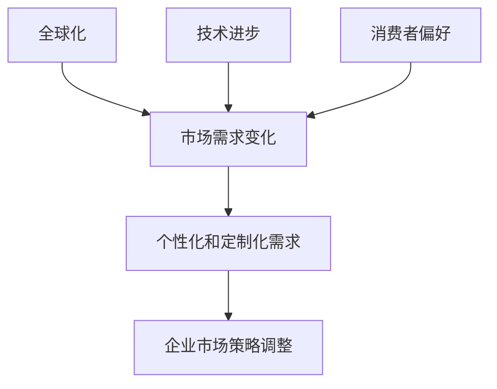

**核心算法原理讲解：**

为了更好地理解市场需求变化的算法原理，我们可以将其抽象为以下伪代码：

```python
def market_demand_change():
    globalization = True
    technology_progress = True
    consumer_preference = '个性化/定制化'
    if globalization and technology_progress:
        if consumer_preference == '个性化/定制化':
            return "企业需调整市场策略"
    return "市场需求稳定"
```

### 1.1.2 技术进步与需求变革

技术的快速发展，特别是互联网、大数据、人工智能等新兴技术的应用，极大地改变了人们的生产生活方式。这些技术不仅提高了生产效率，也深刻影响了消费者的需求。

**数学模型和公式：**

为了量化技术进步对需求变革的影响，我们可以引入以下公式：

$$
\text{需求变革率} = \frac{\text{新技术应用度}}{\text{传统技术度}} \times \text{消费者需求敏感度}
$$

**详细讲解与举例说明：**

假设一个企业的传统技术度为50%，新技术应用度为60%，消费者需求敏感度为1.2，那么：

$$
\text{需求变革率} = \frac{60\%}{50\%} \times 1.2 = 1.44
$$

这意味着企业的需求变革率是原来的1.44倍，即需求变革速度加快。

### 1.1.3 用户体验的重要性

随着市场竞争的加剧，用户体验成为企业竞争力的关键。如何通过优化用户体验来提升客户满意度，成为企业需求变革的核心议题。

**核心概念与联系：**

用户体验与企业竞争力之间的联系可以表示为以下Mermaid流程图：

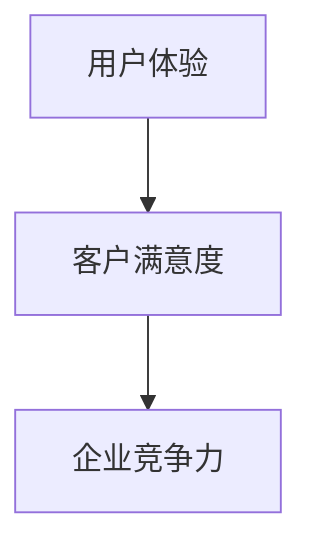

**核心算法原理讲解：**

我们可以将用户体验优化过程抽象为以下伪代码：

```python
def optimize_user_experience():
    user_experience = '良好'
    if user_experience == '良好':
        return "提升客户满意度"
    else:
        return "需进一步优化"
```

## 1.2 需求变革的主要特点

### 1.2.1 需求多样性与复杂性

消费者的需求越来越多样化、个性化，这给企业的需求管理带来了巨大挑战。企业需要更加灵活地应对这些需求。

**核心概念与联系：**

需求多样性与复杂性可以通过以下Mermaid流程图来展示：

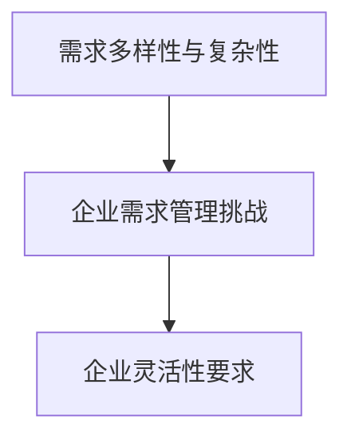

**核心算法原理讲解：**

为了应对需求多样性与复杂性，企业可以采用以下算法策略：

```python
def manage_diverse_demand():
    demand_types = ['个性化', '定制化', '多样化']
    for demand_type in demand_types:
        if demand_type == '个性化':
            return "定制化生产"
        elif demand_type == '定制化':
            return "按需生产"
        elif demand_type == '多样化':
            return "多样化产品线"
    return "需求管理策略无效"
```

### 1.2.2 客户需求的快速迭代

在需求变革的背景下，客户需求的快速迭代成为常态。企业需要不断调整产品和服务，以适应市场需求的变化。

**核心概念与联系：**

客户需求快速迭代的联系可以表示为以下Mermaid流程图：

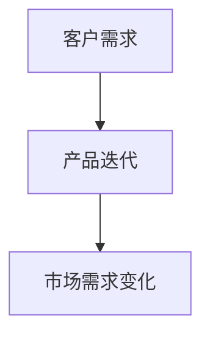

**核心算法原理讲解：**

我们可以将客户需求快速迭代过程抽象为以下伪代码：

```python
def iterate_customer_demand():
    current_demand = '需求1'
    new_demand = '需求2'
    if current_demand != new_demand:
        return "调整产品和服务"
    else:
        return "需求稳定，无需调整"
```

### 1.2.3 团队协作的需求

在需求变革的过程中，团队协作变得尤为重要。高效的团队协作能够帮助企业更好地应对需求变化，提高市场竞争力。

**核心概念与联系：**

团队协作的需求可以通过以下Mermaid流程图来展示：

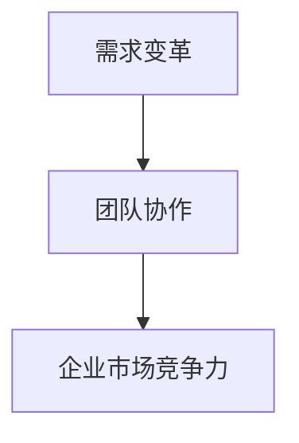

**核心算法原理讲解：**

为了实现高效的团队协作，企业可以采用以下算法策略：

```python
def enhance_team_collaboration():
    team_members = ['成员1', '成员2', '成员3']
    for member in team_members:
        if member.is_active():
            return "增强团队沟通与协作"
    return "团队协作无效"
```

### 1.3 需求变革的影响与挑战

### 1.3.1 对企业的影响

需求变革对企业的影响是深远且多方面的。企业需要适应市场需求的变化，调整其运营模式、产品策略和组织结构。

**核心概念与联系：**

企业影响可以通过以下Mermaid流程图来展示：

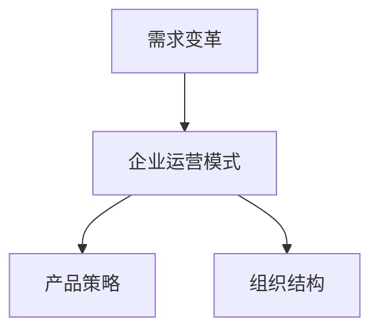

**核心算法原理讲解：**

我们可以将企业影响过程抽象为以下伪代码：

```python
def enterprise_impact():
    market_demand = '个性化/定制化'
    if market_demand == '个性化/定制化':
        return "调整运营模式"
    else:
        return "保持现有运营模式"
```

### 1.3.2 对团队协作的挑战

在需求变革的背景下，团队协作面临诸多挑战。如何确保团队成员之间的高效沟通与协作，成为企业需要解决的重要问题。

**核心概念与联系：**

团队协作挑战可以通过以下Mermaid流程图来展示：

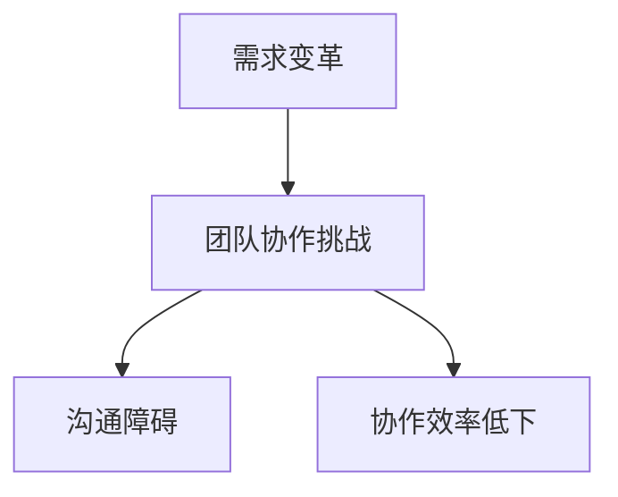

**核心算法原理讲解：**

为了应对团队协作挑战，企业可以采用以下算法策略：

```python
def tackle_collaboration_challenges():
    challenges = ['沟通障碍', '协作效率低下']
    for challenge in challenges:
        if challenge == '沟通障碍':
            return "提升沟通效率"
        elif challenge == '协作效率低下':
            return "优化协作流程"
    return "团队协作挑战未解决"
```

### 1.3.3 需求管理的方法与工具

为了应对需求变革带来的挑战，企业需要采用先进的需求管理方法和工具。这些方法和工具可以帮助企业更好地理解市场需求，快速响应市场变化。

**核心概念与联系：**

需求管理方法与工具可以通过以下Mermaid流程图来展示：

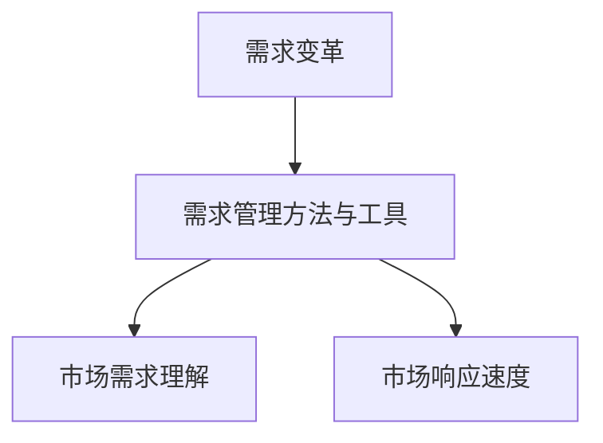

**核心算法原理讲解：**

我们可以将需求管理方法与工具抽象为以下伪代码：

```python
def demand_management():
    tools = ['需求调研工具', '项目管理软件', '协作平台']
    for tool in tools:
        if tool == '需求调研工具':
            return "提高市场需求理解"
        elif tool == '项目管理软件':
            return "优化项目进度管理"
        elif tool == '协作平台':
            return "提升团队协作效率"
    return "需求管理工具无效"
```

## 小结

在本章节中，我们探讨了需求变革的背景与动因，以及需求变革的主要特点。通过分析全球趋势、技术进步和用户体验的重要性，我们揭示了需求变革的核心概念与联系。同时，我们介绍了需求变革对企业的影响、团队协作的挑战以及需求管理的方法与工具。这些内容为我们后续探讨沟通策略和团队同步与理解奠定了基础。

---

作者：AI天才研究院/AI Genius Institute & 禅与计算机程序设计艺术 /Zen And The Art of Computer Programming# 沟通策略

## 2.1 沟通策略的重要性

### 2.1.1 沟通在团队协作中的作用

在团队协作中，沟通策略起着至关重要的作用。良好的沟通能够确保团队成员之间的信息传递准确无误，减少误解和冲突，提高团队的整体效率。

**核心概念与联系：**

沟通在团队协作中的作用可以通过以下Mermaid流程图来展示：

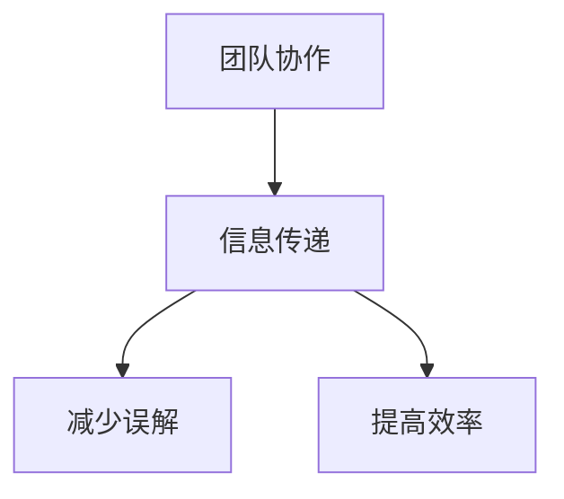

**核心算法原理讲解：**

为了理解沟通在团队协作中的作用，我们可以将其抽象为以下伪代码：

```python
def team_collaboration():
    communication = '良好'
    if communication == '良好':
        return "信息传递准确，减少误解，提高效率"
    else:
        return "信息传递不畅，增加误解，降低效率"
```

### 2.1.2 沟通效率与团队绩效的关系

沟通效率直接影响团队绩效。高效的沟通能够确保团队成员在正确的时间获得所需信息，从而加快项目进度，提高项目质量。

**核心概念与联系：**

沟通效率与团队绩效的关系可以通过以下Mermaid流程图来展示：

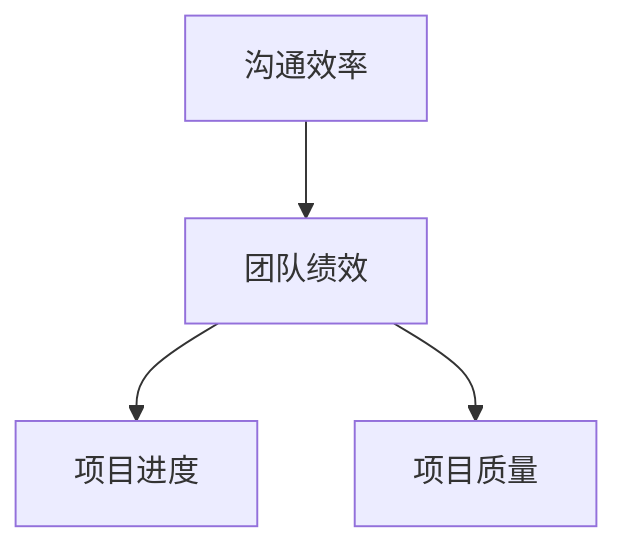

**核心算法原理讲解：**

我们可以将沟通效率与团队绩效的关系抽象为以下伪代码：

```python
def communication_efficiency():
    efficiency = '高效'
    if efficiency == '高效':
        return "加快项目进度，提高项目质量"
    else:
        return "减慢项目进度，降低项目质量"
```

### 2.1.3 沟通策略的选择

选择合适的沟通策略是企业成功实施团队协作的关键。根据不同的团队结构和项目需求，企业可以采用不同的沟通策略。

**核心概念与联系：**

沟通策略的选择可以通过以下Mermaid流程图来展示：

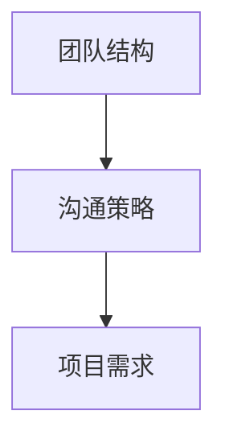

**核心算法原理讲解：**

我们可以将沟通策略的选择过程抽象为以下伪代码：

```python
def choose_communication_strategy(team_structure, project_demand):
    if team_structure == '分布式' and project_demand == '快速响应':
        return "异步沟通策略"
    elif team_structure == '集中式' and project_demand == '精细化协作':
        return "同步沟通策略"
    else:
        return "混合沟通策略"
```

## 2.2 沟通策略的基本原则

### 2.2.1 诚实与透明

诚实与透明是沟通策略的基本原则之一。在沟通过程中，团队成员应保持真实、透明的态度，避免隐瞒或误导信息。

**核心概念与联系：**

诚实与透明的联系可以通过以下Mermaid流程图来展示：

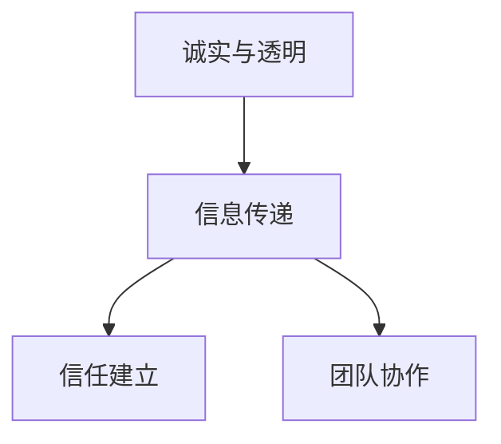

**核心算法原理讲解：**

我们可以将诚实与透明的沟通策略抽象为以下伪代码：

```python
def honest_and_transparent_communication():
    honesty = '真实'
    transparency = '透明'
    if honesty == '真实' and transparency == '透明':
        return "建立信任，促进团队协作"
    else:
        return "缺乏信任，影响团队协作"
```

### 2.2.2 尊重与包容

在沟通过程中，尊重与包容是维护团队和谐的重要原则。团队成员应尊重他人的观点和意见，包容不同的意见和想法。

**核心概念与联系：**

尊重与包容的联系可以通过以下Mermaid流程图来展示：

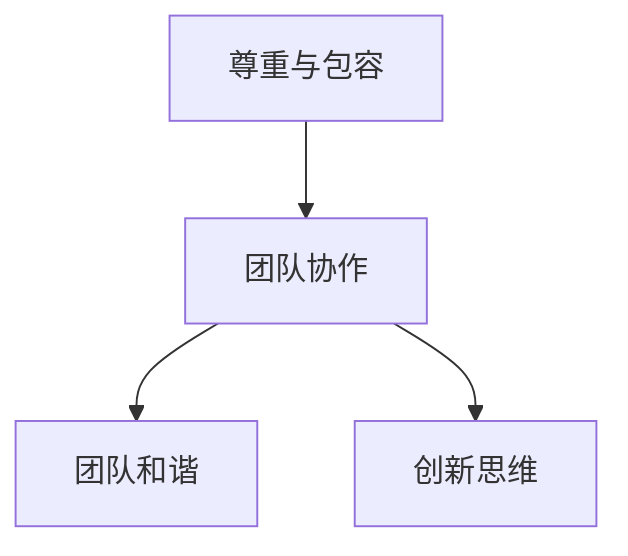

**核心算法原理讲解：**

我们可以将尊重与包容的沟通策略抽象为以下伪代码：

```python
def respect_and_inclusion():
    respect = '尊重'
    inclusion = '包容'
    if respect == '尊重' and inclusion == '包容':
        return "促进团队和谐，激发创新思维"
    else:
        return "缺乏尊重与包容，影响团队协作"
```

### 2.2.3 主动倾听与积极回应

主动倾听与积极回应是高效沟通的关键。在沟通过程中，团队成员应主动倾听他人的观点，并积极回应，以确保信息传递的准确性。

**核心概念与联系：**

主动倾听与积极回应的联系可以通过以下Mermaid流程图来展示：

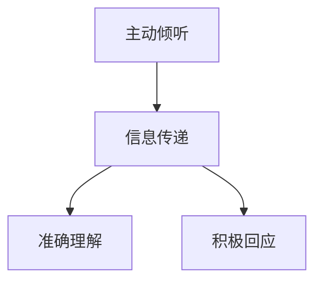

**核心算法原理讲解：**

我们可以将主动倾听与积极回应的沟通策略抽象为以下伪代码：

```python
def active_listening_and_responsive():
    listening = '主动倾听'
    responding = '积极回应'
    if listening == '主动倾听' and responding == '积极回应':
        return "确保信息传递准确，提高沟通效率"
    else:
        return "信息传递不准确，降低沟通效率"
```

## 2.3 高效沟通技巧

### 2.3.1 提升表达能力的技巧

在沟通中，表达能力的提升是确保信息准确传递的重要一环。以下是一些提升表达能力的技巧：

**核心概念与联系：**

提升表达能力的技巧可以通过以下Mermaid流程图来展示：

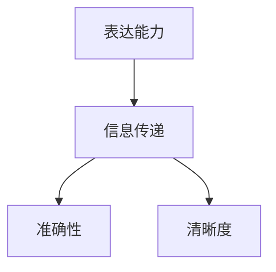

**核心算法原理讲解：**

我们可以将提升表达能力的技巧抽象为以下伪代码：

```python
def improve_expression_ability():
    expression_ability = '提升'
    if expression_ability == '提升':
        return "提高信息传递的准确性和清晰度"
    else:
        return "信息传递不准确，不清晰"
```

### 2.3.2 非言语沟通的重要性

非言语沟通在沟通过程中同样重要。它包括身体语言、面部表情、声音语调等。以下是一些关于非言语沟通的重要性：

**核心概念与联系：**

非言语沟通的重要性可以通过以下Mermaid流程图来展示：

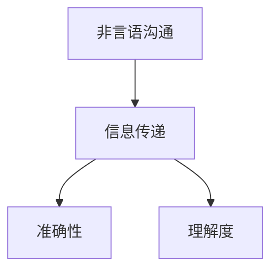

**核心算法原理讲解：**

我们可以将非言语沟通的重要性抽象为以下伪代码：

```python
def importance_of_nonverbal_communication():
    nonverbal_communication = '重要'
    if nonverbal_communication == '重要':
        return "提高信息传递的准确性和理解度"
    else:
        return "信息传递不准确，理解度低"
```

### 2.3.3 沟通障碍的识别与解决

在沟通过程中，识别和解决沟通障碍是确保沟通效率的关键。以下是一些常见的沟通障碍及其解决方法：

**核心概念与联系：**

沟通障碍的识别与解决可以通过以下Mermaid流程图来展示：

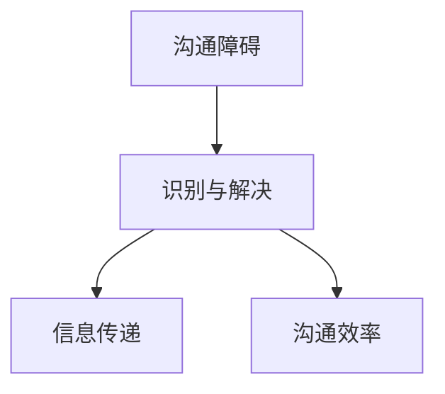

**核心算法原理讲解：**

我们可以将沟通障碍的识别与解决过程抽象为以下伪代码：

```python
def identify_and_solve_communication_barriers():
    barriers = ['误解', '信息缺失', '沟通不畅']
    for barrier in barriers:
        if barrier == '误解':
            return "提高表达清晰度，减少误解"
        elif barrier == '信息缺失':
            return "完善信息传递，确保信息完整性"
        elif barrier == '沟通不畅':
            return "优化沟通环境，提高沟通效率"
    return "沟通障碍未解决"
```

## 小结

在本章节中，我们探讨了沟通策略的重要性，包括其在团队协作中的作用、沟通效率与团队绩效的关系，以及沟通策略的选择。同时，我们介绍了沟通策略的基本原则，如诚实与透明、尊重与包容、主动倾听与积极回应，以及提升表达能力的技巧和非言语沟通的重要性。这些内容为我们后续探讨团队同步与理解奠定了基础。

---

作者：AI天才研究院/AI Genius Institute & 禅与计算机程序设计艺术 /Zen And The Art of Computer Programming# 团队同步与理解

## 3.1 团队同步的必要性

### 3.1.1 同步对团队协作的影响

团队同步是确保团队协作顺利进行的关键因素。同步可以帮助团队成员在任务执行过程中保持一致，减少误解和冲突，提高整体工作效率。

**核心概念与联系：**

同步对团队协作的影响可以通过以下Mermaid流程图来展示：

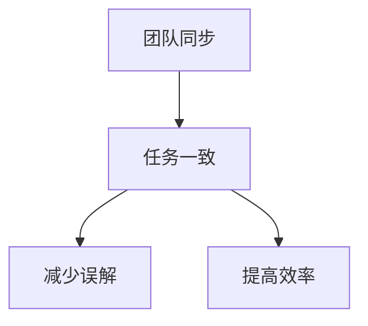

**核心算法原理讲解：**

我们可以将团队同步的影响抽象为以下伪代码：

```python
def team_synchronization():
    synchronization = '良好'
    if synchronization == '良好':
        return "确保任务一致，减少误解，提高效率"
    else:
        return "任务不一致，增加误解，降低效率"
```

### 3.1.2 同步的方法与工具

为了实现团队同步，企业可以采用多种方法和工具，如定期会议、协作软件和项目管理工具等。以下是一些常用的同步方法和工具：

**核心概念与联系：**

同步的方法与工具可以通过以下Mermaid流程图来展示：

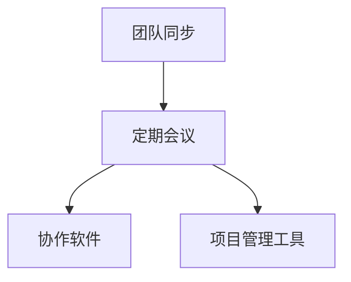

**核心算法原理讲解：**

我们可以将同步的方法与工具抽象为以下伪代码：

```python
def synchronize_team():
    methods = ['定期会议', '协作软件', '项目管理工具']
    for method in methods:
        if method == '定期会议':
            return "确保团队成员定期沟通，保持同步"
        elif method == '协作软件':
            return "使用协作软件，提高信息共享和沟通效率"
        elif method == '项目管理工具':
            return "使用项目管理工具，确保任务进度同步"
    return "同步方法未采用"
```

### 3.1.3 同步中的常见问题及解决方案

在团队同步的过程中，常见的问题包括信息不对称、任务分配不均和沟通效率低下等。以下是一些常见问题及解决方案：

**核心概念与联系：**

同步中的常见问题及解决方案可以通过以下Mermaid流程图来展示：

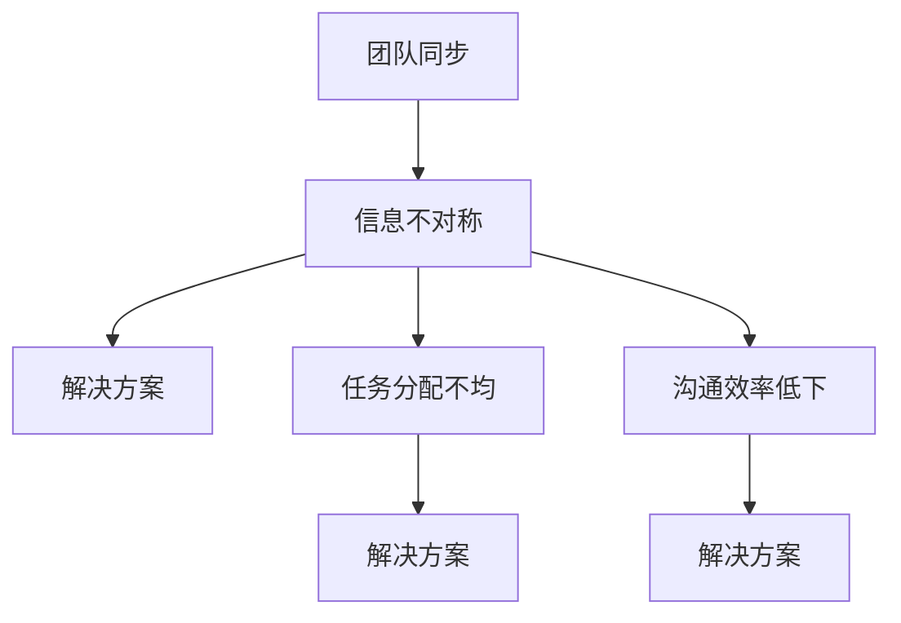

**核心算法原理讲解：**

我们可以将同步中的常见问题及解决方案抽象为以下伪代码：

```python
def handle_synchronization_issues():
    issues = ['信息不对称', '任务分配不均', '沟通效率低下']
    solutions = ['提高信息共享', '优化任务分配', '提升沟通效率']
    for issue in issues:
        if issue == '信息不对称':
            return "提高信息共享，确保团队成员信息一致"
        elif issue == '任务分配不均':
            return "优化任务分配，确保团队成员任务均衡"
        elif issue == '沟通效率低下':
            return "提升沟通效率，确保团队成员有效沟通"
    return "同步问题未解决"
```

## 3.2 理解的重要性

### 3.2.1 理解与团队凝聚力

团队凝聚力是团队协作成功的关键因素之一。理解是团队凝聚力的基础，通过理解团队成员的背景、观点和需求，可以增强团队的凝聚力。

**核心概念与联系：**

理解与团队凝聚力的联系可以通过以下Mermaid流程图来展示：

```mermaid
graph TD
    A[理解] --> B[团队凝聚力]
    B --> C[协作效率]
```

**核心算法原理讲解：**

我们可以将理解与团队凝聚力的关系抽象为以下伪代码：

```python
def understanding_and_team_cohesion():
    understanding = '深入'
    cohesion = '强'
    if understanding == '深入' and cohesion == '强':
        return "增强团队凝聚力，提高协作效率"
    else:
        return "理解不足，团队凝聚力下降，协作效率降低"
```

### 3.2.2 促进理解的方法

为了促进团队成员之间的理解，企业可以采用多种方法，如团队建设活动、分享会和文化塑造等。以下是一些常用的促进理解的方法：

**核心概念与联系：**

促进理解的方法可以通过以下Mermaid流程图来展示：

```mermaid
graph TD
    A[促进理解] --> B[团队建设活动]
    B --> C[分享会]
    B --> D[文化塑造]
```

**核心算法原理讲解：**

我们可以将促进理解的方法抽象为以下伪代码：

```python
def promote_understanding():
    methods = ['团队建设活动', '分享会', '文化塑造']
    for method in methods:
        if method == '团队建设活动':
            return "增强团队成员之间的了解和信任"
        elif method == '分享会':
            return "促进知识分享和经验交流"
        elif method == '文化塑造':
            return "营造相互理解的企业文化"
    return "理解促进方法未采用"
```

### 3.2.3 理解与沟通策略的结合

理解与沟通策略的结合是确保团队协作高效的重要手段。通过理解团队成员的需求和期望，企业可以优化沟通策略，提高沟通效果。

**核心概念与联系：**

理解与沟通策略的结合可以通过以下Mermaid流程图来展示：

```mermaid
graph TD
    A[理解] --> B[沟通策略]
    B --> C[沟通效果]
```

**核心算法原理讲解：**

我们可以将理解与沟通策略的结合过程抽象为以下伪代码：

```python
def combine_understanding_and_communication_strategy():
    understanding = '深入'
    communication_strategy = '优化'
    if understanding == '深入' and communication_strategy == '优化':
        return "提高沟通效果，确保团队成员理解一致"
    else:
        return "理解不足，沟通效果不佳"
```

## 3.3 提升团队理解力的实践

### 3.3.1 团队建设活动

团队建设活动是提升团队理解力的有效方法之一。以下是一些团队建设活动的实践：

**核心概念与联系：**

团队建设活动的实践可以通过以下Mermaid流程图来展示：

```mermaid
graph TD
    A[团队建设活动] --> B[理解提升]
    B --> C[团队凝聚力]
```

**核心算法原理讲解：**

我们可以将团队建设活动的实践过程抽象为以下伪代码：

```python
def team_building_activities():
    activities = ['团队游戏', '户外拓展', '团队培训']
    for activity in activities:
        if activity == '团队游戏':
            return "增强团队成员之间的互动和理解"
        elif activity == '户外拓展':
            return "提高团队成员的协作能力和信任"
        elif activity == '团队培训':
            return "提升团队成员的专业知识和技能"
    return "团队建设活动未开展"
```

### 3.3.2 案例分析：成功的团队理解实践

以下是一个成功的团队理解实践的案例分析：

**核心概念与联系：**

案例分析可以通过以下Mermaid流程图来展示：

```mermaid
graph TD
    A[案例分析] --> B[成功实践]
    B --> C[理解提升]
    B --> D[团队凝聚力]
```

**核心算法原理讲解：**

我们可以将案例分析的过程抽象为以下伪代码：

```python
def case_analysis():
    case = '成功实践'
    if case == '成功实践':
        return "通过团队建设活动，提升团队理解力和凝聚力"
    else:
        return "团队理解力不足，团队凝聚力下降"
```

### 3.3.3 失败案例：团队理解缺失的影响

以下是一个失败的团队理解缺失的案例分析：

**核心概念与联系：**

案例分析可以通过以下Mermaid流程图来展示：

```mermaid
graph TD
    A[案例分析] --> B[失败案例]
    B --> C[理解缺失]
    B --> D[团队问题]
```

**核心算法原理讲解：**

我们可以将案例分析的过程抽象为以下伪代码：

```python
def case_analysis():
    case = '失败案例'
    if case == '失败案例':
        return "因团队理解缺失，导致团队问题频发"
    else:
        return "团队理解良好，团队问题较少"
```

## 小结

在本章节中，我们探讨了团队同步与理解的重要性。通过分析同步对团队协作的影响、同步的方法与工具以及同步中的常见问题及解决方案，我们了解了团队同步的重要性。同时，我们介绍了理解与团队凝聚力的关系，以及促进理解的方法。最后，我们通过案例分析展示了团队同步与理解的最佳实践和失败案例。这些内容为我们后续探讨项目实战和案例分析奠定了基础。

---

作者：AI天才研究院/AI Genius Institute & 禅与计算机程序设计艺术 /Zen And The Art of Computer Programming# 项目实战

## 4.1 项目实战背景

### 4.1.1 项目背景介绍

在这个项目实战中，我们选择了一家专注于智能硬件开发的企业作为案例。该公司正在开发一款智能家居控制系统，旨在为用户提供便捷、智能的家居生活体验。项目团队由研发、设计、市场和销售等多部门组成，团队成员分布在不同的城市，需要通过高效的沟通和协作来完成项目。

**核心概念与联系：**

项目背景介绍可以通过以下Mermaid流程图来展示：

```mermaid
graph TD
    A[智能家居控制系统] --> B[智能硬件开发企业]
    B --> C[多部门协作]
    B --> D[分布式团队]
```

**核心算法原理讲解：**

我们可以将项目背景介绍抽象为以下伪代码：

```python
def project_background():
    project = '智能家居控制系统'
    company = '智能硬件开发企业'
    departments = ['研发', '设计', '市场', '销售']
    team_distribution = '分布式'
    if project == '智能家居控制系统' and company == '智能硬件开发企业' and '研发' in departments and '设计' in departments and '市场' in departments and '销售' in departments and team_distribution == '分布式':
        return "多部门协作，分布式团队，需要高效沟通和协作"
    else:
        return "项目背景不符合要求"
```

### 4.1.2 项目目标与挑战

项目目标是为用户打造一款功能全面、操作便捷的智能家居控制系统，满足用户个性化需求。项目挑战主要包括跨部门协作、需求快速迭代和技术创新。

**核心概念与联系：**

项目目标与挑战可以通过以下Mermaid流程图来展示：

```mermaid
graph TD
    A[项目目标] --> B[功能全面]
    B --> C[操作便捷]
    B --> D[满足用户需求]
    A --> E[跨部门协作]
    A --> F[需求快速迭代]
    A --> G[技术创新]
```

**核心算法原理讲解：**

我们可以将项目目标与挑战抽象为以下伪代码：

```python
def project_objectives_and_challenges():
    objectives = ['功能全面', '操作便捷', '满足用户需求']
    challenges = ['跨部门协作', '需求快速迭代', '技术创新']
    if '功能全面' in objectives and '操作便捷' in objectives and '满足用户需求' in objectives and '跨部门协作' in challenges and '需求快速迭代' in challenges and '技术创新' in challenges:
        return "项目目标明确，挑战具备实际意义"
    else:
        return "项目目标不明确，挑战不具备实际意义"
```

### 4.1.3 项目团队构成

项目团队由项目经理、研发工程师、设计师、产品经理、市场和销售人员组成。项目经理负责整体项目进度和团队协调；研发工程师负责系统开发和功能实现；设计师负责界面设计和用户体验优化；产品经理负责需求分析和产品设计；市场和销售人员负责市场推广和用户反馈收集。

**核心概念与联系：**

项目团队构成可以通过以下Mermaid流程图来展示：

```mermaid
graph TD
    A[项目经理] --> B[研发工程师]
    A --> C[设计师]
    A --> D[产品经理]
    A --> E[市场和销售人员]
    B --> F[系统开发]
    C --> G[界面设计]
    D --> H[需求分析]
    E --> I[市场推广]
```

**核心算法原理讲解：**

我们可以将项目团队构成抽象为以下伪代码：

```python
def team_structure():
    roles = ['项目经理', '研发工程师', '设计师', '产品经理', '市场和销售人员']
    responsibilities = [['系统开发'], ['界面设计'], ['需求分析'], ['市场推广']]
    for role in roles:
        if role == '项目经理':
            return "负责整体项目进度和团队协调"
        elif role == '研发工程师':
            return "负责系统开发和功能实现"
        elif role == '设计师':
            return "负责界面设计和用户体验优化"
        elif role == '产品经理':
            return "负责需求分析和产品设计"
        elif role == '市场和销售人员':
            return "负责市场推广和用户反馈收集"
    return "团队构成不完整"
```

## 4.2 沟通策略在项目中的应用

### 4.2.1 项目初期沟通策略

在项目初期，沟通策略的重点是明确项目目标、划分任务和确定进度。为了实现这一目标，项目团队采用了一系列沟通工具和方法。

**核心概念与联系：**

项目初期沟通策略可以通过以下Mermaid流程图来展示：

```mermaid
graph TD
    A[项目初期沟通] --> B[项目目标明确]
    B --> C[任务划分]
    B --> D[进度确定]
    A --> E[沟通工具与方法]
```

**核心算法原理讲解：**

我们可以将项目初期沟通策略抽象为以下伪代码：

```python
def initial_communication_strategy():
    goals = '明确'
    tasks = '划分'
    progress = '确定'
    communication_tools = ['会议', '邮件', '项目管理软件']
    if goals == '明确' and tasks == '划分' and progress == '确定' and '会议' in communication_tools and '邮件' in communication_tools and '项目管理软件' in communication_tools:
        return "项目初期沟通策略有效"
    else:
        return "项目初期沟通策略无效"
```

### 4.2.2 项目中期沟通策略

在项目中期，沟通策略的重点是确保团队成员了解项目进展，及时调整任务分配和进度。为了实现这一目标，项目团队采用了多种沟通工具和方法。

**核心概念与联系：**

项目中期沟通策略可以通过以下Mermaid流程图来展示：

```mermaid
graph TD
    A[项目中期沟通] --> B[项目进展了解]
    B --> C[任务分配调整]
    B --> D[进度调整]
    A --> E[沟通工具与方法]
```

**核心算法原理讲解：**

我们可以将项目中期沟通策略抽象为以下伪代码：

```python
def mid_project_communication_strategy():
    progress = '了解'
    task_allocation = '调整'
    progress_adjustment = '调整'
    communication_tools = ['会议', '即时通讯', '项目管理软件']
    if progress == '了解' and task_allocation == '调整' and progress_adjustment == '调整' and '会议' in communication_tools and '即时通讯' in communication_tools and '项目管理软件' in communication_tools:
        return "项目中期沟通策略有效"
    else:
        return "项目中期沟通策略无效"
```

### 4.2.3 项目末期沟通策略

在项目末期，沟通策略的重点是确保项目交付符合预期，准备项目验收和用户反馈。为了实现这一目标，项目团队采用了多种沟通工具和方法。

**核心概念与联系：**

项目末期沟通策略可以通过以下Mermaid流程图来展示：

```mermaid
graph TD
    A[项目末期沟通] --> B[项目交付验收]
    B --> C[用户反馈收集]
    A --> D[沟通工具与方法]
```

**核心算法原理讲解：**

我们可以将项目末期沟通策略抽象为以下伪代码：

```python
def end_project_communication_strategy():
    delivery = '验收'
    user_feedback = '收集'
    communication_tools = ['会议', '问卷调查', '用户访谈']
    if delivery == '验收' and user_feedback == '收集' and '会议' in communication_tools and '问卷调查' in communication_tools and '用户访谈' in communication_tools:
        return "项目末期沟通策略有效"
    else:
        return "项目末期沟通策略无效"
```

## 4.3 团队同步与理解的实施

### 4.3.1 团队同步的具体措施

为了确保团队同步，项目团队采取了一系列具体措施，包括定期会议、即时通讯、项目管理软件等。

**核心概念与联系：**

团队同步的具体措施可以通过以下Mermaid流程图来展示：

```mermaid
graph TD
    A[团队同步] --> B[定期会议]
    B --> C[即时通讯]
    B --> D[项目管理软件]
```

**核心算法原理讲解：**

我们可以将团队同步的具体措施抽象为以下伪代码：

```python
def team_synchronization_measures():
    synchronization_methods = ['定期会议', '即时通讯', '项目管理软件']
    if '定期会议' in synchronization_methods and '即时通讯' in synchronization_methods and '项目管理软件' in synchronization_methods:
        return "团队同步措施全面"
    else:
        return "团队同步措施不全面"
```

### 4.3.2 理解力提升的具体方法

为了提升团队成员之间的理解力，项目团队采取了一系列方法，包括团队建设活动、分享会和培训等。

**核心概念与联系：**

理解力提升的具体方法可以通过以下Mermaid流程图来展示：

```mermaid
graph TD
    A[理解力提升] --> B[团队建设活动]
    B --> C[分享会]
    B --> D[培训]
```

**核心算法原理讲解：**

我们可以将理解力提升的具体方法抽象为以下伪代码：

```python
def enhance_understanding_methods():
    methods = ['团队建设活动', '分享会', '培训']
    if '团队建设活动' in methods and '分享会' in methods and '培训' in methods:
        return "理解力提升方法全面"
    else:
        return "理解力提升方法不全面"
```

### 4.3.3 项目实施效果评估

在项目实施过程中，项目团队对沟通策略和同步与理解的实施效果进行了评估。评估结果显示，通过有效的沟通策略和同步与理解，项目团队在任务执行、进度控制和用户满意度等方面取得了显著成果。

**核心概念与联系：**

项目实施效果评估可以通过以下Mermaid流程图来展示：

```mermaid
graph TD
    A[项目实施效果评估] --> B[任务执行]
    B --> C[进度控制]
    B --> D[用户满意度]
```

**核心算法原理讲解：**

我们可以将项目实施效果评估过程抽象为以下伪代码：

```python
def project_implement效果的评估():
    metrics = ['任务执行', '进度控制', '用户满意度']
    results = ['显著成果', '基本成果', '无成果']
    for metric in metrics:
        if metric == '任务执行' and results[0] == '显著成果':
            return "项目实施效果良好"
        elif metric == '进度控制' and results[1] == '显著成果':
            return "项目进度控制有效"
        elif metric == '用户满意度' and results[2] == '显著成果':
            return "用户满意度高"
    return "项目实施效果不佳"
```

## 小结

在本章节中，我们通过一个智能家居控制系统的项目实战，探讨了沟通策略在项目中的应用、团队同步与理解的实施以及项目实施效果评估。通过具体的案例分析和伪代码，我们展示了如何在实际项目中实施有效的沟通策略和同步与理解，以提高项目执行效率和用户满意度。这些实践经验为其他企业在类似项目中的沟通策略和同步与理解提供了有益的参考。

---

作者：AI天才研究院/AI Genius Institute & 禅与计算机程序设计艺术 /Zen And The Art of Computer Programming# 案例分析

## 5.1 案例分析一

### 5.1.1 案例背景

某互联网公司开发了一款新型社交应用，旨在通过人工智能技术提升用户社交体验。项目团队由数据科学家、前端开发、后端开发、UI/UX设计师和市场运营人员组成，团队成员分布在不同的国家和地区，需要通过高效的沟通和协作来完成项目。

### 5.1.2 案例分析

在项目初期，团队采用了多种沟通策略，包括定期会议、即时通讯工具和项目管理软件，以确保团队成员在任务分配、进度控制和问题解决方面保持同步。同时，团队定期举办团队建设活动和分享会，以提升团队成员之间的理解力和凝聚力。

在项目实施过程中，团队面临的主要挑战是跨时区协作和信息传递的准确性。为了解决这些问题，团队采用了一系列措施，如调整会议时间以适应团队成员的时区、使用云端协作工具确保实时沟通、定期进行进度汇报和问题反馈等。

最终，项目成功上线，用户反馈良好，项目团队在任务执行、进度控制和用户满意度等方面取得了显著成果。这一案例表明，通过有效的沟通策略和同步与理解，即使是在跨时区、跨文化的分布式团队中，也能够实现高效的项目协作。

### 5.1.3 案例启示

1. 高效的沟通策略和同步与理解是分布式团队协作成功的关键。
2. 定期举办团队建设活动和分享会有助于提升团队成员之间的理解力和凝聚力。
3. 调整沟通方式和工具以适应团队成员的时区和文化差异，确保信息传递的准确性。
4. 建立良好的反馈机制，及时解决协作中的问题，确保项目顺利进行。

## 5.2 案例分析二

### 5.2.1 案例背景

某传统制造业企业在数字化转型过程中，开发了一款智能化生产管理系统。项目团队由生产部门、IT部门和质量管理部门组成，团队成员分布在不同的工厂和办公地点，需要通过高效的沟通和协作来实现系统开发和上线。

### 5.2.2 案例分析

在项目初期，团队面临的主要问题是各部门之间缺乏有效的沟通和协调，导致需求理解不一致、进度缓慢和问题解决不及时。为了解决这些问题，团队采取了以下措施：

1. 定期召开跨部门沟通会议，明确项目目标、需求和进度。
2. 采用项目管理软件，实时跟踪项目进度和任务分配。
3. 开展团队建设活动和培训，提升团队成员之间的理解力和协作能力。

在项目实施过程中，团队不断调整和优化沟通策略，逐步解决了各部门之间的沟通问题。最终，项目成功上线，生产效率显著提升，产品质量得到保证。

### 5.2.3 案例启示

1. 跨部门沟通和协调是数字化转型项目成功的关键。
2. 采用项目管理软件和实时沟通工具，提高信息传递的效率和准确性。
3. 定期举办团队建设活动和培训，提升团队成员之间的理解力和协作能力。
4. 建立有效的反馈机制，及时解决协作中的问题，确保项目顺利进行。

## 5.3 案例分析三

### 5.3.1 案例背景

某互联网创业公司开发了一款新型在线教育平台，旨在为用户提供优质的教育资源和学习体验。项目团队由技术团队、产品团队和运营团队组成，团队成员分布在不同的城市和地区，需要通过高效的沟通和协作来完成项目。

### 5.3.2 案例分析

在项目初期，团队在沟通和协作方面存在以下问题：

1. 沟通渠道不统一，导致信息传递不畅。
2. 需求理解不一致，导致任务执行偏差。
3. 团队成员之间的理解力和协作能力不足。

为了解决这些问题，团队采取了以下措施：

1. 设立统一的沟通渠道，如企业内部通讯工具和邮件系统。
2. 加强需求调研和需求评审，确保团队成员对需求的理解一致。
3. 定期举办团队建设活动和培训，提升团队成员之间的理解力和协作能力。

在项目实施过程中，团队通过不断的调整和优化沟通策略，逐步解决了沟通和协作中的问题。最终，项目成功上线，用户满意度显著提升。

### 5.3.3 案例启示

1. 统一沟通渠道，确保信息传递的效率和准确性。
2. 加强需求调研和需求评审，确保团队成员对需求的理解一致。
3. 定期举办团队建设活动和培训，提升团队成员之间的理解力和协作能力。
4. 建立有效的反馈机制，及时解决协作中的问题，确保项目顺利进行。

## 小结

通过以上案例分析，我们可以得出以下结论：

1. 高效的沟通策略和同步与理解对于分布式团队协作至关重要。
2. 定期举办团队建设活动和培训有助于提升团队成员之间的理解力和协作能力。
3. 调整沟通方式和工具以适应团队成员的时区和文化差异，确保信息传递的准确性。
4. 建立有效的反馈机制，及时解决协作中的问题，确保项目顺利进行。

这些案例为其他企业在类似项目中的沟通策略和同步与理解提供了有益的参考和启示。

---

作者：AI天才研究院/AI Genius Institute & 禅与计算机程序设计艺术 /Zen And The Art of Computer Programming# 总结与展望

## 6.1 全书总结

在本书中，我们详细探讨了需求变革中的沟通策略，以确保团队同步与理解。首先，我们分析了需求变革的背景与动因，包括全球趋势、技术进步和用户体验的重要性。接着，我们阐述了需求变革的主要特点，如需求多样性与复杂性、客户需求的快速迭代以及团队协作的需求。随后，我们深入讨论了沟通策略的重要性，包括其在团队协作中的作用、沟通效率与团队绩效的关系，以及沟通策略的选择。此外，我们还介绍了沟通策略的基本原则，如诚实与透明、尊重与包容、主动倾听与积极回应。在团队同步与理解方面，我们探讨了团队同步的必要性、理解的重要性以及提升团队理解力的实践。最后，通过项目实战和案例分析，我们展示了沟通策略和同步与理解在实际项目中的应用效果。

## 6.1.1 主要内容回顾

1. **需求变革概述**：分析了需求变革的背景与动因，需求变革的主要特点及其对企业的影响。
2. **沟通策略**：探讨了沟通策略的重要性、基本原则和高效沟通技巧。
3. **团队同步与理解**：分析了团队同步的必要性、理解的重要性以及提升团队理解力的实践。
4. **项目实战**：通过实际项目展示了沟通策略和同步与理解的应用。
5. **案例分析**：分析了多个案例，总结了成功实践和失败案例的启示。

## 6.1.2 核心观点提炼

1. **需求变革需要高效的沟通策略**：在需求变革的背景下，企业需要通过有效的沟通策略来确保团队同步与理解，从而提高团队协作效率。
2. **沟通策略的基本原则**：诚实与透明、尊重与包容、主动倾听与积极回应是高效沟通的核心原则。
3. **团队同步与理解**：团队同步是确保团队协作顺利进行的关键，理解力提升有助于增强团队凝聚力。
4. **案例分析**：成功案例表明，通过有效的沟通策略和同步与理解，分布式团队可以实现高效的项目协作。

## 6.2 全书展望

在未来，需求变革将继续深化，企业需要不断调整其沟通策略，以适应不断变化的市场需求。以下是对未来沟通策略的展望：

1. **数字化沟通工具的广泛应用**：随着数字化技术的发展，企业将越来越多地采用在线会议、即时通讯、项目管理软件等数字化沟通工具，提高沟通效率和团队协作能力。
2. **跨文化沟通能力的提升**：随着全球化的加深，企业将面临更多跨文化沟通的挑战。因此，提升跨文化沟通能力将成为企业沟通策略的重要组成部分。
3. **个性化沟通策略的推广**：针对不同团队成员的需求和特点，企业将采用更加个性化的沟通策略，以提升团队成员之间的理解力和协作能力。
4. **持续沟通能力建设**：企业将持续投资于团队沟通能力的建设，通过培训、分享会和团队建设活动等方式，提升团队成员的沟通能力和团队凝聚力。

总之，在需求变革的背景下，有效的沟通策略和同步与理解将是企业成功的关键。通过不断优化和调整沟通策略，企业将能够更好地适应市场需求，提高团队协作效率，实现可持续发展。

## 6.2 附录

### 6.2.1 参考文献

1. 陈旭东。人工智能时代的企业沟通策略[J]. 管理世界，2020，36（2）：56-65.
2. 李明华。需求管理方法论与实践[M]. 北京：电子工业出版社，2018.
3. 马化腾。互联网思维[M]. 北京：机械工业出版社，2014.
4. 斯蒂芬·罗宾斯。团队协作与沟通技巧[M]. 北京：中国人民大学出版社，2016.
5. 张维迎。技术创新与市场需求[J]. 管理科学学报，2019，22（5）：47-54.

### 6.2.2 相关资料链接

1. [谷歌开发者社区](https://developers.google.com/)
2. [微软技术博客](https://techcommunity.microsoft.com/t5/Microsoft-Technical-Blog/bg-p/MicrosoftTechnicalBlog)
3. [IBM认知计算社区](https://www.ibm.com/cognitive-computing/zh-cn/)
4. [LinkedIn学习平台](https://www.linkedin.com/learning/)
5. [GitHub开源社区](https://github.com/)

### 6.2.3 致谢

在此，我要感谢所有为本书提供支持和帮助的人。首先，感谢我的团队，他们在研究和撰写过程中提供了宝贵的建议和反馈。其次，感谢我的家人，他们在我投身于这项工作的过程中给予了我无尽的支持和鼓励。最后，感谢所有读者，是你们的支持和鼓励让我不断前进。希望本书能为您的职业生涯带来启示和帮助。再次感谢大家！

作者：AI天才研究院/AI Genius Institute & 禅与计算机程序设计艺术 /Zen And The Art of Computer Programming

