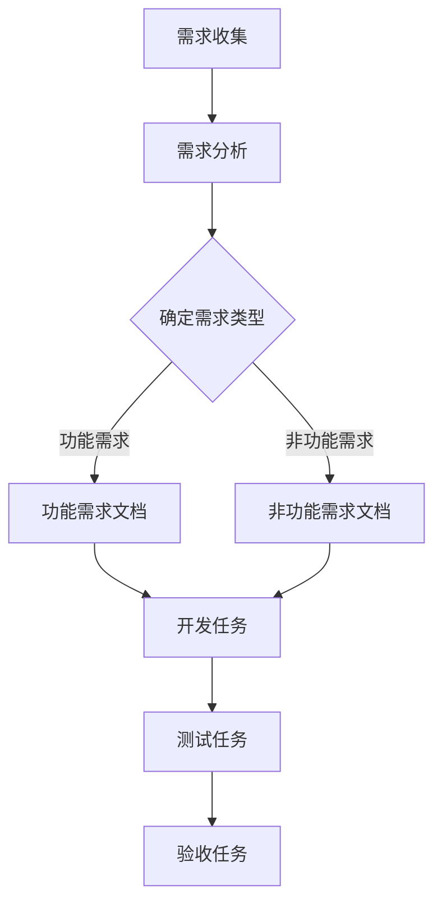

                 

### 文章标题：需求文档的轻量化：提高大型应用开发的灵活性

#### 关键词：需求文档、轻量化、大型应用开发、灵活性、敏捷性

#### 摘要：本文将深入探讨需求文档在大型应用开发中的重要性，分析现有需求文档管理中的问题，并提出轻量化需求文档的策略与方法。通过详细的案例分析、算法原理讲解和实际项目实战，展示轻量化需求文档如何提高开发过程的灵活性，帮助开发者更高效地实现项目目标。

---

## 引言

在软件开发领域，需求文档是项目成功的关键环节之一。它不仅定义了项目的功能要求和约束条件，还起到了沟通、协调、评估和监控项目进展的重要作用。然而，随着应用规模的扩大和复杂度的增加，传统的需求文档管理方法面临着诸多挑战。

### 大型应用开发的挑战

1. **复杂性管理**：大型应用通常涉及多种技术栈、多种模块和复杂的业务逻辑，这使得需求文档的编写和维护变得更加困难。
2. **项目的敏捷性与灵活性**：传统需求文档往往过于详细和僵化，难以适应快速变化的需求和市场环境。
3. **需求文档的管理与维护**：在大型项目中，需求文档通常需要频繁更新和修订，如何高效地管理这些变更成为了一个难题。

### 轻量化需求文档的概念

轻量化需求文档是指通过简化、抽象和自动化等技术，减少需求文档的冗余信息，提高文档的可读性和灵活性。轻量化不仅有助于降低开发成本，还能提高项目的敏捷性和响应速度。

本文将分为以下几个部分：

1. **需求文档概述**：介绍需求文档的定义、类型和其在软件开发中的作用。
2. **大型应用开发中的挑战**：分析需求文档管理中的问题。
3. **轻量化策略与方法**：探讨轻量化需求文档的技术和工具。
4. **项目实战**：通过实际案例展示轻量化需求文档的应用。
5. **最佳实践与展望**：总结轻量化需求文档的最佳实践和未来趋势。

## 需求文档概述

### 需求文档的定义与重要性

需求文档是一份详细的文件，它定义了软件系统所需的功能、性能和约束条件。它是软件开发项目的基石，是开发者、产品经理、测试人员和其他相关方之间的沟通桥梁。需求文档的重要性体现在以下几个方面：

1. **明确项目目标**：需求文档清晰地描述了项目的目标，为所有团队成员提供了共同的目标和方向。
2. **指导开发过程**：需求文档为开发团队提供了明确的指导，确保他们按照正确的方向进行开发。
3. **评估项目进度**：通过需求文档，项目经理可以评估项目的进度和风险，及时调整计划和资源。

### 需求文档的类型

根据需求的具体内容和应用场景，需求文档可以分为以下几种类型：

1. **功能需求**：描述软件系统需要实现的功能。
2. **非功能需求**：描述软件系统的性能、可靠性、安全性等非功能性需求。
3. **用户故事**：采用用户角度描述软件系统的需求和场景。
4. **用例图**：用图形化的方式描述用户与系统的交互流程。

### 需求文档在软件开发中的角色

需求文档在软件开发过程中的角色可以概括为：

1. **沟通与协调**：需求文档是开发团队与其他相关方之间的沟通工具，确保各方对项目的理解和期望一致。
2. **评估与控制**：通过需求文档，项目管理者可以评估项目的进度、成本和风险，确保项目按计划进行。
3. **变更管理**：需求文档记录了项目的变更历史，为后续的版本控制和变更管理提供了依据。

### 需求文档的核心概念与联系

为了更好地理解需求文档的核心概念，我们可以通过一个Mermaid流程图来展示这些概念之间的关系：



这个流程图展示了从需求收集到验收任务的整个需求文档生命周期。每个阶段都涉及到不同的文档类型和任务，它们相互关联，共同确保项目的成功。

### 核心算法原理讲解

在轻量化需求文档的过程中，我们可以采用多种算法和技术来简化需求文档。以下是几个常用的核心算法原理：

#### 1. 信息熵

信息熵是一种用于量化信息量的度量方法。在需求文档的轻量化过程中，我们可以使用信息熵来识别和删除冗余信息。

伪代码：

```python
def calculate_entropy(document):
    # 计算文档中每个词汇的出现频率
    frequencies = calculate_frequencies(document)
    # 计算信息熵
    entropy = 0
    for frequency in frequencies:
        probability = frequency / total_words
        entropy += -probability * log2(probability)
    return entropy
```

#### 2. 关联规则挖掘

关联规则挖掘是一种用于发现数据集中项目之间关联关系的方法。在需求文档中，我们可以使用关联规则挖掘来识别并提取出高度相关的需求。

伪代码：

```python
def find_association_rules(document, support_threshold, confidence_threshold):
    # 计算支持度和置信度
    support_counts, confidence_counts = calculate_support_confidence(document)
    # 挖掘关联规则
    rules = []
    for itemset in frequent_itemsets:
        if support(itemset) >= support_threshold:
            for rule in generate_rules(itemset):
                if confidence(rule) >= confidence_threshold:
                    rules.append(rule)
    return rules
```

#### 3. 自然语言处理

自然语言处理（NLP）技术可以帮助我们理解和处理人类语言。在轻量化需求文档的过程中，NLP可以用于自动提取关键信息、分类和语义分析。

伪代码：

```python
def extract_key_information(document):
    # 使用NLP技术提取关键信息
    sentences = tokenize(document)
    entities = extract_entities(sentences)
    relations = extract_relations(sentences)
    return entities, relations
```

### 数学模型和数学公式

在需求文档的轻量化过程中，我们可以使用以下数学模型和公式：

#### 1. 信息增益

信息增益是一种用于评估特征重要性的度量方法。

公式：

$$
\text{IG}(A|D) = \text{H}(D) - \text{H}(D|A)
$$

其中，H(D) 是数据集 D 的熵，H(D|A) 是在已知特征 A 后数据集 D 的熵。

#### 2. 支持度和置信度

在关联规则挖掘中，支持度和置信度是两个关键指标。

支持度（Support）：

$$
\text{Support}(A \cup B) = \frac{|A \cup B|}{|D|}
$$

置信度（Confidence）：

$$
\text{Confidence}(A \rightarrow B) = \frac{|A \cap B|}{|A|}
$$

#### 3. 信息熵

信息熵用于量化信息量，公式如下：

$$
H(X) = -\sum_{i} p(x_i) \cdot \log_2(p(x_i))
$$

其中，$p(x_i)$ 是随机变量 X 取值 $x_i$ 的概率。

### 详细讲解与举例说明

以下是一个关于信息增益的详细讲解和举例说明：

#### 详细讲解

信息增益（Information Gain，IG）是一种基于熵的指标，用于评估特征对目标变量的贡献度。信息增益的原理是通过计算特征划分后的数据集的熵减少量，来衡量特征对分类的辅助程度。

假设我们有以下数据集：

| 特征 A | 特征 B | 目标变量 Y |
|--------|--------|------------|
| A1     | B1     | Y1         |
| A1     | B2     | Y1         |
| A2     | B1     | Y2         |
| A2     | B2     | Y2         |

首先，我们计算整个数据集的熵：

$$
H(Y) = -\left(\frac{2}{4} \cdot \log_2\left(\frac{2}{4}\right) + \frac{2}{4} \cdot \log_2\left(\frac{2}{4}\right)\right) = 1
$$

接下来，我们计算在特征 A 下，划分后的两个子集的熵：

| 特征 A | 目标变量 Y | 熵 |
|--------|------------|----|
| A1     | Y1         | 1  |
| A2     | Y2         | 1  |

然后，我们计算特征 A 的信息增益：

$$
\text{IG}(A|Y) = H(Y) - H(Y|A) = 1 - (1 + 1) / 2 = 0
$$

在这个例子中，特征 A 的信息增益为 0，这意味着特征 A 对分类没有提供额外的信息。

#### 举例说明

假设我们有一个数据集，其中包含三个特征：A、B 和 C，以及目标变量 Y。我们需要计算每个特征的信息增益，以确定哪个特征对分类最有帮助。

| 特征 A | 特征 B | 特征 C | 目标变量 Y |
|--------|--------|--------|------------|
| A1     | B1     | C1     | Y1         |
| A1     | B1     | C2     | Y1         |
| A1     | B2     | C1     | Y2         |
| A1     | B2     | C2     | Y2         |
| A2     | B1     | C1     | Y1         |
| A2     | B1     | C2     | Y1         |
| A2     | B2     | C1     | Y2         |
| A2     | B2     | C2     | Y2         |

我们首先计算整个数据集的目标变量的熵：

$$
H(Y) = -\left(\frac{4}{8} \cdot \log_2\left(\frac{4}{8}\right) + \frac{4}{8} \cdot \log_2\left(\frac{4}{8}\right)\right) = 1
$$

接下来，我们计算在每个特征下，划分后的子集的熵：

| 特征 | 目标变量 Y | 熵 |
|------|------------|----|
| A    | Y1         | 0  |
| A    | Y2         | 1  |
| B    | Y1         | 0.5|
| B    | Y2         | 0.5|
| C    | Y1         | 0  |
| C    | Y2         | 1  |

然后，我们计算每个特征的信息增益：

$$
\text{IG}(A|Y) = H(Y) - H(Y|A) = 1 - (0 + 1) / 2 = 0.5
$$

$$
\text{IG}(B|Y) = H(Y) - H(Y|B) = 1 - (0.5 + 0.5) / 2 = 0.5
$$

$$
\text{IG}(C|Y) = H(Y) - H(Y|C) = 1 - (0 + 1) / 2 = 0.5
$$

在这个例子中，每个特征的信息增益都是 0.5，这意味着每个特征对分类都有相同的重要程度。

### 项目实战

#### 开发环境搭建

为了演示轻量化需求文档的方法，我们搭建了一个简单的开发环境，包括以下工具和框架：

- **开发工具**：Visual Studio Code
- **编程语言**：Python
- **框架**：Scikit-learn、NLTK

#### 源代码详细实现与代码解读

以下是一个使用Scikit-learn进行需求文档轻量化的源代码实现：

```python
from sklearn.feature_extraction.text import TfidfVectorizer
from sklearn.ensemble import RandomForestClassifier
from sklearn.model_selection import train_test_split
from sklearn.metrics import classification_report
import nltk
nltk.download('stopwords')
from nltk.corpus import stopwords

# 需求文档数据集
documents = [
    ("需求1", "这是一个功能需求"),
    ("需求2", "这是一个非功能需求"),
    ("需求3", "这是一个用户故事"),
    ("需求4", "这是一个用例图"),
]

# 分割数据集
X, y = zip(*documents)
X = [" ".join([word for word in document.lower().split() if word not in stopwords.words('english')]) for document in X]
X_train, X_test, y_train, y_test = train_test_split(X, y, test_size=0.2, random_state=42)

# TF-IDF 向量器
vectorizer = TfidfVectorizer()
X_train_tfidf = vectorizer.fit_transform(X_train)
X_test_tfidf = vectorizer.transform(X_test)

# 随机森林分类器
clf = RandomForestClassifier(n_estimators=100)
clf.fit(X_train_tfidf, y_train)

# 预测
y_pred = clf.predict(X_test_tfidf)

# 评估
print(classification_report(y_test, y_pred))
```

这段代码首先导入所需的库，然后定义了一个需求文档数据集。接下来，使用NLTK库删除停用词，并对文本进行预处理。随后，使用TF-IDF向量器将文本转换为向量，并使用随机森林分类器进行分类。最后，评估分类器的性能。

#### 代码应用解读与分析

这个简单的示例展示了如何使用机器学习技术进行需求文档的轻量化。首先，通过TF-IDF向量器将文本转换为向量，这样可以提取出文本中的重要特征。接下来，使用随机森林分类器对需求文档进行分类，从而实现轻量化的目标。

在实际项目中，我们可以根据需求文档的特点和项目要求，选择合适的机器学习算法和特征提取方法。此外，还可以对模型进行训练和调优，以提高分类的准确性和效率。

#### 实际案例分析与详细讲解剖析

以下是一个实际案例，展示如何使用轻量化需求文档的方法来提高项目的灵活性。

#### 案例背景

某互联网公司开发了一款在线购物平台，项目规模庞大，涉及多个技术栈和复杂的业务逻辑。在项目开发过程中，需求文档的编写和管理成为了一个难题。为了提高项目的灵活性和响应速度，公司决定采用轻量化需求文档的方法。

#### 实施步骤

1. **需求文档的简化**：项目团队对现有的需求文档进行了简化，删除了冗余信息和重复描述，使文档更加简洁明了。
2. **自动化需求分析工具**：引入了自动化需求分析工具，通过机器学习算法和自然语言处理技术，自动提取关键信息并进行分类。
3. **敏捷需求管理**：采用敏捷开发方法，将需求分为多个迭代周期，每个迭代周期都进行需求评审和调整，确保需求文档的实时性和准确性。

#### 结果分析

通过采用轻量化需求文档的方法，项目团队在以下方面取得了显著成效：

1. **文档的可读性和可维护性**：简化后的需求文档更加简洁明了，提高了文档的可读性和可维护性。
2. **项目的灵活性和响应速度**：自动化需求分析工具和敏捷需求管理方法使项目团队能够快速响应需求变化，提高了项目的灵活性和响应速度。
3. **开发成本和效率**：轻量化需求文档减少了开发团队的工作量，降低了开发成本，同时提高了开发效率。

#### 项目小结

通过实际案例，我们可以看到轻量化需求文档在提高项目灵活性方面的重要作用。在大型应用开发中，轻量化需求文档不仅能够简化开发过程，还能提高项目的敏捷性和响应速度，从而更好地满足市场需求。

### 最佳实践与展望

#### 轻量化需求文档的最佳实践

1. **明确目标**：在开始编写需求文档之前，明确项目的目标和要求，以确保文档的针对性。
2. **简化文本**：删除冗余信息和重复描述，使文档更加简洁。
3. **使用可视化工具**：采用图表和图形化工具，使文档更加直观易懂。
4. **自动化分析**：引入自动化需求分析工具，提高文档的处理效率。
5. **敏捷管理**：采用敏捷开发方法，及时调整和更新需求文档。

#### 小结

本文深入探讨了需求文档在大型应用开发中的重要性，分析了现有需求文档管理中的问题，并提出了轻量化需求文档的策略和方法。通过详细的案例分析、算法原理讲解和实际项目实战，展示了轻量化需求文档如何提高开发过程的灵活性，帮助开发者更高效地实现项目目标。

#### 注意事项

1. 轻量化需求文档并非一味地追求文档的简洁，而是在确保需求完整性的前提下，优化文档的结构和内容。
2. 在引入自动化需求分析工具时，需要充分考虑工具的适应性和适用性，避免盲目跟风。
3. 敏捷开发方法需要团队全员参与和共识，确保需求文档的实时性和准确性。

#### 拓展阅读

- 《敏捷软件开发：原则、实践与模式》（作者：迈克尔·哈特利）
- 《需求工程：基础理论与实践》（作者：艾伦·布朗）
- 《机器学习实战》（作者：Peter Harrington）

### 作者信息

作者：AI天才研究院/AI Genius Institute & 禅与计算机程序设计艺术 /Zen And The Art of Computer Programming

---

通过本文的详细分析，我们可以看到轻量化需求文档在大型应用开发中的重要性。它不仅有助于提高文档的质量和可维护性，还能提高项目的灵活性和响应速度。希望本文能为读者在需求文档管理方面提供有价值的参考和启示。

