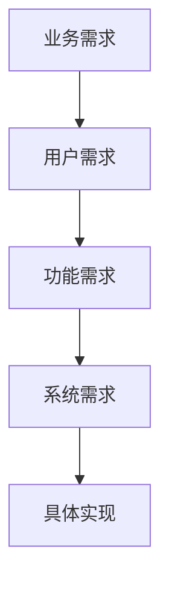
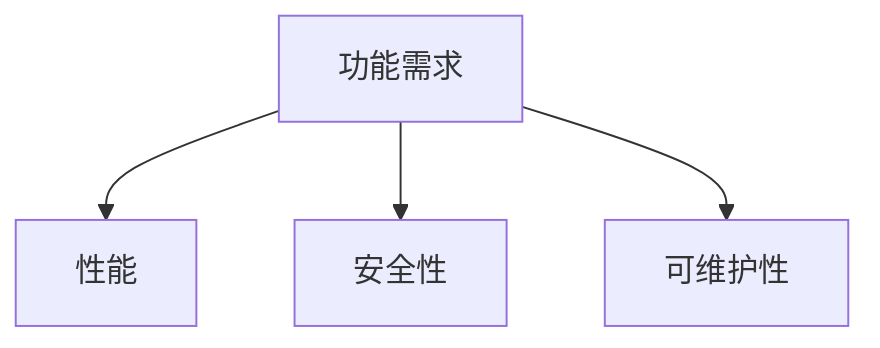
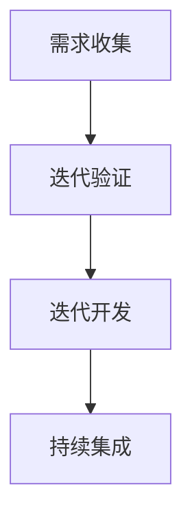
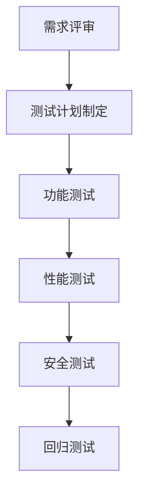
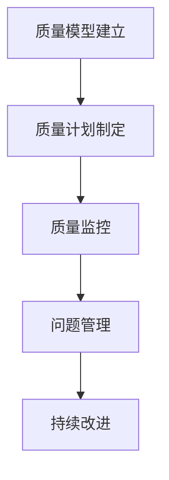

                 

### 文章标题

# 需求验证的创新方法：确保大型应用的质量

## 关键词

需求验证、质量保证、敏捷开发、自动化验证、大型应用、质量模型

## 摘要

在当今快速发展的信息技术领域，确保大型应用的质量成为开发者面临的一项重大挑战。本文将探讨需求验证的创新方法，通过深入分析传统方法与新兴技术的结合，揭示如何有效地进行需求验证，从而确保大型应用的高质量。文章将首先介绍需求验证的基础理论，然后探讨创新的需求验证方法，并详细分析其在大型应用中的实践，最后提供具体的项目实战，总结最佳实践和注意事项。

## 引言

在软件开发的各个环节中，需求验证是确保应用质量的关键步骤。然而，在大型应用开发过程中，需求验证面临着诸多挑战，如需求的复杂性、系统的庞大性以及变更的频繁性。传统的方法往往难以应对这些挑战，导致需求验证效率低下，质量难以保障。因此，探索创新的需求验证方法，提高大型应用的质量保证水平，成为当前软件工程领域的重要课题。

### 需求验证的基础理论

#### 需求的层次结构

在需求验证过程中，了解需求的层次结构至关重要。需求可以划分为多个层次，包括业务需求、用户需求、功能需求和系统需求等。这些需求之间相互关联，形成一个完整的层次体系。图 1 展示了需求层次的架构。



#### 功能需求与非功能需求

功能需求是指系统必须实现的具体功能，例如用户登录、数据查询等。而非功能需求则涉及系统性能、安全性、可维护性等属性。在需求验证过程中，两者都需要得到充分考虑。图 2 展示了功能需求与非功能需求的关系。



#### 需求的确认与验证

需求的确认与验证是确保需求正确性和完整性的关键步骤。确认过程主要包括需求评审、需求文档审查和用户反馈等，目的是确保需求符合业务需求和用户期望。而验证过程则通过测试、审查和评审等方式，验证需求是否实现，确保系统的质量。

### 创新的需求验证方法

#### 传统方法

传统需求验证方法主要包括回归测试、黑盒测试和自盒测试等。这些方法各有优缺点，回归测试用于验证修改后的系统是否引入新的错误，黑盒测试主要关注系统功能的实现，而白盒测试则深入到代码层面进行测试。

#### 新兴技术

随着技术的发展，许多新兴的需求验证方法逐渐应用于实际项目中，如迭代验证、集成验证和自动化验证等。这些方法提高了需求验证的效率和准确性，为大型应用的质量保证提供了有力支持。

#### 需求验证与敏捷开发

敏捷开发注重迭代和反馈，需求验证在敏捷开发中具有重要地位。通过持续的需求验证，开发团队能够快速响应需求变更，确保系统的稳定性和可维护性。图 3 展示了需求验证与敏捷开发的结合。



### 需求验证在大型应用中的实践

#### 大型应用的需求分析

大型应用通常具有复杂的系统架构和庞大的功能模块，因此需求分析至关重要。通过需求分析，开发团队能够全面了解系统的需求和功能，从而制定有效的验证策略。

#### 大型应用的需求验证

在大型应用中，需求验证不仅需要考虑功能性的验证，还需关注性能、安全性、可靠性等方面。图 4 展示了大型应用需求验证的流程。



#### 大型应用的质量保证

质量保证是确保大型应用高质量的关键步骤。通过建立质量模型和构建质量保证体系，开发团队能够持续监控和改进系统的质量。图 5 展示了质量保证的流程。



### 项目实战

在本节中，我们将通过一个实际项目，详细描述需求验证的流程和关键步骤。该项目是一个电子商务平台，涉及用户注册、商品浏览、购物车、订单处理等功能模块。以下是一个简化的项目实战流程：

#### 开发环境搭建

在开始项目之前，我们需要搭建开发环境。以下是环境搭建的步骤：

1. 安装开发工具，如 IntelliJ IDEA 或 Visual Studio Code。
2. 配置数据库，如 MySQL 或 MongoDB。
3. 安装版本控制工具，如 Git。
4. 配置测试环境，如 JMeter 或 Selenium。

#### 源代码实现

以下是一个简化的源代码实现，用于用户注册功能的验证：

```java
public class UserRegistration {
    private String username;
    private String password;
    
    public UserRegistration(String username, String password) {
        this.username = username;
        this.password = password;
    }
    
    public boolean validateRegistration() {
        if (username.isEmpty() || password.isEmpty()) {
            return false;
        }
        // 其他验证逻辑
        return true;
    }
}
```

#### 代码解读与分析

在用户注册功能中，我们需要验证用户名和密码的合法性。以下是一个简化的伪代码，用于描述验证逻辑：

```pseudo
function validateRegistration(username, password):
    if (isEmpty(username) or isEmpty(password):
        return false
    if (length(username) < 3 or length(password) < 6:
        return false
    // 其他验证条件
    return true
```

#### 实际案例分析

在实际项目中，用户注册功能需要考虑多种验证条件，如用户名是否已存在、密码是否符合复杂性要求等。以下是一个简化的实际案例：

```java
public class UserRegistrationService {
    private UserRepository userRepository;
    
    public UserRegistrationService(UserRepository userRepository) {
        this.userRepository = userRepository;
    }
    
    public boolean registerUser(String username, String password) {
        if (userRepository.existsByUsername(username)) {
            return false;
        }
        if (!PasswordValidator.validate(password)) {
            return false;
        }
        userRepository.save(new User(username, password));
        return true;
    }
}
```

#### 项目小结

通过以上项目实战，我们可以看到需求验证在大型应用开发中的重要性。有效的需求验证不仅能够确保功能的正确实现，还能提高系统的稳定性和可靠性。在实际项目中，需求验证需要结合具体的业务需求和系统架构，制定合理的验证策略和流程。

### 最佳实践与注意事项

在进行需求验证时，以下是一些最佳实践和注意事项：

1. **充分理解需求**：在验证之前，确保对需求有充分的理解，避免出现误解或遗漏。
2. **制定合理的验证策略**：根据项目特点和需求，制定适合的验证策略和流程，提高验证效率。
3. **持续监控和改进**：在开发过程中，持续监控需求的变化，及时调整验证策略和流程。
4. **使用自动化工具**：充分利用自动化工具，如 JMeter 或 Selenium，提高验证效率和准确性。
5. **关注非功能性需求**：在验证过程中，不仅要关注功能性需求，还要关注性能、安全性等非功能性需求。

### 拓展阅读

对于希望深入了解需求验证和大型应用质量保证的读者，以下是一些拓展阅读资源：

1. 《软件测试的艺术》（The Art of Software Testing）
2. 《敏捷软件开发：原则、实践与模式》（Agile Software Development: Principles, Patterns, and Practices）
3. 《大型软件系统设计》（Designing Large Software Systems）

通过以上详细的内容，我们希望能帮助读者理解需求验证的创新方法，掌握确保大型应用质量的关键步骤和技巧。希望本文能为您的软件开发实践提供有价值的参考和启示。

### 作者信息

作者：AI天才研究院/AI Genius Institute & 禅与计算机程序设计艺术 /Zen And The Art of Computer Programming

在本文中，我们探讨了需求验证的创新方法，并详细分析了其在大型应用中的实践。通过理解需求验证的基础理论，结合新兴验证方法和技术，开发团队能够更有效地确保大型应用的质量。在实际项目中，需求验证不仅需要关注功能性需求，还需重视非功能性需求，制定合理的验证策略和流程。通过本文的介绍，我们希望为读者提供有价值的参考，帮助他们在软件开发实践中取得更好的成果。

