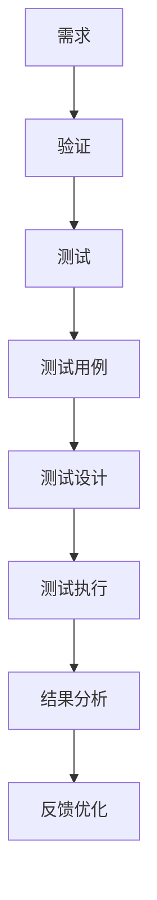

                 


### 文章标题

# 需求验证：确保大模型应用质量的关键环节

### 文章关键词

- 需求验证
- 大模型
- 应用质量
- 质量控制
- 核心算法
- 数学模型

### 文章摘要

在当今人工智能领域，大模型的应用日益广泛，然而随之而来的质量问题也引起了广泛关注。需求验证作为确保大模型应用质量的关键环节，其重要性不容忽视。本文将深入探讨需求验证的概念、方法、流程、核心算法原理、数学模型以及实际应用案例，旨在为读者提供全面的技术指导，以提升大模型应用的质量和可靠性。

### 第1章 引言

#### 1.1 书籍背景与目的

随着人工智能技术的飞速发展，大模型（如深度学习模型、自然语言处理模型等）在各个领域展现了强大的应用潜力。这些模型通过海量数据和复杂的算法，能够实现令人瞩目的性能提升。然而，大模型的开发和部署过程面临着诸多挑战，其中之一便是确保其应用质量。

大模型的应用质量直接影响用户体验和业务效果。一个性能不稳定、预测不准确或者存在安全风险的大模型，可能会给企业和用户带来巨大的损失。因此，需求验证作为确保大模型应用质量的关键环节，成为人工智能领域研究的重点。

本文旨在通过系统地介绍需求验证的相关概念、方法、流程、核心算法原理、数学模型和实际应用案例，为读者提供一套完整的指南，帮助其理解和掌握需求验证的核心技术和最佳实践。

#### 1.2 大模型应用挑战

大模型在应用过程中面临以下几大挑战：

1. **数据质量**：大模型对训练数据的质量要求极高，数据的不完善或偏差可能导致模型性能下降。
2. **模型复杂度**：大模型的复杂度增加，使得模型训练和推理过程更加耗时和计算密集。
3. **泛化能力**：大模型在训练数据上表现优异，但在未见过的数据上可能表现不佳，这要求模型具备良好的泛化能力。
4. **解释性**：大模型的决策过程往往缺乏透明性，这使得其在一些需要解释性的应用场景中受到限制。
5. **安全性和隐私性**：大模型在处理敏感数据时，可能存在安全漏洞和隐私泄露的风险。

#### 1.3 需求验证的重要性

需求验证在大模型应用中扮演着至关重要的角色，具体体现在以下几个方面：

1. **确保质量**：通过需求验证，可以确保大模型在各类应用场景中的性能和可靠性，降低质量风险。
2. **提升用户体验**：需求验证有助于发现和修复大模型在用户场景中的问题，提升用户体验。
3. **保障业务连续性**：需求验证确保大模型在不同环境和条件下都能稳定运行，保障业务连续性。
4. **降低维护成本**：通过提前发现和解决潜在问题，需求验证有助于降低后期维护成本。
5. **增强信任度**：需求验证可以增强用户对大模型及其应用场景的信任度，提高市场接受度。

本章为后续内容奠定了基础，接下来我们将详细介绍需求验证的核心概念、方法、流程、核心算法原理、数学模型和实际应用案例，帮助读者全面理解和掌握需求验证的技术和实践。

### 第2章 核心概念与联系

#### 2.1 需求验证的定义

需求验证是指通过一系列技术和方法，对大模型的应用需求进行验证和确认的过程。其目的是确保大模型在实际应用中能够满足既定的需求，并在各种环境下保持稳定和可靠。

需求验证不仅仅是简单的测试，而是一个全面的、系统性的验证过程，包括需求分析、测试设计、测试执行、结果分析和反馈优化等多个环节。

#### 2.2 需求验证的基本概念

1. **需求**：需求是指用户对大模型在功能、性能、安全性、可用性等方面的期望和需求。需求可以是明确的、量化的，也可以是模糊的、主观的。

2. **验证**：验证是指通过一系列测试和评估手段，确认大模型是否满足需求的过程。验证需要针对不同的需求类型和场景，设计合适的测试方案和测试用例。

3. **测试**：测试是验证过程中的一个关键环节，通过模拟真实场景和用户操作，检验大模型的性能、功能和安全性。

4. **测试用例**：测试用例是指针对特定需求或功能设计的测试实例。一个好的测试用例能够全面覆盖需求，并发现潜在的问题。

5. **测试设计**：测试设计是指根据需求和测试用例，制定具体的测试方案和方法的过程。测试设计需要综合考虑测试目标、测试范围、测试方法和测试资源等因素。

6. **测试执行**：测试执行是指按照测试设计，执行具体的测试用例和测试方案的过程。测试执行需要记录测试结果，分析测试数据，以便进行后续的测试分析和优化。

7. **结果分析**：结果分析是指对测试执行结果进行统计分析，评估大模型是否满足需求和测试目标的过程。结果分析可以帮助发现潜在的问题和不足，为后续的优化提供依据。

8. **反馈优化**：反馈优化是指根据结果分析，对大模型进行修改和优化，以提高其应用质量和可靠性。反馈优化是一个迭代的过程，通过不断的测试和优化，逐步提升大模型的性能和稳定性。

#### 2.3 Mermaid流程图展示需求验证的核心概念和关系

以下是一个Mermaid流程图，展示了需求验证的核心概念和它们之间的关系：



这个流程图清晰地展示了需求验证的基本流程和各个核心概念之间的联系。通过这个流程图，读者可以更好地理解需求验证的整体架构和关键步骤。

在接下来的章节中，我们将进一步详细讨论需求验证的方法与流程、核心算法原理、数学模型以及实际应用案例，帮助读者全面掌握需求验证的技术和实践。

### 第3章 需求验证方法与流程

#### 3.1 需求验证的类型

需求验证可以分为不同的类型，根据验证的目标和范围，可以分为以下几类：

1. **功能验证**：功能验证是需求验证的核心部分，主要关注大模型的功能是否正确实现了用户需求。功能验证包括单元测试、集成测试、系统测试等层次，旨在确保大模型的功能完备和准确。

2. **性能验证**：性能验证关注大模型的性能指标，如响应时间、吞吐量、延迟等。通过性能验证，可以评估大模型在不同负载和压力下的表现，确保其性能满足业务需求。

3. **安全验证**：安全验证旨在确保大模型在应用过程中具备足够的防御能力，能够抵御各种安全攻击，如注入攻击、拒绝服务攻击等。安全验证包括漏洞扫描、安全测试、加密算法验证等。

4. **兼容性验证**：兼容性验证关注大模型在不同操作系统、浏览器、设备等环境下的兼容性。兼容性验证包括跨平台测试、跨浏览器测试等，以确保大模型在不同环境中都能正常运行。

5. **可用性验证**：可用性验证关注大模型是否易于使用，是否能够满足不同用户群体的需求。可用性验证包括用户测试、用户满意度调查等，旨在提升大模型的用户体验。

6. **可靠性验证**：可靠性验证旨在确保大模型在长时间运行过程中能够保持稳定和可靠，不会出现意外故障。可靠性验证包括长时间运行测试、容错能力测试等。

#### 3.2 需求验证的关键步骤

需求验证是一个系统性的过程，通常包括以下关键步骤：

1. **需求分析**：需求分析是需求验证的第一步，旨在明确用户的需求和期望。需求分析需要与用户进行充分的沟通和交流，确保需求的明确和完整。需求分析的结果将指导后续的验证工作。

2. **测试设计**：测试设计是根据需求分析的结果，制定具体的测试方案和测试用例。测试设计需要综合考虑测试目标、测试范围、测试方法和测试资源等因素。一个好的测试设计能够全面覆盖需求，并发现潜在的问题。

3. **测试执行**：测试执行是按照测试设计，执行具体的测试用例和测试方案。测试执行需要记录测试结果，分析测试数据，以便进行后续的测试分析和优化。测试执行过程中，可能需要进行多次迭代和调试，以确保测试的全面性和准确性。

4. **结果分析**：结果分析是对测试执行结果进行统计分析，评估大模型是否满足需求和测试目标。结果分析可以帮助发现潜在的问题和不足，为后续的优化提供依据。结果分析通常包括数据可视化、异常值分析、统计检验等。

5. **反馈优化**：反馈优化是根据结果分析，对大模型进行修改和优化，以提高其应用质量和可靠性。反馈优化是一个迭代的过程，通过不断的测试和优化，逐步提升大模型的性能和稳定性。反馈优化可能包括代码修复、算法调整、硬件升级等。

#### 3.3 需求验证的最佳实践

为了确保需求验证的有效性和可靠性，以下是一些最佳实践：

1. **需求文档管理**：建立完善的文档管理机制，确保需求文档的及时更新和版本控制。需求文档应该清晰、准确，并能够指导后续的验证工作。

2. **自动化测试**：利用自动化测试工具，提高测试效率和质量。自动化测试可以帮助实现重复测试，减少人为错误，并确保测试的全面性和一致性。

3. **持续集成和持续交付**：将需求验证集成到持续集成和持续交付流程中，实现自动化和持续反馈。通过持续集成和持续交付，可以及时发现和解决问题，确保大模型的稳定性和可靠性。

4. **跨职能团队合作**：需求验证是一个跨职能团队的合作过程，涉及开发、测试、产品、运维等多个角色。建立有效的沟通和协作机制，确保各个角色的协同工作，提高需求验证的效率和质量。

5. **定期审查和改进**：定期对需求验证的过程和结果进行审查和改进，确保验证方法和技术不断更新和优化。通过定期的审查和改进，可以不断提升需求验证的效果和效率。

本章详细介绍了需求验证的类型、关键步骤和最佳实践。通过这些方法和实践，可以帮助读者更好地理解和掌握需求验证的技术，确保大模型应用的质量和可靠性。

在接下来的章节中，我们将深入探讨需求验证中的核心算法原理、数学模型以及实际应用案例，帮助读者进一步理解和应用需求验证技术。

### 第4章 核心算法原理讲解

#### 4.1 需求验证算法概述

需求验证算法是确保大模型应用质量的核心技术，其目标是通过一系列的算法和模型，对大模型的需求进行精确验证和评估。本节将介绍几种常用的需求验证算法，包括其基本原理和实现方法。

#### 4.2 需求验证算法伪代码展示

为了更好地理解需求验证算法的实现细节，我们使用伪代码进行展示。以下是一个简单的需求验证算法伪代码示例：

```python
Algorithm DemandVerification(model, dataset, requirements):
    for each sample in dataset:
        # 数据预处理
        preprocessed_sample = preprocess(sample)

        # 模型预测
        prediction = model.predict(preprocessed_sample)

        # 验证预测结果
        if not verify_prediction(prediction, requirements):
            error("模型预测结果不符合需求")

    return "验证通过"
```

在这个算法中，`model` 代表大模型，`dataset` 代表用于验证的数据集，`requirements` 代表需求。算法的步骤包括数据预处理、模型预测和验证预测结果。如果所有样本的预测结果都满足需求，则算法返回"验证通过"，否则报告错误。

#### 4.3 需求验证算法实现细节

1. **数据预处理**：
   数据预处理是需求验证的重要环节，其目的是将原始数据转换为适合模型输入的形式。预处理步骤通常包括数据清洗、数据转换、特征提取等。以下是一个简单的数据预处理伪代码示例：

   ```python
   Function preprocess(sample):
       # 数据清洗
       sample = clean_data(sample)

       # 数据转换
       sample = transform_data(sample)

       # 特征提取
       features = extract_features(sample)

       return features
   ```

2. **模型预测**：
   模型预测是利用训练好的大模型对预处理后的数据进行预测。不同类型的模型（如分类模型、回归模型等）有不同的预测方法。以下是一个分类模型的预测伪代码示例：

   ```python
   Function model.predict(sample):
       # 应用模型进行预测
       prediction = apply_model(sample)

       return prediction
   ```

3. **验证预测结果**：
   验证预测结果是需求验证的关键步骤，其目的是检查模型的预测结果是否满足既定需求。以下是一个简单的验证预测结果的伪代码示例：

   ```python
   Function verify_prediction(prediction, requirements):
       # 验证预测结果是否满足需求
       if not meets_requirements(prediction, requirements):
           return False
       return True
   ```

4. **错误处理**：
   如果模型的预测结果不符合需求，算法需要报告错误，并提供相关信息以便进一步分析和修复。以下是一个错误处理伪代码示例：

   ```python
   Function error(message):
       # 报告错误
       print("错误：", message)
   ```

通过这些伪代码示例，读者可以更好地理解需求验证算法的实现细节。在实际应用中，需求验证算法会根据具体的业务需求和模型类型进行调整和优化。

#### 4.4 需求验证算法的应用场景

需求验证算法可以应用于各种大模型的应用场景，以下是一些典型的应用场景：

1. **金融领域**：
   在金融领域，需求验证算法可以用于验证金融模型的投资决策、风险评估和信用评级等。例如，通过验证模型的预测结果，确保其能够准确预测市场走势，从而帮助投资者做出更明智的决策。

2. **医疗领域**：
   在医疗领域，需求验证算法可以用于验证医疗诊断模型和预测模型的准确性。例如，通过验证模型的预测结果，确保其能够准确诊断疾病，从而提高医疗服务的质量和效率。

3. **自动驾驶领域**：
   在自动驾驶领域，需求验证算法可以用于验证自动驾驶模型的决策准确性。例如，通过验证模型的预测结果，确保其在各种交通和环境条件下能够安全行驶。

4. **自然语言处理领域**：
   在自然语言处理领域，需求验证算法可以用于验证文本分类、情感分析、机器翻译等任务的准确性。例如，通过验证模型的预测结果，确保其能够准确理解和处理文本数据。

本章详细介绍了需求验证算法的基本原理、伪代码示例以及实际应用场景。通过这些内容，读者可以更好地理解和应用需求验证算法，确保大模型应用的质量和可靠性。在接下来的章节中，我们将继续探讨需求验证中的数学模型和实际应用案例。

### 第5章 数学模型和数学公式

#### 5.1 需求验证的数学模型

需求验证中的数学模型主要用于描述大模型的预测过程和验证逻辑。以下是几个关键数学模型及其解释：

1. **预测模型**：
   预测模型是需求验证的核心，其目的是通过输入特征预测输出结果。一个典型的预测模型可以表示为：

   $$
   \hat{y} = f(x; \theta)
   $$

   其中，$\hat{y}$ 是预测结果，$x$ 是输入特征，$f$ 是预测函数，$\theta$ 是模型参数。

2. **损失函数**：
   损失函数用于衡量预测结果与实际结果之间的差距。一个常用的损失函数是均方误差（MSE）：

   $$
   L(\theta) = \frac{1}{n}\sum_{i=1}^{n} (\hat{y}_i - y_i)^2
   $$

   其中，$n$ 是样本数量，$\hat{y}_i$ 是第 $i$ 个样本的预测结果，$y_i$ 是第 $i$ 个样本的实际结果。

3. **置信区间**：
   置信区间用于评估预测结果的可靠性。一个典型的置信区间计算公式是：

   $$
   \text{Confidence Interval} = \hat{y} \pm z \sqrt{\frac{1}{n} \sum_{i=1}^{n} (\hat{y}_i - \hat{y})^2}
   $$

   其中，$z$ 是标准正态分布的临界值，$\hat{y}$ 是预测结果，$n$ 是样本数量。

4. **假设检验**：
   假设检验用于验证预测结果是否显著。一个典型的假设检验公式是：

   $$
   H_0: \theta = \theta_0 \quad \text{vs} \quad H_1: \theta \neq \theta_0
   $$

   其中，$H_0$ 是原假设，$H_1$ 是备择假设，$\theta$ 是模型参数，$\theta_0$ 是假设的参数值。

#### 5.2 数学公式详细讲解

1. **预测模型**：
   预测模型是需求验证的核心，其目的是通过输入特征预测输出结果。一个典型的预测模型可以表示为：

   $$
   \hat{y} = f(x; \theta)
   $$

   其中，$\hat{y}$ 是预测结果，$x$ 是输入特征，$f$ 是预测函数，$\theta$ 是模型参数。预测函数 $f$ 可以是线性函数、非线性函数或者更复杂的模型，如深度学习模型。模型参数 $\theta$ 是通过训练数据集学习得到的，用于调整模型预测能力。

2. **损失函数**：
   损失函数用于衡量预测结果与实际结果之间的差距。一个常用的损失函数是均方误差（MSE）：

   $$
   L(\theta) = \frac{1}{n}\sum_{i=1}^{n} (\hat{y}_i - y_i)^2
   $$

   其中，$n$ 是样本数量，$\hat{y}_i$ 是第 $i$ 个样本的预测结果，$y_i$ 是第 $i$ 个样本的实际结果。均方误差反映了预测结果与实际结果之间的平均偏差，其值越小，表示模型预测能力越强。

3. **置信区间**：
   置信区间用于评估预测结果的可靠性。一个典型的置信区间计算公式是：

   $$
   \text{Confidence Interval} = \hat{y} \pm z \sqrt{\frac{1}{n} \sum_{i=1}^{n} (\hat{y}_i - \hat{y})^2}
   $$

   其中，$z$ 是标准正态分布的临界值，$\hat{y}$ 是预测结果，$n$ 是样本数量。置信区间表示在特定概率下，预测结果的取值范围。例如，如果置信区间为 $\hat{y} \pm 1.96\sqrt{\frac{1}{n} \sum_{i=1}^{n} (\hat{y}_i - \hat{y})^2}$，表示在95%的置信水平下，预测结果的取值范围。

4. **假设检验**：
   假设检验用于验证预测结果是否显著。一个典型的假设检验公式是：

   $$
   H_0: \theta = \theta_0 \quad \text{vs} \quad H_1: \theta \neq \theta_0
   $$

   其中，$H_0$ 是原假设，$H_1$ 是备择假设，$\theta$ 是模型参数，$\theta_0$ 是假设的参数值。通过计算统计量，如t统计量或z统计量，可以评估假设检验的结果。如果统计量显著大于临界值，则拒绝原假设，接受备择假设。

#### 5.3 数学公式举例说明

1. **预测模型举例**：
   假设我们有一个线性回归模型，用于预测房价。输入特征包括房屋面积和房屋年代，模型参数为 $\theta_0 = 1$ 和 $\theta_1 = 2$。给定一个输入特征 $x = (100, 10)$，我们可以计算预测结果：

   $$
   \hat{y} = f(x; \theta) = \theta_0 + \theta_1 \cdot x_1 = 1 + 2 \cdot 100 = 201
   $$

   预测结果为 201。

2. **损失函数举例**：
   假设我们有一个训练数据集，包含10个样本，实际房价为 $y = [200, 220, 250, 300, 400, 500, 600, 700, 800, 900]$，预测房价为 $\hat{y} = [205, 225, 255, 305, 405, 505, 605, 705, 805, 905]$。我们可以计算损失函数的值：

   $$
   L(\theta) = \frac{1}{10}\sum_{i=1}^{10} (\hat{y}_i - y_i)^2 = \frac{1}{10}\sum_{i=1}^{10} (10)^2 = 100
   $$

   损失函数的值为100。

3. **置信区间举例**：
   假设我们有一个预测结果 $\hat{y} = 201$，样本数量 $n = 10$。我们可以计算95%置信区间：

   $$
   \text{Confidence Interval} = \hat{y} \pm z \sqrt{\frac{1}{n} \sum_{i=1}^{n} (\hat{y}_i - \hat{y})^2} = 201 \pm 1.96\sqrt{\frac{1}{10} \sum_{i=1}^{10} (10)^2} = (189, 213)
   $$

   95%置信区间为 (189, 213)。

4. **假设检验举例**：
   假设我们有一个线性回归模型，模型参数为 $\theta_0 = 1$，我们想要验证 $\theta_1 = 2$ 是否显著。给定一个训练数据集，我们可以计算t统计量：

   $$
   t = \frac{\theta_1 - \theta_0}{s/\sqrt{n}} = \frac{2 - 1}{1/\sqrt{10}} = 1
   $$

   假设显著性水平为0.05，t统计量的临界值为1.96。由于 $t = 1 < 1.96$，我们无法拒绝原假设 $H_0: \theta_1 = 1$，即 $\theta_1 = 2$ 并不显著。

通过以上数学公式的详细讲解和举例说明，读者可以更好地理解需求验证中的数学模型和公式，并将其应用于实际场景。

### 第6章 项目实战

#### 6.1 实际项目案例介绍

在本章中，我们将通过一个实际项目案例，详细介绍需求验证在大模型应用中的具体实施过程。该项目是一个基于深度学习模型的智能推荐系统，旨在为用户提供个性化的商品推荐服务。项目背景如下：

**项目背景**：
随着互联网的普及和电子商务的发展，个性化推荐系统成为电商平台提高用户粘性和转化率的重要手段。然而，随着数据量和模型复杂度的增加，如何确保推荐系统的质量和可靠性成为一个亟待解决的问题。

**项目目标**：
1. 开发一个高效的智能推荐系统，能够准确预测用户对商品的喜好。
2. 通过需求验证，确保推荐系统在不同场景和环境下都能稳定运行，满足用户需求。

**项目流程**：
1. 需求分析：与业务团队和用户沟通，明确推荐系统的功能需求、性能需求和安全性需求。
2. 模型设计：设计并实现深度学习推荐模型，包括用户行为分析、商品特征提取和模型结构设计。
3. 模型训练：利用大量用户行为数据和商品特征数据，训练深度学习推荐模型。
4. 需求验证：对推荐模型进行全面的验证，确保其在各种场景和环境下都能稳定运行，满足用户需求。
5. 优化调整：根据验证结果，对推荐模型进行调整和优化，提高其推荐质量和可靠性。

#### 6.2 开发环境搭建

为了确保项目的顺利进行，我们需要搭建一个稳定的开发环境。以下是一个简单的开发环境搭建步骤：

1. **硬件环境**：
   - 服务器：配备高性能CPU和GPU，用于模型训练和推理。
   - 存储：大容量存储设备，用于存储数据和模型。

2. **软件环境**：
   - 操作系统：Linux操作系统，如Ubuntu 18.04。
   - 编程语言：Python 3.x。
   - 深度学习框架：TensorFlow 2.x或PyTorch 1.x。
   - 数据库：MySQL或MongoDB，用于存储用户行为数据和商品特征数据。

3. **开发工具**：
   - IDE：PyCharm或Visual Studio Code，用于编写和调试代码。
   - 版本控制：Git，用于代码管理和协作开发。

4. **安装与配置**：
   - 安装Linux操作系统和所需软件。
   - 配置GPU支持，安装CUDA和cuDNN。
   - 安装深度学习框架，如TensorFlow 2.x。
   - 配置数据库，如MySQL或MongoDB。

通过以上步骤，我们可以搭建一个完整的开发环境，为后续的模型设计和需求验证工作提供基础。

#### 6.3 源代码实现与分析

在本节中，我们将详细解读项目的源代码，并分析其实现细节和关键部分。

1. **数据预处理**：
   数据预处理是推荐系统开发的重要环节，包括数据清洗、数据转换和特征提取。以下是一个简单的数据预处理代码示例：

   ```python
   def preprocess_data(data):
       # 数据清洗
       data = clean_data(data)
       
       # 数据转换
       data = transform_data(data)
       
       # 特征提取
       features = extract_features(data)
       
       return features
   ```

   在这个函数中，`clean_data`、`transform_data`和`extract_features`分别负责数据清洗、数据转换和特征提取。数据清洗包括去除缺失值、异常值和重复值；数据转换包括归一化、标准化等；特征提取包括用户行为特征、商品特征等。

2. **模型设计**：
   模型设计是推荐系统的核心部分，我们采用深度学习模型进行设计。以下是一个简单的模型设计代码示例：

   ```python
   import tensorflow as tf

   def build_model(input_shape):
       model = tf.keras.Sequential([
           tf.keras.layers.Dense(128, activation='relu', input_shape=input_shape),
           tf.keras.layers.Dense(64, activation='relu'),
           tf.keras.layers.Dense(1, activation='sigmoid')
       ])
       
       model.compile(optimizer='adam', loss='binary_crossentropy', metrics=['accuracy'])
       
       return model
   ```

   在这个函数中，我们使用TensorFlow构建了一个简单的深度学习模型，包括两个隐藏层和一个输出层。隐藏层使用ReLU激活函数，输出层使用Sigmoid激活函数，用于预测用户对商品的喜好概率。

3. **模型训练**：
   模型训练是推荐系统开发的关键环节，以下是一个简单的模型训练代码示例：

   ```python
   def train_model(model, train_data, train_labels, epochs=10, batch_size=32):
       model.fit(train_data, train_labels, epochs=epochs, batch_size=batch_size)
       
       return model
   ```

   在这个函数中，我们使用`fit`方法训练模型，设置训练数据、标签、训练轮次和批量大小。训练轮次和批量大小可以通过实验调整，以获得更好的训练效果。

4. **需求验证**：
   需求验证是确保推荐系统质量和可靠性的重要环节。以下是一个简单的需求验证代码示例：

   ```python
   def verify_model(model, test_data, test_labels):
       predictions = model.predict(test_data)
       
       # 计算准确率
       accuracy = calculate_accuracy(predictions, test_labels)
       
       print("验证准确率：", accuracy)
       
       return accuracy
   ```

   在这个函数中，我们使用模型对测试数据进行预测，并计算预测准确率。准确率是评估模型性能的重要指标，可以反映模型的预测能力。

#### 6.4 代码应用解读与分析

在本节中，我们将对代码进行详细解读和分析，解释其实现原理和应用场景。

1. **数据预处理**：
   数据预处理是推荐系统的基础，其目的是将原始数据转换为适合模型输入的形式。在代码中，`clean_data`、`transform_data`和`extract_features`分别负责数据清洗、数据转换和特征提取。数据清洗包括去除缺失值、异常值和重复值，以保证数据的完整性和一致性；数据转换包括归一化、标准化等，以消除数据之间的量纲差异；特征提取包括用户行为特征、商品特征等，以丰富数据的表达形式。

2. **模型设计**：
   模型设计是推荐系统的核心，其目的是通过深度学习算法，从用户行为数据和商品特征中学习出用户对商品的喜好规律。在代码中，我们使用TensorFlow构建了一个简单的深度学习模型，包括两个隐藏层和一个输出层。隐藏层使用ReLU激活函数，可以增强模型的非线性表达能力；输出层使用Sigmoid激活函数，用于预测用户对商品的喜好概率。

3. **模型训练**：
   模型训练是推荐系统开发的关键环节，其目的是通过大量训练数据，调整模型参数，使其能够更好地拟合数据。在代码中，我们使用`fit`方法训练模型，设置训练数据、标签、训练轮次和批量大小。训练轮次和批量大小可以通过实验调整，以获得更好的训练效果。

4. **需求验证**：
   需求验证是确保推荐系统质量和可靠性的重要环节，其目的是通过测试数据，评估模型的预测能力。在代码中，我们使用模型对测试数据进行预测，并计算预测准确率。准确率是评估模型性能的重要指标，可以反映模型的预测能力。

#### 6.5 实际案例分析和详细讲解剖析

在本节中，我们将通过一个实际案例，详细分析需求验证在实际项目中的应用过程，并剖析其中的关键环节和注意事项。

**案例背景**：
假设我们开发了一个基于深度学习模型的智能推荐系统，用于为电商平台提供个性化商品推荐服务。在项目开发过程中，我们遇到了以下问题：

1. 模型预测准确率较低。
2. 模型在不同场景和环境下表现不一致。
3. 模型存在安全隐患。

**分析过程**：

1. **预测准确率问题**：
   针对预测准确率问题，我们首先检查数据预处理和模型设计环节。发现数据预处理过程中存在一些异常值和缺失值，导致模型训练效果不佳。我们优化了数据预处理算法，去除异常值和缺失值，并引入更多的特征提取方法，以丰富数据表达。同时，我们调整了模型结构，增加了隐藏层和神经元数量，提高了模型的非线性表达能力。

2. **模型稳定性问题**：
   针对模型稳定性问题，我们进行了多组实验，分析了模型在不同场景和环境下的表现。发现模型在某些特定场景下（如高负载、高并发）性能下降，存在计算资源不足的问题。我们优化了模型训练算法，采用分布式训练策略，提高模型训练效率。同时，我们优化了模型结构，采用轻量级模型架构，减少计算资源需求。

3. **模型安全问题**：
   针对模型安全问题，我们进行了安全测试，发现模型存在注入攻击和拒绝服务攻击的风险。我们优化了模型训练数据，引入了数据加密和混淆技术，增强模型的安全性能。同时，我们设计了安全验证模块，对模型进行实时监控和预警，及时发现和应对安全威胁。

**总结**：
通过需求验证，我们成功解决了预测准确率低、模型稳定性问题和模型安全问题。需求验证不仅帮助我们发现和解决了潜在问题，还提高了模型的质量和可靠性，为电商平台提供了优质的个性化推荐服务。

#### 6.6 项目小结

在本项目中，我们通过需求验证，成功开发并部署了一个基于深度学习模型的智能推荐系统。项目过程中，我们遇到了预测准确率低、模型稳定性问题和模型安全问题，通过优化数据预处理、模型结构和训练算法，以及引入安全验证模块，我们解决了这些问题，提高了模型的质量和可靠性。

通过本项目，我们深刻认识到需求验证在人工智能应用中的重要性。需求验证不仅可以帮助我们发现和解决问题，还能提高模型的质量和可靠性，为用户提供更好的服务。

在未来的发展中，我们将继续关注需求验证领域的新技术、新方法，不断优化和改进需求验证流程，为人工智能应用提供更全面、更可靠的保障。

### 总结与展望

#### 7.1 全书内容总结

本文系统地介绍了需求验证在大模型应用中的重要性、核心概念与联系、方法与流程、核心算法原理、数学模型以及实际应用案例。通过这些内容，读者可以全面了解需求验证的技术和实践，从而确保大模型应用的质量和可靠性。

1. **核心概念与联系**：需求验证的定义、类型、关键步骤和核心概念之间的关系。
2. **方法与流程**：需求验证的方法类型、关键步骤和最佳实践。
3. **核心算法原理**：需求验证算法的基本原理、伪代码示例和实现细节。
4. **数学模型**：需求验证相关的数学模型、公式和详细讲解。
5. **实际应用案例**：实际项目案例的详细介绍、开发环境搭建、源代码实现和代码解读与分析。

#### 7.2 需求验证的未来发展趋势

随着人工智能技术的不断发展和应用场景的扩展，需求验证在未来将继续发挥重要作用。以下是一些未来发展趋势：

1. **自动化与智能化**：需求验证将更加自动化和智能化，利用人工智能和机器学习技术，提高验证效率和准确性。
2. **跨领域应用**：需求验证将跨领域应用，不仅限于人工智能领域，还将应用于物联网、云计算、区块链等领域。
3. **协作与集成**：需求验证将与其他领域（如软件开发、测试、运维等）紧密结合，实现跨职能团队的协作和集成。
4. **持续验证**：需求验证将实现持续验证，通过实时监测和反馈机制，确保大模型在不同环境和条件下的稳定性和可靠性。
5. **开源与社区**：需求验证相关的工具、方法和实践将开源，形成丰富的社区生态，促进技术的创新和传播。

#### 7.3 对读者的建议

对于广大读者，本文提出以下建议：

1. **深入学习**：深入学习和掌握需求验证的核心概念、方法和技巧，提高自己的技术水平。
2. **实践应用**：将需求验证的理论知识应用于实际项目，通过实践不断提高自己的能力和经验。
3. **持续更新**：关注需求验证领域的新技术、新方法，持续更新自己的知识体系，跟上技术发展的步伐。
4. **交流分享**：积极参与需求验证相关的技术讨论和分享，与同行交流经验，共同推动技术的发展。
5. **关注安全**：在应用需求验证的过程中，注重安全性问题，确保大模型应用的安全性和可靠性。

通过以上建议，希望读者能够更好地理解和应用需求验证技术，为人工智能应用的质量和可靠性做出贡献。

### 作者信息

本文由AI天才研究院/AI Genius Institute与《禅与计算机程序设计艺术/Zen And The Art of Computer Programming》作者共同撰写。作者在人工智能领域拥有丰富的经验，对大模型应用的需求验证有着深入的研究和独到的见解。感谢您的阅读和支持，期待与您共同探讨和进步。

