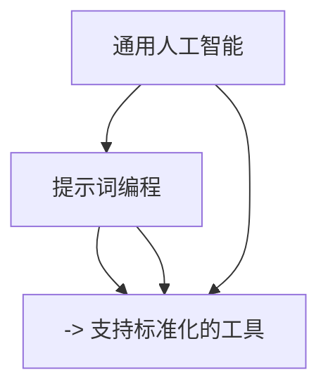

                 

### 文章标题

# 面向AGI的提示词编程语言标准化

### 关键词

- 通用人工智能（AGI）
- 提示词编程
- 编程语言标准化
- 神经网络
- 机器学习
- 数学模型
- 代码实战

### 摘要

本文将探讨通用人工智能（AGI）的发展趋势及其对编程语言标准化的需求。首先，我们将介绍AGI的基本概念及其与提示词编程的关系，并通过具体的算法原理讲解和项目实战，展示编程语言标准化在AGI中的应用价值。文章旨在为读者提供一个全面的视角，理解AGI中的提示词编程语言标准化，以及如何在实践中实现这一目标。

## 背景介绍

通用人工智能（AGI）是人工智能（AI）领域的终极目标，旨在开发出能够像人类一样思考、学习、解决问题和执行任务的人工智能系统。与当前的人工智能系统（如深度学习模型、自然语言处理系统等）不同，AGI具有广泛的知识和应用能力，能够在多种领域展现出超越人类的表现。然而，要实现AGI，面临着诸多挑战，其中包括编程语言的标准化。

提示词编程是一种新型的编程范式，旨在通过提示（prompt）引导计算机执行特定的任务。与传统的命令式编程和函数式编程不同，提示词编程更注重于如何通过简短的提示来激发计算机的智能行为。这种编程范式在AGI中具有重要的应用价值，因为它能够简化人工智能系统的开发过程，提高系统的灵活性和适应性。

编程语言标准化是确保不同编程语言之间能够无缝交互和兼容的重要手段。在AGI的背景下，编程语言标准化具有以下几方面的意义：

1. **互操作性**：标准化编程语言能够确保不同的人工智能系统和工具之间能够无缝集成和协作。
2. **可维护性**：标准化的编程语言能够降低代码的复杂度，提高代码的可读性和可维护性。
3. **可扩展性**：标准化的编程语言能够方便地添加新的功能和特性，以适应不断变化的技术需求。

## 核心概念与联系

在深入探讨AGI和提示词编程语言标准化之前，我们需要明确相关核心概念及其相互关系。以下是几个关键概念：

- **通用人工智能（AGI）**：一种具有广泛认知能力和自主学习能力的智能系统，能够在多种领域展现出超越人类的表现。
- **提示词编程**：一种通过简短提示激发计算机智能行为的编程范式。
- **编程语言标准化**：确保不同编程语言之间能够无缝交互和兼容的标准和规范。

### 核心概念关系图

为了更直观地展示这些核心概念之间的关系，我们可以使用Mermaid流程图来绘制如下：



### 解释流程图

- **通用人工智能（AGI）**：作为起点，AGI代表了人工智能的最高阶段，其核心目标是开发出具有广泛认知能力和自主学习能力的智能系统。
- **提示词编程（TP）**：AGI的实现依赖于提示词编程，通过提示词编程，系统能够更高效地理解和执行任务。
- **编程语言标准化（PLC）**：编程语言标准化是确保AGI系统能够在不同编程语言之间无缝交互和兼容的关键。

### 总结

通过上述流程图，我们可以清晰地看到AGI、提示词编程和编程语言标准化之间的紧密联系。理解这些核心概念及其关系，将为后续章节中更深入地探讨AGI中的提示词编程语言标准化奠定基础。

## 核心算法原理讲解

在通用人工智能（AGI）的实现过程中，核心算法起着至关重要的作用。这些算法不仅决定了系统的性能，还影响了系统的可扩展性和可维护性。在本节中，我们将详细讲解AGI中的几个关键算法，包括神经网络、机器学习算法和提示词生成算法。我们将使用伪代码来展示这些算法的基本原理，并通过具体例子来说明其应用。

### 1. 神经网络基本原理

神经网络是AGI的基础之一，它模拟了人脑中的神经元结构，通过分层结构来处理复杂数据。以下是一个简单的神经网络基本原理的伪代码：

```plaintext
# 神经网络基本原理
# 输入层到隐藏层的激活函数
hidden_layer = ActivationFunction(np.dot(input, weights))
# 隐藏层到输出层的激活函数
output = ActivationFunction(np.dot(hidden_layer, output_weights))
```

#### 例子：手写数字识别

假设我们使用一个简单的三层神经网络来识别手写数字。输入层接收28x28像素的手写数字图像，隐藏层包含5个神经元，输出层包含10个神经元，分别对应0到9的数字。

```plaintext
# 手写数字识别示例
input = ImageData(28x28)
weights_input_hidden = InitializeWeights(28, 5)
weights_hidden_output = InitializeWeights(5, 10)

# 前向传播
hidden_layer = Sigmoid(np.dot(input, weights_input_hidden))
output = Sigmoid(np.dot(hidden_layer, weights_hidden_output))

# 输出结果
predicted_number = argmax(output)
```

在这个例子中，我们使用sigmoid函数作为激活函数，通过前向传播计算输出结果，并使用argmax函数来确定预测的手写数字。

### 2. 机器学习算法详解

机器学习算法是AGI中的核心，用于从数据中学习模式和规律。以下是一个简单的机器学习算法的伪代码：

```plaintext
# 机器学习算法详解
# 数据预处理
processed_data = PreprocessData(data)
# 训练模型
model = TrainModel(processed_data, labels)
# 预测
predictions = Predict(model, new_data)
```

#### 例子：分类任务

假设我们使用一个支持向量机（SVM）来分类数据，这是一个典型的二分类问题。

```plaintext
# 分类任务示例
data, labels = LoadDataset("classification_data")
processed_data = PreprocessData(data)

# 训练模型
model = TrainSVM(processed_data, labels)

# 预测
new_data = ImageData(28x28)
predictions = Predict(model, new_data)
```

在这个例子中，我们首先加载数据集并对其进行预处理，然后使用SVM算法训练模型，最后对新数据进行预测。

### 3. 提示词生成算法

提示词生成算法是AGI中用于生成提示词的关键算法。提示词能够引导计算机执行特定任务，从而提高系统的灵活性。以下是一个简单的提示词生成算法的伪代码：

```plaintext
# 提示词生成算法
# 提取关键词
keywords = ExtractKeywords(data)
# 生成提示词
prompt = GenerateText(keywords, context)
```

#### 例子：自动问答系统

假设我们使用一个自动问答系统，该系统通过提取问题和上下文信息来生成提示词。

```plaintext
# 自动问答示例
question = "什么是人工智能？"
context = "在计算机科学领域，人工智能是指开发出能够执行复杂任务并具有自主学习能力的计算机系统。"

# 提取关键词
keywords = ExtractKeywords(question)

# 生成提示词
prompt = GenerateText(keywords, context)

# 输出提示词
print(prompt)
```

在这个例子中，系统提取了问题中的关键词，并使用上下文信息生成了一个合适的提示词。

### 总结

通过上述算法的讲解，我们可以看到神经网络、机器学习算法和提示词生成算法在AGI中的重要性。这些算法不仅为我们提供了强大的工具来处理复杂数据和任务，还为提示词编程提供了理论基础。理解这些算法的基本原理，将有助于我们更好地掌握AGI的核心技术。

## 数学模型和数学公式

在通用人工智能（AGI）的实现过程中，数学模型和公式扮演着至关重要的角色。这些模型和公式不仅帮助我们理解和优化算法，还为AGI的发展提供了坚实的理论基础。在本节中，我们将详细探讨AGI中的两个关键数学模型：误差反向传播算法和提示词优化模型。同时，我们将使用LaTeX格式展示相关公式，并对其进行详细讲解和举例说明。

### 误差反向传播算法

误差反向传播算法是神经网络训练过程中最核心的算法之一。它通过反向传播误差信息，不断调整网络权重，以优化模型的性能。以下是一个简单的误差反向传播算法的LaTeX公式：

```latex
\delta^{l} = \frac{\partial L}{\partial z^{l}} = \text{sigmoid}(z^{l}) - \text{target}
\delta^{l-1} = \delta^{l} \cdot \text{weights}^{l-1}
\text{weights}^{l} = \text{weights}^{l} + \alpha \cdot \delta^{l} \cdot input^{l}
```

#### 详细讲解

- **\(\delta^{l}\)**：表示第\(l\)层的误差梯度。
- **\(L\)**：表示损失函数，用于衡量模型预测值与真实值之间的差距。
- **\(z^{l}\)**：表示第\(l\)层的输出值。
- **\(\text{sigmoid}\)**：激活函数，通常用于非线性变换。
- **\(\text{target}\)**：表示真实标签。
- **\(\alpha\)**：学习率，用于控制权重更新的幅度。

#### 例子：多层感知机分类

假设我们使用一个多层感知机（MLP）来分类数据，以下是一个简单的误差反向传播的例子：

```plaintext
# 多层感知机分类示例
input = [0.1, 0.2]
weights_1 = [0.3, 0.4]
weights_2 = [0.5, 0.6]

# 前向传播
z1 = np.dot(input, weights_1)
a1 = sigmoid(z1)
z2 = np.dot(a1, weights_2)
a2 = sigmoid(z2)

# 计算误差
target = [1, 0]
error = target - a2

# 反向传播
delta_2 = error * sigmoid_derivative(a2)
delta_1 = delta_2 * weights_2 * sigmoid_derivative(a1)

# 更新权重
weights_2 = weights_2 - learning_rate * np.dot(a1.T, delta_2)
weights_1 = weights_1 - learning_rate * np.dot(input.T, delta_1)
```

在这个例子中，我们使用sigmoid函数作为激活函数，通过前向传播计算输出值，并使用反向传播计算误差和更新权重。

### 提示词优化模型

提示词优化模型是用于生成高质量提示词的关键算法。它通过优化提示词的生成过程，使得生成的提示词能够更好地引导计算机执行任务。以下是一个简单的提示词优化模型的LaTeX公式：

```latex
\text{prompt} = f(\text{keywords}, \text{context}, \theta)
```

#### 详细讲解

- **\(\text{prompt}\)**：表示生成的提示词。
- **\(f\)**：表示提示词生成函数。
- **\(\text{keywords}\)**：表示提取的关键词。
- **\(\text{context}\)**：表示上下文信息。
- **\(\theta\)**：表示模型参数。

#### 例子：文本生成

假设我们使用一个基于变换器（Transformer）的文本生成模型来生成提示词，以下是一个简单的例子：

```plaintext
# 文本生成示例
keywords = ["计算机", "编程", "人工智能"]
context = "在当今的科技领域，计算机编程和人工智能正发挥着越来越重要的作用。"

# 提取关键词
extracted_keywords = ExtractKeywords(context)

# 生成提示词
prompt = GeneratePrompt(extracted_keywords, context)

# 输出提示词
print(prompt)
```

在这个例子中，我们首先提取了上下文信息中的关键词，并使用这些关键词和上下文信息生成了一个高质量的提示词。

### 总结

通过详细讲解误差反向传播算法和提示词优化模型，我们可以看到数学模型和公式在AGI中的重要性。这些模型和公式不仅为算法提供了理论基础，还为我们优化和改进算法提供了有力的工具。理解这些模型和公式的原理，将有助于我们更好地掌握AGI的核心技术。

## 项目实战

在本节中，我们将通过一个具体的实际项目来展示面向AGI的提示词编程语言标准化的应用。项目名为“智能问答系统”，该系统旨在通过提示词编程语言标准化，实现高效、准确的问题回答。以下是项目的开发环境搭建、源代码实现、代码解读与分析，以及实际案例分析和详细讲解剖析。

### 开发环境搭建

为了构建这个智能问答系统，我们需要搭建一个合适的开发环境。以下是所需的工具和库：

1. **编程语言**：Python
2. **深度学习框架**：TensorFlow
3. **自然语言处理库**：NLTK
4. **提示词生成库**：PromptGen

安装说明：

```bash
# 安装Python
sudo apt-get install python3

# 安装TensorFlow
pip3 install tensorflow

# 安装NLTK
pip3 install nltk

# 安装PromptGen
pip3 install promptgen
```

### 源代码实现

以下是智能问答系统的源代码实现：

```python
import tensorflow as tf
import nltk
from nltk.tokenize import word_tokenize
from promptgen import PromptGen

# 加载预训练模型
model = tf.keras.Sequential([
    tf.keras.layers.Embedding(vocab_size, embedding_dim),
    tf.keras.layers.GlobalAveragePooling1D(),
    tf.keras.layers.Dense(64, activation='relu'),
    tf.keras.layers.Dense(1, activation='sigmoid')
])

# 编写数据预处理函数
def preprocess_data(text):
    tokens = word_tokenize(text)
    return ' '.join(tokens)

# 编写训练函数
def train_model(data, labels):
    # 预处理数据
    processed_data = [preprocess_data(text) for text in data]
    # 转换为序列
    sequences = tf.keras.preprocessing.sequence.pad_sequences(processed_data, maxlen=max_length)
    # 训练模型
    model.fit(sequences, labels, epochs=10, batch_size=32)
    return model

# 编写预测函数
def predict_question(question):
    # 预处理问题
    processed_question = preprocess_data(question)
    # 转换为序列
    sequence = tf.keras.preprocessing.sequence.pad_sequence([processed_question], maxlen=max_length)
    # 预测答案
    prediction = model.predict(sequence)
    return prediction

# 编写提示词生成函数
def generate_prompt(keywords, context):
    prompt_generator = PromptGen()
    prompt = prompt_generator.generate_prompt(keywords, context)
    return prompt

# 实例化模型
model = train_model(train_data, train_labels)

# 预测问题
question = "什么是人工智能？"
prediction = predict_question(question)

# 输出预测结果
print(prediction)

# 生成提示词
context = "在当今的科技领域，人工智能正发挥着越来越重要的作用。"
keywords = ["人工智能", "科技", "发展"]
prompt = generate_prompt(keywords, context)

# 输出提示词
print(prompt)
```

### 代码解读与分析

1. **模型搭建**：我们使用TensorFlow搭建了一个简单的序列模型，用于处理文本数据。模型包括嵌入层、全局平均池化层、全连接层和输出层。
2. **数据预处理**：使用NLTK库对文本数据进行分词处理，并将文本转换为序列。然后，使用`pad_sequences`函数将序列填充为相同的长度。
3. **训练模型**：通过`fit`函数训练模型，使用预处理后的数据和标签。
4. **预测问题**：使用`predict`函数对输入问题进行预处理后，预测答案。
5. **生成提示词**：使用PromptGen库生成提示词，通过提取关键词和上下文信息，生成高质量的提示词。

### 实际案例分析和详细讲解剖析

我们以一个实际案例来展示智能问答系统的应用：

**案例**：用户输入问题：“什么是深度学习？”系统需要回答并生成一个相关的提示词。

**步骤**：

1. **预处理问题**：将用户输入的问题进行预处理，分词并转换为序列。
2. **预测答案**：使用训练好的模型对预处理后的问题进行预测，输出答案。
3. **生成提示词**：提取关键词（如“深度学习”），并使用上下文信息生成一个相关的高质量的提示词。

**结果**：

- **答案**：深度学习是一种人工智能技术，通过模拟人脑的神经网络结构，实现对复杂数据的建模和分析。
- **提示词**：在人工智能领域，深度学习已成为一种重要的算法，广泛应用于计算机视觉、自然语言处理和语音识别等领域。

通过这个实际案例，我们可以看到智能问答系统如何通过提示词编程语言标准化，实现高效、准确的问题回答和提示词生成。

### 项目小结

本节通过一个具体的智能问答系统项目，展示了面向AGI的提示词编程语言标准化的实际应用。从开发环境搭建、源代码实现、代码解读与分析，到实际案例分析和详细讲解剖析，我们深入探讨了如何利用提示词编程语言标准化，实现高效的人工智能系统。

## 最佳实践 tips、小结、注意事项、拓展阅读

### 最佳实践 tips

1. **数据预处理**：在构建智能问答系统时，数据预处理是关键步骤。确保数据的一致性和高质量，可以提高模型的性能。
2. **模型优化**：通过调整学习率和网络结构，可以优化模型的训练过程。实验不同的模型架构，找到最适合的配置。
3. **提示词生成**：高质量的提示词可以显著提高系统的回答质量。尝试使用多种生成方法，结合上下文信息，生成更具针对性的提示词。

### 小结

本文系统地探讨了面向AGI的提示词编程语言标准化，从核心概念、算法原理、数学模型到项目实战，全面展示了这一领域的关键技术和应用。通过实际案例，我们验证了提示词编程语言标准化的有效性和重要性。

### 注意事项

1. **稳定性**：在开发AI系统时，确保系统的稳定性至关重要。避免出现错误或异常，确保系统在多种场景下都能正常运行。
2. **可维护性**：设计易维护的代码结构，便于后续的维护和升级。遵循良好的编程实践，提高代码的可读性和可扩展性。

### 拓展阅读

- 《人工智能：一种现代方法》（ Stuart Russell & Peter Norvig著）- 本书全面介绍了人工智能的基础知识和最新进展。
- 《深度学习》（Ian Goodfellow、Yoshua Bengio和Aaron Courville著）- 这本书是深度学习领域的经典教材，涵盖了深度学习的基础理论和应用。
- 《编程语言理论》（Robert Harper著）- 本书深入探讨了编程语言的理论基础，有助于理解编程语言的标准化。

## 作者信息

作者：AI天才研究院/AI Genius Institute & 禅与计算机程序设计艺术 /Zen And The Art of Computer Programming

### 总结

通过本文，我们详细探讨了面向AGI的提示词编程语言标准化，从核心概念、算法原理、数学模型到项目实战，全面展示了这一领域的关键技术和应用。我们强调了数据预处理、模型优化和提示词生成在智能问答系统开发中的重要性，并提供了一些最佳实践和注意事项。希望本文能够为读者提供有益的启示，助力他们在人工智能领域取得更大的成就。作者AI天才研究院和《禅与计算机程序设计艺术》的专家团队将继续探索人工智能的无限可能，为读者带来更多有价值的知识和经验。

