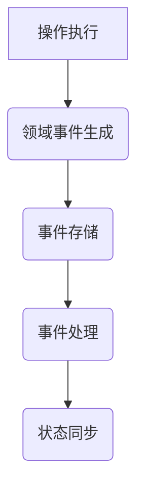
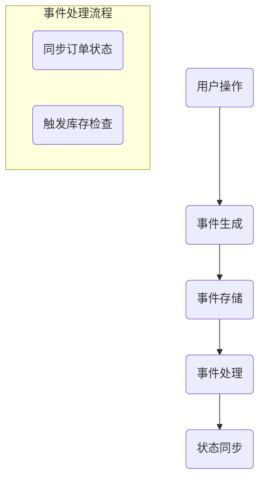
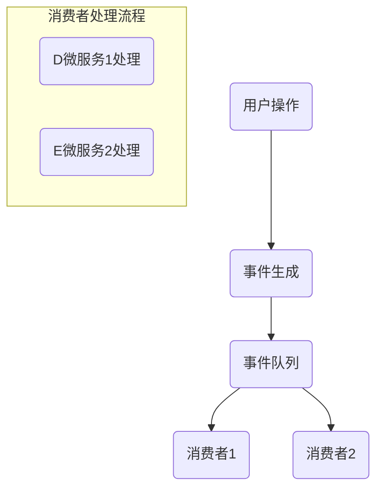
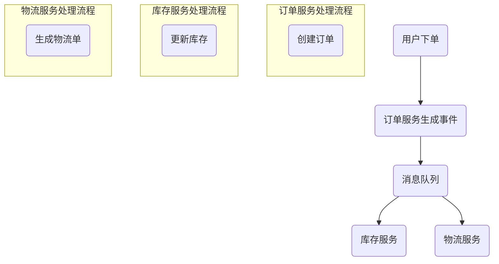
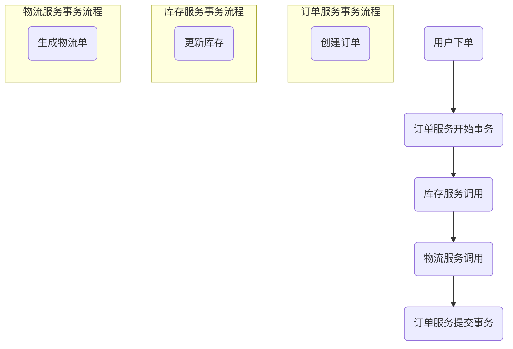

                 


### 文章标题：领域事件：在LLM微服务间传递状态变化

> 关键词：领域事件、LLM微服务、状态变化、状态同步、异步处理、一致性保障、分布式系统、事件驱动架构

> 摘要：本文将探讨领域事件在LLM微服务架构中的应用，通过分析领域事件的概念、模型和实现，深入讲解如何在LLM微服务间传递状态变化，确保系统的高效性和一致性。文章分为三个主要部分：第一部分介绍领域事件的基础知识；第二部分深入讲解领域事件在微服务架构中的应用；第三部分展示实际的项目实战和案例。通过本文的讲解，读者将能够了解领域事件在分布式系统中的重要性，掌握其在LLM微服务间的传递机制和最佳实践。

----------------------------------------------------------------

### 1. 领域事件的基础概念

领域事件（Domain Event）是一种用于描述系统中发生的重要操作的机制，通常用于日志记录、状态同步和业务规则触发等方面。领域事件与传统的系统事件（如系统启动、关闭等）不同，它更专注于业务领域中的变化，能够精确地捕捉到业务流程中的关键操作。

在LLM（Large Language Model）微服务架构中，领域事件具有以下重要性：

- **状态同步**：通过领域事件，微服务可以实时地同步状态变化，确保系统中各个服务的一致性。
- **业务规则触发**：领域事件可以触发相关的业务规则，如库存告警、订单处理等，从而实现自动化业务流程。
- **日志记录**：领域事件提供了系统日志记录的便捷方式，有助于后续的系统监控和问题排查。

领域事件的常见形式包括：

- **创建事件**：当某个实体被创建时，如用户注册、订单创建等。
- **更新事件**：当某个实体的属性发生变化时，如用户信息更新、订单状态变更等。
- **删除事件**：当某个实体被删除时，如用户注销、订单取消等。

领域事件的触发方式通常有同步和异步两种：

- **同步触发**：领域事件在操作执行的同时被触发，如在一个事务中创建事件。
- **异步触发**：领域事件在操作执行后的一段时间内被触发，如通过消息队列异步发送事件。

为了更好地理解领域事件，我们可以使用Mermaid流程图来展示其基本的流转过程：



在上述流程图中，A表示一个业务操作（如创建订单），B表示领域事件的生成，C表示事件存储，D表示事件处理，E表示状态同步。通过这个流程，我们可以看到领域事件如何在LLM微服务间传递状态变化。

### 2. 领域事件模型

领域事件模型是描述领域事件生成、传递和处理的过程，它是实现领域事件机制的核心。一个典型的领域事件模型包括以下组成部分：

- **事件源**：触发领域事件的实体，如用户操作、系统监控等。
- **事件类型**：领域事件的分类，如创建事件、更新事件、删除事件等。
- **事件数据**：领域事件携带的相关数据，如操作实体、变更属性等。
- **事件处理**：处理领域事件的逻辑，如同步状态、触发业务规则等。

在LLM微服务架构中，领域事件模型的应用场景非常广泛。以下是一个简单的领域事件模型示例：



在上述模型中，A表示用户操作，B表示事件生成，C表示事件存储，D表示事件处理，E表示状态同步。事件处理流程中的F和G分别表示同步订单状态和触发库存检查，这两个处理步骤是实现业务规则的关键。

领域事件模型的设计需要考虑以下几个关键因素：

- **可扩展性**：模型应该能够容纳新的领域事件类型和处理逻辑，以适应业务需求的变化。
- **可重用性**：模型中的处理逻辑应尽量通用，以便在不同的事件类型中复用。
- **性能优化**：事件处理过程应尽量高效，以减少系统的延迟。

为了进一步说明领域事件模型的应用，我们可以使用伪代码来描述一个简单的领域事件处理流程：

```python
# 事件生成
def generate_event(source, event_type, event_data):
    event = {
        "source": source,
        "type": event_type,
        "data": event_data
    }
    store_event(event)

# 事件存储
def store_event(event):
    # 存储事件到数据库或消息队列
    pass

# 事件处理
def handle_event(event):
    if event["type"] == "order_created":
        synchronize_order_state(event["data"])
        trigger_inventory_check(event["data"])
    elif event["type"] == "order_updated":
        synchronize_order_state(event["data"])
    elif event["type"] == "order_deleted":
        # 清理相关资源
        pass

# 同步订单状态
def synchronize_order_state(order_data):
    # 更新订单状态
    pass

# 触发库存检查
def trigger_inventory_check(order_data):
    # 检查库存并触发告警
    pass
```

通过上述伪代码，我们可以看到领域事件从生成到处理的基本流程。在实际应用中，这个流程会更加复杂，需要考虑事务管理、错误处理、异步处理等因素。

### 3. 领域事件在LLM微服务间的传递

在LLM微服务架构中，领域事件的传递是确保系统状态一致性的关键。领域事件通常通过以下方式在微服务间传递：

- **同步传递**：通过直接调用其他微服务的接口来传递领域事件，适用于低延迟、高可靠性的场景。
- **异步传递**：通过消息队列或事件总线等异步通信机制来传递领域事件，适用于高并发、高可用的场景。

以下是一个简单的异步传递领域事件的流程：



在上述流程中，A表示用户操作，B表示事件生成，C表示事件队列，D和E表示不同的微服务消费者。事件队列C充当了事件传递的中转站，确保了事件能够在不同的微服务间传递。D和E微服务的处理流程F和G分别表示它们如何根据领域事件来更新状态和处理业务逻辑。

异步传递领域事件的优势包括：

- **高可用性**：即使某些微服务出现故障，事件仍可以通过其他路径传递，确保系统整体的可用性。
- **高并发性**：事件可以并行处理，提高了系统的处理能力。
- **弹性扩展**：系统可以根据实际负载动态调整事件处理资源的分配。

然而，异步传递也存在一些挑战，如事件顺序保证、一致性问题等。为了解决这些问题，可以使用以下策略：

- **顺序保证**：通过消息队列的顺序性保证事件的顺序传递。
- **一致性保障**：通过分布式事务或最终一致性模型来保证系统状态的一致性。

为了更好地理解领域事件在LLM微服务间的传递，我们可以使用Mermaid流程图来展示一个具体的示例：



在上述流程中，A表示用户下单，B表示订单服务生成领域事件，C表示消息队列，D和E表示库存服务和物流服务的消费者。订单服务的处理流程F表示创建订单，库存服务的处理流程G表示更新库存，物流服务的处理流程H表示生成物流单。通过消息队列的异步传递，领域事件能够在订单服务、库存服务和物流服务之间传递状态变化，确保系统的一致性和高效性。

### 4. 领域事件的安全性与一致性保障

在分布式系统中，领域事件的安全性和一致性是确保系统稳定运行的关键。以下是一些常见的策略：

- **认证与授权**：通过身份认证和权限控制来保证只有授权的服务可以生成和消费领域事件。
- **数据校验**：在事件生成和传递过程中，对事件数据进行校验，确保数据的完整性和有效性。
- **分布式事务**：通过分布式事务来确保事件生成和处理的原子性，保证系统状态的一致性。
- **最终一致性模型**：在无法保证强一致性时，采用最终一致性模型来处理事件，确保系统在最终状态下的一致性。

以下是一个简单的分布式事务示例：



在上述流程中，A表示用户下单，B表示订单服务开始分布式事务，C和D分别表示库存服务和物流服务的调用，E表示订单服务提交事务。订单服务的事务流程F表示创建订单，库存服务的事务流程G表示更新库存，物流服务的事务流程H表示生成物流单。通过分布式事务，订单服务可以确保在所有调用成功后提交事务，从而保证系统状态的一致性。

### 5. 实际项目实战与案例解析

在实际项目中，领域事件的实施需要结合具体的业务需求和系统架构。以下是一个实际项目的实战案例，通过详细的开发环境搭建、源代码实现和代码解读，展示如何在LLM微服务间传递状态变化。

#### 项目背景

假设我们有一个在线购物平台，包含订单服务、库存服务和物流服务三个微服务。用户在下单后，订单服务需要生成领域事件，通知库存服务和物流服务更新状态。

#### 开发环境搭建

1. **技术选型**：
   - 服务框架：Spring Boot
   - 消息队列：RabbitMQ
   - 数据库：MySQL

2. **项目结构**：
   - 订单服务：order-service
   - 库存服务：inventory-service
   - 物流服务：logistics-service

3. **数据库设计**：
   - 订单表：orders
   - 库存表：products
   - 物流表：parcels

#### 源代码实现

1. **订单服务：事件生成**

```java
@Service
public class OrderService {
    @Autowired
    private EventProducer eventProducer;

    @Transactional
    public void createOrder(Long userId, Long productId, int quantity) {
        // 创建订单
        Order order = new Order();
        order.setUserId(userId);
        order.setProductId(productId);
        order.setQuantity(quantity);
        orderRepository.save(order);

        // 生成领域事件
        OrderCreatedEvent event = new OrderCreatedEvent(order.getId());
        eventProducer.send(event);
    }
}
```

2. **库存服务：事件消费**

```java
@Service
public class InventoryService {
    @Autowired
    private EventConsumer eventConsumer;

    @Transactional
    public void updateInventory(Long orderId) {
        // 查询订单
        Order order = orderRepository.findById(orderId).orElseThrow();

        // 更新库存
        Product product = productRepository.findById(order.getProductId()).orElseThrow();
        int newQuantity = product.getQuantity() - order.getQuantity();
        product.setQuantity(newQuantity);
        productRepository.save(product);

        // 事件消费确认
        eventConsumer.acknowledge();
    }
}
```

3. **物流服务：事件消费**

```java
@Service
public class LogisticsService {
    @Autowired
    private EventConsumer eventConsumer;

    @Transactional
    public void generateParcel(Long orderId) {
        // 查询订单
        Order order = orderRepository.findById(orderId).orElseThrow();

        // 生成物流单
        Parcel parcel = new Parcel();
        parcel.setOrderId(order.getId());
        parcelRepository.save(parcel);

        // 事件消费确认
        eventConsumer.acknowledge();
    }
}
```

#### 代码解读

1. **订单服务**：在创建订单时，通过`EventProducer`发送`OrderCreatedEvent`事件，通知库存服务和物流服务更新状态。
2. **库存服务**：在接收到`OrderCreatedEvent`后，更新库存信息，并确认事件消费。
3. **物流服务**：在接收到`OrderCreatedEvent`后，生成物流单，并确认事件消费。

#### 实际案例分析和详细讲解剖析

1. **事件生成**：当用户下单时，订单服务生成`OrderCreatedEvent`，并通过消息队列异步传递给库存服务和物流服务。
2. **状态同步**：库存服务接收到事件后，更新库存信息，确保库存减少。物流服务接收到事件后，生成物流单，确保物流信息更新。
3. **一致性保障**：通过分布式事务和消息队列的顺序性，确保订单、库存和物流状态的一致性。

#### 项目小结

通过实际项目的实现，我们可以看到领域事件在分布式系统中的应用价值。领域事件不仅能够实现微服务间的状态同步，还能提供灵活的事件驱动架构，提高系统的可扩展性和高可用性。在项目实战中，我们需要关注领域事件的安全性、一致性和性能优化，以确保系统的稳定运行。

### 6. 最佳实践、注意事项与拓展阅读

#### 最佳实践

1. **事件命名规范**：确保领域事件的命名具有明确且一致的语义，以便于后续维护和理解。
2. **事件数据结构**：领域事件的数据结构应简洁明了，避免携带过多不必要的属性，以提高事件处理的效率。
3. **异步处理策略**：根据业务需求和系统性能，合理选择异步处理策略，如消息队列、事件总线等。

#### 注意事项

1. **顺序性保障**：在异步处理中，确保事件的顺序传递，避免数据不一致。
2. **错误处理**：事件生成和处理过程中，需对错误进行处理，确保系统稳定性。
3. **性能优化**：对事件处理流程进行性能监控和优化，如事件批量处理、缓存等。

#### 拓展阅读

1. **《领域驱动设计》**：了解领域驱动设计（Domain-Driven Design，DDD）的基本概念和方法论，有助于更深入地理解领域事件的应用。
2. **《大规模分布式存储系统》**：了解分布式存储系统的设计原则和实现方法，有助于优化领域事件的数据存储和处理。

通过本文的探讨，我们深入了解了领域事件在LLM微服务间传递状态变化的机制和最佳实践。领域事件不仅能够提高系统的灵活性和可扩展性，还能确保系统状态的一致性和高可用性。在实际项目中，我们需要结合业务需求和系统架构，灵活运用领域事件机制，实现高效的分布式系统。

